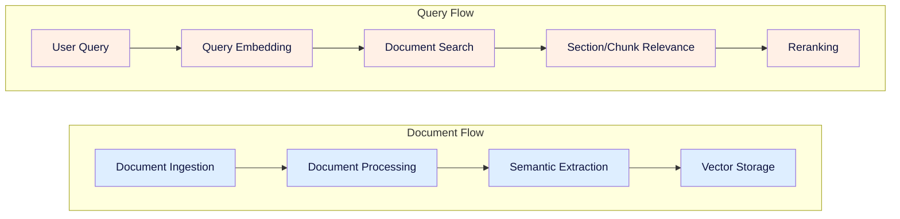
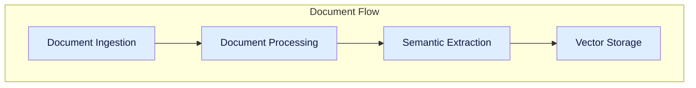
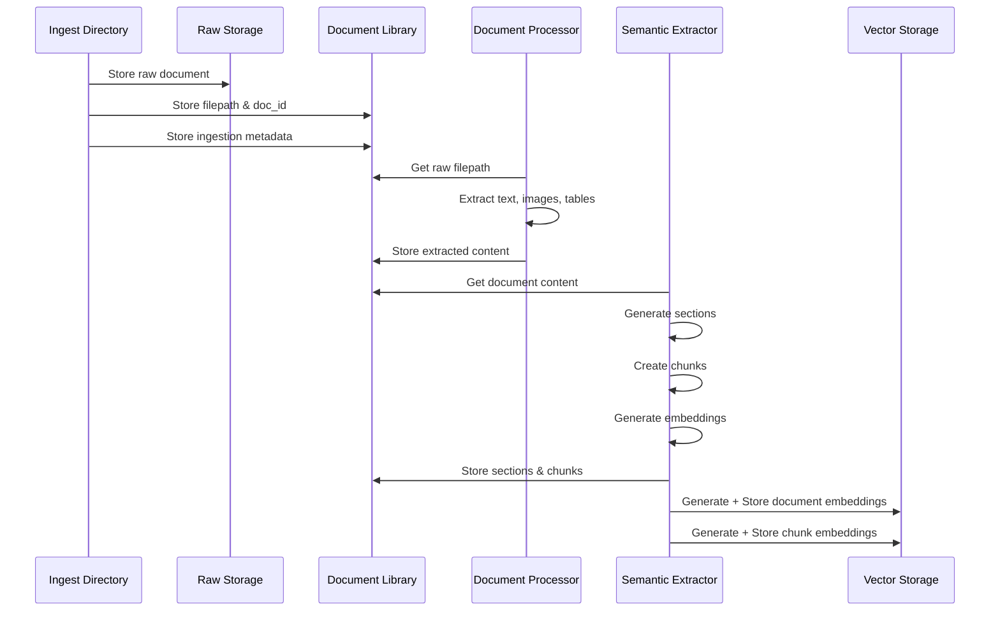
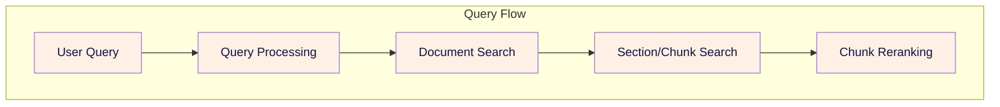
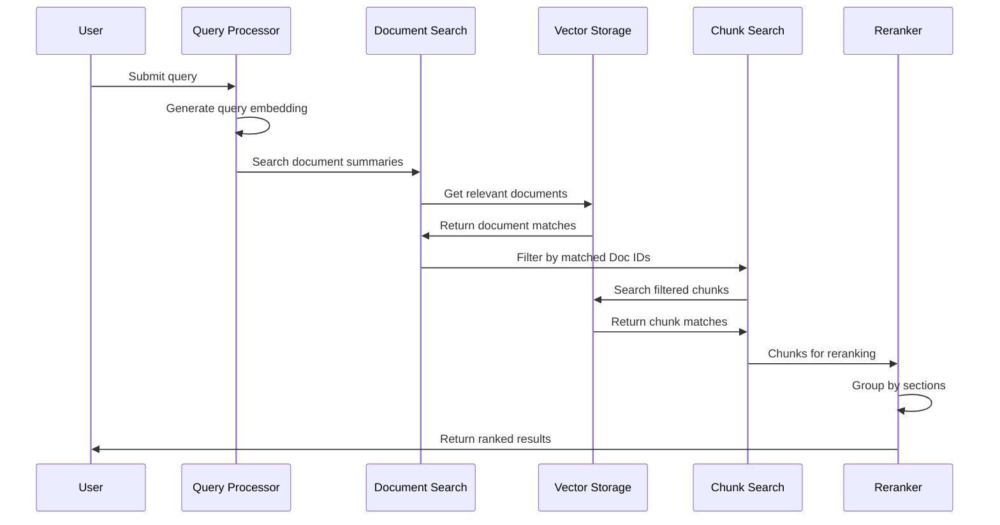

# Ragnostic Project Plan 

RAGnostic is a general system to implement heirarchal document retrieval. 

## Overview
More narrowly for the proof of concept we will make a system that searches document summaries first to filter the document list, then performs vector search on smaller chunks within filtered documents.

## MVP Scope
### Data Sources
- Wikipedia articles
- PDF documents (textbooks, journal articles)

### Initial Scale
- 25 Wikipedia articles
- 1 textbook (200 pages)
- 2 journal articles

### Target Scale
- 10,000 Wikipedia articles
- 20-50 textbooks
- Thousands of journal articles

## 1. Document Flow Components

The document flow covers the addition of new documents and their subsequent processing for search and retrieval.

### Document Ingestion

The document ingestion system serves as the primary entry point for all content entering the hierarchical RAG system. It provides a pipeline for adding new documents (i.e. Wikipedia articles and PDF documents) to the available set of documents in the library. It also manages the library storage system which consists of a flat filesystem structure for raw document/blob storage and a SQLite database for document management and metadata. 

The primary tasks of ingestion are:
- Determine if a new document already exists in the library and prevent duplication
- Manage storage of the raw documents/blobs (i.e. the original file as it was added to ingestion)
- Manage the internal Doc ID assignment for the document
- Manage the metadata assigned to the internal Doc ID (e.g. date ingested, author(s), etc)
- Manage the SQL lite database of the library documents that maps Doc ID to filepath and other metadata

### Document Processing

The document processing system serves as the  primary approach for converting documents/blobs into text and features we can use to facilitate semantic search and embedding. It provides methods for parsing, labeling, and understanding the content of documents. It is setup to work with PDF documents and wikipedia articles.

The primary task of document processing are:
- extract clean organized text from PDF files
- extract images and tables from PDF files
- update document metadata with extraction outcomes (has_images, has_tables, has_text, status, etc)
- text, image, and table extraction from wikipedia
- we primarily will use docling for PDFs

### Semantic Extraction

The semantic extraction system makes sense of the extracted content for each document. We determine logical section groupings within long documents and create image text summaries to inject in the text. Whole document summaries are obtained and associated Section IDs, page IDs, etc. are added to the document database to help with reranking later on. We also create our individual chunks and assign them relevant Chunk IDs to use later on. Each individual chunk maintains relationships to its higher level section and document(s)

### Vector Storage

The Vector Storage system implements a hierarchical search architecture using ChromaDB collections to enable efficient two-stage retrieval. It maintains separate collections for document summaries and chunks, optimizing search performance while preserving document relationships. The system provides clean interfaces for updates and searches while ensuring data consistency across collections. The search strategies enabled are a document relvance search, and a filtered chunk relevance search

### Document Flow Sequence

## 2. Query Flow

The Query flow covers the search based on a user query, along with the reranking and context organization.

### Query Processing

The query processing takes a new user query and creates an embedding of it for use in search. Additional query processing may also include query classification/labeling, keyword extraction, query rewriting.

### Document Search

The document search step takes the processed query which contains an embedding and optioonally keywords/labels to help search. The processed query is used to find relevant documents based on the document summary collection. The output of the document search is a list of Doc IDs and their associated search score. The top N Doc IDs are used in subsequent stages

### Section/Chunk Search

The section/chunk search filters the chunk collection based on the Doc IDs then performs a search using the processed query. The output of the section/chunk search is a list of Chunk IDs and their associated search score. This list is used in the reranking stage to determine the best document chunks and context.

### Chunk Reranking

The reranking approach here is based on chunk groups. We rerank based on the largest "contiguous group" and higherst score. Conceptually we want to find sections that have multiple chunks within them of relevancy indicating the section is important. We will use "section chunk coverage" as a metric which is computed as (chunks returned from section)/(total chunks in section).

### Query Flow Sequence

