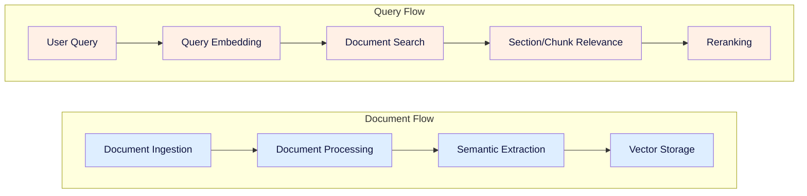
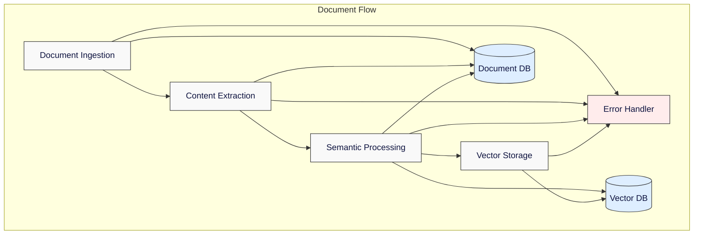
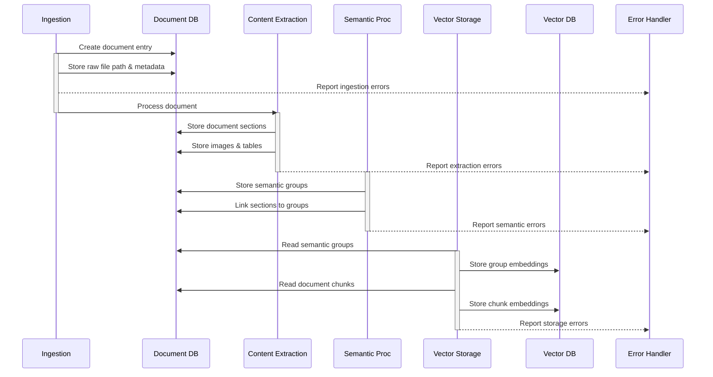
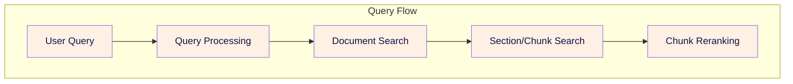
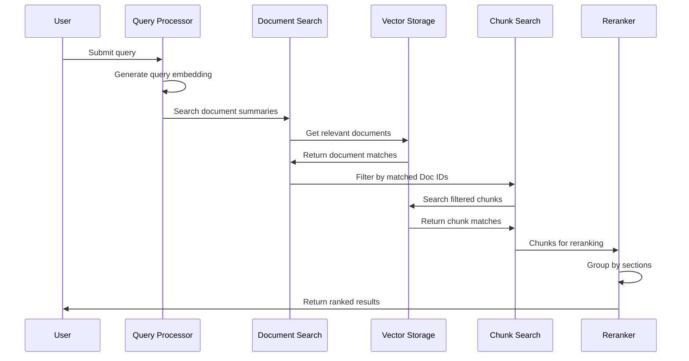

# Ragnostic Project Plan 

RAGnostic is a general system to implement heirarchal document retrieval. 

## Overview
More narrowly for the proof of concept we will make a system that searches document summaries first to filter the document list, then performs vector search on smaller chunks within filtered documents. The system consists of four main processing stages:

1. Document Ingestion: Handles raw document intake and validation
2. Content Extraction: Processes documents to extract text, images, and tables
3. Semantic Processing: Creates searchable chunks and embeddings
4. Vector Storage: Manages document and chunk embeddings for search

## MVP Scope
### Data Sources
- Wikipedia articles
- PDF documents (textbooks, journal articles)

### Initial Scale
- 25 Wikipedia articles
- 1 textbook (200 pages)
- 2 journal articles

### Target Scale
- 10,000 Wikipedia articles
- 20-50 textbooks
- Thousands of journal articles

## 1. Document Flow Components

The document flow covers the complete pipeline from raw document intake through searchable content creation.

### Document Ingestion

The document ingestion system serves as the primary entry point for all content entering the hierarchical RAG system. It provides a pipeline for adding new documents (i.e. Wikipedia articles and PDF documents) to the available set of documents in the library. It also manages the library storage system which consists of a flat filesystem structure for raw document/blob storage and a SQLite database for document management and metadata.

Key responsibilities:
- Document validation and deduplication
- Raw document storage management
- Document ID and metadata management
- Basic content extraction for initial processing
- SQLite database management for document tracking

### Content Extraction

The content extraction system processes raw documents into structured content. It provides methods for parsing, labeling, and understanding the content of documents. 

Key responsibilities:
- Text extraction and cleaning
- Image and table identification/extraction
- Image and table caption generation
- Content relationship mapping
- Content storage in structured database format

### Semantic Processing

The semantic processing system prepares content for efficient search. We makes sense of the extracted content for each document organizing around logical section groupings as opposed to document level. Whole semantic group summaries are obtained are added to the document database to help with reranking later on. We also create our individual chunks and assign them relevant Chunk IDs to use later on. Each individual chunk maintains relationships to its higher level section and document(s)

 Key responsibilities:
- Section and chunk boundary detection
- Summary generation at multiple levels
- Semantic group creation and management
- Embedding generation for all content types

### Vector Storage

The vector storage system implements a hierarchical search architecture using ChromaDB. It maintains separate collections for semantic group summaries and chunks, optimizing search performance while preserving relationships. The system provides clean interfaces for updates and searches while ensuring data consistency across collections. The search strategies enabled are a document relvance search, and a filtered chunk relevance search.

Key responsibilities:
- Separate collections for summaries and chunks
- Metadata management for filtering
- Collection consistency maintenance
- Search optimization management
- Relationship preservation across collections

## Database Architecture

The system uses a combination of SQLite and ChromaDB for data management:

### Document Database (SQLite)
Manages four key areas:
- Document Management: Core document tracking and metadata
- Content Storage: Sections, images, and tables
- Semantic Groups: Section groupings and relationships
- Processing Status: Pipeline stage tracking

### Vector Database (ChromaDB)
Maintains two primary collections:
- Semantic Summaries: Document and section-level embeddings
- Semantic Chunks: Fine-grained content embeddings

## System Monitoring and Error Handling

### Error Management
Each pipeline stage implements specific error handling:
- Ingestion: File system and validation errors
- Extraction: Processing and parsing errors
- Semantic: Generation and embedding errors
- Storage: Database and vector store errors

### System Monitoring
Key metrics tracked across stages:
- Processing performance and throughput
- Error rates and types
- Storage utilization and performance
- Search quality and response times

## Document Support

### Supported Document Types
- PDF Documents
  * Academic papers and articles
  * Textbooks and manuals
  * Technical documentation
- Web Content
  * Wikipedia articles
  * HTML documents
  * Structured web pages

### Processing Requirements
Each document type has specific processing needs:
- PDFs: Structure extraction, image/table processing
- Web Content: HTML parsing, media extraction
- Common: Text cleaning, semantic analysis

## 2. Query Flow

The Query flow covers the search based on a user query, along with the reranking and context organization.

### Query Processing

The query processing takes a new user query and creates an embedding of it for use in search. Additional query processing may also include query classification/labeling, keyword extraction, query rewriting.

### Document Search

The document search step takes the processed query which contains an embedding and optioonally keywords/labels to help search. The processed query is used to find relevant documents based on the document summary collection. The output of the document search is a list of Doc IDs and their associated search score. The top N Doc IDs are used in subsequent stages

### Section/Chunk Search

The section/chunk search filters the chunk collection based on the Doc IDs then performs a search using the processed query. The output of the section/chunk search is a list of Chunk IDs and their associated search score. This list is used in the reranking stage to determine the best document chunks and context.

### Chunk Reranking

The reranking approach here is based on chunk groups. We rerank based on the largest "contiguous group" and higherst score. Conceptually we want to find sections that have multiple chunks within them of relevancy indicating the section is important. We will use "section chunk coverage" as a metric which is computed as (chunks returned from section)/(total chunks in section).

### Query Flow Sequence

