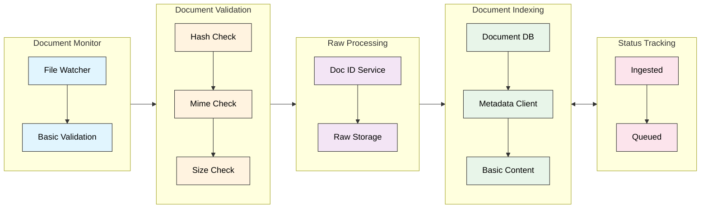
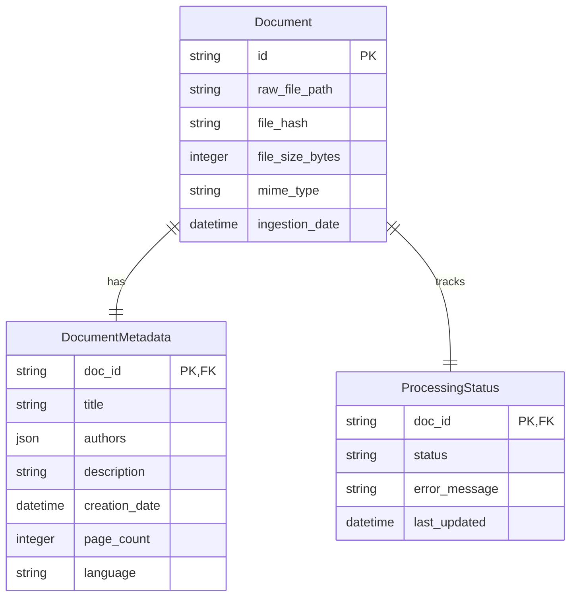

# Document Ingestion Technical Specification

## Overview

### Purpose
This document outlines the document ingestion implementation, which takes new documents and adds them to our database along with text and document information extraction. Ingestion incudes raw blob, metadata, and extracted information storage.

### Scope
The system is responsible for:
- Monitoring ingestion folder for new documents
- Assessing validity of ingestion documents (i.e. no duplicates)
- Assigning doc ids and moving new documents into our document database
- extracting and storing document file metadata (size, etc.)
- running feature extraction on documents (text, images, tables, etc)

### System Context
- Input: New PDF document or wikipedia url
- Output: document database entry, raw file blob
- Dependencies: 

## System Architecture

### Processing Stages



## 1. Document Monitor
### 1.1 File Monitor Service
- Implements Python watchdog for directory monitoring
- Supports PDF files initially
- Basic validation:
  * File exists and is readable
  * Valid PDF format

## 2. Document Validation
### 2.1 Duplicate Checks
- Calculate file hash (SHA-256)
- Check against existing document hashes in database
- Skip ingestion if duplicate found

### 2.2 Validation Checks
- mime type
- file size limits
- not corrupted


## 3. Raw Processing
### 3.1 Document id service
Issues new document ids for valid documents
- Move file to raw storage with new doc_id-based filename
- Basic file system operations only
- No complex processing at this stage
- updates document database

### 3.2 File Organization
Raw document blobs are stored in a flat filesystem
- will initially store locally
- easy switch to S3 like storage (i.e. cloud)

```
/raw_documents/
└── {doc_id}.pdf
```

## 4. Document Indexing

### 3.1 Document Database Core Schema
For the indexing process and raw file storage we maintain the mapping from raw file to database entry
-  metadata allows for search and retrieval

**Document Core Schema**
```sql
------------------------------------------------------------------
-- Core Document Management
------------------------------------------------------------------

-- Primary document tracking
CREATE TABLE documents (
    id TEXT PRIMARY KEY,
    raw_file_path TEXT NOT NULL,            -- Path to original file
    file_hash TEXT NOT NULL,                -- For deduplication
    file_size_bytes INTEGER NOT NULL,
    mime_type TEXT NOT NULL,
    ingestion_date DATETIME NOT NULL DEFAULT CURRENT_TIMESTAMP
);

-- Basic document metadata
CREATE TABLE document_metadata (
    doc_id TEXT PRIMARY KEY,
    title TEXT,
    authors TEXT,                           -- JSON array
    description TEXT,
    creation_date DATETIME,
    page_count INTEGER,
    language TEXT,
    FOREIGN KEY (doc_id) REFERENCES documents(id)
);
```

**Document ER Diagram**


### 3.2 Document database python client
- client for accessing database in python
- document CRUD
- document search (fuzzy text search on description and/or title?)
- faceted filter on date ingested, etc.


### 3.3 Basic Document processing

Initial document extaraction is handled by the `pymupdf4llm` package. It pulls easily available raw text and metadata WIHTOUT complex dependencies. The primary role is:
- Store the raw document for processing
- Create initial document metadata entry
- Initial content for basic or fuzzy search (keyword/queries)
- Utilize minimal LLM or heavy pytorch code (can install as a small subset of package and use in many systems)
- Is fast and failure proof


## Error Handling
### Ingestion Error Types
1. File System Errors:
   - File not found
   - Permission denied
   - Storage full
   - Invalid file permissions

2. Validation Errors:
   - Invalid file format
   - File too large
   - Duplicate document
   - Corrupted file

3. Database Errors:
   - Metadata insertion failure
   - Status tracking failure
   - Document record creation failure

Note: Document processing and extraction errors are handled by the Document Extraction system (see Document_Extraction.md)

