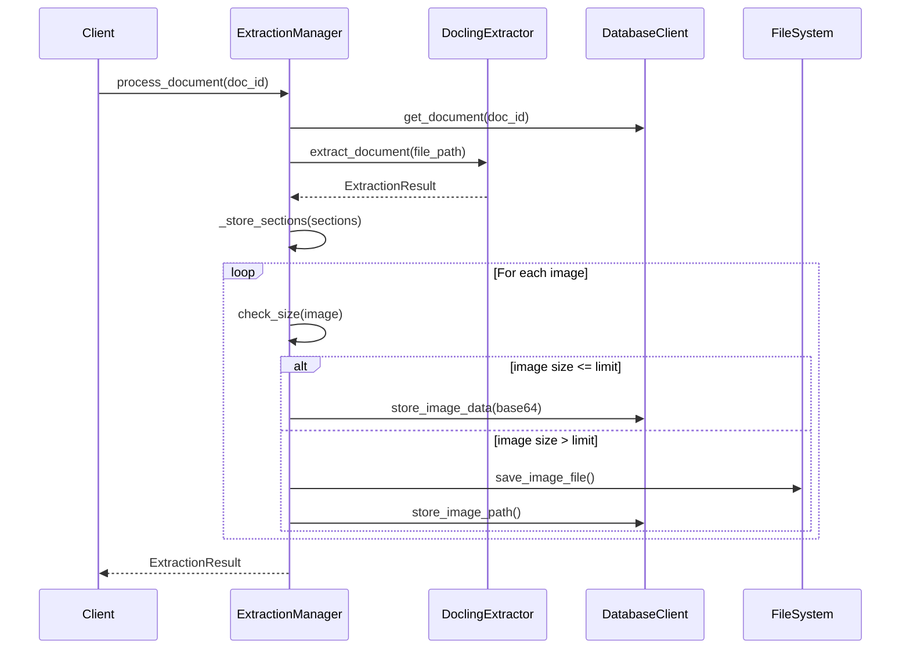

# Document Extraction System Design

## Overview

The document extraction system processes PDFs to extract text, images, and structural information. It uses a pluggable architecture to support multiple extraction backends while focusing initially on docling.

### Document Extraction Flow



### Implementation Notes

1. **Error Handling**
   - Each component includes detailed error messages
   - Failures in one section don't stop entire process
   - All errors logged and included in result

2. **Image Storage Strategy**
   - Images under size_limit stored as base64 in database
   - Larger images saved to filesystem
   - All metadata stored in database regardless of storage location

3. **Section Confidence**
   - Low default confidence for auto-detected sections
   - Allows for manual verification or semantic processing
   - Sections can be merged/split in semantic stage

4. **Future Considerations**
   - Easy to add new extractors
   - Storage strategy can be modified
   - Caption generation can be added
   - Section detection can be enhanced

## Core Components

### 1. Base Interfaces

#### 1.1 Extraction Results
```python
from typing import Protocol, List, Optional
from datetime import datetime
from pathlib import Path
from pydantic import BaseModel

class ExtractedImage(BaseModel):
    """Represents an extracted image with metadata"""
    image_data: bytes
    format: str
    size_bytes: int
    page_number: int
    bbox: tuple[float, float, float, float]  # x1, y1, x2, y2 coordinates
    confidence: float = 1.0

class ExtractedSection(BaseModel):
    """Represents a detected document section"""
    title: str
    content: str
    level: int
    page_start: int
    page_end: int
    confidence: float = 0.0  # Default low confidence for sections

class ExtractionResult(BaseModel):
    """Contains all extracted content from a document"""
    doc_id: str
    sections: List[ExtractedSection]
    images: List[ExtractedImage]
    extraction_date: datetime
    extractor_name: str
    error_messages: List[str] = []
```

#### 1.2 Error Handling Models
```python
from enum import Enum
from typing import List, Optional
from pydantic import BaseModel

class ExtractionErrorType(Enum):
    PARSER_ERROR = "parser_error"
    IMAGE_EXTRACTION_ERROR = "image_extraction"
    SECTION_ERROR = "section_error"
    STORAGE_ERROR = "storage_error"

class ExtractionError(BaseModel):
    error_type: ExtractionErrorType
    message: str
    section_id: Optional[str] = None
    page_number: Optional[int] = None
    recoverable: bool = True
```


### 2. Document Extraction Interface

#### 2.1 Pluggable Extraction

```python
class DocumentExtractor(Protocol):
    """Base protocol for document extractors"""
    name: str
    
    def extract_document(self, file_path: Path) -> ExtractionResult:
        """Extract content from document"""
        ...
```

#### 2.2 Docling Implementation

```python
class DoclingExtractor:
    """Docling-based document extractor"""
    name: str = "docling"
    
    def extract_document(self, file_path: Path) -> ExtractionResult:
        # Implementation will be added later when we have docling context
        ...
```

### 3. Extraction Workflow

#### 3.1 Extraction Manager

Triggers and runs the extraction

```python
class ExtractionManager:
    """Manages document extraction process"""
    def __init__(self, 
                 db_client: DatabaseClient,
                 extractor: DocumentExtractor,
                 image_size_limit: int = 1_000_000):  # 1MB default
        self.db_client = db_client
        self.extractor = extractor
        self.image_size_limit = image_size_limit
    
    def process_document(self, doc_id: str) -> ExtractionResult:
        """Process a single document"""
        ...
    
    def _store_sections(self, doc_id: str, sections: List[ExtractedSection]) -> None:
        """Store extracted sections in database"""
        ...
    
    def _store_images(self, doc_id: str, images: List[ExtractedImage]) -> None:
        """Store extracted images in database or filesystem"""
        ...
```
#### 3.2 Extraction Progress Tracking

Logger for the process

```python
from contextlib import contextmanager
from time import time
from typing import Iterator

class ExtractionProgress:
    def __init__(self, total_pages: int):
        self.total_pages = total_pages
        self.current_page = 0
        self.start_time = time()
        self.section_count = 0
        self.image_count = 0
        
    @property
    def progress(self) -> float:
        return self.current_page / self.total_pages
        
    @property
    def elapsed_time(self) -> float:
        return time() - self.start_time

    def update(self, page: int, sections: int = 0, images: int = 0):
        self.current_page = page
        self.section_count += sections
        self.image_count += images
        
        # Log progress every 10% or every 5 minutes
        if self.progress % 0.1 < 0.01 or self.elapsed_time % 300 < 1:
            logging.info(
                f"Progress: {self.progress:.1%} | "
                f"Page {self.current_page}/{self.total_pages} | "
                f"Found {self.section_count} sections, {self.image_count} images | "
                f"Time: {self.elapsed_time:.1f}s"
            )

@contextmanager
def track_extraction(doc_id: str, total_pages=100) -> Iterator[ExtractionProgress]:
    tracker = ExtractionProgress(total_pages=total_pages)  # Get from doc metadata
    try:
        yield tracker
    finally:
        logging.info(f"Extraction complete for {doc_id}")
        logging.info(f"Total time: {tracker.elapsed_time:.1f}s")
        logging.info(f"Found: {tracker.section_count} sections, {tracker.image_count} images")
```


### 4. Database Updates

#### 4.1 Modified Image Table Schema

We want to add a confidence score to the database for sections

```sql
CREATE TABLE document_images (
    id INTEGER PRIMARY KEY AUTOINCREMENT,
    doc_id TEXT NOT NULL,
    section_id TEXT NOT NULL,
    page_number INTEGER NOT NULL,
    image_data TEXT NOT NULL,           -- Base64 encoded if small
    file_path TEXT,                     -- Path if stored on filesystem
    caption TEXT,
    image_format TEXT NOT NULL,         -- e.g., 'png', 'jpg'
    image_size INTEGER NOT NULL,        -- Size in bytes
    bbox TEXT NOT NULL,                 -- JSON encoded coordinates
    confidence FLOAT NOT NULL DEFAULT 1.0,
    FOREIGN KEY (doc_id) REFERENCES documents(id),
    FOREIGN KEY (section_id) REFERENCES document_sections(section_id)
);
```

#### 4.2 Section Schema confidence

Modified Section Schema

```sql
-- Document's physical section structure
CREATE TABLE document_sections (
    section_id TEXT PRIMARY KEY,
    doc_id TEXT NOT NULL,
    parent_section_id TEXT,
    level INTEGER NOT NULL,                 -- Header level (1=H1, etc)
    title TEXT NOT NULL,
    content TEXT NOT NULL,
    sequence_order INTEGER NOT NULL,        -- Order in document
    page_start INTEGER,
    page_end INTEGER,
    extraction_confidence FLOAT NOT NULL DEFAULT 0.0;
    extraction_method TEXT;  -- Store which extractor found this section
    FOREIGN KEY (doc_id) REFERENCES documents(id),
    FOREIGN KEY (parent_section_id) REFERENCES document_sections(section_id)
)
```

We can use confidence to help with subsequent semantic analysis. The system uses a 0.0-1.0 confidence scale for sections:

1. **Low Confidence (0.0-0.3)**
   - Basic header matching only
   - Potential false positives
   - Requires semantic verification
   - Example: Text size changes or basic formatting hints

2. **Medium Confidence (0.3-0.7)**
   - Clear header markers found
   - Logical structure present
   - May need refinement
   - Example: Consistent formatting with numbering

3. **High Confidence (0.7-1.0)**
   - Strong structural indicators
   - Clear hierarchical markers
   - PDF bookmarks present
   - Example: Document outline or ToC matches

Usage in semantic processing:

```python
def process_sections(sections: List[DocumentSection]):
    for section in sections:
        if section.extraction_confidence < 0.3:
            # Apply aggressive semantic analysis
            # Consider merging with nearby sections
        elif section.extraction_confidence < 0.7:
            # Validate against document structure
            # Check for logical breaks
        else:
            # Trust section boundaries
            # Focus on content analysis
```

### 5. Image Processing and Storage

#### 5.1 Image Handler Component

```python
from dataclasses import dataclass
from pathlib import Path
from typing import Optional, Protocol

@dataclass
class ImageMetadata:
    """Metadata for extracted image"""
    format: str
    width: int
    height: int
    size_bytes: int
    dpi: Optional[tuple[int, int]] = None
    color_space: Optional[str] = None

class ImageCaptioner(Protocol):
    """Protocol for image captioning services"""
    def generate_caption(self, image_data: bytes, context: str) -> str:
        """Generate caption for image using surrounding context"""
        ...

class ImageHandler:
    """Handles image processing, storage, and captioning"""
    def __init__(
        self,
        db_client: DatabaseClient,
        storage_dir: Path,
        captioner: Optional[ImageCaptioner] = None,
        size_limit: int = 1_000_000,  # 1MB
    ):
        self.db_client = db_client
        self.storage_dir = storage_dir
        self.captioner = captioner
        self.size_limit = size_limit
        
    def process_image(
        self,
        image_data: bytes,
        doc_id: str,
        section_id: str,
        context: str
    ) -> DocumentImage:
        """Process and store a single image"""
        metadata = self._extract_metadata(image_data)
        
        # Determine storage method
        if metadata.size_bytes <= self.size_limit:
            stored_image = self._store_in_db(image_data, metadata)
        else:
            stored_image = self._store_in_fs(image_data, metadata, doc_id)
            
        # Generate caption if captioner available
        caption = None
        if self.captioner:
            try:
                caption = self.captioner.generate_caption(image_data, context)
            except Exception as e:
                logging.error(f"Caption generation failed: {e}")
                
        return self._create_db_record(
            doc_id=doc_id,
            section_id=section_id,
            stored_image=stored_image,
            metadata=metadata,
            caption=caption
        )
        
    def _extract_metadata(self, image_data: bytes) -> ImageMetadata:
        """Extract image metadata using Pillow"""
        ...
        
    def _store_in_db(
        self, 
        image_data: bytes, 
        metadata: ImageMetadata
    ) -> StoredImage:
        """Store image as base64 in database"""
        ...
        
    def _store_in_fs(
        self, 
        image_data: bytes, 
        metadata: ImageMetadata,
        doc_id: str
    ) -> StoredImage:
        """Store image in filesystem"""
        ...
```

#### 5.2 Storage Strategy

The system uses a hybrid storage approach based on image size:

1. **Database Storage (≤ 1MB)**
   - Convert to base64
   - Store directly in SQLite
   - Faster retrieval for small images
   - Simpler backup/restore

2. **Filesystem Storage (> 1MB)**
   - Save to organized directory structure
   - Store path reference in database
   - Better performance for large images
   - Reduced database bloat

Directory Structure:
```
storage_dir/
└── images/
    └── {doc_id}/
        └── {image_id}.{format}
```

#### 5.3 Image Captioning

The system supports pluggable captioning services:

```python
class LLMImageCaptioner:
    """LLM-based image captioning implementation"""
    def __init__(self, llm_client: Any):
        self.llm_client = llm_client
        
    def generate_caption(self, image_data: bytes, context: str) -> str:
        """Generate caption using LLM"""
        # Convert image for LLM if needed
        # Combine with context
        # Generate caption
        # Return formatted result
        ...

class MockCaptioner:
    """Simple captioner for testing"""
    def generate_caption(self, image_data: bytes, context: str) -> str:
        return "Test caption for image"
```

Caption Generation Process:
1. Extract surrounding text context
2. Process image if needed (resize, format)
3. Generate caption with LLM
4. Validate and store result

#### 5.4 Image Processing Utilities

```python
class ImageProcessor:
    """Utilities for image processing"""
    @staticmethod
    def validate_image(image_data: bytes) -> bool:
        """Validate image data is correct and not corrupted"""
        ...
        
    @staticmethod
    def standardize_format(
        image_data: bytes,
        target_format: str = 'PNG'
    ) -> tuple[bytes, str]:
        """Convert image to standard format"""
        ...
        
    @staticmethod
    def optimize_image(
        image_data: bytes,
        max_size: int
    ) -> tuple[bytes, ImageMetadata]:
        """Optimize image while maintaining quality"""
        ...
```


