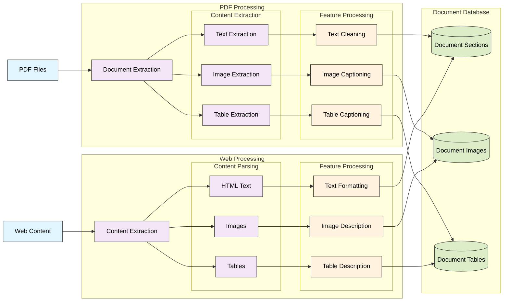
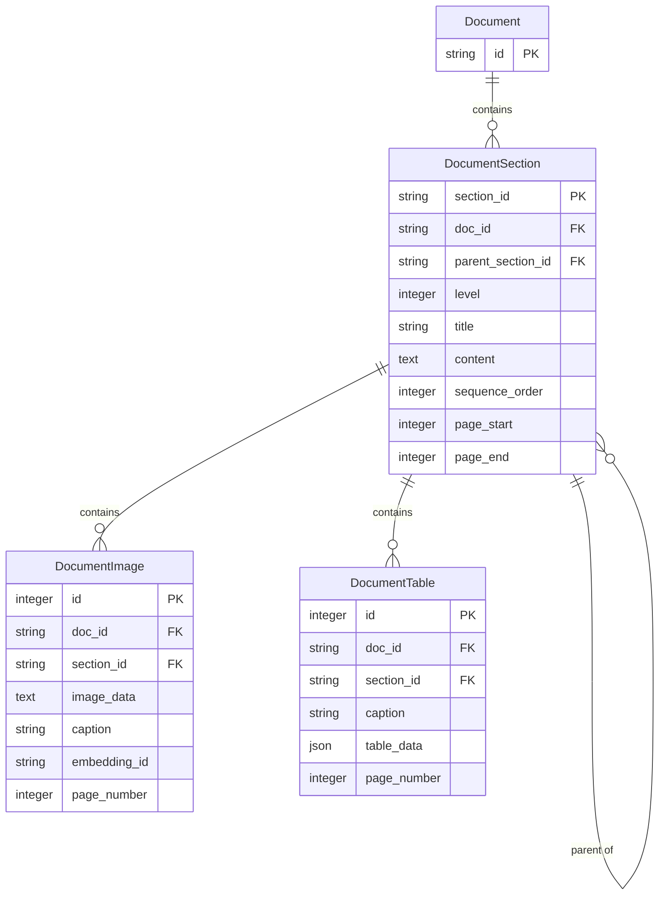
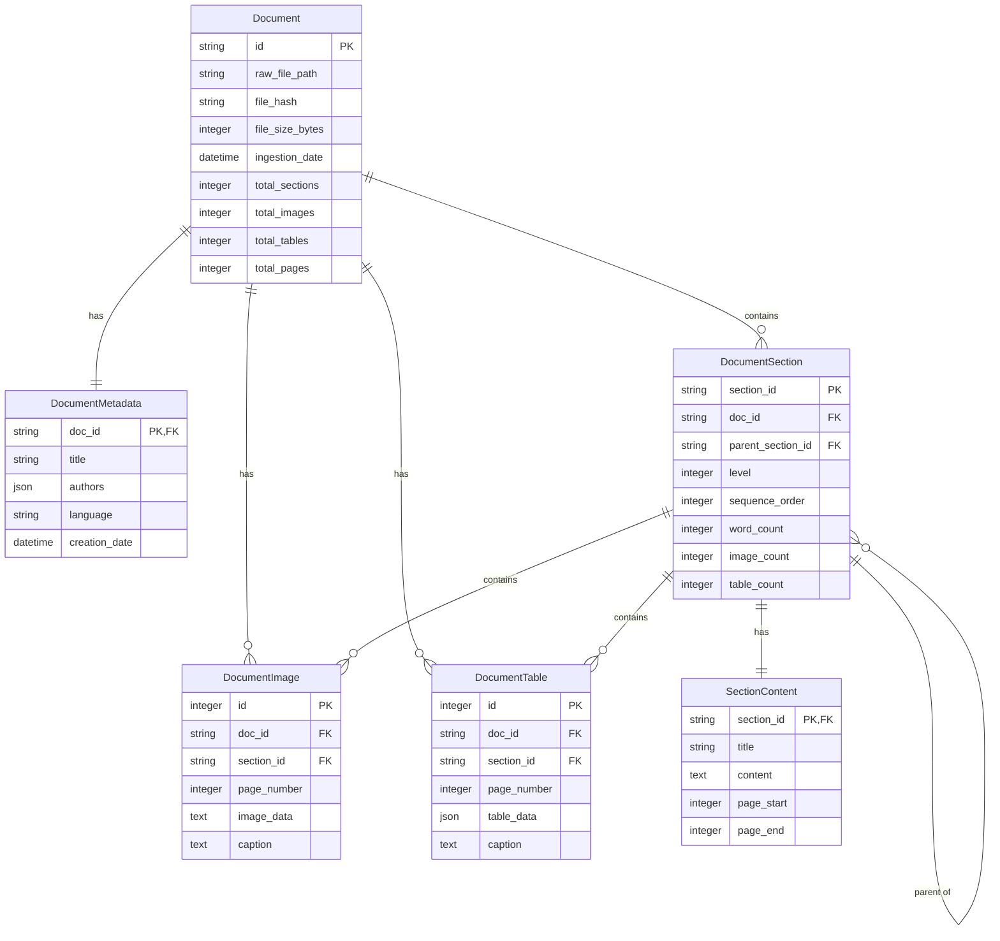

# Document Extraction Technical Specification

## Overview

### Purpose
This document specifies the document processing/extraction system implementation, which transforms raw documents (PDFs and web content) into extracted content with features (text, images, tables) and their associated metadata within the RAGnostic architecture.

### Scope
The system is responsible for:
- Extracting clean text content from documents
- Identifying and extracting document structure (sections, headers)
- Extracting and processing images and tables
- Generating captions for media content
- Storing processed content in structured database format
- Maintaining relationships between document elements

### System Context
- Input: Raw PDF documents and web content from Document Ingestion pipeline
- Output: Structured document content in SQLite database
- Dependencies: Document Ingestion system

## System Architecture



## 1. PDF Processing Pipeline
### 1.1 Document Extraction
- Input: Raw PDF file
- Primary tools: `docling` and `marker-pdf`
- Process:
  * Load PDF document
  * Extract document structure
  * Identify sections and headers
  * Track page numbers and positions
- Output: Initial document structure with section markers

### 1.2 Content Extraction
- Text Extraction:
  * Clean text content
  * Header identification
  * Section boundary detection
  * Page tracking
- Image Extraction:
  * Image location identification
  * Image data extraction
  * Format standardization
  * Reference tracking
- Table Extraction:
  * Table boundary detection
  * Structure preservation
  * Cell content extraction
  * Position tracking

### 1.3 Feature Processing
- Text Cleaning:
  * Format standardization
  * Special character handling
  * Section relationship mapping
  * Content validation
- Image Captioning:
  * Context assembly
  * Caption generation
  * Quality validation
- Table Captioning:
  * Structure analysis
  * Content summarization
  * Context integration

## 2. Web Content Pipeline
### 2.1 Content Extraction
- Input: Web article URL or content
- Primary tools: `wikipedia` and `wikipedia-api`
- Process:
  * Content retrieval
  * Structure parsing
  * Media reference extraction

### 2.2 Content Parsing
- HTML Text:
  * Clean text extraction
  * Structure preservation
  * Link handling
- Image Processing:
  * Reference extraction
  * Metadata collection
  * Source tracking
- Table Processing:
  * Structure extraction
  * Format preservation
  * Cell content parsing

### 2.3 Feature Processing
- Text Formatting:
  * Style normalization
  * Section organization
  * Reference tracking
- Image Description:
  * Context integration
  * Description generation
  * Reference mapping
- Table Description:
  * Structure analysis
  * Content summarization
  * Context integration

## 3. Storage System
### 3.1 Database Schema

**Datamodel Schema**
```sql
-- Document's physical section structure
CREATE TABLE document_sections (
    section_id TEXT PRIMARY KEY,
    doc_id TEXT NOT NULL,
    parent_section_id TEXT,
    level INTEGER NOT NULL,                 -- Header level (1=H1, etc)
    title TEXT NOT NULL,
    content TEXT NOT NULL,
    sequence_order INTEGER NOT NULL,        -- Order in document
    page_start INTEGER,
    page_end INTEGER,
    FOREIGN KEY (doc_id) REFERENCES documents(id),
    FOREIGN KEY (parent_section_id) REFERENCES document_sections(section_id)
);

-- Document images
CREATE TABLE document_images (
    id INTEGER PRIMARY KEY,
    doc_id TEXT NOT NULL,
    section_id TEXT NOT NULL,
    image_data TEXT NOT NULL,               -- Base64 encoded
    caption TEXT,                           -- Extracted or generated caption
    embedding_id TEXT,                      -- Vector store reference
    page_number INTEGER NOT NULL,
    FOREIGN KEY (doc_id) REFERENCES documents(id),
    FOREIGN KEY (section_id) REFERENCES document_sections(section_id)
);

-- Document tables
CREATE TABLE document_tables (
    id INTEGER PRIMARY KEY,
    doc_id TEXT NOT NULL,
    section_id TEXT NOT NULL,
    caption TEXT,
    table_data TEXT NOT NULL,               -- JSON structured data
    page_number INTEGER NOT NULL,
    FOREIGN KEY (doc_id) REFERENCES documents(id),
    FOREIGN KEY (section_id) REFERENCES document_sections(section_id)
);
```

**ER Diagram**

  
### 3.2 Storage Operations
- Section Storage:
  * Hierarchical relationship maintenance
  * Order preservation
  * Content integrity checks
- Image Storage:
  * Binary data handling
  * Caption association
  * Section mapping
- Table Storage:
  * Structure preservation
  * JSON serialization
  * Context tracking

## 4. Error Handling
### 4.1 Processing Errors
- Document parsing failures
- Image extraction errors
- Table structure issues
- Caption generation failures

### 4.2 Storage Errors
- Database constraints
- Data integrity issues
- Relationship violations

### 4.3 Recovery Strategy
- Partial content preservation
- Error logging
- Processing continuation
- Cleanup procedures

## 5. Monitoring and Metrics
### 5.1 Processing Metrics
- Document processing time
- Feature extraction success rates
- Caption generation quality
- Error rates by type

### 5.2 Storage Metrics
- Database size
- Query performance
- Relationship integrity
- Storage efficiency

## 6. Future Considerations
- Additional document format support
- Enhanced caption generation
- Improved table structure detection
- Advanced error recovery
- Performance optimization
- Cloud storage integration


# ----- WORKING -----
## Document Database Diagram

