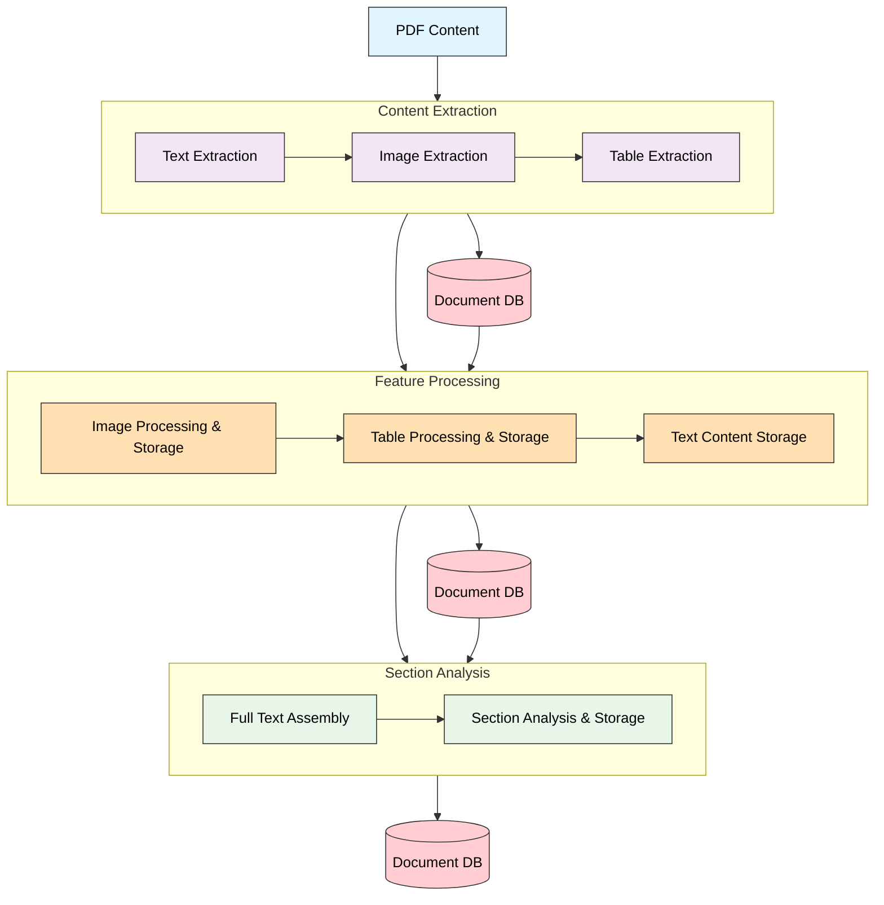
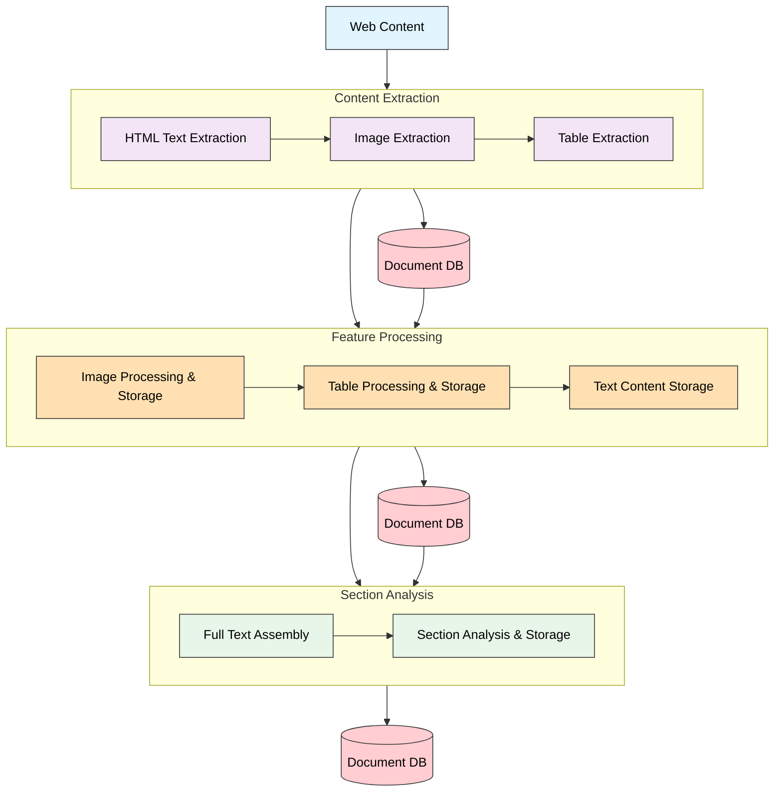
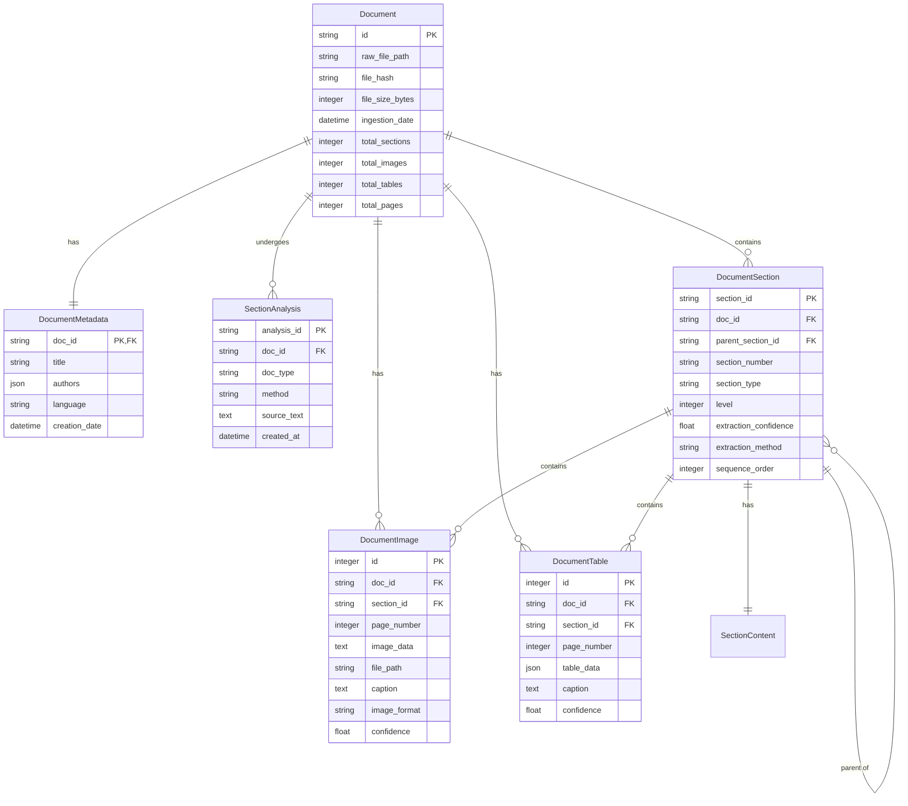

# Document Extraction Technical Specification

## Overview

### Purpose
This document specifies the document processing/extraction system implementation, which transforms raw documents (PDFs and web content) into extracted content with features (text, images, tables) and their associated metadata within the RAGnostic architecture.

### Scope
The system is responsible for:
- Extracting clean text content from documents
- Identifying and extracting document structure (sections, headers)
- Extracting and processing images and tables
- Generating captions for media content
- Storing processed content in structured database format
- Maintaining relationships between document elements

### System Context
- Input: Raw PDF documents and web content from Document Ingestion pipeline
- Output: Structured document content in SQLite database
- Dependencies: Document Ingestion system

## System Architecture

### PDF Flow

  
## 1. PDF Processing Pipeline
### 1.1 Content Extraction Phase
- Input: Raw PDF file 
- Primary tools: `docling` and `marker-pdf` (see 2b.1_DocumentExtraction_ContentExtraction_Design Section 2.2)
- Components:
  * Text Extraction
    - Clean text content extraction
    - Initial structure identification
    - Header and section boundary detection
    - Page number tracking
  * Image Extraction
    - Image location identification 
    - Raw image data extraction
    - Reference tracking with page positions
  * Table Extraction
    - Table boundary detection
    - Raw table content extraction
    - Position tracking within document
- Output: Raw extracted content stored in Document DB with reference tracking

### 1.2 Feature Processing Phase
- Process raw extracted content (see 2b.1_DocumentExtraction_ContentExtraction_Design Section 5)
- Components:
  * Image Processing & Storage
    - Format standardization
    - Size-based storage strategy (DB vs filesystem)
    - Caption generation via pluggable service
    - Quality validation
  * Table Processing & Storage 
    - Structure preservation
    - Content summarization
    - Context integration
    - Caption generation
  * Text Content Storage
    - Format standardization
    - Special character handling
    - Content validation
- Output: Processed content stored in Document DB with enhanced metadata

### 1.3 Section Analysis Phase
(Reference 2b.2_DocumentExtraction_Sectioning_Design Section 1 & 2)
- Components:
  * Full Text Assembly
    - Combine processed content
    - Maintain hierarchical structure
    - Track section relationships
  * Section Analysis & Storage
    - Section boundary detection
    - Hierarchical numbering
    - Parent-child relationship mapping
    - Content organization
- Output: Fully structured document content in Document DB


## 2. Web Content Pipeline

### Web Flow



## 2. Web Processing Pipeline

### 2.1 Content Extraction Phase
- Input: Web article URL or content
- Primary tools: `wikipedia` and `wikipedia-api` 
- Components:
  * HTML Text Extraction
    - Clean text extraction from HTML
    - Initial structure identification
    - Link handling and preservation
    - Content sanitization
  * Image Extraction
    - Image reference identification
    - Source URL tracking
    - Initial metadata collection
  * Table Extraction
    - HTML table structure parsing
    - Cell content extraction
    - Format identification
- Output: Raw extracted web content stored in Document DB with reference tracking

### 2.2 Feature Processing Phase
(Reference 2b.1_DocumentExtraction_ContentExtraction_Design Section 5)
- Components:
  * Image Processing & Storage
    - Image download and verification
    - Size-based storage strategy
    - Caption/description generation
    - Source reference preservation
  * Table Processing & Storage
    - Structure normalization
    - Content cleanup and formatting
    - Context integration
    - Description generation
  * Text Content Storage
    - Style normalization
    - Link relationship preservation
    - Content validation
- Output: Processed web content stored in Document DB with enhanced metadata

### 2.3 Section Analysis Phase
(Reference 2b.2_DocumentExtraction_Sectioning_Design Section 1 & 2)
- Components:
  * Full Text Assembly
    - Combine processed content
    - Preserve HTML hierarchical structure
    - Maintain link relationships
  * Section Analysis & Storage
    - HTML structure-based sectioning
    - Header level analysis
    - Content organization
    - Reference mapping
- Output: Fully structured web content in Document DB


## 3. Storage System
### 3.1 Database Schema

**Datamodel Schema**
```sql
-- Track document analysis attempts
CREATE TABLE section_analyses (
    analysis_id TEXT PRIMARY KEY,
    doc_id TEXT NOT NULL,
    doc_type TEXT NOT NULL DEFAULT 'unknown'
        CHECK (doc_type IN ('journal_article', 'trade_article', 'textbook', 'unknown')),
    method TEXT NOT NULL,
    parameters TEXT,              -- JSON of analysis parameters
    source_text TEXT NOT NULL,    -- Text used for analysis
    created_at DATETIME NOT NULL,
    FOREIGN KEY (doc_id) REFERENCES documents(id)
);

-- Document's physical section structure
CREATE TABLE document_sections (
    section_id TEXT PRIMARY KEY,
    doc_id TEXT NOT NULL,
    parent_section_id TEXT,
    section_number TEXT NOT NULL,         -- e.g., "7.1.1.2"
    section_type TEXT,                    -- e.g., 'abstract', 'methods'
    level INTEGER NOT NULL,               -- Header level (1=H1, etc)
    title TEXT NOT NULL,
    content TEXT NOT NULL,
    sequence_order INTEGER NOT NULL,      -- Order in document
    page_start INTEGER,
    page_end INTEGER,
    extraction_confidence FLOAT NOT NULL DEFAULT 0.0,
    extraction_method TEXT,               -- Which extractor found this section
    FOREIGN KEY (doc_id) REFERENCES documents(id),
    FOREIGN KEY (parent_section_id) REFERENCES document_sections(section_id),
    CHECK (section_type IN (
        'abstract', 'introduction', 'methods', 'results', 
        'discussion', 'conclusions', 'references', NULL
    ))
);

-- Track section relationships explicitly
CREATE TABLE section_relationships (
    parent_section_id TEXT NOT NULL,
    child_section_id TEXT NOT NULL,
    PRIMARY KEY (parent_section_id, child_section_id),
    FOREIGN KEY (parent_section_id) REFERENCES document_sections(section_id),
    FOREIGN KEY (child_section_id) REFERENCES document_sections(section_id)
);

-- Document images
CREATE TABLE document_images (
    id INTEGER PRIMARY KEY AUTOINCREMENT,
    doc_id TEXT NOT NULL,
    section_id TEXT NOT NULL,
    page_number INTEGER NOT NULL,
    image_data TEXT,                      -- Base64 encoded if small
    file_path TEXT,                       -- Path if stored on filesystem
    caption TEXT,                         -- Generated or extracted caption
    image_format TEXT NOT NULL,           -- e.g., 'png', 'jpg'
    image_size INTEGER NOT NULL,          -- Size in bytes
    bbox TEXT NOT NULL,                   -- JSON encoded coordinates
    confidence FLOAT NOT NULL DEFAULT 1.0,
    embedding_id TEXT,                    -- Vector store reference
    FOREIGN KEY (doc_id) REFERENCES documents(id),
    FOREIGN KEY (section_id) REFERENCES document_sections(section_id)
);

-- Document tables
CREATE TABLE document_tables (
    id INTEGER PRIMARY KEY,
    doc_id TEXT NOT NULL,
    section_id TEXT NOT NULL,
    caption TEXT,
    table_data TEXT NOT NULL,             -- JSON structured data
    page_number INTEGER NOT NULL,
    confidence FLOAT NOT NULL DEFAULT 1.0,
    embedding_id TEXT,                    -- Vector store reference for table content
    FOREIGN KEY (doc_id) REFERENCES documents(id),
    FOREIGN KEY (section_id) REFERENCES document_sections(section_id)
);
```

**ER Diagram**


### 3.2 Storage Operations
- Section Storage:
  * Hierarchical relationship maintenance through section_relationships table
  * Section numbering based on document type (from 2b.2 Section 3.1)
  * Confidence scoring for extraction quality
  * Content and metadata integrity validation

- Image Storage:
  * Hybrid storage strategy based on size threshold (from 2b.1 Section 5.2)
  * Base64 encoding for small images (<1MB)
  * Filesystem storage with path reference for large images
  * Confidence scoring for extraction quality
  * Caption generation and association

- Table Storage:
  * Structure preservation in JSON format
  * Hierarchical relationship tracking
  * Confidence scoring for extraction quality
  * Caption generation and context mapping
  * Vector embeddings for semantic search

- Query Support (from 2b.2 Section 5):
  * Hierarchical section queries
  * Multi-level search capability
  * Confidence-based filtering
  * Content relationship traversal

### 3.3 Storage Recovery and Integrity
- Transaction Management:
  * Atomic operations for related content
  * Rollback support for failed operations
  * Integrity constraint enforcement
  * Version tracking for updates

- Data Validation:
  * Schema constraint enforcement
  * Relationship integrity checks
  * Content format validation
  * Size and storage threshold monitoring

- Recovery Procedures:
  * Partial content preservation
  * Failed extraction recovery
  * Orphaned content cleanup
  * Missing reference handling

### 3.4 Performance Considerations
- Indexing Strategy:
  * Primary key optimization
  * Foreign key index maintenance
  * Full-text search indexing
  * Section path indexing for hierarchical queries

- Storage Optimization:
  * Image size thresholds
  * Content compression strategies
  * Cached query results
  * Hierarchical query optimization

- Monitoring and Metrics:
  * Storage size tracking
  * Query performance monitoring
  * Extraction confidence metrics
  * Error rate tracking by content type

## 4. Error Handling
### 4.1 Processing Errors
(Reference 2b.1_DocumentExtraction_ContentExtraction_Design Section 1.2)
```python
class ExtractionErrorType(Enum):
    PARSER_ERROR = "parser_error"
    IMAGE_EXTRACTION_ERROR = "image_extraction"
    SECTION_ERROR = "section_error"
    STORAGE_ERROR = "storage_error"
```
- Document Processing:
  * Parser initialization failures
  * Structure detection errors
  * Content extraction timeouts
  * Format compatibility issues
- Media Processing:
  * Image extraction/decode errors
  * Table structure detection failures
  * Caption generation errors
  * Size threshold violations
- Section Analysis:
  * Hierarchy detection failures
  * Numbering sequence errors
  * Content boundary issues
  * Confidence threshold failures

### 4.2 Storage Errors
- Database Constraints:
  * Foreign key violations
  * Unique constraint failures
  * Data type mismatches
  * Size limit violations
- Data Integrity:
  * Orphaned section relationships
  * Missing parent references
  * Invalid section hierarchies
  * Corrupted binary data
- Transaction Failures:
  * Partial commits
  * Rollback failures
  * Lock timeouts
  * Concurrent update conflicts

### 4.3 Recovery Strategy
(Reference 2b.1_DocumentExtraction_ContentExtraction_Design Section 1.1)
- Content Recovery:
  * Partial section preservation
  * Best-effort hierarchy reconstruction 
  * Media reference cleanup
  * Relationship repair
- Operation Recovery:
  * Structured error logging
  * Progress tracking continuation
  * Transaction rollback handling
  * State consistency verification
- Cleanup Procedures:
  * Orphaned content removal
  * Temporary file cleanup
  * Failed extraction cleanup
  * Storage space recovery

## 5. Monitoring and Metrics
### 5.1 Processing Metrics
(Reference 2b.1_DocumentExtraction_ContentExtraction_Design Section 3.2)
- Extraction Performance:
  * Document processing duration
  * Section detection confidence scores
  * Media extraction success rates
  * Table structure detection accuracy
- Quality Metrics:
  * Caption generation quality
  * Section hierarchy confidence
  * Image quality scores
  * Table structure preservation
- Error Tracking:
  * Error rates by type and stage
  * Recovery success rates
  * Performance degradation patterns
  * Resource utilization

### 5.2 Storage Metrics
- System Metrics:
  * Database size and growth rate
  * Storage distribution (DB vs filesystem)
  * Query performance patterns
  * Index effectiveness
- Data Quality:
  * Relationship integrity scores
  * Content completeness metrics
  * Extraction confidence averages
  * Caption quality metrics
- Operational Metrics:
  * Storage efficiency trends
  * Resource utilization patterns
  * Backup/recovery performance
  * Search query performance

## 6. Future Considerations
- Enhanced Document Support:
  * Additional format processors
  * Improved structure detection
  * Enhanced OCR capabilities
  * Multi-language support
- Advanced Processing:
  * ML-based caption generation
  * Semantic table understanding
  * Advanced section detection
  * Automated quality scoring
- Infrastructure Improvements:
  * Cloud storage integration
  * Distributed processing
  * Real-time monitoring
  * Automated recovery procedures
- Quality Enhancements:
  * Advanced error recovery
  * Improved confidence scoring
  * Enhanced validation rules
  * Automated testing framework
