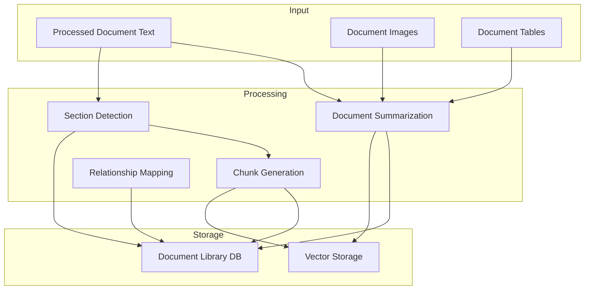
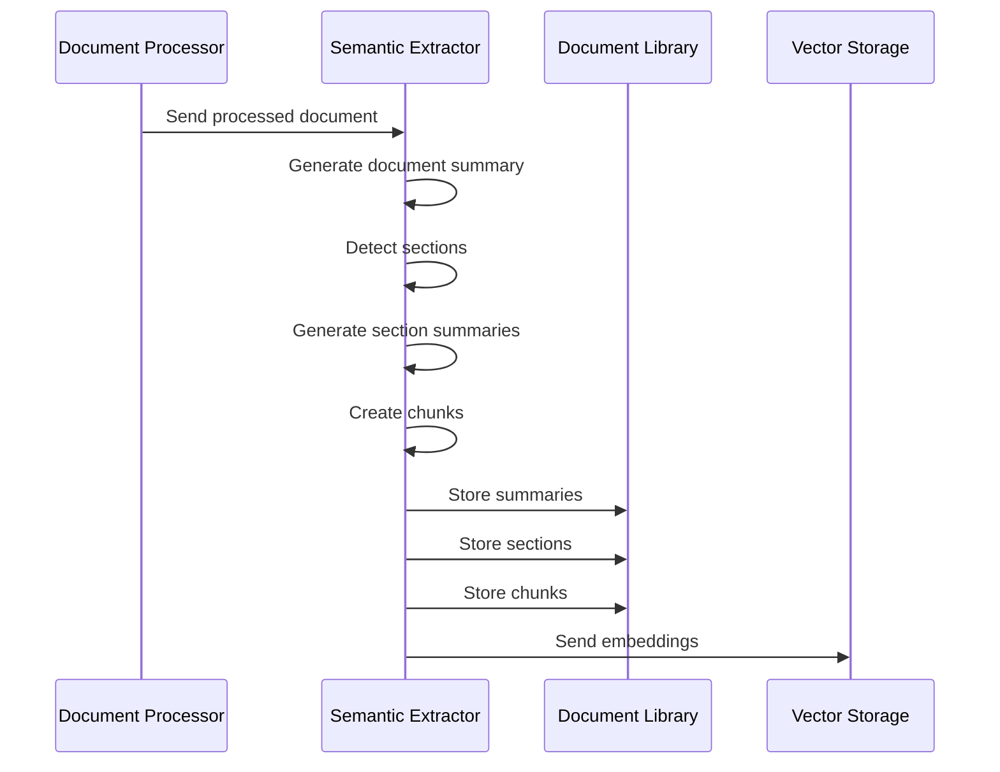

# Semantic Extraction and Document Processing Technical Specification

## Overview

This document outlines the technical specification for the semantic extraction system, which is responsible for:
- Generating document summaries
- Creating logical section groupings
- Chunking documents effectively
- Managing relationships between documents, sections, and chunks
- Storing all extracted semantic information

## System Architecture



## Document Summarization

### Approach
1. Generate hierarchical summaries:
   - Document-level summary (high-level overview)
   - Section-level summaries (key points per section)
   - Image/table descriptions integrated into summaries

2. Summary Generation Strategy:
   - Use LLM to generate structured summaries
   - Include metadata like key topics, document type, intended audience
   - Preserve important numerical values and citations
   - Maximum length: 1000 tokens for document summary

### Summary Template
```python
{
    "title": str,
    "document_type": str,
    "main_topics": List[str],
    "target_audience": str,
    "key_findings": List[str],
    "summary": str,
    "sections": List[SectionSummary]
}
```

## Section Detection

### Approach
1. Identify section boundaries using:
   - Explicit headers/titles
   - Font size/style changes
   - Numerical/alphabetical markers
   - Natural topic transitions

2. Section Attributes:
   - Hierarchical level (H1, H2, etc.)
   - Section type (introduction, methodology, results, etc.)
   - Parent-child relationships

### Section Template
```python
{
    "section_id": str,
    "doc_id": str,
    "parent_section_id": Optional[str],
    "level": int,
    "title": str,
    "type": str,
    "start_offset": int,
    "end_offset": int,
    "summary": str
}
```

## Chunk Generation

### Chunking Strategy
1. Primary Methods:
   - Semantic chunking (based on complete thoughts/topics)
   - Fixed-size chunking with smart breaks
   - Hybrid approach combining both methods

2. Chunk Parameters:
   - Target size: 512 tokens
   - Maximum size: 1024 tokens
   - Minimum size: 128 tokens
   - Overlap: 50 tokens between chunks

3. Special Handling:
   - Tables: Keep complete tables in single chunks
   - Lists: Maintain list context
   - Citations: Include with relevant content
   - Images: Reference in nearby text chunks

### Chunk Template
```python
{
    "chunk_id": str,
    "doc_id": str,
    "section_id": str,
    "content": str,
    "start_offset": int,
    "end_offset": int,
    "metadata": {
        "contains_table": bool,
        "contains_image_ref": bool,
        "contains_citation": bool,
        "chunk_type": str  # text, table, list, etc.
    }
}
```

## Database Schema Updates

### New Tables

```sql
-- Document summaries
CREATE TABLE document_summaries (
    doc_id TEXT PRIMARY KEY,
    title TEXT NOT NULL,
    document_type TEXT NOT NULL,
    main_topics TEXT NOT NULL, -- JSON array
    target_audience TEXT,
    key_findings TEXT NOT NULL, -- JSON array
    summary TEXT NOT NULL,
    created_at DATETIME NOT NULL DEFAULT CURRENT_TIMESTAMP,
    FOREIGN KEY (doc_id) REFERENCES documents(id)
);

-- Document sections
CREATE TABLE document_sections (
    section_id TEXT PRIMARY KEY,
    doc_id TEXT NOT NULL,
    parent_section_id TEXT,
    level INTEGER NOT NULL,
    title TEXT NOT NULL,
    section_type TEXT NOT NULL,
    start_offset INTEGER NOT NULL,
    end_offset INTEGER NOT NULL,
    summary TEXT NOT NULL,
    created_at DATETIME NOT NULL DEFAULT CURRENT_TIMESTAMP,
    FOREIGN KEY (doc_id) REFERENCES documents(id),
    FOREIGN KEY (parent_section_id) REFERENCES document_sections(section_id)
);

-- Document chunks
CREATE TABLE document_chunks (
    chunk_id TEXT PRIMARY KEY,
    doc_id TEXT NOT NULL,
    section_id TEXT NOT NULL,
    content TEXT NOT NULL,
    start_offset INTEGER NOT NULL,
    end_offset INTEGER NOT NULL,
    metadata TEXT NOT NULL, -- JSON object
    created_at DATETIME NOT NULL DEFAULT CURRENT_TIMESTAMP,
    FOREIGN KEY (doc_id) REFERENCES documents(id),
    FOREIGN KEY (section_id) REFERENCES document_sections(section_id)
);
```

## Processing Pipeline

### Sequence Flow



### Error Handling

1. Summary Generation Failures:
   - Retry with simplified template
   - Fall back to extractive summarization
   - Log failure and continue processing

2. Section Detection Issues:
   - Fall back to basic paragraph splitting
   - Use distance-based chunking
   - Mark document for manual review

3. Chunking Errors:
   - Revert to fixed-size chunks
   - Skip problematic sections
   - Maintain document flow

## Monitoring and Metrics

### Key Metrics
1. Processing Statistics:
   - Documents processed per minute
   - Average processing time per document
   - Success/failure rates

2. Quality Metrics:
   - Summary coherence scores
   - Section detection accuracy
   - Chunk size distribution
   - Relationship mapping completeness

3. Storage Metrics:
   - Database size growth
   - Index performance
   - Query response times

### Monitoring Dashboard
- Real-time processing status
- Error rate tracking
- Quality metric trends
- System performance indicators

## Integration Points

### Document Processor Integration
- Receive processed text and metadata
- Access to extracted images and tables
- Processing status updates

### Vector Storage Integration
- Send document summaries for embedding
- Send chunks for embedding
- Maintain relationship mappings

### Query System Integration
- Provide hierarchical document structure
- Enable filtered chunk search
- Support relationship-based reranking
