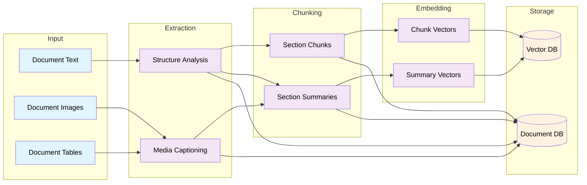
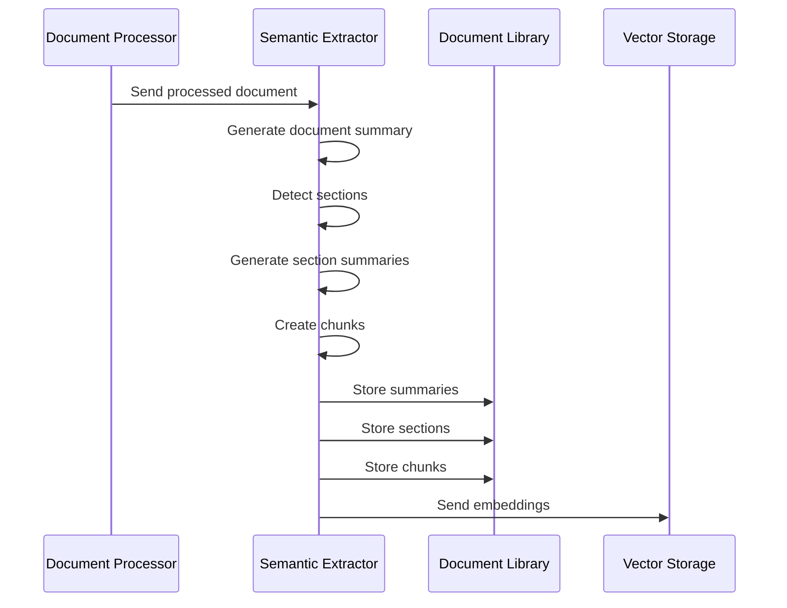

# Semantic Extraction and Document Processing Technical Specification

## Overview

This document outlines the technical specification for the semantic extraction system, which is responsible for:
- Creating logical section groupings within documents
- captioning images and tables
- Generating section summaries
- Chunking sections effectively
- Managing relationships between documents, sections, and chunks
- Storing all extracted semantic information
- embedding chunks and  preparing vector store

## System Architecture




## 1. Input Processing
This section details how we describe the three input types shown in the diagram: document text, document images, and document tables. It covers the initial intake and preparation of these elements for downstream processing.

### 1.1 Document Text Processing
- strip any strange characters from extracted document
- assign lines or location to the document text for chunking etc.

### 1.2 Image Processing
- standardize the format and resolution for llm captioning

### 1.3 Table Processing
- choose image or CSV format to use

## 2. Extraction Stage
This section covers the two main extraction processes shown in the diagram: structure analysis for text content and captioning for media elements.

### 2.1 Structure Analysis

1. Identify section boundaries using:
   - Explicit headers/titles
   - Font size/style changes
   - Numerical/alphabetical markers
   - Natural topic transitions
   - Track the section by location in document text...lines?

2. Section Attributes:
   - Hierarchical level (H1, H2, etc.)
   - Section type (introduction, methodology, results, etc.)
   - Parent-child relationships, image section relationships (e.g. where in the documents they are location)

### 2.2 Media Captioning
- ask a multimodal llm to caption the image
- provide the surrounding image text for additional context
- store the caption in document store
  
## 3. Chunking Stage
This section details how we generate and manage both section chunks and their corresponding summaries from the extracted content.

### 3.1 Section Chunks
- run a standard chunking algorithm on each section
- recursive length, with overlap, etc.

### 3.2 Section Summaries
- send each identified sectiopn to an llm for summarization
- include summary, labels/categories/tags

## 4. Embedding Generation 
This section covers the vector embedding process for both chunks and summaries, including the embedding strategy and model selection.

### 4.1 Chunk Vectors
- use standard BERT embedding for now

### 4.2 Summary Vectors
- use standard BERT embedding for now

## 5. Storage Systems
This section details the two storage systems shown in the diagram: the document database for processed content and metadata, and the vector database for embeddings.

### 5.1 Document Database
- See previous schema
- SQLite implementation


### 5.2 Vector Database
- chromaDB implementation
- a collection for sections
- a collection for chunks
- pull metadata from the document library DB into the collections


## Database Schema Updates

```sql
-- Document summaries
CREATE TABLE section_summaries (
    doc_id TEXT PRIMARY KEY,
    title TEXT NOT NULL,
    document_type TEXT NOT NULL,
    main_topics TEXT NOT NULL, -- JSON array
    summary TEXT NOT NULL,
    created_at DATETIME NOT NULL DEFAULT CURRENT_TIMESTAMP,
    FOREIGN KEY (doc_id) REFERENCES documents(id)
);

-- Document sections
CREATE TABLE sections (
    section_id TEXT PRIMARY KEY,
    doc_id TEXT NOT NULL,
    parent_section_id TEXT,
    level INTEGER NOT NULL,
    title TEXT NOT NULL,
    section_type TEXT NOT NULL,
    start_offset INTEGER NOT NULL,
    end_offset INTEGER NOT NULL,
    summary TEXT NOT NULL,
    created_at DATETIME NOT NULL DEFAULT CURRENT_TIMESTAMP,
    FOREIGN KEY (doc_id) REFERENCES documents(id),
    FOREIGN KEY (parent_section_id) REFERENCES document_sections(section_id)
);

-- Document chunks
CREATE TABLE section_chunks (
    chunk_id TEXT PRIMARY KEY,
    doc_id TEXT NOT NULL,
    section_id TEXT NOT NULL,
    content TEXT NOT NULL,
    start_offset INTEGER NOT NULL,
    end_offset INTEGER NOT NULL,
    created_at DATETIME NOT NULL DEFAULT CURRENT_TIMESTAMP,
    FOREIGN KEY (doc_id) REFERENCES documents(id),
    FOREIGN KEY (section_id) REFERENCES document_sections(section_id)
);
```

## Processing Pipeline

### Sequence Flow



### Error Handling

1. Summary Generation Failures:
   - Retry with simplified template
   - Fall back to extractive summarization
   - Log failure and continue processing

2. Section Detection Issues:
   - Fall back to basic paragraph splitting
   - Use distance-based chunking
   - Mark document for manual review

3. Chunking Errors:
   - Revert to fixed-size chunks
   - Skip problematic sections
   - Maintain document flow

## Monitoring and Metrics

### Key Metrics
1. Processing Statistics:
   - Documents processed per minute
   - Average processing time per document
   - Success/failure rates

2. Quality Metrics:
   - Summary coherence scores
   - Section detection accuracy
   - Chunk size distribution
   - Relationship mapping completeness

3. Storage Metrics:
   - Database size growth
   - Index performance
   - Query response times

### Monitoring Dashboard
- Real-time processing status
- Error rate tracking
- Quality metric trends
- System performance indicators

## Integration Points

### Document Processor Integration
- Receive processed text and metadata
- Access to extracted images and tables
- Processing status updates

### Vector Storage Integration
- Send document summaries for embedding
- Send chunks for embedding
- Maintain relationship mappings

### Query System Integration
- Provide hierarchical document structure
- Enable filtered chunk search
- Support relationship-based reranking
