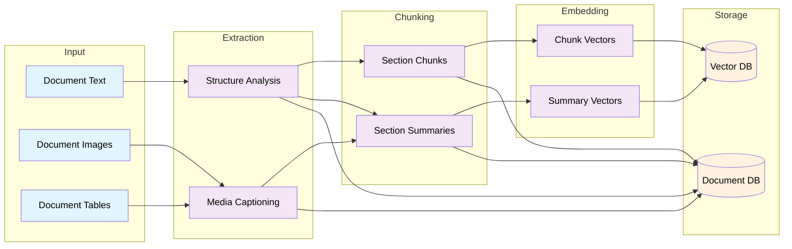
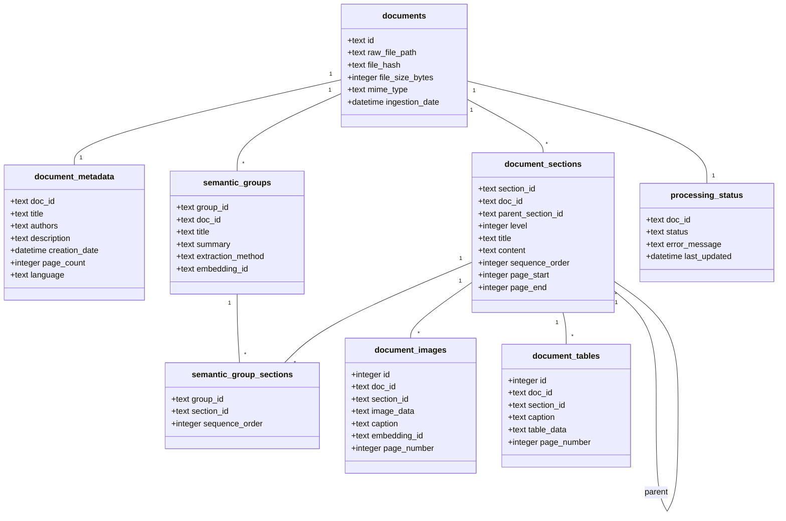

# Semantic Extraction Technical Specification

## Overview

### Purpose
This document specifies the semantic extraction system implementation, which transforms processed documents into searchable, semantically-meaningful content within the RAGnostic architecture.

### Scope
The system is responsible for:
- Creating logical section groupings within documents
- Captioning images and tables with contextual information
- Generating section and document summaries
- Chunking sections for efficient retrieval
- Managing relationships between documents, sections, and chunks
- Storing extracted semantic information
- Generating and managing embeddings in vector store

### System Context
- Input: Processed documents, images, and tables from Document Processing pipeline
- Output: Indexed, searchable content in ChromaDB
- Dependencies: Document Processing, Vector Storage systems

## System Architecture




## 1. Input Processing
### 1.1 Document Text
- Source: Output from Document Processing system
- Format: Clean text with preserved structure markers
- Metadata requirements:
  * Line/location tracking
  * Original formatting indicators
  * Section markers

### 1.2 Document Images
- Source: Extracted during document processing
- Format requirements:
  * Standardized resolution/size for LLM processing
  * Location markers in original document
  * Associated nearby text

### 1.3 Document Tables
- Source: Extracted during document processing 
- Format options:
  * CSV for structured data
  * Image format for complex tables
- Required metadata:
  * Original location
  * Column/row headers
  * Table caption if present

## 2. Extraction Stage
### 2.1 Structure Analysis
- Input: Document text with metadata
- Process:
  * Section boundary detection
  * Hierarchy identification
  * Parent-child relationship mapping
- Output:
  * Structured document outline
  * Section metadata
  * Location mappings

### 2.2 Media Captioning
- Input: Images and tables with context
- Process:
  * Context assembly (nearby text + document metadata)
  * LLM caption generation
  * Quality validation
- Output:
  * Descriptive captions
  * Content categorization
  * Context relationships

### 2.3. Semantic Grouping
- Input: semantic_groups and semantic_group_sections


## 3. Chunking Stage
### 3.1 Section Chunks
- Input: Structured document sections
- Process:
  * Chunk boundary determination
  * Overlap calculation
  * Media reference preservation
- Output:
  * Manageable text chunks
  * Chunk metadata
  * Section relationships
  
### 3.2 Section Summaries
- Input: Complete sections with media
- Process:
  * Context assembly
  * Summary generation
  * Metadata extraction
- Output:
  * Section summaries
  * Topic labels
  * Key concepts


## 4. Embedding Stage
### 4.1 Chunk Vectors
- Input: Processed chunks
- Model: opensource embedding (sentence transformers)
- Output:
  * Vector embeddings
  * Metadata mapping
  * Relationship preservation

### 4.2 Summary Vectors
- Input: Section and document summaries
- Model: opensource embedding (sentence transformers)
- Output:
- Output:
  * Summary embeddings
  * Hierarchy mapping
  * Cross-references


## 5. Storage Systems
### 5.1 Document Database (SQLite)
- Schema implementation
- Relationship management
- Metadata storage
- Content versioning

### 5.2 Vector Database (ChromaDB)
- Collections:
  * Document/section summaries
  * Content chunks
- Metadata mapping
- Query optimization


## Document Database Schema


```sql
------------------------------------------------------------------
-- Core Document Management
------------------------------------------------------------------

-- Primary document tracking
CREATE TABLE documents (
    id TEXT PRIMARY KEY,
    raw_file_path TEXT NOT NULL,            -- Path to original file
    file_hash TEXT NOT NULL,                -- For deduplication
    file_size_bytes INTEGER NOT NULL,
    mime_type TEXT NOT NULL,
    ingestion_date DATETIME NOT NULL DEFAULT CURRENT_TIMESTAMP
);

-- Basic document metadata
CREATE TABLE document_metadata (
    doc_id TEXT PRIMARY KEY,
    title TEXT,
    authors TEXT,                           -- JSON array
    description TEXT,
    creation_date DATETIME,
    page_count INTEGER,
    language TEXT,
    FOREIGN KEY (doc_id) REFERENCES documents(id)
);

------------------------------------------------------------------
-- Document Content & Structure
------------------------------------------------------------------
-- Document's physical section structure
CREATE TABLE document_sections (
    section_id TEXT PRIMARY KEY,
    doc_id TEXT NOT NULL,
    parent_section_id TEXT,
    level INTEGER NOT NULL,                 -- Header level (1=H1, etc)
    title TEXT NOT NULL,
    content TEXT NOT NULL,
    sequence_order INTEGER NOT NULL,        -- Order in document
    page_start INTEGER,
    page_end INTEGER,
    FOREIGN KEY (doc_id) REFERENCES documents(id),
    FOREIGN KEY (parent_section_id) REFERENCES document_sections(section_id)
);

-- Document images
CREATE TABLE document_images (
    id INTEGER PRIMARY KEY,
    doc_id TEXT NOT NULL,
    section_id TEXT NOT NULL,
    image_data TEXT NOT NULL,               -- Base64 encoded
    caption TEXT,                           -- Extracted or generated caption
    embedding_id TEXT,                      -- Vector store reference
    page_number INTEGER NOT NULL,
    FOREIGN KEY (doc_id) REFERENCES documents(id),
    FOREIGN KEY (section_id) REFERENCES document_sections(section_id)
);

-- Document tables
CREATE TABLE document_tables (
    id INTEGER PRIMARY KEY,
    doc_id TEXT NOT NULL,
    section_id TEXT NOT NULL,
    caption TEXT,
    table_data TEXT NOT NULL,               -- JSON structured data
    page_number INTEGER NOT NULL,
    FOREIGN KEY (doc_id) REFERENCES documents(id),
    FOREIGN KEY (section_id) REFERENCES document_sections(section_id)
);

------------------------------------------------------------------
-- Semantic Groups
------------------------------------------------------------------

-- Groups of sections for semantic processing
CREATE TABLE semantic_groups (
    group_id TEXT PRIMARY KEY,
    doc_id TEXT NOT NULL,
    title TEXT NOT NULL,
    summary TEXT,                           -- Generated summary
    extraction_method TEXT NOT NULL,        -- How group was derived
    embedding_id TEXT,                      -- Vector store reference
    FOREIGN KEY (doc_id) REFERENCES documents(id)
);

-- Maps sections to semantic groups
CREATE TABLE semantic_group_sections (
    group_id TEXT NOT NULL,
    section_id TEXT NOT NULL,
    sequence_order INTEGER NOT NULL,
    PRIMARY KEY (group_id, section_id),
    FOREIGN KEY (group_id) REFERENCES semantic_groups(group_id),
    FOREIGN KEY (section_id) REFERENCES document_sections(section_id)
);

------------------------------------------------------------------
-- Processing Status
------------------------------------------------------------------

-- Track document processing state
CREATE TABLE processing_status (
    doc_id TEXT PRIMARY KEY,
    status TEXT NOT NULL CHECK (
        status IN ('ingested', 'processed', 'analyzed', 'failed')
    ),
    error_message TEXT,
    last_updated DATETIME NOT NULL DEFAULT CURRENT_TIMESTAMP,
    FOREIGN KEY (doc_id) REFERENCES documents(id)
);

------------------------------------------------------------------
-- Indexes
------------------------------------------------------------------

-- Document lookup
CREATE INDEX idx_documents_hash ON documents(file_hash);

-- Section navigation
CREATE INDEX idx_sections_doc ON document_sections(doc_id);
CREATE INDEX idx_sections_parent ON document_sections(parent_section_id);
CREATE INDEX idx_sections_sequence ON document_sections(doc_id, sequence_order);

-- Semantic group access
CREATE INDEX idx_semantic_groups_doc ON semantic_groups(doc_id);
CREATE INDEX idx_group_sections_group ON semantic_group_sections(group_id);

```




# WORKING ------------------------

## Monitoring and Metrics

### Key Metrics
1. Processing Statistics:
   - Documents processed per minute
   - Average processing time per document
   - Success/failure rates

2. Quality Metrics:
   - Summary coherence scores
   - Section detection accuracy
   - Chunk size distribution
   - Relationship mapping completeness

3. Storage Metrics:
   - Database size growth
   - Index performance
   - Query response times

### Implementation

- store logs in a event table for now
- parse the logs at a later date for stats