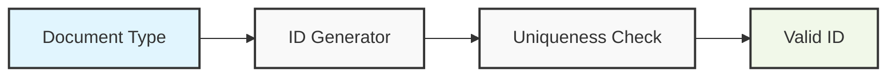

# Document ID System Technical Specification

## Overview

### Purpose
This document specifies the Document ID system implementation which provides unique identifiers for documents in the RAGnostic system. These IDs serve as both database primary keys and filesystem identifiers.

### Scope
The system is responsible for:
- Generating unique document identifiers
- Validating ID uniqueness
- Managing ID prefix namespaces
- Ensuring ID format consistency
- Providing utilities for ID validation

### System Context
- Input: Document type (optional)
- Output: Unique document identifier
- Dependencies: Database connection for validation

## System Architecture



## 1. ID Format Specification

### 1.1 ID Structure
- Format: `{PREFIX}_{NANOID}`
- Example: `DOC_12345abcdef`
- Prefix: 3-4 characters indicating document type
- NanoID: 12 characters using URL-safe characters
- Total length: 16-17 characters

### 1.2 Reserved Prefixes
- DOC_: General documents
- PDF_: PDF documents
- WEB_: Wikipedia articles
- IMG_: Extracted images
- TBL_: Extracted tables

## 2. ID Manager Implementation

### 2.1 Core Class Definition
```python
from typing import Optional, Set, Dict
from datetime import datetime
import sqlite3

class DocumentIDManager:
    """
    Manages document ID generation and validation for the RAGnostic system.
    Ensures uniqueness and proper formatting of document identifiers.
    """
    
    def __init__(
        self, 
        db_connection: sqlite3.Connection,
        nanoid_length: int = 12,
        reserved_prefixes: Optional[Set[str]] = None
    ) -> None:
        """
        Initialize the Document ID Manager.
        
        Args:
            db_connection: SQLite connection for uniqueness validation
            nanoid_length: Length of the random portion of the ID
            reserved_prefixes: Set of valid ID prefixes
        """
        pass

    @property
    def prefixes(self) -> Dict[str, str]:
        """
        Returns mapping of document types to their ID prefixes.
        """
        pass

    def generate_id(
        self, 
        doc_type: Optional[str] = None,
        max_attempts: int = 3
    ) -> str:
        """
        Generate a new unique document ID.
        
        Args:
            doc_type: Type of document for prefix selection
            max_attempts: Maximum uniqueness validation attempts
            
        Returns:
            Unique document identifier string
            
        Raises:
            ValueError: If doc_type is invalid
            RuntimeError: If unable to generate unique ID
        """
        pass

    def validate_id(self, doc_id: str) -> bool:
        """
        Validate format and uniqueness of a document ID.
        
        Args:
            doc_id: Document ID to validate
            
        Returns:
            True if ID is valid and unique
        """
        pass

    def register_id(self, doc_id: str) -> None:
        """
        Register a document ID as used in the system.
        
        Args:
            doc_id: Document ID to register
            
        Raises:
            ValueError: If ID is invalid or already exists
        """
        pass
        
    def get_prefix(self, doc_type: str) -> str:
        """
        Get the ID prefix for a document type.
        
        Args:
            doc_type: Document type string
            
        Returns:
            Prefix string for the document type
            
        Raises:
            ValueError: If doc_type is invalid
        """
        pass
```

## 3. Integration Points

### 3.1 Document Ingestion
- ID Manager integrated with ingestion pipeline
- IDs generated after duplicate detection
- Used for both database entry and file storage

### 3.2 Document Processing
- Extracted content (images, tables) use parent document ID as reference
- New IDs generated with appropriate prefixes

## 4. Error Handling

### 4.1 Result Type Pattern
All file operations return a FileOperationResult containing:
- Success status
- Resulting filepath (if successful)
- Error information (if failed)
- Error code for categorization

### 4.2 Error Categories
1. File Operations
   - SOURCE_NOT_FOUND
   - INVALID_DESTINATION
   - PERMISSION_DENIED
   - COPY_FAILED
   - RENAME_FAILED
2. ID Generation
   - INVALID_PREFIX
   - DUPLICATE_ID
   - GENERATION_FAILED

### 4.3 Recovery Strategy
- Continue processing on non-fatal errors
- Collect failures for later handling
- Group similar errors for batch retry
- Log all operations for audit trail

## 5. Testing Requirements

### 5.1 Unit Tests
- Prefix validation
- ID format validation
- Uniqueness checking
- Error handling

### 5.2 Integration Tests
- Database integration
- Concurrent ID generation
- Cross-type ID generation

## 6. Future Considerations
- Distributed ID generation support
- Custom prefix registration
- ID metadata tracking
- ID lifecycle management