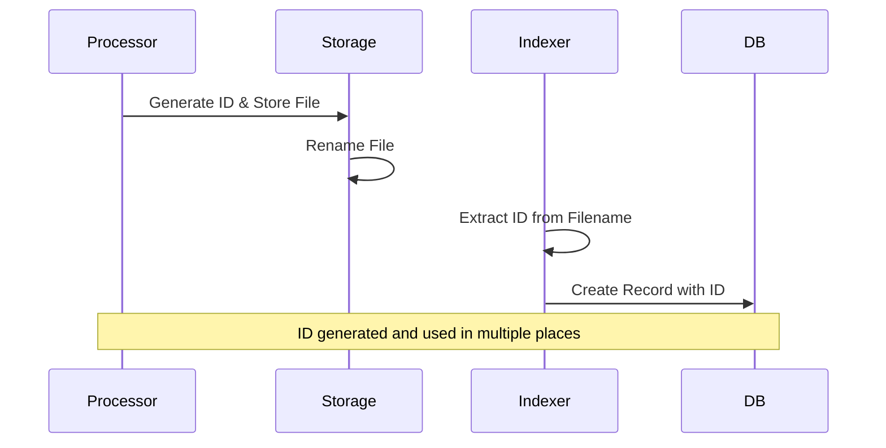
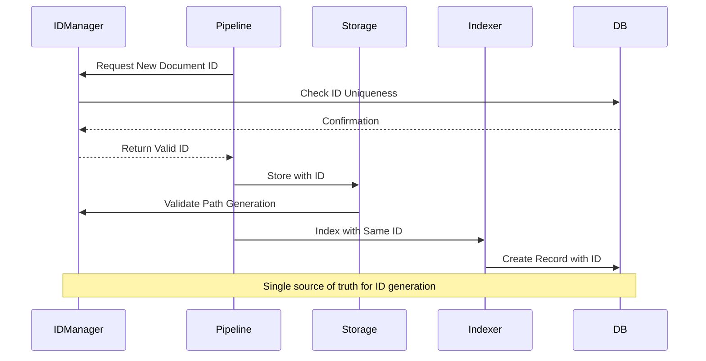
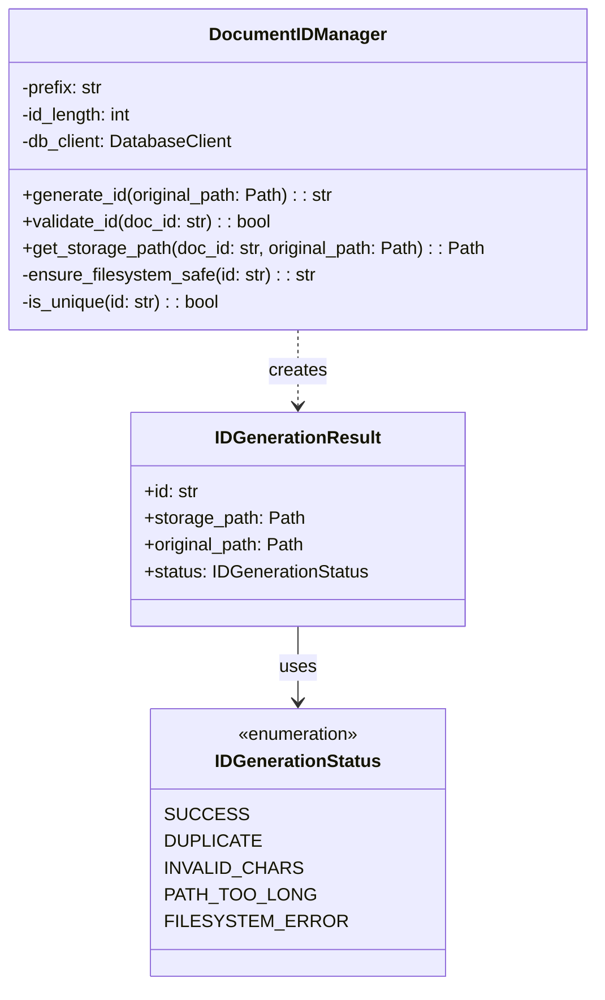
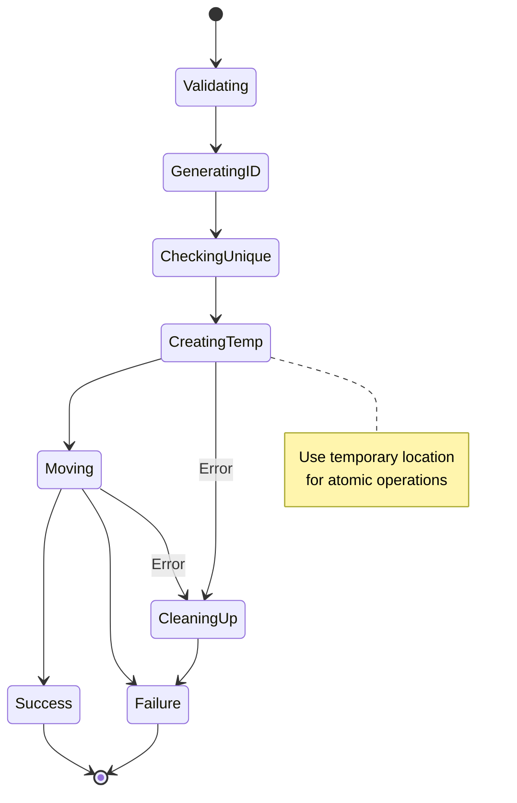

# Document ID Management Design

## Overview

This document outlines the design for a robust document ID management system in the Ragnostic pipeline. The system aims to ensure consistency between file storage and database records while handling various edge cases and failure scenarios.

## Current vs Proposed Flow

### Current Flow



### Proposed Flow



## ID Manager Component Design



## Key Components

### 1. DocumentIDManager

Central component responsible for all ID-related operations:

```python
class DocumentIDManager:
    def generate_id(self, original_path: Path) -> IDGenerationResult:
        """
        Generate a unique, filesystem-safe document ID.
        
        Features:
        - Ensures uniqueness in database
        - Validates filesystem constraints
        - Handles path/name collisions
        - Returns full context including storage path
        """

    def validate_id(self, doc_id: str) -> bool:
        """
        Validate ID meets all constraints.
        
        Checks:
        - Format compliance
        - Character validity
        - Length restrictions
        - Database uniqueness
        """

    def get_storage_path(self, doc_id: str, original_path: Path) -> Path:
        """
        Generate storage path for document.
        
        Features:
        - Maintains extension
        - Handles path length limits
        - Ensures safe characters
        - Optional hashed subdirectories
        """
```

### 2. ID Format Specification

```
{PREFIX}_{TIMESTAMP}_{RANDOM}_{HASH_FRAGMENT}

Example: DOC_20240201_a1b2c3_f7e6
```

- PREFIX: Configurable document type identifier
- TIMESTAMP: Sortable timestamp (compact format)
- RANDOM: Random string for uniqueness
- HASH_FRAGMENT: Partial file hash for integrity checking

### 3. Storage Strategy

```mermaid
graph TD
    A[Original File] --> B{ID Manager}
    B -->|Generate| C[Valid ID]
    C --> D{Storage Manager}
    D -->|Option 1| E[Flat Structure]
    D -->|Option 2| F[Hash-Based Dirs]
    E --> G[/storage/DOC_20240201_a1b2c3.pdf]
    F --> H[/storage/a1/b2/DOC_20240201_a1b2c3.pdf]
```

## Error Handling and Recovery

### File System Operations



### Error Recovery Process

1. **Temporary Storage**:
   - Files initially stored with `.temp` suffix
   - Only renamed after successful ID registration
   - Automatic cleanup of orphaned temp files

2. **ID Reservation**:
   - IDs temporarily reserved in database
   - Released if operation fails
   - Timeout mechanism for hung operations

3. **Conflict Resolution**:
   - Automatic retry with new ID on collision
   - Maximum retry attempts configurable
   - Failure reporting with context

## Implementation Considerations

1. **Performance**:
   - Batch ID generation support
   - ID reservation with TTL
   - Caching of filesystem checks

2. **Scalability**:
   - Distributed ID generation support
   - Sharding by prefix/timestamp
   - Rate limiting and backoff

3. **Monitoring**:
   - ID generation metrics
   - Collision tracking
   - Failure rate monitoring

4. **Configuration**:
   - Customizable ID format
   - Storage strategy selection
   - Retry/timeout settings

## Migration Strategy

1. Phase 1: Implement ID Manager
2. Phase 2: Update Pipeline Components
3. Phase 3: Migrate Existing Documents
4. Phase 4: Enable Advanced Features


# Example Implementation

"""Document ID management functionality."""
import hashlib
import time
from datetime import datetime
from pathlib import Path
from typing import Optional
from enum import Enum
import string

from nanoid import generate
from pydantic import BaseModel

from ragnostic.db.client import DatabaseClient


class IDGenerationStatus(str, Enum):
    """Status of ID generation operation."""
    SUCCESS = "success"
    DUPLICATE = "duplicate"
    INVALID_CHARS = "invalid_chars"
    PATH_TOO_LONG = "path_too_long"
    FILESYSTEM_ERROR = "filesystem_error"


class IDGenerationResult(BaseModel):
    """Result of ID generation attempt."""
    id: str
    storage_path: Path
    original_path: Path
    status: IDGenerationStatus
    error_message: Optional[str] = None

    class Config:
        arbitrary_types_allowed = True


class DocumentIDManager:
    """Manages document ID generation and validation."""
    
    # Characters safe for all filesystems
    SAFE_CHARS = string.ascii_letters + string.digits + "-_"
    
    def __init__(
        self,
        db_client: DatabaseClient,
        prefix: str = "DOC",
        id_length: int = 12,
        max_retries: int = 3,
    ):
        """Initialize ID manager.
        
        Args:
            db_client: Database client for uniqueness checks
            prefix: Prefix for document IDs
            id_length: Length of random portion of ID
            max_retries: Maximum retry attempts for ID generation
        """
        self.db_client = db_client
        self.prefix = prefix
        self.id_length = id_length
        self.max_retries = max_retries
    
    def generate_id(self, original_path: Path) -> IDGenerationResult:
        """Generate a unique document ID with storage path.
        
        Args:
            original_path: Path to original document
            
        Returns:
            IDGenerationResult with status and details
        """
        attempts = 0
        while attempts < self.max_retries:
            try:
                # Generate timestamp portion
                timestamp = datetime.now().strftime("%Y%m%d_%H%M%S")
                
                # Generate random portion
                random_id = generate(alphabet=self.SAFE_CHARS, size=self.id_length)
                
                # Get partial file hash
                hash_fragment = self._get_hash_fragment(original_path)
                
                # Combine parts
                doc_id = f"{self.prefix}_{timestamp}_{random_id}_{hash_fragment}"
                
                # Check if ID is unique
                if not self._is_unique(doc_id):
                    attempts += 1
                    continue
                
                # Generate storage path
                storage_path = self._get_storage_path(doc_id, original_path)
                
                # Validate final path
                if not self._validate_path(storage_path):
                    return IDGenerationResult(
                        id=doc_id,
                        storage_path=storage_path,
                        original_path=original_path,
                        status=IDGenerationStatus.PATH_TOO_LONG,
                        error_message="Final storage path too long"
                    )
                
                return IDGenerationResult(
                    id=doc_id,
                    storage_path=storage_path,
                    original_path=original_path,
                    status=IDGenerationStatus.SUCCESS
                )
                
            except Exception as e:
                attempts += 1
                if attempts >= self.max_retries:
                    return IDGenerationResult(
                        id="",
                        storage_path=Path(),
                        original_path=original_path,
                        status=IDGenerationStatus.FILESYSTEM_ERROR,
                        error_message=str(e)
                    )
        
        return IDGenerationResult(
            id="",
            storage_path=Path(),
            original_path=original_path,
            status=IDGenerationStatus.DUPLICATE,
            error_message="Failed to generate unique ID"
        )
    
    def _get_hash_fragment(self, filepath: Path, length: int = 4) -> str:
        """Get first N characters of file hash."""
        try:
            sha256_hash = hashlib.sha256()
            with open(filepath, "rb") as f:
                # Read in chunks to handle large files
                for byte_block in iter(lambda: f.read(4096), b""):
                    sha256_hash.update(byte_block)
            return sha256_hash.hexdigest()[:length]
        except Exception:
            # On error, use timestamp-based fragment
            return hex(int(time.time()))[2:6]
    
    def _is_unique(self, doc_id: str) -> bool:
        """Check if document ID is unique in database."""
        existing_doc = self.db_client.get_document_by_id(doc_id)
        return existing_doc is None
    
    def _get_storage_path(self, doc_id: str, original_path: Path) -> Path:
        """Generate storage path for document.
        
        Currently uses flat structure, could be extended to use 
        hash-based subdirectories for better scalability.
        """
        suffix = original_path.suffix
        return Path("storage") / f"{doc_id}{suffix}"
    
    def _validate_path(self, path: Path) -> bool:
        """Validate storage path meets filesystem constraints."""
        try:
            # Check path length (Windows has 260 char limit by default)
            if len(str(path.resolve())) > 250:
                return False
            
            # Validate each part has only safe characters
            return all(
                all(c in self.SAFE_CHARS for c in part)
                for part in path.parts
                if part not in ["/", "\\", ":"]
            )
        except Exception:
            return False