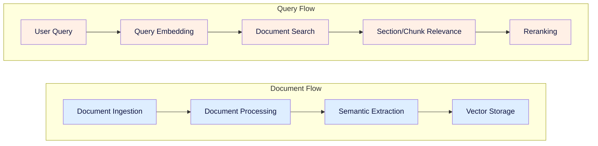
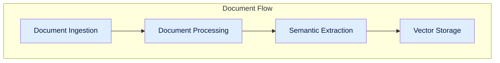
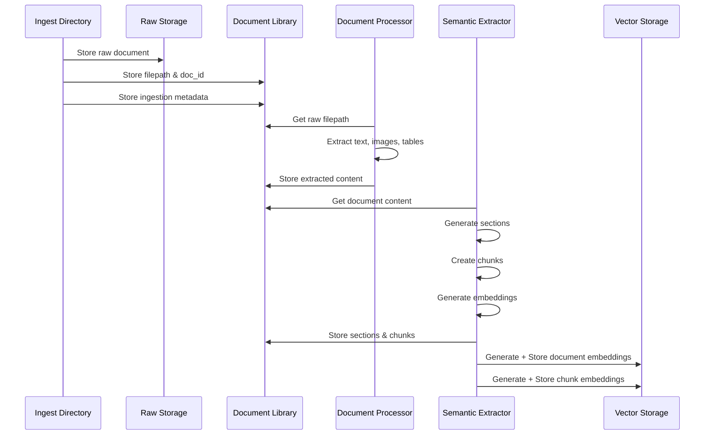
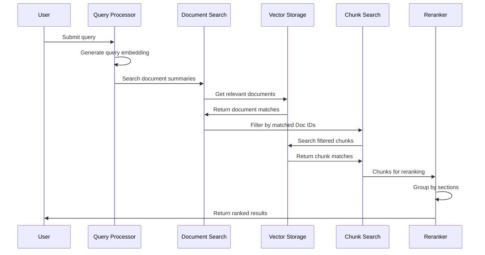
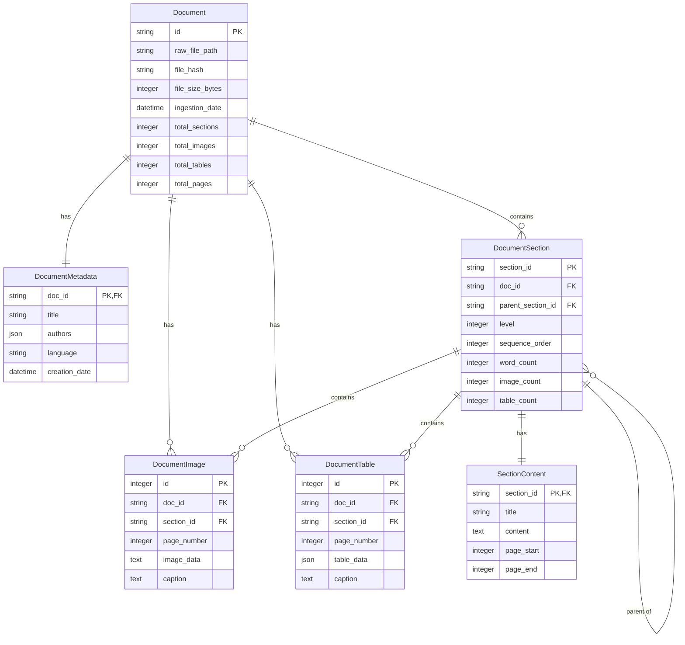
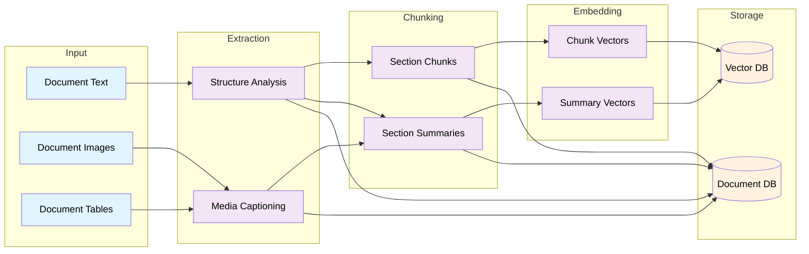
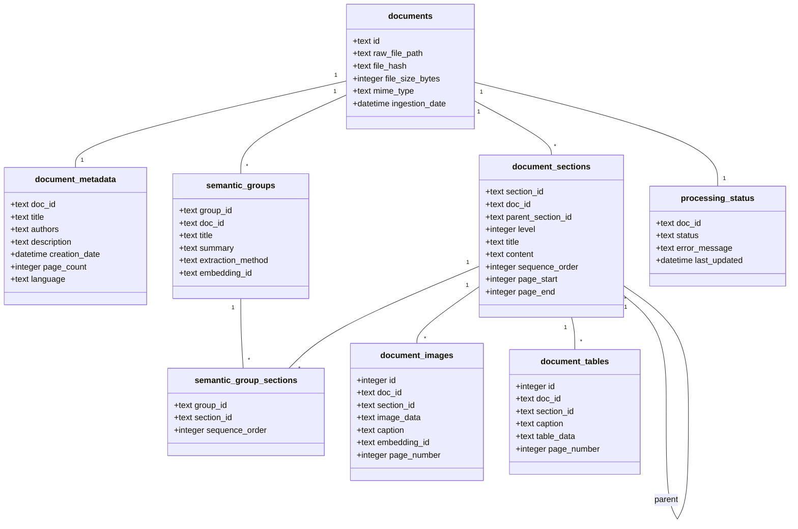

<file_1>
<path>1_System_Requirements.md</path>
<content>
```markdown
# Hierarchical RAG System Requirements

## System Overview & Data Sources
- Wikipedia articles (Initial: 25, Target: 10,000)
- PDF documents
  * Initial: 1 textbook (200 pages), 2 journal articles
  * Target: 20-50 textbooks, thousands of journal articles

## Technical Requirements

### Document Processing & Storage
- Parse Wikipedia articles via API
- Process PDFs using Doculing
- Raw document storage with consistent structure
  * Separate dirs by document type
  * Consistent naming convention
  * Atomic operations
  * Duplicate handling
  * Backup system with periodic snapshots
- Generate and track document metadata
  * Title and author extraction
  * Date and source tracking
  * Parent-child relationships
  * Position tracking
- Create hierarchical summaries and chunks
  * Extractive summarization
  * Configurable length control
  * Semantic boundaries
  * Context preservation
- Compute embeddings at multiple levels
  * Model selection
  * Batch processing

### Vector Database Integration
- ChromaDB or LanceDB implementation
- Collection structure
  * Separate collections per level
  * Metadata schema
- Vector storage operations
  * Batch insertion
  * Update handling
  * Index maintenance
  * Health checks

### Query Pipeline
1. Document summary search via embeddings
2. Filtered chunk search within matched documents
3. Basic reranking system
   * Grouping logic
   * Score combination
   * Result formatting
   * Metadata inclusion
   * Context assembly

### Performance Requirements
- Query response time: Up to 30 seconds acceptable
- Infrequent document updates (daily at most)
- Local deployment initially, cloud migration planned

### Evaluation System
- Accuracy and precision metrics
- Parameter tuning capability
- System performance tracking

## Implementation Pipeline
1. Ingest from monitored directory
   * watchdog for directory monitoring
   * file type detection
2. Parse and extract content
3. Generate metadata
4. Create hierarchical structures
5. Compute embeddings
6. Store in vector database

## Future Considerations
- Cloud deployment
- API service development
- Enhanced reranking system
- Evaluation metrics implementation
- Parameter optimization
```
</content>
</file_1>

<file_2>
<path>2_Ragnostic_Project_Plan.md</path>
<content>
```markdown
# Ragnostic Project Plan 

RAGnostic is a general system to implement heirarchal document retrieval. 

## Overview
More narrowly for the proof of concept we will make a system that searches document summaries first to filter the document list, then performs vector search on smaller chunks within filtered documents.



## MVP Scope
### Data Sources
- Wikipedia articles
- PDF documents (textbooks, journal articles)

### Initial Scale
- 25 Wikipedia articles
- 1 textbook (200 pages)
- 2 journal articles

### Target Scale
- 10,000 Wikipedia articles
- 20-50 textbooks
- Thousands of journal articles


## 1. Document Flow Components

The document flow covers the addition of new documents and their subsequent processing for search and retrieval.



### Document Ingestion

The document ingestion system serves as the primary entry point for all content entering the hierarchical RAG system. It provides a pipeline for adding new documents (i.e. Wikipedia articles and PDF documents) to the available set of documents in the library. It also manages the library storage system which consists of a flat filesystem structure for raw document/blob storage and a SQLite database for document management and metadata. 

The primary tasks of ingestion are:
- Determine if a new document already exists in the library and prevent duplication
- Manage storage of the raw documents/blobs (i.e. the original file as it was added to ingestion)
- Manage the internal Doc ID assignment for the document
- Manage the metadata assigned to the internal Doc ID (e.g. date ingested, author(s), etc)
- Manage the SQL lite database of the library documents that maps Doc ID to filepath and other metadata


### Document Processing

The document processing system serves as the  primary approach for converting documents/blobs into text and features we can use to facilitate semantic search and embedding. It provides methods for parsing, labeling, and understanding the content of documents. It is setup to work with PDF documents and wikipedia articles.

The primary task of document processing are:
- extract clean organized text from PDF files
- extract images and tables from PDF files
- update document metadata with extraction outcomes (has_images, has_tables, has_text, status, etc)
- text, image, and table extraction from wikipedia
- we primarily will use docling for PDFs


### Semantic Extraction

The semantic extraction system makes sense of the extracted content for each document. We determine logical section groupings within long documents and create image text summaries to inject in the text. Whole document summaries are obtained and associated Section IDs, page IDs, etc. are added to the document database to help with reranking later on. We also create our individual chunks and assign them relevant Chunk IDs to use later on. Each individual chunk maintains relationships to its higher level section and document(s)


### Vector Storage

The Vector Storage system implements a hierarchical search architecture using ChromaDB collections to enable efficient two-stage retrieval. It maintains separate collections for document summaries and chunks, optimizing search performance while preserving document relationships. The system provides clean interfaces for updates and searches while ensuring data consistency across collections. The search strategies enabled are a document relvance search, and a filtered chunk relevance search

### Document Flow Sequence




## 2. Query Flow

The Query flow covers the search based on a user query, along with the reranking and context organization.


### Query Processing

The query processing takes a new user query and creates an embedding of it for use in search. Additional query processing may also include query classification/labeling, keyword extraction, query rewriting.

### Document Search

The document search step takes the processed query which contains an embedding and optioonally keywords/labels to help search. The processed query is used to find relevant documents based on the document summary collection. The output of the document search is a list of Doc IDs and their associated search score. The top N Doc IDs are used in subsequent stages

### Section/Chunk Search

The section/chunk search filters the chunk collection based on the Doc IDs then performs a search using the processed query. The output of the section/chunk search is a list of Chunk IDs and their associated search score. This list is used in the reranking stage to determine the best document chunks and context.

### Chunk Reranking

The reranking approach here is based on chunk groups. We rerank based on the largest "contiguous group" and higherst score. Conceptually we want to find sections that have multiple chunks within them of relevancy indicating the section is important. We will use "section chunk coverage" as a metric which is computed as (chunks returned from section)/(total chunks in section).


### Query Flow Sequence




```
</content>
</file_2>

<file_3>
<path>2a_Document_Ingestion.md</path>
<content>
```markdown
# Document Ingestion Technical Specification

## Overview

### Purpose
This document outlines the document ingestion implementation, which takes new documents and adds them to our database along with text and document information extraction. Ingestion incudes raw blob, metadata, and extracted information storage.

### Scope
The system is responsible for:
- Monitoring ingestion folder for new documents
- Assessing validity of ingestion documents (i.e. no duplicates)
- Assigning doc ids and moving new documents into our document database
- extracting and storing document file metadata (size, etc.)
- running feature extraction on documents (text, images, tables, etc)

### System Context
- Input: New PDF document or wikipedia url
- Output: document database entry, raw file blob
- Dependencies: 

## System Architecture

### Processing Stages


## 1. Document Monitor
### 1.1 File Monitor Service
- Implements Python watchdog for directory monitoring
- Supports PDF files initially
- Basic validation:
  * File exists and is readable
  * Valid PDF format
  * File size check

### 1.2 Duplicate Detection
- Calculate file hash (SHA-256)
- Check against existing document hashes in database
- Skip ingestion if duplicate found


## 2. Raw Storage System
### 2.1 Document id service
Issues new document ids for valid documents
- Move file to raw storage with new doc_id-based filename
- Basic file system operations only
- No complex processing at this stage
- updates document database

### 2.2 File Organization

Raw document blobs are stored in a flat filesystem
- will initially store locally
- easy switch to S3 like storage (i.e. cloud)

```
/raw_documents/
└── {doc_id}.pdf
```


## 3. Document Database

### 3.1 Document Database Core Schema
For the ingestion process and raw file storage we maintain the mapping from rawa file to database entry
-  metadata allows for search and retrieval

```sql
------------------------------------------------------------------
-- Core Document Management
------------------------------------------------------------------

-- Primary document tracking
CREATE TABLE documents (
    id TEXT PRIMARY KEY,
    raw_file_path TEXT NOT NULL,            -- Path to original file
    file_hash TEXT NOT NULL,                -- For deduplication
    file_size_bytes INTEGER NOT NULL,
    mime_type TEXT NOT NULL,
    ingestion_date DATETIME NOT NULL DEFAULT CURRENT_TIMESTAMP
);

-- Basic document metadata
CREATE TABLE document_metadata (
    doc_id TEXT PRIMARY KEY,
    title TEXT,
    authors TEXT,                           -- JSON array
    description TEXT,
    creation_date DATETIME,
    page_count INTEGER,
    language TEXT,
    FOREIGN KEY (doc_id) REFERENCES documents(id)
);
```

### 3.2 Document database python client
- client for accessing database in python
- document CRUD
- document search (fuzzy text search on description and/or title?)
- faceted filter on date ingested, etc.


## 4. Basic Processing

### 4.1 Document database Proicessing schema
```sql
------------------------------------------------------------------
-- Document Content & Structure
------------------------------------------------------------------
-- Document's physical section structure
CREATE TABLE document_sections (
    section_id TEXT PRIMARY KEY,
    doc_id TEXT NOT NULL,
    parent_section_id TEXT,
    level INTEGER NOT NULL,                 -- Header level (1=H1, etc)
    title TEXT NOT NULL,
    content TEXT NOT NULL,
    sequence_order INTEGER NOT NULL,        -- Order in document
    page_start INTEGER,
    page_end INTEGER,
    FOREIGN KEY (doc_id) REFERENCES documents(id),
    FOREIGN KEY (parent_section_id) REFERENCES document_sections(section_id)
);

-- Document images
CREATE TABLE document_images (
    id INTEGER PRIMARY KEY,
    doc_id TEXT NOT NULL,
    section_id TEXT NOT NULL,
    image_data TEXT NOT NULL,               -- Base64 encoded
    caption TEXT,                           -- Extracted or generated caption
    embedding_id TEXT,                      -- Vector store reference
    page_number INTEGER NOT NULL,
    FOREIGN KEY (doc_id) REFERENCES documents(id),
    FOREIGN KEY (section_id) REFERENCES document_sections(section_id)
);

-- Document tables
CREATE TABLE document_tables (
    id INTEGER PRIMARY KEY,
    doc_id TEXT NOT NULL,
    section_id TEXT NOT NULL,
    caption TEXT,
    table_data TEXT NOT NULL,               -- JSON structured data
    page_number INTEGER NOT NULL,
    FOREIGN KEY (doc_id) REFERENCES documents(id),
    FOREIGN KEY (section_id) REFERENCES document_sections(section_id)
);
```

### 4.2 PDF Processing
- extract into pydantic using `docling` and `marker-pdf`
- specify a explicit placeholder for images and tables in text
- if palceholder not piossible use REGEX and add one
- updates `document_sections` SQL table entry

### 4.3 Wikipedia processing
- extract text from website or url using `wikipedia` and `wikipedia-api`
- specify place holder for images
- updates `document_sections` SQL table entry

### 4.4. Image and table processing
- for each doc_id stores images and tables in database
- updates the `document_images` and `document_tables` in database


# WORKING ------------------------


## Error Handling
### Basic Error Types
1. File System Errors:
   - File not found
   - Permission denied
   - Storage full

2. Processing Errors:
   - Invalid file format
   - Extraction failure

### Error Response
- Log error details
- Skip problematic documents
- Continue processing others


## Monitoring and Metrics
### Basic Metrics
- Number of documents ingested
- Storage usage
- Basic error counts
- Processing success/failure rates

### Implementation
[Placeholder, needs work...]


## Document Database Diagram


```
</content>
</file_3>

<file_4>
<path>2b_Semantic_Extraction.md</path>
<content>
```markdown
# Semantic Extraction Technical Specification

## Overview

### Purpose
This document specifies the semantic extraction system implementation, which transforms processed documents into searchable, semantically-meaningful content within the RAGnostic architecture.

### Scope
The system is responsible for:
- Creating logical section groupings within documents
- Captioning images and tables with contextual information
- Generating section and document summaries
- Chunking sections for efficient retrieval
- Managing relationships between documents, sections, and chunks
- Storing extracted semantic information
- Generating and managing embeddings in vector store

### System Context
- Input: Processed documents, images, and tables from Document Processing pipeline
- Output: Indexed, searchable content in ChromaDB
- Dependencies: Document Processing, Vector Storage systems

## System Architecture




## 1. Input Processing
### 1.1 Document Text
- Source: Output from Document Processing system
- Format: Clean text with preserved structure markers
- Metadata requirements:
  * Line/location tracking
  * Original formatting indicators
  * Section markers

### 1.2 Document Images
- Source: Extracted during document processing
- Format requirements:
  * Standardized resolution/size for LLM processing
  * Location markers in original document
  * Associated nearby text

### 1.3 Document Tables
- Source: Extracted during document processing 
- Format options:
  * CSV for structured data
  * Image format for complex tables
- Required metadata:
  * Original location
  * Column/row headers
  * Table caption if present

## 2. Extraction Stage
### 2.1 Structure Analysis
- Input: Document text with metadata
- Process:
  * Section boundary detection
  * Hierarchy identification
  * Parent-child relationship mapping
- Output:
  * Structured document outline
  * Section metadata
  * Location mappings
  * `semantic_group` and `semantic_group_section` database entries

### 2.2 Media Captioning
- Input: Images and tables with document text context
- Process:
  * Context assembly (nearby text + document metadata)
  * LLM caption generation
  * Quality validation
- Output:
  * Descriptive captions
  * Content categorization
  * Context relationships
  * updated `document_image` database entries

### 2.3. Semantic Grouping
- Input: semantic_groups and semantic_group_sections
- Process:
  * Render full text recursively for the semantic group
  * pulls from document_sections
  * replaces table and image pklaceholder with llm caption/image description
- Output: full text renderings of semantic group
  * full text
  * markdown with emphasis and standard headers based on document_section level, etc


## 3. Chunking Stage
### 3.1 Section Chunks
- Input: Structured document sections
- Process:
  * Chunk boundary determination
  * Overlap calculation
  * Media reference preservation
- Output:
  * Manageable text chunks
  * Chunk metadata
  * Section relationships
  
### 3.2 Section Summaries
- Input: Complete sections with media
- Process:
  * Context assembly
  * Summary generation
  * Metadata extraction
- Output:
  * Section summaries
  * Topic labels
  * Key concepts


## 4. Embedding Stage
### 4.1 Chunk Vectors
- Input: Processed chunks
- Model: opensource embedding (sentence transformers)
- Output:
  * Vector embeddings
  * Metadata mapping
  * Relationship preservation

### 4.2 Summary Vectors
- Input: Section and document summaries
- Model: opensource embedding (sentence transformers)
- Output:
- Output:
  * Summary embeddings
  * Hierarchy mapping
  * Cross-references


## 5. Storage Systems
### 5.1 Vector Database (ChromaDB)
- Collections:
  * Semantic summaries
  * Semantic chunks
- Metadata mapping of document features to the database for filtering


#### semantic_summaries
- Collection name: `semantic_summaries`
- Purpose: First-stage retrieval for document/bulk section filtering
  * conceptually like topic / chapter based filtering

#### semantic_chunks
- Collection name: `semantic_chunks`
- Purpose: Second-stage retrieval within filtered documents
  * raw bits of text within a semantic group
  * used to bvetter rank the semantic group
  * better alignment of chunks within a sectionm / coverage == better semantic group


## 5.2. Document Database (SQLite)
A full view of the document schem to this stage

```sql
------------------------------------------------------------------
-- Core Document Management
------------------------------------------------------------------

-- Primary document tracking
CREATE TABLE documents (
    id TEXT PRIMARY KEY,
    raw_file_path TEXT NOT NULL,            -- Path to original file
    file_hash TEXT NOT NULL,                -- For deduplication
    file_size_bytes INTEGER NOT NULL,
    mime_type TEXT NOT NULL,
    ingestion_date DATETIME NOT NULL DEFAULT CURRENT_TIMESTAMP
);

-- Basic document metadata
CREATE TABLE document_metadata (
    doc_id TEXT PRIMARY KEY,
    title TEXT,
    authors TEXT,                           -- JSON array
    description TEXT,
    creation_date DATETIME,
    page_count INTEGER,
    language TEXT,
    FOREIGN KEY (doc_id) REFERENCES documents(id)
);

------------------------------------------------------------------
-- Document Content & Structure
------------------------------------------------------------------
-- Document's physical section structure
CREATE TABLE document_sections (
    section_id TEXT PRIMARY KEY,
    doc_id TEXT NOT NULL,
    parent_section_id TEXT,
    level INTEGER NOT NULL,                 -- Header level (1=H1, etc)
    title TEXT NOT NULL,
    content TEXT NOT NULL,
    sequence_order INTEGER NOT NULL,        -- Order in document
    page_start INTEGER,
    page_end INTEGER,
    FOREIGN KEY (doc_id) REFERENCES documents(id),
    FOREIGN KEY (parent_section_id) REFERENCES document_sections(section_id)
);

-- Document images
CREATE TABLE document_images (
    id INTEGER PRIMARY KEY,
    doc_id TEXT NOT NULL,
    section_id TEXT NOT NULL,
    image_data TEXT NOT NULL,               -- Base64 encoded
    caption TEXT,                           -- Extracted or generated caption
    embedding_id TEXT,                      -- Vector store reference
    page_number INTEGER NOT NULL,
    FOREIGN KEY (doc_id) REFERENCES documents(id),
    FOREIGN KEY (section_id) REFERENCES document_sections(section_id)
);

-- Document tables
CREATE TABLE document_tables (
    id INTEGER PRIMARY KEY,
    doc_id TEXT NOT NULL,
    section_id TEXT NOT NULL,
    caption TEXT,
    table_data TEXT NOT NULL,               -- JSON structured data
    page_number INTEGER NOT NULL,
    FOREIGN KEY (doc_id) REFERENCES documents(id),
    FOREIGN KEY (section_id) REFERENCES document_sections(section_id)
);

------------------------------------------------------------------
-- Semantic Groups
------------------------------------------------------------------

-- Groups of sections for semantic processing
CREATE TABLE semantic_groups (
    group_id TEXT PRIMARY KEY,
    doc_id TEXT NOT NULL,
    title TEXT NOT NULL,
    summary TEXT,                           -- Generated summary
    extraction_method TEXT NOT NULL,        -- How group was derived
    embedding_id TEXT,                      -- Vector store reference
    FOREIGN KEY (doc_id) REFERENCES documents(id)
);

-- Maps sections to semantic groups
CREATE TABLE semantic_group_sections (
    group_id TEXT NOT NULL,
    section_id TEXT NOT NULL,
    sequence_order INTEGER NOT NULL,
    PRIMARY KEY (group_id, section_id),
    FOREIGN KEY (group_id) REFERENCES semantic_groups(group_id),
    FOREIGN KEY (section_id) REFERENCES document_sections(section_id)
);

------------------------------------------------------------------
-- Processing Status
------------------------------------------------------------------

-- Track document processing state
CREATE TABLE processing_status (
    doc_id TEXT PRIMARY KEY,
    status TEXT NOT NULL CHECK (
        status IN ('ingested', 'processed', 'analyzed', 'failed')
    ),
    error_message TEXT,
    last_updated DATETIME NOT NULL DEFAULT CURRENT_TIMESTAMP,
    FOREIGN KEY (doc_id) REFERENCES documents(id)
);

------------------------------------------------------------------
-- Indexes
------------------------------------------------------------------

-- Document lookup
CREATE INDEX idx_documents_hash ON documents(file_hash);

-- Section navigation
CREATE INDEX idx_sections_doc ON document_sections(doc_id);
CREATE INDEX idx_sections_parent ON document_sections(parent_section_id);
CREATE INDEX idx_sections_sequence ON document_sections(doc_id, sequence_order);

-- Semantic group access
CREATE INDEX idx_semantic_groups_doc ON semantic_groups(doc_id);
CREATE INDEX idx_group_sections_group ON semantic_group_sections(group_id);

```




# WORKING ------------------------

## Monitoring and Metrics

### Key Metrics
1. Processing Statistics:
   - Documents processed per minute
   - Average processing time per document
   - Success/failure rates

2. Quality Metrics:
   - Summary coherence scores
   - Section detection accuracy
   - Chunk size distribution
   - Relationship mapping completeness

3. Storage Metrics:
   - Database size growth
   - Index performance
   - Query response times

### Implementation

- store logs in a event table for now
- parse the logs at a later date for stats
```
</content>
</file_4>
