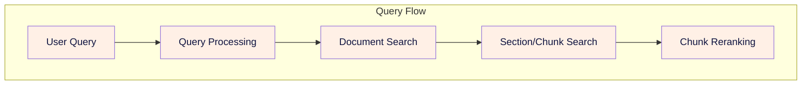

<file_1>
<path>0a_README.md</path>
<content>
```markdown
# Background

This repo is to explore and implement RAG for consulting and technical applications that use heavy PDFs.

# MVP 1:

We will be focusing on an initial MVP to pipe asll the parts of the RAG system together for demoing and exploration as we build.

The main blocks are:

1. Raw document ingestion and storage
2. Document text extraction and labeling
3. Chunking and embedding in vector store
4. Query retrival
5. Evaluations

## Raw Document ingestion and storage

- collect and assemble raw documents to work with
- collect and assemble wikipedia articles to work with
- store documents in a database as blobs

## Document text extraction and labeling

- test various PDF readers and text extraction
- test wikipedia text semantics
- data model objects for documents with metadata
- document summarization for heirarchal RAG and text search
- document labeling based on summaries and metadata classification?


# Resources

We plan to look into the following for PDF reading and extraction:

OpenSource:
- PyMuPDF4LLM: https://pymupdf.readthedocs.io/en/latest/pymupdf4llm/
- zerox: https://github.com/getomni-ai/zerox
- marker: https://github.com/VikParuchuri/marker
- docling: https://github.com/DS4SD/docling
- llmsherpa: https://github.com/nlmatics/llmsherpa

ClosedSource:
- llamaparse: https://github.com/run-llama/llama_parse
- unstructured: https://github.com/Unstructured-IO/unstructured
- llmwhisperer: https://github.com/Zipstack/unstract
- google document AI: https://cloud.google.com/python/docs/reference/documentai/latest

We plan to also use the internet for gap filling:

DataSources:
- wikipedia-api (more granular and updated): https://github.com/martin-majlis/Wikipedia-API
- wikipedia (higher level and stale): https://github.com/goldsmith/Wikipedia

Search:
- BraveAPI: https://api.search.brave.com/app/documentation/web-search/get-started
- BraveAPI python client (sync and async, stable): https://github.com/kayvane1/brave-api
- Brave python client alternative(async and uv/docker images): https://github.com/helmut-hoffer-von-ankershoffen/brave-search-python-client


# Installation of packages

## Python version
We require >=3.11

## Installation

The packages are a bit finnicky and some non python packages are required. Due to the pytorch requirement thigns are VERY paltform specific...
- CPU
- GPU
- OS

## MacOS Intel

> Due to pytorch versions being old on intel macOS i didnt get the marker pdf to run. Ill try it again on my WSL beast and see what happends.

1. poppler: image analysis
    - `brew install poppler`

2. Pytorch: CPU or GPU depending on machine
    - `uv add torch torchvision`
    > You may need to install an explicit CPU version, in that case:
    > `uv pip install --index-url https://download.pytorch.org/whl/cpu torch==2.1.0 torchvision==0.16.0`

3. PDF extraction packages
    - `uv add pymupdf4llm`
    - `uv add py-zerox`
    > marker-pdf is an early unstable version on mac intel
    > docling for intel mac with pinned pytorch is incompatible

4. Web search and wikipedia
   - `uv add brave-search`
   - `uv add wikipedia wikipedia-api`

5. Workflows and DAGs
   - `uv add burr[start]`

6. Indexing
   - `uv add llama_index`

## Ubuntu Intel + GPU

We are going to go the more stable and classic route of conda and pip

1. Setup a new miniconda env

2. Install the OS specific packages (mostly OCR)
    a. poppler: image analysis
    - `conda install -c conda-forge poppler`
    b. Tesseract
    - `conda install -c conda-forge tesseract`
    c. graphviz
    - `conda install graphviz`

3. Install CUDA (if GPU enabled)
    a. Install CUDA on WSL
    - https://docs.nvidia.com/cuda/wsl-user-guide/index.html#getting-started-with-cuda-on-wsl-2
    b. Add to `.bashrc`
    ```export PATH=/usr/local/cuda-12.8/bin${PATH:+:${PATH}}
    export LD_LIBRARY_PATH=/usr/local/cuda-12.8/lib64${LD_LIBRARY_PATH:+:${LD_LIBRARY_PATH}}
    ```

4. Pytorch: CPU or GPU depending on machine
    - see: https://pytorch.org/get-started/locally/
    - in the conda env: `pip install torch torchvision torchaudio`
    - verify the installation
        ```
        import torch
        x = torch.rand(5, 3)
        print(x)
        torch.cuda.is_available()
        ```
        
5. Install packages and dev packages
    a. Use the Makefile routine
    - `make install`
    b. Alternatively use the requiremetns files
    - `requirements.txt`
    - `requirements-dev.txt`


## Envrionment Vars

1. NVIDIA/CUDA/Torch related
    a. specify GPU architecture
    - check with: ``
    - for TheBeast: `export TORCH_CUDA_ARCH_LIST="8.6"`
```
</content>
</file_1>

<file_2>
<path>0b_ACTIONITEMS.md</path>
<content>
```markdown
# Action Items

- change libmagic (python-magic) dependency which is OS level and varied by OS
- consider filetype library stdlib or extensions

## Ingestion flow

Completed the basic ingestion flow and it runs in jupyter.  Whats missing is the following:
- cleanup of ingestion upon success
- possible adding the original filename as a file field on indexing (i.e. change name when indexed with doc_id) and a suffic to the docis for human use
  - can rename files later when we summarize...
- add some logging across the module and custom log setup
- integration test for ingestion flow

Database client
- the client needs some improvement and is tied to business logic currently
- id like the base cvlient to be a CRUD (get, set, update, delete) API caller to the database, we can use this in the API as well
- id like a indexing specific set of functions or database wrapper that have the dusiness logic

Document search and retrieval client
- id like a basic query client or call that runs on a simple keyword search or allows interfacing with the database in code
- basically search the document titles (original title) so humans can use it lightly as a library

## Semantic extraction flow

- just make functions without tests for demo
- run docling and update the database with text, images, tables
- combine all images with descriptions and insert in text at docling location
- assume document level sections and chunk using basic params (overlap and length)

## Query flow
- run standard query using vectors and chunks


# Action Items DevOps:

## CI/CD

- setup linting and formatting make commands
- setup a build command on merge to main (check github actions?)

## Testing

- setup test commands with parameterize.mark tags
- unittest or fast tests tag
- slow tests/ integration tests
- setup make commands for testing
```
</content>
</file_2>

<file_3>
<path>1_System_Requirements.md</path>
<content>
```markdown
# Hierarchical RAG System Requirements

## System Overview & Data Sources
- Wikipedia articles (Initial: 25, Target: 10,000)
- PDF documents
  * Initial: 1 textbook (200 pages), 2 journal articles
  * Target: 20-50 textbooks, thousands of journal articles

## Technical Requirements

### Document Processing & Storage
- Parse Wikipedia articles via API
- Process PDFs using Doculing
- Raw document storage with consistent structure
  * Separate dirs by document type
  * Consistent naming convention
  * Atomic operations
  * Duplicate handling
  * Backup system with periodic snapshots
- Generate and track document metadata
  * Title and author extraction
  * Date and source tracking
  * Parent-child relationships
  * Position tracking
- Create hierarchical summaries and chunks
  * Extractive summarization
  * Configurable length control
  * Semantic boundaries
  * Context preservation
- Compute embeddings at multiple levels
  * Model selection
  * Batch processing

### Vector Database Integration
- ChromaDB or LanceDB implementation
- Collection structure
  * Separate collections per level
  * Metadata schema
- Vector storage operations
  * Batch insertion
  * Update handling
  * Index maintenance
  * Health checks

### Query Pipeline
1. Document summary search via embeddings
2. Filtered chunk search within matched documents
3. Basic reranking system
   * Grouping logic
   * Score combination
   * Result formatting
   * Metadata inclusion
   * Context assembly

### Performance Requirements
- Query response time: Up to 30 seconds acceptable
- Infrequent document updates (daily at most)
- Local deployment initially, cloud migration planned

### Evaluation System
- Accuracy and precision metrics
- Parameter tuning capability
- System performance tracking

## Implementation Pipeline
1. Ingest from monitored directory
   * watchdog for directory monitoring
   * file type detection
2. Parse and extract content
3. Generate metadata
4. Create hierarchical structures
5. Compute embeddings
6. Store in vector database

## Future Considerations
- Cloud deployment
- API service development
- Enhanced reranking system
- Evaluation metrics implementation
- Parameter optimization
```
</content>
</file_3>

<file_4>
<path>2_Ragnostic_Project_Plan.md</path>
<content>
```markdown
# Ragnostic Project Plan 

RAGnostic is a general system to implement heirarchal document retrieval. 

## Overview
More narrowly for the proof of concept we will make a system that searches document summaries first to filter the document list, then performs vector search on smaller chunks within filtered documents. The system consists of four main processing stages:

1. Document Ingestion: Handles raw document intake and validation
2. Content Extraction: Processes documents to extract text, images, and tables
3. Semantic Processing: Creates searchable chunks and embeddings
4. Vector Storage: Manages document and chunk embeddings for search


## MVP Scope
### Data Sources
- Wikipedia articles
- PDF documents (textbooks, journal articles)

### Initial Scale
- 25 Wikipedia articles
- 1 textbook (200 pages)
- 2 journal articles

### Target Scale
- 10,000 Wikipedia articles
- 20-50 textbooks
- Thousands of journal articles


## 1. Document Flow Components

The document flow covers the complete pipeline from raw document intake through searchable content creation.


### Document Ingestion

The document ingestion system serves as the primary entry point for all content entering the hierarchical RAG system. It provides a pipeline for adding new documents (i.e. Wikipedia articles and PDF documents) to the available set of documents in the library. It also manages the library storage system which consists of a flat filesystem structure for raw document/blob storage and a SQLite database for document management and metadata.

Key responsibilities:
- Document validation and deduplication
- Raw document storage management
- Document ID and metadata management
- Basic content extraction for initial processing
- SQLite database management for document tracking


### Content Extraction

The content extraction system processes raw documents into structured content. It provides methods for parsing, labeling, and understanding the content of documents. 

Key responsibilities:
- Text extraction and cleaning
- Image and table identification/extraction
- Image and table caption generation
- Content relationship mapping
- Content storage in structured database format

### Semantic Processing

The semantic processing system prepares content for efficient search. We makes sense of the extracted content for each document organizing around logical section groupings as opposed to document level. Whole semantic group summaries are obtained are added to the document database to help with reranking later on. We also create our individual chunks and assign them relevant Chunk IDs to use later on. Each individual chunk maintains relationships to its higher level section and document(s)

 Key responsibilities:
- Section and chunk boundary detection
- Summary generation at multiple levels
- Semantic group creation and management
- Embedding generation for all content types

### Vector Storage

The vector storage system implements a hierarchical search architecture using ChromaDB. It maintains separate collections for semantic group summaries and chunks, optimizing search performance while preserving relationships. The system provides clean interfaces for updates and searches while ensuring data consistency across collections. The search strategies enabled are a document relvance search, and a filtered chunk relevance search.

Key responsibilities:
- Separate collections for summaries and chunks
- Metadata management for filtering
- Collection consistency maintenance
- Search optimization management
- Relationship preservation across collections

## Database Architecture

The system uses a combination of SQLite and ChromaDB for data management:

### Document Database (SQLite)
Manages four key areas:
- Document Management: Core document tracking and metadata
- Content Storage: Sections, images, and tables
- Semantic Groups: Section groupings and relationships
- Processing Status: Pipeline stage tracking

### Vector Database (ChromaDB)
Maintains two primary collections:
- Semantic Summaries: Document and section-level embeddings
- Semantic Chunks: Fine-grained content embeddings

## System Monitoring and Error Handling

### Error Management
Each pipeline stage implements specific error handling:
- Ingestion: File system and validation errors
- Extraction: Processing and parsing errors
- Semantic: Generation and embedding errors
- Storage: Database and vector store errors

### System Monitoring
Key metrics tracked across stages:
- Processing performance and throughput
- Error rates and types
- Storage utilization and performance
- Search quality and response times

## Document Support

### Supported Document Types
- PDF Documents
  * Academic papers and articles
  * Textbooks and manuals
  * Technical documentation
- Web Content
  * Wikipedia articles
  * HTML documents
  * Structured web pages

### Processing Requirements
Each document type has specific processing needs:
- PDFs: Structure extraction, image/table processing
- Web Content: HTML parsing, media extraction
- Common: Text cleaning, semantic analysis


## 2. Query Flow

The Query flow covers the search based on a user query, along with the reranking and context organization.



### Query Processing

The query processing takes a new user query and creates an embedding of it for use in search. Additional query processing may also include query classification/labeling, keyword extraction, query rewriting.

### Document Search

The document search step takes the processed query which contains an embedding and optioonally keywords/labels to help search. The processed query is used to find relevant documents based on the document summary collection. The output of the document search is a list of Doc IDs and their associated search score. The top N Doc IDs are used in subsequent stages

### Section/Chunk Search

The section/chunk search filters the chunk collection based on the Doc IDs then performs a search using the processed query. The output of the section/chunk search is a list of Chunk IDs and their associated search score. This list is used in the reranking stage to determine the best document chunks and context.

### Chunk Reranking

The reranking approach here is based on chunk groups. We rerank based on the largest "contiguous group" and higherst score. Conceptually we want to find sections that have multiple chunks within them of relevancy indicating the section is important. We will use "section chunk coverage" as a metric which is computed as (chunks returned from section)/(total chunks in section).


### Query Flow Sequence


```
</content>
</file_4>

<file_5>
<path>2a_Document_Ingestion.md</path>
<content>
```markdown
# Document Ingestion Technical Specification

## Overview

### Purpose
This document outlines the document ingestion implementation, which takes new documents and adds them to our database along with text and document information extraction. Ingestion incudes raw blob, metadata, and extracted information storage.

### Scope
The system is responsible for:
- Monitoring ingestion folder for new documents
- Assessing validity of ingestion documents (i.e. no duplicates)
- Assigning doc ids and moving new documents into our document database
- extracting and storing document file metadata (size, etc.)
- running feature extraction on documents (text, images, tables, etc)

### System Context
- Input: New PDF document or wikipedia url
- Output: document database entry, raw file blob
- Dependencies: 

## System Architecture

### Processing Stages


## 1. Document Monitor
### 1.1 File Monitor Service
- Implements Python watchdog for directory monitoring
- Supports PDF files initially
- Basic validation:
  * File exists and is readable
  * Valid PDF format

## 2. Document Validation
### 2.1 Duplicate Checks
- Calculate file hash (SHA-256)
- Check against existing document hashes in database
- Skip ingestion if duplicate found

### 2.2 Validation Checks
- mime type
- file size limits
- not corrupted


## 3. Raw Processing
### 3.1 Document id service
Issues new document ids for valid documents
- Move file to raw storage with new doc_id-based filename
- Basic file system operations only
- No complex processing at this stage
- updates document database

### 3.2 File Organization
Raw document blobs are stored in a flat filesystem
- will initially store locally
- easy switch to S3 like storage (i.e. cloud)

```
/raw_documents/
└── {doc_id}.pdf
```

## 4. Document Indexing

### 3.1 Document Database Core Schema
For the indexing process and raw file storage we maintain the mapping from raw file to database entry
-  metadata allows for search and retrieval

**Document Core Schema**
```sql
------------------------------------------------------------------
-- Core Document Management
------------------------------------------------------------------

-- Primary document tracking
CREATE TABLE documents (
    id TEXT PRIMARY KEY,
    raw_file_path TEXT NOT NULL,            -- Path to original file
    file_hash TEXT NOT NULL,                -- For deduplication
    file_size_bytes INTEGER NOT NULL,
    mime_type TEXT NOT NULL,
    ingestion_date DATETIME NOT NULL DEFAULT CURRENT_TIMESTAMP
);

-- Basic document metadata
CREATE TABLE document_metadata (
    doc_id TEXT PRIMARY KEY,
    title TEXT,
    authors TEXT,                           -- JSON array
    description TEXT,
    creation_date DATETIME,
    page_count INTEGER,
    language TEXT,
    FOREIGN KEY (doc_id) REFERENCES documents(id)
);
```

**Document ER Diagram**


### 3.2 Document database python client
- client for accessing database in python
- document CRUD
- document search (fuzzy text search on description and/or title?)
- faceted filter on date ingested, etc.


### 3.3 Basic Document processing

Initial document extaraction is handled by the `pymupdf4llm` package. It pulls easily available raw text and metadata WIHTOUT complex dependencies. The primary role is:
- Store the raw document for processing
- Create initial document metadata entry
- Initial content for basic or fuzzy search (keyword/queries)
- Utilize minimal LLM or heavy pytorch code (can install as a small subset of package and use in many systems)
- Is fast and failure proof


## Error Handling
### Ingestion Error Types
1. File System Errors:
   - File not found
   - Permission denied
   - Storage full
   - Invalid file permissions

2. Validation Errors:
   - Invalid file format
   - File too large
   - Duplicate document
   - Corrupted file

3. Database Errors:
   - Metadata insertion failure
   - Status tracking failure
   - Document record creation failure

Note: Document processing and extraction errors are handled by the Document Extraction system (see Document_Extraction.md)


```
</content>
</file_5>

<file_6>
<path>2b_Document_Extraction.md</path>
<content>
```markdown
# Document Extraction Technical Specification

## Overview

### Purpose
This document specifies the document processing/extraction system implementation, which transforms raw documents (PDFs and web content) into extracted content with features (text, images, tables) and their associated metadata within the RAGnostic architecture.

### Scope
The system is responsible for:
- Extracting clean text content from documents
- Identifying and extracting document structure (sections, headers)
- Extracting and processing images and tables
- Generating captions for media content
- Storing processed content in structured database format
- Maintaining relationships between document elements

### System Context
- Input: Raw PDF documents and web content from Document Ingestion pipeline
- Output: Structured document content in SQLite database
- Dependencies: Document Ingestion system

## System Architecture


## 1. PDF Processing Pipeline
### 1.1 Document Extraction
- Input: Raw PDF file
- Primary tools: `docling` and `marker-pdf`
- Process:
  * Load PDF document
  * Extract document structure
  * Identify sections and headers
  * Track page numbers and positions
- Output: Initial document structure with section markers

### 1.2 Content Extraction
- Text Extraction:
  * Clean text content
  * Header identification
  * Section boundary detection
  * Page tracking
- Image Extraction:
  * Image location identification
  * Image data extraction
  * Format standardization
  * Reference tracking
- Table Extraction:
  * Table boundary detection
  * Structure preservation
  * Cell content extraction
  * Position tracking

### 1.3 Feature Processing
- Text Cleaning:
  * Format standardization
  * Special character handling
  * Section relationship mapping
  * Content validation
- Image Captioning:
  * Context assembly
  * Caption generation
  * Quality validation
- Table Captioning:
  * Structure analysis
  * Content summarization
  * Context integration

## 2. Web Content Pipeline
### 2.1 Content Extraction
- Input: Web article URL or content
- Primary tools: `wikipedia` and `wikipedia-api`
- Process:
  * Content retrieval
  * Structure parsing
  * Media reference extraction

### 2.2 Content Parsing
- HTML Text:
  * Clean text extraction
  * Structure preservation
  * Link handling
- Image Processing:
  * Reference extraction
  * Metadata collection
  * Source tracking
- Table Processing:
  * Structure extraction
  * Format preservation
  * Cell content parsing

### 2.3 Feature Processing
- Text Formatting:
  * Style normalization
  * Section organization
  * Reference tracking
- Image Description:
  * Context integration
  * Description generation
  * Reference mapping
- Table Description:
  * Structure analysis
  * Content summarization
  * Context integration

## 3. Storage System
### 3.1 Database Schema

**Datamodel Schema**
```sql
-- Document's physical section structure
CREATE TABLE document_sections (
    section_id TEXT PRIMARY KEY,
    doc_id TEXT NOT NULL,
    parent_section_id TEXT,
    level INTEGER NOT NULL,                 -- Header level (1=H1, etc)
    title TEXT NOT NULL,
    content TEXT NOT NULL,
    sequence_order INTEGER NOT NULL,        -- Order in document
    page_start INTEGER,
    page_end INTEGER,
    FOREIGN KEY (doc_id) REFERENCES documents(id),
    FOREIGN KEY (parent_section_id) REFERENCES document_sections(section_id)
);

-- Document images
CREATE TABLE document_images (
    id INTEGER PRIMARY KEY,
    doc_id TEXT NOT NULL,
    section_id TEXT NOT NULL,
    image_data TEXT NOT NULL,               -- Base64 encoded
    caption TEXT,                           -- Extracted or generated caption
    embedding_id TEXT,                      -- Vector store reference
    page_number INTEGER NOT NULL,
    FOREIGN KEY (doc_id) REFERENCES documents(id),
    FOREIGN KEY (section_id) REFERENCES document_sections(section_id)
);

-- Document tables
CREATE TABLE document_tables (
    id INTEGER PRIMARY KEY,
    doc_id TEXT NOT NULL,
    section_id TEXT NOT NULL,
    caption TEXT,
    table_data TEXT NOT NULL,               -- JSON structured data
    page_number INTEGER NOT NULL,
    FOREIGN KEY (doc_id) REFERENCES documents(id),
    FOREIGN KEY (section_id) REFERENCES document_sections(section_id)
);
```

**ER Diagram**

  
### 3.2 Storage Operations
- Section Storage:
  * Hierarchical relationship maintenance
  * Order preservation
  * Content integrity checks
- Image Storage:
  * Binary data handling
  * Caption association
  * Section mapping
- Table Storage:
  * Structure preservation
  * JSON serialization
  * Context tracking

## 4. Error Handling
### 4.1 Processing Errors
- Document parsing failures
- Image extraction errors
- Table structure issues
- Caption generation failures

### 4.2 Storage Errors
- Database constraints
- Data integrity issues
- Relationship violations

### 4.3 Recovery Strategy
- Partial content preservation
- Error logging
- Processing continuation
- Cleanup procedures

## 5. Monitoring and Metrics
### 5.1 Processing Metrics
- Document processing time
- Feature extraction success rates
- Caption generation quality
- Error rates by type

### 5.2 Storage Metrics
- Database size
- Query performance
- Relationship integrity
- Storage efficiency

## 6. Future Considerations
- Additional document format support
- Enhanced caption generation
- Improved table structure detection
- Advanced error recovery
- Performance optimization
- Cloud storage integration


# ----- WORKING -----
## Document Database Diagram


```
</content>
</file_6>

<file_7>
<path>2c_Document_Semantics.md</path>
<content>
```markdown
# Semantic Extraction Technical Specification

## Overview

### Purpose
This document specifies the semantic extraction system implementation, which transforms processed documents into searchable, semantically-meaningful content within the RAGnostic architecture.

### Scope
The system is responsible for:
- Creating logical section groupings within documents
- Captioning images and tables with contextual information
- Generating section and document summaries
- Chunking sections for efficient retrieval
- Managing relationships between documents, sections, and chunks
- Storing extracted semantic information
- Generating and managing embeddings in vector store

### System Context
- Input: Processed documents, images, and tables from Document Processing pipeline
- Output: Indexed, searchable content in ChromaDB
- Dependencies: Document Processing, Vector Storage systems

## System Architecture


## 1. Input Processing
### 1.1 Document Text
- Source: Output from Document Processing system
- Format: Clean text with preserved structure markers
- Metadata requirements:
  * Line/location tracking
  * Original formatting indicators
  * Section markers

### 1.2 Document Images
- Source: Extracted during document processing
- Format requirements:
  * Standardized resolution/size for LLM processing
  * Location markers in original document
  * Associated nearby text

### 1.3 Document Tables
- Source: Extracted during document processing 
- Format options:
  * CSV for structured data
  * Image format for complex tables
- Required metadata:
  * Original location
  * Column/row headers
  * Table caption if present

## 2. Extraction Stage
### 2.1 Structure Analysis
- Input: Document text with metadata
- Process:
  * Section boundary detection
  * Hierarchy identification
  * Parent-child relationship mapping
- Output:
  * Structured document outline
  * Section metadata
  * Location mappings
  * `semantic_group` and `semantic_group_section` database entries

### 2.2 Media Captioning
- Input: Images and tables with document text context
- Process:
  * Context assembly (nearby text + document metadata)
  * LLM caption generation
  * Quality validation
- Output:
  * Descriptive captions
  * Content categorization
  * Context relationships
  * updated `document_image` database entries

### 2.3. Semantic Grouping
- Input: semantic_groups and semantic_group_sections
- Process:
  * Render full text recursively for the semantic group
  * pulls from document_sections
  * replaces table and image pklaceholder with llm caption/image description
- Output: full text renderings of semantic group
  * full text
  * markdown with emphasis and standard headers based on document_section level, etc


## 3. Chunking Stage
### 3.1 Section Chunks
- Input: Structured document sections
- Process:
  * Chunk boundary determination
  * Overlap calculation
  * Media reference preservation
- Output:
  * Manageable text chunks
  * Chunk metadata
  * Section relationships
  
### 3.2 Section Summaries
- Input: Complete sections with media
- Process:
  * Context assembly
  * Summary generation
  * Metadata extraction
- Output:
  * Section summaries
  * Topic labels
  * Key concepts


## 4. Embedding Stage
### 4.1 Chunk Vectors
- Input: Processed chunks
- Model: opensource embedding (sentence transformers)
- Output:
  * Vector embeddings
  * Metadata mapping
  * Relationship preservation

### 4.2 Summary Vectors
- Input: Section and document summaries
- Model: opensource embedding (sentence transformers)
- Output:
- Output:
  * Summary embeddings
  * Hierarchy mapping
  * Cross-references


## 5. Storage Systems
### 5.1 Vector Database (ChromaDB)
- Collections:
  * Semantic summaries
  * Semantic chunks
- Metadata mapping of document features to the database for filtering


#### semantic_summaries
- Collection name: `semantic_summaries`
- Purpose: First-stage retrieval for document/bulk section filtering
  * conceptually like topic / chapter based filtering

#### semantic_chunks
- Collection name: `semantic_chunks`
- Purpose: Second-stage retrieval within filtered documents
  * raw bits of text within a semantic group
  * used to bvetter rank the semantic group
  * better alignment of chunks within a sectionm / coverage == better semantic group


## 5.2. Document Database (SQLite)
A full view of the document schem to this stage

```sql
------------------------------------------------------------------
-- Core Document Management
------------------------------------------------------------------

-- Primary document tracking
CREATE TABLE documents (
    id TEXT PRIMARY KEY,
    raw_file_path TEXT NOT NULL,            -- Path to original file
    file_hash TEXT NOT NULL,                -- For deduplication
    file_size_bytes INTEGER NOT NULL,
    mime_type TEXT NOT NULL,
    ingestion_date DATETIME NOT NULL DEFAULT CURRENT_TIMESTAMP
);

-- Basic document metadata
CREATE TABLE document_metadata (
    doc_id TEXT PRIMARY KEY,
    title TEXT,
    authors TEXT,                           -- JSON array
    description TEXT,
    creation_date DATETIME,
    page_count INTEGER,
    language TEXT,
    FOREIGN KEY (doc_id) REFERENCES documents(id)
);

------------------------------------------------------------------
-- Document Content & Structure
------------------------------------------------------------------
-- Document's physical section structure
CREATE TABLE document_sections (
    section_id TEXT PRIMARY KEY,
    doc_id TEXT NOT NULL,
    parent_section_id TEXT,
    level INTEGER NOT NULL,                 -- Header level (1=H1, etc)
    title TEXT NOT NULL,
    content TEXT NOT NULL,
    sequence_order INTEGER NOT NULL,        -- Order in document
    page_start INTEGER,
    page_end INTEGER,
    FOREIGN KEY (doc_id) REFERENCES documents(id),
    FOREIGN KEY (parent_section_id) REFERENCES document_sections(section_id)
);

-- Document images
CREATE TABLE document_images (
    id INTEGER PRIMARY KEY,
    doc_id TEXT NOT NULL,
    section_id TEXT NOT NULL,
    image_data TEXT NOT NULL,               -- Base64 encoded
    caption TEXT,                           -- Extracted or generated caption
    embedding_id TEXT,                      -- Vector store reference
    page_number INTEGER NOT NULL,
    FOREIGN KEY (doc_id) REFERENCES documents(id),
    FOREIGN KEY (section_id) REFERENCES document_sections(section_id)
);

-- Document tables
CREATE TABLE document_tables (
    id INTEGER PRIMARY KEY,
    doc_id TEXT NOT NULL,
    section_id TEXT NOT NULL,
    caption TEXT,
    table_data TEXT NOT NULL,               -- JSON structured data
    page_number INTEGER NOT NULL,
    FOREIGN KEY (doc_id) REFERENCES documents(id),
    FOREIGN KEY (section_id) REFERENCES document_sections(section_id)
);

------------------------------------------------------------------
-- Semantic Groups
------------------------------------------------------------------

-- Groups of sections for semantic processing
CREATE TABLE semantic_groups (
    group_id TEXT PRIMARY KEY,
    doc_id TEXT NOT NULL,
    title TEXT NOT NULL,
    summary TEXT,                           -- Generated summary
    extraction_method TEXT NOT NULL,        -- How group was derived
    embedding_id TEXT,                      -- Vector store reference
    FOREIGN KEY (doc_id) REFERENCES documents(id)
);

-- Maps sections to semantic groups
CREATE TABLE semantic_group_sections (
    group_id TEXT NOT NULL,
    section_id TEXT NOT NULL,
    sequence_order INTEGER NOT NULL,
    PRIMARY KEY (group_id, section_id),
    FOREIGN KEY (group_id) REFERENCES semantic_groups(group_id),
    FOREIGN KEY (section_id) REFERENCES document_sections(section_id)
);

------------------------------------------------------------------
-- Processing Status
------------------------------------------------------------------

-- Track document processing state
CREATE TABLE processing_status (
    doc_id TEXT PRIMARY KEY,
    status TEXT NOT NULL CHECK (
        status IN ('ingested', 'processed', 'analyzed', 'failed')
    ),
    error_message TEXT,
    last_updated DATETIME NOT NULL DEFAULT CURRENT_TIMESTAMP,
    FOREIGN KEY (doc_id) REFERENCES documents(id)
);

------------------------------------------------------------------
-- Indexes
------------------------------------------------------------------

-- Document lookup
CREATE INDEX idx_documents_hash ON documents(file_hash);

-- Section navigation
CREATE INDEX idx_sections_doc ON document_sections(doc_id);
CREATE INDEX idx_sections_parent ON document_sections(parent_section_id);
CREATE INDEX idx_sections_sequence ON document_sections(doc_id, sequence_order);

-- Semantic group access
CREATE INDEX idx_semantic_groups_doc ON semantic_groups(doc_id);
CREATE INDEX idx_group_sections_group ON semantic_group_sections(group_id);

```


# WORKING ------------------------

## Monitoring and Metrics

### Key Metrics
1. Processing Statistics:
   - Documents processed per minute
   - Average processing time per document
   - Success/failure rates

2. Quality Metrics:
   - Summary coherence scores
   - Section detection accuracy
   - Chunk size distribution
   - Relationship mapping completeness

3. Storage Metrics:
   - Database size growth
   - Index performance
   - Query response times

### Implementation

- store logs in a event table for now
- parse the logs at a later date for stats
```
</content>
</file_7>
