<file_1>
<path>docs/1_System_Requirements.md</path>
<content>
```markdown
# Hierarchical RAG System Requirements

## System Overview & Data Sources
- Wikipedia articles (Initial: 25, Target: 10,000)
- PDF documents
  * Initial: 1 textbook (200 pages), 2 journal articles
  * Target: 20-50 textbooks, thousands of journal articles

## Technical Requirements

### Document Processing & Storage
- Parse Wikipedia articles via API
- Process PDFs using Doculing
- Raw document storage with consistent structure
  * Separate dirs by document type
  * Consistent naming convention
  * Atomic operations
  * Duplicate handling
  * Backup system with periodic snapshots
- Generate and track document metadata
  * Title and author extraction
  * Date and source tracking
  * Parent-child relationships
  * Position tracking
- Create hierarchical summaries and chunks
  * Extractive summarization
  * Configurable length control
  * Semantic boundaries
  * Context preservation
- Compute embeddings at multiple levels
  * Model selection
  * Batch processing

### Vector Database Integration
- ChromaDB or LanceDB implementation
- Collection structure
  * Separate collections per level
  * Metadata schema
- Vector storage operations
  * Batch insertion
  * Update handling
  * Index maintenance
  * Health checks

### Query Pipeline
1. Document summary search via embeddings
2. Filtered chunk search within matched documents
3. Basic reranking system
   * Grouping logic
   * Score combination
   * Result formatting
   * Metadata inclusion
   * Context assembly

### Performance Requirements
- Query response time: Up to 30 seconds acceptable
- Infrequent document updates (daily at most)
- Local deployment initially, cloud migration planned

### Evaluation System
- Accuracy and precision metrics
- Parameter tuning capability
- System performance tracking

## Implementation Pipeline
1. Ingest from monitored directory
   * watchdog for directory monitoring
   * file type detection
2. Parse and extract content
3. Generate metadata
4. Create hierarchical structures
5. Compute embeddings
6. Store in vector database

## Future Considerations
- Cloud deployment
- API service development
- Enhanced reranking system
- Evaluation metrics implementation
- Parameter optimization
```
</content>
</file_1>

<file_2>
<path>docs/2_Ragnostic_Project_Plan.md</path>
<content>
```markdown
# Ragnostic Project Plan 

RAGnostic is a general system to implement heirarchal document retrieval. 

## Overview
More narrowly for the proof of concept we will make a system that searches document summaries first to filter the document list, then performs vector search on smaller chunks within filtered documents.

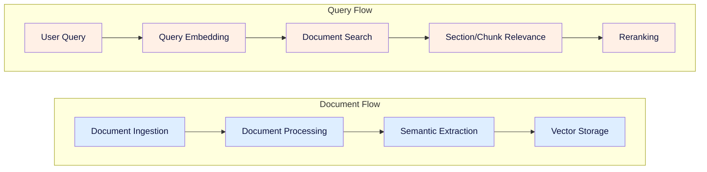

## MVP Scope
### Data Sources
- Wikipedia articles
- PDF documents (textbooks, journal articles)

### Initial Scale
- 25 Wikipedia articles
- 1 textbook (200 pages)
- 2 journal articles

### Target Scale
- 10,000 Wikipedia articles
- 20-50 textbooks
- Thousands of journal articles


## 1. Document Flow Components

The document flow covers the addition of new documents and their subsequent processing for search and retrieval.

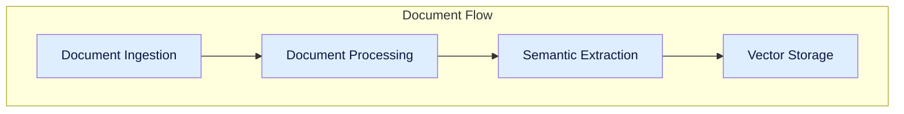

### Document Ingestion

The document ingestion system serves as the primary entry point for all content entering the hierarchical RAG system. It provides a pipeline for adding new documents (i.e. Wikipedia articles and PDF documents) to the available set of documents in the library. It also manages the library storage system which consists of a flat filesystem structure for raw document/blob storage and a SQLite database for document management and metadata. 

The primary tasks of ingestion are:
- Determine if a new document already exists in the library and prevent duplication
- Manage storage of the raw documents/blobs (i.e. the original file as it was added to ingestion)
- Manage the internal Doc ID assignment for the document
- Manage the metadata assigned to the internal Doc ID (e.g. date ingested, author(s), etc)
- Manage the SQL lite database of the library documents that maps Doc ID to filepath and other metadata


### Document Processing

The document processing system serves as the  primary approach for converting documents/blobs into text and features we can use to facilitate semantic search and embedding. It provides methods for parsing, labeling, and understanding the content of documents. It is setup to work with PDF documents and wikipedia articles.

The primary task of document processing are:
- extract clean organized text from PDF files
- extract images and tables from PDF files
- update document metadata with extraction outcomes (has_images, has_tables, has_text, status, etc)
- text, image, and table extraction from wikipedia
- we primarily will use docling for PDFs


### Semantic Extraction

The semantic extraction system makes sense of the extracted content for each document. We determine logical section groupings within long documents and create image text summaries to inject in the text. Whole document summaries are obtained and associated Section IDs, page IDs, etc. are added to the document database to help with reranking later on. We also create our individual chunks and assign them relevant Chunk IDs to use later on. Each individual chunk maintains relationships to its higher level section and document(s)


### Vector Storage

The Vector Storage system implements a hierarchical search architecture using ChromaDB collections to enable efficient two-stage retrieval. It maintains separate collections for document summaries and chunks, optimizing search performance while preserving document relationships. The system provides clean interfaces for updates and searches while ensuring data consistency across collections. The search strategies enabled are a document relvance search, and a filtered chunk relevance search

### Document Flow Sequence

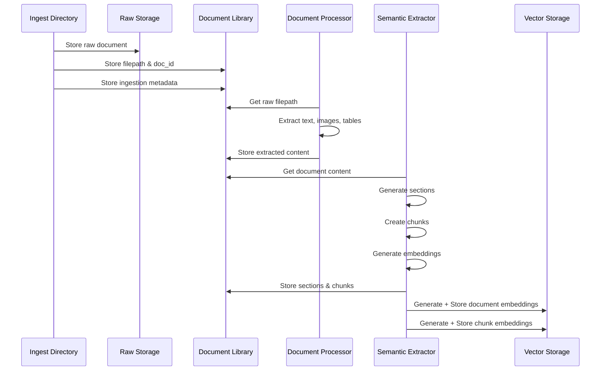


## 2. Query Flow

The Query flow covers the search based on a user query, along with the reranking and context organization.


### Query Processing

The query processing takes a new user query and creates an embedding of it for use in search. Additional query processing may also include query classification/labeling, keyword extraction, query rewriting.

### Document Search

The document search step takes the processed query which contains an embedding and optioonally keywords/labels to help search. The processed query is used to find relevant documents based on the document summary collection. The output of the document search is a list of Doc IDs and their associated search score. The top N Doc IDs are used in subsequent stages

### Section/Chunk Search

The section/chunk search filters the chunk collection based on the Doc IDs then performs a search using the processed query. The output of the section/chunk search is a list of Chunk IDs and their associated search score. This list is used in the reranking stage to determine the best document chunks and context.

### Chunk Reranking

The reranking approach here is based on chunk groups. We rerank based on the largest "contiguous group" and higherst score. Conceptually we want to find sections that have multiple chunks within them of relevancy indicating the section is important. We will use "section chunk coverage" as a metric which is computed as (chunks returned from section)/(total chunks in section).


### Query Flow Sequence

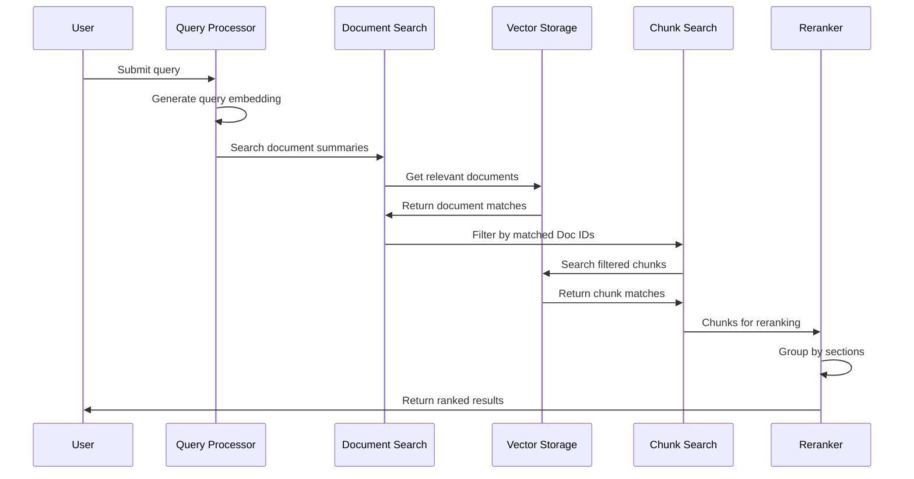


```
</content>
</file_2>

<file_3>
<path>docs/2a_Document_Ingestion.md</path>
<content>
```markdown
# Document Ingestion Technical Specification

## Overview

### Purpose
This document outlines the document ingestion implementation, which takes new documents and adds them to our database along with text and document information extraction. Ingestion incudes raw blob, metadata, and extracted information storage.

### Scope
The system is responsible for:
- Monitoring ingestion folder for new documents
- Assessing validity of ingestion documents (i.e. no duplicates)
- Assigning doc ids and moving new documents into our document database
- extracting and storing document file metadata (size, etc.)
- running feature extraction on documents (text, images, tables, etc)

### System Context
- Input: New PDF document or wikipedia url
- Output: document database entry, raw file blob
- Dependencies: 

## System Architecture

### Processing Stages


## 1. Document Monitor
### 1.1 File Monitor Service
- Implements Python watchdog for directory monitoring
- Supports PDF files initially
- Basic validation:
  * File exists and is readable
  * Valid PDF format
  * File size check

### 1.2 Duplicate Detection
- Calculate file hash (SHA-256)
- Check against existing document hashes in database
- Skip ingestion if duplicate found


## 2. Raw Storage System
### 2.1 Document id service
Issues new document ids for valid documents
- Move file to raw storage with new doc_id-based filename
- Basic file system operations only
- No complex processing at this stage
- updates document database

### 2.2 File Organization

Raw document blobs are stored in a flat filesystem
- will initially store locally
- easy switch to S3 like storage (i.e. cloud)

```
/raw_documents/
└── {doc_id}.pdf
```


## 3. Document Database

### 3.1 Document Database Core Schema
For the ingestion process and raw file storage we maintain the mapping from rawa file to database entry
-  metadata allows for search and retrieval

```sql
------------------------------------------------------------------
-- Core Document Management
------------------------------------------------------------------

-- Primary document tracking
CREATE TABLE documents (
    id TEXT PRIMARY KEY,
    raw_file_path TEXT NOT NULL,            -- Path to original file
    file_hash TEXT NOT NULL,                -- For deduplication
    file_size_bytes INTEGER NOT NULL,
    mime_type TEXT NOT NULL,
    ingestion_date DATETIME NOT NULL DEFAULT CURRENT_TIMESTAMP
);

-- Basic document metadata
CREATE TABLE document_metadata (
    doc_id TEXT PRIMARY KEY,
    title TEXT,
    authors TEXT,                           -- JSON array
    description TEXT,
    creation_date DATETIME,
    page_count INTEGER,
    language TEXT,
    FOREIGN KEY (doc_id) REFERENCES documents(id)
);
```

### 3.2 Document database python client
- client for accessing database in python
- document CRUD
- document search (fuzzy text search on description and/or title?)
- faceted filter on date ingested, etc.


## 4. Basic Processing

### 4.1 Document database Proicessing schema
```sql
------------------------------------------------------------------
-- Document Content & Structure
------------------------------------------------------------------
-- Document's physical section structure
CREATE TABLE document_sections (
    section_id TEXT PRIMARY KEY,
    doc_id TEXT NOT NULL,
    parent_section_id TEXT,
    level INTEGER NOT NULL,                 -- Header level (1=H1, etc)
    title TEXT NOT NULL,
    content TEXT NOT NULL,
    sequence_order INTEGER NOT NULL,        -- Order in document
    page_start INTEGER,
    page_end INTEGER,
    FOREIGN KEY (doc_id) REFERENCES documents(id),
    FOREIGN KEY (parent_section_id) REFERENCES document_sections(section_id)
);

-- Document images
CREATE TABLE document_images (
    id INTEGER PRIMARY KEY,
    doc_id TEXT NOT NULL,
    section_id TEXT NOT NULL,
    image_data TEXT NOT NULL,               -- Base64 encoded
    caption TEXT,                           -- Extracted or generated caption
    embedding_id TEXT,                      -- Vector store reference
    page_number INTEGER NOT NULL,
    FOREIGN KEY (doc_id) REFERENCES documents(id),
    FOREIGN KEY (section_id) REFERENCES document_sections(section_id)
);

-- Document tables
CREATE TABLE document_tables (
    id INTEGER PRIMARY KEY,
    doc_id TEXT NOT NULL,
    section_id TEXT NOT NULL,
    caption TEXT,
    table_data TEXT NOT NULL,               -- JSON structured data
    page_number INTEGER NOT NULL,
    FOREIGN KEY (doc_id) REFERENCES documents(id),
    FOREIGN KEY (section_id) REFERENCES document_sections(section_id)
);
```

### 4.2 PDF Processing
- extract into pydantic using `docling` and `marker-pdf`
- specify a explicit placeholder for images and tables in text
- if palceholder not piossible use REGEX and add one
- updates `document_sections` SQL table entry

### 4.3 Wikipedia processing
- extract text from website or url using `wikipedia` and `wikipedia-api`
- specify place holder for images
- updates `document_sections` SQL table entry

### 4.4. Image and table processing
- for each doc_id stores images and tables in database
- updates the `document_images` and `document_tables` in database


# WORKING ------------------------


## Error Handling
### Basic Error Types
1. File System Errors:
   - File not found
   - Permission denied
   - Storage full

2. Processing Errors:
   - Invalid file format
   - Extraction failure

### Error Response
- Log error details
- Skip problematic documents
- Continue processing others


## Monitoring and Metrics
### Basic Metrics
- Number of documents ingested
- Storage usage
- Basic error counts
- Processing success/failure rates

### Implementation
[Placeholder, needs work...]


## Document Database Diagram

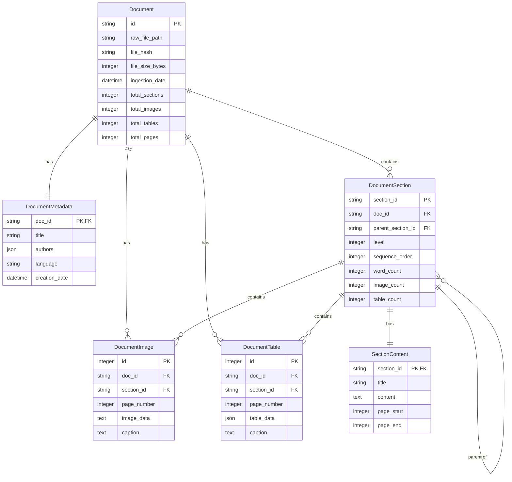
```
</content>
</file_3>

<file_4>
<path>docs/2b_Semantic_Extraction.md</path>
<content>
```markdown
# Semantic Extraction Technical Specification

## Overview

### Purpose
This document specifies the semantic extraction system implementation, which transforms processed documents into searchable, semantically-meaningful content within the RAGnostic architecture.

### Scope
The system is responsible for:
- Creating logical section groupings within documents
- Captioning images and tables with contextual information
- Generating section and document summaries
- Chunking sections for efficient retrieval
- Managing relationships between documents, sections, and chunks
- Storing extracted semantic information
- Generating and managing embeddings in vector store

### System Context
- Input: Processed documents, images, and tables from Document Processing pipeline
- Output: Indexed, searchable content in ChromaDB
- Dependencies: Document Processing, Vector Storage systems

## System Architecture

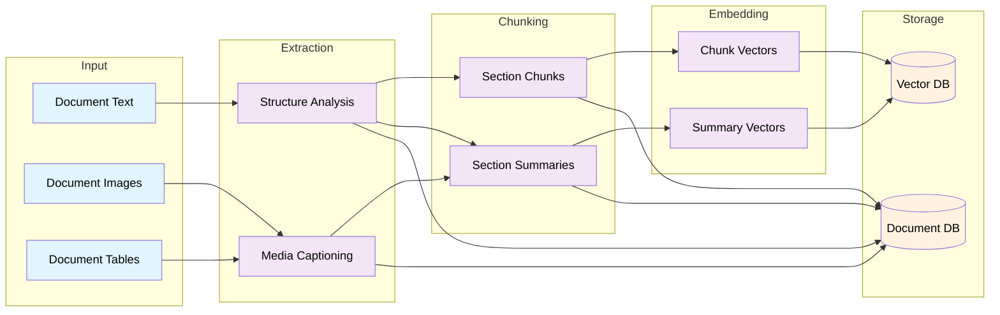


## 1. Input Processing
### 1.1 Document Text
- Source: Output from Document Processing system
- Format: Clean text with preserved structure markers
- Metadata requirements:
  * Line/location tracking
  * Original formatting indicators
  * Section markers

### 1.2 Document Images
- Source: Extracted during document processing
- Format requirements:
  * Standardized resolution/size for LLM processing
  * Location markers in original document
  * Associated nearby text

### 1.3 Document Tables
- Source: Extracted during document processing 
- Format options:
  * CSV for structured data
  * Image format for complex tables
- Required metadata:
  * Original location
  * Column/row headers
  * Table caption if present

## 2. Extraction Stage
### 2.1 Structure Analysis
- Input: Document text with metadata
- Process:
  * Section boundary detection
  * Hierarchy identification
  * Parent-child relationship mapping
- Output:
  * Structured document outline
  * Section metadata
  * Location mappings
  * `semantic_group` and `semantic_group_section` database entries

### 2.2 Media Captioning
- Input: Images and tables with document text context
- Process:
  * Context assembly (nearby text + document metadata)
  * LLM caption generation
  * Quality validation
- Output:
  * Descriptive captions
  * Content categorization
  * Context relationships
  * updated `document_image` database entries

### 2.3. Semantic Grouping
- Input: semantic_groups and semantic_group_sections
- Process:
  * Render full text recursively for the semantic group
  * pulls from document_sections
  * replaces table and image pklaceholder with llm caption/image description
- Output: full text renderings of semantic group
  * full text
  * markdown with emphasis and standard headers based on document_section level, etc


## 3. Chunking Stage
### 3.1 Section Chunks
- Input: Structured document sections
- Process:
  * Chunk boundary determination
  * Overlap calculation
  * Media reference preservation
- Output:
  * Manageable text chunks
  * Chunk metadata
  * Section relationships
  
### 3.2 Section Summaries
- Input: Complete sections with media
- Process:
  * Context assembly
  * Summary generation
  * Metadata extraction
- Output:
  * Section summaries
  * Topic labels
  * Key concepts


## 4. Embedding Stage
### 4.1 Chunk Vectors
- Input: Processed chunks
- Model: opensource embedding (sentence transformers)
- Output:
  * Vector embeddings
  * Metadata mapping
  * Relationship preservation

### 4.2 Summary Vectors
- Input: Section and document summaries
- Model: opensource embedding (sentence transformers)
- Output:
- Output:
  * Summary embeddings
  * Hierarchy mapping
  * Cross-references


## 5. Storage Systems
### 5.1 Vector Database (ChromaDB)
- Collections:
  * Semantic summaries
  * Semantic chunks
- Metadata mapping of document features to the database for filtering


#### semantic_summaries
- Collection name: `semantic_summaries`
- Purpose: First-stage retrieval for document/bulk section filtering
  * conceptually like topic / chapter based filtering

#### semantic_chunks
- Collection name: `semantic_chunks`
- Purpose: Second-stage retrieval within filtered documents
  * raw bits of text within a semantic group
  * used to bvetter rank the semantic group
  * better alignment of chunks within a sectionm / coverage == better semantic group


## 5.2. Document Database (SQLite)
A full view of the document schem to this stage

```sql
------------------------------------------------------------------
-- Core Document Management
------------------------------------------------------------------

-- Primary document tracking
CREATE TABLE documents (
    id TEXT PRIMARY KEY,
    raw_file_path TEXT NOT NULL,            -- Path to original file
    file_hash TEXT NOT NULL,                -- For deduplication
    file_size_bytes INTEGER NOT NULL,
    mime_type TEXT NOT NULL,
    ingestion_date DATETIME NOT NULL DEFAULT CURRENT_TIMESTAMP
);

-- Basic document metadata
CREATE TABLE document_metadata (
    doc_id TEXT PRIMARY KEY,
    title TEXT,
    authors TEXT,                           -- JSON array
    description TEXT,
    creation_date DATETIME,
    page_count INTEGER,
    language TEXT,
    FOREIGN KEY (doc_id) REFERENCES documents(id)
);

------------------------------------------------------------------
-- Document Content & Structure
------------------------------------------------------------------
-- Document's physical section structure
CREATE TABLE document_sections (
    section_id TEXT PRIMARY KEY,
    doc_id TEXT NOT NULL,
    parent_section_id TEXT,
    level INTEGER NOT NULL,                 -- Header level (1=H1, etc)
    title TEXT NOT NULL,
    content TEXT NOT NULL,
    sequence_order INTEGER NOT NULL,        -- Order in document
    page_start INTEGER,
    page_end INTEGER,
    FOREIGN KEY (doc_id) REFERENCES documents(id),
    FOREIGN KEY (parent_section_id) REFERENCES document_sections(section_id)
);

-- Document images
CREATE TABLE document_images (
    id INTEGER PRIMARY KEY,
    doc_id TEXT NOT NULL,
    section_id TEXT NOT NULL,
    image_data TEXT NOT NULL,               -- Base64 encoded
    caption TEXT,                           -- Extracted or generated caption
    embedding_id TEXT,                      -- Vector store reference
    page_number INTEGER NOT NULL,
    FOREIGN KEY (doc_id) REFERENCES documents(id),
    FOREIGN KEY (section_id) REFERENCES document_sections(section_id)
);

-- Document tables
CREATE TABLE document_tables (
    id INTEGER PRIMARY KEY,
    doc_id TEXT NOT NULL,
    section_id TEXT NOT NULL,
    caption TEXT,
    table_data TEXT NOT NULL,               -- JSON structured data
    page_number INTEGER NOT NULL,
    FOREIGN KEY (doc_id) REFERENCES documents(id),
    FOREIGN KEY (section_id) REFERENCES document_sections(section_id)
);

------------------------------------------------------------------
-- Semantic Groups
------------------------------------------------------------------

-- Groups of sections for semantic processing
CREATE TABLE semantic_groups (
    group_id TEXT PRIMARY KEY,
    doc_id TEXT NOT NULL,
    title TEXT NOT NULL,
    summary TEXT,                           -- Generated summary
    extraction_method TEXT NOT NULL,        -- How group was derived
    embedding_id TEXT,                      -- Vector store reference
    FOREIGN KEY (doc_id) REFERENCES documents(id)
);

-- Maps sections to semantic groups
CREATE TABLE semantic_group_sections (
    group_id TEXT NOT NULL,
    section_id TEXT NOT NULL,
    sequence_order INTEGER NOT NULL,
    PRIMARY KEY (group_id, section_id),
    FOREIGN KEY (group_id) REFERENCES semantic_groups(group_id),
    FOREIGN KEY (section_id) REFERENCES document_sections(section_id)
);

------------------------------------------------------------------
-- Processing Status
------------------------------------------------------------------

-- Track document processing state
CREATE TABLE processing_status (
    doc_id TEXT PRIMARY KEY,
    status TEXT NOT NULL CHECK (
        status IN ('ingested', 'processed', 'analyzed', 'failed')
    ),
    error_message TEXT,
    last_updated DATETIME NOT NULL DEFAULT CURRENT_TIMESTAMP,
    FOREIGN KEY (doc_id) REFERENCES documents(id)
);

------------------------------------------------------------------
-- Indexes
------------------------------------------------------------------

-- Document lookup
CREATE INDEX idx_documents_hash ON documents(file_hash);

-- Section navigation
CREATE INDEX idx_sections_doc ON document_sections(doc_id);
CREATE INDEX idx_sections_parent ON document_sections(parent_section_id);
CREATE INDEX idx_sections_sequence ON document_sections(doc_id, sequence_order);

-- Semantic group access
CREATE INDEX idx_semantic_groups_doc ON semantic_groups(doc_id);
CREATE INDEX idx_group_sections_group ON semantic_group_sections(group_id);

```

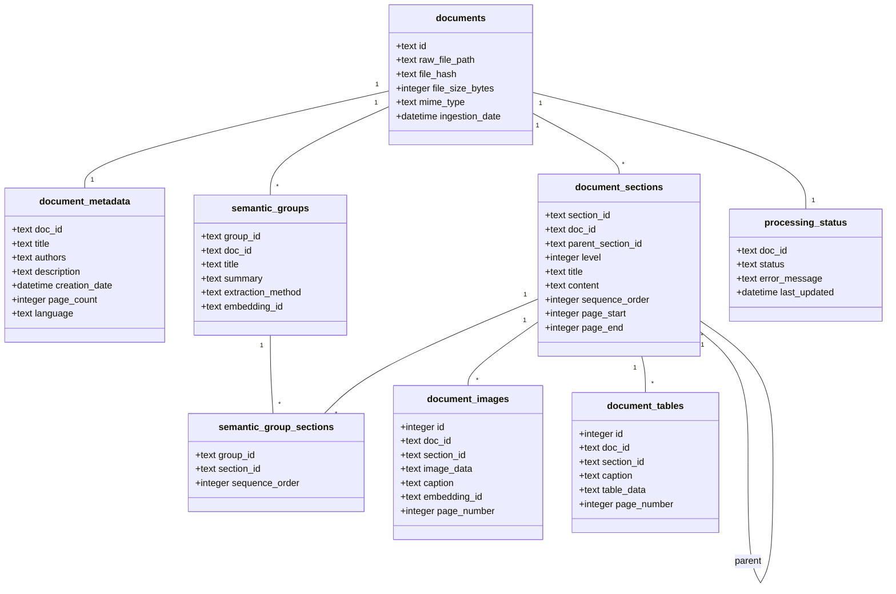


# WORKING ------------------------

## Monitoring and Metrics

### Key Metrics
1. Processing Statistics:
   - Documents processed per minute
   - Average processing time per document
   - Success/failure rates

2. Quality Metrics:
   - Summary coherence scores
   - Section detection accuracy
   - Chunk size distribution
   - Relationship mapping completeness

3. Storage Metrics:
   - Database size growth
   - Index performance
   - Query response times

### Implementation

- store logs in a event table for now
- parse the logs at a later date for stats
```
</content>
</file_4>

<file_5>
<path>llm/artifacts/Evaluation System Technical Specification.md</path>
<content>
```markdown
# Evaluation System Technical Specification

## Overview
The Evaluation System provides metrics and analysis tools for assessing RAG system performance, with primary focus on search quality assessment and secondary focus on system performance monitoring. The MVP implementation emphasizes practical, actionable metrics that can guide manual parameter tuning and system improvements.

## System Components

### Search Quality Assessment
The Search Quality Assessment system tracks and analyzes the relevance and effectiveness of search results. It provides both per-query and aggregate metrics to guide system improvements.

#### Quality Metrics
- Primary metrics:
  * Chunk relevance score
    - Manual relevance ratings (1-5 scale)
    - Query-chunk similarity scores
    - Context preservation assessment
  * Section coverage metrics
    - Percentage of section retrieved
    - Contiguity of retrieved chunks
    - Section boundary preservation
  * Result coherence
    - Inter-chunk relevance
    - Section narrative flow
    - Context maintenance

#### Quality Analysis Tools
- Results analyzer
  * Per-query result inspection
  * Section coverage visualization
  * Chunk sequence analysis
- Aggregate reporting
  * Daily/weekly quality summaries
  * Trend analysis
  * Problem area identification

#### Scaling Considerations
- Automated relevance assessment
- Machine learning based metrics
- Cross-query analysis
- User feedback integration

### Performance Monitoring
The Performance Monitoring system tracks system operational metrics to ensure efficient query processing and resource utilization.

#### Performance Metrics
- Query processing:
  * Total query latency
  * Per-stage timing breakdown
  * Cache hit rates
  * Resource utilization
- System health:
  * Storage usage
  * Memory consumption
  * Processing queue lengths
  * Error rates

#### Monitoring Tools
- Real-time dashboard
  * Current performance stats
  * Resource utilization
  * Query queue status
  * Error monitoring
- Historical analysis
  * Performance trends
  * Resource usage patterns
  * Bottleneck identification
  * Capacity planning data

#### Scaling Considerations
- Distributed monitoring
- Advanced analytics
- Predictive monitoring
- Resource optimization

### Parameter Management
The Parameter Management system supports manual tuning of system parameters based on quality and performance metrics.

#### Tunable Parameters
- Chunk configuration:
  * Chunk size
  * Overlap settings
  * Section boundaries
- Search settings:
  * Similarity thresholds
  * Result count limits
  * Reranking weights
- System configuration:
  * Batch sizes
  * Cache settings
  * Resource limits

#### Configuration Tools
- Parameter tracking
  * Current settings log
  * Change history
  * Impact assessment
- Testing support
  * A/B test setup
  * Performance comparison
  * Quality impact analysis

#### Scaling Considerations
- Automated parameter optimization
- A/B testing framework
- Multi-environment testing
- Configuration versioning

## Evaluation Workflows

### 1. Quality Assessment Process
The Quality Assessment Process defines how search quality is measured and analyzed.

- Per-query evaluation
  * Execute test queries
  * Collect quality metrics
  * Analyze section coverage
  * Document findings
- Aggregate analysis
  * Compile daily statistics
  * Generate quality reports
  * Identify improvement areas
  * Track quality trends

#### Scaling Considerations
- Automated testing
- Continuous evaluation
- Enhanced analytics
- User feedback loops

### 2. Performance Analysis
The Performance Analysis process monitors and assesses system operational efficiency.

- Real-time monitoring
  * Track current metrics
  * Alert on issues
  * Resource tracking
  * Queue monitoring
- Trend analysis
  * Daily/weekly reports
  * Resource utilization
  * Bottleneck identification
  * Capacity planning

#### Scaling Considerations
- Distributed monitoring
- Predictive analytics
- Advanced alerting
- Resource optimization

### 3. Tuning Workflow
The Tuning Workflow supports systematic parameter adjustment and impact assessment.

- Parameter adjustment
  * Identify target metrics
  * Adjust parameters
  * Monitor impact
  * Document changes
- Impact analysis
  * Compare metrics
  * Assess trade-offs
  * Document findings
  * Make recommendations

#### Scaling Considerations
- Automated tuning
- Multi-parameter optimization
- Advanced testing frameworks
- Configuration management

## MVP Scale Support
- Local metric collection
- Basic quality assessment
- Simple performance monitoring
- Manual parameter tuning
- Support for initial document set:
  * 25 Wikipedia articles
  * 1 textbook
  * 2 journal articles

## Error Handling

### Error Detection
The Error Detection system monitors evaluation processes and identifies issues.

- Metric collection errors
- Analysis failures
- Data quality issues
- Processing problems

### Recovery Procedures
The Recovery system manages error recovery in evaluation processes.

- Metric recalculation
- Analysis retry logic
- Data validation
- Error documentation

## Reporting and Analysis

### Quality Reporting
The Quality Reporting system provides regular assessment of system effectiveness.

- Daily quality summaries
- Weekly trend analysis
- Problem area identification
- Improvement recommendations

### Performance Reporting
The Performance Reporting system tracks system operational health.

- Resource utilization reports
- Query performance analysis
- Error rate tracking
- Capacity planning data

#### Scaling Considerations
- Enhanced analytics
- Custom reporting
- Automated insights
- Predictive analysis
```
</content>
</file_5>

<file_6>
<path>llm/artifacts/ID_Manager_Refactor.md</path>
<content>
```markdown
# Document ID Management Design

## Overview

This document outlines the design for a robust document ID management system in the Ragnostic pipeline. The system aims to ensure consistency between file storage and database records while handling various edge cases and failure scenarios.

## Current vs Proposed Flow

### Current Flow

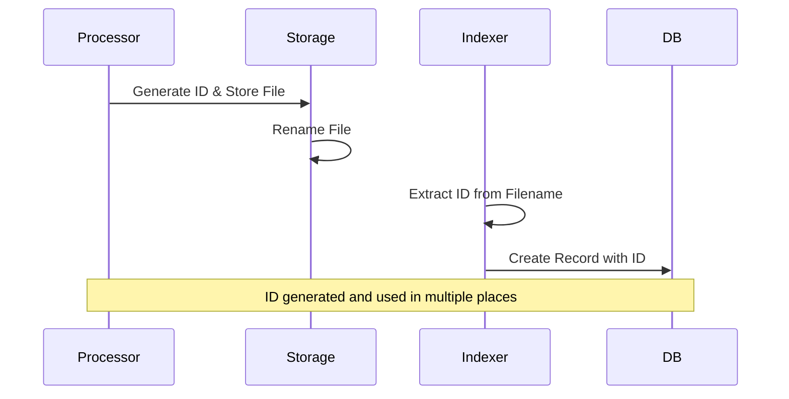

### Proposed Flow

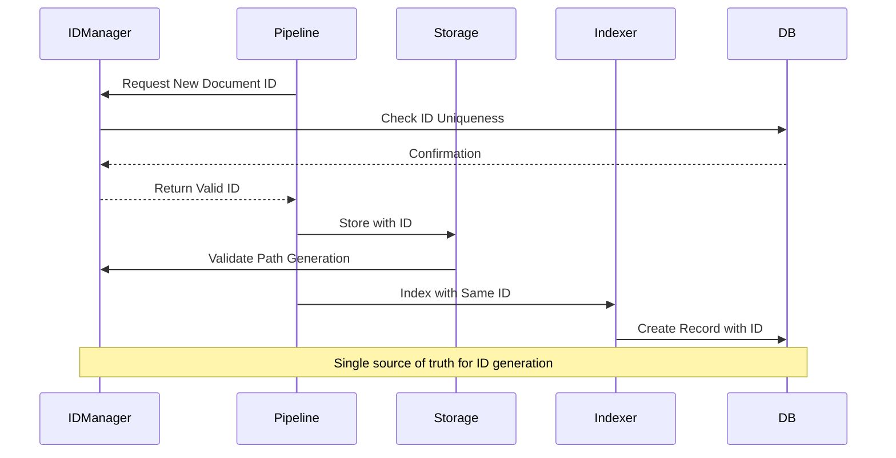

## ID Manager Component Design

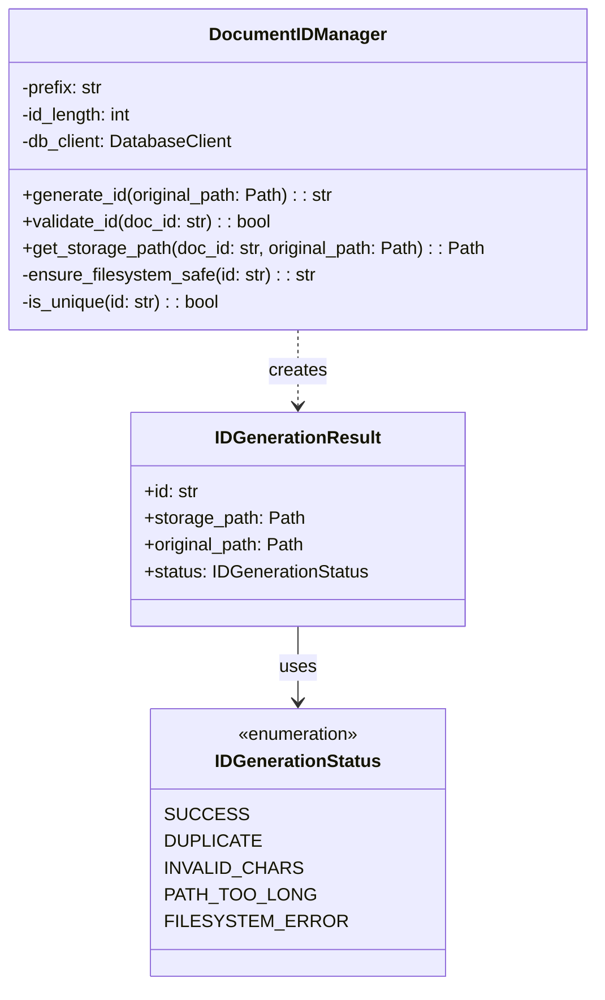

## Key Components

### 1. DocumentIDManager

Central component responsible for all ID-related operations:

```python
class DocumentIDManager:
    def generate_id(self, original_path: Path) -> IDGenerationResult:
        """
        Generate a unique, filesystem-safe document ID.
        
        Features:
        - Ensures uniqueness in database
        - Validates filesystem constraints
        - Handles path/name collisions
        - Returns full context including storage path
        """

    def validate_id(self, doc_id: str) -> bool:
        """
        Validate ID meets all constraints.
        
        Checks:
        - Format compliance
        - Character validity
        - Length restrictions
        - Database uniqueness
        """

    def get_storage_path(self, doc_id: str, original_path: Path) -> Path:
        """
        Generate storage path for document.
        
        Features:
        - Maintains extension
        - Handles path length limits
        - Ensures safe characters
        - Optional hashed subdirectories
        """
```

### 2. ID Format Specification

```
{PREFIX}_{TIMESTAMP}_{RANDOM}_{HASH_FRAGMENT}

Example: DOC_20240201_a1b2c3_f7e6
```

- PREFIX: Configurable document type identifier
- TIMESTAMP: Sortable timestamp (compact format)
- RANDOM: Random string for uniqueness
- HASH_FRAGMENT: Partial file hash for integrity checking

### 3. Storage Strategy

```mermaid
graph TD
    A[Original File] --> B{ID Manager}
    B -->|Generate| C[Valid ID]
    C --> D{Storage Manager}
    D -->|Option 1| E[Flat Structure]
    D -->|Option 2| F[Hash-Based Dirs]
    E --> G[/storage/DOC_20240201_a1b2c3.pdf]
    F --> H[/storage/a1/b2/DOC_20240201_a1b2c3.pdf]
```

## Error Handling and Recovery

### File System Operations

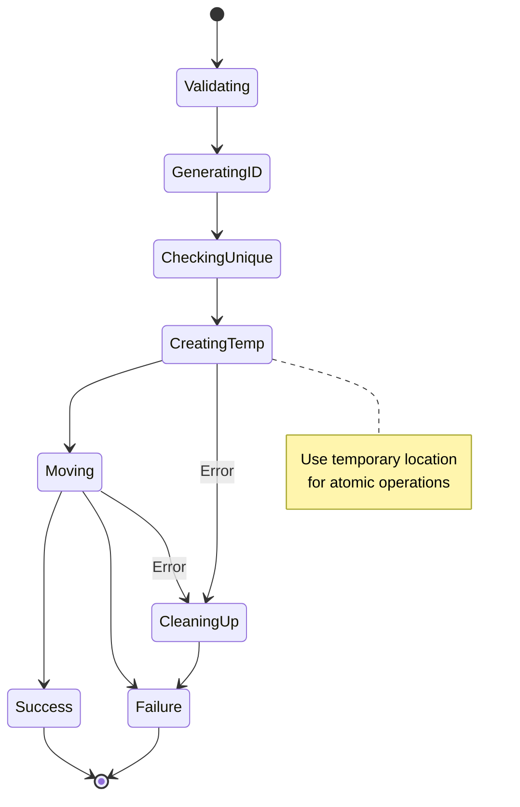

### Error Recovery Process

1. **Temporary Storage**:
   - Files initially stored with `.temp` suffix
   - Only renamed after successful ID registration
   - Automatic cleanup of orphaned temp files

2. **ID Reservation**:
   - IDs temporarily reserved in database
   - Released if operation fails
   - Timeout mechanism for hung operations

3. **Conflict Resolution**:
   - Automatic retry with new ID on collision
   - Maximum retry attempts configurable
   - Failure reporting with context

## Implementation Considerations

1. **Performance**:
   - Batch ID generation support
   - ID reservation with TTL
   - Caching of filesystem checks

2. **Scalability**:
   - Distributed ID generation support
   - Sharding by prefix/timestamp
   - Rate limiting and backoff

3. **Monitoring**:
   - ID generation metrics
   - Collision tracking
   - Failure rate monitoring

4. **Configuration**:
   - Customizable ID format
   - Storage strategy selection
   - Retry/timeout settings

## Migration Strategy

1. Phase 1: Implement ID Manager
2. Phase 2: Update Pipeline Components
3. Phase 3: Migrate Existing Documents
4. Phase 4: Enable Advanced Features


# Example Implementation

"""Document ID management functionality."""
import hashlib
import time
from datetime import datetime
from pathlib import Path
from typing import Optional
from enum import Enum
import string

from nanoid import generate
from pydantic import BaseModel

from ragnostic.db.client import DatabaseClient


class IDGenerationStatus(str, Enum):
    """Status of ID generation operation."""
    SUCCESS = "success"
    DUPLICATE = "duplicate"
    INVALID_CHARS = "invalid_chars"
    PATH_TOO_LONG = "path_too_long"
    FILESYSTEM_ERROR = "filesystem_error"


class IDGenerationResult(BaseModel):
    """Result of ID generation attempt."""
    id: str
    storage_path: Path
    original_path: Path
    status: IDGenerationStatus
    error_message: Optional[str] = None

    class Config:
        arbitrary_types_allowed = True


class DocumentIDManager:
    """Manages document ID generation and validation."""
    
    # Characters safe for all filesystems
    SAFE_CHARS = string.ascii_letters + string.digits + "-_"
    
    def __init__(
        self,
        db_client: DatabaseClient,
        prefix: str = "DOC",
        id_length: int = 12,
        max_retries: int = 3,
    ):
        """Initialize ID manager.
        
        Args:
            db_client: Database client for uniqueness checks
            prefix: Prefix for document IDs
            id_length: Length of random portion of ID
            max_retries: Maximum retry attempts for ID generation
        """
        self.db_client = db_client
        self.prefix = prefix
        self.id_length = id_length
        self.max_retries = max_retries
    
    def generate_id(self, original_path: Path) -> IDGenerationResult:
        """Generate a unique document ID with storage path.
        
        Args:
            original_path: Path to original document
            
        Returns:
            IDGenerationResult with status and details
        """
        attempts = 0
        while attempts < self.max_retries:
            try:
                # Generate timestamp portion
                timestamp = datetime.now().strftime("%Y%m%d_%H%M%S")
                
                # Generate random portion
                random_id = generate(alphabet=self.SAFE_CHARS, size=self.id_length)
                
                # Get partial file hash
                hash_fragment = self._get_hash_fragment(original_path)
                
                # Combine parts
                doc_id = f"{self.prefix}_{timestamp}_{random_id}_{hash_fragment}"
                
                # Check if ID is unique
                if not self._is_unique(doc_id):
                    attempts += 1
                    continue
                
                # Generate storage path
                storage_path = self._get_storage_path(doc_id, original_path)
                
                # Validate final path
                if not self._validate_path(storage_path):
                    return IDGenerationResult(
                        id=doc_id,
                        storage_path=storage_path,
                        original_path=original_path,
                        status=IDGenerationStatus.PATH_TOO_LONG,
                        error_message="Final storage path too long"
                    )
                
                return IDGenerationResult(
                    id=doc_id,
                    storage_path=storage_path,
                    original_path=original_path,
                    status=IDGenerationStatus.SUCCESS
                )
                
            except Exception as e:
                attempts += 1
                if attempts >= self.max_retries:
                    return IDGenerationResult(
                        id="",
                        storage_path=Path(),
                        original_path=original_path,
                        status=IDGenerationStatus.FILESYSTEM_ERROR,
                        error_message=str(e)
                    )
        
        return IDGenerationResult(
            id="",
            storage_path=Path(),
            original_path=original_path,
            status=IDGenerationStatus.DUPLICATE,
            error_message="Failed to generate unique ID"
        )
    
    def _get_hash_fragment(self, filepath: Path, length: int = 4) -> str:
        """Get first N characters of file hash."""
        try:
            sha256_hash = hashlib.sha256()
            with open(filepath, "rb") as f:
                # Read in chunks to handle large files
                for byte_block in iter(lambda: f.read(4096), b""):
                    sha256_hash.update(byte_block)
            return sha256_hash.hexdigest()[:length]
        except Exception:
            # On error, use timestamp-based fragment
            return hex(int(time.time()))[2:6]
    
    def _is_unique(self, doc_id: str) -> bool:
        """Check if document ID is unique in database."""
        existing_doc = self.db_client.get_document_by_id(doc_id)
        return existing_doc is None
    
    def _get_storage_path(self, doc_id: str, original_path: Path) -> Path:
        """Generate storage path for document.
        
        Currently uses flat structure, could be extended to use 
        hash-based subdirectories for better scalability.
        """
        suffix = original_path.suffix
        return Path("storage") / f"{doc_id}{suffix}"
    
    def _validate_path(self, path: Path) -> bool:
        """Validate storage path meets filesystem constraints."""
        try:
            # Check path length (Windows has 260 char limit by default)
            if len(str(path.resolve())) > 250:
                return False
            
            # Validate each part has only safe characters
            return all(
                all(c in self.SAFE_CHARS for c in part)
                for part in path.parts
                if part not in ["/", "\\", ":"]
            )
        except Exception:
            return False
```
</content>
</file_6>

<file_7>
<path>llm/artifacts/Query Pipeline Technical Specification.md</path>
<content>
```markdown
# Query Pipeline Technical Specification

## Overview
The Query Pipeline system manages the flow of search queries through the hierarchical RAG system, implementing a two-stage retrieval process with section-aware reranking. It coordinates between the document summary and chunk collections to provide coherent, contextually relevant results. The MVP focuses on reliable retrieval with basic section-based result organization.

## System Components

### Query Preprocessor
The Query Preprocessor handles initial query preparation and optimization before vector search execution. It ensures queries are properly formatted and includes any necessary filtering parameters.

- Query text cleaning
  * Remove special characters
  * Normalize whitespace
  * Basic spell checking
- Filter extraction
  * Parse metadata constraints
  * Validate filter values
  * Format for ChromaDB query
- Query augmentation
  * Add standard prefixes/suffixes if needed
  * Expand common abbreviations
  * Handle special query types

#### Scaling Considerations
- Advanced query understanding
- Query intent classification
- Multi-language support
- Query optimization rules

### Document Filter Search
The Document Filter Search component manages the first stage of retrieval, identifying relevant documents based on summary embeddings and metadata.

- Search process:
  * Generate query embedding
  * Execute similarity search on doc_summaries
  * Apply metadata filters
  * Score and rank documents
- Output format:
  * Ranked document IDs
  * Relevance scores
  * Basic document metadata
  * Section listings

#### Scaling Considerations
- Distributed search coordination
- Advanced filter optimization
- Enhanced scoring methods
- Caching strategies

### Chunk Retrieval System
The Chunk Retrieval System performs focused search within filtered documents, retrieving relevant text chunks while maintaining section context.

- Retrieval process:
  * Filter by selected documents
  * Execute similarity search on chunks
  * Group by section
  * Track chunk positions
- Section tracking:
  * Section boundaries
  * Chunk sequence numbers
  * Section metadata
  * Context windows

#### Scaling Considerations
- Parallel chunk retrieval
- Enhanced context tracking
- Cross-document relations
- Dynamic chunk sizing

### Result Reranking
The Result Reranking system implements section-aware scoring and organization of search results, prioritizing coherent section coverage.

- Reranking factors:
  * Section coverage score
    - Count retrieved chunks per section
    - Calculate section completeness
    - Score based on coverage ratio
  * Chunk sequence analysis
    - Check chunk adjacency
    - Identify gaps in coverage
    - Prefer contiguous chunks
- Result grouping:
  * Group by section
  * Maintain document context
  * Track section boundaries
  * Preserve chunk order

#### Scaling Considerations
- Advanced scoring algorithms
- Machine learning reranking
- User feedback integration
- Context-aware scoring

## Processing Pipeline

### 1. Query Initialization
The Query Initialization stage prepares the search request for processing through the pipeline.

- Parse query parameters
- Validate request format
- Initialize search context
- Set up result tracking

#### Scaling Considerations
- Request queuing
- Priority handling
- Resource allocation
- Query optimization

### 2. First-Stage Retrieval
The First-Stage Retrieval process identifies candidate documents for detailed chunk search.

- Execute summary search
- Apply metadata filters
- Score documents
- Select top candidates

#### Scaling Considerations
- Parallel search execution
- Enhanced candidate selection
- Dynamic thresholding
- Result caching

### 3. Chunk Search
The Chunk Search process retrieves relevant text chunks from selected documents.

- Filter by document set
- Execute chunk search
- Group by section
- Track chunk metadata

#### Scaling Considerations
- Distributed chunk search
- Enhanced filtering
- Dynamic chunk selection
- Cross-node coordination

### 4. Result Organization
The Result Organization process applies reranking and formats the final response.

- Calculate section coverage
- Apply reranking logic
- Format response data
- Include context metadata

#### Scaling Considerations
- Advanced reranking models
- Enhanced response formats
- Feedback integration
- Custom scoring rules

## MVP Scale Support
- Local execution
- Sequential processing
- Basic section tracking
- Simple coverage scoring
- Support for initial document set:
  * 25 Wikipedia articles
  * 1 textbook
  * 2 journal articles

## Error Handling and Recovery

### Error Detection
The Error Detection system monitors query execution and identifies processing issues.

- Query validation errors
- Search execution failures
- Scoring issues
- Response formatting problems

### Recovery Procedures
The Recovery system manages error recovery and query retry operations.

- Query retry logic
- Partial result handling
- Error response formatting
- Recovery logging

## Monitoring and Performance

### Query Monitoring
The Query Monitoring system tracks execution metrics and performance indicators.

- Query latency tracking
- Stage timing metrics
- Error rate monitoring
- Result quality metrics

### Performance Optimization
The Performance Optimization system manages query execution efficiency.

- Basic query caching
- Resource management
- Result size optimization
- Response formatting efficiency

#### Scaling Considerations
- Enhanced monitoring
- Advanced analytics
- Performance prediction
- Automated optimization
```
</content>
</file_7>

<file_8>
<path>llm/artifacts/Vector Storage Technical Specification.md</path>
<content>
```markdown
# Vector Storage Technical Specification

## Overview
The Vector Storage system implements a hierarchical search architecture using ChromaDB collections to enable efficient two-stage retrieval. It maintains separate collections for document summaries and chunks, optimizing search performance while preserving document relationships. The system provides clean interfaces for updates and searches while ensuring data consistency across collections.

## System Components

### Collection Management
The Collection Management system handles the creation, maintenance, and optimization of ChromaDB collections. It ensures proper separation of concerns between summary and chunk-level searches while maintaining consistent metadata across collections.

#### Document Summary Collection
- Collection name: `doc_summaries`
- Purpose: First-stage retrieval for document filtering
- Contents:
  * Document-level embeddings
  * Document summaries
  * Section listings
  * Key metadata for filtering
- Metadata schema:
  * doc_id: STRING        # Maps to SQLite document ID
  * title: STRING
  * doc_type: STRING      # wikipedia/textbook/journal
  * publication_date: STRING
  * summary_text: STRING
  * section_count: INT
  * last_updated: STRING
  * embedding_model: STRING

#### Chunk Collection
- Collection name: `doc_chunks`
- Purpose: Second-stage retrieval within filtered documents
- Contents:
  * Chunk embeddings
  * Chunk text
  * Section information
  * Position context
- Metadata schema:
  * doc_id: STRING        # Maps to SQLite document ID
  * chunk_id: STRING      # Unique chunk identifier
  * section_id: STRING    # Section identifier
  * section_title: STRING
  * chunk_text: STRING
  * position: INT         # Chunk position in document
  * last_updated: STRING
  * embedding_model: STRING

### Vector Search System
The Vector Search system implements the two-stage retrieval process, managing query embedding generation and result filtering. It provides optimized search interfaces for both summary and chunk-level queries.

#### Document Filter Search
- Input: Query text and optional filters
- Process:
  * Generate query embedding
  * Search doc_summaries collection
  * Apply metadata filters
  * Return filtered document list
- Output: Ranked list of document IDs and metadata

#### Chunk Search
- Input: Query text and filtered document IDs
- Process:
  * Generate query embedding
  * Search doc_chunks collection within filtered docs
  * Group results by section/document
  * Apply relevance scoring
- Output: Ranked chunks with context

### Update Management
The Update Management system handles regular synchronization between the SQLite document store and ChromaDB collections. It ensures data consistency and manages efficient batch updates.

#### Document Updates
- Weekly batch processing
- Steps:
  1. Identify modified documents
  2. Generate new summaries and embeddings
  3. Update doc_summaries collection
  4. Track embedding model versions

#### Chunk Updates
- Weekly batch processing
- Steps:
  1. Process modified documents
  2. Generate new chunks and embeddings
  3. Update doc_chunks collection
  4. Maintain chunk ordering and relationships

## MVP Scale Support
- Collections stored locally
- Batch size: 100 documents max
- Update frequency: Weekly
- Initial document set:
  * 25 Wikipedia articles
  * 1 textbook
  * 2 journal articles

#### Scaling Considerations
- Distributed ChromaDB deployment
- Sharded collections
- Real-time updates
- Enhanced consistency checks
- Advanced caching

## System Operations

### 1. Collection Initialization
The Collection Initialization process handles the creation and configuration of ChromaDB collections.

- Collection creation
- Schema validation
- Index configuration
- Initial metadata population

#### Scaling Considerations
- Multi-node collection setup
- Enhanced index configuration
- Distributed initialization

### 2. Search Operations
The Search Operations system manages the execution of search queries across collections.

- Query preprocessing
- Two-stage retrieval
- Result aggregation
- Response formatting

#### Scaling Considerations
- Distributed search coordination
- Enhanced result caching
- Cross-node query optimization

### 3. Update Operations
The Update Operations system handles regular synchronization of vector storage with document changes.

- Change detection
- Batch update processing
- Consistency validation
- Version management

#### Scaling Considerations
- Distributed update coordination
- Real-time update capabilities
- Cross-collection consistency

## Error Handling and Recovery

### Error Detection
The Error Detection system monitors vector storage operations and identifies issues.

- Collection health checks
- Update validation
- Search monitoring
- Consistency verification

### Recovery Procedures
The Recovery system manages error recovery and data consistency restoration.

- Collection rebuild procedures
- Consistency repair
- Update retry logic
- Backup restoration

## Monitoring and Maintenance

### System Monitoring
The System Monitoring tracks key metrics for vector storage operations.

- Collection size tracking
- Search latency monitoring
- Update success rates
- Memory usage tracking

### Maintenance Operations
The Maintenance system performs regular upkeep of vector storage.

- Index optimization
- Embedding version checks
- Collection compaction
- Performance tuning

#### Scaling Considerations
- Distributed monitoring
- Advanced analytics
- Automated maintenance
- Cross-node coordination
```
</content>
</file_8>

<file_9>
<path>llm/context/repo_content.md</path>
<content>
```markdown
<file_1>
<path>docs/1_System_Requirements.md</path>
<content>
```markdown
# Hierarchical RAG System Requirements

## System Overview & Data Sources
- Wikipedia articles (Initial: 25, Target: 10,000)
- PDF documents
  * Initial: 1 textbook (200 pages), 2 journal articles
  * Target: 20-50 textbooks, thousands of journal articles

## Technical Requirements

### Document Processing & Storage
- Parse Wikipedia articles via API
- Process PDFs using Doculing
- Raw document storage with consistent structure
  * Separate dirs by document type
  * Consistent naming convention
  * Atomic operations
  * Duplicate handling
  * Backup system with periodic snapshots
- Generate and track document metadata
  * Title and author extraction
  * Date and source tracking
  * Parent-child relationships
  * Position tracking
- Create hierarchical summaries and chunks
  * Extractive summarization
  * Configurable length control
  * Semantic boundaries
  * Context preservation
- Compute embeddings at multiple levels
  * Model selection
  * Batch processing

### Vector Database Integration
- ChromaDB or LanceDB implementation
- Collection structure
  * Separate collections per level
  * Metadata schema
- Vector storage operations
  * Batch insertion
  * Update handling
  * Index maintenance
  * Health checks

### Query Pipeline
1. Document summary search via embeddings
2. Filtered chunk search within matched documents
3. Basic reranking system
   * Grouping logic
   * Score combination
   * Result formatting
   * Metadata inclusion
   * Context assembly

### Performance Requirements
- Query response time: Up to 30 seconds acceptable
- Infrequent document updates (daily at most)
- Local deployment initially, cloud migration planned

### Evaluation System
- Accuracy and precision metrics
- Parameter tuning capability
- System performance tracking

## Implementation Pipeline
1. Ingest from monitored directory
   * watchdog for directory monitoring
   * file type detection
2. Parse and extract content
3. Generate metadata
4. Create hierarchical structures
5. Compute embeddings
6. Store in vector database

## Future Considerations
- Cloud deployment
- API service development
- Enhanced reranking system
- Evaluation metrics implementation
- Parameter optimization
```
</content>
</file_1>

<file_2>
<path>docs/2_Ragnostic_Project_Plan.md</path>
<content>
```markdown
# Ragnostic Project Plan 

RAGnostic is a general system to implement heirarchal document retrieval. 

## Overview
More narrowly for the proof of concept we will make a system that searches document summaries first to filter the document list, then performs vector search on smaller chunks within filtered documents.


## MVP Scope
### Data Sources
- Wikipedia articles
- PDF documents (textbooks, journal articles)

### Initial Scale
- 25 Wikipedia articles
- 1 textbook (200 pages)
- 2 journal articles

### Target Scale
- 10,000 Wikipedia articles
- 20-50 textbooks
- Thousands of journal articles


## 1. Document Flow Components

The document flow covers the addition of new documents and their subsequent processing for search and retrieval.


### Document Ingestion

The document ingestion system serves as the primary entry point for all content entering the hierarchical RAG system. It provides a pipeline for adding new documents (i.e. Wikipedia articles and PDF documents) to the available set of documents in the library. It also manages the library storage system which consists of a flat filesystem structure for raw document/blob storage and a SQLite database for document management and metadata. 

The primary tasks of ingestion are:
- Determine if a new document already exists in the library and prevent duplication
- Manage storage of the raw documents/blobs (i.e. the original file as it was added to ingestion)
- Manage the internal Doc ID assignment for the document
- Manage the metadata assigned to the internal Doc ID (e.g. date ingested, author(s), etc)
- Manage the SQL lite database of the library documents that maps Doc ID to filepath and other metadata


### Document Processing

The document processing system serves as the  primary approach for converting documents/blobs into text and features we can use to facilitate semantic search and embedding. It provides methods for parsing, labeling, and understanding the content of documents. It is setup to work with PDF documents and wikipedia articles.

The primary task of document processing are:
- extract clean organized text from PDF files
- extract images and tables from PDF files
- update document metadata with extraction outcomes (has_images, has_tables, has_text, status, etc)
- text, image, and table extraction from wikipedia
- we primarily will use docling for PDFs


### Semantic Extraction

The semantic extraction system makes sense of the extracted content for each document. We determine logical section groupings within long documents and create image text summaries to inject in the text. Whole document summaries are obtained and associated Section IDs, page IDs, etc. are added to the document database to help with reranking later on. We also create our individual chunks and assign them relevant Chunk IDs to use later on. Each individual chunk maintains relationships to its higher level section and document(s)


### Vector Storage

The Vector Storage system implements a hierarchical search architecture using ChromaDB collections to enable efficient two-stage retrieval. It maintains separate collections for document summaries and chunks, optimizing search performance while preserving document relationships. The system provides clean interfaces for updates and searches while ensuring data consistency across collections. The search strategies enabled are a document relvance search, and a filtered chunk relevance search

### Document Flow Sequence


## 2. Query Flow

The Query flow covers the search based on a user query, along with the reranking and context organization.


### Query Processing

The query processing takes a new user query and creates an embedding of it for use in search. Additional query processing may also include query classification/labeling, keyword extraction, query rewriting.

### Document Search

The document search step takes the processed query which contains an embedding and optioonally keywords/labels to help search. The processed query is used to find relevant documents based on the document summary collection. The output of the document search is a list of Doc IDs and their associated search score. The top N Doc IDs are used in subsequent stages

### Section/Chunk Search

The section/chunk search filters the chunk collection based on the Doc IDs then performs a search using the processed query. The output of the section/chunk search is a list of Chunk IDs and their associated search score. This list is used in the reranking stage to determine the best document chunks and context.

### Chunk Reranking

The reranking approach here is based on chunk groups. We rerank based on the largest "contiguous group" and higherst score. Conceptually we want to find sections that have multiple chunks within them of relevancy indicating the section is important. We will use "section chunk coverage" as a metric which is computed as (chunks returned from section)/(total chunks in section).


### Query Flow Sequence


```
</content>
</file_2>

<file_3>
<path>docs/2a_Document_Ingestion.md</path>
<content>
```markdown
# Document Ingestion Technical Specification

## Overview

### Purpose
This document outlines the document ingestion implementation, which takes new documents and adds them to our database along with text and document information extraction. Ingestion incudes raw blob, metadata, and extracted information storage.

### Scope
The system is responsible for:
- Monitoring ingestion folder for new documents
- Assessing validity of ingestion documents (i.e. no duplicates)
- Assigning doc ids and moving new documents into our document database
- extracting and storing document file metadata (size, etc.)
- running feature extraction on documents (text, images, tables, etc)

### System Context
- Input: New PDF document or wikipedia url
- Output: document database entry, raw file blob
- Dependencies: 

## System Architecture

### Processing Stages


## 1. Document Monitor
### 1.1 File Monitor Service
- Implements Python watchdog for directory monitoring
- Supports PDF files initially
- Basic validation:
  * File exists and is readable
  * Valid PDF format
  * File size check

### 1.2 Duplicate Detection
- Calculate file hash (SHA-256)
- Check against existing document hashes in database
- Skip ingestion if duplicate found


## 2. Raw Storage System
### 2.1 Document id service
Issues new document ids for valid documents
- Move file to raw storage with new doc_id-based filename
- Basic file system operations only
- No complex processing at this stage
- updates document database

### 2.2 File Organization

Raw document blobs are stored in a flat filesystem
- will initially store locally
- easy switch to S3 like storage (i.e. cloud)

```
/raw_documents/
└── {doc_id}.pdf
```


## 3. Document Database

### 3.1 Document Database Core Schema
For the ingestion process and raw file storage we maintain the mapping from rawa file to database entry
-  metadata allows for search and retrieval

```sql
------------------------------------------------------------------
-- Core Document Management
------------------------------------------------------------------

-- Primary document tracking
CREATE TABLE documents (
    id TEXT PRIMARY KEY,
    raw_file_path TEXT NOT NULL,            -- Path to original file
    file_hash TEXT NOT NULL,                -- For deduplication
    file_size_bytes INTEGER NOT NULL,
    mime_type TEXT NOT NULL,
    ingestion_date DATETIME NOT NULL DEFAULT CURRENT_TIMESTAMP
);

-- Basic document metadata
CREATE TABLE document_metadata (
    doc_id TEXT PRIMARY KEY,
    title TEXT,
    authors TEXT,                           -- JSON array
    description TEXT,
    creation_date DATETIME,
    page_count INTEGER,
    language TEXT,
    FOREIGN KEY (doc_id) REFERENCES documents(id)
);
```

### 3.2 Document database python client
- client for accessing database in python
- document CRUD
- document search (fuzzy text search on description and/or title?)
- faceted filter on date ingested, etc.


## 4. Basic Processing

### 4.1 Document database Proicessing schema
```sql
------------------------------------------------------------------
-- Document Content & Structure
------------------------------------------------------------------
-- Document's physical section structure
CREATE TABLE document_sections (
    section_id TEXT PRIMARY KEY,
    doc_id TEXT NOT NULL,
    parent_section_id TEXT,
    level INTEGER NOT NULL,                 -- Header level (1=H1, etc)
    title TEXT NOT NULL,
    content TEXT NOT NULL,
    sequence_order INTEGER NOT NULL,        -- Order in document
    page_start INTEGER,
    page_end INTEGER,
    FOREIGN KEY (doc_id) REFERENCES documents(id),
    FOREIGN KEY (parent_section_id) REFERENCES document_sections(section_id)
);

-- Document images
CREATE TABLE document_images (
    id INTEGER PRIMARY KEY,
    doc_id TEXT NOT NULL,
    section_id TEXT NOT NULL,
    image_data TEXT NOT NULL,               -- Base64 encoded
    caption TEXT,                           -- Extracted or generated caption
    embedding_id TEXT,                      -- Vector store reference
    page_number INTEGER NOT NULL,
    FOREIGN KEY (doc_id) REFERENCES documents(id),
    FOREIGN KEY (section_id) REFERENCES document_sections(section_id)
);

-- Document tables
CREATE TABLE document_tables (
    id INTEGER PRIMARY KEY,
    doc_id TEXT NOT NULL,
    section_id TEXT NOT NULL,
    caption TEXT,
    table_data TEXT NOT NULL,               -- JSON structured data
    page_number INTEGER NOT NULL,
    FOREIGN KEY (doc_id) REFERENCES documents(id),
    FOREIGN KEY (section_id) REFERENCES document_sections(section_id)
);
```

### 4.2 PDF Processing
- extract into pydantic using `docling` and `marker-pdf`
- specify a explicit placeholder for images and tables in text
- if palceholder not piossible use REGEX and add one
- updates `document_sections` SQL table entry

### 4.3 Wikipedia processing
- extract text from website or url using `wikipedia` and `wikipedia-api`
- specify place holder for images
- updates `document_sections` SQL table entry

### 4.4. Image and table processing
- for each doc_id stores images and tables in database
- updates the `document_images` and `document_tables` in database


# WORKING ------------------------


## Error Handling
### Basic Error Types
1. File System Errors:
   - File not found
   - Permission denied
   - Storage full

2. Processing Errors:
   - Invalid file format
   - Extraction failure

### Error Response
- Log error details
- Skip problematic documents
- Continue processing others


## Monitoring and Metrics
### Basic Metrics
- Number of documents ingested
- Storage usage
- Basic error counts
- Processing success/failure rates

### Implementation
[Placeholder, needs work...]


## Document Database Diagram

```mermaid
erDiagram
    Document ||--|| DocumentMetadata : has
    Document ||--o{ DocumentSection : contains
    Document ||--o{ DocumentImage : has
    Document ||--o{ DocumentTable : has
    DocumentSection ||--|| SectionContent : has
    DocumentSection ||--o{ DocumentSection : "parent of"
    DocumentSection ||--o{ DocumentImage : contains
    DocumentSection ||--o{ DocumentTable : contains

    Document {
        string id PK
        string raw_file_path
        string file_hash
        integer file_size_bytes
        datetime ingestion_date
        integer total_sections
        integer total_images
        integer total_tables
        integer total_pages
    }

    DocumentMetadata {
        string doc_id PK, FK
        string title
        json authors
        string language
        datetime creation_date
    }

    DocumentSection {
        string section_id PK
        string doc_id FK
        string parent_section_id FK
        integer level
        integer sequence_order
        integer word_count
        integer image_count
        integer table_count
    }

    SectionContent {
        string section_id PK, FK
        string title
        text content
        integer page_start
        integer page_end
    }

    DocumentImage {
        integer id PK
        string doc_id FK
        string section_id FK
        integer page_number
        text image_data
        text caption
    }

    DocumentTable {
        integer id PK
        string doc_id FK
        string section_id FK
        integer page_number
        json table_data
        text caption
    }
```    
```
</content>
</file_3>

<file_4>
<path>docs/2b_Semantic_Extraction.md</path>
<content>
```markdown
# Semantic Extraction Technical Specification

## Overview

### Purpose
This document specifies the semantic extraction system implementation, which transforms processed documents into searchable, semantically-meaningful content within the RAGnostic architecture.

### Scope
The system is responsible for:
- Creating logical section groupings within documents
- Captioning images and tables with contextual information
- Generating section and document summaries
- Chunking sections for efficient retrieval
- Managing relationships between documents, sections, and chunks
- Storing extracted semantic information
- Generating and managing embeddings in vector store

### System Context
- Input: Processed documents, images, and tables from Document Processing pipeline
- Output: Indexed, searchable content in ChromaDB
- Dependencies: Document Processing, Vector Storage systems

## System Architecture

```mermaid
flowchart LR
    %% Define subgraphs with clear left-to-right flow
    subgraph input[Input]
        direction TB
        docText[Document Text]
        docImg[Document Images]
        docTable[Document Tables]
    end

    subgraph stage1[Extraction]
        direction TB
        struct[Structure Analysis]
        caption[Media Captioning]
    end

    subgraph stage2[Chunking]
        direction TB
        chunks[Section Chunks]
        summaries[Section Summaries]
    end

    subgraph stage3[Embedding]
        direction TB
        chunkEmbed[Chunk Vectors]
        sumEmbed[Summary Vectors]
    end

    subgraph storage[Storage]
        direction TB
        docDB[(Document DB)]
        vecDB[(Vector DB)]
    end

    %% Define connections with minimal crossing
    docText --> struct
    docImg & docTable --> caption
    
    struct --> chunks
    struct --> summaries
    caption --> summaries
    
    chunks --> chunkEmbed
    summaries --> sumEmbed
    
    struct & caption & chunks & summaries --> docDB
    chunkEmbed & sumEmbed --> vecDB

    %% Styling
    classDef default fill:#f9f9f9,color:#000000,stroke-width:1px
    classDef input fill:#e1f5fe,color:#000000
    classDef stage fill:#f3e5f5,color:#000000
    classDef storage fill:#fff3e0,color:#000000
    
    class docText,docImg,docTable input
    class struct,caption,chunks,summaries,chunkEmbed,sumEmbed stage
    class docDB,vecDB storage
```


## 1. Input Processing
### 1.1 Document Text
- Source: Output from Document Processing system
- Format: Clean text with preserved structure markers
- Metadata requirements:
  * Line/location tracking
  * Original formatting indicators
  * Section markers

### 1.2 Document Images
- Source: Extracted during document processing
- Format requirements:
  * Standardized resolution/size for LLM processing
  * Location markers in original document
  * Associated nearby text

### 1.3 Document Tables
- Source: Extracted during document processing 
- Format options:
  * CSV for structured data
  * Image format for complex tables
- Required metadata:
  * Original location
  * Column/row headers
  * Table caption if present

## 2. Extraction Stage
### 2.1 Structure Analysis
- Input: Document text with metadata
- Process:
  * Section boundary detection
  * Hierarchy identification
  * Parent-child relationship mapping
- Output:
  * Structured document outline
  * Section metadata
  * Location mappings
  * `semantic_group` and `semantic_group_section` database entries

### 2.2 Media Captioning
- Input: Images and tables with document text context
- Process:
  * Context assembly (nearby text + document metadata)
  * LLM caption generation
  * Quality validation
- Output:
  * Descriptive captions
  * Content categorization
  * Context relationships
  * updated `document_image` database entries

### 2.3. Semantic Grouping
- Input: semantic_groups and semantic_group_sections
- Process:
  * Render full text recursively for the semantic group
  * pulls from document_sections
  * replaces table and image pklaceholder with llm caption/image description
- Output: full text renderings of semantic group
  * full text
  * markdown with emphasis and standard headers based on document_section level, etc


## 3. Chunking Stage
### 3.1 Section Chunks
- Input: Structured document sections
- Process:
  * Chunk boundary determination
  * Overlap calculation
  * Media reference preservation
- Output:
  * Manageable text chunks
  * Chunk metadata
  * Section relationships
  
### 3.2 Section Summaries
- Input: Complete sections with media
- Process:
  * Context assembly
  * Summary generation
  * Metadata extraction
- Output:
  * Section summaries
  * Topic labels
  * Key concepts


## 4. Embedding Stage
### 4.1 Chunk Vectors
- Input: Processed chunks
- Model: opensource embedding (sentence transformers)
- Output:
  * Vector embeddings
  * Metadata mapping
  * Relationship preservation

### 4.2 Summary Vectors
- Input: Section and document summaries
- Model: opensource embedding (sentence transformers)
- Output:
- Output:
  * Summary embeddings
  * Hierarchy mapping
  * Cross-references


## 5. Storage Systems
### 5.1 Vector Database (ChromaDB)
- Collections:
  * Semantic summaries
  * Semantic chunks
- Metadata mapping of document features to the database for filtering


#### semantic_summaries
- Collection name: `semantic_summaries`
- Purpose: First-stage retrieval for document/bulk section filtering
  * conceptually like topic / chapter based filtering

#### semantic_chunks
- Collection name: `semantic_chunks`
- Purpose: Second-stage retrieval within filtered documents
  * raw bits of text within a semantic group
  * used to bvetter rank the semantic group
  * better alignment of chunks within a sectionm / coverage == better semantic group


## 5.2. Document Database (SQLite)
A full view of the document schem to this stage

```sql
------------------------------------------------------------------
-- Core Document Management
------------------------------------------------------------------

-- Primary document tracking
CREATE TABLE documents (
    id TEXT PRIMARY KEY,
    raw_file_path TEXT NOT NULL,            -- Path to original file
    file_hash TEXT NOT NULL,                -- For deduplication
    file_size_bytes INTEGER NOT NULL,
    mime_type TEXT NOT NULL,
    ingestion_date DATETIME NOT NULL DEFAULT CURRENT_TIMESTAMP
);

-- Basic document metadata
CREATE TABLE document_metadata (
    doc_id TEXT PRIMARY KEY,
    title TEXT,
    authors TEXT,                           -- JSON array
    description TEXT,
    creation_date DATETIME,
    page_count INTEGER,
    language TEXT,
    FOREIGN KEY (doc_id) REFERENCES documents(id)
);

------------------------------------------------------------------
-- Document Content & Structure
------------------------------------------------------------------
-- Document's physical section structure
CREATE TABLE document_sections (
    section_id TEXT PRIMARY KEY,
    doc_id TEXT NOT NULL,
    parent_section_id TEXT,
    level INTEGER NOT NULL,                 -- Header level (1=H1, etc)
    title TEXT NOT NULL,
    content TEXT NOT NULL,
    sequence_order INTEGER NOT NULL,        -- Order in document
    page_start INTEGER,
    page_end INTEGER,
    FOREIGN KEY (doc_id) REFERENCES documents(id),
    FOREIGN KEY (parent_section_id) REFERENCES document_sections(section_id)
);

-- Document images
CREATE TABLE document_images (
    id INTEGER PRIMARY KEY,
    doc_id TEXT NOT NULL,
    section_id TEXT NOT NULL,
    image_data TEXT NOT NULL,               -- Base64 encoded
    caption TEXT,                           -- Extracted or generated caption
    embedding_id TEXT,                      -- Vector store reference
    page_number INTEGER NOT NULL,
    FOREIGN KEY (doc_id) REFERENCES documents(id),
    FOREIGN KEY (section_id) REFERENCES document_sections(section_id)
);

-- Document tables
CREATE TABLE document_tables (
    id INTEGER PRIMARY KEY,
    doc_id TEXT NOT NULL,
    section_id TEXT NOT NULL,
    caption TEXT,
    table_data TEXT NOT NULL,               -- JSON structured data
    page_number INTEGER NOT NULL,
    FOREIGN KEY (doc_id) REFERENCES documents(id),
    FOREIGN KEY (section_id) REFERENCES document_sections(section_id)
);

------------------------------------------------------------------
-- Semantic Groups
------------------------------------------------------------------

-- Groups of sections for semantic processing
CREATE TABLE semantic_groups (
    group_id TEXT PRIMARY KEY,
    doc_id TEXT NOT NULL,
    title TEXT NOT NULL,
    summary TEXT,                           -- Generated summary
    extraction_method TEXT NOT NULL,        -- How group was derived
    embedding_id TEXT,                      -- Vector store reference
    FOREIGN KEY (doc_id) REFERENCES documents(id)
);

-- Maps sections to semantic groups
CREATE TABLE semantic_group_sections (
    group_id TEXT NOT NULL,
    section_id TEXT NOT NULL,
    sequence_order INTEGER NOT NULL,
    PRIMARY KEY (group_id, section_id),
    FOREIGN KEY (group_id) REFERENCES semantic_groups(group_id),
    FOREIGN KEY (section_id) REFERENCES document_sections(section_id)
);

------------------------------------------------------------------
-- Processing Status
------------------------------------------------------------------

-- Track document processing state
CREATE TABLE processing_status (
    doc_id TEXT PRIMARY KEY,
    status TEXT NOT NULL CHECK (
        status IN ('ingested', 'processed', 'analyzed', 'failed')
    ),
    error_message TEXT,
    last_updated DATETIME NOT NULL DEFAULT CURRENT_TIMESTAMP,
    FOREIGN KEY (doc_id) REFERENCES documents(id)
);

------------------------------------------------------------------
-- Indexes
------------------------------------------------------------------

-- Document lookup
CREATE INDEX idx_documents_hash ON documents(file_hash);

-- Section navigation
CREATE INDEX idx_sections_doc ON document_sections(doc_id);
CREATE INDEX idx_sections_parent ON document_sections(parent_section_id);
CREATE INDEX idx_sections_sequence ON document_sections(doc_id, sequence_order);

-- Semantic group access
CREATE INDEX idx_semantic_groups_doc ON semantic_groups(doc_id);
CREATE INDEX idx_group_sections_group ON semantic_group_sections(group_id);

```

```mermaid
classDiagram
    class documents {
        +text id
        +text raw_file_path
        +text file_hash
        +integer file_size_bytes
        +text mime_type
        +datetime ingestion_date
    }

    class document_metadata {
        +text doc_id
        +text title
        +text authors
        +text description
        +datetime creation_date
        +integer page_count
        +text language
    }

    class document_sections {
        +text section_id
        +text doc_id
        +text parent_section_id
        +integer level
        +text title
        +text content
        +integer sequence_order
        +integer page_start
        +integer page_end
    }

    class semantic_groups {
        +text group_id
        +text doc_id
        +text title
        +text summary
        +text extraction_method
        +text embedding_id
    }

    class semantic_group_sections {
        +text group_id
        +text section_id
        +integer sequence_order
    }

    class document_images {
        +integer id
        +text doc_id
        +text section_id
        +text image_data
        +text caption
        +text embedding_id
        +integer page_number
    }

    class document_tables {
        +integer id
        +text doc_id
        +text section_id
        +text caption
        +text table_data
        +integer page_number
    }

    class processing_status {
        +text doc_id
        +text status
        +text error_message
        +datetime last_updated
    }

    documents "1" -- "1" document_metadata
    documents "1" -- "1" processing_status
    documents "1" -- "*" document_sections
    documents "1" -- "*" semantic_groups
    document_sections "1" -- "*" document_sections : parent
    document_sections "1" -- "*" document_images
    document_sections "1" -- "*" document_tables
    semantic_groups "1" -- "*" semantic_group_sections
    document_sections "1" -- "*" semantic_group_sections
```


# WORKING ------------------------

## Monitoring and Metrics

### Key Metrics
1. Processing Statistics:
   - Documents processed per minute
   - Average processing time per document
   - Success/failure rates

2. Quality Metrics:
   - Summary coherence scores
   - Section detection accuracy
   - Chunk size distribution
   - Relationship mapping completeness

3. Storage Metrics:
   - Database size growth
   - Index performance
   - Query response times

### Implementation

- store logs in a event table for now
- parse the logs at a later date for stats
```
</content>
</file_4>

<file_5>
<path>llm/artifacts/Evaluation System Technical Specification.md</path>
<content>
```markdown
# Evaluation System Technical Specification

## Overview
The Evaluation System provides metrics and analysis tools for assessing RAG system performance, with primary focus on search quality assessment and secondary focus on system performance monitoring. The MVP implementation emphasizes practical, actionable metrics that can guide manual parameter tuning and system improvements.

## System Components

### Search Quality Assessment
The Search Quality Assessment system tracks and analyzes the relevance and effectiveness of search results. It provides both per-query and aggregate metrics to guide system improvements.

#### Quality Metrics
- Primary metrics:
  * Chunk relevance score
    - Manual relevance ratings (1-5 scale)
    - Query-chunk similarity scores
    - Context preservation assessment
  * Section coverage metrics
    - Percentage of section retrieved
    - Contiguity of retrieved chunks
    - Section boundary preservation
  * Result coherence
    - Inter-chunk relevance
    - Section narrative flow
    - Context maintenance

#### Quality Analysis Tools
- Results analyzer
  * Per-query result inspection
  * Section coverage visualization
  * Chunk sequence analysis
- Aggregate reporting
  * Daily/weekly quality summaries
  * Trend analysis
  * Problem area identification

#### Scaling Considerations
- Automated relevance assessment
- Machine learning based metrics
- Cross-query analysis
- User feedback integration

### Performance Monitoring
The Performance Monitoring system tracks system operational metrics to ensure efficient query processing and resource utilization.

#### Performance Metrics
- Query processing:
  * Total query latency
  * Per-stage timing breakdown
  * Cache hit rates
  * Resource utilization
- System health:
  * Storage usage
  * Memory consumption
  * Processing queue lengths
  * Error rates

#### Monitoring Tools
- Real-time dashboard
  * Current performance stats
  * Resource utilization
  * Query queue status
  * Error monitoring
- Historical analysis
  * Performance trends
  * Resource usage patterns
  * Bottleneck identification
  * Capacity planning data

#### Scaling Considerations
- Distributed monitoring
- Advanced analytics
- Predictive monitoring
- Resource optimization

### Parameter Management
The Parameter Management system supports manual tuning of system parameters based on quality and performance metrics.

#### Tunable Parameters
- Chunk configuration:
  * Chunk size
  * Overlap settings
  * Section boundaries
- Search settings:
  * Similarity thresholds
  * Result count limits
  * Reranking weights
- System configuration:
  * Batch sizes
  * Cache settings
  * Resource limits

#### Configuration Tools
- Parameter tracking
  * Current settings log
  * Change history
  * Impact assessment
- Testing support
  * A/B test setup
  * Performance comparison
  * Quality impact analysis

#### Scaling Considerations
- Automated parameter optimization
- A/B testing framework
- Multi-environment testing
- Configuration versioning

## Evaluation Workflows

### 1. Quality Assessment Process
The Quality Assessment Process defines how search quality is measured and analyzed.

- Per-query evaluation
  * Execute test queries
  * Collect quality metrics
  * Analyze section coverage
  * Document findings
- Aggregate analysis
  * Compile daily statistics
  * Generate quality reports
  * Identify improvement areas
  * Track quality trends

#### Scaling Considerations
- Automated testing
- Continuous evaluation
- Enhanced analytics
- User feedback loops

### 2. Performance Analysis
The Performance Analysis process monitors and assesses system operational efficiency.

- Real-time monitoring
  * Track current metrics
  * Alert on issues
  * Resource tracking
  * Queue monitoring
- Trend analysis
  * Daily/weekly reports
  * Resource utilization
  * Bottleneck identification
  * Capacity planning

#### Scaling Considerations
- Distributed monitoring
- Predictive analytics
- Advanced alerting
- Resource optimization

### 3. Tuning Workflow
The Tuning Workflow supports systematic parameter adjustment and impact assessment.

- Parameter adjustment
  * Identify target metrics
  * Adjust parameters
  * Monitor impact
  * Document changes
- Impact analysis
  * Compare metrics
  * Assess trade-offs
  * Document findings
  * Make recommendations

#### Scaling Considerations
- Automated tuning
- Multi-parameter optimization
- Advanced testing frameworks
- Configuration management

## MVP Scale Support
- Local metric collection
- Basic quality assessment
- Simple performance monitoring
- Manual parameter tuning
- Support for initial document set:
  * 25 Wikipedia articles
  * 1 textbook
  * 2 journal articles

## Error Handling

### Error Detection
The Error Detection system monitors evaluation processes and identifies issues.

- Metric collection errors
- Analysis failures
- Data quality issues
- Processing problems

### Recovery Procedures
The Recovery system manages error recovery in evaluation processes.

- Metric recalculation
- Analysis retry logic
- Data validation
- Error documentation

## Reporting and Analysis

### Quality Reporting
The Quality Reporting system provides regular assessment of system effectiveness.

- Daily quality summaries
- Weekly trend analysis
- Problem area identification
- Improvement recommendations

### Performance Reporting
The Performance Reporting system tracks system operational health.

- Resource utilization reports
- Query performance analysis
- Error rate tracking
- Capacity planning data

#### Scaling Considerations
- Enhanced analytics
- Custom reporting
- Automated insights
- Predictive analysis
```
</content>
</file_5>

<file_6>
<path>llm/artifacts/ID_Manager_Refactor.md</path>
<content>
```markdown
# Document ID Management Design

## Overview

This document outlines the design for a robust document ID management system in the Ragnostic pipeline. The system aims to ensure consistency between file storage and database records while handling various edge cases and failure scenarios.

## Current vs Proposed Flow

### Current Flow

```mermaid
sequenceDiagram
    participant Processor
    participant Storage
    participant Indexer
    participant DB

    Processor->>Storage: Generate ID & Store File
    Storage->>Storage: Rename File
    Indexer->>Indexer: Extract ID from Filename
    Indexer->>DB: Create Record with ID
    Note over Processor,DB: ID generated and used in multiple places
```

### Proposed Flow

```mermaid
sequenceDiagram
    participant IDManager
    participant Pipeline
    participant Storage
    participant Indexer
    participant DB

    Pipeline->>IDManager: Request New Document ID
    IDManager->>DB: Check ID Uniqueness
    DB-->>IDManager: Confirmation
    IDManager-->>Pipeline: Return Valid ID
    Pipeline->>Storage: Store with ID
    Storage->>IDManager: Validate Path Generation
    Pipeline->>Indexer: Index with Same ID
    Indexer->>DB: Create Record with ID
    Note over IDManager,DB: Single source of truth for ID generation
```

## ID Manager Component Design

```mermaid
classDiagram
    class DocumentIDManager {
        -prefix: str
        -id_length: int
        -db_client: DatabaseClient
        +generate_id(original_path: Path) : str
        +validate_id(doc_id: str) : bool
        +get_storage_path(doc_id: str, original_path: Path) : Path
        -ensure_filesystem_safe(id: str) : str
        -is_unique(id: str) : bool
    }

    class IDGenerationResult {
        +id: str
        +storage_path: Path
        +original_path: Path
        +status: IDGenerationStatus
    }

    class IDGenerationStatus {
        <<enumeration>>
        SUCCESS
        DUPLICATE
        INVALID_CHARS
        PATH_TOO_LONG
        FILESYSTEM_ERROR
    }

    DocumentIDManager ..> IDGenerationResult : creates
    IDGenerationResult --> IDGenerationStatus : uses
```

## Key Components

### 1. DocumentIDManager

Central component responsible for all ID-related operations:

```python
class DocumentIDManager:
    def generate_id(self, original_path: Path) -> IDGenerationResult:
        """
        Generate a unique, filesystem-safe document ID.
        
        Features:
        - Ensures uniqueness in database
        - Validates filesystem constraints
        - Handles path/name collisions
        - Returns full context including storage path
        """

    def validate_id(self, doc_id: str) -> bool:
        """
        Validate ID meets all constraints.
        
        Checks:
        - Format compliance
        - Character validity
        - Length restrictions
        - Database uniqueness
        """

    def get_storage_path(self, doc_id: str, original_path: Path) -> Path:
        """
        Generate storage path for document.
        
        Features:
        - Maintains extension
        - Handles path length limits
        - Ensures safe characters
        - Optional hashed subdirectories
        """
```

### 2. ID Format Specification

```
{PREFIX}_{TIMESTAMP}_{RANDOM}_{HASH_FRAGMENT}

Example: DOC_20240201_a1b2c3_f7e6
```

- PREFIX: Configurable document type identifier
- TIMESTAMP: Sortable timestamp (compact format)
- RANDOM: Random string for uniqueness
- HASH_FRAGMENT: Partial file hash for integrity checking

### 3. Storage Strategy

```mermaid
graph TD
    A[Original File] --> B{ID Manager}
    B -->|Generate| C[Valid ID]
    C --> D{Storage Manager}
    D -->|Option 1| E[Flat Structure]
    D -->|Option 2| F[Hash-Based Dirs]
    E --> G[/storage/DOC_20240201_a1b2c3.pdf]
    F --> H[/storage/a1/b2/DOC_20240201_a1b2c3.pdf]
```

## Error Handling and Recovery

### File System Operations

```mermaid
stateDiagram-v2
    [*] --> Validating
    Validating --> GeneratingID
    GeneratingID --> CheckingUnique
    CheckingUnique --> CreatingTemp
    CreatingTemp --> Moving
    Moving --> Success
    Moving --> Failure
    
    CreatingTemp --> CleaningUp: Error
    Moving --> CleaningUp: Error
    CleaningUp --> Failure
    
    Success --> [*]
    Failure --> [*]

    note right of CreatingTemp
        Use temporary location
        for atomic operations
    end note
```

### Error Recovery Process

1. **Temporary Storage**:
   - Files initially stored with `.temp` suffix
   - Only renamed after successful ID registration
   - Automatic cleanup of orphaned temp files

2. **ID Reservation**:
   - IDs temporarily reserved in database
   - Released if operation fails
   - Timeout mechanism for hung operations

3. **Conflict Resolution**:
   - Automatic retry with new ID on collision
   - Maximum retry attempts configurable
   - Failure reporting with context

## Implementation Considerations

1. **Performance**:
   - Batch ID generation support
   - ID reservation with TTL
   - Caching of filesystem checks

2. **Scalability**:
   - Distributed ID generation support
   - Sharding by prefix/timestamp
   - Rate limiting and backoff

3. **Monitoring**:
   - ID generation metrics
   - Collision tracking
   - Failure rate monitoring

4. **Configuration**:
   - Customizable ID format
   - Storage strategy selection
   - Retry/timeout settings

## Migration Strategy

1. Phase 1: Implement ID Manager
2. Phase 2: Update Pipeline Components
3. Phase 3: Migrate Existing Documents
4. Phase 4: Enable Advanced Features


# Example Implementation

"""Document ID management functionality."""
import hashlib
import time
from datetime import datetime
from pathlib import Path
from typing import Optional
from enum import Enum
import string

from nanoid import generate
from pydantic import BaseModel

from ragnostic.db.client import DatabaseClient


class IDGenerationStatus(str, Enum):
    """Status of ID generation operation."""
    SUCCESS = "success"
    DUPLICATE = "duplicate"
    INVALID_CHARS = "invalid_chars"
    PATH_TOO_LONG = "path_too_long"
    FILESYSTEM_ERROR = "filesystem_error"


class IDGenerationResult(BaseModel):
    """Result of ID generation attempt."""
    id: str
    storage_path: Path
    original_path: Path
    status: IDGenerationStatus
    error_message: Optional[str] = None

    class Config:
        arbitrary_types_allowed = True


class DocumentIDManager:
    """Manages document ID generation and validation."""
    
    # Characters safe for all filesystems
    SAFE_CHARS = string.ascii_letters + string.digits + "-_"
    
    def __init__(
        self,
        db_client: DatabaseClient,
        prefix: str = "DOC",
        id_length: int = 12,
        max_retries: int = 3,
    ):
        """Initialize ID manager.
        
        Args:
            db_client: Database client for uniqueness checks
            prefix: Prefix for document IDs
            id_length: Length of random portion of ID
            max_retries: Maximum retry attempts for ID generation
        """
        self.db_client = db_client
        self.prefix = prefix
        self.id_length = id_length
        self.max_retries = max_retries
    
    def generate_id(self, original_path: Path) -> IDGenerationResult:
        """Generate a unique document ID with storage path.
        
        Args:
            original_path: Path to original document
            
        Returns:
            IDGenerationResult with status and details
        """
        attempts = 0
        while attempts < self.max_retries:
            try:
                # Generate timestamp portion
                timestamp = datetime.now().strftime("%Y%m%d_%H%M%S")
                
                # Generate random portion
                random_id = generate(alphabet=self.SAFE_CHARS, size=self.id_length)
                
                # Get partial file hash
                hash_fragment = self._get_hash_fragment(original_path)
                
                # Combine parts
                doc_id = f"{self.prefix}_{timestamp}_{random_id}_{hash_fragment}"
                
                # Check if ID is unique
                if not self._is_unique(doc_id):
                    attempts += 1
                    continue
                
                # Generate storage path
                storage_path = self._get_storage_path(doc_id, original_path)
                
                # Validate final path
                if not self._validate_path(storage_path):
                    return IDGenerationResult(
                        id=doc_id,
                        storage_path=storage_path,
                        original_path=original_path,
                        status=IDGenerationStatus.PATH_TOO_LONG,
                        error_message="Final storage path too long"
                    )
                
                return IDGenerationResult(
                    id=doc_id,
                    storage_path=storage_path,
                    original_path=original_path,
                    status=IDGenerationStatus.SUCCESS
                )
                
            except Exception as e:
                attempts += 1
                if attempts >= self.max_retries:
                    return IDGenerationResult(
                        id="",
                        storage_path=Path(),
                        original_path=original_path,
                        status=IDGenerationStatus.FILESYSTEM_ERROR,
                        error_message=str(e)
                    )
        
        return IDGenerationResult(
            id="",
            storage_path=Path(),
            original_path=original_path,
            status=IDGenerationStatus.DUPLICATE,
            error_message="Failed to generate unique ID"
        )
    
    def _get_hash_fragment(self, filepath: Path, length: int = 4) -> str:
        """Get first N characters of file hash."""
        try:
            sha256_hash = hashlib.sha256()
            with open(filepath, "rb") as f:
                # Read in chunks to handle large files
                for byte_block in iter(lambda: f.read(4096), b""):
                    sha256_hash.update(byte_block)
            return sha256_hash.hexdigest()[:length]
        except Exception:
            # On error, use timestamp-based fragment
            return hex(int(time.time()))[2:6]
    
    def _is_unique(self, doc_id: str) -> bool:
        """Check if document ID is unique in database."""
        existing_doc = self.db_client.get_document_by_id(doc_id)
        return existing_doc is None
    
    def _get_storage_path(self, doc_id: str, original_path: Path) -> Path:
        """Generate storage path for document.
        
        Currently uses flat structure, could be extended to use 
        hash-based subdirectories for better scalability.
        """
        suffix = original_path.suffix
        return Path("storage") / f"{doc_id}{suffix}"
    
    def _validate_path(self, path: Path) -> bool:
        """Validate storage path meets filesystem constraints."""
        try:
            # Check path length (Windows has 260 char limit by default)
            if len(str(path.resolve())) > 250:
                return False
            
            # Validate each part has only safe characters
            return all(
                all(c in self.SAFE_CHARS for c in part)
                for part in path.parts
                if part not in ["/", "\\", ":"]
            )
        except Exception:
            return False
```
</content>
</file_6>

<file_7>
<path>llm/artifacts/Query Pipeline Technical Specification.md</path>
<content>
```markdown
# Query Pipeline Technical Specification

## Overview
The Query Pipeline system manages the flow of search queries through the hierarchical RAG system, implementing a two-stage retrieval process with section-aware reranking. It coordinates between the document summary and chunk collections to provide coherent, contextually relevant results. The MVP focuses on reliable retrieval with basic section-based result organization.

## System Components

### Query Preprocessor
The Query Preprocessor handles initial query preparation and optimization before vector search execution. It ensures queries are properly formatted and includes any necessary filtering parameters.

- Query text cleaning
  * Remove special characters
  * Normalize whitespace
  * Basic spell checking
- Filter extraction
  * Parse metadata constraints
  * Validate filter values
  * Format for ChromaDB query
- Query augmentation
  * Add standard prefixes/suffixes if needed
  * Expand common abbreviations
  * Handle special query types

#### Scaling Considerations
- Advanced query understanding
- Query intent classification
- Multi-language support
- Query optimization rules

### Document Filter Search
The Document Filter Search component manages the first stage of retrieval, identifying relevant documents based on summary embeddings and metadata.

- Search process:
  * Generate query embedding
  * Execute similarity search on doc_summaries
  * Apply metadata filters
  * Score and rank documents
- Output format:
  * Ranked document IDs
  * Relevance scores
  * Basic document metadata
  * Section listings

#### Scaling Considerations
- Distributed search coordination
- Advanced filter optimization
- Enhanced scoring methods
- Caching strategies

### Chunk Retrieval System
The Chunk Retrieval System performs focused search within filtered documents, retrieving relevant text chunks while maintaining section context.

- Retrieval process:
  * Filter by selected documents
  * Execute similarity search on chunks
  * Group by section
  * Track chunk positions
- Section tracking:
  * Section boundaries
  * Chunk sequence numbers
  * Section metadata
  * Context windows

#### Scaling Considerations
- Parallel chunk retrieval
- Enhanced context tracking
- Cross-document relations
- Dynamic chunk sizing

### Result Reranking
The Result Reranking system implements section-aware scoring and organization of search results, prioritizing coherent section coverage.

- Reranking factors:
  * Section coverage score
    - Count retrieved chunks per section
    - Calculate section completeness
    - Score based on coverage ratio
  * Chunk sequence analysis
    - Check chunk adjacency
    - Identify gaps in coverage
    - Prefer contiguous chunks
- Result grouping:
  * Group by section
  * Maintain document context
  * Track section boundaries
  * Preserve chunk order

#### Scaling Considerations
- Advanced scoring algorithms
- Machine learning reranking
- User feedback integration
- Context-aware scoring

## Processing Pipeline

### 1. Query Initialization
The Query Initialization stage prepares the search request for processing through the pipeline.

- Parse query parameters
- Validate request format
- Initialize search context
- Set up result tracking

#### Scaling Considerations
- Request queuing
- Priority handling
- Resource allocation
- Query optimization

### 2. First-Stage Retrieval
The First-Stage Retrieval process identifies candidate documents for detailed chunk search.

- Execute summary search
- Apply metadata filters
- Score documents
- Select top candidates

#### Scaling Considerations
- Parallel search execution
- Enhanced candidate selection
- Dynamic thresholding
- Result caching

### 3. Chunk Search
The Chunk Search process retrieves relevant text chunks from selected documents.

- Filter by document set
- Execute chunk search
- Group by section
- Track chunk metadata

#### Scaling Considerations
- Distributed chunk search
- Enhanced filtering
- Dynamic chunk selection
- Cross-node coordination

### 4. Result Organization
The Result Organization process applies reranking and formats the final response.

- Calculate section coverage
- Apply reranking logic
- Format response data
- Include context metadata

#### Scaling Considerations
- Advanced reranking models
- Enhanced response formats
- Feedback integration
- Custom scoring rules

## MVP Scale Support
- Local execution
- Sequential processing
- Basic section tracking
- Simple coverage scoring
- Support for initial document set:
  * 25 Wikipedia articles
  * 1 textbook
  * 2 journal articles

## Error Handling and Recovery

### Error Detection
The Error Detection system monitors query execution and identifies processing issues.

- Query validation errors
- Search execution failures
- Scoring issues
- Response formatting problems

### Recovery Procedures
The Recovery system manages error recovery and query retry operations.

- Query retry logic
- Partial result handling
- Error response formatting
- Recovery logging

## Monitoring and Performance

### Query Monitoring
The Query Monitoring system tracks execution metrics and performance indicators.

- Query latency tracking
- Stage timing metrics
- Error rate monitoring
- Result quality metrics

### Performance Optimization
The Performance Optimization system manages query execution efficiency.

- Basic query caching
- Resource management
- Result size optimization
- Response formatting efficiency

#### Scaling Considerations
- Enhanced monitoring
- Advanced analytics
- Performance prediction
- Automated optimization
```
</content>
</file_7>

<file_8>
<path>llm/artifacts/Vector Storage Technical Specification.md</path>
<content>
```markdown
# Vector Storage Technical Specification

## Overview
The Vector Storage system implements a hierarchical search architecture using ChromaDB collections to enable efficient two-stage retrieval. It maintains separate collections for document summaries and chunks, optimizing search performance while preserving document relationships. The system provides clean interfaces for updates and searches while ensuring data consistency across collections.

## System Components

### Collection Management
The Collection Management system handles the creation, maintenance, and optimization of ChromaDB collections. It ensures proper separation of concerns between summary and chunk-level searches while maintaining consistent metadata across collections.

#### Document Summary Collection
- Collection name: `doc_summaries`
- Purpose: First-stage retrieval for document filtering
- Contents:
  * Document-level embeddings
  * Document summaries
  * Section listings
  * Key metadata for filtering
- Metadata schema:
  * doc_id: STRING        # Maps to SQLite document ID
  * title: STRING
  * doc_type: STRING      # wikipedia/textbook/journal
  * publication_date: STRING
  * summary_text: STRING
  * section_count: INT
  * last_updated: STRING
  * embedding_model: STRING

#### Chunk Collection
- Collection name: `doc_chunks`
- Purpose: Second-stage retrieval within filtered documents
- Contents:
  * Chunk embeddings
  * Chunk text
  * Section information
  * Position context
- Metadata schema:
  * doc_id: STRING        # Maps to SQLite document ID
  * chunk_id: STRING      # Unique chunk identifier
  * section_id: STRING    # Section identifier
  * section_title: STRING
  * chunk_text: STRING
  * position: INT         # Chunk position in document
  * last_updated: STRING
  * embedding_model: STRING

### Vector Search System
The Vector Search system implements the two-stage retrieval process, managing query embedding generation and result filtering. It provides optimized search interfaces for both summary and chunk-level queries.

#### Document Filter Search
- Input: Query text and optional filters
- Process:
  * Generate query embedding
  * Search doc_summaries collection
  * Apply metadata filters
  * Return filtered document list
- Output: Ranked list of document IDs and metadata

#### Chunk Search
- Input: Query text and filtered document IDs
- Process:
  * Generate query embedding
  * Search doc_chunks collection within filtered docs
  * Group results by section/document
  * Apply relevance scoring
- Output: Ranked chunks with context

### Update Management
The Update Management system handles regular synchronization between the SQLite document store and ChromaDB collections. It ensures data consistency and manages efficient batch updates.

#### Document Updates
- Weekly batch processing
- Steps:
  1. Identify modified documents
  2. Generate new summaries and embeddings
  3. Update doc_summaries collection
  4. Track embedding model versions

#### Chunk Updates
- Weekly batch processing
- Steps:
  1. Process modified documents
  2. Generate new chunks and embeddings
  3. Update doc_chunks collection
  4. Maintain chunk ordering and relationships

## MVP Scale Support
- Collections stored locally
- Batch size: 100 documents max
- Update frequency: Weekly
- Initial document set:
  * 25 Wikipedia articles
  * 1 textbook
  * 2 journal articles

#### Scaling Considerations
- Distributed ChromaDB deployment
- Sharded collections
- Real-time updates
- Enhanced consistency checks
- Advanced caching

## System Operations

### 1. Collection Initialization
The Collection Initialization process handles the creation and configuration of ChromaDB collections.

- Collection creation
- Schema validation
- Index configuration
- Initial metadata population

#### Scaling Considerations
- Multi-node collection setup
- Enhanced index configuration
- Distributed initialization

### 2. Search Operations
The Search Operations system manages the execution of search queries across collections.

- Query preprocessing
- Two-stage retrieval
- Result aggregation
- Response formatting

#### Scaling Considerations
- Distributed search coordination
- Enhanced result caching
- Cross-node query optimization

### 3. Update Operations
The Update Operations system handles regular synchronization of vector storage with document changes.

- Change detection
- Batch update processing
- Consistency validation
- Version management

#### Scaling Considerations
- Distributed update coordination
- Real-time update capabilities
- Cross-collection consistency

## Error Handling and Recovery

### Error Detection
The Error Detection system monitors vector storage operations and identifies issues.

- Collection health checks
- Update validation
- Search monitoring
- Consistency verification

### Recovery Procedures
The Recovery system manages error recovery and data consistency restoration.

- Collection rebuild procedures
- Consistency repair
- Update retry logic
- Backup restoration

## Monitoring and Maintenance

### System Monitoring
The System Monitoring tracks key metrics for vector storage operations.

- Collection size tracking
- Search latency monitoring
- Update success rates
- Memory usage tracking

### Maintenance Operations
The Maintenance system performs regular upkeep of vector storage.

- Index optimization
- Embedding version checks
- Collection compaction
- Performance tuning

#### Scaling Considerations
- Distributed monitoring
- Advanced analytics
- Automated maintenance
- Cross-node coordination
```
</content>
</file_8>

<file_9>
<path>llm/context/repo_content.md</path>
<content>
```markdown
<file_1>
<path>docs/1_System_Requirements.md</path>
<content>
```markdown
# Hierarchical RAG System Requirements

## System Overview & Data Sources
- Wikipedia articles (Initial: 25, Target: 10,000)
- PDF documents
  * Initial: 1 textbook (200 pages), 2 journal articles
  * Target: 20-50 textbooks, thousands of journal articles

## Technical Requirements

### Document Processing & Storage
- Parse Wikipedia articles via API
- Process PDFs using Doculing
- Raw document storage with consistent structure
  * Separate dirs by document type
  * Consistent naming convention
  * Atomic operations
  * Duplicate handling
  * Backup system with periodic snapshots
- Generate and track document metadata
  * Title and author extraction
  * Date and source tracking
  * Parent-child relationships
  * Position tracking
- Create hierarchical summaries and chunks
  * Extractive summarization
  * Configurable length control
  * Semantic boundaries
  * Context preservation
- Compute embeddings at multiple levels
  * Model selection
  * Batch processing

### Vector Database Integration
- ChromaDB or LanceDB implementation
- Collection structure
  * Separate collections per level
  * Metadata schema
- Vector storage operations
  * Batch insertion
  * Update handling
  * Index maintenance
  * Health checks

### Query Pipeline
1. Document summary search via embeddings
2. Filtered chunk search within matched documents
3. Basic reranking system
   * Grouping logic
   * Score combination
   * Result formatting
   * Metadata inclusion
   * Context assembly

### Performance Requirements
- Query response time: Up to 30 seconds acceptable
- Infrequent document updates (daily at most)
- Local deployment initially, cloud migration planned

### Evaluation System
- Accuracy and precision metrics
- Parameter tuning capability
- System performance tracking

## Implementation Pipeline
1. Ingest from monitored directory
   * watchdog for directory monitoring
   * file type detection
2. Parse and extract content
3. Generate metadata
4. Create hierarchical structures
5. Compute embeddings
6. Store in vector database

## Future Considerations
- Cloud deployment
- API service development
- Enhanced reranking system
- Evaluation metrics implementation
- Parameter optimization
```
</content>
</file_1>

<file_2>
<path>docs/2_Ragnostic_Project_Plan.md</path>
<content>
```markdown
# Ragnostic Project Plan 

RAGnostic is a general system to implement heirarchal document retrieval. 

## Overview
More narrowly for the proof of concept we will make a system that searches document summaries first to filter the document list, then performs vector search on smaller chunks within filtered documents.

```mermaid
flowchart LR
    subgraph Document Flow
        direction LR
        A[Document Ingestion] --> B[Document Processing]
        B --> C[Semantic Extraction]
        C --> D[Vector Storage]
    end
    
    subgraph Query Flow
        direction LR
        E[User Query] --> F[Query Embedding]
        F --> G[Document Search]
        G --> H[Section/Chunk Relevance]
        H --> I[Reranking]
    end

    %% Styling
    classDef docflow fill:#deeeff,color:#0f1440
    classDef queryflow fill:#fff0e6,color:#0f1440
    
    class A,B,C,D docflow
    class E,F,G,H,I queryflow
```

## MVP Scope
### Data Sources
- Wikipedia articles
- PDF documents (textbooks, journal articles)

### Initial Scale
- 25 Wikipedia articles
- 1 textbook (200 pages)
- 2 journal articles

### Target Scale
- 10,000 Wikipedia articles
- 20-50 textbooks
- Thousands of journal articles


## 1. Document Flow Components

The document flow covers the addition of new documents and their subsequent processing for search and retrieval.

```mermaid
flowchart LR
    subgraph Document Flow
        direction LR
        A[Document Ingestion] --> B[Document Processing]
        B --> C[Semantic Extraction]
        C --> D[Vector Storage]
    end

    %% Styling
    classDef docflow fill:#deeeff,color:#0f1440
    
    class A,B,C,D docflow
``` 

### Document Ingestion

The document ingestion system serves as the primary entry point for all content entering the hierarchical RAG system. It provides a pipeline for adding new documents (i.e. Wikipedia articles and PDF documents) to the available set of documents in the library. It also manages the library storage system which consists of a flat filesystem structure for raw document/blob storage and a SQLite database for document management and metadata. 

The primary tasks of ingestion are:
- Determine if a new document already exists in the library and prevent duplication
- Manage storage of the raw documents/blobs (i.e. the original file as it was added to ingestion)
- Manage the internal Doc ID assignment for the document
- Manage the metadata assigned to the internal Doc ID (e.g. date ingested, author(s), etc)
- Manage the SQL lite database of the library documents that maps Doc ID to filepath and other metadata


### Document Processing

The document processing system serves as the  primary approach for converting documents/blobs into text and features we can use to facilitate semantic search and embedding. It provides methods for parsing, labeling, and understanding the content of documents. It is setup to work with PDF documents and wikipedia articles.

The primary task of document processing are:
- extract clean organized text from PDF files
- extract images and tables from PDF files
- update document metadata with extraction outcomes (has_images, has_tables, has_text, status, etc)
- text, image, and table extraction from wikipedia
- we primarily will use docling for PDFs


### Semantic Extraction

The semantic extraction system makes sense of the extracted content for each document. We determine logical section groupings within long documents and create image text summaries to inject in the text. Whole document summaries are obtained and associated Section IDs, page IDs, etc. are added to the document database to help with reranking later on. We also create our individual chunks and assign them relevant Chunk IDs to use later on. Each individual chunk maintains relationships to its higher level section and document(s)


### Vector Storage

The Vector Storage system implements a hierarchical search architecture using ChromaDB collections to enable efficient two-stage retrieval. It maintains separate collections for document summaries and chunks, optimizing search performance while preserving document relationships. The system provides clean interfaces for updates and searches while ensuring data consistency across collections. The search strategies enabled are a document relvance search, and a filtered chunk relevance search

### Document Flow Sequence

```mermaid
sequenceDiagram
    participant ID as Ingest Directory
    participant RS as Raw Storage
    participant DL as Document Library
    participant DP as Document Processor
    participant SE as Semantic Extractor
    participant VS as Vector Storage

    ID->>RS: Store raw document
    ID->>DL: Store filepath & doc_id
    ID->>DL: Store ingestion metadata
    
    DP->>DL: Get raw filepath
    DP->>DP: Extract text, images, tables
    DP->>DL: Store extracted content
    
    SE->>DL: Get document content
    SE->>SE: Generate sections
    SE->>SE: Create chunks
    SE->>SE: Generate embeddings
    SE->>DL: Store sections & chunks
    SE->>VS: Generate + Store document embeddings
    SE->>VS: Generate + Store chunk embeddings
```


## 2. Query Flow

The Query flow covers the search based on a user query, along with the reranking and context organization.

```mermaid
flowchart LR
    subgraph Query Flow
        direction LR
        E[User Query] --> F[Query Processing]
        F --> G[Document Search]
        G --> H[Section/Chunk Search]
        H --> I[Chunk Reranking]
    end

    %% Styling
    classDef queryflow fill:#fff0e6,color:#0f1440
    
    class E,F,G,H,I queryflow
```

### Query Processing

The query processing takes a new user query and creates an embedding of it for use in search. Additional query processing may also include query classification/labeling, keyword extraction, query rewriting.

### Document Search

The document search step takes the processed query which contains an embedding and optioonally keywords/labels to help search. The processed query is used to find relevant documents based on the document summary collection. The output of the document search is a list of Doc IDs and their associated search score. The top N Doc IDs are used in subsequent stages

### Section/Chunk Search

The section/chunk search filters the chunk collection based on the Doc IDs then performs a search using the processed query. The output of the section/chunk search is a list of Chunk IDs and their associated search score. This list is used in the reranking stage to determine the best document chunks and context.

### Chunk Reranking

The reranking approach here is based on chunk groups. We rerank based on the largest "contiguous group" and higherst score. Conceptually we want to find sections that have multiple chunks within them of relevancy indicating the section is important. We will use "section chunk coverage" as a metric which is computed as (chunks returned from section)/(total chunks in section).


### Query Flow Sequence

```mermaid
sequenceDiagram
    participant User
    participant QP as Query Processor
    participant DS as Document Search
    participant VS as Vector Storage
    participant CS as Chunk Search
    participant RR as Reranker

    User->>QP: Submit query
    QP->>QP: Generate query embedding
    QP->>DS: Search document summaries
    DS->>VS: Get relevant documents
    VS->>DS: Return document matches
    DS->>CS: Filter by matched Doc IDs
    CS->>VS: Search filtered chunks
    VS->>CS: Return chunk matches
    CS->>RR: Chunks for reranking
    RR->>RR: Group by sections
    RR->>User: Return ranked results
```


```
</content>
</file_2>

<file_3>
<path>docs/2a_Document_Ingestion.md</path>
<content>
```markdown
# Document Ingestion Technical Specification

## Overview

### Purpose
This document outlines the document ingestion implementation, which takes new documents and adds them to our database along with text and document information extraction. Ingestion incudes raw blob, metadata, and extracted information storage.

### Scope
The system is responsible for:
- Monitoring ingestion folder for new documents
- Assessing validity of ingestion documents (i.e. no duplicates)
- Assigning doc ids and moving new documents into our document database
- extracting and storing document file metadata (size, etc.)
- running feature extraction on documents (text, images, tables, etc)

### System Context
- Input: New PDF document or wikipedia url
- Output: document database entry, raw file blob
- Dependencies: 

## System Architecture

### Processing Stages

```mermaid
flowchart LR
    A[Document Monitor] --> B[Duplicate Check]
    B --> C[Raw Storage]
    C --> D[Document Library DB]
    D --> E[Basic Processing]
```

## 1. Document Monitor
### 1.1 File Monitor Service
- Implements Python watchdog for directory monitoring
- Supports PDF files initially
- Basic validation:
  * File exists and is readable
  * Valid PDF format
  * File size check

### 1.2 Duplicate Detection
- Calculate file hash (SHA-256)
- Check against existing document hashes in database
- Skip ingestion if duplicate found


## 2. Raw Storage System
### 2.1 Document id service
Issues new document ids for valid documents
- Move file to raw storage with new doc_id-based filename
- Basic file system operations only
- No complex processing at this stage
- updates document database

### 2.2 File Organization

Raw document blobs are stored in a flat filesystem
- will initially store locally
- easy switch to S3 like storage (i.e. cloud)

```
/raw_documents/
└── {doc_id}.pdf
```


## 3. Document Database

### 3.1 Document Database Core Schema
For the ingestion process and raw file storage we maintain the mapping from rawa file to database entry
-  metadata allows for search and retrieval

```sql
------------------------------------------------------------------
-- Core Document Management
------------------------------------------------------------------

-- Primary document tracking
CREATE TABLE documents (
    id TEXT PRIMARY KEY,
    raw_file_path TEXT NOT NULL,            -- Path to original file
    file_hash TEXT NOT NULL,                -- For deduplication
    file_size_bytes INTEGER NOT NULL,
    mime_type TEXT NOT NULL,
    ingestion_date DATETIME NOT NULL DEFAULT CURRENT_TIMESTAMP
);

-- Basic document metadata
CREATE TABLE document_metadata (
    doc_id TEXT PRIMARY KEY,
    title TEXT,
    authors TEXT,                           -- JSON array
    description TEXT,
    creation_date DATETIME,
    page_count INTEGER,
    language TEXT,
    FOREIGN KEY (doc_id) REFERENCES documents(id)
);
```

### 3.2 Document database python client
- client for accessing database in python
- document CRUD
- document search (fuzzy text search on description and/or title?)
- faceted filter on date ingested, etc.


## 4. Basic Processing

### 4.1 Document database Proicessing schema
```sql
------------------------------------------------------------------
-- Document Content & Structure
------------------------------------------------------------------
-- Document's physical section structure
CREATE TABLE document_sections (
    section_id TEXT PRIMARY KEY,
    doc_id TEXT NOT NULL,
    parent_section_id TEXT,
    level INTEGER NOT NULL,                 -- Header level (1=H1, etc)
    title TEXT NOT NULL,
    content TEXT NOT NULL,
    sequence_order INTEGER NOT NULL,        -- Order in document
    page_start INTEGER,
    page_end INTEGER,
    FOREIGN KEY (doc_id) REFERENCES documents(id),
    FOREIGN KEY (parent_section_id) REFERENCES document_sections(section_id)
);

-- Document images
CREATE TABLE document_images (
    id INTEGER PRIMARY KEY,
    doc_id TEXT NOT NULL,
    section_id TEXT NOT NULL,
    image_data TEXT NOT NULL,               -- Base64 encoded
    caption TEXT,                           -- Extracted or generated caption
    embedding_id TEXT,                      -- Vector store reference
    page_number INTEGER NOT NULL,
    FOREIGN KEY (doc_id) REFERENCES documents(id),
    FOREIGN KEY (section_id) REFERENCES document_sections(section_id)
);

-- Document tables
CREATE TABLE document_tables (
    id INTEGER PRIMARY KEY,
    doc_id TEXT NOT NULL,
    section_id TEXT NOT NULL,
    caption TEXT,
    table_data TEXT NOT NULL,               -- JSON structured data
    page_number INTEGER NOT NULL,
    FOREIGN KEY (doc_id) REFERENCES documents(id),
    FOREIGN KEY (section_id) REFERENCES document_sections(section_id)
);
```

### 4.2 PDF Processing
- extract into pydantic using `docling` and `marker-pdf`
- specify a explicit placeholder for images and tables in text
- if palceholder not piossible use REGEX and add one
- updates `document_sections` SQL table entry

### 4.3 Wikipedia processing
- extract text from website or url using `wikipedia` and `wikipedia-api`
- specify place holder for images
- updates `document_sections` SQL table entry

### 4.4. Image and table processing
- for each doc_id stores images and tables in database
- updates the `document_images` and `document_tables` in database


# WORKING ------------------------


## Error Handling
### Basic Error Types
1. File System Errors:
   - File not found
   - Permission denied
   - Storage full

2. Processing Errors:
   - Invalid file format
   - Extraction failure

### Error Response
- Log error details
- Skip problematic documents
- Continue processing others


## Monitoring and Metrics
### Basic Metrics
- Number of documents ingested
- Storage usage
- Basic error counts
- Processing success/failure rates

### Implementation
[Placeholder, needs work...]


## Document Database Diagram

```mermaid
erDiagram
    Document ||--|| DocumentMetadata : has
    Document ||--o{ DocumentSection : contains
    Document ||--o{ DocumentImage : has
    Document ||--o{ DocumentTable : has
    DocumentSection ||--|| SectionContent : has
    DocumentSection ||--o{ DocumentSection : "parent of"
    DocumentSection ||--o{ DocumentImage : contains
    DocumentSection ||--o{ DocumentTable : contains

    Document {
        string id PK
        string raw_file_path
        string file_hash
        integer file_size_bytes
        datetime ingestion_date
        integer total_sections
        integer total_images
        integer total_tables
        integer total_pages
    }

    DocumentMetadata {
        string doc_id PK, FK
        string title
        json authors
        string language
        datetime creation_date
    }

    DocumentSection {
        string section_id PK
        string doc_id FK
        string parent_section_id FK
        integer level
        integer sequence_order
        integer word_count
        integer image_count
        integer table_count
    }

    SectionContent {
        string section_id PK, FK
        string title
        text content
        integer page_start
        integer page_end
    }

    DocumentImage {
        integer id PK
        string doc_id FK
        string section_id FK
        integer page_number
        text image_data
        text caption
    }

    DocumentTable {
        integer id PK
        string doc_id FK
        string section_id FK
        integer page_number
        json table_data
        text caption
    }
```    
```
</content>
</file_3>

<file_4>
<path>docs/2b_Semantic_Extraction.md</path>
<content>
```markdown
# Semantic Extraction Technical Specification

## Overview

### Purpose
This document specifies the semantic extraction system implementation, which transforms processed documents into searchable, semantically-meaningful content within the RAGnostic architecture.

### Scope
The system is responsible for:
- Creating logical section groupings within documents
- Captioning images and tables with contextual information
- Generating section and document summaries
- Chunking sections for efficient retrieval
- Managing relationships between documents, sections, and chunks
- Storing extracted semantic information
- Generating and managing embeddings in vector store

### System Context
- Input: Processed documents, images, and tables from Document Processing pipeline
- Output: Indexed, searchable content in ChromaDB
- Dependencies: Document Processing, Vector Storage systems

## System Architecture

```mermaid
flowchart LR
    %% Define subgraphs with clear left-to-right flow
    subgraph input[Input]
        direction TB
        docText[Document Text]
        docImg[Document Images]
        docTable[Document Tables]
    end

    subgraph stage1[Extraction]
        direction TB
        struct[Structure Analysis]
        caption[Media Captioning]
    end

    subgraph stage2[Chunking]
        direction TB
        chunks[Section Chunks]
        summaries[Section Summaries]
    end

    subgraph stage3[Embedding]
        direction TB
        chunkEmbed[Chunk Vectors]
        sumEmbed[Summary Vectors]
    end

    subgraph storage[Storage]
        direction TB
        docDB[(Document DB)]
        vecDB[(Vector DB)]
    end

    %% Define connections with minimal crossing
    docText --> struct
    docImg & docTable --> caption
    
    struct --> chunks
    struct --> summaries
    caption --> summaries
    
    chunks --> chunkEmbed
    summaries --> sumEmbed
    
    struct & caption & chunks & summaries --> docDB
    chunkEmbed & sumEmbed --> vecDB

    %% Styling
    classDef default fill:#f9f9f9,color:#000000,stroke-width:1px
    classDef input fill:#e1f5fe,color:#000000
    classDef stage fill:#f3e5f5,color:#000000
    classDef storage fill:#fff3e0,color:#000000
    
    class docText,docImg,docTable input
    class struct,caption,chunks,summaries,chunkEmbed,sumEmbed stage
    class docDB,vecDB storage
```


## 1. Input Processing
### 1.1 Document Text
- Source: Output from Document Processing system
- Format: Clean text with preserved structure markers
- Metadata requirements:
  * Line/location tracking
  * Original formatting indicators
  * Section markers

### 1.2 Document Images
- Source: Extracted during document processing
- Format requirements:
  * Standardized resolution/size for LLM processing
  * Location markers in original document
  * Associated nearby text

### 1.3 Document Tables
- Source: Extracted during document processing 
- Format options:
  * CSV for structured data
  * Image format for complex tables
- Required metadata:
  * Original location
  * Column/row headers
  * Table caption if present

## 2. Extraction Stage
### 2.1 Structure Analysis
- Input: Document text with metadata
- Process:
  * Section boundary detection
  * Hierarchy identification
  * Parent-child relationship mapping
- Output:
  * Structured document outline
  * Section metadata
  * Location mappings
  * `semantic_group` and `semantic_group_section` database entries

### 2.2 Media Captioning
- Input: Images and tables with document text context
- Process:
  * Context assembly (nearby text + document metadata)
  * LLM caption generation
  * Quality validation
- Output:
  * Descriptive captions
  * Content categorization
  * Context relationships
  * updated `document_image` database entries

### 2.3. Semantic Grouping
- Input: semantic_groups and semantic_group_sections
- Process:
  * Render full text recursively for the semantic group
  * pulls from document_sections
  * replaces table and image pklaceholder with llm caption/image description
- Output: full text renderings of semantic group
  * full text
  * markdown with emphasis and standard headers based on document_section level, etc


## 3. Chunking Stage
### 3.1 Section Chunks
- Input: Structured document sections
- Process:
  * Chunk boundary determination
  * Overlap calculation
  * Media reference preservation
- Output:
  * Manageable text chunks
  * Chunk metadata
  * Section relationships
  
### 3.2 Section Summaries
- Input: Complete sections with media
- Process:
  * Context assembly
  * Summary generation
  * Metadata extraction
- Output:
  * Section summaries
  * Topic labels
  * Key concepts


## 4. Embedding Stage
### 4.1 Chunk Vectors
- Input: Processed chunks
- Model: opensource embedding (sentence transformers)
- Output:
  * Vector embeddings
  * Metadata mapping
  * Relationship preservation

### 4.2 Summary Vectors
- Input: Section and document summaries
- Model: opensource embedding (sentence transformers)
- Output:
- Output:
  * Summary embeddings
  * Hierarchy mapping
  * Cross-references


## 5. Storage Systems
### 5.1 Vector Database (ChromaDB)
- Collections:
  * Semantic summaries
  * Semantic chunks
- Metadata mapping of document features to the database for filtering


#### semantic_summaries
- Collection name: `semantic_summaries`
- Purpose: First-stage retrieval for document/bulk section filtering
  * conceptually like topic / chapter based filtering

#### semantic_chunks
- Collection name: `semantic_chunks`
- Purpose: Second-stage retrieval within filtered documents
  * raw bits of text within a semantic group
  * used to bvetter rank the semantic group
  * better alignment of chunks within a sectionm / coverage == better semantic group


## 5.2. Document Database (SQLite)
A full view of the document schem to this stage

```sql
------------------------------------------------------------------
-- Core Document Management
------------------------------------------------------------------

-- Primary document tracking
CREATE TABLE documents (
    id TEXT PRIMARY KEY,
    raw_file_path TEXT NOT NULL,            -- Path to original file
    file_hash TEXT NOT NULL,                -- For deduplication
    file_size_bytes INTEGER NOT NULL,
    mime_type TEXT NOT NULL,
    ingestion_date DATETIME NOT NULL DEFAULT CURRENT_TIMESTAMP
);

-- Basic document metadata
CREATE TABLE document_metadata (
    doc_id TEXT PRIMARY KEY,
    title TEXT,
    authors TEXT,                           -- JSON array
    description TEXT,
    creation_date DATETIME,
    page_count INTEGER,
    language TEXT,
    FOREIGN KEY (doc_id) REFERENCES documents(id)
);

------------------------------------------------------------------
-- Document Content & Structure
------------------------------------------------------------------
-- Document's physical section structure
CREATE TABLE document_sections (
    section_id TEXT PRIMARY KEY,
    doc_id TEXT NOT NULL,
    parent_section_id TEXT,
    level INTEGER NOT NULL,                 -- Header level (1=H1, etc)
    title TEXT NOT NULL,
    content TEXT NOT NULL,
    sequence_order INTEGER NOT NULL,        -- Order in document
    page_start INTEGER,
    page_end INTEGER,
    FOREIGN KEY (doc_id) REFERENCES documents(id),
    FOREIGN KEY (parent_section_id) REFERENCES document_sections(section_id)
);

-- Document images
CREATE TABLE document_images (
    id INTEGER PRIMARY KEY,
    doc_id TEXT NOT NULL,
    section_id TEXT NOT NULL,
    image_data TEXT NOT NULL,               -- Base64 encoded
    caption TEXT,                           -- Extracted or generated caption
    embedding_id TEXT,                      -- Vector store reference
    page_number INTEGER NOT NULL,
    FOREIGN KEY (doc_id) REFERENCES documents(id),
    FOREIGN KEY (section_id) REFERENCES document_sections(section_id)
);

-- Document tables
CREATE TABLE document_tables (
    id INTEGER PRIMARY KEY,
    doc_id TEXT NOT NULL,
    section_id TEXT NOT NULL,
    caption TEXT,
    table_data TEXT NOT NULL,               -- JSON structured data
    page_number INTEGER NOT NULL,
    FOREIGN KEY (doc_id) REFERENCES documents(id),
    FOREIGN KEY (section_id) REFERENCES document_sections(section_id)
);

------------------------------------------------------------------
-- Semantic Groups
------------------------------------------------------------------

-- Groups of sections for semantic processing
CREATE TABLE semantic_groups (
    group_id TEXT PRIMARY KEY,
    doc_id TEXT NOT NULL,
    title TEXT NOT NULL,
    summary TEXT,                           -- Generated summary
    extraction_method TEXT NOT NULL,        -- How group was derived
    embedding_id TEXT,                      -- Vector store reference
    FOREIGN KEY (doc_id) REFERENCES documents(id)
);

-- Maps sections to semantic groups
CREATE TABLE semantic_group_sections (
    group_id TEXT NOT NULL,
    section_id TEXT NOT NULL,
    sequence_order INTEGER NOT NULL,
    PRIMARY KEY (group_id, section_id),
    FOREIGN KEY (group_id) REFERENCES semantic_groups(group_id),
    FOREIGN KEY (section_id) REFERENCES document_sections(section_id)
);

------------------------------------------------------------------
-- Processing Status
------------------------------------------------------------------

-- Track document processing state
CREATE TABLE processing_status (
    doc_id TEXT PRIMARY KEY,
    status TEXT NOT NULL CHECK (
        status IN ('ingested', 'processed', 'analyzed', 'failed')
    ),
    error_message TEXT,
    last_updated DATETIME NOT NULL DEFAULT CURRENT_TIMESTAMP,
    FOREIGN KEY (doc_id) REFERENCES documents(id)
);

------------------------------------------------------------------
-- Indexes
------------------------------------------------------------------

-- Document lookup
CREATE INDEX idx_documents_hash ON documents(file_hash);

-- Section navigation
CREATE INDEX idx_sections_doc ON document_sections(doc_id);
CREATE INDEX idx_sections_parent ON document_sections(parent_section_id);
CREATE INDEX idx_sections_sequence ON document_sections(doc_id, sequence_order);

-- Semantic group access
CREATE INDEX idx_semantic_groups_doc ON semantic_groups(doc_id);
CREATE INDEX idx_group_sections_group ON semantic_group_sections(group_id);

```

```mermaid
classDiagram
    class documents {
        +text id
        +text raw_file_path
        +text file_hash
        +integer file_size_bytes
        +text mime_type
        +datetime ingestion_date
    }

    class document_metadata {
        +text doc_id
        +text title
        +text authors
        +text description
        +datetime creation_date
        +integer page_count
        +text language
    }

    class document_sections {
        +text section_id
        +text doc_id
        +text parent_section_id
        +integer level
        +text title
        +text content
        +integer sequence_order
        +integer page_start
        +integer page_end
    }

    class semantic_groups {
        +text group_id
        +text doc_id
        +text title
        +text summary
        +text extraction_method
        +text embedding_id
    }

    class semantic_group_sections {
        +text group_id
        +text section_id
        +integer sequence_order
    }

    class document_images {
        +integer id
        +text doc_id
        +text section_id
        +text image_data
        +text caption
        +text embedding_id
        +integer page_number
    }

    class document_tables {
        +integer id
        +text doc_id
        +text section_id
        +text caption
        +text table_data
        +integer page_number
    }

    class processing_status {
        +text doc_id
        +text status
        +text error_message
        +datetime last_updated
    }

    documents "1" -- "1" document_metadata
    documents "1" -- "1" processing_status
    documents "1" -- "*" document_sections
    documents "1" -- "*" semantic_groups
    document_sections "1" -- "*" document_sections : parent
    document_sections "1" -- "*" document_images
    document_sections "1" -- "*" document_tables
    semantic_groups "1" -- "*" semantic_group_sections
    document_sections "1" -- "*" semantic_group_sections
```


# WORKING ------------------------

## Monitoring and Metrics

### Key Metrics
1. Processing Statistics:
   - Documents processed per minute
   - Average processing time per document
   - Success/failure rates

2. Quality Metrics:
   - Summary coherence scores
   - Section detection accuracy
   - Chunk size distribution
   - Relationship mapping completeness

3. Storage Metrics:
   - Database size growth
   - Index performance
   - Query response times

### Implementation

- store logs in a event table for now
- parse the logs at a later date for stats
```
</content>
</file_4>

<file_5>
<path>llm/artifacts/Evaluation System Technical Specification.md</path>
<content>
```markdown
# Evaluation System Technical Specification

## Overview
The Evaluation System provides metrics and analysis tools for assessing RAG system performance, with primary focus on search quality assessment and secondary focus on system performance monitoring. The MVP implementation emphasizes practical, actionable metrics that can guide manual parameter tuning and system improvements.

## System Components

### Search Quality Assessment
The Search Quality Assessment system tracks and analyzes the relevance and effectiveness of search results. It provides both per-query and aggregate metrics to guide system improvements.

#### Quality Metrics
- Primary metrics:
  * Chunk relevance score
    - Manual relevance ratings (1-5 scale)
    - Query-chunk similarity scores
    - Context preservation assessment
  * Section coverage metrics
    - Percentage of section retrieved
    - Contiguity of retrieved chunks
    - Section boundary preservation
  * Result coherence
    - Inter-chunk relevance
    - Section narrative flow
    - Context maintenance

#### Quality Analysis Tools
- Results analyzer
  * Per-query result inspection
  * Section coverage visualization
  * Chunk sequence analysis
- Aggregate reporting
  * Daily/weekly quality summaries
  * Trend analysis
  * Problem area identification

#### Scaling Considerations
- Automated relevance assessment
- Machine learning based metrics
- Cross-query analysis
- User feedback integration

### Performance Monitoring
The Performance Monitoring system tracks system operational metrics to ensure efficient query processing and resource utilization.

#### Performance Metrics
- Query processing:
  * Total query latency
  * Per-stage timing breakdown
  * Cache hit rates
  * Resource utilization
- System health:
  * Storage usage
  * Memory consumption
  * Processing queue lengths
  * Error rates

#### Monitoring Tools
- Real-time dashboard
  * Current performance stats
  * Resource utilization
  * Query queue status
  * Error monitoring
- Historical analysis
  * Performance trends
  * Resource usage patterns
  * Bottleneck identification
  * Capacity planning data

#### Scaling Considerations
- Distributed monitoring
- Advanced analytics
- Predictive monitoring
- Resource optimization

### Parameter Management
The Parameter Management system supports manual tuning of system parameters based on quality and performance metrics.

#### Tunable Parameters
- Chunk configuration:
  * Chunk size
  * Overlap settings
  * Section boundaries
- Search settings:
  * Similarity thresholds
  * Result count limits
  * Reranking weights
- System configuration:
  * Batch sizes
  * Cache settings
  * Resource limits

#### Configuration Tools
- Parameter tracking
  * Current settings log
  * Change history
  * Impact assessment
- Testing support
  * A/B test setup
  * Performance comparison
  * Quality impact analysis

#### Scaling Considerations
- Automated parameter optimization
- A/B testing framework
- Multi-environment testing
- Configuration versioning

## Evaluation Workflows

### 1. Quality Assessment Process
The Quality Assessment Process defines how search quality is measured and analyzed.

- Per-query evaluation
  * Execute test queries
  * Collect quality metrics
  * Analyze section coverage
  * Document findings
- Aggregate analysis
  * Compile daily statistics
  * Generate quality reports
  * Identify improvement areas
  * Track quality trends

#### Scaling Considerations
- Automated testing
- Continuous evaluation
- Enhanced analytics
- User feedback loops

### 2. Performance Analysis
The Performance Analysis process monitors and assesses system operational efficiency.

- Real-time monitoring
  * Track current metrics
  * Alert on issues
  * Resource tracking
  * Queue monitoring
- Trend analysis
  * Daily/weekly reports
  * Resource utilization
  * Bottleneck identification
  * Capacity planning

#### Scaling Considerations
- Distributed monitoring
- Predictive analytics
- Advanced alerting
- Resource optimization

### 3. Tuning Workflow
The Tuning Workflow supports systematic parameter adjustment and impact assessment.

- Parameter adjustment
  * Identify target metrics
  * Adjust parameters
  * Monitor impact
  * Document changes
- Impact analysis
  * Compare metrics
  * Assess trade-offs
  * Document findings
  * Make recommendations

#### Scaling Considerations
- Automated tuning
- Multi-parameter optimization
- Advanced testing frameworks
- Configuration management

## MVP Scale Support
- Local metric collection
- Basic quality assessment
- Simple performance monitoring
- Manual parameter tuning
- Support for initial document set:
  * 25 Wikipedia articles
  * 1 textbook
  * 2 journal articles

## Error Handling

### Error Detection
The Error Detection system monitors evaluation processes and identifies issues.

- Metric collection errors
- Analysis failures
- Data quality issues
- Processing problems

### Recovery Procedures
The Recovery system manages error recovery in evaluation processes.

- Metric recalculation
- Analysis retry logic
- Data validation
- Error documentation

## Reporting and Analysis

### Quality Reporting
The Quality Reporting system provides regular assessment of system effectiveness.

- Daily quality summaries
- Weekly trend analysis
- Problem area identification
- Improvement recommendations

### Performance Reporting
The Performance Reporting system tracks system operational health.

- Resource utilization reports
- Query performance analysis
- Error rate tracking
- Capacity planning data

#### Scaling Considerations
- Enhanced analytics
- Custom reporting
- Automated insights
- Predictive analysis
```
</content>
</file_5>

<file_6>
<path>llm/artifacts/Query Pipeline Technical Specification.md</path>
<content>
```markdown
# Query Pipeline Technical Specification

## Overview
The Query Pipeline system manages the flow of search queries through the hierarchical RAG system, implementing a two-stage retrieval process with section-aware reranking. It coordinates between the document summary and chunk collections to provide coherent, contextually relevant results. The MVP focuses on reliable retrieval with basic section-based result organization.

## System Components

### Query Preprocessor
The Query Preprocessor handles initial query preparation and optimization before vector search execution. It ensures queries are properly formatted and includes any necessary filtering parameters.

- Query text cleaning
  * Remove special characters
  * Normalize whitespace
  * Basic spell checking
- Filter extraction
  * Parse metadata constraints
  * Validate filter values
  * Format for ChromaDB query
- Query augmentation
  * Add standard prefixes/suffixes if needed
  * Expand common abbreviations
  * Handle special query types

#### Scaling Considerations
- Advanced query understanding
- Query intent classification
- Multi-language support
- Query optimization rules

### Document Filter Search
The Document Filter Search component manages the first stage of retrieval, identifying relevant documents based on summary embeddings and metadata.

- Search process:
  * Generate query embedding
  * Execute similarity search on doc_summaries
  * Apply metadata filters
  * Score and rank documents
- Output format:
  * Ranked document IDs
  * Relevance scores
  * Basic document metadata
  * Section listings

#### Scaling Considerations
- Distributed search coordination
- Advanced filter optimization
- Enhanced scoring methods
- Caching strategies

### Chunk Retrieval System
The Chunk Retrieval System performs focused search within filtered documents, retrieving relevant text chunks while maintaining section context.

- Retrieval process:
  * Filter by selected documents
  * Execute similarity search on chunks
  * Group by section
  * Track chunk positions
- Section tracking:
  * Section boundaries
  * Chunk sequence numbers
  * Section metadata
  * Context windows

#### Scaling Considerations
- Parallel chunk retrieval
- Enhanced context tracking
- Cross-document relations
- Dynamic chunk sizing

### Result Reranking
The Result Reranking system implements section-aware scoring and organization of search results, prioritizing coherent section coverage.

- Reranking factors:
  * Section coverage score
    - Count retrieved chunks per section
    - Calculate section completeness
    - Score based on coverage ratio
  * Chunk sequence analysis
    - Check chunk adjacency
    - Identify gaps in coverage
    - Prefer contiguous chunks
- Result grouping:
  * Group by section
  * Maintain document context
  * Track section boundaries
  * Preserve chunk order

#### Scaling Considerations
- Advanced scoring algorithms
- Machine learning reranking
- User feedback integration
- Context-aware scoring

## Processing Pipeline

### 1. Query Initialization
The Query Initialization stage prepares the search request for processing through the pipeline.

- Parse query parameters
- Validate request format
- Initialize search context
- Set up result tracking

#### Scaling Considerations
- Request queuing
- Priority handling
- Resource allocation
- Query optimization

### 2. First-Stage Retrieval
The First-Stage Retrieval process identifies candidate documents for detailed chunk search.

- Execute summary search
- Apply metadata filters
- Score documents
- Select top candidates

#### Scaling Considerations
- Parallel search execution
- Enhanced candidate selection
- Dynamic thresholding
- Result caching

### 3. Chunk Search
The Chunk Search process retrieves relevant text chunks from selected documents.

- Filter by document set
- Execute chunk search
- Group by section
- Track chunk metadata

#### Scaling Considerations
- Distributed chunk search
- Enhanced filtering
- Dynamic chunk selection
- Cross-node coordination

### 4. Result Organization
The Result Organization process applies reranking and formats the final response.

- Calculate section coverage
- Apply reranking logic
- Format response data
- Include context metadata

#### Scaling Considerations
- Advanced reranking models
- Enhanced response formats
- Feedback integration
- Custom scoring rules

## MVP Scale Support
- Local execution
- Sequential processing
- Basic section tracking
- Simple coverage scoring
- Support for initial document set:
  * 25 Wikipedia articles
  * 1 textbook
  * 2 journal articles

## Error Handling and Recovery

### Error Detection
The Error Detection system monitors query execution and identifies processing issues.

- Query validation errors
- Search execution failures
- Scoring issues
- Response formatting problems

### Recovery Procedures
The Recovery system manages error recovery and query retry operations.

- Query retry logic
- Partial result handling
- Error response formatting
- Recovery logging

## Monitoring and Performance

### Query Monitoring
The Query Monitoring system tracks execution metrics and performance indicators.

- Query latency tracking
- Stage timing metrics
- Error rate monitoring
- Result quality metrics

### Performance Optimization
The Performance Optimization system manages query execution efficiency.

- Basic query caching
- Resource management
- Result size optimization
- Response formatting efficiency

#### Scaling Considerations
- Enhanced monitoring
- Advanced analytics
- Performance prediction
- Automated optimization
```
</content>
</file_6>

<file_7>
<path>llm/artifacts/Vector Storage Technical Specification.md</path>
<content>
```markdown
# Vector Storage Technical Specification

## Overview
The Vector Storage system implements a hierarchical search architecture using ChromaDB collections to enable efficient two-stage retrieval. It maintains separate collections for document summaries and chunks, optimizing search performance while preserving document relationships. The system provides clean interfaces for updates and searches while ensuring data consistency across collections.

## System Components

### Collection Management
The Collection Management system handles the creation, maintenance, and optimization of ChromaDB collections. It ensures proper separation of concerns between summary and chunk-level searches while maintaining consistent metadata across collections.

#### Document Summary Collection
- Collection name: `doc_summaries`
- Purpose: First-stage retrieval for document filtering
- Contents:
  * Document-level embeddings
  * Document summaries
  * Section listings
  * Key metadata for filtering
- Metadata schema:
  * doc_id: STRING        # Maps to SQLite document ID
  * title: STRING
  * doc_type: STRING      # wikipedia/textbook/journal
  * publication_date: STRING
  * summary_text: STRING
  * section_count: INT
  * last_updated: STRING
  * embedding_model: STRING

#### Chunk Collection
- Collection name: `doc_chunks`
- Purpose: Second-stage retrieval within filtered documents
- Contents:
  * Chunk embeddings
  * Chunk text
  * Section information
  * Position context
- Metadata schema:
  * doc_id: STRING        # Maps to SQLite document ID
  * chunk_id: STRING      # Unique chunk identifier
  * section_id: STRING    # Section identifier
  * section_title: STRING
  * chunk_text: STRING
  * position: INT         # Chunk position in document
  * last_updated: STRING
  * embedding_model: STRING

### Vector Search System
The Vector Search system implements the two-stage retrieval process, managing query embedding generation and result filtering. It provides optimized search interfaces for both summary and chunk-level queries.

#### Document Filter Search
- Input: Query text and optional filters
- Process:
  * Generate query embedding
  * Search doc_summaries collection
  * Apply metadata filters
  * Return filtered document list
- Output: Ranked list of document IDs and metadata

#### Chunk Search
- Input: Query text and filtered document IDs
- Process:
  * Generate query embedding
  * Search doc_chunks collection within filtered docs
  * Group results by section/document
  * Apply relevance scoring
- Output: Ranked chunks with context

### Update Management
The Update Management system handles regular synchronization between the SQLite document store and ChromaDB collections. It ensures data consistency and manages efficient batch updates.

#### Document Updates
- Weekly batch processing
- Steps:
  1. Identify modified documents
  2. Generate new summaries and embeddings
  3. Update doc_summaries collection
  4. Track embedding model versions

#### Chunk Updates
- Weekly batch processing
- Steps:
  1. Process modified documents
  2. Generate new chunks and embeddings
  3. Update doc_chunks collection
  4. Maintain chunk ordering and relationships

## MVP Scale Support
- Collections stored locally
- Batch size: 100 documents max
- Update frequency: Weekly
- Initial document set:
  * 25 Wikipedia articles
  * 1 textbook
  * 2 journal articles

#### Scaling Considerations
- Distributed ChromaDB deployment
- Sharded collections
- Real-time updates
- Enhanced consistency checks
- Advanced caching

## System Operations

### 1. Collection Initialization
The Collection Initialization process handles the creation and configuration of ChromaDB collections.

- Collection creation
- Schema validation
- Index configuration
- Initial metadata population

#### Scaling Considerations
- Multi-node collection setup
- Enhanced index configuration
- Distributed initialization

### 2. Search Operations
The Search Operations system manages the execution of search queries across collections.

- Query preprocessing
- Two-stage retrieval
- Result aggregation
- Response formatting

#### Scaling Considerations
- Distributed search coordination
- Enhanced result caching
- Cross-node query optimization

### 3. Update Operations
The Update Operations system handles regular synchronization of vector storage with document changes.

- Change detection
- Batch update processing
- Consistency validation
- Version management

#### Scaling Considerations
- Distributed update coordination
- Real-time update capabilities
- Cross-collection consistency

## Error Handling and Recovery

### Error Detection
The Error Detection system monitors vector storage operations and identifies issues.

- Collection health checks
- Update validation
- Search monitoring
- Consistency verification

### Recovery Procedures
The Recovery system manages error recovery and data consistency restoration.

- Collection rebuild procedures
- Consistency repair
- Update retry logic
- Backup restoration

## Monitoring and Maintenance

### System Monitoring
The System Monitoring tracks key metrics for vector storage operations.

- Collection size tracking
- Search latency monitoring
- Update success rates
- Memory usage tracking

### Maintenance Operations
The Maintenance system performs regular upkeep of vector storage.

- Index optimization
- Embedding version checks
- Collection compaction
- Performance tuning

#### Scaling Considerations
- Distributed monitoring
- Advanced analytics
- Automated maintenance
- Cross-node coordination
```
</content>
</file_7>

<file_8>
<path>llm/artifacts/system_prompt.md</path>
<content>
```markdown
You are a software development advisor focused on project scoping and documentation. Your goal is to help users define, scope, and document software projects through a structured process.

# Phase 1: Project Scoping

## Requirements Gathering
1. Begin by asking focused questions about:
   - Core business problems being solved
   - Target users and their needs
   - Success metrics and KPIs
   - Technical constraints and requirements
   - Integration needs with existing systems
   - Security and compliance requirements
   - Performance expectations

2. Iteratively refine requirements until you have clear understanding of:
   - Must-have features for MVP
   - Nice-to-have features for future iterations
   - Technical boundaries and limitations
   - Resource constraints (time, budget, team size)

## Architecture Design
1. Guide architecture discussions focusing on Python-based solutions where applicable
2. For each major component, explore and compare:
   - Relevant Python packages and frameworks
   - Design patterns and architectural approaches
   - Database technologies
   - Infrastructure requirements
   - Third-party service integrations

3. Document tradeoffs and rationale for architectural decisions
4. Validate architecture choices against requirements

## Component Planning
1. Break down the solution into major components:
   - Backend services
   - Data storage layers
   - Frontend interfaces
   - Integration points
   - DevOps requirements

2. For each component:
   - Define scope and boundaries
   - Identify dependencies
   - List required technologies
   - Document interfaces and APIs

## Task Breakdown
1. For each component, create detailed task lists including:
   - Setup and infrastructure
   - Core functionality development
   - Testing requirements
   - Integration work
   - Documentation needs

2. Guide effort estimation discussions:
   - Task complexity assessment
   - Resource requirements
   - Risk factors
   - Dependencies and blockers

# Phase 2: Design Documentation

## Architecture Documentation
1. Create technical documentation including:
   - System architecture overview
   - Component interactions
   - Technology stack details
   - Security architecture
   - Deployment architecture

## Visual Documentation
1. Generate or describe required diagrams:
   - User flow diagrams
   - Sequence diagrams
   - Entity-relationship diagrams
   - Component interaction diagrams
   - UI mockups and wireframes
   - API interface diagrams

## Implementation Guidelines
1. Document:
   - Coding standards and practices
   - Testing requirements
   - CI/CD workflows
   - Deployment procedures
   - Monitoring and logging requirements

## Project Planning
1. Create:
   - Component dependency map
   - Critical path analysis
   - Risk assessment
   - Resource allocation plan
   - Timeline estimates

Remember to:
- Maintain focus on MVP requirements
- Consider scalability and maintainability
- Document assumptions and constraints
- Highlight risks and mitigation strategies
- Keep documentation clear and actionable
- Update documentation based on feedback
- Validate decisions against requirements
```
</content>
</file_8>

<file_9>
<path>llm/context/file_content.md</path>
<content>
```markdown
<file_1>
<path>docs/1_System_Requirements.md</path>
<content>
```markdown
# Hierarchical RAG System Requirements

## System Overview & Data Sources
- Wikipedia articles (Initial: 25, Target: 10,000)
- PDF documents
  * Initial: 1 textbook (200 pages), 2 journal articles
  * Target: 20-50 textbooks, thousands of journal articles

## Technical Requirements

### Document Processing & Storage
- Parse Wikipedia articles via API
- Process PDFs using Doculing
- Raw document storage with consistent structure
  * Separate dirs by document type
  * Consistent naming convention
  * Atomic operations
  * Duplicate handling
  * Backup system with periodic snapshots
- Generate and track document metadata
  * Title and author extraction
  * Date and source tracking
  * Parent-child relationships
  * Position tracking
- Create hierarchical summaries and chunks
  * Extractive summarization
  * Configurable length control
  * Semantic boundaries
  * Context preservation
- Compute embeddings at multiple levels
  * Model selection
  * Batch processing

### Vector Database Integration
- ChromaDB or LanceDB implementation
- Collection structure
  * Separate collections per level
  * Metadata schema
- Vector storage operations
  * Batch insertion
  * Update handling
  * Index maintenance
  * Health checks

### Query Pipeline
1. Document summary search via embeddings
2. Filtered chunk search within matched documents
3. Basic reranking system
   * Grouping logic
   * Score combination
   * Result formatting
   * Metadata inclusion
   * Context assembly

### Performance Requirements
- Query response time: Up to 30 seconds acceptable
- Infrequent document updates (daily at most)
- Local deployment initially, cloud migration planned

### Evaluation System
- Accuracy and precision metrics
- Parameter tuning capability
- System performance tracking

## Implementation Pipeline
1. Ingest from monitored directory
   * watchdog for directory monitoring
   * file type detection
2. Parse and extract content
3. Generate metadata
4. Create hierarchical structures
5. Compute embeddings
6. Store in vector database

## Future Considerations
- Cloud deployment
- API service development
- Enhanced reranking system
- Evaluation metrics implementation
- Parameter optimization
```
</content>
</file_1>

<file_2>
<path>docs/2_Ragnostic_Project_Plan.md</path>
<content>
```markdown
# Ragnostic Project Plan 

RAGnostic is a general system to implement heirarchal document retrieval. 

## Overview
More narrowly for the proof of concept we will make a system that searches document summaries first to filter the document list, then performs vector search on smaller chunks within filtered documents.

```mermaid
flowchart LR
    subgraph Document Flow
        direction LR
        A[Document Ingestion] --> B[Document Processing]
        B --> C[Semantic Extraction]
        C --> D[Vector Storage]
    end
    
    subgraph Query Flow
        direction LR
        E[User Query] --> F[Query Embedding]
        F --> G[Document Search]
        G --> H[Section/Chunk Relevance]
        H --> I[Reranking]
    end

    %% Styling
    classDef docflow fill:#deeeff,color:#0f1440
    classDef queryflow fill:#fff0e6,color:#0f1440
    
    class A,B,C,D docflow
    class E,F,G,H,I queryflow
```

## MVP Scope
### Data Sources
- Wikipedia articles
- PDF documents (textbooks, journal articles)

### Initial Scale
- 25 Wikipedia articles
- 1 textbook (200 pages)
- 2 journal articles

### Target Scale
- 10,000 Wikipedia articles
- 20-50 textbooks
- Thousands of journal articles


## 1. Document Flow Components

The document flow covers the addition of new documents and their subsequent processing for search and retrieval.

```mermaid
flowchart LR
    subgraph Document Flow
        direction LR
        A[Document Ingestion] --> B[Document Processing]
        B --> C[Semantic Extraction]
        C --> D[Vector Storage]
    end

    %% Styling
    classDef docflow fill:#deeeff,color:#0f1440
    
    class A,B,C,D docflow
``` 

### Document Ingestion

The document ingestion system serves as the primary entry point for all content entering the hierarchical RAG system. It provides a pipeline for adding new documents (i.e. Wikipedia articles and PDF documents) to the available set of documents in the library. It also manages the library storage system which consists of a flat filesystem structure for raw document/blob storage and a SQLite database for document management and metadata. 

The primary tasks of ingestion are:
- Determine if a new document already exists in the library and prevent duplication
- Manage storage of the raw documents/blobs (i.e. the original file as it was added to ingestion)
- Manage the internal Doc ID assignment for the document
- Manage the metadata assigned to the internal Doc ID (e.g. date ingested, author(s), etc)
- Manage the SQL lite database of the library documents that maps Doc ID to filepath and other metadata


### Document Processing

The document processing system serves as the  primary approach for converting documents/blobs into text and features we can use to facilitate semantic search and embedding. It provides methods for parsing, labeling, and understanding the content of documents. It is setup to work with PDF documents and wikipedia articles.

The primary task of document processing are:
- extract clean organized text from PDF files
- extract images and tables from PDF files
- update document metadata with extraction outcomes (has_images, has_tables, has_text, status, etc)
- text, image, and table extraction from wikipedia
- we primarily will use docling for PDFs


### Semantic Extraction

The semantic extraction system makes sense of the extracted content for each document. We determine logical section groupings within long documents and create image text summaries to inject in the text. Whole document summaries are obtained and associated Section IDs, page IDs, etc. are added to the document database to help with reranking later on. We also create our individual chunks and assign them relevant Chunk IDs to use later on. Each individual chunk maintains relationships to its higher level section and document(s)


### Vector Storage

The Vector Storage system implements a hierarchical search architecture using ChromaDB collections to enable efficient two-stage retrieval. It maintains separate collections for document summaries and chunks, optimizing search performance while preserving document relationships. The system provides clean interfaces for updates and searches while ensuring data consistency across collections. The search strategies enabled are a document relvance search, and a filtered chunk relevance search

### Document Flow Sequence

```mermaid
sequenceDiagram
    participant ID as Ingest Directory
    participant RS as Raw Storage
    participant DL as Document Library
    participant DP as Document Processor
    participant SE as Semantic Extractor
    participant VS as Vector Storage

    ID->>RS: Store raw document
    ID->>DL: Store filepath & doc_id
    ID->>DL: Store ingestion metadata
    
    DP->>DL: Get raw filepath
    DP->>DP: Extract text, images, tables
    DP->>DL: Store extracted content
    
    SE->>DL: Get document content
    SE->>SE: Generate sections
    SE->>SE: Create chunks
    SE->>SE: Generate embeddings
    SE->>DL: Store sections & chunks
    SE->>VS: Generate + Store document embeddings
    SE->>VS: Generate + Store chunk embeddings
```


## 2. Query Flow

The Query flow covers the search based on a user query, along with the reranking and context organization.

```mermaid
flowchart LR
    subgraph Query Flow
        direction LR
        E[User Query] --> F[Query Processing]
        F --> G[Document Search]
        G --> H[Section/Chunk Search]
        H --> I[Chunk Reranking]
    end

    %% Styling
    classDef queryflow fill:#fff0e6,color:#0f1440
    
    class E,F,G,H,I queryflow
```

### Query Processing

The query processing takes a new user query and creates an embedding of it for use in search. Additional query processing may also include query classification/labeling, keyword extraction, query rewriting.

### Document Search

The document search step takes the processed query which contains an embedding and optioonally keywords/labels to help search. The processed query is used to find relevant documents based on the document summary collection. The output of the document search is a list of Doc IDs and their associated search score. The top N Doc IDs are used in subsequent stages

### Section/Chunk Search

The section/chunk search filters the chunk collection based on the Doc IDs then performs a search using the processed query. The output of the section/chunk search is a list of Chunk IDs and their associated search score. This list is used in the reranking stage to determine the best document chunks and context.

### Chunk Reranking

The reranking approach here is based on chunk groups. We rerank based on the largest "contiguous group" and higherst score. Conceptually we want to find sections that have multiple chunks within them of relevancy indicating the section is important. We will use "section chunk coverage" as a metric which is computed as (chunks returned from section)/(total chunks in section).


### Query Flow Sequence

```mermaid
sequenceDiagram
    participant User
    participant QP as Query Processor
    participant DS as Document Search
    participant VS as Vector Storage
    participant CS as Chunk Search
    participant RR as Reranker

    User->>QP: Submit query
    QP->>QP: Generate query embedding
    QP->>DS: Search document summaries
    DS->>VS: Get relevant documents
    VS->>DS: Return document matches
    DS->>CS: Filter by matched Doc IDs
    CS->>VS: Search filtered chunks
    VS->>CS: Return chunk matches
    CS->>RR: Chunks for reranking
    RR->>RR: Group by sections
    RR->>User: Return ranked results
```


```
</content>
</file_2>

<file_3>
<path>docs/2a_Document_Ingestion.md</path>
<content>
```markdown
# Document Ingestion Technical Specification

## Overview

### Purpose
This document outlines the document ingestion implementation, which takes new documents and adds them to our database along with text and document information extraction. Ingestion incudes raw blob, metadata, and extracted information storage.

### Scope
The system is responsible for:
- Monitoring ingestion folder for new documents
- Assessing validity of ingestion documents (i.e. no duplicates)
- Assigning doc ids and moving new documents into our document database
- extracting and storing document file metadata (size, etc.)
- running feature extraction on documents (text, images, tables, etc)

### System Context
- Input: New PDF document or wikipedia url
- Output: document database entry, raw file blob
- Dependencies: 

## System Architecture

### Processing Stages

```mermaid
flowchart LR
    A[Document Monitor] --> B[Duplicate Check]
    B --> C[Raw Storage]
    C --> D[Document Library DB]
    D --> E[Basic Processing]
```

## 1. Document Monitor
### 1.1 File Monitor Service
- Implements Python watchdog for directory monitoring
- Supports PDF files initially
- Basic validation:
  * File exists and is readable
  * Valid PDF format
  * File size check

### 1.2 Duplicate Detection
- Calculate file hash (SHA-256)
- Check against existing document hashes in database
- Skip ingestion if duplicate found


## 2. Raw Storage System
### 2.1 Document id service
Issues new document ids for valid documents
- Move file to raw storage with new doc_id-based filename
- Basic file system operations only
- No complex processing at this stage
- updates document database

### 2.2 File Organization

Raw document blobs are stored in a flat filesystem
- will initially store locally
- easy switch to S3 like storage (i.e. cloud)

```
/raw_documents/
└── {doc_id}.pdf
```


## 3. Document Database

### 3.1 Document Database Core Schema
For the ingestion process and raw file storage we maintain the mapping from rawa file to database entry
-  metadata allows for search and retrieval

```sql
------------------------------------------------------------------
-- Core Document Management
------------------------------------------------------------------

-- Primary document tracking
CREATE TABLE documents (
    id TEXT PRIMARY KEY,
    raw_file_path TEXT NOT NULL,            -- Path to original file
    file_hash TEXT NOT NULL,                -- For deduplication
    file_size_bytes INTEGER NOT NULL,
    mime_type TEXT NOT NULL,
    ingestion_date DATETIME NOT NULL DEFAULT CURRENT_TIMESTAMP
);

-- Basic document metadata
CREATE TABLE document_metadata (
    doc_id TEXT PRIMARY KEY,
    title TEXT,
    authors TEXT,                           -- JSON array
    description TEXT,
    creation_date DATETIME,
    page_count INTEGER,
    language TEXT,
    FOREIGN KEY (doc_id) REFERENCES documents(id)
);
```

### 3.2 Document database python client
- client for accessing database in python
- document CRUD
- document search (fuzzy text search on description and/or title?)
- faceted filter on date ingested, etc.


## 4. Basic Processing

### 4.1 Document database Proicessing schema
```sql
------------------------------------------------------------------
-- Document Content & Structure
------------------------------------------------------------------
-- Document's physical section structure
CREATE TABLE document_sections (
    section_id TEXT PRIMARY KEY,
    doc_id TEXT NOT NULL,
    parent_section_id TEXT,
    level INTEGER NOT NULL,                 -- Header level (1=H1, etc)
    title TEXT NOT NULL,
    content TEXT NOT NULL,
    sequence_order INTEGER NOT NULL,        -- Order in document
    page_start INTEGER,
    page_end INTEGER,
    FOREIGN KEY (doc_id) REFERENCES documents(id),
    FOREIGN KEY (parent_section_id) REFERENCES document_sections(section_id)
);

-- Document images
CREATE TABLE document_images (
    id INTEGER PRIMARY KEY,
    doc_id TEXT NOT NULL,
    section_id TEXT NOT NULL,
    image_data TEXT NOT NULL,               -- Base64 encoded
    caption TEXT,                           -- Extracted or generated caption
    embedding_id TEXT,                      -- Vector store reference
    page_number INTEGER NOT NULL,
    FOREIGN KEY (doc_id) REFERENCES documents(id),
    FOREIGN KEY (section_id) REFERENCES document_sections(section_id)
);

-- Document tables
CREATE TABLE document_tables (
    id INTEGER PRIMARY KEY,
    doc_id TEXT NOT NULL,
    section_id TEXT NOT NULL,
    caption TEXT,
    table_data TEXT NOT NULL,               -- JSON structured data
    page_number INTEGER NOT NULL,
    FOREIGN KEY (doc_id) REFERENCES documents(id),
    FOREIGN KEY (section_id) REFERENCES document_sections(section_id)
);
```

### 4.2 PDF Processing
- extract into pydantic using `docling` and `marker-pdf`
- specify a explicit placeholder for images and tables in text
- if palceholder not piossible use REGEX and add one
- updates `document_sections` SQL table entry

### 4.3 Wikipedia processing
- extract text from website or url using `wikipedia` and `wikipedia-api`
- specify place holder for images
- updates `document_sections` SQL table entry

### 4.4. Image and table processing
- for each doc_id stores images and tables in database
- updates the `document_images` and `document_tables` in database


# WORKING ------------------------


## Error Handling
### Basic Error Types
1. File System Errors:
   - File not found
   - Permission denied
   - Storage full

2. Processing Errors:
   - Invalid file format
   - Extraction failure

### Error Response
- Log error details
- Skip problematic documents
- Continue processing others


## Monitoring and Metrics
### Basic Metrics
- Number of documents ingested
- Storage usage
- Basic error counts
- Processing success/failure rates

### Implementation
[Placeholder, needs work...]


## Document Database Diagram

```mermaid
erDiagram
    Document ||--|| DocumentMetadata : has
    Document ||--o{ DocumentSection : contains
    Document ||--o{ DocumentImage : has
    Document ||--o{ DocumentTable : has
    DocumentSection ||--|| SectionContent : has
    DocumentSection ||--o{ DocumentSection : "parent of"
    DocumentSection ||--o{ DocumentImage : contains
    DocumentSection ||--o{ DocumentTable : contains

    Document {
        string id PK
        string raw_file_path
        string file_hash
        integer file_size_bytes
        datetime ingestion_date
        integer total_sections
        integer total_images
        integer total_tables
        integer total_pages
    }

    DocumentMetadata {
        string doc_id PK, FK
        string title
        json authors
        string language
        datetime creation_date
    }

    DocumentSection {
        string section_id PK
        string doc_id FK
        string parent_section_id FK
        integer level
        integer sequence_order
        integer word_count
        integer image_count
        integer table_count
    }

    SectionContent {
        string section_id PK, FK
        string title
        text content
        integer page_start
        integer page_end
    }

    DocumentImage {
        integer id PK
        string doc_id FK
        string section_id FK
        integer page_number
        text image_data
        text caption
    }

    DocumentTable {
        integer id PK
        string doc_id FK
        string section_id FK
        integer page_number
        json table_data
        text caption
    }
```    
```
</content>
</file_3>

<file_4>
<path>docs/2b_Semantic_Extraction.md</path>
<content>
```markdown
# Semantic Extraction Technical Specification

## Overview

### Purpose
This document specifies the semantic extraction system implementation, which transforms processed documents into searchable, semantically-meaningful content within the RAGnostic architecture.

### Scope
The system is responsible for:
- Creating logical section groupings within documents
- Captioning images and tables with contextual information
- Generating section and document summaries
- Chunking sections for efficient retrieval
- Managing relationships between documents, sections, and chunks
- Storing extracted semantic information
- Generating and managing embeddings in vector store

### System Context
- Input: Processed documents, images, and tables from Document Processing pipeline
- Output: Indexed, searchable content in ChromaDB
- Dependencies: Document Processing, Vector Storage systems

## System Architecture

```mermaid
flowchart LR
    %% Define subgraphs with clear left-to-right flow
    subgraph input[Input]
        direction TB
        docText[Document Text]
        docImg[Document Images]
        docTable[Document Tables]
    end

    subgraph stage1[Extraction]
        direction TB
        struct[Structure Analysis]
        caption[Media Captioning]
    end

    subgraph stage2[Chunking]
        direction TB
        chunks[Section Chunks]
        summaries[Section Summaries]
    end

    subgraph stage3[Embedding]
        direction TB
        chunkEmbed[Chunk Vectors]
        sumEmbed[Summary Vectors]
    end

    subgraph storage[Storage]
        direction TB
        docDB[(Document DB)]
        vecDB[(Vector DB)]
    end

    %% Define connections with minimal crossing
    docText --> struct
    docImg & docTable --> caption
    
    struct --> chunks
    struct --> summaries
    caption --> summaries
    
    chunks --> chunkEmbed
    summaries --> sumEmbed
    
    struct & caption & chunks & summaries --> docDB
    chunkEmbed & sumEmbed --> vecDB

    %% Styling
    classDef default fill:#f9f9f9,color:#000000,stroke-width:1px
    classDef input fill:#e1f5fe,color:#000000
    classDef stage fill:#f3e5f5,color:#000000
    classDef storage fill:#fff3e0,color:#000000
    
    class docText,docImg,docTable input
    class struct,caption,chunks,summaries,chunkEmbed,sumEmbed stage
    class docDB,vecDB storage
```


## 1. Input Processing
### 1.1 Document Text
- Source: Output from Document Processing system
- Format: Clean text with preserved structure markers
- Metadata requirements:
  * Line/location tracking
  * Original formatting indicators
  * Section markers

### 1.2 Document Images
- Source: Extracted during document processing
- Format requirements:
  * Standardized resolution/size for LLM processing
  * Location markers in original document
  * Associated nearby text

### 1.3 Document Tables
- Source: Extracted during document processing 
- Format options:
  * CSV for structured data
  * Image format for complex tables
- Required metadata:
  * Original location
  * Column/row headers
  * Table caption if present

## 2. Extraction Stage
### 2.1 Structure Analysis
- Input: Document text with metadata
- Process:
  * Section boundary detection
  * Hierarchy identification
  * Parent-child relationship mapping
- Output:
  * Structured document outline
  * Section metadata
  * Location mappings
  * `semantic_group` and `semantic_group_section` database entries

### 2.2 Media Captioning
- Input: Images and tables with document text context
- Process:
  * Context assembly (nearby text + document metadata)
  * LLM caption generation
  * Quality validation
- Output:
  * Descriptive captions
  * Content categorization
  * Context relationships
  * updated `document_image` database entries

### 2.3. Semantic Grouping
- Input: semantic_groups and semantic_group_sections
- Process:
  * Render full text recursively for the semantic group
  * pulls from document_sections
  * replaces table and image pklaceholder with llm caption/image description
- Output: full text renderings of semantic group
  * full text
  * markdown with emphasis and standard headers based on document_section level, etc


## 3. Chunking Stage
### 3.1 Section Chunks
- Input: Structured document sections
- Process:
  * Chunk boundary determination
  * Overlap calculation
  * Media reference preservation
- Output:
  * Manageable text chunks
  * Chunk metadata
  * Section relationships
  
### 3.2 Section Summaries
- Input: Complete sections with media
- Process:
  * Context assembly
  * Summary generation
  * Metadata extraction
- Output:
  * Section summaries
  * Topic labels
  * Key concepts


## 4. Embedding Stage
### 4.1 Chunk Vectors
- Input: Processed chunks
- Model: opensource embedding (sentence transformers)
- Output:
  * Vector embeddings
  * Metadata mapping
  * Relationship preservation

### 4.2 Summary Vectors
- Input: Section and document summaries
- Model: opensource embedding (sentence transformers)
- Output:
- Output:
  * Summary embeddings
  * Hierarchy mapping
  * Cross-references


## 5. Storage Systems
### 5.1 Vector Database (ChromaDB)
- Collections:
  * Semantic summaries
  * Semantic chunks
- Metadata mapping of document features to the database for filtering


#### semantic_summaries
- Collection name: `semantic_summaries`
- Purpose: First-stage retrieval for document/bulk section filtering
  * conceptually like topic / chapter based filtering

#### semantic_chunks
- Collection name: `semantic_chunks`
- Purpose: Second-stage retrieval within filtered documents
  * raw bits of text within a semantic group
  * used to bvetter rank the semantic group
  * better alignment of chunks within a sectionm / coverage == better semantic group


## 5.2. Document Database (SQLite)
A full view of the document schem to this stage

```sql
------------------------------------------------------------------
-- Core Document Management
------------------------------------------------------------------

-- Primary document tracking
CREATE TABLE documents (
    id TEXT PRIMARY KEY,
    raw_file_path TEXT NOT NULL,            -- Path to original file
    file_hash TEXT NOT NULL,                -- For deduplication
    file_size_bytes INTEGER NOT NULL,
    mime_type TEXT NOT NULL,
    ingestion_date DATETIME NOT NULL DEFAULT CURRENT_TIMESTAMP
);

-- Basic document metadata
CREATE TABLE document_metadata (
    doc_id TEXT PRIMARY KEY,
    title TEXT,
    authors TEXT,                           -- JSON array
    description TEXT,
    creation_date DATETIME,
    page_count INTEGER,
    language TEXT,
    FOREIGN KEY (doc_id) REFERENCES documents(id)
);

------------------------------------------------------------------
-- Document Content & Structure
------------------------------------------------------------------
-- Document's physical section structure
CREATE TABLE document_sections (
    section_id TEXT PRIMARY KEY,
    doc_id TEXT NOT NULL,
    parent_section_id TEXT,
    level INTEGER NOT NULL,                 -- Header level (1=H1, etc)
    title TEXT NOT NULL,
    content TEXT NOT NULL,
    sequence_order INTEGER NOT NULL,        -- Order in document
    page_start INTEGER,
    page_end INTEGER,
    FOREIGN KEY (doc_id) REFERENCES documents(id),
    FOREIGN KEY (parent_section_id) REFERENCES document_sections(section_id)
);

-- Document images
CREATE TABLE document_images (
    id INTEGER PRIMARY KEY,
    doc_id TEXT NOT NULL,
    section_id TEXT NOT NULL,
    image_data TEXT NOT NULL,               -- Base64 encoded
    caption TEXT,                           -- Extracted or generated caption
    embedding_id TEXT,                      -- Vector store reference
    page_number INTEGER NOT NULL,
    FOREIGN KEY (doc_id) REFERENCES documents(id),
    FOREIGN KEY (section_id) REFERENCES document_sections(section_id)
);

-- Document tables
CREATE TABLE document_tables (
    id INTEGER PRIMARY KEY,
    doc_id TEXT NOT NULL,
    section_id TEXT NOT NULL,
    caption TEXT,
    table_data TEXT NOT NULL,               -- JSON structured data
    page_number INTEGER NOT NULL,
    FOREIGN KEY (doc_id) REFERENCES documents(id),
    FOREIGN KEY (section_id) REFERENCES document_sections(section_id)
);

------------------------------------------------------------------
-- Semantic Groups
------------------------------------------------------------------

-- Groups of sections for semantic processing
CREATE TABLE semantic_groups (
    group_id TEXT PRIMARY KEY,
    doc_id TEXT NOT NULL,
    title TEXT NOT NULL,
    summary TEXT,                           -- Generated summary
    extraction_method TEXT NOT NULL,        -- How group was derived
    embedding_id TEXT,                      -- Vector store reference
    FOREIGN KEY (doc_id) REFERENCES documents(id)
);

-- Maps sections to semantic groups
CREATE TABLE semantic_group_sections (
    group_id TEXT NOT NULL,
    section_id TEXT NOT NULL,
    sequence_order INTEGER NOT NULL,
    PRIMARY KEY (group_id, section_id),
    FOREIGN KEY (group_id) REFERENCES semantic_groups(group_id),
    FOREIGN KEY (section_id) REFERENCES document_sections(section_id)
);

------------------------------------------------------------------
-- Processing Status
------------------------------------------------------------------

-- Track document processing state
CREATE TABLE processing_status (
    doc_id TEXT PRIMARY KEY,
    status TEXT NOT NULL CHECK (
        status IN ('ingested', 'processed', 'analyzed', 'failed')
    ),
    error_message TEXT,
    last_updated DATETIME NOT NULL DEFAULT CURRENT_TIMESTAMP,
    FOREIGN KEY (doc_id) REFERENCES documents(id)
);

------------------------------------------------------------------
-- Indexes
------------------------------------------------------------------

-- Document lookup
CREATE INDEX idx_documents_hash ON documents(file_hash);

-- Section navigation
CREATE INDEX idx_sections_doc ON document_sections(doc_id);
CREATE INDEX idx_sections_parent ON document_sections(parent_section_id);
CREATE INDEX idx_sections_sequence ON document_sections(doc_id, sequence_order);

-- Semantic group access
CREATE INDEX idx_semantic_groups_doc ON semantic_groups(doc_id);
CREATE INDEX idx_group_sections_group ON semantic_group_sections(group_id);

```

```mermaid
classDiagram
    class documents {
        +text id
        +text raw_file_path
        +text file_hash
        +integer file_size_bytes
        +text mime_type
        +datetime ingestion_date
    }

    class document_metadata {
        +text doc_id
        +text title
        +text authors
        +text description
        +datetime creation_date
        +integer page_count
        +text language
    }

    class document_sections {
        +text section_id
        +text doc_id
        +text parent_section_id
        +integer level
        +text title
        +text content
        +integer sequence_order
        +integer page_start
        +integer page_end
    }

    class semantic_groups {
        +text group_id
        +text doc_id
        +text title
        +text summary
        +text extraction_method
        +text embedding_id
    }

    class semantic_group_sections {
        +text group_id
        +text section_id
        +integer sequence_order
    }

    class document_images {
        +integer id
        +text doc_id
        +text section_id
        +text image_data
        +text caption
        +text embedding_id
        +integer page_number
    }

    class document_tables {
        +integer id
        +text doc_id
        +text section_id
        +text caption
        +text table_data
        +integer page_number
    }

    class processing_status {
        +text doc_id
        +text status
        +text error_message
        +datetime last_updated
    }

    documents "1" -- "1" document_metadata
    documents "1" -- "1" processing_status
    documents "1" -- "*" document_sections
    documents "1" -- "*" semantic_groups
    document_sections "1" -- "*" document_sections : parent
    document_sections "1" -- "*" document_images
    document_sections "1" -- "*" document_tables
    semantic_groups "1" -- "*" semantic_group_sections
    document_sections "1" -- "*" semantic_group_sections
```


# WORKING ------------------------

## Monitoring and Metrics

### Key Metrics
1. Processing Statistics:
   - Documents processed per minute
   - Average processing time per document
   - Success/failure rates

2. Quality Metrics:
   - Summary coherence scores
   - Section detection accuracy
   - Chunk size distribution
   - Relationship mapping completeness

3. Storage Metrics:
   - Database size growth
   - Index performance
   - Query response times

### Implementation

- store logs in a event table for now
- parse the logs at a later date for stats
```
</content>
</file_4>

<file_5>
<path>llm/artifacts/Evaluation System Technical Specification.md</path>
<content>
```markdown
# Evaluation System Technical Specification

## Overview
The Evaluation System provides metrics and analysis tools for assessing RAG system performance, with primary focus on search quality assessment and secondary focus on system performance monitoring. The MVP implementation emphasizes practical, actionable metrics that can guide manual parameter tuning and system improvements.

## System Components

### Search Quality Assessment
The Search Quality Assessment system tracks and analyzes the relevance and effectiveness of search results. It provides both per-query and aggregate metrics to guide system improvements.

#### Quality Metrics
- Primary metrics:
  * Chunk relevance score
    - Manual relevance ratings (1-5 scale)
    - Query-chunk similarity scores
    - Context preservation assessment
  * Section coverage metrics
    - Percentage of section retrieved
    - Contiguity of retrieved chunks
    - Section boundary preservation
  * Result coherence
    - Inter-chunk relevance
    - Section narrative flow
    - Context maintenance

#### Quality Analysis Tools
- Results analyzer
  * Per-query result inspection
  * Section coverage visualization
  * Chunk sequence analysis
- Aggregate reporting
  * Daily/weekly quality summaries
  * Trend analysis
  * Problem area identification

#### Scaling Considerations
- Automated relevance assessment
- Machine learning based metrics
- Cross-query analysis
- User feedback integration

### Performance Monitoring
The Performance Monitoring system tracks system operational metrics to ensure efficient query processing and resource utilization.

#### Performance Metrics
- Query processing:
  * Total query latency
  * Per-stage timing breakdown
  * Cache hit rates
  * Resource utilization
- System health:
  * Storage usage
  * Memory consumption
  * Processing queue lengths
  * Error rates

#### Monitoring Tools
- Real-time dashboard
  * Current performance stats
  * Resource utilization
  * Query queue status
  * Error monitoring
- Historical analysis
  * Performance trends
  * Resource usage patterns
  * Bottleneck identification
  * Capacity planning data

#### Scaling Considerations
- Distributed monitoring
- Advanced analytics
- Predictive monitoring
- Resource optimization

### Parameter Management
The Parameter Management system supports manual tuning of system parameters based on quality and performance metrics.

#### Tunable Parameters
- Chunk configuration:
  * Chunk size
  * Overlap settings
  * Section boundaries
- Search settings:
  * Similarity thresholds
  * Result count limits
  * Reranking weights
- System configuration:
  * Batch sizes
  * Cache settings
  * Resource limits

#### Configuration Tools
- Parameter tracking
  * Current settings log
  * Change history
  * Impact assessment
- Testing support
  * A/B test setup
  * Performance comparison
  * Quality impact analysis

#### Scaling Considerations
- Automated parameter optimization
- A/B testing framework
- Multi-environment testing
- Configuration versioning

## Evaluation Workflows

### 1. Quality Assessment Process
The Quality Assessment Process defines how search quality is measured and analyzed.

- Per-query evaluation
  * Execute test queries
  * Collect quality metrics
  * Analyze section coverage
  * Document findings
- Aggregate analysis
  * Compile daily statistics
  * Generate quality reports
  * Identify improvement areas
  * Track quality trends

#### Scaling Considerations
- Automated testing
- Continuous evaluation
- Enhanced analytics
- User feedback loops

### 2. Performance Analysis
The Performance Analysis process monitors and assesses system operational efficiency.

- Real-time monitoring
  * Track current metrics
  * Alert on issues
  * Resource tracking
  * Queue monitoring
- Trend analysis
  * Daily/weekly reports
  * Resource utilization
  * Bottleneck identification
  * Capacity planning

#### Scaling Considerations
- Distributed monitoring
- Predictive analytics
- Advanced alerting
- Resource optimization

### 3. Tuning Workflow
The Tuning Workflow supports systematic parameter adjustment and impact assessment.

- Parameter adjustment
  * Identify target metrics
  * Adjust parameters
  * Monitor impact
  * Document changes
- Impact analysis
  * Compare metrics
  * Assess trade-offs
  * Document findings
  * Make recommendations

#### Scaling Considerations
- Automated tuning
- Multi-parameter optimization
- Advanced testing frameworks
- Configuration management

## MVP Scale Support
- Local metric collection
- Basic quality assessment
- Simple performance monitoring
- Manual parameter tuning
- Support for initial document set:
  * 25 Wikipedia articles
  * 1 textbook
  * 2 journal articles

## Error Handling

### Error Detection
The Error Detection system monitors evaluation processes and identifies issues.

- Metric collection errors
- Analysis failures
- Data quality issues
- Processing problems

### Recovery Procedures
The Recovery system manages error recovery in evaluation processes.

- Metric recalculation
- Analysis retry logic
- Data validation
- Error documentation

## Reporting and Analysis

### Quality Reporting
The Quality Reporting system provides regular assessment of system effectiveness.

- Daily quality summaries
- Weekly trend analysis
- Problem area identification
- Improvement recommendations

### Performance Reporting
The Performance Reporting system tracks system operational health.

- Resource utilization reports
- Query performance analysis
- Error rate tracking
- Capacity planning data

#### Scaling Considerations
- Enhanced analytics
- Custom reporting
- Automated insights
- Predictive analysis
```
</content>
</file_5>

<file_6>
<path>llm/artifacts/Query Pipeline Technical Specification.md</path>
<content>
```markdown
# Query Pipeline Technical Specification

## Overview
The Query Pipeline system manages the flow of search queries through the hierarchical RAG system, implementing a two-stage retrieval process with section-aware reranking. It coordinates between the document summary and chunk collections to provide coherent, contextually relevant results. The MVP focuses on reliable retrieval with basic section-based result organization.

## System Components

### Query Preprocessor
The Query Preprocessor handles initial query preparation and optimization before vector search execution. It ensures queries are properly formatted and includes any necessary filtering parameters.

- Query text cleaning
  * Remove special characters
  * Normalize whitespace
  * Basic spell checking
- Filter extraction
  * Parse metadata constraints
  * Validate filter values
  * Format for ChromaDB query
- Query augmentation
  * Add standard prefixes/suffixes if needed
  * Expand common abbreviations
  * Handle special query types

#### Scaling Considerations
- Advanced query understanding
- Query intent classification
- Multi-language support
- Query optimization rules

### Document Filter Search
The Document Filter Search component manages the first stage of retrieval, identifying relevant documents based on summary embeddings and metadata.

- Search process:
  * Generate query embedding
  * Execute similarity search on doc_summaries
  * Apply metadata filters
  * Score and rank documents
- Output format:
  * Ranked document IDs
  * Relevance scores
  * Basic document metadata
  * Section listings

#### Scaling Considerations
- Distributed search coordination
- Advanced filter optimization
- Enhanced scoring methods
- Caching strategies

### Chunk Retrieval System
The Chunk Retrieval System performs focused search within filtered documents, retrieving relevant text chunks while maintaining section context.

- Retrieval process:
  * Filter by selected documents
  * Execute similarity search on chunks
  * Group by section
  * Track chunk positions
- Section tracking:
  * Section boundaries
  * Chunk sequence numbers
  * Section metadata
  * Context windows

#### Scaling Considerations
- Parallel chunk retrieval
- Enhanced context tracking
- Cross-document relations
- Dynamic chunk sizing

### Result Reranking
The Result Reranking system implements section-aware scoring and organization of search results, prioritizing coherent section coverage.

- Reranking factors:
  * Section coverage score
    - Count retrieved chunks per section
    - Calculate section completeness
    - Score based on coverage ratio
  * Chunk sequence analysis
    - Check chunk adjacency
    - Identify gaps in coverage
    - Prefer contiguous chunks
- Result grouping:
  * Group by section
  * Maintain document context
  * Track section boundaries
  * Preserve chunk order

#### Scaling Considerations
- Advanced scoring algorithms
- Machine learning reranking
- User feedback integration
- Context-aware scoring

## Processing Pipeline

### 1. Query Initialization
The Query Initialization stage prepares the search request for processing through the pipeline.

- Parse query parameters
- Validate request format
- Initialize search context
- Set up result tracking

#### Scaling Considerations
- Request queuing
- Priority handling
- Resource allocation
- Query optimization

### 2. First-Stage Retrieval
The First-Stage Retrieval process identifies candidate documents for detailed chunk search.

- Execute summary search
- Apply metadata filters
- Score documents
- Select top candidates

#### Scaling Considerations
- Parallel search execution
- Enhanced candidate selection
- Dynamic thresholding
- Result caching

### 3. Chunk Search
The Chunk Search process retrieves relevant text chunks from selected documents.

- Filter by document set
- Execute chunk search
- Group by section
- Track chunk metadata

#### Scaling Considerations
- Distributed chunk search
- Enhanced filtering
- Dynamic chunk selection
- Cross-node coordination

### 4. Result Organization
The Result Organization process applies reranking and formats the final response.

- Calculate section coverage
- Apply reranking logic
- Format response data
- Include context metadata

#### Scaling Considerations
- Advanced reranking models
- Enhanced response formats
- Feedback integration
- Custom scoring rules

## MVP Scale Support
- Local execution
- Sequential processing
- Basic section tracking
- Simple coverage scoring
- Support for initial document set:
  * 25 Wikipedia articles
  * 1 textbook
  * 2 journal articles

## Error Handling and Recovery

### Error Detection
The Error Detection system monitors query execution and identifies processing issues.

- Query validation errors
- Search execution failures
- Scoring issues
- Response formatting problems

### Recovery Procedures
The Recovery system manages error recovery and query retry operations.

- Query retry logic
- Partial result handling
- Error response formatting
- Recovery logging

## Monitoring and Performance

### Query Monitoring
The Query Monitoring system tracks execution metrics and performance indicators.

- Query latency tracking
- Stage timing metrics
- Error rate monitoring
- Result quality metrics

### Performance Optimization
The Performance Optimization system manages query execution efficiency.

- Basic query caching
- Resource management
- Result size optimization
- Response formatting efficiency

#### Scaling Considerations
- Enhanced monitoring
- Advanced analytics
- Performance prediction
- Automated optimization
```
</content>
</file_6>

<file_7>
<path>llm/artifacts/Vector Storage Technical Specification.md</path>
<content>
```markdown
# Vector Storage Technical Specification

## Overview
The Vector Storage system implements a hierarchical search architecture using ChromaDB collections to enable efficient two-stage retrieval. It maintains separate collections for document summaries and chunks, optimizing search performance while preserving document relationships. The system provides clean interfaces for updates and searches while ensuring data consistency across collections.

## System Components

### Collection Management
The Collection Management system handles the creation, maintenance, and optimization of ChromaDB collections. It ensures proper separation of concerns between summary and chunk-level searches while maintaining consistent metadata across collections.

#### Document Summary Collection
- Collection name: `doc_summaries`
- Purpose: First-stage retrieval for document filtering
- Contents:
  * Document-level embeddings
  * Document summaries
  * Section listings
  * Key metadata for filtering
- Metadata schema:
  * doc_id: STRING        # Maps to SQLite document ID
  * title: STRING
  * doc_type: STRING      # wikipedia/textbook/journal
  * publication_date: STRING
  * summary_text: STRING
  * section_count: INT
  * last_updated: STRING
  * embedding_model: STRING

#### Chunk Collection
- Collection name: `doc_chunks`
- Purpose: Second-stage retrieval within filtered documents
- Contents:
  * Chunk embeddings
  * Chunk text
  * Section information
  * Position context
- Metadata schema:
  * doc_id: STRING        # Maps to SQLite document ID
  * chunk_id: STRING      # Unique chunk identifier
  * section_id: STRING    # Section identifier
  * section_title: STRING
  * chunk_text: STRING
  * position: INT         # Chunk position in document
  * last_updated: STRING
  * embedding_model: STRING

### Vector Search System
The Vector Search system implements the two-stage retrieval process, managing query embedding generation and result filtering. It provides optimized search interfaces for both summary and chunk-level queries.

#### Document Filter Search
- Input: Query text and optional filters
- Process:
  * Generate query embedding
  * Search doc_summaries collection
  * Apply metadata filters
  * Return filtered document list
- Output: Ranked list of document IDs and metadata

#### Chunk Search
- Input: Query text and filtered document IDs
- Process:
  * Generate query embedding
  * Search doc_chunks collection within filtered docs
  * Group results by section/document
  * Apply relevance scoring
- Output: Ranked chunks with context

### Update Management
The Update Management system handles regular synchronization between the SQLite document store and ChromaDB collections. It ensures data consistency and manages efficient batch updates.

#### Document Updates
- Weekly batch processing
- Steps:
  1. Identify modified documents
  2. Generate new summaries and embeddings
  3. Update doc_summaries collection
  4. Track embedding model versions

#### Chunk Updates
- Weekly batch processing
- Steps:
  1. Process modified documents
  2. Generate new chunks and embeddings
  3. Update doc_chunks collection
  4. Maintain chunk ordering and relationships

## MVP Scale Support
- Collections stored locally
- Batch size: 100 documents max
- Update frequency: Weekly
- Initial document set:
  * 25 Wikipedia articles
  * 1 textbook
  * 2 journal articles

#### Scaling Considerations
- Distributed ChromaDB deployment
- Sharded collections
- Real-time updates
- Enhanced consistency checks
- Advanced caching

## System Operations

### 1. Collection Initialization
The Collection Initialization process handles the creation and configuration of ChromaDB collections.

- Collection creation
- Schema validation
- Index configuration
- Initial metadata population

#### Scaling Considerations
- Multi-node collection setup
- Enhanced index configuration
- Distributed initialization

### 2. Search Operations
The Search Operations system manages the execution of search queries across collections.

- Query preprocessing
- Two-stage retrieval
- Result aggregation
- Response formatting

#### Scaling Considerations
- Distributed search coordination
- Enhanced result caching
- Cross-node query optimization

### 3. Update Operations
The Update Operations system handles regular synchronization of vector storage with document changes.

- Change detection
- Batch update processing
- Consistency validation
- Version management

#### Scaling Considerations
- Distributed update coordination
- Real-time update capabilities
- Cross-collection consistency

## Error Handling and Recovery

### Error Detection
The Error Detection system monitors vector storage operations and identifies issues.

- Collection health checks
- Update validation
- Search monitoring
- Consistency verification

### Recovery Procedures
The Recovery system manages error recovery and data consistency restoration.

- Collection rebuild procedures
- Consistency repair
- Update retry logic
- Backup restoration

## Monitoring and Maintenance

### System Monitoring
The System Monitoring tracks key metrics for vector storage operations.

- Collection size tracking
- Search latency monitoring
- Update success rates
- Memory usage tracking

### Maintenance Operations
The Maintenance system performs regular upkeep of vector storage.

- Index optimization
- Embedding version checks
- Collection compaction
- Performance tuning

#### Scaling Considerations
- Distributed monitoring
- Advanced analytics
- Automated maintenance
- Cross-node coordination
```
</content>
</file_7>

<file_8>
<path>llm/artifacts/system_prompt.md</path>
<content>
```markdown
You are a software development advisor focused on project scoping and documentation. Your goal is to help users define, scope, and document software projects through a structured process.

# Phase 1: Project Scoping

## Requirements Gathering
1. Begin by asking focused questions about:
   - Core business problems being solved
   - Target users and their needs
   - Success metrics and KPIs
   - Technical constraints and requirements
   - Integration needs with existing systems
   - Security and compliance requirements
   - Performance expectations

2. Iteratively refine requirements until you have clear understanding of:
   - Must-have features for MVP
   - Nice-to-have features for future iterations
   - Technical boundaries and limitations
   - Resource constraints (time, budget, team size)

## Architecture Design
1. Guide architecture discussions focusing on Python-based solutions where applicable
2. For each major component, explore and compare:
   - Relevant Python packages and frameworks
   - Design patterns and architectural approaches
   - Database technologies
   - Infrastructure requirements
   - Third-party service integrations

3. Document tradeoffs and rationale for architectural decisions
4. Validate architecture choices against requirements

## Component Planning
1. Break down the solution into major components:
   - Backend services
   - Data storage layers
   - Frontend interfaces
   - Integration points
   - DevOps requirements

2. For each component:
   - Define scope and boundaries
   - Identify dependencies
   - List required technologies
   - Document interfaces and APIs

## Task Breakdown
1. For each component, create detailed task lists including:
   - Setup and infrastructure
   - Core functionality development
   - Testing requirements
   - Integration work
   - Documentation needs

2. Guide effort estimation discussions:
   - Task complexity assessment
   - Resource requirements
   - Risk factors
   - Dependencies and blockers

# Phase 2: Design Documentation

## Architecture Documentation
1. Create technical documentation including:
   - System architecture overview
   - Component interactions
   - Technology stack details
   - Security architecture
   - Deployment architecture

## Visual Documentation
1. Generate or describe required diagrams:
   - User flow diagrams
   - Sequence diagrams
   - Entity-relationship diagrams
   - Component interaction diagrams
   - UI mockups and wireframes
   - API interface diagrams

## Implementation Guidelines
1. Document:
   - Coding standards and practices
   - Testing requirements
   - CI/CD workflows
   - Deployment procedures
   - Monitoring and logging requirements

## Project Planning
1. Create:
   - Component dependency map
   - Critical path analysis
   - Risk assessment
   - Resource allocation plan
   - Timeline estimates

Remember to:
- Maintain focus on MVP requirements
- Consider scalability and maintainability
- Document assumptions and constraints
- Highlight risks and mitigation strategies
- Keep documentation clear and actionable
- Update documentation based on feedback
- Validate decisions against requirements
```
</content>
</file_8>

<file_9>
<path>llm/context/file_content.md</path>
<content>
```markdown
<file_1>
<path>ragnostic/db/__init__.py</path>
<content>
```python
"""Database package initialization."""
from pathlib import Path
from typing import Optional

from .client import DatabaseClient
from .models import Base
from .schema import (
    Document,
    DocumentCreate,
    DocumentMetadata,
    DocumentMetadataCreate,
    DocumentSection,
    DocumentSectionCreate,
    DocumentImage,
    DocumentImageCreate,
    DocumentTable,
    DocumentTableCreate,
)


def create_sqlite_url(db_path: Optional[str] = None) -> str:
    """Create SQLite database URL.
    
    Args:
        db_path: Optional path to SQLite database file. If not provided,
                creates a database in the user's home directory.
    
    Returns:
        Database URL string
    """
    if not db_path:
        db_path = str(Path.home() / ".ragnostic" / "ragnostic.db")
    
    # Ensure directory exists
    Path(db_path).parent.mkdir(parents=True, exist_ok=True)
    
    return f"sqlite:///{db_path}"


__all__ = [
    "DatabaseClient",
    "Base",
    "Document",
    "DocumentCreate",
    "DocumentMetadata",
    "DocumentMetadataCreate",
    "DocumentSection",
    "DocumentSectionCreate",
    "DocumentImage",
    "DocumentImageCreate",
    "DocumentTable",
    "DocumentTableCreate",
    "create_sqlite_url",
]

```
</content>
</file_1>

<file_2>
<path>ragnostic/db/client.py</path>
<content>
```python
"""Database client for handling all database operations."""
from typing import Optional, List
from sqlalchemy import create_engine, update
from sqlalchemy.orm import Session, sessionmaker
from sqlalchemy.exc import IntegrityError

from . import models, schema


class DatabaseClient:
    """Client for handling database operations using SQLAlchemy and Pydantic models."""

    def __init__(self, database_url: str):
        """Initialize database client with connection URL."""
        self.engine = create_engine(database_url)
        self.SessionLocal = sessionmaker(autocommit=False, autoflush=False, bind=self.engine)
        
        # Create all tables
        models.Base.metadata.create_all(bind=self.engine)

    def get_session(self) -> Session:
        """Get a new database session."""
        return self.SessionLocal()

    def create_document(self, document: schema.DocumentCreate) -> schema.Document:
        """Create a new document."""
        with self.get_session() as session:
            db_document = models.Document(**document.model_dump())
            session.add(db_document)
            try:
                session.commit()
                session.refresh(db_document)
                return schema.Document.model_validate(db_document)
            except IntegrityError:
                session.rollback()
                raise ValueError(f"Document with hash {document.file_hash} already exists")

    def get_document_by_id(self, doc_id: str) -> Optional[schema.Document]:
        """Get document by ID."""
        with self.get_session() as session:
            result = session.query(models.Document).filter(
                models.Document.id == doc_id
            ).first()
            return schema.Document.model_validate(result) if result else None

    def get_document_by_hash(self, file_hash: str) -> Optional[schema.Document]:
        """Get document by hash."""
        with self.get_session() as session:
            result = session.query(models.Document).filter(
                models.Document.file_hash == file_hash
            ).first()
            return schema.Document.model_validate(result) if result else None

    def create_metadata(self, metadata: schema.DocumentMetadataCreate) -> schema.DocumentMetadata:
        """Create document metadata."""
        with self.get_session() as session:
            db_metadata = models.DocumentMetadata(**metadata.model_dump())
            session.add(db_metadata)
            try:
                session.commit()
                session.refresh(db_metadata)
                return schema.DocumentMetadata.model_validate(db_metadata)
            except IntegrityError:
                session.rollback()
                raise ValueError(f"Metadata for document {metadata.doc_id} already exists")

    def get_metadata(self, doc_id: str) -> Optional[schema.DocumentMetadata]:
        """Get document metadata."""
        with self.get_session() as session:
            result = session.query(models.DocumentMetadata).filter(
                models.DocumentMetadata.doc_id == doc_id
            ).first()
            return schema.DocumentMetadata.model_validate(result) if result else None

    def create_section(self, 
                      section: schema.DocumentSectionCreate, 
                      content: schema.SectionContentCreate) -> schema.DocumentSection:
        """Create document section with its content."""
        with self.get_session() as session:
            # Create section
            db_section = models.DocumentSection(**section.model_dump())
            session.add(db_section)
            
            # Create section content
            db_content = models.SectionContent(**content.model_dump())
            session.add(db_content)
            
            try:
                session.commit()
                session.refresh(db_section)
                
                # Update document metrics
                doc = session.query(models.Document).filter(
                    models.Document.id == section.doc_id
                ).first()
                doc.total_sections += 1
                session.commit()
                
                # Get the complete section with content
                result = (
                    session.query(models.DocumentSection)
                    .filter(models.DocumentSection.section_id == section.section_id)
                    .first()
                )
                return schema.DocumentSection.model_validate(result)
            except IntegrityError:
                session.rollback()
                raise ValueError(f"Section {section.section_id} already exists")

    def get_document_sections(self, doc_id: str) -> List[schema.DocumentSection]:
        """Get all sections for a document ordered by sequence."""
        with self.get_session() as session:
            sections = (
                session.query(models.DocumentSection)
                .filter(models.DocumentSection.doc_id == doc_id)
                .order_by(models.DocumentSection.sequence_order)
                .all()
            )
            return [schema.DocumentSection.model_validate(s) for s in sections]

    def create_image(self, image: schema.DocumentImageCreate) -> schema.DocumentImage:
        """Create document image and update metrics."""
        with self.get_session() as session:
            db_image = models.DocumentImage(**image.model_dump())
            session.add(db_image)
            session.commit()
            
            # Update metrics
            doc = session.query(models.Document).filter(
                models.Document.id == image.doc_id
            ).first()
            doc.total_images += 1
            
            section = session.query(models.DocumentSection).filter(
                models.DocumentSection.section_id == image.section_id
            ).first()
            section.image_count += 1
            session.commit()
            session.refresh(db_image)
            
            return schema.DocumentImage.model_validate(db_image)

    def create_table(self, table: schema.DocumentTableCreate) -> schema.DocumentTable:
        """Create document table and update metrics."""
        with self.get_session() as session:
            db_table = models.DocumentTable(**table.model_dump())
            session.add(db_table)
            session.commit()
            
            # Update metrics
            doc = session.query(models.Document).filter(
                models.Document.id == table.doc_id
            ).first()
            doc.total_tables += 1
            
            section = session.query(models.DocumentSection).filter(
                models.DocumentSection.section_id == table.section_id
            ).first()
            section.table_count += 1
            session.commit()
            session.refresh(db_table)
            
            return schema.DocumentTable.model_validate(db_table)

    def delete_document(self, doc_id: str) -> bool:
        """Delete a document and all its related data."""
        with self.get_session() as session:
            document = session.query(models.Document).filter(
                models.Document.id == doc_id
            ).first()
            if document:
                session.delete(document)
                session.commit()
                return True
            return False

```
</content>
</file_2>

<file_3>
<path>ragnostic/db/models.py</path>
<content>
```python
"""SQLAlchemy models for the document database."""
import datetime
from sqlalchemy import Column, ForeignKey, Integer, String, DateTime, Text, JSON
from sqlalchemy.orm import declarative_base, relationship

Base = declarative_base()

class Document(Base):
    """Core document tracking table."""
    __tablename__ = "documents"

    id = Column(String, primary_key=True)
    raw_file_path = Column(String, nullable=False)
    file_hash = Column(String, nullable=False, unique=True)
    file_size_bytes = Column(Integer, nullable=False)
    mime_type = Column(String, nullable=False)
    ingestion_date = Column(DateTime, nullable=False, default=datetime.datetime.now(datetime.timezone.utc))
    
    # Document metrics
    total_sections = Column(Integer, nullable=False, default=0)
    total_images = Column(Integer, nullable=False, default=0)
    total_tables = Column(Integer, nullable=False, default=0)
    total_pages = Column(Integer, nullable=False, default=0)

 
class DocumentMetadata(Base):
    """Document metadata table."""
    __tablename__ = "document_metadata"

    doc_id = Column(String, ForeignKey("documents.id"), primary_key=True)
    title = Column(String)
    authors = Column(JSON)  # JSON array of authors
    creation_date = Column(DateTime)
    page_count = Column(Integer)
    language = Column(String)

    

class DocumentSection(Base):
    """Document's physical section structure."""
    __tablename__ = "document_sections"

    section_id = Column(String, primary_key=True)
    doc_id = Column(String, ForeignKey("documents.id"), nullable=False)
    parent_section_id = Column(String, ForeignKey("document_sections.section_id"))
    level = Column(Integer, nullable=False)  # Header level (1=H1, etc)
    sequence_order = Column(Integer, nullable=False)  # Order in document
    
    # Section metrics
    word_count = Column(Integer, default=0)
    image_count = Column(Integer, default=0)
    table_count = Column(Integer, default=0)

    # Hierarchical relationships
    parent_section = relationship("DocumentSection", remote_side=[section_id])
    child_sections = relationship("DocumentSection", overlaps="parent_section")
    
    # Content relationship
    content = relationship("SectionContent", uselist=False, backref="section")

class SectionContent(Base):
    """Dimension table for section content."""
    __tablename__ = "section_contents"
    
    section_id = Column(String, ForeignKey("document_sections.section_id"), 
                       primary_key=True)
    title = Column(String, nullable=False)
    content = Column(Text, nullable=False)
    page_start = Column(Integer)
    page_end = Column(Integer)


class DocumentImage(Base):
    """Fact table for document images."""
    __tablename__ = "document_images"
    
    id = Column(Integer, primary_key=True, autoincrement=True)
    doc_id = Column(String, ForeignKey("documents.id"), nullable=False)
    section_id = Column(String, ForeignKey("document_sections.section_id"), 
                       nullable=False)
    page_number = Column(Integer, nullable=False)
    image_data = Column(Text, nullable=False)  # Base64 encoded
    caption = Column(Text)


class DocumentTable(Base):
    """Fact table for document tables."""
    __tablename__ = "document_tables"
    
    id = Column(Integer, primary_key=True, autoincrement=True)
    doc_id = Column(String, ForeignKey("documents.id"), nullable=False)
    section_id = Column(String, ForeignKey("document_sections.section_id"), 
                       nullable=False)
    page_number = Column(Integer, nullable=False)
    table_data = Column(JSON, nullable=False)  # JSON structured data
    caption = Column(Text)

```
</content>
</file_3>

<file_4>
<path>ragnostic/db/schema.py</path>
<content>
```python
"""Pydantic models for the document database using Pydantic v2."""
from datetime import datetime
from typing import Optional, List, Dict, Any
from pydantic import BaseModel, Field, ConfigDict


class DocumentBase(BaseModel):
    """Base document schema."""
    id: str
    raw_file_path: str
    file_hash: str
    file_size_bytes: int
    mime_type: str


class DocumentCreate(DocumentBase):
    """Schema for creating a new document."""
    pass


class Document(DocumentBase):
    """Schema for reading a document."""
    ingestion_date: datetime
    total_sections: int = Field(default=0)
    total_images: int = Field(default=0)
    total_tables: int = Field(default=0)
    total_pages: int = Field(default=0)

    model_config = ConfigDict(from_attributes=True)


class DocumentMetadataBase(BaseModel):
    """Base document metadata schema."""
    doc_id: str
    title: Optional[str] = None
    authors: Optional[List[str]] = Field(default=None, description="List of authors")
    creation_date: Optional[datetime] = None
    page_count: Optional[int] = None
    language: Optional[str] = None


class DocumentMetadataCreate(DocumentMetadataBase):
    """Schema for creating document metadata."""
    pass


class DocumentMetadata(DocumentMetadataBase):
    """Schema for reading document metadata."""
    model_config = ConfigDict(from_attributes=True)


class SectionContentBase(BaseModel):
    """Base section content schema."""
    section_id: str
    title: str
    content: str
    page_start: Optional[int] = None
    page_end: Optional[int] = None


class SectionContentCreate(SectionContentBase):
    """Schema for creating section content."""
    pass


class SectionContent(SectionContentBase):
    """Schema for reading section content."""
    model_config = ConfigDict(from_attributes=True)


class DocumentSectionBase(BaseModel):
    """Base document section schema."""
    section_id: str
    doc_id: str
    parent_section_id: Optional[str] = None
    level: int = Field(description="Header level (1=H1, etc)")
    sequence_order: int
    word_count: int = Field(default=0)
    image_count: int = Field(default=0)
    table_count: int = Field(default=0)


class DocumentSectionCreate(DocumentSectionBase):
    """Schema for creating a document section."""
    pass


class DocumentSection(DocumentSectionBase):
    """Schema for reading a document section."""
    child_sections: List["DocumentSection"] = Field(default_factory=list)
    content: Optional[SectionContent] = None

    model_config = ConfigDict(from_attributes=True)


class DocumentImageBase(BaseModel):
    """Base document image schema."""
    doc_id: str
    section_id: str
    image_data: str = Field(description="Base64 encoded image data")
    caption: Optional[str] = None
    page_number: int


class DocumentImageCreate(DocumentImageBase):
    """Schema for creating a document image."""
    pass


class DocumentImage(DocumentImageBase):
    """Schema for reading a document image."""
    id: int

    model_config = ConfigDict(from_attributes=True)


class DocumentTableBase(BaseModel):
    """Base document table schema."""
    doc_id: str
    section_id: str
    caption: Optional[str] = None
    table_data: Dict[str, Any] = Field(description="JSON structured table data")
    page_number: int


class DocumentTableCreate(DocumentTableBase):
    """Schema for creating a document table."""
    pass


class DocumentTable(DocumentTableBase):
    """Schema for reading a document table."""
    id: int

    model_config = ConfigDict(from_attributes=True)


# Update forward references for nested models
DocumentSection.model_rebuild()
```
</content>
</file_4>

<file_5>
<path>ragnostic/ingestion/validation/__init__.py</path>
<content>
```python

```
</content>
</file_5>

<file_6>
<path>ragnostic/ingestion/validation/checks.py</path>
<content>
```python
"""Individual validation checks for document ingestion."""
import hashlib
from pathlib import Path
from typing import Optional, Tuple, Union
import magic

from ragnostic.db.client import DatabaseClient
from .schema import ValidationCheckType, ValidationCheckFailure


def compute_file_hash(filepath: Path) -> Optional[str]:
    """Compute SHA-256 hash of file."""
    try:
        sha256_hash = hashlib.sha256()
        with open(filepath, "rb") as f:
            for byte_block in iter(lambda: f.read(4096), b""):
                sha256_hash.update(byte_block)
        return sha256_hash.hexdigest()
    except Exception:
        return None


def check_file_hash(filepath: Path) -> Union[str,ValidationCheckFailure]:
    """Compute SHA-256 hash of file.
    
    Returns:
        Tuple of (hash_value, check_failure). If successful, check_failure will be None.
    """
    hash_value = compute_file_hash(filepath)
    if hash_value is None:
        return ValidationCheckFailure(
            filepath=filepath,
            check_type=ValidationCheckType.CORRUPTED_FILE,
            message="Unable to compute file hash"
        )
    return hash_value


def check_file_exists(filepath: Path) -> Union[bool, ValidationCheckFailure]:
    """Check if file exists and is a regular file."""
    if not filepath.exists() or not filepath.is_file():
        return ValidationCheckFailure(
            filepath=filepath,
            check_type=ValidationCheckType.OTHER,
            message="File does not exist or is not a regular file"
        )
    return True


def check_file_size(filepath: Path, max_size: int) -> Union[int, ValidationCheckFailure]:
    """Check if file size is within limits."""
    try:
        file_size = filepath.stat().st_size
    except Exception as e:
        return ValidationCheckFailure(
            filepath=filepath,
            check_type=ValidationCheckType.PERMISSION_ERROR,
            message=f"Unable to check file size: {str(e)}"
        )
        
    if file_size > max_size:
        return ValidationCheckFailure(
            filepath=filepath,
            check_type=ValidationCheckType.FILE_TOO_LARGE,
            message=f"File exceeds maximum size of {max_size} bytes",
            details={"file_size": file_size, "max_size": max_size}
        )
    return file_size
    

def check_mime_type(filepath: Path, supported_types: list[str]) -> Union[str, ValidationCheckFailure]:
    """Check if file mime type is supported."""
    try:
        mime_type = magic.from_file(str(filepath), mime=True)
        if mime_type not in supported_types:
            return ValidationCheckFailure(
                filepath=filepath,
                check_type=ValidationCheckType.INVALID_MIMETYPE,
                message=f"Unsupported mime type: {mime_type}",
                details={"mime_type": mime_type}
            )
    except Exception as e:
        return ValidationCheckFailure(
            filepath=filepath,
            check_type=ValidationCheckType.OTHER,
            message=f"Unable to determine mime type: {str(e)}"
        )
    return mime_type
    

def check_hash_unique(filepath: Path, file_hash: str, db_client: DatabaseClient) -> Union[bool, ValidationCheckFailure]:
    """Check if file hash already exists in database."""
    existing_doc = db_client.get_document_by_hash(file_hash)
    if existing_doc:
        return ValidationCheckFailure(
            filepath=filepath,
            check_type=ValidationCheckType.DUPLICATE_HASH,
            message="Document with same hash already exists",
            details={"existing_doc_id": existing_doc.id}
        )
    return True

```
</content>
</file_6>

<file_7>
<path>ragnostic/ingestion/validation/schema.py</path>
<content>
```python
"""Validation schemas for the ingestion pipeline."""
from enum import Enum
from pathlib import Path
from typing import List, Optional
from pydantic import BaseModel, Field

class ValidationCheckType(str, Enum):
    """Types of validation check failures that can occur."""
    DUPLICATE_HASH = "duplicate_hash"
    INVALID_MIMETYPE = "invalid_mimetype"
    CORRUPTED_FILE = "corrupted_file"
    FILE_TOO_LARGE = "file_too_large"
    PERMISSION_ERROR = "permission_error"
    OTHER = "other"

class ValidationCheckFailure(BaseModel):
    """Represents a validation check failure for a file."""
    filepath: Path
    check_type: ValidationCheckType
    message: str
    details: Optional[dict] = Field(default=None, description="Additional check details")

class ValidationResult(BaseModel):
    """Result of validating a single file."""
    filepath: Path
    is_valid: bool
    file_hash: Optional[str] = Field(default=None, description="Hash of the file")
    mime_type: Optional[str] = Field(default=None, description="MIME type of the file")
    file_size_bytes: Optional[int] = Field(default=None, description="Size of the file in bytes")
    check_failures: List[ValidationCheckFailure] = Field(default_factory=list)

class BatchValidationResult(BaseModel):
    """Results from validating multiple files."""
    valid_files: List[ValidationResult] = Field(default_factory=list)
    invalid_files: List[ValidationResult] = Field(default_factory=list)
    
    @property
    def has_valid_files(self) -> bool:
        return len(self.valid_files) > 0
    
    @property
    def has_invalid_files(self) -> bool:
        return len(self.invalid_files) > 0
```
</content>
</file_7>

<file_8>
<path>ragnostic/ingestion/validation/validator.py</path>
<content>
```python
"""High-level document validation logic."""
from pathlib import Path
from typing import List, Optional

from ragnostic.db.client import DatabaseClient
from .schema import ValidationCheckFailure, ValidationCheckType, ValidationResult, BatchValidationResult
from .checks import (
    check_file_hash,
    check_file_exists,
    check_file_size,
    check_mime_type,
    check_hash_unique,
)

class DocumentValidator:
    """Validates documents before ingestion."""
    
    def __init__(
        self,
        db_client: DatabaseClient,
        max_file_size: int = 100 * 1024 * 1024,  # 100MB default
        supported_mimetypes: Optional[List[str]] = None
    ):
        self.db_client = db_client
        self.max_file_size = max_file_size
        self.supported_mimetypes = supported_mimetypes or [
            'application/pdf',
            'application/x-pdf',
        ]
    
    def _validate_single_file(self, filepath: Path) -> ValidationResult:
        """Validate a single file against all validation checks.
        
        Checks are performed in order of severity and cost:
        1. File existence (fail fast if not found)
        2. File hash (needed for deduplication, fail if corrupted)
        3. Mime type (fail if unsupported type)
        4. File size (fail if too large)
        5. Hash uniqueness (fail if duplicate)
        """
        # Check file exists
        exists_result = check_file_exists(filepath)
        if isinstance(exists_result, ValidationCheckFailure):
            return ValidationResult(
                filepath=filepath,
                is_valid=False,
                check_failures=[exists_result]
            )

        # Check file can be hashed
        hash_result = check_file_hash(filepath)
        if isinstance(hash_result, ValidationCheckFailure):
            return ValidationResult(
                filepath=filepath,
                is_valid=False,
                check_failures=[hash_result]
            )
        file_hash = hash_result
            
        # Check mime type
        mime_result = check_mime_type(filepath, self.supported_mimetypes)
        if isinstance(mime_result, ValidationCheckFailure):
            return ValidationResult(
                filepath=filepath,
                is_valid=False,
                check_failures=[mime_result]
            )
        mime_type = mime_result
            
        # Check file size
        size_result = check_file_size(filepath, self.max_file_size)
        if isinstance(size_result, ValidationCheckFailure):
            return ValidationResult(
                filepath=filepath,
                is_valid=False, 
                check_failures=[size_result]
            )
        file_size = size_result
            
        # Check hash uniqueness
        unique_result = check_hash_unique(filepath, file_hash, self.db_client)
        if isinstance(unique_result, ValidationCheckFailure):
            return ValidationResult(
                filepath=filepath,
                is_valid=False,
                check_failures=[unique_result]
            )
                
        # All checks passed, return successful validation
        return ValidationResult(
            filepath=filepath,
            is_valid=True,
            file_hash=file_hash,
            mime_type=mime_type,
            file_size_bytes=file_size,
            check_failures=[],
        )
    
    def validate_files(self, filepaths: List[Path]) -> BatchValidationResult:
        """Validate multiple files and return batch results."""
        results = BatchValidationResult()
        
        for filepath in filepaths:
            result = self._validate_single_file(filepath)
            if result.is_valid:
                results.valid_files.append(result)
            else:
                results.invalid_files.append(result)
        
        return results
```
</content>
</file_8>

<file_9>
<path>ragnostic/ingestion/__init__.py</path>
<content>
```python

```
</content>
</file_9>

<file_10>
<path>ragnostic/ingestion/monitor.py</path>
<content>
```python
"""Directory monitoring functionality for document ingestion."""
from pathlib import Path
from typing import List

from .schema import MonitorResult, IngestionStatus, SupportedFileType


def get_ingestible_files(directory: str | Path) -> MonitorResult:
    """
    Check directory for files that can be ingested.
    
    Args:
        directory: Path to directory to monitor
    
    Returns:
        MonitorResult containing status and any found files
        
    Example:
        >>> result = get_ingestible_files("/path/to/docs")
        >>> if result.has_files:
        ...     print(f"Found {len(result.files)} files to ingest")
    """
    path = Path(directory)
    
    # Validate directory exists
    if not path.exists():
        return MonitorResult(
            status=IngestionStatus.ERROR,
            error_message=f"Directory does not exist: {directory}"
        )
    
    # Validate it's actually a directory
    if not path.is_dir():
        return MonitorResult(
            status=IngestionStatus.ERROR,
            error_message=f"Path is not a directory: {directory}"
        )
    
    # Get all files with supported extensions
    supported_types = SupportedFileType.supported_types()
    found_files: List[Path] = []
    
    try:
        for file_path in path.iterdir():
            if file_path.suffix in supported_types:
                found_files.append(file_path.resolve())
    except PermissionError:
        return MonitorResult(
            status=IngestionStatus.ERROR,
            error_message=f"Permission denied accessing directory: {directory}"
        )
    except Exception as e:
        return MonitorResult(
            status=IngestionStatus.ERROR,
            error_message=f"Error scanning directory: {str(e)}"
        )
    
    # Return results
    return MonitorResult(
        status=IngestionStatus.MONITORING,
        files=found_files
    )
```
</content>
</file_10>

<file_11>
<path>ragnostic/ingestion/schema.py</path>
<content>
```python
"""Pydantic models for the ingestion pipeline."""
from enum import Enum
from pathlib import Path
from typing import List
from pydantic import BaseModel, Field, ConfigDict


class IngestionStatus(str, Enum):
    """Status of the ingestion process."""
    PENDING = "pending"
    MONITORING = "monitoring"
    INGESTING = "ingesting"
    COMPLETED = "completed"
    ERROR = "error"


class MonitorResult(BaseModel):
    """Result of monitoring a directory for files to ingest."""
    model_config = ConfigDict(arbitrary_types_allowed=True)
    
    status: IngestionStatus
    files: List[Path] = Field(default_factory=list)
    error_message: str | None = None

    @property
    def has_files(self) -> bool:
        """Check if any files were found."""
        return len(self.files) > 0


class SupportedFileType(str, Enum):
    """Supported file types for ingestion."""
    PDF = ".pdf"
    PDF_CAPS = ".PDF"  # Some systems might use uppercase extension
    
    @classmethod
    def supported_types(cls) -> set[str]:
        """Get set of all supported file types."""
        return {member.value for member in cls}
```
</content>
</file_11>

<file_12>
<path>ragnostic/__init__.py</path>
<content>
```python
def main() -> None:
    print("Hello from ragnostic!")

```
</content>
</file_12>

<file_13>
<path>ragnostic/dag_ingestion.py</path>
<content>
```python
import pathlib
from burr.core import State, action, ApplicationBuilder

from ragnostic import utils

@action(reads=[], writes=["ingestion_status","ingestion_filepaths"])
def monitor(state: State, ingest_dir: str) -> State:
    """Checks if directory has files to ingest"""
    file_paths = []
    # Check filepath is valid
    path = pathlib.Path(ingest_dir)
    if (path.exists()) and (path.is_dir()):
        for p in path.iterdir():
            if p.suffix in ['.PDF','.pdf']:
                file_paths.append(str(p.resolve()))
        ingestion_status = "ingesting"
    else:
        #log status error
        ingestion_status="completed"
    
    return state.update(
        ingestion_status=ingestion_status, 
        ingestion_filepaths=file_paths
    )

@action(reads=["ingestion_filepaths"], writes=["valid_filepaths","invalid_filepaths"])
def validation(state: State, db_connection:str) -> State:
    """Check which files in the ingestion list are valid
    - not duplicates, etc.
    """
    valid_filepaths = []
    invalid_filepaths = []

    for filepath in state.get("ingestion_filepaths"):
        # Check duplicates
        # check with hash against the database?
        # - other checks?
        is_valid=True

        #move to list
        if is_valid:
            valid_filepaths.append(filepath)
        else:
            invalid_filepaths.append(filepath)

    return state.update(
        valid_filepaths=valid_filepaths, 
        invalid_filepaths=invalid_filepaths,
    )


@action(reads=["valid_filepaths"], writes=["successful_docs","failed_docs"])
def ingestion(state: State, storage_dir: str) -> State:
    """Process a batch of documents, tracking successes and failures."""
    
    filepaths = state.get("valid_filepaths")
    successful = []
    failed = []
    
    for p in filepaths:
        
        # Move file to new location
        copy_result = utils.copy_file(src_path=p, dest_dir=storage_dir)
        if not copy_result.success:
            failed.append((p, copy_result.error_code))
            continue
        # Generate new document ID and filename
        doc_id = utils.create_doc_id(prefix="DOC")
        suffix = pathlib.Path(p).suffix
        doc_filename = f"{doc_id}{suffix}"
        # Rename with document ID
        rename_result = utils.rename_file(file_path=copy_result.filepath, new_name=doc_filename)
        if not rename_result.success:
            failed.append((rename_result.filepath, rename_result.error_code))
            continue
        successful.append(rename_result.filepath)
    
    return state.update(successful_docs=successful, failed_docs=failed)

@action(reads=["successful_docs"], writes=["ingestion_status"])
def indexing(state: State, db_connection: str) -> State:
    """Update database with succesfully ingested docs"""
    successful = state.get("successful_docs")

    # Update database with all document ids
    # - primary key is document id
    # - filepath is storage path
    # - should we add metadata here? put a status for further processing?
    ingestion_status = "Completed"
    return state.update(ingestion_status=ingestion_status)

```
</content>
</file_13>

<file_14>
<path>ragnostic/utils.py</path>
<content>
```python
"""
Basic utilities for document ID generation and file operations.
"""
from dataclasses import dataclass
import string
from pathlib import Path
from shutil import copy2
from typing import Optional

from nanoid import generate

DEFAULT_ALPHABET = string.ascii_lowercase + string.digits  # 0-9a-z

@dataclass
class FileOperationResult:
    """
    Result of a file operation containing success status and relevant details.
    
    Attributes:
        success: Whether the operation succeeded
        filepath: Path to the resulting file if successful
        error: Exception object if an error occurred
        error_code: String code indicating the type of error
    """
    success: bool
    filepath: Optional[Path] = None
    error: Optional[Exception] = None
    error_code: Optional[str] = None


def create_doc_id(prefix: str = "DOC", size: int = 12, alphabet: str = DEFAULT_ALPHABET) -> str:
    """
    Create a new document ID with optional prefix.
    
    Args:
        prefix: String prefix for the ID (default: "DOC")
        size: Length of the random portion (default: 12)
        alphabet: String of characters to use for ID generation (default: numbers and lowercase letters)
    
    Returns:
        Document ID string in format {prefix}_{random string}
    
    Example:
        >>> create_doc_id("PDF")
        'PDF_x1y2z3a4b5c6'
    """
    random_id = generate(alphabet=alphabet, size=size)
    return f"{prefix}_{random_id}"

def copy_file(src_path: str | Path, dest_dir: str | Path) -> FileOperationResult:
    """
    Copy a file to destination directory.
    
    Args:
        src_path: Source file path
        dest_dir: Destination directory
        
    Returns:
        FileOperationResult containing success status and details
        
    Example:
        >>> result = copy_file('documents/test.pdf', 'archive/')
        >>> if result.success:
        ...     print(f"File copied to {result.filepath}")
        ... else:
        ...     print(f"Copy failed: {result.error_code}")
    """
    src_path = Path(src_path)
    dest_dir = Path(dest_dir)
    
    # Check source file
    if not src_path.is_file():
        return FileOperationResult(
            success=False,
            error=FileNotFoundError(f"Source file not found: {src_path}"),
            error_code="SOURCE_NOT_FOUND"
        )
    
    # Check destination directory
    if not dest_dir.is_dir():
        return FileOperationResult(
            success=False,
            error=NotADirectoryError(f"Destination is not a directory: {dest_dir}"),
            error_code="INVALID_DESTINATION"
        )
        
    try:
        # Copy file preserving metadata
        new_path = dest_dir / src_path.name
        copy2(src_path, new_path)
        return FileOperationResult(success=True, filepath=new_path)
        
    except PermissionError as e:
        return FileOperationResult(
            success=False,
            error=e,
            error_code="PERMISSION_DENIED"
        )
    except OSError as e:
        return FileOperationResult(
            success=False,
            error=e,
            error_code="COPY_FAILED"
        )

def rename_file(file_path: str | Path, new_name: str) -> FileOperationResult:
    """
    Rename a file in its current directory.
    
    Args:
        file_path: Path to file to rename
        new_name: New filename (not path)
        
    Returns:
        FileOperationResult containing success status and details
        
    Example:
        >>> result = rename_file('archive/old.pdf', 'new.pdf')
        >>> if result.success:
        ...     print(f"File renamed to {result.filepath}")
        ... else:
        ...     print(f"Rename failed: {result.error_code}")
    """
    file_path = Path(file_path)
    
    # Check source file
    if not file_path.is_file():
        return FileOperationResult(
            success=False,
            error=FileNotFoundError(f"File not found: {file_path}"),
            error_code="FILE_NOT_FOUND"
        )
        
    try:
        new_path = file_path.parent / new_name
        file_path.rename(new_path)
        return FileOperationResult(success=True, filepath=new_path)
        
    except PermissionError as e:
        return FileOperationResult(
            success=False,
            error=e,
            error_code="PERMISSION_DENIED"
        )
    except OSError as e:
        return FileOperationResult(
            success=False,
            error=e,
            error_code="RENAME_FAILED"
        )
```
</content>
</file_14>

```
</content>
</file_9>

<file_10>
<path>llm/context/file_tree.md</path>
<content>
```markdown
#!base_path=/home/nicholasgrundl/projects/ragnostic/src
src
└── ragnostic
    ├── db
    │   ├── __init__.py
    │   ├── client.py
    │   ├── models.py
    │   └── schema.py
    ├── ingestion
    │   ├── validation
    │   │   ├── __init__.py
    │   │   ├── checks.py
    │   │   ├── schema.py
    │   │   └── validator.py
    │   ├── __init__.py
    │   ├── monitor.py
    │   └── schema.py
    ├── __init__.py
    ├── dag_ingestion.py
    └── utils.py
```
</content>
</file_10>

<file_11>
<path>llm/file_tree.py</path>
<content>
```python
#!/usr/bin/env python3

import argparse
from pathlib import Path
from typing import List, Optional


def generate_file_tree(
    directory: str | Path,
    level: int = 10,  # Increased default depth
    exclude_suffixes: Optional[List[str]] = None,
    exclude_filenames: Optional[List[str]] = None,
    include_base_path: bool = False,
    output_file: str | Path | None = None,
) -> str:
    """Generate a file tree string representation starting from the given directory.
    
    Args:
        directory: Path to the root directory.
        level: Maximum depth level to traverse (default: 10).
        exclude_suffixes: List of file suffixes to exclude (default: None).
        exclude_filenames: List of filenames to exclude (default: None).
        include_base_path: Whether to include the base path in the output (default: False).
        output_file: (optional) Path where to write the markdown output. Otherwise text

    Returns:
        str: String representation of the file tree.
    
    Raises:
        ValueError: If directory doesn't exist or level is less than 1.
    """
    root = Path(directory)
    if not root.exists():
        raise ValueError(f"Directory {directory} does not exist")
    if level < 1:
        raise ValueError("Level must be at least 1")
    
    exclude_suffixes = set(exclude_suffixes or [])
    exclude_filenames = set(exclude_filenames or [])
    
    def should_include(path: Path) -> bool:
        return (
            path.suffix not in exclude_suffixes and
            path.name not in exclude_filenames
        )
    
    def build_tree(path: Path, current_level: int, prefix: str = "") -> str:
        if current_level < 1 or not should_include(path):
            return ""
        
        result = [path.name if not prefix else f"{prefix}{path.name}"]
        
        if path.is_dir() and current_level > 1:
            items = sorted(
                [p for p in path.iterdir() if should_include(p)],
                key=lambda x: (not x.is_dir(), x.name)
            )
            
            for i, item in enumerate(items):
                is_last = i == len(items) - 1
                if not prefix:
                    new_prefix = "├── " if not is_last else "└── "
                else:
                    new_prefix = prefix.replace("└── ", "    ").replace("├── ", "│   ")
                    new_prefix += "├── " if not is_last else "└── "
                
                subtree = build_tree(item, current_level - 1, new_prefix)
                if subtree:
                    result.append(subtree)
        
        return "\n".join(result)
    
    content = build_tree(root, level)
    if include_base_path:
        # Add header with absolute path
        header = f"#!base_path={root.resolve()}\n"
        content = header + content
    
    
    if output_file is None:
        #print to screen
        return content
    
    # Write to output file
    output_path = Path(output_file)
    output_path.parent.mkdir(parents=True, exist_ok=True)
    with output_path.open('w', encoding='utf-8') as f:
        f.write(content)
    return None


def main():
    """Parse command line arguments and run the file tree generator."""
    parser = argparse.ArgumentParser(
        description="Generate a file tree representation of a directory.",
        formatter_class=argparse.ArgumentDefaultsHelpFormatter
    )
    
    parser.add_argument(
        "-d", "--directory",
        type=str,
        default=".",
        help="Root directory to start from"
    )
    
    parser.add_argument(
        "-l", "--level",
        type=int,
        default=10,  # Increased default depth
        help="Maximum depth level to traverse"
    )
    
    parser.add_argument(
        "-s", "--exclude-suffixes",
        nargs="*",
        default=[".pyc", ".pyo", ".pyd"],
        help="List of file suffixes to exclude"
    )
    
    parser.add_argument(
        "-f", "--exclude-filenames",
        nargs="*",
        default=["__pycache__", ".git", ".pytest_cache"],
        help="List of filenames to exclude"
    )
    
    parser.add_argument(
        "-b", "--include-base-path",
        action="store_true",
        help="Include the base path in the output"
    )

    parser.add_argument(
        "-o", "--output",
        type=str,
        default=None,
        help="Output markdown file path"
    )

    args = parser.parse_args()
    
    try:
        tree = generate_file_tree(
            directory=args.directory,
            level=args.level,
            exclude_suffixes=args.exclude_suffixes,
            exclude_filenames=args.exclude_filenames,
            include_base_path=args.include_base_path,
            output_file=Path(args.output) if args.output is not None else None,
        )
        print(tree)
    except ValueError as e:
        parser.error(str(e))


if __name__ == "__main__":
    main()
```
</content>
</file_11>

<file_12>
<path>llm/file_tree_to_markdown.py</path>
<content>
```python
#!/usr/bin/env python3

import argparse
from pathlib import Path
from typing import List, Optional


def parse_tree_file(tree_file: Path) -> tuple[Path, List[str]]:
    """Parse the tree file and extract base path and all file paths.
    
    Args:
        tree_file: Path to the file containing the tree structure.
        
    Returns:
        Tuple of (base_path, list of relative file paths)
    """
    paths = []
    current_dirs = []
    base_path = None
    prev_level = 0
    
    with open(tree_file) as f:
        for line in f:
            line = line.rstrip('\n')

            # Parse header for base path
            if line.startswith("#!base_path="):
                prefix, _, base_path = line.partition("=")
                base_path = Path(base_path).resolve()
                continue
                
            # Skip empty lines and lines with just tree characters
            if not line.strip() or line.strip() in ['├──', '└──', '│']:
                continue

            # Count the actual indent level by looking at the tree characters
            prefix, _, name = line.partition("─ ")
            indent = len(prefix+_)
            level = indent // 4
            level_diff = prev_level - level
            
            if '.' not in name:
                is_dir = True
            else:
                is_dir = False
            
            if is_dir:
                # Update current_dirs
                if level_diff > 0: #rose up levels
                    current_dirs = current_dirs[:-level_diff]
                    current_dirs.append(name)
                elif level_diff < 0: #dropped down levels
                    current_dirs.append(name)
            else:
                # Update current_dirs
                if level_diff > 0: #rose up levels
                    current_dirs = current_dirs[:-level_diff]

                full_path = str(Path().joinpath(*current_dirs) / name)
                if full_path not in paths:  # Avoid duplicates
                        paths.append(full_path)

            prev_level = level
    
    if base_path is None:
        raise ValueError("No base path found in tree file")
        
    return base_path, paths


def generate_markdown(
    tree_file: Path,
    output_file: Path | None,
    exclude_suffixes: Optional[List[str]] = None,
    exclude_filenames: Optional[List[str]] = None
) -> None:
    """Generate a markdown file containing the contents of all files in the tree.
    
    Args:
        tree_file: Path to the file containing the tree structure
        output_file: (optional) Path where to write the markdown output. Otherwise text
        exclude_suffixes: List of file suffixes to exclude
        exclude_filenames: List of filenames to exclude
    """
    
    # Determine the language for syntax highlighting
    lang = {
        '.py': 'python',
        '.js': 'javascript',
        '.ts': 'typescript',
        '.md': 'markdown',
        '.json': 'json',
        '.yaml': 'yaml',
        '.yml': 'yaml',
        '.sh': 'bash',
        '.ipynb': 'json',
        '.html': 'html',
        '.css': 'css',
    }
    plaintext_extensions: set[str] = set(lang.keys())
    

    exclude_suffixes = set(exclude_suffixes or [])
    exclude_filenames = set(exclude_filenames or [])
    
    def should_include(path: str) -> bool:
        name = Path(path).name
        suffix = Path(path).suffix
        return (
            suffix not in exclude_suffixes and
            name not in exclude_filenames and
            not any(part.startswith('.') for part in Path(path).parts)
        )
    
    # Get base path and file paths from the tree
    base_path, relative_paths = parse_tree_file(tree_file)
    file_paths = [
        path for path in relative_paths
        if should_include(path)
    ]

    # Generate the markdown content
    output_content = []

    for idx, file_path in enumerate(file_paths, start=1):
        # Convert to Path object and ensure unix-style path string
        abs_path = Path(base_path) / file_path

        # Create markdown entry header
        output_content.append(f"<file_{idx}>")
        output_content.append(f"<path>{file_path}</path>")

        output_content.append("<content>")
        # Process file content based on extension
        if abs_path.suffix.lower() in plaintext_extensions:
            suffix = Path(abs_path).suffix
            code_lang = lang.get(suffix, '')
            try:
                with abs_path.open('r', encoding='utf-8') as f:
                    content = f.read()
                output_content.append(f"```{code_lang}")
                output_content.append(content)
                output_content.append("```")
            except Exception as e:
                output_content.append(
                    f"\nError reading file: {str(e)}"
                )
        else:
            output_content.append(
                "\n[Content not displayed - Non-plaintext file]"
            )
        output_content.append("</content>")
        output_content.append(f"</file_{idx}>\n")


    if output_file is None:
        # Just print to screen
        return '\n'.join(output_content)
    
    # Write to output file
    output_path = Path(output_file)
    output_path.parent.mkdir(parents=True, exist_ok=True)
    with output_path.open('w', encoding='utf-8') as f:
        f.write('\n'.join(output_content))
    return None


def main():
    """Parse command line arguments and run the markdown generator."""
    parser = argparse.ArgumentParser(
        description="Generate a markdown file containing all source code from a file tree.",
        formatter_class=argparse.ArgumentDefaultsHelpFormatter
    )
    
    parser.add_argument(
        "tree_file",
        type=str,
        help="Input file containing the tree structure"
    )
    
    parser.add_argument(
        "-o", "--output",
        type=str,
        default=None,
        help="Output markdown file path"
    )
    
    parser.add_argument(
        "-s", "--exclude-suffixes",
        nargs="*",
        default=[".pyc", ".pyo", ".pyd"],
        help="List of file suffixes to exclude"
    )
    
    parser.add_argument(
        "-f", "--exclude-filenames",
        nargs="*",
        default=["__pycache__"],
        help="List of filenames to exclude"
    )
    
    args = parser.parse_args()
    
    try:
        generate_markdown(
            tree_file=Path(args.tree_file),
            output_file=Path(args.output) if args.output is not None else None,
            exclude_suffixes=args.exclude_suffixes,
            exclude_filenames=args.exclude_filenames
        )
    except Exception as e:
        parser.error(str(e))


if __name__ == "__main__":
    main()

```
</content>
</file_12>

<file_13>
<path>notebooks/filetree_context_creation/ABOUT.md</path>
<content>

Error reading file: [Errno 2] No such file or directory: '/home/nicholasgrundl/projects/ragnostic/notebooks/filetree_context_creation/ABOUT.md'
</content>
</file_13>

<file_14>
<path>notebooks/filetree_context_creation/docling-exploration.ipynb</path>
<content>

Error reading file: [Errno 2] No such file or directory: '/home/nicholasgrundl/projects/ragnostic/notebooks/filetree_context_creation/docling-exploration.ipynb'
</content>
</file_14>

<file_15>
<path>notebooks/filetree_context_creation/macos-article-anthropic.md</path>
<content>

Error reading file: [Errno 2] No such file or directory: '/home/nicholasgrundl/projects/ragnostic/notebooks/filetree_context_creation/macos-article-anthropic.md'
</content>
</file_15>

<file_16>
<path>notebooks/filetree_context_creation/macos-article-haiku.md</path>
<content>

Error reading file: [Errno 2] No such file or directory: '/home/nicholasgrundl/projects/ragnostic/notebooks/filetree_context_creation/macos-article-haiku.md'
</content>
</file_16>

<file_17>
<path>notebooks/filetree_context_creation/macos-article-openai.md</path>
<content>

Error reading file: [Errno 2] No such file or directory: '/home/nicholasgrundl/projects/ragnostic/notebooks/filetree_context_creation/macos-article-openai.md'
</content>
</file_17>

<file_18>
<path>notebooks/filetree_context_creation/macos-exploration.ipynb</path>
<content>

Error reading file: [Errno 2] No such file or directory: '/home/nicholasgrundl/projects/ragnostic/notebooks/filetree_context_creation/macos-exploration.ipynb'
</content>
</file_18>

<file_19>
<path>notebooks/filetree_context_creation/macos-journal-gemini.md</path>
<content>

Error reading file: [Errno 2] No such file or directory: '/home/nicholasgrundl/projects/ragnostic/notebooks/filetree_context_creation/macos-journal-gemini.md'
</content>
</file_19>

<file_20>
<path>notebooks/filetree_context_creation/macos-journal-haiku.md</path>
<content>

Error reading file: [Errno 2] No such file or directory: '/home/nicholasgrundl/projects/ragnostic/notebooks/filetree_context_creation/macos-journal-haiku.md'
</content>
</file_20>

<file_21>
<path>notebooks/filetree_context_creation/macos-journal-openai.md</path>
<content>

Error reading file: [Errno 2] No such file or directory: '/home/nicholasgrundl/projects/ragnostic/notebooks/filetree_context_creation/macos-journal-openai.md'
</content>
</file_21>

<file_22>
<path>notebooks/filetree_context_creation/macos-report-haiku.md</path>
<content>

Error reading file: [Errno 2] No such file or directory: '/home/nicholasgrundl/projects/ragnostic/notebooks/filetree_context_creation/macos-report-haiku.md'
</content>
</file_22>

<file_23>
<path>notebooks/filetree_context_creation/macos-report-openai.md</path>
<content>

Error reading file: [Errno 2] No such file or directory: '/home/nicholasgrundl/projects/ragnostic/notebooks/filetree_context_creation/macos-report-openai.md'
</content>
</file_23>

<file_24>
<path>notebooks/filetree_context_creation/macos-textbook-gemini.md</path>
<content>

Error reading file: [Errno 2] No such file or directory: '/home/nicholasgrundl/projects/ragnostic/notebooks/filetree_context_creation/macos-textbook-gemini.md'
</content>
</file_24>

<file_25>
<path>notebooks/filetree_context_creation/macos-textbook-haiku.md</path>
<content>

Error reading file: [Errno 2] No such file or directory: '/home/nicholasgrundl/projects/ragnostic/notebooks/filetree_context_creation/macos-textbook-haiku.md'
</content>
</file_25>

<file_26>
<path>notebooks/filetree_context_creation/macos-textbook-openai.md</path>
<content>

Error reading file: [Errno 2] No such file or directory: '/home/nicholasgrundl/projects/ragnostic/notebooks/filetree_context_creation/macos-textbook-openai.md'
</content>
</file_26>

<file_27>
<path>notebooks/filetree_context_creation/markerpdf-exploration.ipynb</path>
<content>

Error reading file: [Errno 2] No such file or directory: '/home/nicholasgrundl/projects/ragnostic/notebooks/filetree_context_creation/markerpdf-exploration.ipynb'
</content>
</file_27>

<file_28>
<path>notebooks/filetree_context_creation/package-exploration.ipynb</path>
<content>

Error reading file: [Errno 2] No such file or directory: '/home/nicholasgrundl/projects/ragnostic/notebooks/filetree_context_creation/package-exploration.ipynb'
</content>
</file_28>

<file_29>
<path>notebooks/filetree_context_creation/thebeast-article-docling.md</path>
<content>

Error reading file: [Errno 2] No such file or directory: '/home/nicholasgrundl/projects/ragnostic/notebooks/filetree_context_creation/thebeast-article-docling.md'
</content>
</file_29>

<file_30>
<path>notebooks/filetree_context_creation/thebeast-article-marker.md</path>
<content>

Error reading file: [Errno 2] No such file or directory: '/home/nicholasgrundl/projects/ragnostic/notebooks/filetree_context_creation/thebeast-article-marker.md'
</content>
</file_30>

<file_31>
<path>notebooks/filetree_context_creation/thebeast-journal-docling.md</path>
<content>

Error reading file: [Errno 2] No such file or directory: '/home/nicholasgrundl/projects/ragnostic/notebooks/filetree_context_creation/thebeast-journal-docling.md'
</content>
</file_31>

<file_32>
<path>notebooks/filetree_context_creation/thebeast-journal-marker.md</path>
<content>

Error reading file: [Errno 2] No such file or directory: '/home/nicholasgrundl/projects/ragnostic/notebooks/filetree_context_creation/thebeast-journal-marker.md'
</content>
</file_32>

<file_33>
<path>notebooks/filetree_context_creation/thebeast-report-docling.md</path>
<content>

Error reading file: [Errno 2] No such file or directory: '/home/nicholasgrundl/projects/ragnostic/notebooks/filetree_context_creation/thebeast-report-docling.md'
</content>
</file_33>

<file_34>
<path>notebooks/filetree_context_creation/thebeast-report-marker.md</path>
<content>

Error reading file: [Errno 2] No such file or directory: '/home/nicholasgrundl/projects/ragnostic/notebooks/filetree_context_creation/thebeast-report-marker.md'
</content>
</file_34>

<file_35>
<path>notebooks/filetree_context_creation/thebeast-textbook-docling.md</path>
<content>

Error reading file: [Errno 2] No such file or directory: '/home/nicholasgrundl/projects/ragnostic/notebooks/filetree_context_creation/thebeast-textbook-docling.md'
</content>
</file_35>

<file_36>
<path>notebooks/filetree_context_creation/thebeast-textbook-marker.md</path>
<content>

Error reading file: [Errno 2] No such file or directory: '/home/nicholasgrundl/projects/ragnostic/notebooks/filetree_context_creation/thebeast-textbook-marker.md'
</content>
</file_36>

<file_37>
<path>notebooks/document-ingestion.ipynb</path>
<content>
```json
{
 "cells": [
  {
   "cell_type": "markdown",
   "id": "5c2a0bc5-abf0-4680-a7cb-306ef2f68502",
   "metadata": {},
   "source": [
    "# Goals\n",
    "\n",
    "This notebook will map pout the burr pipelines that we will use to do document ingestion"
   ]
  },
  {
   "cell_type": "markdown",
   "id": "a3bab379-9a89-4043-b158-44b61c13e604",
   "metadata": {},
   "source": [
    "## ENV Variables"
   ]
  },
  {
   "cell_type": "code",
   "execution_count": 1,
   "id": "447ddc83-337a-46fb-a852-be8ee373fa1a",
   "metadata": {},
   "outputs": [],
   "source": [
    "# set your OpenAI API key\n",
    "import os\n",
    "from dotenv import load_dotenv\n",
    "\n",
    "# Load environment variables from .env file\n",
    "load_dotenv()\n",
    "\n",
    "# Verify that the API key is loaded\n",
    "openai_api_key = os.getenv('OPENAI_API_KEY')\n",
    "anthropic_api_key = os.getenv('ANTHROPIC_API_KEY')"
   ]
  },
  {
   "cell_type": "markdown",
   "id": "aa950369-4f5f-4219-bd33-62a875b583bb",
   "metadata": {},
   "source": [
    "## Ingestion Flow DAG  \n",
    "\n",
    "The Ingestion covers adding new files to the sql lite database.\n",
    "\n",
    "\n",
    "At this level we will include:\n",
    "- monitor: find new files\n",
    "- validation: they are unique with a has\n",
    "- ingest: move to raw stortage\n",
    "- index: add to database\n"
   ]
  },
  {
   "cell_type": "code",
   "execution_count": 6,
   "id": "5b2240ce-9c13-461c-bb69-c0d50afbfc5b",
   "metadata": {},
   "outputs": [
    {
     "data": {
      "image/svg+xml": [
       "<?xml version=\"1.0\" encoding=\"UTF-8\" standalone=\"no\"?>\n",
       "<!DOCTYPE svg PUBLIC \"-//W3C//DTD SVG 1.1//EN\"\n",
       " \"http://www.w3.org/Graphics/SVG/1.1/DTD/svg11.dtd\">\n",
       "<!-- Generated by graphviz version 2.50.0 (0)\n",
       " -->\n",
       "<!-- Pages: 1 -->\n",
       "<svg width=\"311pt\" height=\"309pt\"\n",
       " viewBox=\"0.00 0.00 310.50 309.00\" xmlns=\"http://www.w3.org/2000/svg\" xmlns:xlink=\"http://www.w3.org/1999/xlink\">\n",
       "<g id=\"graph0\" class=\"graph\" transform=\"scale(1 1) rotate(0) translate(4 305)\">\n",
       "<polygon fill=\"white\" stroke=\"transparent\" points=\"-4,4 -4,-305 306.5,-305 306.5,4 -4,4\"/>\n",
       "<!-- monitor -->\n",
       "<g id=\"node1\" class=\"node\">\n",
       "<title>monitor</title>\n",
       "<path fill=\"#b4d8e4\" stroke=\"black\" d=\"M81,-235C81,-235 37,-235 37,-235 31,-235 25,-229 25,-223 25,-223 25,-210 25,-210 25,-204 31,-198 37,-198 37,-198 81,-198 81,-198 87,-198 93,-204 93,-210 93,-210 93,-223 93,-223 93,-229 87,-235 81,-235\"/>\n",
       "<text text-anchor=\"middle\" x=\"59\" y=\"-212.8\" font-family=\"Helvetica,sans-Serif\" font-size=\"14.00\">monitor</text>\n",
       "</g>\n",
       "<!-- validation -->\n",
       "<g id=\"node3\" class=\"node\">\n",
       "<title>validation</title>\n",
       "<path fill=\"#b4d8e4\" stroke=\"black\" d=\"M87,-169C87,-169 31,-169 31,-169 25,-169 19,-163 19,-157 19,-157 19,-144 19,-144 19,-138 25,-132 31,-132 31,-132 87,-132 87,-132 93,-132 99,-138 99,-144 99,-144 99,-157 99,-157 99,-163 93,-169 87,-169\"/>\n",
       "<text text-anchor=\"middle\" x=\"59\" y=\"-146.8\" font-family=\"Helvetica,sans-Serif\" font-size=\"14.00\">validation</text>\n",
       "</g>\n",
       "<!-- monitor&#45;&gt;validation -->\n",
       "<g id=\"edge5\" class=\"edge\">\n",
       "<title>monitor&#45;&gt;validation</title>\n",
       "<path fill=\"none\" stroke=\"black\" d=\"M59,-197.67C59,-191.99 59,-185.55 59,-179.33\"/>\n",
       "<polygon fill=\"black\" stroke=\"black\" points=\"62.5,-179.23 59,-169.23 55.5,-179.23 62.5,-179.23\"/>\n",
       "</g>\n",
       "<!-- input__ingest_dir -->\n",
       "<g id=\"node2\" class=\"node\">\n",
       "<title>input__ingest_dir</title>\n",
       "<polygon fill=\"none\" stroke=\"black\" stroke-dasharray=\"5,2\" points=\"118,-301 0,-301 0,-264 118,-264 118,-301\"/>\n",
       "<text text-anchor=\"middle\" x=\"59\" y=\"-278.8\" font-family=\"Helvetica,sans-Serif\" font-size=\"14.00\">input: ingest_dir</text>\n",
       "</g>\n",
       "<!-- input__ingest_dir&#45;&gt;monitor -->\n",
       "<g id=\"edge1\" class=\"edge\">\n",
       "<title>input__ingest_dir&#45;&gt;monitor</title>\n",
       "<path fill=\"none\" stroke=\"black\" d=\"M59,-263.67C59,-257.99 59,-251.55 59,-245.33\"/>\n",
       "<polygon fill=\"black\" stroke=\"black\" points=\"62.5,-245.23 59,-235.23 55.5,-245.23 62.5,-245.23\"/>\n",
       "</g>\n",
       "<!-- ingestion -->\n",
       "<g id=\"node5\" class=\"node\">\n",
       "<title>ingestion</title>\n",
       "<path fill=\"#b4d8e4\" stroke=\"black\" d=\"M207.5,-103C207.5,-103 154.5,-103 154.5,-103 148.5,-103 142.5,-97 142.5,-91 142.5,-91 142.5,-78 142.5,-78 142.5,-72 148.5,-66 154.5,-66 154.5,-66 207.5,-66 207.5,-66 213.5,-66 219.5,-72 219.5,-78 219.5,-78 219.5,-91 219.5,-91 219.5,-97 213.5,-103 207.5,-103\"/>\n",
       "<text text-anchor=\"middle\" x=\"181\" y=\"-80.8\" font-family=\"Helvetica,sans-Serif\" font-size=\"14.00\">ingestion</text>\n",
       "</g>\n",
       "<!-- validation&#45;&gt;ingestion -->\n",
       "<g id=\"edge6\" class=\"edge\">\n",
       "<title>validation&#45;&gt;ingestion</title>\n",
       "<path fill=\"none\" stroke=\"black\" d=\"M92.66,-131.84C106.79,-124.43 123.4,-115.72 138.37,-107.86\"/>\n",
       "<polygon fill=\"black\" stroke=\"black\" points=\"140.22,-110.85 147.45,-103.1 136.97,-104.65 140.22,-110.85\"/>\n",
       "</g>\n",
       "<!-- input__db_connection -->\n",
       "<g id=\"node4\" class=\"node\">\n",
       "<title>input__db_connection</title>\n",
       "<polygon fill=\"none\" stroke=\"black\" stroke-dasharray=\"5,2\" points=\"302.5,-235 155.5,-235 155.5,-198 302.5,-198 302.5,-235\"/>\n",
       "<text text-anchor=\"middle\" x=\"229\" y=\"-212.8\" font-family=\"Helvetica,sans-Serif\" font-size=\"14.00\">input: db_connection</text>\n",
       "</g>\n",
       "<!-- input__db_connection&#45;&gt;validation -->\n",
       "<g id=\"edge2\" class=\"edge\">\n",
       "<title>input__db_connection&#45;&gt;validation</title>\n",
       "<path fill=\"none\" stroke=\"black\" d=\"M182.1,-197.84C159.31,-189.26 131.91,-178.95 108.76,-170.23\"/>\n",
       "<polygon fill=\"black\" stroke=\"black\" points=\"109.71,-166.85 99.12,-166.6 107.25,-173.4 109.71,-166.85\"/>\n",
       "</g>\n",
       "<!-- indexing -->\n",
       "<g id=\"node7\" class=\"node\">\n",
       "<title>indexing</title>\n",
       "<path fill=\"#b4d8e4\" stroke=\"black\" d=\"M251.5,-37C251.5,-37 202.5,-37 202.5,-37 196.5,-37 190.5,-31 190.5,-25 190.5,-25 190.5,-12 190.5,-12 190.5,-6 196.5,0 202.5,0 202.5,0 251.5,0 251.5,0 257.5,0 263.5,-6 263.5,-12 263.5,-12 263.5,-25 263.5,-25 263.5,-31 257.5,-37 251.5,-37\"/>\n",
       "<text text-anchor=\"middle\" x=\"227\" y=\"-14.8\" font-family=\"Helvetica,sans-Serif\" font-size=\"14.00\">indexing</text>\n",
       "</g>\n",
       "<!-- input__db_connection&#45;&gt;indexing -->\n",
       "<g id=\"edge4\" class=\"edge\">\n",
       "<title>input__db_connection&#45;&gt;indexing</title>\n",
       "<path fill=\"none\" stroke=\"black\" d=\"M241.19,-197.8C246.21,-189.46 251.45,-179.13 254,-169 264.65,-126.72 250.28,-76.7 238.77,-46.57\"/>\n",
       "<polygon fill=\"black\" stroke=\"black\" points=\"241.97,-45.15 235.02,-37.16 235.47,-47.74 241.97,-45.15\"/>\n",
       "</g>\n",
       "<!-- ingestion&#45;&gt;indexing -->\n",
       "<g id=\"edge7\" class=\"edge\">\n",
       "<title>ingestion&#45;&gt;indexing</title>\n",
       "<path fill=\"none\" stroke=\"black\" d=\"M193.81,-65.67C198.3,-59.43 203.43,-52.29 208.3,-45.52\"/>\n",
       "<polygon fill=\"black\" stroke=\"black\" points=\"211.26,-47.39 214.26,-37.23 205.58,-43.31 211.26,-47.39\"/>\n",
       "</g>\n",
       "<!-- input__storage_dir -->\n",
       "<g id=\"node6\" class=\"node\">\n",
       "<title>input__storage_dir</title>\n",
       "<polygon fill=\"none\" stroke=\"black\" stroke-dasharray=\"5,2\" points=\"244.5,-169 117.5,-169 117.5,-132 244.5,-132 244.5,-169\"/>\n",
       "<text text-anchor=\"middle\" x=\"181\" y=\"-146.8\" font-family=\"Helvetica,sans-Serif\" font-size=\"14.00\">input: storage_dir</text>\n",
       "</g>\n",
       "<!-- input__storage_dir&#45;&gt;ingestion -->\n",
       "<g id=\"edge3\" class=\"edge\">\n",
       "<title>input__storage_dir&#45;&gt;ingestion</title>\n",
       "<path fill=\"none\" stroke=\"black\" d=\"M181,-131.67C181,-125.99 181,-119.55 181,-113.33\"/>\n",
       "<polygon fill=\"black\" stroke=\"black\" points=\"184.5,-113.23 181,-103.23 177.5,-113.23 184.5,-113.23\"/>\n",
       "</g>\n",
       "</g>\n",
       "</svg>\n"
      ],
      "text/plain": [
       "<burr.core.application.Application at 0x12bdc8350>"
      ]
     },
     "execution_count": 6,
     "metadata": {},
     "output_type": "execute_result"
    }
   ],
   "source": [
    "from burr.core import State, action, ApplicationBuilder\n",
    "from ragnostic import ingestion\n",
    "\n",
    "# Build and visualize graph/logic\n",
    "(\n",
    "    ApplicationBuilder()\n",
    "    .with_actions(\n",
    "        monitor=ingestion.monitor, \n",
    "        validation=ingestion.validation, \n",
    "        ingestion=ingestion.ingestion, \n",
    "        indexing=ingestion.indexing\n",
    "    )\n",
    "    .with_transitions(\n",
    "        (\"monitor\", \"validation\"),\n",
    "        (\"validation\", \"ingestion\"),\n",
    "        (\"ingestion\", \"indexing\"),\n",
    "    )\n",
    "    .with_entrypoint(\"monitor\")\n",
    "    .build()\n",
    ")"
   ]
  },
  {
   "cell_type": "markdown",
   "id": "70a40d9e-2d89-4b2b-a25a-0d4eceb7d896",
   "metadata": {},
   "source": [
    "# Processing Flow DAG\n",
    "\n",
    "The Processing covers metadata and document text content to the database.\n",
    "\n",
    "At this level we will include:\n",
    "- document_router: send to PDF or website processer\n",
    "- text_extraction: extract text from pdf\n",
    "- image_extraction: extract images and store in database\n",
    "- table_extraction: extract tables and store in database\n",
    "- metadata_extraction: update metadata\n"
   ]
  },
  {
   "cell_type": "code",
   "execution_count": 13,
   "id": "e16fc58b-78fa-4fea-b5ed-d5d901f215f0",
   "metadata": {},
   "outputs": [
    {
     "data": {
      "image/svg+xml": [
       "<?xml version=\"1.0\" encoding=\"UTF-8\" standalone=\"no\"?>\n",
       "<!DOCTYPE svg PUBLIC \"-//W3C//DTD SVG 1.1//EN\"\n",
       " \"http://www.w3.org/Graphics/SVG/1.1/DTD/svg11.dtd\">\n",
       "<!-- Generated by graphviz version 2.50.0 (0)\n",
       " -->\n",
       "<!-- Pages: 1 -->\n",
       "<svg width=\"499pt\" height=\"399pt\"\n",
       " viewBox=\"0.00 0.00 498.50 399.00\" xmlns=\"http://www.w3.org/2000/svg\" xmlns:xlink=\"http://www.w3.org/1999/xlink\">\n",
       "<g id=\"graph0\" class=\"graph\" transform=\"scale(1 1) rotate(0) translate(4 395)\">\n",
       "<polygon fill=\"white\" stroke=\"transparent\" points=\"-4,4 -4,-395 494.5,-395 494.5,4 -4,4\"/>\n",
       "<!-- route -->\n",
       "<g id=\"node1\" class=\"node\">\n",
       "<title>route</title>\n",
       "<path fill=\"#b4d8e4\" stroke=\"black\" d=\"M204.5,-323C204.5,-323 174.5,-323 174.5,-323 168.5,-323 162.5,-317 162.5,-311 162.5,-311 162.5,-298 162.5,-298 162.5,-292 168.5,-286 174.5,-286 174.5,-286 204.5,-286 204.5,-286 210.5,-286 216.5,-292 216.5,-298 216.5,-298 216.5,-311 216.5,-311 216.5,-317 210.5,-323 204.5,-323\"/>\n",
       "<text text-anchor=\"middle\" x=\"189.5\" y=\"-300.8\" font-family=\"Helvetica,sans-Serif\" font-size=\"14.00\">route</text>\n",
       "</g>\n",
       "<!-- pdf_text -->\n",
       "<g id=\"node4\" class=\"node\">\n",
       "<title>pdf_text</title>\n",
       "<path fill=\"#b4d8e4\" stroke=\"black\" d=\"M374,-241C374,-241 327,-241 327,-241 321,-241 315,-235 315,-229 315,-229 315,-216 315,-216 315,-210 321,-204 327,-204 327,-204 374,-204 374,-204 380,-204 386,-210 386,-216 386,-216 386,-229 386,-229 386,-235 380,-241 374,-241\"/>\n",
       "<text text-anchor=\"middle\" x=\"350.5\" y=\"-218.8\" font-family=\"Helvetica,sans-Serif\" font-size=\"14.00\">pdf_text</text>\n",
       "</g>\n",
       "<!-- route&#45;&gt;pdf_text -->\n",
       "<g id=\"edge8\" class=\"edge\">\n",
       "<title>route&#45;&gt;pdf_text</title>\n",
       "<path fill=\"none\" stroke=\"black\" stroke-dasharray=\"5,2\" d=\"M210.61,-285.79C224.74,-274.2 242.2,-260.4 250.5,-256 267.35,-247.06 287.1,-240 304.59,-234.78\"/>\n",
       "<polygon fill=\"black\" stroke=\"black\" points=\"305.93,-238.04 314.58,-231.92 304,-231.31 305.93,-238.04\"/>\n",
       "<text text-anchor=\"middle\" x=\"306.5\" y=\"-259.8\" font-family=\"Times,serif\" font-size=\"14.00\">document_kind=pdf</text>\n",
       "</g>\n",
       "<!-- wiki_extraction -->\n",
       "<g id=\"node8\" class=\"node\">\n",
       "<title>wiki_extraction</title>\n",
       "<path fill=\"#b4d8e4\" stroke=\"black\" d=\"M151,-241C151,-241 64,-241 64,-241 58,-241 52,-235 52,-229 52,-229 52,-216 52,-216 52,-210 58,-204 64,-204 64,-204 151,-204 151,-204 157,-204 163,-210 163,-216 163,-216 163,-229 163,-229 163,-235 157,-241 151,-241\"/>\n",
       "<text text-anchor=\"middle\" x=\"107.5\" y=\"-218.8\" font-family=\"Helvetica,sans-Serif\" font-size=\"14.00\">wiki_extraction</text>\n",
       "</g>\n",
       "<!-- route&#45;&gt;wiki_extraction -->\n",
       "<g id=\"edge12\" class=\"edge\">\n",
       "<title>route&#45;&gt;wiki_extraction</title>\n",
       "<path fill=\"none\" stroke=\"black\" stroke-dasharray=\"5,2\" d=\"M162.11,-300.27C143.66,-296.53 120.57,-288.45 108.5,-271 104.62,-265.39 103.14,-258.45 102.92,-251.62\"/>\n",
       "<polygon fill=\"black\" stroke=\"black\" points=\"106.44,-251.36 103.44,-241.19 99.45,-251.01 106.44,-251.36\"/>\n",
       "<text text-anchor=\"middle\" x=\"168\" y=\"-259.8\" font-family=\"Times,serif\" font-size=\"14.00\">~document_kind=pdf</text>\n",
       "</g>\n",
       "<!-- input__doc_id -->\n",
       "<g id=\"node2\" class=\"node\">\n",
       "<title>input__doc_id</title>\n",
       "<polygon fill=\"none\" stroke=\"black\" stroke-dasharray=\"5,2\" points=\"99,-391 0,-391 0,-354 99,-354 99,-391\"/>\n",
       "<text text-anchor=\"middle\" x=\"49.5\" y=\"-368.8\" font-family=\"Helvetica,sans-Serif\" font-size=\"14.00\">input: doc_id</text>\n",
       "</g>\n",
       "<!-- input__doc_id&#45;&gt;route -->\n",
       "<g id=\"edge1\" class=\"edge\">\n",
       "<title>input__doc_id&#45;&gt;route</title>\n",
       "<path fill=\"none\" stroke=\"black\" d=\"M86.65,-353.99C107.21,-344.29 132.66,-332.3 153.1,-322.66\"/>\n",
       "<polygon fill=\"black\" stroke=\"black\" points=\"154.84,-325.71 162.39,-318.28 151.86,-319.38 154.84,-325.71\"/>\n",
       "</g>\n",
       "<!-- input__db_connection -->\n",
       "<g id=\"node3\" class=\"node\">\n",
       "<title>input__db_connection</title>\n",
       "<polygon fill=\"none\" stroke=\"black\" stroke-dasharray=\"5,2\" points=\"469,-391 322,-391 322,-354 469,-354 469,-391\"/>\n",
       "<text text-anchor=\"middle\" x=\"395.5\" y=\"-368.8\" font-family=\"Helvetica,sans-Serif\" font-size=\"14.00\">input: db_connection</text>\n",
       "</g>\n",
       "<!-- input__db_connection&#45;&gt;route -->\n",
       "<g id=\"edge2\" class=\"edge\">\n",
       "<title>input__db_connection&#45;&gt;route</title>\n",
       "<path fill=\"none\" stroke=\"black\" d=\"M340.84,-353.99C304.7,-342.41 258.29,-327.54 226.45,-317.34\"/>\n",
       "<polygon fill=\"black\" stroke=\"black\" points=\"227.25,-313.92 216.66,-314.2 225.11,-320.58 227.25,-313.92\"/>\n",
       "</g>\n",
       "<!-- input__db_connection&#45;&gt;pdf_text -->\n",
       "<g id=\"edge3\" class=\"edge\">\n",
       "<title>input__db_connection&#45;&gt;pdf_text</title>\n",
       "<path fill=\"none\" stroke=\"black\" d=\"M390.88,-353.76C384.84,-330.98 373.71,-290.29 362.5,-256 361.96,-254.35 361.39,-252.66 360.8,-250.95\"/>\n",
       "<polygon fill=\"black\" stroke=\"black\" points=\"364.01,-249.53 357.35,-241.3 357.42,-251.89 364.01,-249.53\"/>\n",
       "</g>\n",
       "<!-- pdf_image -->\n",
       "<g id=\"node5\" class=\"node\">\n",
       "<title>pdf_image</title>\n",
       "<path fill=\"#b4d8e4\" stroke=\"black\" d=\"M412.5,-173C412.5,-173 350.5,-173 350.5,-173 344.5,-173 338.5,-167 338.5,-161 338.5,-161 338.5,-148 338.5,-148 338.5,-142 344.5,-136 350.5,-136 350.5,-136 412.5,-136 412.5,-136 418.5,-136 424.5,-142 424.5,-148 424.5,-148 424.5,-161 424.5,-161 424.5,-167 418.5,-173 412.5,-173\"/>\n",
       "<text text-anchor=\"middle\" x=\"381.5\" y=\"-150.8\" font-family=\"Helvetica,sans-Serif\" font-size=\"14.00\">pdf_image</text>\n",
       "</g>\n",
       "<!-- input__db_connection&#45;&gt;pdf_image -->\n",
       "<g id=\"edge4\" class=\"edge\">\n",
       "<title>input__db_connection&#45;&gt;pdf_image</title>\n",
       "<path fill=\"none\" stroke=\"black\" d=\"M399.26,-353.84C400.04,-348.75 400.6,-343.17 400.5,-338 399.39,-278.41 404.95,-262.84 395.5,-204 394.41,-197.19 392.66,-189.97 390.77,-183.25\"/>\n",
       "<polygon fill=\"black\" stroke=\"black\" points=\"393.98,-181.79 387.74,-173.23 387.28,-183.81 393.98,-181.79\"/>\n",
       "</g>\n",
       "<!-- pdf_table -->\n",
       "<g id=\"node6\" class=\"node\">\n",
       "<title>pdf_table</title>\n",
       "<path fill=\"#b4d8e4\" stroke=\"black\" d=\"M439.5,-105C439.5,-105 385.5,-105 385.5,-105 379.5,-105 373.5,-99 373.5,-93 373.5,-93 373.5,-80 373.5,-80 373.5,-74 379.5,-68 385.5,-68 385.5,-68 439.5,-68 439.5,-68 445.5,-68 451.5,-74 451.5,-80 451.5,-80 451.5,-93 451.5,-93 451.5,-99 445.5,-105 439.5,-105\"/>\n",
       "<text text-anchor=\"middle\" x=\"412.5\" y=\"-82.8\" font-family=\"Helvetica,sans-Serif\" font-size=\"14.00\">pdf_table</text>\n",
       "</g>\n",
       "<!-- input__db_connection&#45;&gt;pdf_table -->\n",
       "<g id=\"edge5\" class=\"edge\">\n",
       "<title>input__db_connection&#45;&gt;pdf_table</title>\n",
       "<path fill=\"none\" stroke=\"black\" d=\"M423,-353.85C437.57,-342.15 452.5,-325.33 452.5,-305.5 452.5,-305.5 452.5,-305.5 452.5,-153.5 452.5,-138.73 445.08,-124.44 436.64,-112.96\"/>\n",
       "<polygon fill=\"black\" stroke=\"black\" points=\"439.36,-110.77 430.39,-105.13 433.89,-115.13 439.36,-110.77\"/>\n",
       "</g>\n",
       "<!-- pdf_metadata -->\n",
       "<g id=\"node7\" class=\"node\">\n",
       "<title>pdf_metadata</title>\n",
       "<path fill=\"#b4d8e4\" stroke=\"black\" d=\"M453.5,-37C453.5,-37 371.5,-37 371.5,-37 365.5,-37 359.5,-31 359.5,-25 359.5,-25 359.5,-12 359.5,-12 359.5,-6 365.5,0 371.5,0 371.5,0 453.5,0 453.5,0 459.5,0 465.5,-6 465.5,-12 465.5,-12 465.5,-25 465.5,-25 465.5,-31 459.5,-37 453.5,-37\"/>\n",
       "<text text-anchor=\"middle\" x=\"412.5\" y=\"-14.8\" font-family=\"Helvetica,sans-Serif\" font-size=\"14.00\">pdf_metadata</text>\n",
       "</g>\n",
       "<!-- input__db_connection&#45;&gt;pdf_metadata -->\n",
       "<g id=\"edge6\" class=\"edge\">\n",
       "<title>input__db_connection&#45;&gt;pdf_metadata</title>\n",
       "<path fill=\"none\" stroke=\"black\" d=\"M451.31,-353.97C471.99,-343.71 490.5,-328.19 490.5,-305.5 490.5,-305.5 490.5,-305.5 490.5,-85.5 490.5,-67.24 477.89,-52.99 462.81,-42.49\"/>\n",
       "<polygon fill=\"black\" stroke=\"black\" points=\"464.56,-39.45 454.24,-37.03 460.8,-45.35 464.56,-39.45\"/>\n",
       "</g>\n",
       "<!-- input__db_connection&#45;&gt;wiki_extraction -->\n",
       "<g id=\"edge7\" class=\"edge\">\n",
       "<title>input__db_connection&#45;&gt;wiki_extraction</title>\n",
       "<path fill=\"none\" stroke=\"black\" d=\"M321.85,-367.38C272,-362.11 205.92,-350.13 153.5,-323 123.62,-307.54 111.81,-301.9 98.5,-271 95.84,-264.83 95.73,-257.87 96.82,-251.22\"/>\n",
       "<polygon fill=\"black\" stroke=\"black\" points=\"100.3,-251.74 99.35,-241.19 93.51,-250.03 100.3,-251.74\"/>\n",
       "</g>\n",
       "<!-- pdf_text&#45;&gt;pdf_image -->\n",
       "<g id=\"edge9\" class=\"edge\">\n",
       "<title>pdf_text&#45;&gt;pdf_image</title>\n",
       "<path fill=\"none\" stroke=\"black\" d=\"M358.81,-203.81C361.87,-197.3 365.4,-189.77 368.76,-182.62\"/>\n",
       "<polygon fill=\"black\" stroke=\"black\" points=\"372.09,-183.77 373.17,-173.24 365.75,-180.8 372.09,-183.77\"/>\n",
       "</g>\n",
       "<!-- pdf_image&#45;&gt;pdf_table -->\n",
       "<g id=\"edge10\" class=\"edge\">\n",
       "<title>pdf_image&#45;&gt;pdf_table</title>\n",
       "<path fill=\"none\" stroke=\"black\" d=\"M389.81,-135.81C392.87,-129.3 396.4,-121.77 399.76,-114.62\"/>\n",
       "<polygon fill=\"black\" stroke=\"black\" points=\"403.09,-115.77 404.17,-105.24 396.75,-112.8 403.09,-115.77\"/>\n",
       "</g>\n",
       "<!-- pdf_table&#45;&gt;pdf_metadata -->\n",
       "<g id=\"edge11\" class=\"edge\">\n",
       "<title>pdf_table&#45;&gt;pdf_metadata</title>\n",
       "<path fill=\"none\" stroke=\"black\" d=\"M412.5,-67.81C412.5,-61.6 412.5,-54.45 412.5,-47.6\"/>\n",
       "<polygon fill=\"black\" stroke=\"black\" points=\"416,-47.24 412.5,-37.24 409,-47.24 416,-47.24\"/>\n",
       "</g>\n",
       "<!-- wiki_extraction&#45;&gt;pdf_metadata -->\n",
       "<g id=\"edge13\" class=\"edge\">\n",
       "<title>wiki_extraction&#45;&gt;pdf_metadata</title>\n",
       "<path fill=\"none\" stroke=\"black\" d=\"M134.03,-203.93C189.01,-167.52 315.38,-83.82 377.18,-42.89\"/>\n",
       "<polygon fill=\"black\" stroke=\"black\" points=\"379.41,-45.62 385.81,-37.18 375.54,-39.78 379.41,-45.62\"/>\n",
       "</g>\n",
       "</g>\n",
       "</svg>\n"
      ],
      "text/plain": [
       "<burr.core.application.Application at 0x12c7f3290>"
      ]
     },
     "execution_count": 13,
     "metadata": {},
     "output_type": "execute_result"
    }
   ],
   "source": [
    "import pathlib\n",
    "from burr.core import State, action, ApplicationBuilder\n",
    "from burr.core import when\n",
    "\n",
    "from ragnostic import utils\n",
    "\n",
    "@action(reads=[], writes=[\"document_kind\"])\n",
    "def document_router(state: State, doc_id: str, db_connection) -> State:\n",
    "    \"\"\"Determine how to process the doc\"\"\"\n",
    "\n",
    "    # Determine how to process the doc id based on the library entry\n",
    "    # - Is it a PDF or a HTML?\n",
    "    # - has it already been processed before?\n",
    "\n",
    "    #Design Choices:\n",
    "    # - should we load the document here or later?\n",
    "    # - if loaded should we store it in the state as a python object?\n",
    "    return state.update(document_kind='pdf')\n",
    "\n",
    "@action(reads=[], writes=[])\n",
    "def text_extraction(state: State, db_connection) -> State:\n",
    "    \"\"\"extract text\"\"\"\n",
    "    # Extract text from pdf\n",
    "    # - use the docling parser\n",
    "    # - grab the raw text as is initially\n",
    "\n",
    "    # Design Choices:\n",
    "    # - should we store the docling parsed object in state and run various extraction steps on it?\n",
    "    return state\n",
    "\n",
    "@action(reads=[], writes=[])\n",
    "def image_extraction(state: State, db_connection) -> State:\n",
    "    \"\"\"extract image\"\"\"\n",
    "\n",
    "    # Extract and add images to database\n",
    "    # - take docling object and put images with their metadata in the database\n",
    "    \n",
    "    # Design Choices:\n",
    "    # - what inputs do we need? the docling objkect? the doc id and load it from database?\n",
    "    \n",
    "    return state\n",
    "\n",
    "@action(reads=[], writes=[])\n",
    "def table_extraction(state: State, db_connection) -> State:\n",
    "    \"\"\"extract table\"\"\"\n",
    "    # Extract and add tables to database\n",
    "    # - take docling object and put tables with their metadata in the database\n",
    "    \n",
    "    # Design Choices:\n",
    "    # - what inputs do we need? the docling object? the doc id and load it from database?\n",
    "    \n",
    "    return state\n",
    "\n",
    "@action(reads=[], writes=[])\n",
    "def wikipedia_extraction(state: State, db_connection) -> State:\n",
    "    \"\"\"extract wikipedia\"\"\"\n",
    "\n",
    "    # Design choices\n",
    "    # Should we grab the HTML and store it then parse?\n",
    "    # - should we just use the wikipedia API?\n",
    "    # - should we do an image step later as well? \n",
    "    # - how would we identify images?\n",
    "    return state\n",
    "\n",
    "@action(reads=[], writes=[])\n",
    "def metadata_extraction(state: State, db_connection) -> State:\n",
    "    \"\"\"extract table\"\"\"\n",
    "\n",
    "    # Compile the metadata based on the previous steps\n",
    "    # - does it have images, tables, etc?\n",
    "    # - how many pages, etc\n",
    "    # - status updates on the steps, flags, etc.\n",
    "    \n",
    "    return state\n",
    "    \n",
    "# Build and visualize graph/logic\n",
    "(\n",
    "    ApplicationBuilder()\n",
    "    .with_actions(\n",
    "        route=document_router, \n",
    "        pdf_text=text_extraction, \n",
    "        pdf_image=image_extraction, \n",
    "        pdf_table=table_extraction,\n",
    "        pdf_metadata=metadata_extraction,\n",
    "        wiki_extraction=wikipedia_extraction,\n",
    "    )\n",
    "    .with_transitions(\n",
    "        (\"route\", \"pdf_text\", when(document_kind='pdf')),\n",
    "        (\"pdf_text\", \"pdf_image\"),\n",
    "        (\"pdf_image\", \"pdf_table\"),\n",
    "        (\"pdf_table\", \"pdf_metadata\"),\n",
    "        (\"route\", \"wiki_extraction\", ~when(document_kind='pdf')),\n",
    "        (\"wiki_extraction\", \"pdf_metadata\"),\n",
    "    )\n",
    "    .with_entrypoint(\"route\")\n",
    "    .build()\n",
    ")"
   ]
  },
  {
   "cell_type": "code",
   "execution_count": null,
   "id": "b7be9aff-6d63-430e-ba4a-11610fb93951",
   "metadata": {},
   "outputs": [],
   "source": []
  }
 ],
 "metadata": {
  "kernelspec": {
   "display_name": "Python 3 (ipykernel)",
   "language": "python",
   "name": "python3"
  },
  "language_info": {
   "codemirror_mode": {
    "name": "ipython",
    "version": 3
   },
   "file_extension": ".py",
   "mimetype": "text/x-python",
   "name": "python",
   "nbconvert_exporter": "python",
   "pygments_lexer": "ipython3",
   "version": "3.12.8"
  }
 },
 "nbformat": 4,
 "nbformat_minor": 5
}

```
</content>
</file_37>

<file_38>
<path>notebooks/filetree.ipynb</path>
<content>
```json
{
 "cells": [
  {
   "cell_type": "code",
   "execution_count": 34,
   "id": "ef9c48d5-abdf-420b-afe0-f9548012b891",
   "metadata": {},
   "outputs": [],
   "source": [
    "import importlib\n",
    "from ragnostic import file_tree, file_tree_to_markdown"
   ]
  },
  {
   "cell_type": "code",
   "execution_count": 35,
   "id": "572bbfde-568b-4d3b-a54b-6e328c5d8ea5",
   "metadata": {},
   "outputs": [
    {
     "name": "stdout",
     "output_type": "stream",
     "text": [
      "#!base_path=/home/nicholasgrundl/projects/ragnostic/src\n",
      "src\n",
      "└── ragnostic\n",
      "    ├── db\n",
      "    │   ├── __init__.py\n",
      "    │   ├── client.py\n",
      "    │   ├── models.py\n",
      "    │   └── schema.py\n",
      "    ├── ingestion\n",
      "    │   ├── validation\n",
      "    │   │   ├── __init__.py\n",
      "    │   │   ├── checks.py\n",
      "    │   │   ├── schema.py\n",
      "    │   │   └── validator.py\n",
      "    │   ├── __init__.py\n",
      "    │   ├── monitor.py\n",
      "    │   └── schema.py\n",
      "    ├── __init__.py\n",
      "    ├── dag_ingestion.py\n",
      "    ├── file_tree.py\n",
      "    ├── file_tree_to_markdown.py\n",
      "    └── utils.py\n"
     ]
    }
   ],
   "source": [
    "importlib.reload(file_tree)\n",
    "tree_text = file_tree.generate_file_tree(\n",
    "    directory= '../src/',\n",
    "    level = 10,  # Increased default depth\n",
    "    exclude_suffixes = ['.pyc'],\n",
    "    exclude_filenames = ['__pycache__'],\n",
    "    include_base_path = True\n",
    ")\n",
    "print(tree_text)\n",
    "with open('test_tree.md','w') as f:\n",
    "    f.write(tree_text)\n"
   ]
  },
  {
   "cell_type": "code",
   "execution_count": 36,
   "id": "67d922f7-d9ea-4cfe-ad61-ac57f87902c0",
   "metadata": {},
   "outputs": [],
   "source": [
    "importlib.reload(file_tree_to_markdown)\n",
    "base_path, paths = file_tree_to_markdown.parse_tree_file(tree_file='test_tree.md')\n",
    "\n",
    "# print(base_path)\n",
    "# for p in paths:\n",
    "#     print(p)\n",
    "\n"
   ]
  },
  {
   "cell_type": "code",
   "execution_count": 37,
   "id": "e07ce469-f548-44bd-9f6c-6a273438e2ca",
   "metadata": {},
   "outputs": [
    {
     "name": "stdout",
     "output_type": "stream",
     "text": [
      "\n",
      "=================\n"
     ]
    }
   ],
   "source": [
    "file_tree_to_markdown.generate_markdown(\n",
    "    tree_file='test_tree.md',\n",
    "    output_file='test_source.md',\n",
    "    exclude_suffixes= None,\n",
    "    exclude_filenames= None,\n",
    ")"
   ]
  },
  {
   "cell_type": "code",
   "execution_count": null,
   "id": "8e9b0bc3-5e10-497a-abce-e13d03b8da3b",
   "metadata": {},
   "outputs": [],
   "source": []
  }
 ],
 "metadata": {
  "kernelspec": {
   "display_name": "Python 3 (ipykernel)",
   "language": "python",
   "name": "python3"
  },
  "language_info": {
   "codemirror_mode": {
    "name": "ipython",
    "version": 3
   },
   "file_extension": ".py",
   "mimetype": "text/x-python",
   "name": "python",
   "nbconvert_exporter": "python",
   "pygments_lexer": "ipython3",
   "version": "3.12.8"
  }
 },
 "nbformat": 4,
 "nbformat_minor": 5
}

```
</content>
</file_38>

<file_39>
<path>src/ragnostic/db/__init__.py</path>
<content>
```python
"""Database package initialization."""
from pathlib import Path
from typing import Optional

from .client import DatabaseClient
from .models import Base
from .schema import (
    Document,
    DocumentCreate,
    DocumentMetadata,
    DocumentMetadataCreate,
    DocumentSection,
    DocumentSectionCreate,
    DocumentImage,
    DocumentImageCreate,
    DocumentTable,
    DocumentTableCreate,
)


def create_sqlite_url(db_path: Optional[str] = None) -> str:
    """Create SQLite database URL.
    
    Args:
        db_path: Optional path to SQLite database file. If not provided,
                creates a database in the user's home directory.
    
    Returns:
        Database URL string
    """
    if not db_path:
        db_path = str(Path.home() / ".ragnostic" / "ragnostic.db")
    
    # Ensure directory exists
    Path(db_path).parent.mkdir(parents=True, exist_ok=True)
    
    return f"sqlite:///{db_path}"


__all__ = [
    "DatabaseClient",
    "Base",
    "Document",
    "DocumentCreate",
    "DocumentMetadata",
    "DocumentMetadataCreate",
    "DocumentSection",
    "DocumentSectionCreate",
    "DocumentImage",
    "DocumentImageCreate",
    "DocumentTable",
    "DocumentTableCreate",
    "create_sqlite_url",
]

```
</content>
</file_39>

<file_40>
<path>src/ragnostic/db/client.py</path>
<content>
```python
"""Database client for handling all database operations."""
from typing import Optional, List
from sqlalchemy import create_engine, update
from sqlalchemy.orm import Session, sessionmaker
from sqlalchemy.exc import IntegrityError

from . import models, schema


class DatabaseClient:
    """Client for handling database operations using SQLAlchemy and Pydantic models."""

    def __init__(self, database_url: str):
        """Initialize database client with connection URL."""
        self.engine = create_engine(database_url)
        self.SessionLocal = sessionmaker(autocommit=False, autoflush=False, bind=self.engine)
        
        # Create all tables
        models.Base.metadata.create_all(bind=self.engine)

    def get_session(self) -> Session:
        """Get a new database session."""
        return self.SessionLocal()

    def create_document(self, document: schema.DocumentCreate) -> schema.Document:
        """Create a new document."""
        with self.get_session() as session:
            db_document = models.Document(**document.model_dump())
            session.add(db_document)
            try:
                session.commit()
                session.refresh(db_document)
                return schema.Document.model_validate(db_document)
            except IntegrityError:
                session.rollback()
                raise ValueError(f"Document with hash {document.file_hash} already exists")

    def get_document_by_id(self, doc_id: str) -> Optional[schema.Document]:
        """Get document by ID."""
        with self.get_session() as session:
            result = session.query(models.Document).filter(
                models.Document.id == doc_id
            ).first()
            return schema.Document.model_validate(result) if result else None

    def get_document_by_hash(self, file_hash: str) -> Optional[schema.Document]:
        """Get document by hash."""
        with self.get_session() as session:
            result = session.query(models.Document).filter(
                models.Document.file_hash == file_hash
            ).first()
            return schema.Document.model_validate(result) if result else None

    def create_metadata(self, metadata: schema.DocumentMetadataCreate) -> schema.DocumentMetadata:
        """Create document metadata."""
        with self.get_session() as session:
            db_metadata = models.DocumentMetadata(**metadata.model_dump())
            session.add(db_metadata)
            try:
                session.commit()
                session.refresh(db_metadata)
                return schema.DocumentMetadata.model_validate(db_metadata)
            except IntegrityError:
                session.rollback()
                raise ValueError(f"Metadata for document {metadata.doc_id} already exists")

    def get_metadata(self, doc_id: str) -> Optional[schema.DocumentMetadata]:
        """Get document metadata."""
        with self.get_session() as session:
            result = session.query(models.DocumentMetadata).filter(
                models.DocumentMetadata.doc_id == doc_id
            ).first()
            return schema.DocumentMetadata.model_validate(result) if result else None

    def create_section(self, 
                      section: schema.DocumentSectionCreate, 
                      content: schema.SectionContentCreate) -> schema.DocumentSection:
        """Create document section with its content."""
        with self.get_session() as session:
            # Create section
            db_section = models.DocumentSection(**section.model_dump())
            session.add(db_section)
            
            # Create section content
            db_content = models.SectionContent(**content.model_dump())
            session.add(db_content)
            
            try:
                session.commit()
                session.refresh(db_section)
                
                # Update document metrics
                doc = session.query(models.Document).filter(
                    models.Document.id == section.doc_id
                ).first()
                doc.total_sections += 1
                session.commit()
                
                # Get the complete section with content
                result = (
                    session.query(models.DocumentSection)
                    .filter(models.DocumentSection.section_id == section.section_id)
                    .first()
                )
                return schema.DocumentSection.model_validate(result)
            except IntegrityError:
                session.rollback()
                raise ValueError(f"Section {section.section_id} already exists")

    def get_document_sections(self, doc_id: str) -> List[schema.DocumentSection]:
        """Get all sections for a document ordered by sequence."""
        with self.get_session() as session:
            sections = (
                session.query(models.DocumentSection)
                .filter(models.DocumentSection.doc_id == doc_id)
                .order_by(models.DocumentSection.sequence_order)
                .all()
            )
            return [schema.DocumentSection.model_validate(s) for s in sections]

    def create_image(self, image: schema.DocumentImageCreate) -> schema.DocumentImage:
        """Create document image and update metrics."""
        with self.get_session() as session:
            db_image = models.DocumentImage(**image.model_dump())
            session.add(db_image)
            session.commit()
            
            # Update metrics
            doc = session.query(models.Document).filter(
                models.Document.id == image.doc_id
            ).first()
            doc.total_images += 1
            
            section = session.query(models.DocumentSection).filter(
                models.DocumentSection.section_id == image.section_id
            ).first()
            section.image_count += 1
            session.commit()
            session.refresh(db_image)
            
            return schema.DocumentImage.model_validate(db_image)

    def create_table(self, table: schema.DocumentTableCreate) -> schema.DocumentTable:
        """Create document table and update metrics."""
        with self.get_session() as session:
            db_table = models.DocumentTable(**table.model_dump())
            session.add(db_table)
            session.commit()
            
            # Update metrics
            doc = session.query(models.Document).filter(
                models.Document.id == table.doc_id
            ).first()
            doc.total_tables += 1
            
            section = session.query(models.DocumentSection).filter(
                models.DocumentSection.section_id == table.section_id
            ).first()
            section.table_count += 1
            session.commit()
            session.refresh(db_table)
            
            return schema.DocumentTable.model_validate(db_table)

    def delete_document(self, doc_id: str) -> bool:
        """Delete a document and all its related data."""
        with self.get_session() as session:
            document = session.query(models.Document).filter(
                models.Document.id == doc_id
            ).first()
            if document:
                session.delete(document)
                session.commit()
                return True
            return False

```
</content>
</file_40>

<file_41>
<path>src/ragnostic/db/models.py</path>
<content>
```python
"""SQLAlchemy models for the document database."""
import datetime
from sqlalchemy import Column, ForeignKey, Integer, String, DateTime, Text, JSON
from sqlalchemy.orm import declarative_base, relationship

Base = declarative_base()

class Document(Base):
    """Core document tracking table."""
    __tablename__ = "documents"

    id = Column(String, primary_key=True)
    raw_file_path = Column(String, nullable=False)
    file_hash = Column(String, nullable=False, unique=True)
    file_size_bytes = Column(Integer, nullable=False)
    mime_type = Column(String, nullable=False)
    ingestion_date = Column(DateTime, nullable=False, default=datetime.datetime.now(datetime.timezone.utc))
    
    # Document metrics
    total_sections = Column(Integer, nullable=False, default=0)
    total_images = Column(Integer, nullable=False, default=0)
    total_tables = Column(Integer, nullable=False, default=0)
    total_pages = Column(Integer, nullable=False, default=0)

 
class DocumentMetadata(Base):
    """Document metadata table."""
    __tablename__ = "document_metadata"

    doc_id = Column(String, ForeignKey("documents.id"), primary_key=True)
    title = Column(String)
    authors = Column(JSON)  # JSON array of authors
    creation_date = Column(DateTime)
    page_count = Column(Integer)
    language = Column(String)

    

class DocumentSection(Base):
    """Document's physical section structure."""
    __tablename__ = "document_sections"

    section_id = Column(String, primary_key=True)
    doc_id = Column(String, ForeignKey("documents.id"), nullable=False)
    parent_section_id = Column(String, ForeignKey("document_sections.section_id"))
    level = Column(Integer, nullable=False)  # Header level (1=H1, etc)
    sequence_order = Column(Integer, nullable=False)  # Order in document
    
    # Section metrics
    word_count = Column(Integer, default=0)
    image_count = Column(Integer, default=0)
    table_count = Column(Integer, default=0)

    # Hierarchical relationships
    parent_section = relationship("DocumentSection", remote_side=[section_id])
    child_sections = relationship("DocumentSection", overlaps="parent_section")
    
    # Content relationship
    content = relationship("SectionContent", uselist=False, backref="section")

class SectionContent(Base):
    """Dimension table for section content."""
    __tablename__ = "section_contents"
    
    section_id = Column(String, ForeignKey("document_sections.section_id"), 
                       primary_key=True)
    title = Column(String, nullable=False)
    content = Column(Text, nullable=False)
    page_start = Column(Integer)
    page_end = Column(Integer)


class DocumentImage(Base):
    """Fact table for document images."""
    __tablename__ = "document_images"
    
    id = Column(Integer, primary_key=True, autoincrement=True)
    doc_id = Column(String, ForeignKey("documents.id"), nullable=False)
    section_id = Column(String, ForeignKey("document_sections.section_id"), 
                       nullable=False)
    page_number = Column(Integer, nullable=False)
    image_data = Column(Text, nullable=False)  # Base64 encoded
    caption = Column(Text)


class DocumentTable(Base):
    """Fact table for document tables."""
    __tablename__ = "document_tables"
    
    id = Column(Integer, primary_key=True, autoincrement=True)
    doc_id = Column(String, ForeignKey("documents.id"), nullable=False)
    section_id = Column(String, ForeignKey("document_sections.section_id"), 
                       nullable=False)
    page_number = Column(Integer, nullable=False)
    table_data = Column(JSON, nullable=False)  # JSON structured data
    caption = Column(Text)

```
</content>
</file_41>

<file_42>
<path>src/ragnostic/db/schema.py</path>
<content>
```python
"""Pydantic models for the document database using Pydantic v2."""
from datetime import datetime
from typing import Optional, List, Dict, Any
from pydantic import BaseModel, Field, ConfigDict


class DocumentBase(BaseModel):
    """Base document schema."""
    id: str
    raw_file_path: str
    file_hash: str
    file_size_bytes: int
    mime_type: str


class DocumentCreate(DocumentBase):
    """Schema for creating a new document."""
    pass


class Document(DocumentBase):
    """Schema for reading a document."""
    ingestion_date: datetime
    total_sections: int = Field(default=0)
    total_images: int = Field(default=0)
    total_tables: int = Field(default=0)
    total_pages: int = Field(default=0)

    model_config = ConfigDict(from_attributes=True)


class DocumentMetadataBase(BaseModel):
    """Base document metadata schema."""
    doc_id: str
    title: Optional[str] = None
    authors: Optional[List[str]] = Field(default=None, description="List of authors")
    creation_date: Optional[datetime] = None
    page_count: Optional[int] = None
    language: Optional[str] = None


class DocumentMetadataCreate(DocumentMetadataBase):
    """Schema for creating document metadata."""
    pass


class DocumentMetadata(DocumentMetadataBase):
    """Schema for reading document metadata."""
    model_config = ConfigDict(from_attributes=True)


class SectionContentBase(BaseModel):
    """Base section content schema."""
    section_id: str
    title: str
    content: str
    page_start: Optional[int] = None
    page_end: Optional[int] = None


class SectionContentCreate(SectionContentBase):
    """Schema for creating section content."""
    pass


class SectionContent(SectionContentBase):
    """Schema for reading section content."""
    model_config = ConfigDict(from_attributes=True)


class DocumentSectionBase(BaseModel):
    """Base document section schema."""
    section_id: str
    doc_id: str
    parent_section_id: Optional[str] = None
    level: int = Field(description="Header level (1=H1, etc)")
    sequence_order: int
    word_count: int = Field(default=0)
    image_count: int = Field(default=0)
    table_count: int = Field(default=0)


class DocumentSectionCreate(DocumentSectionBase):
    """Schema for creating a document section."""
    pass


class DocumentSection(DocumentSectionBase):
    """Schema for reading a document section."""
    child_sections: List["DocumentSection"] = Field(default_factory=list)
    content: Optional[SectionContent] = None

    model_config = ConfigDict(from_attributes=True)


class DocumentImageBase(BaseModel):
    """Base document image schema."""
    doc_id: str
    section_id: str
    image_data: str = Field(description="Base64 encoded image data")
    caption: Optional[str] = None
    page_number: int


class DocumentImageCreate(DocumentImageBase):
    """Schema for creating a document image."""
    pass


class DocumentImage(DocumentImageBase):
    """Schema for reading a document image."""
    id: int

    model_config = ConfigDict(from_attributes=True)


class DocumentTableBase(BaseModel):
    """Base document table schema."""
    doc_id: str
    section_id: str
    caption: Optional[str] = None
    table_data: Dict[str, Any] = Field(description="JSON structured table data")
    page_number: int


class DocumentTableCreate(DocumentTableBase):
    """Schema for creating a document table."""
    pass


class DocumentTable(DocumentTableBase):
    """Schema for reading a document table."""
    id: int

    model_config = ConfigDict(from_attributes=True)


# Update forward references for nested models
DocumentSection.model_rebuild()
```
</content>
</file_42>

<file_43>
<path>src/ragnostic/ingestion/validation/__init__.py</path>
<content>
```python

```
</content>
</file_43>

<file_44>
<path>src/ragnostic/ingestion/validation/checks.py</path>
<content>
```python
"""Individual validation checks for document ingestion."""
import hashlib
from pathlib import Path
from typing import Optional, Tuple, Union
import magic

from ragnostic.db.client import DatabaseClient
from .schema import ValidationCheckType, ValidationCheckFailure


def compute_file_hash(filepath: Path) -> Optional[str]:
    """Compute SHA-256 hash of file."""
    try:
        sha256_hash = hashlib.sha256()
        with open(filepath, "rb") as f:
            for byte_block in iter(lambda: f.read(4096), b""):
                sha256_hash.update(byte_block)
        return sha256_hash.hexdigest()
    except Exception:
        return None


def check_file_hash(filepath: Path) -> Union[str,ValidationCheckFailure]:
    """Compute SHA-256 hash of file.
    
    Returns:
        Tuple of (hash_value, check_failure). If successful, check_failure will be None.
    """
    hash_value = compute_file_hash(filepath)
    if hash_value is None:
        return ValidationCheckFailure(
            filepath=filepath,
            check_type=ValidationCheckType.CORRUPTED_FILE,
            message="Unable to compute file hash"
        )
    return hash_value


def check_file_exists(filepath: Path) -> Union[bool, ValidationCheckFailure]:
    """Check if file exists and is a regular file."""
    if not filepath.exists() or not filepath.is_file():
        return ValidationCheckFailure(
            filepath=filepath,
            check_type=ValidationCheckType.OTHER,
            message="File does not exist or is not a regular file"
        )
    return True


def check_file_size(filepath: Path, max_size: int) -> Union[int, ValidationCheckFailure]:
    """Check if file size is within limits."""
    try:
        file_size = filepath.stat().st_size
    except Exception as e:
        return ValidationCheckFailure(
            filepath=filepath,
            check_type=ValidationCheckType.PERMISSION_ERROR,
            message=f"Unable to check file size: {str(e)}"
        )
        
    if file_size > max_size:
        return ValidationCheckFailure(
            filepath=filepath,
            check_type=ValidationCheckType.FILE_TOO_LARGE,
            message=f"File exceeds maximum size of {max_size} bytes",
            details={"file_size": file_size, "max_size": max_size}
        )
    return file_size
    

def check_mime_type(filepath: Path, supported_types: list[str]) -> Union[str, ValidationCheckFailure]:
    """Check if file mime type is supported."""
    try:
        mime_type = magic.from_file(str(filepath), mime=True)
        if mime_type not in supported_types:
            return ValidationCheckFailure(
                filepath=filepath,
                check_type=ValidationCheckType.INVALID_MIMETYPE,
                message=f"Unsupported mime type: {mime_type}",
                details={"mime_type": mime_type}
            )
    except Exception as e:
        return ValidationCheckFailure(
            filepath=filepath,
            check_type=ValidationCheckType.OTHER,
            message=f"Unable to determine mime type: {str(e)}"
        )
    return mime_type
    

def check_hash_unique(filepath: Path, file_hash: str, db_client: DatabaseClient) -> Union[bool, ValidationCheckFailure]:
    """Check if file hash already exists in database."""
    existing_doc = db_client.get_document_by_hash(file_hash)
    if existing_doc:
        return ValidationCheckFailure(
            filepath=filepath,
            check_type=ValidationCheckType.DUPLICATE_HASH,
            message="Document with same hash already exists",
            details={"existing_doc_id": existing_doc.id}
        )
    return True

```
</content>
</file_44>

<file_45>
<path>src/ragnostic/ingestion/validation/schema.py</path>
<content>
```python
"""Validation schemas for the ingestion pipeline."""
from enum import Enum
from pathlib import Path
from typing import List, Optional
from pydantic import BaseModel, Field

class ValidationCheckType(str, Enum):
    """Types of validation check failures that can occur."""
    DUPLICATE_HASH = "duplicate_hash"
    INVALID_MIMETYPE = "invalid_mimetype"
    CORRUPTED_FILE = "corrupted_file"
    FILE_TOO_LARGE = "file_too_large"
    PERMISSION_ERROR = "permission_error"
    OTHER = "other"

class ValidationCheckFailure(BaseModel):
    """Represents a validation check failure for a file."""
    filepath: Path
    check_type: ValidationCheckType
    message: str
    details: Optional[dict] = Field(default=None, description="Additional check details")

class ValidationResult(BaseModel):
    """Result of validating a single file."""
    filepath: Path
    is_valid: bool
    file_hash: Optional[str] = Field(default=None, description="Hash of the file")
    mime_type: Optional[str] = Field(default=None, description="MIME type of the file")
    file_size_bytes: Optional[int] = Field(default=None, description="Size of the file in bytes")
    check_failures: List[ValidationCheckFailure] = Field(default_factory=list)

class BatchValidationResult(BaseModel):
    """Results from validating multiple files."""
    valid_files: List[ValidationResult] = Field(default_factory=list)
    invalid_files: List[ValidationResult] = Field(default_factory=list)
    
    @property
    def has_valid_files(self) -> bool:
        return len(self.valid_files) > 0
    
    @property
    def has_invalid_files(self) -> bool:
        return len(self.invalid_files) > 0
```
</content>
</file_45>

<file_46>
<path>src/ragnostic/ingestion/validation/validator.py</path>
<content>
```python
"""High-level document validation logic."""
from pathlib import Path
from typing import List, Optional

from ragnostic.db.client import DatabaseClient
from .schema import ValidationCheckFailure, ValidationCheckType, ValidationResult, BatchValidationResult
from .checks import (
    check_file_hash,
    check_file_exists,
    check_file_size,
    check_mime_type,
    check_hash_unique,
)

class DocumentValidator:
    """Validates documents before ingestion."""
    
    def __init__(
        self,
        db_client: DatabaseClient,
        max_file_size: int = 100 * 1024 * 1024,  # 100MB default
        supported_mimetypes: Optional[List[str]] = None
    ):
        self.db_client = db_client
        self.max_file_size = max_file_size
        self.supported_mimetypes = supported_mimetypes or [
            'application/pdf',
            'application/x-pdf',
        ]
    
    def _validate_single_file(self, filepath: Path) -> ValidationResult:
        """Validate a single file against all validation checks.
        
        Checks are performed in order of severity and cost:
        1. File existence (fail fast if not found)
        2. File hash (needed for deduplication, fail if corrupted)
        3. Mime type (fail if unsupported type)
        4. File size (fail if too large)
        5. Hash uniqueness (fail if duplicate)
        """
        # Check file exists
        exists_result = check_file_exists(filepath)
        if isinstance(exists_result, ValidationCheckFailure):
            return ValidationResult(
                filepath=filepath,
                is_valid=False,
                check_failures=[exists_result]
            )

        # Check file can be hashed
        hash_result = check_file_hash(filepath)
        if isinstance(hash_result, ValidationCheckFailure):
            return ValidationResult(
                filepath=filepath,
                is_valid=False,
                check_failures=[hash_result]
            )
        file_hash = hash_result
            
        # Check mime type
        mime_result = check_mime_type(filepath, self.supported_mimetypes)
        if isinstance(mime_result, ValidationCheckFailure):
            return ValidationResult(
                filepath=filepath,
                is_valid=False,
                check_failures=[mime_result]
            )
        mime_type = mime_result
            
        # Check file size
        size_result = check_file_size(filepath, self.max_file_size)
        if isinstance(size_result, ValidationCheckFailure):
            return ValidationResult(
                filepath=filepath,
                is_valid=False, 
                check_failures=[size_result]
            )
        file_size = size_result
            
        # Check hash uniqueness
        unique_result = check_hash_unique(filepath, file_hash, self.db_client)
        if isinstance(unique_result, ValidationCheckFailure):
            return ValidationResult(
                filepath=filepath,
                is_valid=False,
                check_failures=[unique_result]
            )
                
        # All checks passed, return successful validation
        return ValidationResult(
            filepath=filepath,
            is_valid=True,
            file_hash=file_hash,
            mime_type=mime_type,
            file_size_bytes=file_size,
            check_failures=[],
        )
    
    def validate_files(self, filepaths: List[Path]) -> BatchValidationResult:
        """Validate multiple files and return batch results."""
        results = BatchValidationResult()
        
        for filepath in filepaths:
            result = self._validate_single_file(filepath)
            if result.is_valid:
                results.valid_files.append(result)
            else:
                results.invalid_files.append(result)
        
        return results
```
</content>
</file_46>

<file_47>
<path>src/ragnostic/ingestion/__init__.py</path>
<content>
```python

```
</content>
</file_47>

<file_48>
<path>src/ragnostic/ingestion/monitor.py</path>
<content>
```python
"""Directory monitoring functionality for document ingestion."""
from pathlib import Path
from typing import List

from .schema import MonitorResult, IngestionStatus, SupportedFileType


def get_ingestible_files(directory: str | Path) -> MonitorResult:
    """
    Check directory for files that can be ingested.
    
    Args:
        directory: Path to directory to monitor
    
    Returns:
        MonitorResult containing status and any found files
        
    Example:
        >>> result = get_ingestible_files("/path/to/docs")
        >>> if result.has_files:
        ...     print(f"Found {len(result.files)} files to ingest")
    """
    path = Path(directory)
    
    # Validate directory exists
    if not path.exists():
        return MonitorResult(
            status=IngestionStatus.ERROR,
            error_message=f"Directory does not exist: {directory}"
        )
    
    # Validate it's actually a directory
    if not path.is_dir():
        return MonitorResult(
            status=IngestionStatus.ERROR,
            error_message=f"Path is not a directory: {directory}"
        )
    
    # Get all files with supported extensions
    supported_types = SupportedFileType.supported_types()
    found_files: List[Path] = []
    
    try:
        for file_path in path.iterdir():
            if file_path.suffix in supported_types:
                found_files.append(file_path.resolve())
    except PermissionError:
        return MonitorResult(
            status=IngestionStatus.ERROR,
            error_message=f"Permission denied accessing directory: {directory}"
        )
    except Exception as e:
        return MonitorResult(
            status=IngestionStatus.ERROR,
            error_message=f"Error scanning directory: {str(e)}"
        )
    
    # Return results
    return MonitorResult(
        status=IngestionStatus.MONITORING,
        files=found_files
    )
```
</content>
</file_48>

<file_49>
<path>src/ragnostic/ingestion/schema.py</path>
<content>
```python
"""Pydantic models for the ingestion pipeline."""
from enum import Enum
from pathlib import Path
from typing import List
from pydantic import BaseModel, Field, ConfigDict


class IngestionStatus(str, Enum):
    """Status of the ingestion process."""
    PENDING = "pending"
    MONITORING = "monitoring"
    INGESTING = "ingesting"
    COMPLETED = "completed"
    ERROR = "error"


class MonitorResult(BaseModel):
    """Result of monitoring a directory for files to ingest."""
    model_config = ConfigDict(arbitrary_types_allowed=True)
    
    status: IngestionStatus
    files: List[Path] = Field(default_factory=list)
    error_message: str | None = None

    @property
    def has_files(self) -> bool:
        """Check if any files were found."""
        return len(self.files) > 0


class SupportedFileType(str, Enum):
    """Supported file types for ingestion."""
    PDF = ".pdf"
    PDF_CAPS = ".PDF"  # Some systems might use uppercase extension
    
    @classmethod
    def supported_types(cls) -> set[str]:
        """Get set of all supported file types."""
        return {member.value for member in cls}
```
</content>
</file_49>

<file_50>
<path>src/ragnostic/__init__.py</path>
<content>
```python
def main() -> None:
    print("Hello from ragnostic!")

```
</content>
</file_50>

<file_51>
<path>src/ragnostic/dag_ingestion.py</path>
<content>
```python
import pathlib
from burr.core import State, action, ApplicationBuilder

from ragnostic import utils

@action(reads=[], writes=["ingestion_status","ingestion_filepaths"])
def monitor(state: State, ingest_dir: str) -> State:
    """Checks if directory has files to ingest"""
    file_paths = []
    # Check filepath is valid
    path = pathlib.Path(ingest_dir)
    if (path.exists()) and (path.is_dir()):
        for p in path.iterdir():
            if p.suffix in ['.PDF','.pdf']:
                file_paths.append(str(p.resolve()))
        ingestion_status = "ingesting"
    else:
        #log status error
        ingestion_status="completed"
    
    return state.update(
        ingestion_status=ingestion_status, 
        ingestion_filepaths=file_paths
    )

@action(reads=["ingestion_filepaths"], writes=["valid_filepaths","invalid_filepaths"])
def validation(state: State, db_connection:str) -> State:
    """Check which files in the ingestion list are valid
    - not duplicates, etc.
    """
    valid_filepaths = []
    invalid_filepaths = []

    for filepath in state.get("ingestion_filepaths"):
        # Check duplicates
        # check with hash against the database?
        # - other checks?
        is_valid=True

        #move to list
        if is_valid:
            valid_filepaths.append(filepath)
        else:
            invalid_filepaths.append(filepath)

    return state.update(
        valid_filepaths=valid_filepaths, 
        invalid_filepaths=invalid_filepaths,
    )


@action(reads=["valid_filepaths"], writes=["successful_docs","failed_docs"])
def ingestion(state: State, storage_dir: str) -> State:
    """Process a batch of documents, tracking successes and failures."""
    
    filepaths = state.get("valid_filepaths")
    successful = []
    failed = []
    
    for p in filepaths:
        
        # Move file to new location
        copy_result = utils.copy_file(src_path=p, dest_dir=storage_dir)
        if not copy_result.success:
            failed.append((p, copy_result.error_code))
            continue
        # Generate new document ID and filename
        doc_id = utils.create_doc_id(prefix="DOC")
        suffix = pathlib.Path(p).suffix
        doc_filename = f"{doc_id}{suffix}"
        # Rename with document ID
        rename_result = utils.rename_file(file_path=copy_result.filepath, new_name=doc_filename)
        if not rename_result.success:
            failed.append((rename_result.filepath, rename_result.error_code))
            continue
        successful.append(rename_result.filepath)
    
    return state.update(successful_docs=successful, failed_docs=failed)

@action(reads=["successful_docs"], writes=["ingestion_status"])
def indexing(state: State, db_connection: str) -> State:
    """Update database with succesfully ingested docs"""
    successful = state.get("successful_docs")

    # Update database with all document ids
    # - primary key is document id
    # - filepath is storage path
    # - should we add metadata here? put a status for further processing?
    ingestion_status = "Completed"
    return state.update(ingestion_status=ingestion_status)

```
</content>
</file_51>

<file_52>
<path>src/ragnostic/utils.py</path>
<content>
```python
"""
Basic utilities for document ID generation and file operations.
"""
from dataclasses import dataclass
import string
from pathlib import Path
from shutil import copy2
from typing import Optional

from nanoid import generate

DEFAULT_ALPHABET = string.ascii_lowercase + string.digits  # 0-9a-z

@dataclass
class FileOperationResult:
    """
    Result of a file operation containing success status and relevant details.
    
    Attributes:
        success: Whether the operation succeeded
        filepath: Path to the resulting file if successful
        error: Exception object if an error occurred
        error_code: String code indicating the type of error
    """
    success: bool
    filepath: Optional[Path] = None
    error: Optional[Exception] = None
    error_code: Optional[str] = None


def create_doc_id(prefix: str = "DOC", size: int = 12, alphabet: str = DEFAULT_ALPHABET) -> str:
    """
    Create a new document ID with optional prefix.
    
    Args:
        prefix: String prefix for the ID (default: "DOC")
        size: Length of the random portion (default: 12)
        alphabet: String of characters to use for ID generation (default: numbers and lowercase letters)
    
    Returns:
        Document ID string in format {prefix}_{random string}
    
    Example:
        >>> create_doc_id("PDF")
        'PDF_x1y2z3a4b5c6'
    """
    random_id = generate(alphabet=alphabet, size=size)
    return f"{prefix}_{random_id}"

def copy_file(src_path: str | Path, dest_dir: str | Path) -> FileOperationResult:
    """
    Copy a file to destination directory.
    
    Args:
        src_path: Source file path
        dest_dir: Destination directory
        
    Returns:
        FileOperationResult containing success status and details
        
    Example:
        >>> result = copy_file('documents/test.pdf', 'archive/')
        >>> if result.success:
        ...     print(f"File copied to {result.filepath}")
        ... else:
        ...     print(f"Copy failed: {result.error_code}")
    """
    src_path = Path(src_path)
    dest_dir = Path(dest_dir)
    
    # Check source file
    if not src_path.is_file():
        return FileOperationResult(
            success=False,
            error=FileNotFoundError(f"Source file not found: {src_path}"),
            error_code="SOURCE_NOT_FOUND"
        )
    
    # Check destination directory
    if not dest_dir.is_dir():
        return FileOperationResult(
            success=False,
            error=NotADirectoryError(f"Destination is not a directory: {dest_dir}"),
            error_code="INVALID_DESTINATION"
        )
        
    try:
        # Copy file preserving metadata
        new_path = dest_dir / src_path.name
        copy2(src_path, new_path)
        return FileOperationResult(success=True, filepath=new_path)
        
    except PermissionError as e:
        return FileOperationResult(
            success=False,
            error=e,
            error_code="PERMISSION_DENIED"
        )
    except OSError as e:
        return FileOperationResult(
            success=False,
            error=e,
            error_code="COPY_FAILED"
        )

def rename_file(file_path: str | Path, new_name: str) -> FileOperationResult:
    """
    Rename a file in its current directory.
    
    Args:
        file_path: Path to file to rename
        new_name: New filename (not path)
        
    Returns:
        FileOperationResult containing success status and details
        
    Example:
        >>> result = rename_file('archive/old.pdf', 'new.pdf')
        >>> if result.success:
        ...     print(f"File renamed to {result.filepath}")
        ... else:
        ...     print(f"Rename failed: {result.error_code}")
    """
    file_path = Path(file_path)
    
    # Check source file
    if not file_path.is_file():
        return FileOperationResult(
            success=False,
            error=FileNotFoundError(f"File not found: {file_path}"),
            error_code="FILE_NOT_FOUND"
        )
        
    try:
        new_path = file_path.parent / new_name
        file_path.rename(new_path)
        return FileOperationResult(success=True, filepath=new_path)
        
    except PermissionError as e:
        return FileOperationResult(
            success=False,
            error=e,
            error_code="PERMISSION_DENIED"
        )
    except OSError as e:
        return FileOperationResult(
            success=False,
            error=e,
            error_code="RENAME_FAILED"
        )
```
</content>
</file_52>

<file_53>
<path>tests/ingestion/__init__.py</path>
<content>
```python

```
</content>
</file_53>

<file_54>
<path>tests/ingestion/conftest.py</path>
<content>
```python
"""Test fixtures for validation tests."""
import os
from pathlib import Path
import pytest
from unittest.mock import Mock

from ragnostic.db.client import DatabaseClient

from pathlib import Path
import pytest
from typing import Optional


@pytest.fixture
def sample_pdf(tmp_path) -> Path:
    """Create a simple PDF file for testing."""
    output_path = tmp_path / "sample.pdf"
    with open(output_path, "wb") as f:
        # PDF header
        f.write(b"%PDF-1.4\n")
        # Required PDF objects
        f.write(b"1 0 obj\n<< /Type /Catalog /Pages 2 0 R >>\nendobj\n")
        f.write(b"2 0 obj\n<< /Type /Pages /Kids [] /Count 0 >>\nendobj\n")

        # PDF trailer and EOF marker
        f.write(b"xref\n0 3\n0000000000 65535 f\n0000000010 00000 n\n0000000079 00000 n\n")
        f.write(b"trailer\n<< /Root 1 0 R /Size 3 >>\nstartxref\n183\n%%EOF\n")
    
    return output_path


@pytest.fixture
def large_pdf(tmp_path) -> Path:
    """Create a large PDF file for testing."""
    size = 2 * 1024 * 1024  # 2MB
    
    output_path = tmp_path / "large.pdf"
    with open(output_path, "wb") as f:
        # PDF header
        f.write(b"%PDF-1.4\n")
        # Required PDF objects
        f.write(b"1 0 obj\n<< /Type /Catalog /Pages 2 0 R >>\nendobj\n")
        f.write(b"2 0 obj\n<< /Type /Pages /Kids [] /Count 0 >>\nendobj\n")
        # Pad content for size
        f.write(b"%" + b"0" * size + b"\n")
        # PDF trailer and EOF marker
        f.write(b"xref\n0 3\n0000000000 65535 f\n0000000010 00000 n\n0000000079 00000 n\n")
        f.write(b"trailer\n<< /Root 1 0 R /Size 3 >>\nstartxref\n183\n%%EOF\n")
    
    return output_path


@pytest.fixture
def corrupt_pdf(tmp_path) -> Path:
    """Create a corrupted PDF file for testing."""
    pdf_path = tmp_path / "corrupt.pdf"
    with open(pdf_path, "wb") as f:
        f.write(b"Not a PDF file")
    return pdf_path


@pytest.fixture
def non_existent_pdf(tmp_path) -> Path:
    """Return path to non-existent PDF."""
    return tmp_path / "does_not_exist.pdf"


@pytest.fixture
def mock_db_client() -> DatabaseClient:
    """Create mock database client."""
    client = Mock(spec=DatabaseClient)
    client.get_document_by_hash.return_value = None
    return client
```
</content>
</file_54>

<file_55>
<path>tests/ingestion/test_checks.py</path>
<content>
```python
"""Tests for validation check functions."""
from pathlib import Path
import pytest
from unittest.mock import Mock

from ragnostic.ingestion.validation.checks import (
    compute_file_hash,
    check_file_exists,
    check_file_hash,
    check_file_size,
    check_mime_type,
    check_hash_unique,
)
from ragnostic.ingestion.validation.schema import ValidationCheckType, ValidationCheckFailure


def test_compute_file_hash(sample_pdf, large_pdf):
    """Test computing file hash."""
    pdf_files = [sample_pdf, large_pdf]
    for pdf_file in pdf_files:
        # Test valid file
        hash_value = compute_file_hash(pdf_file)
        assert isinstance(hash_value, str)
        assert len(hash_value) == 64  # SHA-256 produces 64 character hex string
        
        # Test same file produces same hash
        assert compute_file_hash(pdf_file) == hash_value
        
        # Test non-existent file
        assert compute_file_hash(Path("nonexistent.pdf")) is None


def test_check_file_exists(sample_pdf, large_pdf, non_existent_pdf, tmp_path):
    """Test file existence check."""
    pdf_files = [sample_pdf, large_pdf]
    for pdf_file in pdf_files:

        # Test existing file
        result = check_file_exists(pdf_file)
        assert result is True
        
    # Test non-existent file
    result = check_file_exists(non_existent_pdf)
    assert isinstance(result, ValidationCheckFailure)
    assert result.check_type == ValidationCheckType.OTHER
    
    # Test directory instead of file
    result = check_file_exists(tmp_path)
    assert isinstance(result, ValidationCheckFailure)
    assert result.check_type == ValidationCheckType.OTHER


def test_check_file_hash(sample_pdf, large_pdf, corrupt_pdf):
    """Test file hash check."""
    pdf_files = [sample_pdf, large_pdf, corrupt_pdf]
    for pdf_file in pdf_files:
        # Test valid file
        result = check_file_hash(pdf_file)
        assert isinstance(result, str)
        assert len(result) == 64
    
def test_check_file_size(sample_pdf, large_pdf,):
    """Test file size check."""
    # Test file under size limit
    result = check_file_size(sample_pdf, max_size=1024*1024)  # 1MB limit
    assert isinstance(result, int)
    assert result > 0
    
    # Test file over size limit
    result = check_file_size(large_pdf, max_size=1)  # 1 byte limit
    assert isinstance(result, ValidationCheckFailure)
    assert result.check_type == ValidationCheckType.FILE_TOO_LARGE
    assert 'file_size' in result.details
    assert 'max_size' in result.details

@pytest.mark.parametrize("mime_types,expected_valid", [
    (['application/pdf'], True),
    (['application/x-pdf'], False),
    (['image/jpeg'], False),
    ([], False),
])

def test_check_mime_type(sample_pdf, large_pdf, mime_types, expected_valid):
    """Test mime type check with different mime type lists."""
    pdf_files = [sample_pdf, large_pdf]
    for pdf_file in pdf_files:

        result = check_mime_type(pdf_file, mime_types)
        
        if expected_valid:
            assert isinstance(result, str)
            assert result in mime_types
        else:
            assert isinstance(result, ValidationCheckFailure)
            assert result.check_type == ValidationCheckType.INVALID_MIMETYPE
            assert 'mime_type' in result.details

def test_check_mime_type_corrupt_file(corrupt_pdf):
    """Test mime type check with corrupt file."""
    result = check_mime_type(corrupt_pdf, ['application/pdf'])
    assert isinstance(result, ValidationCheckFailure)
    assert result.check_type == ValidationCheckType.INVALID_MIMETYPE


def test_check_hash_unique(sample_pdf, large_pdf, mock_db_client):
    """Test hash uniqueness check."""
    

    pdf_files = [sample_pdf, large_pdf]
    for pdf_file in pdf_files:
        # Compute the hash
        file_hash = compute_file_hash(pdf_file)
        
        # Test unique hash
        # - db client returns None if no identical hash found
        mock_db_client.get_document_by_hash.return_value = None
        result = check_hash_unique(pdf_file, file_hash, mock_db_client)
        assert result is True
    
        # Test duplicate hash
        # - db client returns a db.schema.Document obj, which has id attribute
        mock_db_client.get_document_by_hash.return_value = Mock(id="existing_doc_id")
        result = check_hash_unique(pdf_file, file_hash, mock_db_client)
        assert isinstance(result, ValidationCheckFailure)
        assert result.check_type == ValidationCheckType.DUPLICATE_HASH
        assert 'existing_doc_id' in result.details

```
</content>
</file_55>

<file_56>
<path>tests/ingestion/test_schema.py</path>
<content>
```python
"""Tests for validation schemas."""
from pathlib import Path
import pytest
from ragnostic.ingestion.validation.schema import (
    ValidationCheckType,
    ValidationCheckFailure,
    ValidationResult,
    BatchValidationResult,
)


def test_validation_check_failure():
    """Test ValidationCheckFailure creation and properties."""
    failure = ValidationCheckFailure(
        filepath=Path("/test.pdf"),
        check_type=ValidationCheckType.CORRUPTED_FILE,
        message="Test failure",
        details={"extra": "info"}
    )
    
    assert failure.filepath == Path("/test.pdf")
    assert failure.check_type == ValidationCheckType.CORRUPTED_FILE
    assert failure.message == "Test failure"
    assert failure.details == {"extra": "info"}


def test_validation_result():
    """Test ValidationResult creation and properties."""
    # Test valid result
    valid_result = ValidationResult(
        filepath=Path("/test.pdf"),
        is_valid=True,
        file_hash="abc123",
        mime_type="application/pdf",
        file_size_bytes=1024,
    )
    
    assert valid_result.is_valid
    assert valid_result.file_hash == "abc123"
    assert not valid_result.check_failures
    
    # Test invalid result
    failure = ValidationCheckFailure(
        filepath=Path("/test.pdf"),
        check_type=ValidationCheckType.CORRUPTED_FILE,
        message="Test failure"
    )
    
    invalid_result = ValidationResult(
        filepath=Path("/test.pdf"),
        is_valid=False,
        check_failures=[failure]
    )
    
    assert not invalid_result.is_valid
    assert invalid_result.file_hash is None
    assert len(invalid_result.check_failures) == 1


def test_batch_validation_result():
    """Test BatchValidationResult creation and properties."""
    valid_result = ValidationResult(
        filepath=Path("/valid.pdf"),
        is_valid=True,
        file_hash="abc123"
    )
    
    invalid_result = ValidationResult(
        filepath=Path("/invalid.pdf"),
        is_valid=False,
        check_failures=[
            ValidationCheckFailure(
                filepath=Path("/invalid.pdf"),
                check_type=ValidationCheckType.CORRUPTED_FILE,
                message="Test failure"
            )
        ]
    )
    
    batch = BatchValidationResult(
        valid_files=[valid_result],
        invalid_files=[invalid_result]
    )
    
    assert batch.has_valid_files
    assert batch.has_invalid_files
    assert len(batch.valid_files) == 1
    assert len(batch.invalid_files) == 1


def test_empty_batch_validation_result():
    """Test empty BatchValidationResult."""
    batch = BatchValidationResult()
    
    assert not batch.has_valid_files
    assert not batch.has_invalid_files
    assert len(batch.valid_files) == 0
    assert len(batch.invalid_files) == 0
```
</content>
</file_56>

<file_57>
<path>tests/ingestion/test_validator.py</path>
<content>
```python
"""Tests for document validator."""
import pytest
from pathlib import Path
from unittest.mock import Mock

from ragnostic.ingestion.validation.validator import DocumentValidator
from ragnostic.ingestion.validation.schema import ValidationCheckType


def test_validator_init(mock_db_client):
    """Test validator initialization."""
    validator = DocumentValidator(mock_db_client)
    assert validator.max_file_size == 100 * 1024 * 1024
    assert 'application/pdf' in validator.supported_mimetypes
    
    custom_validator = DocumentValidator(
        mock_db_client,
        max_file_size=1024,
        supported_mimetypes=['custom/type']
    )
    assert custom_validator.max_file_size == 1024
    assert custom_validator.supported_mimetypes == ['custom/type']


def test_validate_non_existent_file(mock_db_client, non_existent_pdf):
    """Test validation of non-existent file."""
    validator = DocumentValidator(mock_db_client)
    result = validator._validate_single_file(non_existent_pdf)
    
    assert not result.is_valid
    assert len(result.check_failures) == 1
    assert result.check_failures[0].check_type == ValidationCheckType.OTHER


def test_validate_corrupt_file(mock_db_client, corrupt_pdf):
    """Test validation of corrupt file."""
    validator = DocumentValidator(mock_db_client)
    result = validator._validate_single_file(corrupt_pdf)
    
    assert not result.is_valid
    assert result.file_hash is None
    assert any(f.check_type == ValidationCheckType.INVALID_MIMETYPE 
              for f in result.check_failures)


def test_validate_large_file(mock_db_client, large_pdf):
    """Test validation of file exceeding size limit."""
    # Verify file is actually larger than limit
    file_size = large_pdf.stat().st_size
    max_size = 1024  # 1KB limit
    assert file_size > max_size, f"Test file size ({file_size} bytes) should be larger than {max_size} bytes"
    
    validator = DocumentValidator(mock_db_client, max_file_size=max_size)
    result = validator._validate_single_file(large_pdf)
    print(result)
    assert not result.is_valid
    assert any(f.check_type == ValidationCheckType.FILE_TOO_LARGE 
              for f in result.check_failures)
    
    assert any(f.details.get('file_size') > f.details.get('max_size')
              for f in result.check_failures)


def test_validate_duplicate_file(mock_db_client, sample_pdf):
    """Test validation of duplicate file."""
    # Mock DB to return existing document
    mock_db_client.get_document_by_hash.return_value = Mock(id="existing_doc")
    
    validator = DocumentValidator(mock_db_client)
    result = validator._validate_single_file(sample_pdf)
    
    assert not result.is_valid
    assert any(f.check_type == ValidationCheckType.DUPLICATE_HASH 
              for f in result.check_failures)
    assert any(f.details.get('existing_doc_id') == "existing_doc" 
              for f in result.check_failures)


def test_validate_valid_file(mock_db_client, sample_pdf):
    """Test validation of valid file."""
    # Ensure DB returns no existing document
    mock_db_client.get_document_by_hash.return_value = None
    
    validator = DocumentValidator(mock_db_client)
    result = validator._validate_single_file(sample_pdf)
    
    assert result.is_valid
    assert result.file_hash is not None
    assert result.mime_type == "application/pdf"
    assert result.file_size_bytes > 0
    assert not result.check_failures


def test_batch_validation(mock_db_client, sample_pdf, corrupt_pdf, non_existent_pdf):
    """Test batch validation of multiple files."""
    # Ensure DB returns no existing documents
    mock_db_client.get_document_by_hash.return_value = None
    
    validator = DocumentValidator(mock_db_client)
    batch_result = validator.validate_files([
        sample_pdf,
        corrupt_pdf,
        non_existent_pdf
    ])
    
    assert batch_result.has_valid_files
    assert batch_result.has_invalid_files
    assert len(batch_result.valid_files) == 1
    assert len(batch_result.invalid_files) == 2
    
    # Check valid file result
    valid_result = batch_result.valid_files[0]
    assert valid_result.filepath == sample_pdf
    assert valid_result.is_valid
    assert valid_result.file_hash is not None
    assert valid_result.mime_type == "application/pdf"
    
    # Check invalid file results
    invalid_paths = [r.filepath for r in batch_result.invalid_files]
    assert corrupt_pdf in invalid_paths
    assert non_existent_pdf in invalid_paths

```
</content>
</file_57>

<file_58>
<path>tests/test_db.py</path>
<content>
```python
"""Tests for database operations."""
import pytest
from datetime import datetime
from pathlib import Path

from ragnostic.db.client import DatabaseClient
from ragnostic.db.schema import (
    DocumentCreate,
    Document,
    DocumentMetadataCreate,
    DocumentMetadata,
    DocumentSectionCreate,
    DocumentSection,
    SectionContentCreate,
    DocumentImageCreate,
    DocumentTableCreate,
)


@pytest.fixture
def db_path(tmp_path) -> Path:
    """Create a temporary database path."""
    return tmp_path / "test.db"


@pytest.fixture
def db_client(db_path) -> DatabaseClient:
    """Create a database client for testing."""
    return DatabaseClient(f"sqlite:///{db_path}")


@pytest.fixture
def sample_document() -> DocumentCreate:
    """Create a sample document for testing."""
    return DocumentCreate(
        id="doc1",
        raw_file_path="/path/to/doc.pdf",
        file_hash="abc123",
        file_size_bytes=1024,
        mime_type="application/pdf"
    )


@pytest.fixture
def sample_metadata() -> DocumentMetadataCreate:
    """Create sample metadata for testing."""
    return DocumentMetadataCreate(
        doc_id="doc1",
        title="Test Document",
        authors=["Author 1", "Author 2"],
        creation_date=datetime(2024, 1, 1),
        page_count=10,
        language="en"
    )


@pytest.fixture
def sample_section() -> DocumentSectionCreate:
    """Create a sample section for testing."""
    return DocumentSectionCreate(
        section_id="sec1",
        doc_id="doc1",
        level=1,
        sequence_order=1,
        word_count=100,
        image_count=0,
        table_count=0
    )


@pytest.fixture
def sample_section_content() -> SectionContentCreate:
    """Create sample section content for testing."""
    return SectionContentCreate(
        section_id="sec1",
        title="Introduction",
        content="This is the introduction section.",
        page_start=1,
        page_end=2
    )


@pytest.fixture
def sample_image() -> DocumentImageCreate:
    """Create sample document image for testing."""
    return DocumentImageCreate(
        doc_id="doc1",
        section_id="sec1",
        page_number=1,
        image_data="base64_encoded_data",
        caption="Test image"
    )


@pytest.fixture
def sample_table() -> DocumentTableCreate:
    """Create sample document table for testing."""
    return DocumentTableCreate(
        doc_id="doc1",
        section_id="sec1",
        page_number=1,
        table_data={"headers": ["Col1"], "rows": [["Data1"]]},
        caption="Test table"
    )


def test_create_document(db_client: DatabaseClient, sample_document: DocumentCreate):
    """Test creating a document."""
    doc = db_client.create_document(sample_document)
    assert isinstance(doc, Document)
    assert doc.id == sample_document.id
    assert doc.file_hash == sample_document.file_hash
    assert doc.total_sections == 0
    assert doc.total_images == 0
    assert doc.total_tables == 0


def test_get_document(db_client: DatabaseClient, sample_document: DocumentCreate):
    """Test retrieving a document."""
    created_doc = db_client.create_document(sample_document)
    retrieved_doc = db_client.get_document_by_id(created_doc.id)
    assert retrieved_doc is not None
    assert retrieved_doc.id == created_doc.id
    assert retrieved_doc.file_hash == created_doc.file_hash


def test_get_document_by_hash(db_client: DatabaseClient, sample_document: DocumentCreate):
    """Test retrieving a document by hash."""
    created_doc = db_client.create_document(sample_document)
    retrieved_doc = db_client.get_document_by_hash(created_doc.file_hash)
    assert retrieved_doc is not None
    assert retrieved_doc.id == created_doc.id
    assert retrieved_doc.file_hash == created_doc.file_hash


def test_create_metadata(
    db_client: DatabaseClient,
    sample_document: DocumentCreate,
    sample_metadata: DocumentMetadataCreate
):
    """Test creating document metadata."""
    db_client.create_document(sample_document)
    metadata = db_client.create_metadata(sample_metadata)
    assert isinstance(metadata, DocumentMetadata)
    assert metadata.doc_id == sample_metadata.doc_id
    assert metadata.title == sample_metadata.title
    assert metadata.authors == sample_metadata.authors


def test_get_metadata(
    db_client: DatabaseClient,
    sample_document: DocumentCreate,
    sample_metadata: DocumentMetadataCreate
):
    """Test retrieving document metadata."""
    db_client.create_document(sample_document)
    created_metadata = db_client.create_metadata(sample_metadata)
    retrieved_metadata = db_client.get_metadata(created_metadata.doc_id)
    assert retrieved_metadata is not None
    assert retrieved_metadata.doc_id == created_metadata.doc_id
    assert retrieved_metadata.title == created_metadata.title


def test_create_section(
    db_client: DatabaseClient,
    sample_document: DocumentCreate,
    sample_section: DocumentSectionCreate,
    sample_section_content: SectionContentCreate
):
    """Test creating a document section with content."""
    db_client.create_document(sample_document)
    section = db_client.create_section(sample_section, sample_section_content)
    assert isinstance(section, DocumentSection)
    assert section.section_id == sample_section.section_id
    assert section.content is not None
    assert section.content.title == sample_section_content.title
    
    # Verify document metrics were updated
    doc = db_client.get_document_by_id(sample_document.id)
    assert doc is not None
    assert doc.total_sections == 1


def test_get_document_sections(
    db_client: DatabaseClient,
    sample_document: DocumentCreate,
    sample_section: DocumentSectionCreate,
    sample_section_content: SectionContentCreate
):
    """Test retrieving document sections."""
    db_client.create_document(sample_document)
    db_client.create_section(sample_section, sample_section_content)
    
    sections = db_client.get_document_sections(sample_document.id)
    assert len(sections) == 1
    assert sections[0].section_id == sample_section.section_id
    assert sections[0].content is not None
    assert sections[0].content.title == sample_section_content.title


def test_create_image(
    db_client: DatabaseClient,
    sample_document: DocumentCreate,
    sample_section: DocumentSectionCreate,
    sample_section_content: SectionContentCreate,
    sample_image: DocumentImageCreate
):
    """Test creating a document image."""
    db_client.create_document(sample_document)
    db_client.create_section(sample_section, sample_section_content)
    image = db_client.create_image(sample_image)
    
    assert image.doc_id == sample_image.doc_id
    assert image.section_id == sample_image.section_id
    
    # Verify metrics were updated
    doc = db_client.get_document_by_id(sample_document.id)
    assert doc.total_images == 1
    
    sections = db_client.get_document_sections(sample_document.id)
    assert sections[0].image_count == 1


def test_create_table(
    db_client: DatabaseClient,
    sample_document: DocumentCreate,
    sample_section: DocumentSectionCreate,
    sample_section_content: SectionContentCreate,
    sample_table: DocumentTableCreate
):
    """Test creating a document table."""
    db_client.create_document(sample_document)
    db_client.create_section(sample_section, sample_section_content)
    table = db_client.create_table(sample_table)
    
    assert table.doc_id == sample_table.doc_id
    assert table.section_id == sample_table.section_id
    
    # Verify metrics were updated
    doc = db_client.get_document_by_id(sample_document.id)
    assert doc.total_tables == 1
    
    sections = db_client.get_document_sections(sample_document.id)
    assert sections[0].table_count == 1


def test_duplicate_document(db_client: DatabaseClient, sample_document: DocumentCreate):
    """Test handling duplicate document creation."""
    db_client.create_document(sample_document)
    with pytest.raises(ValueError):
        db_client.create_document(sample_document)


def test_delete_document(db_client: DatabaseClient, sample_document: DocumentCreate):
    """Test document deletion."""
    db_client.create_document(sample_document)
    assert db_client.delete_document(sample_document.id) is True
    assert db_client.get_document_by_id(sample_document.id) is None


def test_get_nonexistent_document(db_client: DatabaseClient):
    """Test retrieving a nonexistent document."""
    assert db_client.get_document_by_id("nonexistent") is None

```
</content>
</file_58>

<file_59>
<path>tests/test_ingestion_monitor.py</path>
<content>
```python
"""Tests for the ingestion monitor functionality."""
from pathlib import Path
import pytest
from ragnostic.ingestion.monitor import get_ingestible_files
from ragnostic.ingestion.schema import IngestionStatus


@pytest.fixture
def temp_dir_with_files(tmp_path):
    """Create a temporary directory with some test files."""
    # Create test files
    (tmp_path / "test1.pdf").touch()
    (tmp_path / "test2.PDF").touch()
    (tmp_path / "test3.txt").touch()  # Should be ignored
    
    return tmp_path


def test_get_ingestible_files_with_pdfs(temp_dir_with_files):
    """Test finding PDF files in directory."""
    result = get_ingestible_files(temp_dir_with_files)
    
    assert result.status == IngestionStatus.MONITORING
    assert len(result.files) == 2
    assert all(isinstance(f, Path) for f in result.files)
    assert all(f.suffix.lower() == '.pdf' for f in result.files)


def test_get_ingestible_files_nonexistent_dir():
    """Test handling of non-existent directory."""
    result = get_ingestible_files("/nonexistent/path")
    
    assert result.status == IngestionStatus.ERROR
    assert "does not exist" in result.error_message


def test_get_ingestible_files_file_as_dir(temp_dir_with_files):
    """Test handling when path points to a file instead of directory."""
    file_path = temp_dir_with_files / "test1.pdf"
    result = get_ingestible_files(file_path)
    
    assert result.status == IngestionStatus.ERROR
    assert "not a directory" in result.error_message
```
</content>
</file_59>

<file_60>
<path>README.md</path>
<content>
```markdown
# Background

This repo is to explore and implement RAG for consulting and technical applications that use heavy PDFs.

# MVP 1:

We will be focusing on an initial MVP to pipe asll the parts of the RAG system together for demoing and exploration as we build.

The main blocks are:

1. Raw document ingestion and storage
2. Document text extraction and labeling
3. Chunking and embedding in vector store
4. Query retrival
5. Evaluations

## Raw Document ingestion and storage

- collect and assemble raw documents to work with
- collect and assemble wikipedia articles to work with
- store documents in a database as blobs

## Document text extraction and labeling

- test various PDF readers and text extraction
- test wikipedia text semantics
- data model objects for documents with metadata
- document summarization for heirarchal RAG and text search
- document labeling based on summaries and metadata classification?


# Resources

We plan to look into the following for PDF reading and extraction:

OpenSource:
- PyMuPDF4LLM: https://pymupdf.readthedocs.io/en/latest/pymupdf4llm/
- zerox: https://github.com/getomni-ai/zerox
- marker: https://github.com/VikParuchuri/marker
- docling: https://github.com/DS4SD/docling
- llmsherpa: https://github.com/nlmatics/llmsherpa

ClosedSource:
- llamaparse: https://github.com/run-llama/llama_parse
- unstructured: https://github.com/Unstructured-IO/unstructured
- llmwhisperer: https://github.com/Zipstack/unstract
- google document AI: https://cloud.google.com/python/docs/reference/documentai/latest

We plan to also use the internet for gap filling:

DataSources:
- wikipedia-api (more granular and updated): https://github.com/martin-majlis/Wikipedia-API
- wikipedia (higher level and stale): https://github.com/goldsmith/Wikipedia

Search:
- BraveAPI: https://api.search.brave.com/app/documentation/web-search/get-started
- BraveAPI python client (sync and async, stable): https://github.com/kayvane1/brave-api
- Brave python client alternative(async and uv/docker images): https://github.com/helmut-hoffer-von-ankershoffen/brave-search-python-client


# Installation of packages

## Python version
We require >=3.11

## Installation

The packages are a bit finnicky and some non python packages are required. Due to the pytorch requirement thigns are VERY paltform specific...
- CPU
- GPU
- OS

## MacOS Intel

> Due to pytorch versions being old on intel macOS i didnt get the marker pdf to run. Ill try it again on my WSL beast and see what happends.

1. poppler: image analysis
    - `brew install poppler`

2. Pytorch: CPU or GPU depending on machine
    - `uv add torch torchvision`
    > You may need to install an explicit CPU version, in that case:
    > `uv pip install --index-url https://download.pytorch.org/whl/cpu torch==2.1.0 torchvision==0.16.0`

3. PDF extraction packages
    - `uv add pymupdf4llm`
    - `uv add py-zerox`
    > marker-pdf is an early unstable version on mac intel
    > docling for intel mac with pinned pytorch is incompatible

4. Web search and wikipedia
   - `uv add brave-search`
   - `uv add wikipedia wikipedia-api`

5. Workflows and DAGs
   - `uv add burr[start]`

6. Indexing
   - `uv add llama_index`

## Ubuntu Intel + GPU

We are going to go the more stable and classic route of conda and pip

1. Setup a new miniconda env

2. Install the OS specific packages (mostly OCR)
    a. poppler: image analysis
    - `conda install -c conda-forge poppler`
    b. Tesseract
    - `conda install -c conda-forge tesseract`
    c. graphviz
    - `conda install graphviz`

3. Install CUDA (if GPU enabled)
    a. Install CUDA on WSL
    - https://docs.nvidia.com/cuda/wsl-user-guide/index.html#getting-started-with-cuda-on-wsl-2
    b. Add to `.bashrc`
    ```export PATH=/usr/local/cuda-12.8/bin${PATH:+:${PATH}}
    export LD_LIBRARY_PATH=/usr/local/cuda-12.8/lib64${LD_LIBRARY_PATH:+:${LD_LIBRARY_PATH}}
    ```

4. Pytorch: CPU or GPU depending on machine
    - see: https://pytorch.org/get-started/locally/
    - in the conda env: `pip install torch torchvision torchaudio`
    - verify the installation
        ```
        import torch
        x = torch.rand(5, 3)
        print(x)
        torch.cuda.is_available()
        ```
        
5. Install packages and dev packages
    a. Use the Makefile routine
    - `make install`
    b. Alternatively use the requiremetns files
    - `requirements.txt`
    - `requirements-dev.txt`


## Envrionment Vars

1. NVIDIA/CUDA/Torch related
    a. specify GPU architecture
    - check with: ``
    - for TheBeast: `export TORCH_CUDA_ARCH_LIST="8.6"`
```
</content>
</file_60>

<file_61>
<path>action_items.md</path>
<content>
```markdown
# Action Items

## consolidate scoping 
- remake sequyice diagrams and database data model diagrams
- claude docs into one
- map out tasks and sequence diagram and component diagram
- send to jesse lou
  - for review
- estimate time and complexity for each task
  - where contrasctors and interns could help
  - where to delegate effort

- timeline
  - meet next week friday again
- spend
  - track infraspend
  
- sign NDA?

## repo privacy or public discussion
- ragnostic for pipeline
- where to store data
  - local private first
  - s3 like later
- where to store eval set
  - local csv or database initially
```
</content>
</file_61>

<file_62>
<path>pyproject.toml</path>
<content>

[Content not displayed - Non-plaintext file]
</content>
</file_62>

<file_63>
<path>requirements-dev.txt</path>
<content>

[Content not displayed - Non-plaintext file]
</content>
</file_63>

<file_64>
<path>requirements.txt</path>
<content>

[Content not displayed - Non-plaintext file]
</content>
</file_64>

<file_65>
<path>test.md</path>
<content>
```markdown
#!base_path=/home/nicholasgrundl/projects/ragnostic/
src
└── ragnostic
    ├── db
    │   ├── __init__.py
    │   ├── client.py
    │   ├── models.py
    │   └── schema.py
    ├── ingestion
    │   ├── validation
    │   │   ├── __init__.py
    │   │   ├── checks.py
    │   │   ├── schema.py
    │   │   └── validator.py
    │   ├── __init__.py
    │   ├── monitor.py
    │   └── schema.py
    ├── __init__.py
    ├── dag_ingestion.py
    └── utils.py

```
</content>
</file_65>

<file_66>
<path>test.py</path>
<content>
```python
#!/usr/bin/env python3
"""Parse markdown tree structure and return full file paths."""

import re
from pathlib import Path
from typing import List


def parse_tree_structure(markdown_text: str) -> tuple[str, List[str]]:
    """
    Parse markdown tree structure and return base path and all file paths.
    
    Args:
        markdown_text: String containing markdown tree structure
    
    Returns:
        Tuple containing base path and list of file paths (excluding directories)
    """
    # Extract base path from first line if present
    lines = markdown_text.strip().split('\n')
    base_path = ''
    start_idx = 0
    
    if lines[0].startswith('#!base_path='):
        base_path = lines[0].split('=')[1].strip()
        start_idx = 1
    
    paths = []
    current_path_components = []
    last_depth = -1
    
    for line in lines[start_idx:]:
        if not line.strip() or '│' in line:
            continue
            
        # Count the depth based on the number of spaces
        indent_match = re.match(r'^(\s*)[└├]──\s+(.+)$', line)
        if not indent_match:
            # Handle root directory case
            if not line.startswith(' '):
                current_path_components = [line.strip()]
            continue
            
        indent, name = indent_match.groups()
        depth = len(indent) // 4  # Assuming 4 spaces per level
        
        # Adjust the path components based on depth
        if depth <= last_depth:
            current_path_components = current_path_components[:depth]
        
        current_path_components.append(name)
        last_depth = depth
        
        # Only add paths that have a file extension (i.e., not directories)
        if '.' in name:
            paths.append(Path(*current_path_components))
    
    # Convert paths to strings and add base_path
    full_paths = [
        str(Path(base_path) / path) for path in paths
    ]
    
    return base_path, sorted(full_paths)

def main():
    """Main function to demonstrate usage."""
    # Example usage
    with open('test.md', 'r') as f:
        markdown_text = f.read()
    
    base_path, paths = parse_tree_structure(markdown_text)
    
    print(f"Base path: {base_path}")
    print("\nAll paths:")
    for path in paths:
        print(path)


if __name__ == '__main__':
    main()
```
</content>
</file_66>

```
</content>
</file_9>

<file_10>
<path>llm/context/file_tree.md</path>
<content>
```markdown
#!base_path=/home/nicholasgrundl/projects/ragnostic/src
src
└── ragnostic
    ├── db
    │   ├── __init__.py
    │   ├── client.py
    │   ├── models.py
    │   └── schema.py
    ├── ingestion
    │   ├── validation
    │   │   ├── __init__.py
    │   │   ├── checks.py
    │   │   ├── schema.py
    │   │   └── validator.py
    │   ├── __init__.py
    │   ├── monitor.py
    │   └── schema.py
    ├── __init__.py
    ├── dag_ingestion.py
    └── utils.py
```
</content>
</file_10>

<file_11>
<path>llm/context/repo_tree.md</path>
<content>
```markdown
#!base_path=/home/nicholasgrundl/projects/ragnostic

├── docs
│   ├── 1_System_Requirements.md
│   ├── 2_Ragnostic_Project_Plan.md
│   ├── 2a_Document_Ingestion.md
│   └── 2b_Semantic_Extraction.md
├── llm
│   ├── artifacts
│   │   ├── Evaluation System Technical Specification.md
│   │   ├── Query Pipeline Technical Specification.md
│   │   ├── Vector Storage Technical Specification.md
│   │   └── system_prompt.md
│   ├── context
│   │   ├── file_content.md
│   │   ├── file_tree.md
│   │   └── repo_tree.md
│   ├── file_tree.py
│   └── file_tree_to_markdown.py
├── notebooks
│   ├── filetree_context_creation
│   ├── pdf_parsing_exploration
│   │   ├── ABOUT.md
│   │   ├── docling-exploration.ipynb
│   │   ├── macos-article-anthropic.md
│   │   ├── macos-article-haiku.md
│   │   ├── macos-article-openai.md
│   │   ├── macos-exploration.ipynb
│   │   ├── macos-journal-gemini.md
│   │   ├── macos-journal-haiku.md
│   │   ├── macos-journal-openai.md
│   │   ├── macos-report-haiku.md
│   │   ├── macos-report-openai.md
│   │   ├── macos-textbook-gemini.md
│   │   ├── macos-textbook-haiku.md
│   │   ├── macos-textbook-openai.md
│   │   ├── markerpdf-exploration.ipynb
│   │   ├── package-exploration.ipynb
│   │   ├── thebeast-article-docling.md
│   │   ├── thebeast-article-marker.md
│   │   ├── thebeast-journal-docling.md
│   │   ├── thebeast-journal-marker.md
│   │   ├── thebeast-report-docling.md
│   │   ├── thebeast-report-marker.md
│   │   ├── thebeast-textbook-docling.md
│   │   └── thebeast-textbook-marker.md
│   ├── document-ingestion.ipynb
│   └── filetree.ipynb
├── src
│   └── ragnostic
│       ├── db
│       │   ├── __init__.py
│       │   ├── client.py
│       │   ├── models.py
│       │   └── schema.py
│       ├── ingestion
│       │   ├── validation
│       │   │   ├── __init__.py
│       │   │   ├── checks.py
│       │   │   ├── schema.py
│       │   │   └── validator.py
│       │   ├── __init__.py
│       │   ├── monitor.py
│       │   └── schema.py
│       ├── __init__.py
│       ├── dag_ingestion.py
│       └── utils.py
├── tests
│   ├── ingestion
│   │   ├── __init__.py
│   │   ├── conftest.py
│   │   ├── test_checks.py
│   │   ├── test_schema.py
│   │   └── test_validator.py
│   ├── test_db.py
│   └── test_ingestion_monitor.py
├── .env.template
├── .gitignore
├── LICENSE
├── Makefile
├── README.md
├── action_items.md
├── pyproject.toml
├── requirements-dev.txt
├── requirements.txt
├── test.md
└── test.py
```
</content>
</file_11>

<file_12>
<path>llm/file_tree.py</path>
<content>
```python
#!/usr/bin/env python3

import argparse
from pathlib import Path
from typing import List, Optional


def generate_file_tree(
    directory: str | Path,
    level: int = 10,  # Increased default depth
    exclude_suffixes: Optional[List[str]] = None,
    exclude_filenames: Optional[List[str]] = None,
    include_base_path: bool = False,
    output_file: str | Path | None = None,
) -> str:
    """Generate a file tree string representation starting from the given directory.
    
    Args:
        directory: Path to the root directory.
        level: Maximum depth level to traverse (default: 10).
        exclude_suffixes: List of file suffixes to exclude (default: None).
        exclude_filenames: List of filenames to exclude (default: None).
        include_base_path: Whether to include the base path in the output (default: False).
        output_file: (optional) Path where to write the markdown output. Otherwise text

    Returns:
        str: String representation of the file tree.
    
    Raises:
        ValueError: If directory doesn't exist or level is less than 1.
    """
    root = Path(directory)
    if not root.exists():
        raise ValueError(f"Directory {directory} does not exist")
    if level < 1:
        raise ValueError("Level must be at least 1")
    
    exclude_suffixes = set(exclude_suffixes or [])
    exclude_filenames = set(exclude_filenames or [])
    
    def should_include(path: Path) -> bool:
        return (
            path.suffix not in exclude_suffixes and
            path.name not in exclude_filenames
        )
    
    def build_tree(path: Path, current_level: int, prefix: str = "") -> str:
        if current_level < 1 or not should_include(path):
            return ""
        
        result = [path.name if not prefix else f"{prefix}{path.name}"]
        
        if path.is_dir() and current_level > 1:
            items = sorted(
                [p for p in path.iterdir() if should_include(p)],
                key=lambda x: (not x.is_dir(), x.name)
            )
            
            for i, item in enumerate(items):
                is_last = i == len(items) - 1
                if not prefix:
                    new_prefix = "├── " if not is_last else "└── "
                else:
                    new_prefix = prefix.replace("└── ", "    ").replace("├── ", "│   ")
                    new_prefix += "├── " if not is_last else "└── "
                
                subtree = build_tree(item, current_level - 1, new_prefix)
                if subtree:
                    result.append(subtree)
        
        return "\n".join(result)
    
    content = build_tree(root, level)
    if include_base_path:
        # Add header with absolute path
        header = f"#!base_path={root.resolve()}\n"
        content = header + content
    
    
    if output_file is None:
        #print to screen
        return content
    
    # Write to output file
    output_path = Path(output_file)
    output_path.parent.mkdir(parents=True, exist_ok=True)
    with output_path.open('w', encoding='utf-8') as f:
        f.write(content)
    return None


def main():
    """Parse command line arguments and run the file tree generator."""
    parser = argparse.ArgumentParser(
        description="Generate a file tree representation of a directory.",
        formatter_class=argparse.ArgumentDefaultsHelpFormatter
    )
    
    parser.add_argument(
        "-d", "--directory",
        type=str,
        default=".",
        help="Root directory to start from"
    )
    
    parser.add_argument(
        "-l", "--level",
        type=int,
        default=10,  # Increased default depth
        help="Maximum depth level to traverse"
    )
    
    parser.add_argument(
        "-s", "--exclude-suffixes",
        nargs="*",
        default=[".pyc", ".pyo", ".pyd"],
        help="List of file suffixes to exclude"
    )
    
    parser.add_argument(
        "-f", "--exclude-filenames",
        nargs="*",
        default=["__pycache__", ".git", ".pytest_cache"],
        help="List of filenames to exclude"
    )
    
    parser.add_argument(
        "-b", "--include-base-path",
        action="store_true",
        help="Include the base path in the output"
    )

    parser.add_argument(
        "-o", "--output",
        type=str,
        default=None,
        help="Output markdown file path"
    )

    args = parser.parse_args()
    
    try:
        tree = generate_file_tree(
            directory=args.directory,
            level=args.level,
            exclude_suffixes=args.exclude_suffixes,
            exclude_filenames=args.exclude_filenames,
            include_base_path=args.include_base_path,
            output_file=Path(args.output) if args.output is not None else None,
        )
        print(tree)
    except ValueError as e:
        parser.error(str(e))


if __name__ == "__main__":
    main()
```
</content>
</file_12>

<file_13>
<path>llm/file_tree_to_markdown.py</path>
<content>
```python
#!/usr/bin/env python3

import argparse
from pathlib import Path
from typing import List, Optional


def parse_tree_file(tree_file: Path) -> tuple[Path, List[str]]:
    """Parse the tree file and extract base path and all file paths.
    
    Args:
        tree_file: Path to the file containing the tree structure.
        
    Returns:
        Tuple of (base_path, list of relative file paths)
    """
    paths = []
    current_dirs = []
    base_path = None
    prev_level = 0
    
    with open(tree_file) as f:
        for line in f:
            line = line.rstrip('\n')

            # Parse header for base path
            if line.startswith("#!base_path="):
                prefix, _, base_path = line.partition("=")
                base_path = Path(base_path).resolve()
                continue
                
            # Skip empty lines and lines with just tree characters
            if not line.strip() or line.strip() in ['├──', '└──', '│']:
                continue

            # Count the actual indent level by looking at the tree characters
            prefix, _, name = line.partition("─ ")
            indent = len(prefix+_)
            level = indent // 4
            level_diff = prev_level - level
            
            if '.' not in name:
                is_dir = True
            else:
                is_dir = False
            
            if is_dir:
                # Update current_dirs
                if level_diff > 0: #rose up levels
                    current_dirs = current_dirs[:-level_diff]
                    current_dirs.append(name)
                elif level_diff < 0: #dropped down levels
                    current_dirs.append(name)
            else:
                # Update current_dirs
                if level_diff > 0: #rose up levels
                    current_dirs = current_dirs[:-level_diff]

                full_path = str(Path().joinpath(*current_dirs) / name)
                if full_path not in paths:  # Avoid duplicates
                        paths.append(full_path)

            prev_level = level
    
    if base_path is None:
        raise ValueError("No base path found in tree file")
        
    return base_path, paths


def generate_markdown(
    tree_file: Path,
    output_file: Path | None,
    exclude_suffixes: Optional[List[str]] = None,
    exclude_filenames: Optional[List[str]] = None
) -> None:
    """Generate a markdown file containing the contents of all files in the tree.
    
    Args:
        tree_file: Path to the file containing the tree structure
        output_file: (optional) Path where to write the markdown output. Otherwise text
        exclude_suffixes: List of file suffixes to exclude
        exclude_filenames: List of filenames to exclude
    """
    
    # Determine the language for syntax highlighting
    lang = {
        '.py': 'python',
        '.js': 'javascript',
        '.ts': 'typescript',
        '.md': 'markdown',
        '.json': 'json',
        '.yaml': 'yaml',
        '.yml': 'yaml',
        '.sh': 'bash',
        '.ipynb': 'json',
        '.html': 'html',
        '.css': 'css',
    }
    plaintext_extensions: set[str] = set(lang.keys())
    

    exclude_suffixes = set(exclude_suffixes or [])
    exclude_filenames = set(exclude_filenames or [])
    
    def should_include(path: str) -> bool:
        name = Path(path).name
        suffix = Path(path).suffix
        return (
            suffix not in exclude_suffixes and
            name not in exclude_filenames and
            not any(part.startswith('.') for part in Path(path).parts)
        )
    
    # Get base path and file paths from the tree
    base_path, relative_paths = parse_tree_file(tree_file)
    file_paths = [
        path for path in relative_paths
        if should_include(path)
    ]

    # Generate the markdown content
    output_content = []

    for idx, file_path in enumerate(file_paths, start=1):
        # Convert to Path object and ensure unix-style path string
        abs_path = Path(base_path) / file_path

        # Create markdown entry header
        output_content.append(f"<file_{idx}>")
        output_content.append(f"<path>{file_path}</path>")

        output_content.append("<content>")
        # Process file content based on extension
        if abs_path.suffix.lower() in plaintext_extensions:
            suffix = Path(abs_path).suffix
            code_lang = lang.get(suffix, '')
            try:
                with abs_path.open('r', encoding='utf-8') as f:
                    content = f.read()
                output_content.append(f"```{code_lang}")
                output_content.append(content)
                output_content.append("```")
            except Exception as e:
                output_content.append(
                    f"\nError reading file: {str(e)}"
                )
        else:
            output_content.append(
                "\n[Content not displayed - Non-plaintext file]"
            )
        output_content.append("</content>")
        output_content.append(f"</file_{idx}>\n")


    if output_file is None:
        # Just print to screen
        return '\n'.join(output_content)
    
    # Write to output file
    output_path = Path(output_file)
    output_path.parent.mkdir(parents=True, exist_ok=True)
    with output_path.open('w', encoding='utf-8') as f:
        f.write('\n'.join(output_content))
    return None


def main():
    """Parse command line arguments and run the markdown generator."""
    parser = argparse.ArgumentParser(
        description="Generate a markdown file containing all source code from a file tree.",
        formatter_class=argparse.ArgumentDefaultsHelpFormatter
    )
    
    parser.add_argument(
        "tree_file",
        type=str,
        help="Input file containing the tree structure"
    )
    
    parser.add_argument(
        "-o", "--output",
        type=str,
        default=None,
        help="Output markdown file path"
    )
    
    parser.add_argument(
        "-s", "--exclude-suffixes",
        nargs="*",
        default=[".pyc", ".pyo", ".pyd"],
        help="List of file suffixes to exclude"
    )
    
    parser.add_argument(
        "-f", "--exclude-filenames",
        nargs="*",
        default=["__pycache__"],
        help="List of filenames to exclude"
    )
    
    args = parser.parse_args()
    
    try:
        generate_markdown(
            tree_file=Path(args.tree_file),
            output_file=Path(args.output) if args.output is not None else None,
            exclude_suffixes=args.exclude_suffixes,
            exclude_filenames=args.exclude_filenames
        )
    except Exception as e:
        parser.error(str(e))


if __name__ == "__main__":
    main()

```
</content>
</file_13>

<file_14>
<path>notebooks/filetree_context_creation/ABOUT.md</path>
<content>

Error reading file: [Errno 2] No such file or directory: '/home/nicholasgrundl/projects/ragnostic/notebooks/filetree_context_creation/ABOUT.md'
</content>
</file_14>

<file_15>
<path>notebooks/filetree_context_creation/docling-exploration.ipynb</path>
<content>

Error reading file: [Errno 2] No such file or directory: '/home/nicholasgrundl/projects/ragnostic/notebooks/filetree_context_creation/docling-exploration.ipynb'
</content>
</file_15>

<file_16>
<path>notebooks/filetree_context_creation/macos-article-anthropic.md</path>
<content>

Error reading file: [Errno 2] No such file or directory: '/home/nicholasgrundl/projects/ragnostic/notebooks/filetree_context_creation/macos-article-anthropic.md'
</content>
</file_16>

<file_17>
<path>notebooks/filetree_context_creation/macos-article-haiku.md</path>
<content>

Error reading file: [Errno 2] No such file or directory: '/home/nicholasgrundl/projects/ragnostic/notebooks/filetree_context_creation/macos-article-haiku.md'
</content>
</file_17>

<file_18>
<path>notebooks/filetree_context_creation/macos-article-openai.md</path>
<content>

Error reading file: [Errno 2] No such file or directory: '/home/nicholasgrundl/projects/ragnostic/notebooks/filetree_context_creation/macos-article-openai.md'
</content>
</file_18>

<file_19>
<path>notebooks/filetree_context_creation/macos-exploration.ipynb</path>
<content>

Error reading file: [Errno 2] No such file or directory: '/home/nicholasgrundl/projects/ragnostic/notebooks/filetree_context_creation/macos-exploration.ipynb'
</content>
</file_19>

<file_20>
<path>notebooks/filetree_context_creation/macos-journal-gemini.md</path>
<content>

Error reading file: [Errno 2] No such file or directory: '/home/nicholasgrundl/projects/ragnostic/notebooks/filetree_context_creation/macos-journal-gemini.md'
</content>
</file_20>

<file_21>
<path>notebooks/filetree_context_creation/macos-journal-haiku.md</path>
<content>

Error reading file: [Errno 2] No such file or directory: '/home/nicholasgrundl/projects/ragnostic/notebooks/filetree_context_creation/macos-journal-haiku.md'
</content>
</file_21>

<file_22>
<path>notebooks/filetree_context_creation/macos-journal-openai.md</path>
<content>

Error reading file: [Errno 2] No such file or directory: '/home/nicholasgrundl/projects/ragnostic/notebooks/filetree_context_creation/macos-journal-openai.md'
</content>
</file_22>

<file_23>
<path>notebooks/filetree_context_creation/macos-report-haiku.md</path>
<content>

Error reading file: [Errno 2] No such file or directory: '/home/nicholasgrundl/projects/ragnostic/notebooks/filetree_context_creation/macos-report-haiku.md'
</content>
</file_23>

<file_24>
<path>notebooks/filetree_context_creation/macos-report-openai.md</path>
<content>

Error reading file: [Errno 2] No such file or directory: '/home/nicholasgrundl/projects/ragnostic/notebooks/filetree_context_creation/macos-report-openai.md'
</content>
</file_24>

<file_25>
<path>notebooks/filetree_context_creation/macos-textbook-gemini.md</path>
<content>

Error reading file: [Errno 2] No such file or directory: '/home/nicholasgrundl/projects/ragnostic/notebooks/filetree_context_creation/macos-textbook-gemini.md'
</content>
</file_25>

<file_26>
<path>notebooks/filetree_context_creation/macos-textbook-haiku.md</path>
<content>

Error reading file: [Errno 2] No such file or directory: '/home/nicholasgrundl/projects/ragnostic/notebooks/filetree_context_creation/macos-textbook-haiku.md'
</content>
</file_26>

<file_27>
<path>notebooks/filetree_context_creation/macos-textbook-openai.md</path>
<content>

Error reading file: [Errno 2] No such file or directory: '/home/nicholasgrundl/projects/ragnostic/notebooks/filetree_context_creation/macos-textbook-openai.md'
</content>
</file_27>

<file_28>
<path>notebooks/filetree_context_creation/markerpdf-exploration.ipynb</path>
<content>

Error reading file: [Errno 2] No such file or directory: '/home/nicholasgrundl/projects/ragnostic/notebooks/filetree_context_creation/markerpdf-exploration.ipynb'
</content>
</file_28>

<file_29>
<path>notebooks/filetree_context_creation/package-exploration.ipynb</path>
<content>

Error reading file: [Errno 2] No such file or directory: '/home/nicholasgrundl/projects/ragnostic/notebooks/filetree_context_creation/package-exploration.ipynb'
</content>
</file_29>

<file_30>
<path>notebooks/filetree_context_creation/thebeast-article-docling.md</path>
<content>

Error reading file: [Errno 2] No such file or directory: '/home/nicholasgrundl/projects/ragnostic/notebooks/filetree_context_creation/thebeast-article-docling.md'
</content>
</file_30>

<file_31>
<path>notebooks/filetree_context_creation/thebeast-article-marker.md</path>
<content>

Error reading file: [Errno 2] No such file or directory: '/home/nicholasgrundl/projects/ragnostic/notebooks/filetree_context_creation/thebeast-article-marker.md'
</content>
</file_31>

<file_32>
<path>notebooks/filetree_context_creation/thebeast-journal-docling.md</path>
<content>

Error reading file: [Errno 2] No such file or directory: '/home/nicholasgrundl/projects/ragnostic/notebooks/filetree_context_creation/thebeast-journal-docling.md'
</content>
</file_32>

<file_33>
<path>notebooks/filetree_context_creation/thebeast-journal-marker.md</path>
<content>

Error reading file: [Errno 2] No such file or directory: '/home/nicholasgrundl/projects/ragnostic/notebooks/filetree_context_creation/thebeast-journal-marker.md'
</content>
</file_33>

<file_34>
<path>notebooks/filetree_context_creation/thebeast-report-docling.md</path>
<content>

Error reading file: [Errno 2] No such file or directory: '/home/nicholasgrundl/projects/ragnostic/notebooks/filetree_context_creation/thebeast-report-docling.md'
</content>
</file_34>

<file_35>
<path>notebooks/filetree_context_creation/thebeast-report-marker.md</path>
<content>

Error reading file: [Errno 2] No such file or directory: '/home/nicholasgrundl/projects/ragnostic/notebooks/filetree_context_creation/thebeast-report-marker.md'
</content>
</file_35>

<file_36>
<path>notebooks/filetree_context_creation/thebeast-textbook-docling.md</path>
<content>

Error reading file: [Errno 2] No such file or directory: '/home/nicholasgrundl/projects/ragnostic/notebooks/filetree_context_creation/thebeast-textbook-docling.md'
</content>
</file_36>

<file_37>
<path>notebooks/filetree_context_creation/thebeast-textbook-marker.md</path>
<content>

Error reading file: [Errno 2] No such file or directory: '/home/nicholasgrundl/projects/ragnostic/notebooks/filetree_context_creation/thebeast-textbook-marker.md'
</content>
</file_37>

<file_38>
<path>notebooks/document-ingestion.ipynb</path>
<content>
```json
{
 "cells": [
  {
   "cell_type": "markdown",
   "id": "5c2a0bc5-abf0-4680-a7cb-306ef2f68502",
   "metadata": {},
   "source": [
    "# Goals\n",
    "\n",
    "This notebook will map pout the burr pipelines that we will use to do document ingestion"
   ]
  },
  {
   "cell_type": "markdown",
   "id": "a3bab379-9a89-4043-b158-44b61c13e604",
   "metadata": {},
   "source": [
    "## ENV Variables"
   ]
  },
  {
   "cell_type": "code",
   "execution_count": 1,
   "id": "447ddc83-337a-46fb-a852-be8ee373fa1a",
   "metadata": {},
   "outputs": [],
   "source": [
    "# set your OpenAI API key\n",
    "import os\n",
    "from dotenv import load_dotenv\n",
    "\n",
    "# Load environment variables from .env file\n",
    "load_dotenv()\n",
    "\n",
    "# Verify that the API key is loaded\n",
    "openai_api_key = os.getenv('OPENAI_API_KEY')\n",
    "anthropic_api_key = os.getenv('ANTHROPIC_API_KEY')"
   ]
  },
  {
   "cell_type": "markdown",
   "id": "aa950369-4f5f-4219-bd33-62a875b583bb",
   "metadata": {},
   "source": [
    "## Ingestion Flow DAG  \n",
    "\n",
    "The Ingestion covers adding new files to the sql lite database.\n",
    "\n",
    "\n",
    "At this level we will include:\n",
    "- monitor: find new files\n",
    "- validation: they are unique with a has\n",
    "- ingest: move to raw stortage\n",
    "- index: add to database\n"
   ]
  },
  {
   "cell_type": "code",
   "execution_count": 6,
   "id": "5b2240ce-9c13-461c-bb69-c0d50afbfc5b",
   "metadata": {},
   "outputs": [
    {
     "data": {
      "image/svg+xml": [
       "<?xml version=\"1.0\" encoding=\"UTF-8\" standalone=\"no\"?>\n",
       "<!DOCTYPE svg PUBLIC \"-//W3C//DTD SVG 1.1//EN\"\n",
       " \"http://www.w3.org/Graphics/SVG/1.1/DTD/svg11.dtd\">\n",
       "<!-- Generated by graphviz version 2.50.0 (0)\n",
       " -->\n",
       "<!-- Pages: 1 -->\n",
       "<svg width=\"311pt\" height=\"309pt\"\n",
       " viewBox=\"0.00 0.00 310.50 309.00\" xmlns=\"http://www.w3.org/2000/svg\" xmlns:xlink=\"http://www.w3.org/1999/xlink\">\n",
       "<g id=\"graph0\" class=\"graph\" transform=\"scale(1 1) rotate(0) translate(4 305)\">\n",
       "<polygon fill=\"white\" stroke=\"transparent\" points=\"-4,4 -4,-305 306.5,-305 306.5,4 -4,4\"/>\n",
       "<!-- monitor -->\n",
       "<g id=\"node1\" class=\"node\">\n",
       "<title>monitor</title>\n",
       "<path fill=\"#b4d8e4\" stroke=\"black\" d=\"M81,-235C81,-235 37,-235 37,-235 31,-235 25,-229 25,-223 25,-223 25,-210 25,-210 25,-204 31,-198 37,-198 37,-198 81,-198 81,-198 87,-198 93,-204 93,-210 93,-210 93,-223 93,-223 93,-229 87,-235 81,-235\"/>\n",
       "<text text-anchor=\"middle\" x=\"59\" y=\"-212.8\" font-family=\"Helvetica,sans-Serif\" font-size=\"14.00\">monitor</text>\n",
       "</g>\n",
       "<!-- validation -->\n",
       "<g id=\"node3\" class=\"node\">\n",
       "<title>validation</title>\n",
       "<path fill=\"#b4d8e4\" stroke=\"black\" d=\"M87,-169C87,-169 31,-169 31,-169 25,-169 19,-163 19,-157 19,-157 19,-144 19,-144 19,-138 25,-132 31,-132 31,-132 87,-132 87,-132 93,-132 99,-138 99,-144 99,-144 99,-157 99,-157 99,-163 93,-169 87,-169\"/>\n",
       "<text text-anchor=\"middle\" x=\"59\" y=\"-146.8\" font-family=\"Helvetica,sans-Serif\" font-size=\"14.00\">validation</text>\n",
       "</g>\n",
       "<!-- monitor&#45;&gt;validation -->\n",
       "<g id=\"edge5\" class=\"edge\">\n",
       "<title>monitor&#45;&gt;validation</title>\n",
       "<path fill=\"none\" stroke=\"black\" d=\"M59,-197.67C59,-191.99 59,-185.55 59,-179.33\"/>\n",
       "<polygon fill=\"black\" stroke=\"black\" points=\"62.5,-179.23 59,-169.23 55.5,-179.23 62.5,-179.23\"/>\n",
       "</g>\n",
       "<!-- input__ingest_dir -->\n",
       "<g id=\"node2\" class=\"node\">\n",
       "<title>input__ingest_dir</title>\n",
       "<polygon fill=\"none\" stroke=\"black\" stroke-dasharray=\"5,2\" points=\"118,-301 0,-301 0,-264 118,-264 118,-301\"/>\n",
       "<text text-anchor=\"middle\" x=\"59\" y=\"-278.8\" font-family=\"Helvetica,sans-Serif\" font-size=\"14.00\">input: ingest_dir</text>\n",
       "</g>\n",
       "<!-- input__ingest_dir&#45;&gt;monitor -->\n",
       "<g id=\"edge1\" class=\"edge\">\n",
       "<title>input__ingest_dir&#45;&gt;monitor</title>\n",
       "<path fill=\"none\" stroke=\"black\" d=\"M59,-263.67C59,-257.99 59,-251.55 59,-245.33\"/>\n",
       "<polygon fill=\"black\" stroke=\"black\" points=\"62.5,-245.23 59,-235.23 55.5,-245.23 62.5,-245.23\"/>\n",
       "</g>\n",
       "<!-- ingestion -->\n",
       "<g id=\"node5\" class=\"node\">\n",
       "<title>ingestion</title>\n",
       "<path fill=\"#b4d8e4\" stroke=\"black\" d=\"M207.5,-103C207.5,-103 154.5,-103 154.5,-103 148.5,-103 142.5,-97 142.5,-91 142.5,-91 142.5,-78 142.5,-78 142.5,-72 148.5,-66 154.5,-66 154.5,-66 207.5,-66 207.5,-66 213.5,-66 219.5,-72 219.5,-78 219.5,-78 219.5,-91 219.5,-91 219.5,-97 213.5,-103 207.5,-103\"/>\n",
       "<text text-anchor=\"middle\" x=\"181\" y=\"-80.8\" font-family=\"Helvetica,sans-Serif\" font-size=\"14.00\">ingestion</text>\n",
       "</g>\n",
       "<!-- validation&#45;&gt;ingestion -->\n",
       "<g id=\"edge6\" class=\"edge\">\n",
       "<title>validation&#45;&gt;ingestion</title>\n",
       "<path fill=\"none\" stroke=\"black\" d=\"M92.66,-131.84C106.79,-124.43 123.4,-115.72 138.37,-107.86\"/>\n",
       "<polygon fill=\"black\" stroke=\"black\" points=\"140.22,-110.85 147.45,-103.1 136.97,-104.65 140.22,-110.85\"/>\n",
       "</g>\n",
       "<!-- input__db_connection -->\n",
       "<g id=\"node4\" class=\"node\">\n",
       "<title>input__db_connection</title>\n",
       "<polygon fill=\"none\" stroke=\"black\" stroke-dasharray=\"5,2\" points=\"302.5,-235 155.5,-235 155.5,-198 302.5,-198 302.5,-235\"/>\n",
       "<text text-anchor=\"middle\" x=\"229\" y=\"-212.8\" font-family=\"Helvetica,sans-Serif\" font-size=\"14.00\">input: db_connection</text>\n",
       "</g>\n",
       "<!-- input__db_connection&#45;&gt;validation -->\n",
       "<g id=\"edge2\" class=\"edge\">\n",
       "<title>input__db_connection&#45;&gt;validation</title>\n",
       "<path fill=\"none\" stroke=\"black\" d=\"M182.1,-197.84C159.31,-189.26 131.91,-178.95 108.76,-170.23\"/>\n",
       "<polygon fill=\"black\" stroke=\"black\" points=\"109.71,-166.85 99.12,-166.6 107.25,-173.4 109.71,-166.85\"/>\n",
       "</g>\n",
       "<!-- indexing -->\n",
       "<g id=\"node7\" class=\"node\">\n",
       "<title>indexing</title>\n",
       "<path fill=\"#b4d8e4\" stroke=\"black\" d=\"M251.5,-37C251.5,-37 202.5,-37 202.5,-37 196.5,-37 190.5,-31 190.5,-25 190.5,-25 190.5,-12 190.5,-12 190.5,-6 196.5,0 202.5,0 202.5,0 251.5,0 251.5,0 257.5,0 263.5,-6 263.5,-12 263.5,-12 263.5,-25 263.5,-25 263.5,-31 257.5,-37 251.5,-37\"/>\n",
       "<text text-anchor=\"middle\" x=\"227\" y=\"-14.8\" font-family=\"Helvetica,sans-Serif\" font-size=\"14.00\">indexing</text>\n",
       "</g>\n",
       "<!-- input__db_connection&#45;&gt;indexing -->\n",
       "<g id=\"edge4\" class=\"edge\">\n",
       "<title>input__db_connection&#45;&gt;indexing</title>\n",
       "<path fill=\"none\" stroke=\"black\" d=\"M241.19,-197.8C246.21,-189.46 251.45,-179.13 254,-169 264.65,-126.72 250.28,-76.7 238.77,-46.57\"/>\n",
       "<polygon fill=\"black\" stroke=\"black\" points=\"241.97,-45.15 235.02,-37.16 235.47,-47.74 241.97,-45.15\"/>\n",
       "</g>\n",
       "<!-- ingestion&#45;&gt;indexing -->\n",
       "<g id=\"edge7\" class=\"edge\">\n",
       "<title>ingestion&#45;&gt;indexing</title>\n",
       "<path fill=\"none\" stroke=\"black\" d=\"M193.81,-65.67C198.3,-59.43 203.43,-52.29 208.3,-45.52\"/>\n",
       "<polygon fill=\"black\" stroke=\"black\" points=\"211.26,-47.39 214.26,-37.23 205.58,-43.31 211.26,-47.39\"/>\n",
       "</g>\n",
       "<!-- input__storage_dir -->\n",
       "<g id=\"node6\" class=\"node\">\n",
       "<title>input__storage_dir</title>\n",
       "<polygon fill=\"none\" stroke=\"black\" stroke-dasharray=\"5,2\" points=\"244.5,-169 117.5,-169 117.5,-132 244.5,-132 244.5,-169\"/>\n",
       "<text text-anchor=\"middle\" x=\"181\" y=\"-146.8\" font-family=\"Helvetica,sans-Serif\" font-size=\"14.00\">input: storage_dir</text>\n",
       "</g>\n",
       "<!-- input__storage_dir&#45;&gt;ingestion -->\n",
       "<g id=\"edge3\" class=\"edge\">\n",
       "<title>input__storage_dir&#45;&gt;ingestion</title>\n",
       "<path fill=\"none\" stroke=\"black\" d=\"M181,-131.67C181,-125.99 181,-119.55 181,-113.33\"/>\n",
       "<polygon fill=\"black\" stroke=\"black\" points=\"184.5,-113.23 181,-103.23 177.5,-113.23 184.5,-113.23\"/>\n",
       "</g>\n",
       "</g>\n",
       "</svg>\n"
      ],
      "text/plain": [
       "<burr.core.application.Application at 0x12bdc8350>"
      ]
     },
     "execution_count": 6,
     "metadata": {},
     "output_type": "execute_result"
    }
   ],
   "source": [
    "from burr.core import State, action, ApplicationBuilder\n",
    "from ragnostic import ingestion\n",
    "\n",
    "# Build and visualize graph/logic\n",
    "(\n",
    "    ApplicationBuilder()\n",
    "    .with_actions(\n",
    "        monitor=ingestion.monitor, \n",
    "        validation=ingestion.validation, \n",
    "        ingestion=ingestion.ingestion, \n",
    "        indexing=ingestion.indexing\n",
    "    )\n",
    "    .with_transitions(\n",
    "        (\"monitor\", \"validation\"),\n",
    "        (\"validation\", \"ingestion\"),\n",
    "        (\"ingestion\", \"indexing\"),\n",
    "    )\n",
    "    .with_entrypoint(\"monitor\")\n",
    "    .build()\n",
    ")"
   ]
  },
  {
   "cell_type": "markdown",
   "id": "70a40d9e-2d89-4b2b-a25a-0d4eceb7d896",
   "metadata": {},
   "source": [
    "# Processing Flow DAG\n",
    "\n",
    "The Processing covers metadata and document text content to the database.\n",
    "\n",
    "At this level we will include:\n",
    "- document_router: send to PDF or website processer\n",
    "- text_extraction: extract text from pdf\n",
    "- image_extraction: extract images and store in database\n",
    "- table_extraction: extract tables and store in database\n",
    "- metadata_extraction: update metadata\n"
   ]
  },
  {
   "cell_type": "code",
   "execution_count": 13,
   "id": "e16fc58b-78fa-4fea-b5ed-d5d901f215f0",
   "metadata": {},
   "outputs": [
    {
     "data": {
      "image/svg+xml": [
       "<?xml version=\"1.0\" encoding=\"UTF-8\" standalone=\"no\"?>\n",
       "<!DOCTYPE svg PUBLIC \"-//W3C//DTD SVG 1.1//EN\"\n",
       " \"http://www.w3.org/Graphics/SVG/1.1/DTD/svg11.dtd\">\n",
       "<!-- Generated by graphviz version 2.50.0 (0)\n",
       " -->\n",
       "<!-- Pages: 1 -->\n",
       "<svg width=\"499pt\" height=\"399pt\"\n",
       " viewBox=\"0.00 0.00 498.50 399.00\" xmlns=\"http://www.w3.org/2000/svg\" xmlns:xlink=\"http://www.w3.org/1999/xlink\">\n",
       "<g id=\"graph0\" class=\"graph\" transform=\"scale(1 1) rotate(0) translate(4 395)\">\n",
       "<polygon fill=\"white\" stroke=\"transparent\" points=\"-4,4 -4,-395 494.5,-395 494.5,4 -4,4\"/>\n",
       "<!-- route -->\n",
       "<g id=\"node1\" class=\"node\">\n",
       "<title>route</title>\n",
       "<path fill=\"#b4d8e4\" stroke=\"black\" d=\"M204.5,-323C204.5,-323 174.5,-323 174.5,-323 168.5,-323 162.5,-317 162.5,-311 162.5,-311 162.5,-298 162.5,-298 162.5,-292 168.5,-286 174.5,-286 174.5,-286 204.5,-286 204.5,-286 210.5,-286 216.5,-292 216.5,-298 216.5,-298 216.5,-311 216.5,-311 216.5,-317 210.5,-323 204.5,-323\"/>\n",
       "<text text-anchor=\"middle\" x=\"189.5\" y=\"-300.8\" font-family=\"Helvetica,sans-Serif\" font-size=\"14.00\">route</text>\n",
       "</g>\n",
       "<!-- pdf_text -->\n",
       "<g id=\"node4\" class=\"node\">\n",
       "<title>pdf_text</title>\n",
       "<path fill=\"#b4d8e4\" stroke=\"black\" d=\"M374,-241C374,-241 327,-241 327,-241 321,-241 315,-235 315,-229 315,-229 315,-216 315,-216 315,-210 321,-204 327,-204 327,-204 374,-204 374,-204 380,-204 386,-210 386,-216 386,-216 386,-229 386,-229 386,-235 380,-241 374,-241\"/>\n",
       "<text text-anchor=\"middle\" x=\"350.5\" y=\"-218.8\" font-family=\"Helvetica,sans-Serif\" font-size=\"14.00\">pdf_text</text>\n",
       "</g>\n",
       "<!-- route&#45;&gt;pdf_text -->\n",
       "<g id=\"edge8\" class=\"edge\">\n",
       "<title>route&#45;&gt;pdf_text</title>\n",
       "<path fill=\"none\" stroke=\"black\" stroke-dasharray=\"5,2\" d=\"M210.61,-285.79C224.74,-274.2 242.2,-260.4 250.5,-256 267.35,-247.06 287.1,-240 304.59,-234.78\"/>\n",
       "<polygon fill=\"black\" stroke=\"black\" points=\"305.93,-238.04 314.58,-231.92 304,-231.31 305.93,-238.04\"/>\n",
       "<text text-anchor=\"middle\" x=\"306.5\" y=\"-259.8\" font-family=\"Times,serif\" font-size=\"14.00\">document_kind=pdf</text>\n",
       "</g>\n",
       "<!-- wiki_extraction -->\n",
       "<g id=\"node8\" class=\"node\">\n",
       "<title>wiki_extraction</title>\n",
       "<path fill=\"#b4d8e4\" stroke=\"black\" d=\"M151,-241C151,-241 64,-241 64,-241 58,-241 52,-235 52,-229 52,-229 52,-216 52,-216 52,-210 58,-204 64,-204 64,-204 151,-204 151,-204 157,-204 163,-210 163,-216 163,-216 163,-229 163,-229 163,-235 157,-241 151,-241\"/>\n",
       "<text text-anchor=\"middle\" x=\"107.5\" y=\"-218.8\" font-family=\"Helvetica,sans-Serif\" font-size=\"14.00\">wiki_extraction</text>\n",
       "</g>\n",
       "<!-- route&#45;&gt;wiki_extraction -->\n",
       "<g id=\"edge12\" class=\"edge\">\n",
       "<title>route&#45;&gt;wiki_extraction</title>\n",
       "<path fill=\"none\" stroke=\"black\" stroke-dasharray=\"5,2\" d=\"M162.11,-300.27C143.66,-296.53 120.57,-288.45 108.5,-271 104.62,-265.39 103.14,-258.45 102.92,-251.62\"/>\n",
       "<polygon fill=\"black\" stroke=\"black\" points=\"106.44,-251.36 103.44,-241.19 99.45,-251.01 106.44,-251.36\"/>\n",
       "<text text-anchor=\"middle\" x=\"168\" y=\"-259.8\" font-family=\"Times,serif\" font-size=\"14.00\">~document_kind=pdf</text>\n",
       "</g>\n",
       "<!-- input__doc_id -->\n",
       "<g id=\"node2\" class=\"node\">\n",
       "<title>input__doc_id</title>\n",
       "<polygon fill=\"none\" stroke=\"black\" stroke-dasharray=\"5,2\" points=\"99,-391 0,-391 0,-354 99,-354 99,-391\"/>\n",
       "<text text-anchor=\"middle\" x=\"49.5\" y=\"-368.8\" font-family=\"Helvetica,sans-Serif\" font-size=\"14.00\">input: doc_id</text>\n",
       "</g>\n",
       "<!-- input__doc_id&#45;&gt;route -->\n",
       "<g id=\"edge1\" class=\"edge\">\n",
       "<title>input__doc_id&#45;&gt;route</title>\n",
       "<path fill=\"none\" stroke=\"black\" d=\"M86.65,-353.99C107.21,-344.29 132.66,-332.3 153.1,-322.66\"/>\n",
       "<polygon fill=\"black\" stroke=\"black\" points=\"154.84,-325.71 162.39,-318.28 151.86,-319.38 154.84,-325.71\"/>\n",
       "</g>\n",
       "<!-- input__db_connection -->\n",
       "<g id=\"node3\" class=\"node\">\n",
       "<title>input__db_connection</title>\n",
       "<polygon fill=\"none\" stroke=\"black\" stroke-dasharray=\"5,2\" points=\"469,-391 322,-391 322,-354 469,-354 469,-391\"/>\n",
       "<text text-anchor=\"middle\" x=\"395.5\" y=\"-368.8\" font-family=\"Helvetica,sans-Serif\" font-size=\"14.00\">input: db_connection</text>\n",
       "</g>\n",
       "<!-- input__db_connection&#45;&gt;route -->\n",
       "<g id=\"edge2\" class=\"edge\">\n",
       "<title>input__db_connection&#45;&gt;route</title>\n",
       "<path fill=\"none\" stroke=\"black\" d=\"M340.84,-353.99C304.7,-342.41 258.29,-327.54 226.45,-317.34\"/>\n",
       "<polygon fill=\"black\" stroke=\"black\" points=\"227.25,-313.92 216.66,-314.2 225.11,-320.58 227.25,-313.92\"/>\n",
       "</g>\n",
       "<!-- input__db_connection&#45;&gt;pdf_text -->\n",
       "<g id=\"edge3\" class=\"edge\">\n",
       "<title>input__db_connection&#45;&gt;pdf_text</title>\n",
       "<path fill=\"none\" stroke=\"black\" d=\"M390.88,-353.76C384.84,-330.98 373.71,-290.29 362.5,-256 361.96,-254.35 361.39,-252.66 360.8,-250.95\"/>\n",
       "<polygon fill=\"black\" stroke=\"black\" points=\"364.01,-249.53 357.35,-241.3 357.42,-251.89 364.01,-249.53\"/>\n",
       "</g>\n",
       "<!-- pdf_image -->\n",
       "<g id=\"node5\" class=\"node\">\n",
       "<title>pdf_image</title>\n",
       "<path fill=\"#b4d8e4\" stroke=\"black\" d=\"M412.5,-173C412.5,-173 350.5,-173 350.5,-173 344.5,-173 338.5,-167 338.5,-161 338.5,-161 338.5,-148 338.5,-148 338.5,-142 344.5,-136 350.5,-136 350.5,-136 412.5,-136 412.5,-136 418.5,-136 424.5,-142 424.5,-148 424.5,-148 424.5,-161 424.5,-161 424.5,-167 418.5,-173 412.5,-173\"/>\n",
       "<text text-anchor=\"middle\" x=\"381.5\" y=\"-150.8\" font-family=\"Helvetica,sans-Serif\" font-size=\"14.00\">pdf_image</text>\n",
       "</g>\n",
       "<!-- input__db_connection&#45;&gt;pdf_image -->\n",
       "<g id=\"edge4\" class=\"edge\">\n",
       "<title>input__db_connection&#45;&gt;pdf_image</title>\n",
       "<path fill=\"none\" stroke=\"black\" d=\"M399.26,-353.84C400.04,-348.75 400.6,-343.17 400.5,-338 399.39,-278.41 404.95,-262.84 395.5,-204 394.41,-197.19 392.66,-189.97 390.77,-183.25\"/>\n",
       "<polygon fill=\"black\" stroke=\"black\" points=\"393.98,-181.79 387.74,-173.23 387.28,-183.81 393.98,-181.79\"/>\n",
       "</g>\n",
       "<!-- pdf_table -->\n",
       "<g id=\"node6\" class=\"node\">\n",
       "<title>pdf_table</title>\n",
       "<path fill=\"#b4d8e4\" stroke=\"black\" d=\"M439.5,-105C439.5,-105 385.5,-105 385.5,-105 379.5,-105 373.5,-99 373.5,-93 373.5,-93 373.5,-80 373.5,-80 373.5,-74 379.5,-68 385.5,-68 385.5,-68 439.5,-68 439.5,-68 445.5,-68 451.5,-74 451.5,-80 451.5,-80 451.5,-93 451.5,-93 451.5,-99 445.5,-105 439.5,-105\"/>\n",
       "<text text-anchor=\"middle\" x=\"412.5\" y=\"-82.8\" font-family=\"Helvetica,sans-Serif\" font-size=\"14.00\">pdf_table</text>\n",
       "</g>\n",
       "<!-- input__db_connection&#45;&gt;pdf_table -->\n",
       "<g id=\"edge5\" class=\"edge\">\n",
       "<title>input__db_connection&#45;&gt;pdf_table</title>\n",
       "<path fill=\"none\" stroke=\"black\" d=\"M423,-353.85C437.57,-342.15 452.5,-325.33 452.5,-305.5 452.5,-305.5 452.5,-305.5 452.5,-153.5 452.5,-138.73 445.08,-124.44 436.64,-112.96\"/>\n",
       "<polygon fill=\"black\" stroke=\"black\" points=\"439.36,-110.77 430.39,-105.13 433.89,-115.13 439.36,-110.77\"/>\n",
       "</g>\n",
       "<!-- pdf_metadata -->\n",
       "<g id=\"node7\" class=\"node\">\n",
       "<title>pdf_metadata</title>\n",
       "<path fill=\"#b4d8e4\" stroke=\"black\" d=\"M453.5,-37C453.5,-37 371.5,-37 371.5,-37 365.5,-37 359.5,-31 359.5,-25 359.5,-25 359.5,-12 359.5,-12 359.5,-6 365.5,0 371.5,0 371.5,0 453.5,0 453.5,0 459.5,0 465.5,-6 465.5,-12 465.5,-12 465.5,-25 465.5,-25 465.5,-31 459.5,-37 453.5,-37\"/>\n",
       "<text text-anchor=\"middle\" x=\"412.5\" y=\"-14.8\" font-family=\"Helvetica,sans-Serif\" font-size=\"14.00\">pdf_metadata</text>\n",
       "</g>\n",
       "<!-- input__db_connection&#45;&gt;pdf_metadata -->\n",
       "<g id=\"edge6\" class=\"edge\">\n",
       "<title>input__db_connection&#45;&gt;pdf_metadata</title>\n",
       "<path fill=\"none\" stroke=\"black\" d=\"M451.31,-353.97C471.99,-343.71 490.5,-328.19 490.5,-305.5 490.5,-305.5 490.5,-305.5 490.5,-85.5 490.5,-67.24 477.89,-52.99 462.81,-42.49\"/>\n",
       "<polygon fill=\"black\" stroke=\"black\" points=\"464.56,-39.45 454.24,-37.03 460.8,-45.35 464.56,-39.45\"/>\n",
       "</g>\n",
       "<!-- input__db_connection&#45;&gt;wiki_extraction -->\n",
       "<g id=\"edge7\" class=\"edge\">\n",
       "<title>input__db_connection&#45;&gt;wiki_extraction</title>\n",
       "<path fill=\"none\" stroke=\"black\" d=\"M321.85,-367.38C272,-362.11 205.92,-350.13 153.5,-323 123.62,-307.54 111.81,-301.9 98.5,-271 95.84,-264.83 95.73,-257.87 96.82,-251.22\"/>\n",
       "<polygon fill=\"black\" stroke=\"black\" points=\"100.3,-251.74 99.35,-241.19 93.51,-250.03 100.3,-251.74\"/>\n",
       "</g>\n",
       "<!-- pdf_text&#45;&gt;pdf_image -->\n",
       "<g id=\"edge9\" class=\"edge\">\n",
       "<title>pdf_text&#45;&gt;pdf_image</title>\n",
       "<path fill=\"none\" stroke=\"black\" d=\"M358.81,-203.81C361.87,-197.3 365.4,-189.77 368.76,-182.62\"/>\n",
       "<polygon fill=\"black\" stroke=\"black\" points=\"372.09,-183.77 373.17,-173.24 365.75,-180.8 372.09,-183.77\"/>\n",
       "</g>\n",
       "<!-- pdf_image&#45;&gt;pdf_table -->\n",
       "<g id=\"edge10\" class=\"edge\">\n",
       "<title>pdf_image&#45;&gt;pdf_table</title>\n",
       "<path fill=\"none\" stroke=\"black\" d=\"M389.81,-135.81C392.87,-129.3 396.4,-121.77 399.76,-114.62\"/>\n",
       "<polygon fill=\"black\" stroke=\"black\" points=\"403.09,-115.77 404.17,-105.24 396.75,-112.8 403.09,-115.77\"/>\n",
       "</g>\n",
       "<!-- pdf_table&#45;&gt;pdf_metadata -->\n",
       "<g id=\"edge11\" class=\"edge\">\n",
       "<title>pdf_table&#45;&gt;pdf_metadata</title>\n",
       "<path fill=\"none\" stroke=\"black\" d=\"M412.5,-67.81C412.5,-61.6 412.5,-54.45 412.5,-47.6\"/>\n",
       "<polygon fill=\"black\" stroke=\"black\" points=\"416,-47.24 412.5,-37.24 409,-47.24 416,-47.24\"/>\n",
       "</g>\n",
       "<!-- wiki_extraction&#45;&gt;pdf_metadata -->\n",
       "<g id=\"edge13\" class=\"edge\">\n",
       "<title>wiki_extraction&#45;&gt;pdf_metadata</title>\n",
       "<path fill=\"none\" stroke=\"black\" d=\"M134.03,-203.93C189.01,-167.52 315.38,-83.82 377.18,-42.89\"/>\n",
       "<polygon fill=\"black\" stroke=\"black\" points=\"379.41,-45.62 385.81,-37.18 375.54,-39.78 379.41,-45.62\"/>\n",
       "</g>\n",
       "</g>\n",
       "</svg>\n"
      ],
      "text/plain": [
       "<burr.core.application.Application at 0x12c7f3290>"
      ]
     },
     "execution_count": 13,
     "metadata": {},
     "output_type": "execute_result"
    }
   ],
   "source": [
    "import pathlib\n",
    "from burr.core import State, action, ApplicationBuilder\n",
    "from burr.core import when\n",
    "\n",
    "from ragnostic import utils\n",
    "\n",
    "@action(reads=[], writes=[\"document_kind\"])\n",
    "def document_router(state: State, doc_id: str, db_connection) -> State:\n",
    "    \"\"\"Determine how to process the doc\"\"\"\n",
    "\n",
    "    # Determine how to process the doc id based on the library entry\n",
    "    # - Is it a PDF or a HTML?\n",
    "    # - has it already been processed before?\n",
    "\n",
    "    #Design Choices:\n",
    "    # - should we load the document here or later?\n",
    "    # - if loaded should we store it in the state as a python object?\n",
    "    return state.update(document_kind='pdf')\n",
    "\n",
    "@action(reads=[], writes=[])\n",
    "def text_extraction(state: State, db_connection) -> State:\n",
    "    \"\"\"extract text\"\"\"\n",
    "    # Extract text from pdf\n",
    "    # - use the docling parser\n",
    "    # - grab the raw text as is initially\n",
    "\n",
    "    # Design Choices:\n",
    "    # - should we store the docling parsed object in state and run various extraction steps on it?\n",
    "    return state\n",
    "\n",
    "@action(reads=[], writes=[])\n",
    "def image_extraction(state: State, db_connection) -> State:\n",
    "    \"\"\"extract image\"\"\"\n",
    "\n",
    "    # Extract and add images to database\n",
    "    # - take docling object and put images with their metadata in the database\n",
    "    \n",
    "    # Design Choices:\n",
    "    # - what inputs do we need? the docling objkect? the doc id and load it from database?\n",
    "    \n",
    "    return state\n",
    "\n",
    "@action(reads=[], writes=[])\n",
    "def table_extraction(state: State, db_connection) -> State:\n",
    "    \"\"\"extract table\"\"\"\n",
    "    # Extract and add tables to database\n",
    "    # - take docling object and put tables with their metadata in the database\n",
    "    \n",
    "    # Design Choices:\n",
    "    # - what inputs do we need? the docling object? the doc id and load it from database?\n",
    "    \n",
    "    return state\n",
    "\n",
    "@action(reads=[], writes=[])\n",
    "def wikipedia_extraction(state: State, db_connection) -> State:\n",
    "    \"\"\"extract wikipedia\"\"\"\n",
    "\n",
    "    # Design choices\n",
    "    # Should we grab the HTML and store it then parse?\n",
    "    # - should we just use the wikipedia API?\n",
    "    # - should we do an image step later as well? \n",
    "    # - how would we identify images?\n",
    "    return state\n",
    "\n",
    "@action(reads=[], writes=[])\n",
    "def metadata_extraction(state: State, db_connection) -> State:\n",
    "    \"\"\"extract table\"\"\"\n",
    "\n",
    "    # Compile the metadata based on the previous steps\n",
    "    # - does it have images, tables, etc?\n",
    "    # - how many pages, etc\n",
    "    # - status updates on the steps, flags, etc.\n",
    "    \n",
    "    return state\n",
    "    \n",
    "# Build and visualize graph/logic\n",
    "(\n",
    "    ApplicationBuilder()\n",
    "    .with_actions(\n",
    "        route=document_router, \n",
    "        pdf_text=text_extraction, \n",
    "        pdf_image=image_extraction, \n",
    "        pdf_table=table_extraction,\n",
    "        pdf_metadata=metadata_extraction,\n",
    "        wiki_extraction=wikipedia_extraction,\n",
    "    )\n",
    "    .with_transitions(\n",
    "        (\"route\", \"pdf_text\", when(document_kind='pdf')),\n",
    "        (\"pdf_text\", \"pdf_image\"),\n",
    "        (\"pdf_image\", \"pdf_table\"),\n",
    "        (\"pdf_table\", \"pdf_metadata\"),\n",
    "        (\"route\", \"wiki_extraction\", ~when(document_kind='pdf')),\n",
    "        (\"wiki_extraction\", \"pdf_metadata\"),\n",
    "    )\n",
    "    .with_entrypoint(\"route\")\n",
    "    .build()\n",
    ")"
   ]
  },
  {
   "cell_type": "code",
   "execution_count": null,
   "id": "b7be9aff-6d63-430e-ba4a-11610fb93951",
   "metadata": {},
   "outputs": [],
   "source": []
  }
 ],
 "metadata": {
  "kernelspec": {
   "display_name": "Python 3 (ipykernel)",
   "language": "python",
   "name": "python3"
  },
  "language_info": {
   "codemirror_mode": {
    "name": "ipython",
    "version": 3
   },
   "file_extension": ".py",
   "mimetype": "text/x-python",
   "name": "python",
   "nbconvert_exporter": "python",
   "pygments_lexer": "ipython3",
   "version": "3.12.8"
  }
 },
 "nbformat": 4,
 "nbformat_minor": 5
}

```
</content>
</file_38>

<file_39>
<path>notebooks/filetree.ipynb</path>
<content>
```json
{
 "cells": [
  {
   "cell_type": "code",
   "execution_count": 34,
   "id": "ef9c48d5-abdf-420b-afe0-f9548012b891",
   "metadata": {},
   "outputs": [],
   "source": [
    "import importlib\n",
    "from ragnostic import file_tree, file_tree_to_markdown"
   ]
  },
  {
   "cell_type": "code",
   "execution_count": 35,
   "id": "572bbfde-568b-4d3b-a54b-6e328c5d8ea5",
   "metadata": {},
   "outputs": [
    {
     "name": "stdout",
     "output_type": "stream",
     "text": [
      "#!base_path=/home/nicholasgrundl/projects/ragnostic/src\n",
      "src\n",
      "└── ragnostic\n",
      "    ├── db\n",
      "    │   ├── __init__.py\n",
      "    │   ├── client.py\n",
      "    │   ├── models.py\n",
      "    │   └── schema.py\n",
      "    ├── ingestion\n",
      "    │   ├── validation\n",
      "    │   │   ├── __init__.py\n",
      "    │   │   ├── checks.py\n",
      "    │   │   ├── schema.py\n",
      "    │   │   └── validator.py\n",
      "    │   ├── __init__.py\n",
      "    │   ├── monitor.py\n",
      "    │   └── schema.py\n",
      "    ├── __init__.py\n",
      "    ├── dag_ingestion.py\n",
      "    ├── file_tree.py\n",
      "    ├── file_tree_to_markdown.py\n",
      "    └── utils.py\n"
     ]
    }
   ],
   "source": [
    "importlib.reload(file_tree)\n",
    "tree_text = file_tree.generate_file_tree(\n",
    "    directory= '../src/',\n",
    "    level = 10,  # Increased default depth\n",
    "    exclude_suffixes = ['.pyc'],\n",
    "    exclude_filenames = ['__pycache__'],\n",
    "    include_base_path = True\n",
    ")\n",
    "print(tree_text)\n",
    "with open('test_tree.md','w') as f:\n",
    "    f.write(tree_text)\n"
   ]
  },
  {
   "cell_type": "code",
   "execution_count": 36,
   "id": "67d922f7-d9ea-4cfe-ad61-ac57f87902c0",
   "metadata": {},
   "outputs": [],
   "source": [
    "importlib.reload(file_tree_to_markdown)\n",
    "base_path, paths = file_tree_to_markdown.parse_tree_file(tree_file='test_tree.md')\n",
    "\n",
    "# print(base_path)\n",
    "# for p in paths:\n",
    "#     print(p)\n",
    "\n"
   ]
  },
  {
   "cell_type": "code",
   "execution_count": 37,
   "id": "e07ce469-f548-44bd-9f6c-6a273438e2ca",
   "metadata": {},
   "outputs": [
    {
     "name": "stdout",
     "output_type": "stream",
     "text": [
      "\n",
      "=================\n"
     ]
    }
   ],
   "source": [
    "file_tree_to_markdown.generate_markdown(\n",
    "    tree_file='test_tree.md',\n",
    "    output_file='test_source.md',\n",
    "    exclude_suffixes= None,\n",
    "    exclude_filenames= None,\n",
    ")"
   ]
  },
  {
   "cell_type": "code",
   "execution_count": null,
   "id": "8e9b0bc3-5e10-497a-abce-e13d03b8da3b",
   "metadata": {},
   "outputs": [],
   "source": []
  }
 ],
 "metadata": {
  "kernelspec": {
   "display_name": "Python 3 (ipykernel)",
   "language": "python",
   "name": "python3"
  },
  "language_info": {
   "codemirror_mode": {
    "name": "ipython",
    "version": 3
   },
   "file_extension": ".py",
   "mimetype": "text/x-python",
   "name": "python",
   "nbconvert_exporter": "python",
   "pygments_lexer": "ipython3",
   "version": "3.12.8"
  }
 },
 "nbformat": 4,
 "nbformat_minor": 5
}

```
</content>
</file_39>

<file_40>
<path>src/ragnostic/db/__init__.py</path>
<content>
```python
"""Database package initialization."""
from pathlib import Path
from typing import Optional

from .client import DatabaseClient
from .models import Base
from .schema import (
    Document,
    DocumentCreate,
    DocumentMetadata,
    DocumentMetadataCreate,
    DocumentSection,
    DocumentSectionCreate,
    DocumentImage,
    DocumentImageCreate,
    DocumentTable,
    DocumentTableCreate,
)


def create_sqlite_url(db_path: Optional[str] = None) -> str:
    """Create SQLite database URL.
    
    Args:
        db_path: Optional path to SQLite database file. If not provided,
                creates a database in the user's home directory.
    
    Returns:
        Database URL string
    """
    if not db_path:
        db_path = str(Path.home() / ".ragnostic" / "ragnostic.db")
    
    # Ensure directory exists
    Path(db_path).parent.mkdir(parents=True, exist_ok=True)
    
    return f"sqlite:///{db_path}"


__all__ = [
    "DatabaseClient",
    "Base",
    "Document",
    "DocumentCreate",
    "DocumentMetadata",
    "DocumentMetadataCreate",
    "DocumentSection",
    "DocumentSectionCreate",
    "DocumentImage",
    "DocumentImageCreate",
    "DocumentTable",
    "DocumentTableCreate",
    "create_sqlite_url",
]

```
</content>
</file_40>

<file_41>
<path>src/ragnostic/db/client.py</path>
<content>
```python
"""Database client for handling all database operations."""
from typing import Optional, List
from sqlalchemy import create_engine, update
from sqlalchemy.orm import Session, sessionmaker
from sqlalchemy.exc import IntegrityError

from . import models, schema


class DatabaseClient:
    """Client for handling database operations using SQLAlchemy and Pydantic models."""

    def __init__(self, database_url: str):
        """Initialize database client with connection URL."""
        self.engine = create_engine(database_url)
        self.SessionLocal = sessionmaker(autocommit=False, autoflush=False, bind=self.engine)
        
        # Create all tables
        models.Base.metadata.create_all(bind=self.engine)

    def get_session(self) -> Session:
        """Get a new database session."""
        return self.SessionLocal()

    def create_document(self, document: schema.DocumentCreate) -> schema.Document:
        """Create a new document."""
        with self.get_session() as session:
            db_document = models.Document(**document.model_dump())
            session.add(db_document)
            try:
                session.commit()
                session.refresh(db_document)
                return schema.Document.model_validate(db_document)
            except IntegrityError:
                session.rollback()
                raise ValueError(f"Document with hash {document.file_hash} already exists")

    def get_document_by_id(self, doc_id: str) -> Optional[schema.Document]:
        """Get document by ID."""
        with self.get_session() as session:
            result = session.query(models.Document).filter(
                models.Document.id == doc_id
            ).first()
            return schema.Document.model_validate(result) if result else None

    def get_document_by_hash(self, file_hash: str) -> Optional[schema.Document]:
        """Get document by hash."""
        with self.get_session() as session:
            result = session.query(models.Document).filter(
                models.Document.file_hash == file_hash
            ).first()
            return schema.Document.model_validate(result) if result else None

    def create_metadata(self, metadata: schema.DocumentMetadataCreate) -> schema.DocumentMetadata:
        """Create document metadata."""
        with self.get_session() as session:
            db_metadata = models.DocumentMetadata(**metadata.model_dump())
            session.add(db_metadata)
            try:
                session.commit()
                session.refresh(db_metadata)
                return schema.DocumentMetadata.model_validate(db_metadata)
            except IntegrityError:
                session.rollback()
                raise ValueError(f"Metadata for document {metadata.doc_id} already exists")

    def get_metadata(self, doc_id: str) -> Optional[schema.DocumentMetadata]:
        """Get document metadata."""
        with self.get_session() as session:
            result = session.query(models.DocumentMetadata).filter(
                models.DocumentMetadata.doc_id == doc_id
            ).first()
            return schema.DocumentMetadata.model_validate(result) if result else None

    def create_section(self, 
                      section: schema.DocumentSectionCreate, 
                      content: schema.SectionContentCreate) -> schema.DocumentSection:
        """Create document section with its content."""
        with self.get_session() as session:
            # Create section
            db_section = models.DocumentSection(**section.model_dump())
            session.add(db_section)
            
            # Create section content
            db_content = models.SectionContent(**content.model_dump())
            session.add(db_content)
            
            try:
                session.commit()
                session.refresh(db_section)
                
                # Update document metrics
                doc = session.query(models.Document).filter(
                    models.Document.id == section.doc_id
                ).first()
                doc.total_sections += 1
                session.commit()
                
                # Get the complete section with content
                result = (
                    session.query(models.DocumentSection)
                    .filter(models.DocumentSection.section_id == section.section_id)
                    .first()
                )
                return schema.DocumentSection.model_validate(result)
            except IntegrityError:
                session.rollback()
                raise ValueError(f"Section {section.section_id} already exists")

    def get_document_sections(self, doc_id: str) -> List[schema.DocumentSection]:
        """Get all sections for a document ordered by sequence."""
        with self.get_session() as session:
            sections = (
                session.query(models.DocumentSection)
                .filter(models.DocumentSection.doc_id == doc_id)
                .order_by(models.DocumentSection.sequence_order)
                .all()
            )
            return [schema.DocumentSection.model_validate(s) for s in sections]

    def create_image(self, image: schema.DocumentImageCreate) -> schema.DocumentImage:
        """Create document image and update metrics."""
        with self.get_session() as session:
            db_image = models.DocumentImage(**image.model_dump())
            session.add(db_image)
            session.commit()
            
            # Update metrics
            doc = session.query(models.Document).filter(
                models.Document.id == image.doc_id
            ).first()
            doc.total_images += 1
            
            section = session.query(models.DocumentSection).filter(
                models.DocumentSection.section_id == image.section_id
            ).first()
            section.image_count += 1
            session.commit()
            session.refresh(db_image)
            
            return schema.DocumentImage.model_validate(db_image)

    def create_table(self, table: schema.DocumentTableCreate) -> schema.DocumentTable:
        """Create document table and update metrics."""
        with self.get_session() as session:
            db_table = models.DocumentTable(**table.model_dump())
            session.add(db_table)
            session.commit()
            
            # Update metrics
            doc = session.query(models.Document).filter(
                models.Document.id == table.doc_id
            ).first()
            doc.total_tables += 1
            
            section = session.query(models.DocumentSection).filter(
                models.DocumentSection.section_id == table.section_id
            ).first()
            section.table_count += 1
            session.commit()
            session.refresh(db_table)
            
            return schema.DocumentTable.model_validate(db_table)

    def delete_document(self, doc_id: str) -> bool:
        """Delete a document and all its related data."""
        with self.get_session() as session:
            document = session.query(models.Document).filter(
                models.Document.id == doc_id
            ).first()
            if document:
                session.delete(document)
                session.commit()
                return True
            return False

```
</content>
</file_41>

<file_42>
<path>src/ragnostic/db/models.py</path>
<content>
```python
"""SQLAlchemy models for the document database."""
import datetime
from sqlalchemy import Column, ForeignKey, Integer, String, DateTime, Text, JSON
from sqlalchemy.orm import declarative_base, relationship

Base = declarative_base()

class Document(Base):
    """Core document tracking table."""
    __tablename__ = "documents"

    id = Column(String, primary_key=True)
    raw_file_path = Column(String, nullable=False)
    file_hash = Column(String, nullable=False, unique=True)
    file_size_bytes = Column(Integer, nullable=False)
    mime_type = Column(String, nullable=False)
    ingestion_date = Column(DateTime, nullable=False, default=datetime.datetime.now(datetime.timezone.utc))
    
    # Document metrics
    total_sections = Column(Integer, nullable=False, default=0)
    total_images = Column(Integer, nullable=False, default=0)
    total_tables = Column(Integer, nullable=False, default=0)
    total_pages = Column(Integer, nullable=False, default=0)

 
class DocumentMetadata(Base):
    """Document metadata table."""
    __tablename__ = "document_metadata"

    doc_id = Column(String, ForeignKey("documents.id"), primary_key=True)
    title = Column(String)
    authors = Column(JSON)  # JSON array of authors
    creation_date = Column(DateTime)
    page_count = Column(Integer)
    language = Column(String)

    

class DocumentSection(Base):
    """Document's physical section structure."""
    __tablename__ = "document_sections"

    section_id = Column(String, primary_key=True)
    doc_id = Column(String, ForeignKey("documents.id"), nullable=False)
    parent_section_id = Column(String, ForeignKey("document_sections.section_id"))
    level = Column(Integer, nullable=False)  # Header level (1=H1, etc)
    sequence_order = Column(Integer, nullable=False)  # Order in document
    
    # Section metrics
    word_count = Column(Integer, default=0)
    image_count = Column(Integer, default=0)
    table_count = Column(Integer, default=0)

    # Hierarchical relationships
    parent_section = relationship("DocumentSection", remote_side=[section_id])
    child_sections = relationship("DocumentSection", overlaps="parent_section")
    
    # Content relationship
    content = relationship("SectionContent", uselist=False, backref="section")

class SectionContent(Base):
    """Dimension table for section content."""
    __tablename__ = "section_contents"
    
    section_id = Column(String, ForeignKey("document_sections.section_id"), 
                       primary_key=True)
    title = Column(String, nullable=False)
    content = Column(Text, nullable=False)
    page_start = Column(Integer)
    page_end = Column(Integer)


class DocumentImage(Base):
    """Fact table for document images."""
    __tablename__ = "document_images"
    
    id = Column(Integer, primary_key=True, autoincrement=True)
    doc_id = Column(String, ForeignKey("documents.id"), nullable=False)
    section_id = Column(String, ForeignKey("document_sections.section_id"), 
                       nullable=False)
    page_number = Column(Integer, nullable=False)
    image_data = Column(Text, nullable=False)  # Base64 encoded
    caption = Column(Text)


class DocumentTable(Base):
    """Fact table for document tables."""
    __tablename__ = "document_tables"
    
    id = Column(Integer, primary_key=True, autoincrement=True)
    doc_id = Column(String, ForeignKey("documents.id"), nullable=False)
    section_id = Column(String, ForeignKey("document_sections.section_id"), 
                       nullable=False)
    page_number = Column(Integer, nullable=False)
    table_data = Column(JSON, nullable=False)  # JSON structured data
    caption = Column(Text)

```
</content>
</file_42>

<file_43>
<path>src/ragnostic/db/schema.py</path>
<content>
```python
"""Pydantic models for the document database using Pydantic v2."""
from datetime import datetime
from typing import Optional, List, Dict, Any
from pydantic import BaseModel, Field, ConfigDict


class DocumentBase(BaseModel):
    """Base document schema."""
    id: str
    raw_file_path: str
    file_hash: str
    file_size_bytes: int
    mime_type: str


class DocumentCreate(DocumentBase):
    """Schema for creating a new document."""
    pass


class Document(DocumentBase):
    """Schema for reading a document."""
    ingestion_date: datetime
    total_sections: int = Field(default=0)
    total_images: int = Field(default=0)
    total_tables: int = Field(default=0)
    total_pages: int = Field(default=0)

    model_config = ConfigDict(from_attributes=True)


class DocumentMetadataBase(BaseModel):
    """Base document metadata schema."""
    doc_id: str
    title: Optional[str] = None
    authors: Optional[List[str]] = Field(default=None, description="List of authors")
    creation_date: Optional[datetime] = None
    page_count: Optional[int] = None
    language: Optional[str] = None


class DocumentMetadataCreate(DocumentMetadataBase):
    """Schema for creating document metadata."""
    pass


class DocumentMetadata(DocumentMetadataBase):
    """Schema for reading document metadata."""
    model_config = ConfigDict(from_attributes=True)


class SectionContentBase(BaseModel):
    """Base section content schema."""
    section_id: str
    title: str
    content: str
    page_start: Optional[int] = None
    page_end: Optional[int] = None


class SectionContentCreate(SectionContentBase):
    """Schema for creating section content."""
    pass


class SectionContent(SectionContentBase):
    """Schema for reading section content."""
    model_config = ConfigDict(from_attributes=True)


class DocumentSectionBase(BaseModel):
    """Base document section schema."""
    section_id: str
    doc_id: str
    parent_section_id: Optional[str] = None
    level: int = Field(description="Header level (1=H1, etc)")
    sequence_order: int
    word_count: int = Field(default=0)
    image_count: int = Field(default=0)
    table_count: int = Field(default=0)


class DocumentSectionCreate(DocumentSectionBase):
    """Schema for creating a document section."""
    pass


class DocumentSection(DocumentSectionBase):
    """Schema for reading a document section."""
    child_sections: List["DocumentSection"] = Field(default_factory=list)
    content: Optional[SectionContent] = None

    model_config = ConfigDict(from_attributes=True)


class DocumentImageBase(BaseModel):
    """Base document image schema."""
    doc_id: str
    section_id: str
    image_data: str = Field(description="Base64 encoded image data")
    caption: Optional[str] = None
    page_number: int


class DocumentImageCreate(DocumentImageBase):
    """Schema for creating a document image."""
    pass


class DocumentImage(DocumentImageBase):
    """Schema for reading a document image."""
    id: int

    model_config = ConfigDict(from_attributes=True)


class DocumentTableBase(BaseModel):
    """Base document table schema."""
    doc_id: str
    section_id: str
    caption: Optional[str] = None
    table_data: Dict[str, Any] = Field(description="JSON structured table data")
    page_number: int


class DocumentTableCreate(DocumentTableBase):
    """Schema for creating a document table."""
    pass


class DocumentTable(DocumentTableBase):
    """Schema for reading a document table."""
    id: int

    model_config = ConfigDict(from_attributes=True)


# Update forward references for nested models
DocumentSection.model_rebuild()
```
</content>
</file_43>

<file_44>
<path>src/ragnostic/ingestion/validation/__init__.py</path>
<content>
```python

```
</content>
</file_44>

<file_45>
<path>src/ragnostic/ingestion/validation/checks.py</path>
<content>
```python
"""Individual validation checks for document ingestion."""
import hashlib
from pathlib import Path
from typing import Optional, Tuple, Union
import magic

from ragnostic.db.client import DatabaseClient
from .schema import ValidationCheckType, ValidationCheckFailure


def compute_file_hash(filepath: Path) -> Optional[str]:
    """Compute SHA-256 hash of file."""
    try:
        sha256_hash = hashlib.sha256()
        with open(filepath, "rb") as f:
            for byte_block in iter(lambda: f.read(4096), b""):
                sha256_hash.update(byte_block)
        return sha256_hash.hexdigest()
    except Exception:
        return None


def check_file_hash(filepath: Path) -> Union[str,ValidationCheckFailure]:
    """Compute SHA-256 hash of file.
    
    Returns:
        Tuple of (hash_value, check_failure). If successful, check_failure will be None.
    """
    hash_value = compute_file_hash(filepath)
    if hash_value is None:
        return ValidationCheckFailure(
            filepath=filepath,
            check_type=ValidationCheckType.CORRUPTED_FILE,
            message="Unable to compute file hash"
        )
    return hash_value


def check_file_exists(filepath: Path) -> Union[bool, ValidationCheckFailure]:
    """Check if file exists and is a regular file."""
    if not filepath.exists() or not filepath.is_file():
        return ValidationCheckFailure(
            filepath=filepath,
            check_type=ValidationCheckType.OTHER,
            message="File does not exist or is not a regular file"
        )
    return True


def check_file_size(filepath: Path, max_size: int) -> Union[int, ValidationCheckFailure]:
    """Check if file size is within limits."""
    try:
        file_size = filepath.stat().st_size
    except Exception as e:
        return ValidationCheckFailure(
            filepath=filepath,
            check_type=ValidationCheckType.PERMISSION_ERROR,
            message=f"Unable to check file size: {str(e)}"
        )
        
    if file_size > max_size:
        return ValidationCheckFailure(
            filepath=filepath,
            check_type=ValidationCheckType.FILE_TOO_LARGE,
            message=f"File exceeds maximum size of {max_size} bytes",
            details={"file_size": file_size, "max_size": max_size}
        )
    return file_size
    

def check_mime_type(filepath: Path, supported_types: list[str]) -> Union[str, ValidationCheckFailure]:
    """Check if file mime type is supported."""
    try:
        mime_type = magic.from_file(str(filepath), mime=True)
        if mime_type not in supported_types:
            return ValidationCheckFailure(
                filepath=filepath,
                check_type=ValidationCheckType.INVALID_MIMETYPE,
                message=f"Unsupported mime type: {mime_type}",
                details={"mime_type": mime_type}
            )
    except Exception as e:
        return ValidationCheckFailure(
            filepath=filepath,
            check_type=ValidationCheckType.OTHER,
            message=f"Unable to determine mime type: {str(e)}"
        )
    return mime_type
    

def check_hash_unique(filepath: Path, file_hash: str, db_client: DatabaseClient) -> Union[bool, ValidationCheckFailure]:
    """Check if file hash already exists in database."""
    existing_doc = db_client.get_document_by_hash(file_hash)
    if existing_doc:
        return ValidationCheckFailure(
            filepath=filepath,
            check_type=ValidationCheckType.DUPLICATE_HASH,
            message="Document with same hash already exists",
            details={"existing_doc_id": existing_doc.id}
        )
    return True

```
</content>
</file_45>

<file_46>
<path>src/ragnostic/ingestion/validation/schema.py</path>
<content>
```python
"""Validation schemas for the ingestion pipeline."""
from enum import Enum
from pathlib import Path
from typing import List, Optional
from pydantic import BaseModel, Field

class ValidationCheckType(str, Enum):
    """Types of validation check failures that can occur."""
    DUPLICATE_HASH = "duplicate_hash"
    INVALID_MIMETYPE = "invalid_mimetype"
    CORRUPTED_FILE = "corrupted_file"
    FILE_TOO_LARGE = "file_too_large"
    PERMISSION_ERROR = "permission_error"
    OTHER = "other"

class ValidationCheckFailure(BaseModel):
    """Represents a validation check failure for a file."""
    filepath: Path
    check_type: ValidationCheckType
    message: str
    details: Optional[dict] = Field(default=None, description="Additional check details")

class ValidationResult(BaseModel):
    """Result of validating a single file."""
    filepath: Path
    is_valid: bool
    file_hash: Optional[str] = Field(default=None, description="Hash of the file")
    mime_type: Optional[str] = Field(default=None, description="MIME type of the file")
    file_size_bytes: Optional[int] = Field(default=None, description="Size of the file in bytes")
    check_failures: List[ValidationCheckFailure] = Field(default_factory=list)

class BatchValidationResult(BaseModel):
    """Results from validating multiple files."""
    valid_files: List[ValidationResult] = Field(default_factory=list)
    invalid_files: List[ValidationResult] = Field(default_factory=list)
    
    @property
    def has_valid_files(self) -> bool:
        return len(self.valid_files) > 0
    
    @property
    def has_invalid_files(self) -> bool:
        return len(self.invalid_files) > 0
```
</content>
</file_46>

<file_47>
<path>src/ragnostic/ingestion/validation/validator.py</path>
<content>
```python
"""High-level document validation logic."""
from pathlib import Path
from typing import List, Optional

from ragnostic.db.client import DatabaseClient
from .schema import ValidationCheckFailure, ValidationCheckType, ValidationResult, BatchValidationResult
from .checks import (
    check_file_hash,
    check_file_exists,
    check_file_size,
    check_mime_type,
    check_hash_unique,
)

class DocumentValidator:
    """Validates documents before ingestion."""
    
    def __init__(
        self,
        db_client: DatabaseClient,
        max_file_size: int = 100 * 1024 * 1024,  # 100MB default
        supported_mimetypes: Optional[List[str]] = None
    ):
        self.db_client = db_client
        self.max_file_size = max_file_size
        self.supported_mimetypes = supported_mimetypes or [
            'application/pdf',
            'application/x-pdf',
        ]
    
    def _validate_single_file(self, filepath: Path) -> ValidationResult:
        """Validate a single file against all validation checks.
        
        Checks are performed in order of severity and cost:
        1. File existence (fail fast if not found)
        2. File hash (needed for deduplication, fail if corrupted)
        3. Mime type (fail if unsupported type)
        4. File size (fail if too large)
        5. Hash uniqueness (fail if duplicate)
        """
        # Check file exists
        exists_result = check_file_exists(filepath)
        if isinstance(exists_result, ValidationCheckFailure):
            return ValidationResult(
                filepath=filepath,
                is_valid=False,
                check_failures=[exists_result]
            )

        # Check file can be hashed
        hash_result = check_file_hash(filepath)
        if isinstance(hash_result, ValidationCheckFailure):
            return ValidationResult(
                filepath=filepath,
                is_valid=False,
                check_failures=[hash_result]
            )
        file_hash = hash_result
            
        # Check mime type
        mime_result = check_mime_type(filepath, self.supported_mimetypes)
        if isinstance(mime_result, ValidationCheckFailure):
            return ValidationResult(
                filepath=filepath,
                is_valid=False,
                check_failures=[mime_result]
            )
        mime_type = mime_result
            
        # Check file size
        size_result = check_file_size(filepath, self.max_file_size)
        if isinstance(size_result, ValidationCheckFailure):
            return ValidationResult(
                filepath=filepath,
                is_valid=False, 
                check_failures=[size_result]
            )
        file_size = size_result
            
        # Check hash uniqueness
        unique_result = check_hash_unique(filepath, file_hash, self.db_client)
        if isinstance(unique_result, ValidationCheckFailure):
            return ValidationResult(
                filepath=filepath,
                is_valid=False,
                check_failures=[unique_result]
            )
                
        # All checks passed, return successful validation
        return ValidationResult(
            filepath=filepath,
            is_valid=True,
            file_hash=file_hash,
            mime_type=mime_type,
            file_size_bytes=file_size,
            check_failures=[],
        )
    
    def validate_files(self, filepaths: List[Path]) -> BatchValidationResult:
        """Validate multiple files and return batch results."""
        results = BatchValidationResult()
        
        for filepath in filepaths:
            result = self._validate_single_file(filepath)
            if result.is_valid:
                results.valid_files.append(result)
            else:
                results.invalid_files.append(result)
        
        return results
```
</content>
</file_47>

<file_48>
<path>src/ragnostic/ingestion/__init__.py</path>
<content>
```python

```
</content>
</file_48>

<file_49>
<path>src/ragnostic/ingestion/monitor.py</path>
<content>
```python
"""Directory monitoring functionality for document ingestion."""
from pathlib import Path
from typing import List

from .schema import MonitorResult, IngestionStatus, SupportedFileType


def get_ingestible_files(directory: str | Path) -> MonitorResult:
    """
    Check directory for files that can be ingested.
    
    Args:
        directory: Path to directory to monitor
    
    Returns:
        MonitorResult containing status and any found files
        
    Example:
        >>> result = get_ingestible_files("/path/to/docs")
        >>> if result.has_files:
        ...     print(f"Found {len(result.files)} files to ingest")
    """
    path = Path(directory)
    
    # Validate directory exists
    if not path.exists():
        return MonitorResult(
            status=IngestionStatus.ERROR,
            error_message=f"Directory does not exist: {directory}"
        )
    
    # Validate it's actually a directory
    if not path.is_dir():
        return MonitorResult(
            status=IngestionStatus.ERROR,
            error_message=f"Path is not a directory: {directory}"
        )
    
    # Get all files with supported extensions
    supported_types = SupportedFileType.supported_types()
    found_files: List[Path] = []
    
    try:
        for file_path in path.iterdir():
            if file_path.suffix in supported_types:
                found_files.append(file_path.resolve())
    except PermissionError:
        return MonitorResult(
            status=IngestionStatus.ERROR,
            error_message=f"Permission denied accessing directory: {directory}"
        )
    except Exception as e:
        return MonitorResult(
            status=IngestionStatus.ERROR,
            error_message=f"Error scanning directory: {str(e)}"
        )
    
    # Return results
    return MonitorResult(
        status=IngestionStatus.MONITORING,
        files=found_files
    )
```
</content>
</file_49>

<file_50>
<path>src/ragnostic/ingestion/schema.py</path>
<content>
```python
"""Pydantic models for the ingestion pipeline."""
from enum import Enum
from pathlib import Path
from typing import List
from pydantic import BaseModel, Field, ConfigDict


class IngestionStatus(str, Enum):
    """Status of the ingestion process."""
    PENDING = "pending"
    MONITORING = "monitoring"
    INGESTING = "ingesting"
    COMPLETED = "completed"
    ERROR = "error"


class MonitorResult(BaseModel):
    """Result of monitoring a directory for files to ingest."""
    model_config = ConfigDict(arbitrary_types_allowed=True)
    
    status: IngestionStatus
    files: List[Path] = Field(default_factory=list)
    error_message: str | None = None

    @property
    def has_files(self) -> bool:
        """Check if any files were found."""
        return len(self.files) > 0


class SupportedFileType(str, Enum):
    """Supported file types for ingestion."""
    PDF = ".pdf"
    PDF_CAPS = ".PDF"  # Some systems might use uppercase extension
    
    @classmethod
    def supported_types(cls) -> set[str]:
        """Get set of all supported file types."""
        return {member.value for member in cls}
```
</content>
</file_50>

<file_51>
<path>src/ragnostic/__init__.py</path>
<content>
```python
def main() -> None:
    print("Hello from ragnostic!")

```
</content>
</file_51>

<file_52>
<path>src/ragnostic/dag_ingestion.py</path>
<content>
```python
import pathlib
from burr.core import State, action, ApplicationBuilder

from ragnostic import utils

@action(reads=[], writes=["ingestion_status","ingestion_filepaths"])
def monitor(state: State, ingest_dir: str) -> State:
    """Checks if directory has files to ingest"""
    file_paths = []
    # Check filepath is valid
    path = pathlib.Path(ingest_dir)
    if (path.exists()) and (path.is_dir()):
        for p in path.iterdir():
            if p.suffix in ['.PDF','.pdf']:
                file_paths.append(str(p.resolve()))
        ingestion_status = "ingesting"
    else:
        #log status error
        ingestion_status="completed"
    
    return state.update(
        ingestion_status=ingestion_status, 
        ingestion_filepaths=file_paths
    )

@action(reads=["ingestion_filepaths"], writes=["valid_filepaths","invalid_filepaths"])
def validation(state: State, db_connection:str) -> State:
    """Check which files in the ingestion list are valid
    - not duplicates, etc.
    """
    valid_filepaths = []
    invalid_filepaths = []

    for filepath in state.get("ingestion_filepaths"):
        # Check duplicates
        # check with hash against the database?
        # - other checks?
        is_valid=True

        #move to list
        if is_valid:
            valid_filepaths.append(filepath)
        else:
            invalid_filepaths.append(filepath)

    return state.update(
        valid_filepaths=valid_filepaths, 
        invalid_filepaths=invalid_filepaths,
    )


@action(reads=["valid_filepaths"], writes=["successful_docs","failed_docs"])
def ingestion(state: State, storage_dir: str) -> State:
    """Process a batch of documents, tracking successes and failures."""
    
    filepaths = state.get("valid_filepaths")
    successful = []
    failed = []
    
    for p in filepaths:
        
        # Move file to new location
        copy_result = utils.copy_file(src_path=p, dest_dir=storage_dir)
        if not copy_result.success:
            failed.append((p, copy_result.error_code))
            continue
        # Generate new document ID and filename
        doc_id = utils.create_doc_id(prefix="DOC")
        suffix = pathlib.Path(p).suffix
        doc_filename = f"{doc_id}{suffix}"
        # Rename with document ID
        rename_result = utils.rename_file(file_path=copy_result.filepath, new_name=doc_filename)
        if not rename_result.success:
            failed.append((rename_result.filepath, rename_result.error_code))
            continue
        successful.append(rename_result.filepath)
    
    return state.update(successful_docs=successful, failed_docs=failed)

@action(reads=["successful_docs"], writes=["ingestion_status"])
def indexing(state: State, db_connection: str) -> State:
    """Update database with succesfully ingested docs"""
    successful = state.get("successful_docs")

    # Update database with all document ids
    # - primary key is document id
    # - filepath is storage path
    # - should we add metadata here? put a status for further processing?
    ingestion_status = "Completed"
    return state.update(ingestion_status=ingestion_status)

```
</content>
</file_52>

<file_53>
<path>src/ragnostic/utils.py</path>
<content>
```python
"""
Basic utilities for document ID generation and file operations.
"""
from dataclasses import dataclass
import string
from pathlib import Path
from shutil import copy2
from typing import Optional

from nanoid import generate

DEFAULT_ALPHABET = string.ascii_lowercase + string.digits  # 0-9a-z

@dataclass
class FileOperationResult:
    """
    Result of a file operation containing success status and relevant details.
    
    Attributes:
        success: Whether the operation succeeded
        filepath: Path to the resulting file if successful
        error: Exception object if an error occurred
        error_code: String code indicating the type of error
    """
    success: bool
    filepath: Optional[Path] = None
    error: Optional[Exception] = None
    error_code: Optional[str] = None


def create_doc_id(prefix: str = "DOC", size: int = 12, alphabet: str = DEFAULT_ALPHABET) -> str:
    """
    Create a new document ID with optional prefix.
    
    Args:
        prefix: String prefix for the ID (default: "DOC")
        size: Length of the random portion (default: 12)
        alphabet: String of characters to use for ID generation (default: numbers and lowercase letters)
    
    Returns:
        Document ID string in format {prefix}_{random string}
    
    Example:
        >>> create_doc_id("PDF")
        'PDF_x1y2z3a4b5c6'
    """
    random_id = generate(alphabet=alphabet, size=size)
    return f"{prefix}_{random_id}"

def copy_file(src_path: str | Path, dest_dir: str | Path) -> FileOperationResult:
    """
    Copy a file to destination directory.
    
    Args:
        src_path: Source file path
        dest_dir: Destination directory
        
    Returns:
        FileOperationResult containing success status and details
        
    Example:
        >>> result = copy_file('documents/test.pdf', 'archive/')
        >>> if result.success:
        ...     print(f"File copied to {result.filepath}")
        ... else:
        ...     print(f"Copy failed: {result.error_code}")
    """
    src_path = Path(src_path)
    dest_dir = Path(dest_dir)
    
    # Check source file
    if not src_path.is_file():
        return FileOperationResult(
            success=False,
            error=FileNotFoundError(f"Source file not found: {src_path}"),
            error_code="SOURCE_NOT_FOUND"
        )
    
    # Check destination directory
    if not dest_dir.is_dir():
        return FileOperationResult(
            success=False,
            error=NotADirectoryError(f"Destination is not a directory: {dest_dir}"),
            error_code="INVALID_DESTINATION"
        )
        
    try:
        # Copy file preserving metadata
        new_path = dest_dir / src_path.name
        copy2(src_path, new_path)
        return FileOperationResult(success=True, filepath=new_path)
        
    except PermissionError as e:
        return FileOperationResult(
            success=False,
            error=e,
            error_code="PERMISSION_DENIED"
        )
    except OSError as e:
        return FileOperationResult(
            success=False,
            error=e,
            error_code="COPY_FAILED"
        )

def rename_file(file_path: str | Path, new_name: str) -> FileOperationResult:
    """
    Rename a file in its current directory.
    
    Args:
        file_path: Path to file to rename
        new_name: New filename (not path)
        
    Returns:
        FileOperationResult containing success status and details
        
    Example:
        >>> result = rename_file('archive/old.pdf', 'new.pdf')
        >>> if result.success:
        ...     print(f"File renamed to {result.filepath}")
        ... else:
        ...     print(f"Rename failed: {result.error_code}")
    """
    file_path = Path(file_path)
    
    # Check source file
    if not file_path.is_file():
        return FileOperationResult(
            success=False,
            error=FileNotFoundError(f"File not found: {file_path}"),
            error_code="FILE_NOT_FOUND"
        )
        
    try:
        new_path = file_path.parent / new_name
        file_path.rename(new_path)
        return FileOperationResult(success=True, filepath=new_path)
        
    except PermissionError as e:
        return FileOperationResult(
            success=False,
            error=e,
            error_code="PERMISSION_DENIED"
        )
    except OSError as e:
        return FileOperationResult(
            success=False,
            error=e,
            error_code="RENAME_FAILED"
        )
```
</content>
</file_53>

<file_54>
<path>tests/ingestion/__init__.py</path>
<content>
```python

```
</content>
</file_54>

<file_55>
<path>tests/ingestion/conftest.py</path>
<content>
```python
"""Test fixtures for validation tests."""
import os
from pathlib import Path
import pytest
from unittest.mock import Mock

from ragnostic.db.client import DatabaseClient

from pathlib import Path
import pytest
from typing import Optional


@pytest.fixture
def sample_pdf(tmp_path) -> Path:
    """Create a simple PDF file for testing."""
    output_path = tmp_path / "sample.pdf"
    with open(output_path, "wb") as f:
        # PDF header
        f.write(b"%PDF-1.4\n")
        # Required PDF objects
        f.write(b"1 0 obj\n<< /Type /Catalog /Pages 2 0 R >>\nendobj\n")
        f.write(b"2 0 obj\n<< /Type /Pages /Kids [] /Count 0 >>\nendobj\n")

        # PDF trailer and EOF marker
        f.write(b"xref\n0 3\n0000000000 65535 f\n0000000010 00000 n\n0000000079 00000 n\n")
        f.write(b"trailer\n<< /Root 1 0 R /Size 3 >>\nstartxref\n183\n%%EOF\n")
    
    return output_path


@pytest.fixture
def large_pdf(tmp_path) -> Path:
    """Create a large PDF file for testing."""
    size = 2 * 1024 * 1024  # 2MB
    
    output_path = tmp_path / "large.pdf"
    with open(output_path, "wb") as f:
        # PDF header
        f.write(b"%PDF-1.4\n")
        # Required PDF objects
        f.write(b"1 0 obj\n<< /Type /Catalog /Pages 2 0 R >>\nendobj\n")
        f.write(b"2 0 obj\n<< /Type /Pages /Kids [] /Count 0 >>\nendobj\n")
        # Pad content for size
        f.write(b"%" + b"0" * size + b"\n")
        # PDF trailer and EOF marker
        f.write(b"xref\n0 3\n0000000000 65535 f\n0000000010 00000 n\n0000000079 00000 n\n")
        f.write(b"trailer\n<< /Root 1 0 R /Size 3 >>\nstartxref\n183\n%%EOF\n")
    
    return output_path


@pytest.fixture
def corrupt_pdf(tmp_path) -> Path:
    """Create a corrupted PDF file for testing."""
    pdf_path = tmp_path / "corrupt.pdf"
    with open(pdf_path, "wb") as f:
        f.write(b"Not a PDF file")
    return pdf_path


@pytest.fixture
def non_existent_pdf(tmp_path) -> Path:
    """Return path to non-existent PDF."""
    return tmp_path / "does_not_exist.pdf"


@pytest.fixture
def mock_db_client() -> DatabaseClient:
    """Create mock database client."""
    client = Mock(spec=DatabaseClient)
    client.get_document_by_hash.return_value = None
    return client
```
</content>
</file_55>

<file_56>
<path>tests/ingestion/test_checks.py</path>
<content>
```python
"""Tests for validation check functions."""
from pathlib import Path
import pytest
from unittest.mock import Mock

from ragnostic.ingestion.validation.checks import (
    compute_file_hash,
    check_file_exists,
    check_file_hash,
    check_file_size,
    check_mime_type,
    check_hash_unique,
)
from ragnostic.ingestion.validation.schema import ValidationCheckType, ValidationCheckFailure


def test_compute_file_hash(sample_pdf, large_pdf):
    """Test computing file hash."""
    pdf_files = [sample_pdf, large_pdf]
    for pdf_file in pdf_files:
        # Test valid file
        hash_value = compute_file_hash(pdf_file)
        assert isinstance(hash_value, str)
        assert len(hash_value) == 64  # SHA-256 produces 64 character hex string
        
        # Test same file produces same hash
        assert compute_file_hash(pdf_file) == hash_value
        
        # Test non-existent file
        assert compute_file_hash(Path("nonexistent.pdf")) is None


def test_check_file_exists(sample_pdf, large_pdf, non_existent_pdf, tmp_path):
    """Test file existence check."""
    pdf_files = [sample_pdf, large_pdf]
    for pdf_file in pdf_files:

        # Test existing file
        result = check_file_exists(pdf_file)
        assert result is True
        
    # Test non-existent file
    result = check_file_exists(non_existent_pdf)
    assert isinstance(result, ValidationCheckFailure)
    assert result.check_type == ValidationCheckType.OTHER
    
    # Test directory instead of file
    result = check_file_exists(tmp_path)
    assert isinstance(result, ValidationCheckFailure)
    assert result.check_type == ValidationCheckType.OTHER


def test_check_file_hash(sample_pdf, large_pdf, corrupt_pdf):
    """Test file hash check."""
    pdf_files = [sample_pdf, large_pdf, corrupt_pdf]
    for pdf_file in pdf_files:
        # Test valid file
        result = check_file_hash(pdf_file)
        assert isinstance(result, str)
        assert len(result) == 64
    
def test_check_file_size(sample_pdf, large_pdf,):
    """Test file size check."""
    # Test file under size limit
    result = check_file_size(sample_pdf, max_size=1024*1024)  # 1MB limit
    assert isinstance(result, int)
    assert result > 0
    
    # Test file over size limit
    result = check_file_size(large_pdf, max_size=1)  # 1 byte limit
    assert isinstance(result, ValidationCheckFailure)
    assert result.check_type == ValidationCheckType.FILE_TOO_LARGE
    assert 'file_size' in result.details
    assert 'max_size' in result.details

@pytest.mark.parametrize("mime_types,expected_valid", [
    (['application/pdf'], True),
    (['application/x-pdf'], False),
    (['image/jpeg'], False),
    ([], False),
])

def test_check_mime_type(sample_pdf, large_pdf, mime_types, expected_valid):
    """Test mime type check with different mime type lists."""
    pdf_files = [sample_pdf, large_pdf]
    for pdf_file in pdf_files:

        result = check_mime_type(pdf_file, mime_types)
        
        if expected_valid:
            assert isinstance(result, str)
            assert result in mime_types
        else:
            assert isinstance(result, ValidationCheckFailure)
            assert result.check_type == ValidationCheckType.INVALID_MIMETYPE
            assert 'mime_type' in result.details

def test_check_mime_type_corrupt_file(corrupt_pdf):
    """Test mime type check with corrupt file."""
    result = check_mime_type(corrupt_pdf, ['application/pdf'])
    assert isinstance(result, ValidationCheckFailure)
    assert result.check_type == ValidationCheckType.INVALID_MIMETYPE


def test_check_hash_unique(sample_pdf, large_pdf, mock_db_client):
    """Test hash uniqueness check."""
    

    pdf_files = [sample_pdf, large_pdf]
    for pdf_file in pdf_files:
        # Compute the hash
        file_hash = compute_file_hash(pdf_file)
        
        # Test unique hash
        # - db client returns None if no identical hash found
        mock_db_client.get_document_by_hash.return_value = None
        result = check_hash_unique(pdf_file, file_hash, mock_db_client)
        assert result is True
    
        # Test duplicate hash
        # - db client returns a db.schema.Document obj, which has id attribute
        mock_db_client.get_document_by_hash.return_value = Mock(id="existing_doc_id")
        result = check_hash_unique(pdf_file, file_hash, mock_db_client)
        assert isinstance(result, ValidationCheckFailure)
        assert result.check_type == ValidationCheckType.DUPLICATE_HASH
        assert 'existing_doc_id' in result.details

```
</content>
</file_56>

<file_57>
<path>tests/ingestion/test_schema.py</path>
<content>
```python
"""Tests for validation schemas."""
from pathlib import Path
import pytest
from ragnostic.ingestion.validation.schema import (
    ValidationCheckType,
    ValidationCheckFailure,
    ValidationResult,
    BatchValidationResult,
)


def test_validation_check_failure():
    """Test ValidationCheckFailure creation and properties."""
    failure = ValidationCheckFailure(
        filepath=Path("/test.pdf"),
        check_type=ValidationCheckType.CORRUPTED_FILE,
        message="Test failure",
        details={"extra": "info"}
    )
    
    assert failure.filepath == Path("/test.pdf")
    assert failure.check_type == ValidationCheckType.CORRUPTED_FILE
    assert failure.message == "Test failure"
    assert failure.details == {"extra": "info"}


def test_validation_result():
    """Test ValidationResult creation and properties."""
    # Test valid result
    valid_result = ValidationResult(
        filepath=Path("/test.pdf"),
        is_valid=True,
        file_hash="abc123",
        mime_type="application/pdf",
        file_size_bytes=1024,
    )
    
    assert valid_result.is_valid
    assert valid_result.file_hash == "abc123"
    assert not valid_result.check_failures
    
    # Test invalid result
    failure = ValidationCheckFailure(
        filepath=Path("/test.pdf"),
        check_type=ValidationCheckType.CORRUPTED_FILE,
        message="Test failure"
    )
    
    invalid_result = ValidationResult(
        filepath=Path("/test.pdf"),
        is_valid=False,
        check_failures=[failure]
    )
    
    assert not invalid_result.is_valid
    assert invalid_result.file_hash is None
    assert len(invalid_result.check_failures) == 1


def test_batch_validation_result():
    """Test BatchValidationResult creation and properties."""
    valid_result = ValidationResult(
        filepath=Path("/valid.pdf"),
        is_valid=True,
        file_hash="abc123"
    )
    
    invalid_result = ValidationResult(
        filepath=Path("/invalid.pdf"),
        is_valid=False,
        check_failures=[
            ValidationCheckFailure(
                filepath=Path("/invalid.pdf"),
                check_type=ValidationCheckType.CORRUPTED_FILE,
                message="Test failure"
            )
        ]
    )
    
    batch = BatchValidationResult(
        valid_files=[valid_result],
        invalid_files=[invalid_result]
    )
    
    assert batch.has_valid_files
    assert batch.has_invalid_files
    assert len(batch.valid_files) == 1
    assert len(batch.invalid_files) == 1


def test_empty_batch_validation_result():
    """Test empty BatchValidationResult."""
    batch = BatchValidationResult()
    
    assert not batch.has_valid_files
    assert not batch.has_invalid_files
    assert len(batch.valid_files) == 0
    assert len(batch.invalid_files) == 0
```
</content>
</file_57>

<file_58>
<path>tests/ingestion/test_validator.py</path>
<content>
```python
"""Tests for document validator."""
import pytest
from pathlib import Path
from unittest.mock import Mock

from ragnostic.ingestion.validation.validator import DocumentValidator
from ragnostic.ingestion.validation.schema import ValidationCheckType


def test_validator_init(mock_db_client):
    """Test validator initialization."""
    validator = DocumentValidator(mock_db_client)
    assert validator.max_file_size == 100 * 1024 * 1024
    assert 'application/pdf' in validator.supported_mimetypes
    
    custom_validator = DocumentValidator(
        mock_db_client,
        max_file_size=1024,
        supported_mimetypes=['custom/type']
    )
    assert custom_validator.max_file_size == 1024
    assert custom_validator.supported_mimetypes == ['custom/type']


def test_validate_non_existent_file(mock_db_client, non_existent_pdf):
    """Test validation of non-existent file."""
    validator = DocumentValidator(mock_db_client)
    result = validator._validate_single_file(non_existent_pdf)
    
    assert not result.is_valid
    assert len(result.check_failures) == 1
    assert result.check_failures[0].check_type == ValidationCheckType.OTHER


def test_validate_corrupt_file(mock_db_client, corrupt_pdf):
    """Test validation of corrupt file."""
    validator = DocumentValidator(mock_db_client)
    result = validator._validate_single_file(corrupt_pdf)
    
    assert not result.is_valid
    assert result.file_hash is None
    assert any(f.check_type == ValidationCheckType.INVALID_MIMETYPE 
              for f in result.check_failures)


def test_validate_large_file(mock_db_client, large_pdf):
    """Test validation of file exceeding size limit."""
    # Verify file is actually larger than limit
    file_size = large_pdf.stat().st_size
    max_size = 1024  # 1KB limit
    assert file_size > max_size, f"Test file size ({file_size} bytes) should be larger than {max_size} bytes"
    
    validator = DocumentValidator(mock_db_client, max_file_size=max_size)
    result = validator._validate_single_file(large_pdf)
    print(result)
    assert not result.is_valid
    assert any(f.check_type == ValidationCheckType.FILE_TOO_LARGE 
              for f in result.check_failures)
    
    assert any(f.details.get('file_size') > f.details.get('max_size')
              for f in result.check_failures)


def test_validate_duplicate_file(mock_db_client, sample_pdf):
    """Test validation of duplicate file."""
    # Mock DB to return existing document
    mock_db_client.get_document_by_hash.return_value = Mock(id="existing_doc")
    
    validator = DocumentValidator(mock_db_client)
    result = validator._validate_single_file(sample_pdf)
    
    assert not result.is_valid
    assert any(f.check_type == ValidationCheckType.DUPLICATE_HASH 
              for f in result.check_failures)
    assert any(f.details.get('existing_doc_id') == "existing_doc" 
              for f in result.check_failures)


def test_validate_valid_file(mock_db_client, sample_pdf):
    """Test validation of valid file."""
    # Ensure DB returns no existing document
    mock_db_client.get_document_by_hash.return_value = None
    
    validator = DocumentValidator(mock_db_client)
    result = validator._validate_single_file(sample_pdf)
    
    assert result.is_valid
    assert result.file_hash is not None
    assert result.mime_type == "application/pdf"
    assert result.file_size_bytes > 0
    assert not result.check_failures


def test_batch_validation(mock_db_client, sample_pdf, corrupt_pdf, non_existent_pdf):
    """Test batch validation of multiple files."""
    # Ensure DB returns no existing documents
    mock_db_client.get_document_by_hash.return_value = None
    
    validator = DocumentValidator(mock_db_client)
    batch_result = validator.validate_files([
        sample_pdf,
        corrupt_pdf,
        non_existent_pdf
    ])
    
    assert batch_result.has_valid_files
    assert batch_result.has_invalid_files
    assert len(batch_result.valid_files) == 1
    assert len(batch_result.invalid_files) == 2
    
    # Check valid file result
    valid_result = batch_result.valid_files[0]
    assert valid_result.filepath == sample_pdf
    assert valid_result.is_valid
    assert valid_result.file_hash is not None
    assert valid_result.mime_type == "application/pdf"
    
    # Check invalid file results
    invalid_paths = [r.filepath for r in batch_result.invalid_files]
    assert corrupt_pdf in invalid_paths
    assert non_existent_pdf in invalid_paths

```
</content>
</file_58>

<file_59>
<path>tests/test_db.py</path>
<content>
```python
"""Tests for database operations."""
import pytest
from datetime import datetime
from pathlib import Path

from ragnostic.db.client import DatabaseClient
from ragnostic.db.schema import (
    DocumentCreate,
    Document,
    DocumentMetadataCreate,
    DocumentMetadata,
    DocumentSectionCreate,
    DocumentSection,
    SectionContentCreate,
    DocumentImageCreate,
    DocumentTableCreate,
)


@pytest.fixture
def db_path(tmp_path) -> Path:
    """Create a temporary database path."""
    return tmp_path / "test.db"


@pytest.fixture
def db_client(db_path) -> DatabaseClient:
    """Create a database client for testing."""
    return DatabaseClient(f"sqlite:///{db_path}")


@pytest.fixture
def sample_document() -> DocumentCreate:
    """Create a sample document for testing."""
    return DocumentCreate(
        id="doc1",
        raw_file_path="/path/to/doc.pdf",
        file_hash="abc123",
        file_size_bytes=1024,
        mime_type="application/pdf"
    )


@pytest.fixture
def sample_metadata() -> DocumentMetadataCreate:
    """Create sample metadata for testing."""
    return DocumentMetadataCreate(
        doc_id="doc1",
        title="Test Document",
        authors=["Author 1", "Author 2"],
        creation_date=datetime(2024, 1, 1),
        page_count=10,
        language="en"
    )


@pytest.fixture
def sample_section() -> DocumentSectionCreate:
    """Create a sample section for testing."""
    return DocumentSectionCreate(
        section_id="sec1",
        doc_id="doc1",
        level=1,
        sequence_order=1,
        word_count=100,
        image_count=0,
        table_count=0
    )


@pytest.fixture
def sample_section_content() -> SectionContentCreate:
    """Create sample section content for testing."""
    return SectionContentCreate(
        section_id="sec1",
        title="Introduction",
        content="This is the introduction section.",
        page_start=1,
        page_end=2
    )


@pytest.fixture
def sample_image() -> DocumentImageCreate:
    """Create sample document image for testing."""
    return DocumentImageCreate(
        doc_id="doc1",
        section_id="sec1",
        page_number=1,
        image_data="base64_encoded_data",
        caption="Test image"
    )


@pytest.fixture
def sample_table() -> DocumentTableCreate:
    """Create sample document table for testing."""
    return DocumentTableCreate(
        doc_id="doc1",
        section_id="sec1",
        page_number=1,
        table_data={"headers": ["Col1"], "rows": [["Data1"]]},
        caption="Test table"
    )


def test_create_document(db_client: DatabaseClient, sample_document: DocumentCreate):
    """Test creating a document."""
    doc = db_client.create_document(sample_document)
    assert isinstance(doc, Document)
    assert doc.id == sample_document.id
    assert doc.file_hash == sample_document.file_hash
    assert doc.total_sections == 0
    assert doc.total_images == 0
    assert doc.total_tables == 0


def test_get_document(db_client: DatabaseClient, sample_document: DocumentCreate):
    """Test retrieving a document."""
    created_doc = db_client.create_document(sample_document)
    retrieved_doc = db_client.get_document_by_id(created_doc.id)
    assert retrieved_doc is not None
    assert retrieved_doc.id == created_doc.id
    assert retrieved_doc.file_hash == created_doc.file_hash


def test_get_document_by_hash(db_client: DatabaseClient, sample_document: DocumentCreate):
    """Test retrieving a document by hash."""
    created_doc = db_client.create_document(sample_document)
    retrieved_doc = db_client.get_document_by_hash(created_doc.file_hash)
    assert retrieved_doc is not None
    assert retrieved_doc.id == created_doc.id
    assert retrieved_doc.file_hash == created_doc.file_hash


def test_create_metadata(
    db_client: DatabaseClient,
    sample_document: DocumentCreate,
    sample_metadata: DocumentMetadataCreate
):
    """Test creating document metadata."""
    db_client.create_document(sample_document)
    metadata = db_client.create_metadata(sample_metadata)
    assert isinstance(metadata, DocumentMetadata)
    assert metadata.doc_id == sample_metadata.doc_id
    assert metadata.title == sample_metadata.title
    assert metadata.authors == sample_metadata.authors


def test_get_metadata(
    db_client: DatabaseClient,
    sample_document: DocumentCreate,
    sample_metadata: DocumentMetadataCreate
):
    """Test retrieving document metadata."""
    db_client.create_document(sample_document)
    created_metadata = db_client.create_metadata(sample_metadata)
    retrieved_metadata = db_client.get_metadata(created_metadata.doc_id)
    assert retrieved_metadata is not None
    assert retrieved_metadata.doc_id == created_metadata.doc_id
    assert retrieved_metadata.title == created_metadata.title


def test_create_section(
    db_client: DatabaseClient,
    sample_document: DocumentCreate,
    sample_section: DocumentSectionCreate,
    sample_section_content: SectionContentCreate
):
    """Test creating a document section with content."""
    db_client.create_document(sample_document)
    section = db_client.create_section(sample_section, sample_section_content)
    assert isinstance(section, DocumentSection)
    assert section.section_id == sample_section.section_id
    assert section.content is not None
    assert section.content.title == sample_section_content.title
    
    # Verify document metrics were updated
    doc = db_client.get_document_by_id(sample_document.id)
    assert doc is not None
    assert doc.total_sections == 1


def test_get_document_sections(
    db_client: DatabaseClient,
    sample_document: DocumentCreate,
    sample_section: DocumentSectionCreate,
    sample_section_content: SectionContentCreate
):
    """Test retrieving document sections."""
    db_client.create_document(sample_document)
    db_client.create_section(sample_section, sample_section_content)
    
    sections = db_client.get_document_sections(sample_document.id)
    assert len(sections) == 1
    assert sections[0].section_id == sample_section.section_id
    assert sections[0].content is not None
    assert sections[0].content.title == sample_section_content.title


def test_create_image(
    db_client: DatabaseClient,
    sample_document: DocumentCreate,
    sample_section: DocumentSectionCreate,
    sample_section_content: SectionContentCreate,
    sample_image: DocumentImageCreate
):
    """Test creating a document image."""
    db_client.create_document(sample_document)
    db_client.create_section(sample_section, sample_section_content)
    image = db_client.create_image(sample_image)
    
    assert image.doc_id == sample_image.doc_id
    assert image.section_id == sample_image.section_id
    
    # Verify metrics were updated
    doc = db_client.get_document_by_id(sample_document.id)
    assert doc.total_images == 1
    
    sections = db_client.get_document_sections(sample_document.id)
    assert sections[0].image_count == 1


def test_create_table(
    db_client: DatabaseClient,
    sample_document: DocumentCreate,
    sample_section: DocumentSectionCreate,
    sample_section_content: SectionContentCreate,
    sample_table: DocumentTableCreate
):
    """Test creating a document table."""
    db_client.create_document(sample_document)
    db_client.create_section(sample_section, sample_section_content)
    table = db_client.create_table(sample_table)
    
    assert table.doc_id == sample_table.doc_id
    assert table.section_id == sample_table.section_id
    
    # Verify metrics were updated
    doc = db_client.get_document_by_id(sample_document.id)
    assert doc.total_tables == 1
    
    sections = db_client.get_document_sections(sample_document.id)
    assert sections[0].table_count == 1


def test_duplicate_document(db_client: DatabaseClient, sample_document: DocumentCreate):
    """Test handling duplicate document creation."""
    db_client.create_document(sample_document)
    with pytest.raises(ValueError):
        db_client.create_document(sample_document)


def test_delete_document(db_client: DatabaseClient, sample_document: DocumentCreate):
    """Test document deletion."""
    db_client.create_document(sample_document)
    assert db_client.delete_document(sample_document.id) is True
    assert db_client.get_document_by_id(sample_document.id) is None


def test_get_nonexistent_document(db_client: DatabaseClient):
    """Test retrieving a nonexistent document."""
    assert db_client.get_document_by_id("nonexistent") is None

```
</content>
</file_59>

<file_60>
<path>tests/test_ingestion_monitor.py</path>
<content>
```python
"""Tests for the ingestion monitor functionality."""
from pathlib import Path
import pytest
from ragnostic.ingestion.monitor import get_ingestible_files
from ragnostic.ingestion.schema import IngestionStatus


@pytest.fixture
def temp_dir_with_files(tmp_path):
    """Create a temporary directory with some test files."""
    # Create test files
    (tmp_path / "test1.pdf").touch()
    (tmp_path / "test2.PDF").touch()
    (tmp_path / "test3.txt").touch()  # Should be ignored
    
    return tmp_path


def test_get_ingestible_files_with_pdfs(temp_dir_with_files):
    """Test finding PDF files in directory."""
    result = get_ingestible_files(temp_dir_with_files)
    
    assert result.status == IngestionStatus.MONITORING
    assert len(result.files) == 2
    assert all(isinstance(f, Path) for f in result.files)
    assert all(f.suffix.lower() == '.pdf' for f in result.files)


def test_get_ingestible_files_nonexistent_dir():
    """Test handling of non-existent directory."""
    result = get_ingestible_files("/nonexistent/path")
    
    assert result.status == IngestionStatus.ERROR
    assert "does not exist" in result.error_message


def test_get_ingestible_files_file_as_dir(temp_dir_with_files):
    """Test handling when path points to a file instead of directory."""
    file_path = temp_dir_with_files / "test1.pdf"
    result = get_ingestible_files(file_path)
    
    assert result.status == IngestionStatus.ERROR
    assert "not a directory" in result.error_message
```
</content>
</file_60>

<file_61>
<path>README.md</path>
<content>
```markdown
# Background

This repo is to explore and implement RAG for consulting and technical applications that use heavy PDFs.

# MVP 1:

We will be focusing on an initial MVP to pipe asll the parts of the RAG system together for demoing and exploration as we build.

The main blocks are:

1. Raw document ingestion and storage
2. Document text extraction and labeling
3. Chunking and embedding in vector store
4. Query retrival
5. Evaluations

## Raw Document ingestion and storage

- collect and assemble raw documents to work with
- collect and assemble wikipedia articles to work with
- store documents in a database as blobs

## Document text extraction and labeling

- test various PDF readers and text extraction
- test wikipedia text semantics
- data model objects for documents with metadata
- document summarization for heirarchal RAG and text search
- document labeling based on summaries and metadata classification?


# Resources

We plan to look into the following for PDF reading and extraction:

OpenSource:
- PyMuPDF4LLM: https://pymupdf.readthedocs.io/en/latest/pymupdf4llm/
- zerox: https://github.com/getomni-ai/zerox
- marker: https://github.com/VikParuchuri/marker
- docling: https://github.com/DS4SD/docling
- llmsherpa: https://github.com/nlmatics/llmsherpa

ClosedSource:
- llamaparse: https://github.com/run-llama/llama_parse
- unstructured: https://github.com/Unstructured-IO/unstructured
- llmwhisperer: https://github.com/Zipstack/unstract
- google document AI: https://cloud.google.com/python/docs/reference/documentai/latest

We plan to also use the internet for gap filling:

DataSources:
- wikipedia-api (more granular and updated): https://github.com/martin-majlis/Wikipedia-API
- wikipedia (higher level and stale): https://github.com/goldsmith/Wikipedia

Search:
- BraveAPI: https://api.search.brave.com/app/documentation/web-search/get-started
- BraveAPI python client (sync and async, stable): https://github.com/kayvane1/brave-api
- Brave python client alternative(async and uv/docker images): https://github.com/helmut-hoffer-von-ankershoffen/brave-search-python-client


# Installation of packages

## Python version
We require >=3.11

## Installation

The packages are a bit finnicky and some non python packages are required. Due to the pytorch requirement thigns are VERY paltform specific...
- CPU
- GPU
- OS

## MacOS Intel

> Due to pytorch versions being old on intel macOS i didnt get the marker pdf to run. Ill try it again on my WSL beast and see what happends.

1. poppler: image analysis
    - `brew install poppler`

2. Pytorch: CPU or GPU depending on machine
    - `uv add torch torchvision`
    > You may need to install an explicit CPU version, in that case:
    > `uv pip install --index-url https://download.pytorch.org/whl/cpu torch==2.1.0 torchvision==0.16.0`

3. PDF extraction packages
    - `uv add pymupdf4llm`
    - `uv add py-zerox`
    > marker-pdf is an early unstable version on mac intel
    > docling for intel mac with pinned pytorch is incompatible

4. Web search and wikipedia
   - `uv add brave-search`
   - `uv add wikipedia wikipedia-api`

5. Workflows and DAGs
   - `uv add burr[start]`

6. Indexing
   - `uv add llama_index`

## Ubuntu Intel + GPU

We are going to go the more stable and classic route of conda and pip

1. Setup a new miniconda env

2. Install the OS specific packages (mostly OCR)
    a. poppler: image analysis
    - `conda install -c conda-forge poppler`
    b. Tesseract
    - `conda install -c conda-forge tesseract`
    c. graphviz
    - `conda install graphviz`

3. Install CUDA (if GPU enabled)
    a. Install CUDA on WSL
    - https://docs.nvidia.com/cuda/wsl-user-guide/index.html#getting-started-with-cuda-on-wsl-2
    b. Add to `.bashrc`
    ```export PATH=/usr/local/cuda-12.8/bin${PATH:+:${PATH}}
    export LD_LIBRARY_PATH=/usr/local/cuda-12.8/lib64${LD_LIBRARY_PATH:+:${LD_LIBRARY_PATH}}
    ```

4. Pytorch: CPU or GPU depending on machine
    - see: https://pytorch.org/get-started/locally/
    - in the conda env: `pip install torch torchvision torchaudio`
    - verify the installation
        ```
        import torch
        x = torch.rand(5, 3)
        print(x)
        torch.cuda.is_available()
        ```
        
5. Install packages and dev packages
    a. Use the Makefile routine
    - `make install`
    b. Alternatively use the requiremetns files
    - `requirements.txt`
    - `requirements-dev.txt`


## Envrionment Vars

1. NVIDIA/CUDA/Torch related
    a. specify GPU architecture
    - check with: ``
    - for TheBeast: `export TORCH_CUDA_ARCH_LIST="8.6"`
```
</content>
</file_61>

<file_62>
<path>action_items.md</path>
<content>
```markdown
# Action Items

## consolidate scoping 
- remake sequyice diagrams and database data model diagrams
- claude docs into one
- map out tasks and sequence diagram and component diagram
- send to jesse lou
  - for review
- estimate time and complexity for each task
  - where contrasctors and interns could help
  - where to delegate effort

- timeline
  - meet next week friday again
- spend
  - track infraspend
  
- sign NDA?

## repo privacy or public discussion
- ragnostic for pipeline
- where to store data
  - local private first
  - s3 like later
- where to store eval set
  - local csv or database initially
```
</content>
</file_62>

<file_63>
<path>pyproject.toml</path>
<content>

[Content not displayed - Non-plaintext file]
</content>
</file_63>

<file_64>
<path>requirements-dev.txt</path>
<content>

[Content not displayed - Non-plaintext file]
</content>
</file_64>

<file_65>
<path>requirements.txt</path>
<content>

[Content not displayed - Non-plaintext file]
</content>
</file_65>

<file_66>
<path>test.md</path>
<content>
```markdown
#!base_path=/home/nicholasgrundl/projects/ragnostic/
src
└── ragnostic
    ├── db
    │   ├── __init__.py
    │   ├── client.py
    │   ├── models.py
    │   └── schema.py
    ├── ingestion
    │   ├── validation
    │   │   ├── __init__.py
    │   │   ├── checks.py
    │   │   ├── schema.py
    │   │   └── validator.py
    │   ├── __init__.py
    │   ├── monitor.py
    │   └── schema.py
    ├── __init__.py
    ├── dag_ingestion.py
    └── utils.py

```
</content>
</file_66>

<file_67>
<path>test.py</path>
<content>
```python
#!/usr/bin/env python3
"""Parse markdown tree structure and return full file paths."""

import re
from pathlib import Path
from typing import List


def parse_tree_structure(markdown_text: str) -> tuple[str, List[str]]:
    """
    Parse markdown tree structure and return base path and all file paths.
    
    Args:
        markdown_text: String containing markdown tree structure
    
    Returns:
        Tuple containing base path and list of file paths (excluding directories)
    """
    # Extract base path from first line if present
    lines = markdown_text.strip().split('\n')
    base_path = ''
    start_idx = 0
    
    if lines[0].startswith('#!base_path='):
        base_path = lines[0].split('=')[1].strip()
        start_idx = 1
    
    paths = []
    current_path_components = []
    last_depth = -1
    
    for line in lines[start_idx:]:
        if not line.strip() or '│' in line:
            continue
            
        # Count the depth based on the number of spaces
        indent_match = re.match(r'^(\s*)[└├]──\s+(.+)$', line)
        if not indent_match:
            # Handle root directory case
            if not line.startswith(' '):
                current_path_components = [line.strip()]
            continue
            
        indent, name = indent_match.groups()
        depth = len(indent) // 4  # Assuming 4 spaces per level
        
        # Adjust the path components based on depth
        if depth <= last_depth:
            current_path_components = current_path_components[:depth]
        
        current_path_components.append(name)
        last_depth = depth
        
        # Only add paths that have a file extension (i.e., not directories)
        if '.' in name:
            paths.append(Path(*current_path_components))
    
    # Convert paths to strings and add base_path
    full_paths = [
        str(Path(base_path) / path) for path in paths
    ]
    
    return base_path, sorted(full_paths)

def main():
    """Main function to demonstrate usage."""
    # Example usage
    with open('test.md', 'r') as f:
        markdown_text = f.read()
    
    base_path, paths = parse_tree_structure(markdown_text)
    
    print(f"Base path: {base_path}")
    print("\nAll paths:")
    for path in paths:
        print(path)


if __name__ == '__main__':
    main()
```
</content>
</file_67>

```
</content>
</file_9>

<file_10>
<path>llm/context/repo_tree.md</path>
<content>
```markdown
#!base_path=/home/nicholasgrundl/projects/ragnostic

├── docs
│   ├── 1_System_Requirements.md
│   ├── 2_Ragnostic_Project_Plan.md
│   ├── 2a_Document_Ingestion.md
│   └── 2b_Semantic_Extraction.md
├── llm
│   ├── artifacts
│   │   ├── Evaluation System Technical Specification.md
│   │   ├── ID_Manager_Refactor.md
│   │   ├── Query Pipeline Technical Specification.md
│   │   └── Vector Storage Technical Specification.md
│   ├── context
│   │   ├── repo_content.md
│   │   ├── repo_tree.md
│   │   ├── src_content.md
│   │   ├── src_tree.md
│   │   ├── unittest_content.md
│   │   └── unittest_tree.md
│   ├── prompts
│   │   ├── implementation_chat_template.md
│   │   └── scoping_system_prompt.md
│   ├── file_tree.py
│   └── file_tree_to_markdown.py
├── notebooks
│   ├── filetree_context_creation
│   ├── pdf_parsing_exploration
│   │   ├── ABOUT.md
│   │   ├── docling-exploration.ipynb
│   │   ├── macos-article-anthropic.md
│   │   ├── macos-article-haiku.md
│   │   ├── macos-article-openai.md
│   │   ├── macos-exploration.ipynb
│   │   ├── macos-journal-gemini.md
│   │   ├── macos-journal-haiku.md
│   │   ├── macos-journal-openai.md
│   │   ├── macos-report-haiku.md
│   │   ├── macos-report-openai.md
│   │   ├── macos-textbook-gemini.md
│   │   ├── macos-textbook-haiku.md
│   │   ├── macos-textbook-openai.md
│   │   ├── markerpdf-exploration.ipynb
│   │   ├── package-exploration.ipynb
│   │   ├── thebeast-article-docling.md
│   │   ├── thebeast-article-marker.md
│   │   ├── thebeast-journal-docling.md
│   │   ├── thebeast-journal-marker.md
│   │   ├── thebeast-report-docling.md
│   │   ├── thebeast-report-marker.md
│   │   ├── thebeast-textbook-docling.md
│   │   └── thebeast-textbook-marker.md
│   ├── document-ingestion.ipynb
│   └── filetree.ipynb
├── src
│   └── ragnostic
│       ├── db
│       │   ├── __init__.py
│       │   ├── client.py
│       │   ├── models.py
│       │   └── schema.py
│       ├── ingestion
│       │   ├── indexing
│       │   │   ├── __init__.py
│       │   │   ├── extraction.py
│       │   │   ├── indexer.py
│       │   │   └── schema.py
│       │   ├── processor
│       │   │   ├── __init__.py
│       │   │   ├── processor.py
│       │   │   ├── schema.py
│       │   │   └── storage.py
│       │   ├── validation
│       │   │   ├── __init__.py
│       │   │   ├── checks.py
│       │   │   ├── schema.py
│       │   │   └── validator.py
│       │   ├── __init__.py
│       │   ├── monitor.py
│       │   └── schema.py
│       ├── __init__.py
│       ├── dag_ingestion.py
│       └── utils.py
├── tests
│   ├── ingestion_processor
│   │   ├── __init__.py
│   │   ├── conftest.py
│   │   ├── test_processor.py
│   │   ├── test_schema.py
│   │   └── test_storage.py
│   ├── ingestion_validation
│   │   ├── __init__.py
│   │   ├── conftest.py
│   │   ├── test_checks.py
│   │   ├── test_schema.py
│   │   └── test_validator.py
│   ├── test_db.py
│   └── test_ingestion_monitor.py
├── .env.template
├── .gitignore
├── LICENSE
├── Makefile
├── README.md
├── action_items.md
├── pyproject.toml
├── requirements-dev.txt
├── requirements.txt
├── test.md
└── test.py
```
</content>
</file_10>

<file_11>
<path>llm/context/src_content.md</path>
<content>
```markdown
<file_1>
<path>ragnostic/db/__init__.py</path>
<content>
```python
"""Database package initialization."""
from pathlib import Path
from typing import Optional

from .client import DatabaseClient
from .models import Base
from .schema import (
    Document,
    DocumentCreate,
    DocumentMetadata,
    DocumentMetadataCreate,
    DocumentSection,
    DocumentSectionCreate,
    DocumentImage,
    DocumentImageCreate,
    DocumentTable,
    DocumentTableCreate,
)


def create_sqlite_url(db_path: Optional[str] = None) -> str:
    """Create SQLite database URL.
    
    Args:
        db_path: Optional path to SQLite database file. If not provided,
                creates a database in the user's home directory.
    
    Returns:
        Database URL string
    """
    if not db_path:
        db_path = str(Path.home() / ".ragnostic" / "ragnostic.db")
    
    # Ensure directory exists
    Path(db_path).parent.mkdir(parents=True, exist_ok=True)
    
    return f"sqlite:///{db_path}"


__all__ = [
    "DatabaseClient",
    "Base",
    "Document",
    "DocumentCreate",
    "DocumentMetadata",
    "DocumentMetadataCreate",
    "DocumentSection",
    "DocumentSectionCreate",
    "DocumentImage",
    "DocumentImageCreate",
    "DocumentTable",
    "DocumentTableCreate",
    "create_sqlite_url",
]

```
</content>
</file_1>

<file_2>
<path>ragnostic/db/client.py</path>
<content>
```python
"""Database client for handling all database operations."""
from typing import Optional, List
from sqlalchemy import create_engine, update
from sqlalchemy.orm import Session, sessionmaker
from sqlalchemy.exc import IntegrityError

from . import models, schema


class DatabaseClient:
    """Client for handling database operations using SQLAlchemy and Pydantic models."""

    def __init__(self, database_url: str):
        """Initialize database client with connection URL."""
        self.engine = create_engine(database_url)
        self.SessionLocal = sessionmaker(autocommit=False, autoflush=False, bind=self.engine)
        
        # Create all tables
        models.Base.metadata.create_all(bind=self.engine)

    def get_session(self) -> Session:
        """Get a new database session."""
        return self.SessionLocal()

    def create_document(self, document: schema.DocumentCreate) -> schema.Document:
        """Create a new document."""
        with self.get_session() as session:
            db_document = models.Document(**document.model_dump())
            session.add(db_document)
            try:
                session.commit()
                session.refresh(db_document)
                return schema.Document.model_validate(db_document)
            except IntegrityError:
                session.rollback()
                raise ValueError(f"Document with hash {document.file_hash} already exists")

    def get_document_by_id(self, doc_id: str) -> Optional[schema.Document]:
        """Get document by ID."""
        with self.get_session() as session:
            result = session.query(models.Document).filter(
                models.Document.id == doc_id
            ).first()
            return schema.Document.model_validate(result) if result else None

    def get_document_by_hash(self, file_hash: str) -> Optional[schema.Document]:
        """Get document by hash."""
        with self.get_session() as session:
            result = session.query(models.Document).filter(
                models.Document.file_hash == file_hash
            ).first()
            return schema.Document.model_validate(result) if result else None

    def create_metadata(self, metadata: schema.DocumentMetadataCreate) -> schema.DocumentMetadata:
        """Create document metadata."""
        with self.get_session() as session:
            db_metadata = models.DocumentMetadata(**metadata.model_dump())
            session.add(db_metadata)
            try:
                session.commit()
                session.refresh(db_metadata)
                return schema.DocumentMetadata.model_validate(db_metadata)
            except IntegrityError:
                session.rollback()
                raise ValueError(f"Metadata for document {metadata.doc_id} already exists")

    def get_metadata(self, doc_id: str) -> Optional[schema.DocumentMetadata]:
        """Get document metadata."""
        with self.get_session() as session:
            result = session.query(models.DocumentMetadata).filter(
                models.DocumentMetadata.doc_id == doc_id
            ).first()
            return schema.DocumentMetadata.model_validate(result) if result else None

    def create_section(self, 
                      section: schema.DocumentSectionCreate, 
                      content: schema.SectionContentCreate) -> schema.DocumentSection:
        """Create document section with its content."""
        with self.get_session() as session:
            # Create section
            db_section = models.DocumentSection(**section.model_dump())
            session.add(db_section)
            
            # Create section content
            db_content = models.SectionContent(**content.model_dump())
            session.add(db_content)
            
            try:
                session.commit()
                session.refresh(db_section)
                
                # Update document metrics
                doc = session.query(models.Document).filter(
                    models.Document.id == section.doc_id
                ).first()
                doc.total_sections += 1
                session.commit()
                
                # Get the complete section with content
                result = (
                    session.query(models.DocumentSection)
                    .filter(models.DocumentSection.section_id == section.section_id)
                    .first()
                )
                return schema.DocumentSection.model_validate(result)
            except IntegrityError:
                session.rollback()
                raise ValueError(f"Section {section.section_id} already exists")

    def get_document_sections(self, doc_id: str) -> List[schema.DocumentSection]:
        """Get all sections for a document ordered by sequence."""
        with self.get_session() as session:
            sections = (
                session.query(models.DocumentSection)
                .filter(models.DocumentSection.doc_id == doc_id)
                .order_by(models.DocumentSection.sequence_order)
                .all()
            )
            return [schema.DocumentSection.model_validate(s) for s in sections]

    def create_image(self, image: schema.DocumentImageCreate) -> schema.DocumentImage:
        """Create document image and update metrics."""
        with self.get_session() as session:
            db_image = models.DocumentImage(**image.model_dump())
            session.add(db_image)
            session.commit()
            
            # Update metrics
            doc = session.query(models.Document).filter(
                models.Document.id == image.doc_id
            ).first()
            doc.total_images += 1
            
            section = session.query(models.DocumentSection).filter(
                models.DocumentSection.section_id == image.section_id
            ).first()
            section.image_count += 1
            session.commit()
            session.refresh(db_image)
            
            return schema.DocumentImage.model_validate(db_image)

    def create_table(self, table: schema.DocumentTableCreate) -> schema.DocumentTable:
        """Create document table and update metrics."""
        with self.get_session() as session:
            db_table = models.DocumentTable(**table.model_dump())
            session.add(db_table)
            session.commit()
            
            # Update metrics
            doc = session.query(models.Document).filter(
                models.Document.id == table.doc_id
            ).first()
            doc.total_tables += 1
            
            section = session.query(models.DocumentSection).filter(
                models.DocumentSection.section_id == table.section_id
            ).first()
            section.table_count += 1
            session.commit()
            session.refresh(db_table)
            
            return schema.DocumentTable.model_validate(db_table)

    def delete_document(self, doc_id: str) -> bool:
        """Delete a document and all its related data."""
        with self.get_session() as session:
            document = session.query(models.Document).filter(
                models.Document.id == doc_id
            ).first()
            if document:
                session.delete(document)
                session.commit()
                return True
            return False

```
</content>
</file_2>

<file_3>
<path>ragnostic/db/models.py</path>
<content>
```python
"""SQLAlchemy models for the document database."""
import datetime
from sqlalchemy import Column, ForeignKey, Integer, String, DateTime, Text, JSON
from sqlalchemy.orm import declarative_base, relationship

Base = declarative_base()

class Document(Base):
    """Core document tracking table."""
    __tablename__ = "documents"

    id = Column(String, primary_key=True)
    raw_file_path = Column(String, nullable=False)
    file_hash = Column(String, nullable=False, unique=True)
    file_size_bytes = Column(Integer, nullable=False)
    mime_type = Column(String, nullable=False)
    ingestion_date = Column(DateTime, nullable=False, default=datetime.datetime.now(datetime.timezone.utc))
    
    # Document metrics
    total_sections = Column(Integer, nullable=False, default=0)
    total_images = Column(Integer, nullable=False, default=0)
    total_tables = Column(Integer, nullable=False, default=0)
    total_pages = Column(Integer, nullable=False, default=0)

 
class DocumentMetadata(Base):
    """Document metadata table."""
    __tablename__ = "document_metadata"

    doc_id = Column(String, ForeignKey("documents.id"), primary_key=True)
    title = Column(String)
    authors = Column(JSON)  # JSON array of authors
    creation_date = Column(DateTime)
    page_count = Column(Integer)
    language = Column(String)

    

class DocumentSection(Base):
    """Document's physical section structure."""
    __tablename__ = "document_sections"

    section_id = Column(String, primary_key=True)
    doc_id = Column(String, ForeignKey("documents.id"), nullable=False)
    parent_section_id = Column(String, ForeignKey("document_sections.section_id"))
    level = Column(Integer, nullable=False)  # Header level (1=H1, etc)
    sequence_order = Column(Integer, nullable=False)  # Order in document
    
    # Section metrics
    word_count = Column(Integer, default=0)
    image_count = Column(Integer, default=0)
    table_count = Column(Integer, default=0)

    # Hierarchical relationships
    parent_section = relationship("DocumentSection", remote_side=[section_id])
    child_sections = relationship("DocumentSection", overlaps="parent_section")
    
    # Content relationship
    content = relationship("SectionContent", uselist=False, backref="section")

class SectionContent(Base):
    """Dimension table for section content."""
    __tablename__ = "section_contents"
    
    section_id = Column(String, ForeignKey("document_sections.section_id"), 
                       primary_key=True)
    title = Column(String, nullable=False)
    content = Column(Text, nullable=False)
    page_start = Column(Integer)
    page_end = Column(Integer)


class DocumentImage(Base):
    """Fact table for document images."""
    __tablename__ = "document_images"
    
    id = Column(Integer, primary_key=True, autoincrement=True)
    doc_id = Column(String, ForeignKey("documents.id"), nullable=False)
    section_id = Column(String, ForeignKey("document_sections.section_id"), 
                       nullable=False)
    page_number = Column(Integer, nullable=False)
    image_data = Column(Text, nullable=False)  # Base64 encoded
    caption = Column(Text)


class DocumentTable(Base):
    """Fact table for document tables."""
    __tablename__ = "document_tables"
    
    id = Column(Integer, primary_key=True, autoincrement=True)
    doc_id = Column(String, ForeignKey("documents.id"), nullable=False)
    section_id = Column(String, ForeignKey("document_sections.section_id"), 
                       nullable=False)
    page_number = Column(Integer, nullable=False)
    table_data = Column(JSON, nullable=False)  # JSON structured data
    caption = Column(Text)

```
</content>
</file_3>

<file_4>
<path>ragnostic/db/schema.py</path>
<content>
```python
"""Pydantic models for the document database using Pydantic v2."""
from datetime import datetime
from typing import Optional, List, Dict, Any
from pydantic import BaseModel, Field, ConfigDict


class DocumentBase(BaseModel):
    """Base document schema."""
    id: str
    raw_file_path: str
    file_hash: str
    file_size_bytes: int
    mime_type: str


class DocumentCreate(DocumentBase):
    """Schema for creating a new document."""
    pass


class Document(DocumentBase):
    """Schema for reading a document."""
    ingestion_date: datetime
    total_sections: int = Field(default=0)
    total_images: int = Field(default=0)
    total_tables: int = Field(default=0)
    total_pages: int = Field(default=0)

    model_config = ConfigDict(from_attributes=True)


class DocumentMetadataBase(BaseModel):
    """Base document metadata schema."""
    doc_id: str
    title: Optional[str] = None
    authors: Optional[List[str]] = Field(default=None, description="List of authors")
    creation_date: Optional[datetime] = None
    page_count: Optional[int] = None
    language: Optional[str] = None


class DocumentMetadataCreate(DocumentMetadataBase):
    """Schema for creating document metadata."""
    pass


class DocumentMetadata(DocumentMetadataBase):
    """Schema for reading document metadata."""
    model_config = ConfigDict(from_attributes=True)


class SectionContentBase(BaseModel):
    """Base section content schema."""
    section_id: str
    title: str
    content: str
    page_start: Optional[int] = None
    page_end: Optional[int] = None


class SectionContentCreate(SectionContentBase):
    """Schema for creating section content."""
    pass


class SectionContent(SectionContentBase):
    """Schema for reading section content."""
    model_config = ConfigDict(from_attributes=True)


class DocumentSectionBase(BaseModel):
    """Base document section schema."""
    section_id: str
    doc_id: str
    parent_section_id: Optional[str] = None
    level: int = Field(description="Header level (1=H1, etc)")
    sequence_order: int
    word_count: int = Field(default=0)
    image_count: int = Field(default=0)
    table_count: int = Field(default=0)


class DocumentSectionCreate(DocumentSectionBase):
    """Schema for creating a document section."""
    pass


class DocumentSection(DocumentSectionBase):
    """Schema for reading a document section."""
    child_sections: List["DocumentSection"] = Field(default_factory=list)
    content: Optional[SectionContent] = None

    model_config = ConfigDict(from_attributes=True)


class DocumentImageBase(BaseModel):
    """Base document image schema."""
    doc_id: str
    section_id: str
    image_data: str = Field(description="Base64 encoded image data")
    caption: Optional[str] = None
    page_number: int


class DocumentImageCreate(DocumentImageBase):
    """Schema for creating a document image."""
    pass


class DocumentImage(DocumentImageBase):
    """Schema for reading a document image."""
    id: int

    model_config = ConfigDict(from_attributes=True)


class DocumentTableBase(BaseModel):
    """Base document table schema."""
    doc_id: str
    section_id: str
    caption: Optional[str] = None
    table_data: Dict[str, Any] = Field(description="JSON structured table data")
    page_number: int


class DocumentTableCreate(DocumentTableBase):
    """Schema for creating a document table."""
    pass


class DocumentTable(DocumentTableBase):
    """Schema for reading a document table."""
    id: int

    model_config = ConfigDict(from_attributes=True)


# Update forward references for nested models
DocumentSection.model_rebuild()
```
</content>
</file_4>

<file_5>
<path>ragnostic/ingestion/indexing/__init__.py</path>
<content>
```python
"""Document indexing package."""
from .indexer import DocumentIndexer
from .schema import IndexingResult, BatchIndexingResult, IndexingStatus

__all__ = [
    "DocumentIndexer",
    "IndexingResult",
    "BatchIndexingResult",
    "IndexingStatus"
]
```
</content>
</file_5>

<file_6>
<path>ragnostic/ingestion/indexing/extraction.py</path>
<content>
```python
"""PDF metadata and text extraction functionality."""
import logging
from datetime import datetime
from pathlib import Path
from typing import List, Optional, Tuple

import pymupdf4llm

from .schema import DocumentMetadataExtracted

logger = logging.getLogger(__name__)


class PDFExtractor:
    """Handles PDF metadata and text extraction using pymupdf4llm."""
    
    def __init__(self, 
                 extract_text: bool = True,
                 text_preview_chars: int = 1000):
        """Initialize the PDF extractor.
        
        Args:
            extract_text: Whether to extract text preview
            text_preview_chars: Number of characters to extract for preview
        """
        self.extract_text = extract_text
        self.text_preview_chars = text_preview_chars
    
    def extract_metadata(self, filepath: Path) -> Tuple[Optional[DocumentMetadataExtracted], Optional[str]]:
        """Extract metadata and optional text preview from PDF.
        
        Args:
            filepath: Path to PDF file
            
        Returns:
            Tuple of (metadata, error_message)
            If successful, error_message will be None
        """
        try:
            # Open PDF with pymupdf4llm
            pdf = pymupdf4llm.PDFProcessor(str(filepath))
            
            # Extract basic metadata
            metadata = DocumentMetadataExtracted(
                title=pdf.doc.metadata.get("title"),
                authors=self._parse_authors(pdf.doc.metadata.get("author")),
                creation_date=self._parse_date(pdf.doc.metadata.get("creationDate")),
                page_count=len(pdf.doc),
                language=pdf.doc.metadata.get("language")
            )
            
            # Extract text preview if enabled
            if self.extract_text:
                try:
                    # Get text from first page or until preview limit
                    text = pdf.doc[0].get_text()
                    if text:
                        metadata.text_preview = text[:self.text_preview_chars]
                except Exception as e:
                    logger.warning(f"Text extraction failed: {e}")
                    # Continue with metadata only
            
            return metadata, None
            
        except Exception as e:
            error_msg = f"Metadata extraction failed: {str(e)}"
            logger.error(error_msg)
            return None, error_msg
        
    def _parse_authors(self, author_str: Optional[str]) -> Optional[List[str]]:
        """Parse author string into list of authors."""
        if not author_str:
            return None
        # Split on common separators and clean up
        authors = [a.strip() for a in author_str.replace(";", ",").split(",")]
        return [a for a in authors if a]  # Remove empty strings
    
    def _parse_date(self, date_str: Optional[str]) -> Optional[datetime]:
        """Parse PDF date string into datetime object."""
        if not date_str:
            return None
        try:
            # Handle common PDF date formats
            # TODO: Implement proper PDF date parsing
            return datetime.now()  # Placeholder
        except Exception:
            return None
```
</content>
</file_6>

<file_7>
<path>ragnostic/ingestion/indexing/indexer.py</path>
<content>
```python
"""Document indexing functionality."""
import logging
from pathlib import Path
from typing import List, Optional

from ragnostic.db.client import DatabaseClient
from ragnostic.db.schema import Document, DocumentCreate, DocumentMetadata, DocumentMetadataCreate
from ragnostic.ingestion.validation.checks import compute_file_hash
import magic

from .extraction import PDFExtractor
from .schema import IndexingResult, BatchIndexingResult, IndexingStatus

logger = logging.getLogger(__name__)


class DocumentIndexer:
    """Handles document indexing operations."""
    
    def __init__(self, 
                 db_client: DatabaseClient,
                 extract_text: bool = True,
                 text_preview_chars: int = 1000):
        """Initialize document indexer.
        
        Args:
            db_client: Database client instance
            extract_text: Whether to extract text preview
            text_preview_chars: Number of characters for text preview
        """
        self.db_client = db_client
        self.extractor = PDFExtractor(
            extract_text=extract_text,
            text_preview_chars=text_preview_chars
        )
    
    def index_document(self, filepath: Path) -> IndexingResult:
        """Index a single document with metadata.
        
        Args:
            filepath: Path to document to index
            
        Returns:
            IndexingResult with status and details
        """
        try:
            # Get certain metadata
            file_hash = compute_file_hash(filepath)
            if not file_hash:
                return IndexingResult(
                    doc_id="ERROR",
                    filepath=filepath,
                    status=IndexingStatus.METADATA_ERROR,
                    error_message="Failed to compute file hash"
                )
            
            mime_type = magic.from_file(str(filepath), mime=True)
            file_size = filepath.stat().st_size
            
            # Create document record
            doc = DocumentCreate(
                id=filepath.stem,  # Using filename as ID for now
                raw_file_path=str(filepath),
                file_hash=file_hash,
                file_size_bytes=file_size,
                mime_type=mime_type
            )
            
            try:
                db_doc = self.db_client.create_document(doc)
            except ValueError as e:
                return IndexingResult(
                    doc_id=doc.id,
                    filepath=filepath,
                    status=IndexingStatus.DATABASE_ERROR,
                    error_message=str(e)
                )
            
            # Extract optional metadata
            extracted_metadata, error = self.extractor.extract_metadata(filepath)
            if extracted_metadata:
                # Create metadata record
                metadata = DocumentMetadataCreate(
                    doc_id=db_doc.id,
                    title=extracted_metadata.title,
                    authors=extracted_metadata.authors,
                    creation_date=extracted_metadata.creation_date,
                    page_count=extracted_metadata.page_count,
                    language=extracted_metadata.language
                )
                
                try:
                    self.db_client.create_metadata(metadata)
                except ValueError as e:
                    logger.warning(f"Failed to store metadata: {e}")
                    # Continue without metadata
            
            return IndexingResult(
                doc_id=db_doc.id,
                filepath=filepath,
                status=IndexingStatus.SUCCESS,
                extracted_metadata=extracted_metadata
            )
            
        except Exception as e:
            error_msg = f"Indexing failed: {str(e)}"
            logger.error(error_msg)
            return IndexingResult(
                doc_id="ERROR",
                filepath=filepath,
                status=IndexingStatus.UNKNOWN_ERROR,
                error_message=error_msg
            )
    
    def index_batch(self, filepaths: List[Path]) -> BatchIndexingResult:
        """Index multiple documents.
        
        Args:
            filepaths: List of paths to documents to index
            
        Returns:
            BatchIndexingResult with combined results
        """
        results = BatchIndexingResult()
        
        for filepath in filepaths:
            result = self.index_document(filepath)
            if result.status == IndexingStatus.SUCCESS:
                results.successful_docs.append(result)
            else:
                results.failed_docs.append(result)
        
        return results
```
</content>
</file_7>

<file_8>
<path>ragnostic/ingestion/indexing/schema.py</path>
<content>
```python
"""Schema definitions for document indexing."""
from datetime import datetime
from enum import Enum
from pathlib import Path
from typing import List, Optional
from pydantic import BaseModel, Field


class IndexingStatus(str, Enum):
    """Status of document indexing operation."""
    SUCCESS = "success"
    METADATA_ERROR = "metadata_error"
    EXTRACTION_ERROR = "extraction_error"
    DATABASE_ERROR = "database_error"
    UNKNOWN_ERROR = "unknown_error"


class DocumentMetadataExtracted(BaseModel):
    """Optional metadata that requires PDF parsing."""
    title: Optional[str] = None
    authors: Optional[List[str]] = None
    creation_date: Optional[datetime] = None
    page_count: Optional[int] = None
    language: Optional[str] = None
    text_preview: Optional[str] = Field(None, description="First page or N characters of text")

    model_config = dict(arbitrary_types_allowed=True)


class IndexingResult(BaseModel):
    """Result of indexing a single document."""
    doc_id: str
    filepath: Path
    status: IndexingStatus
    error_message: Optional[str] = None
    extracted_metadata: Optional[DocumentMetadataExtracted] = None
    
    model_config = dict(arbitrary_types_allowed=True)


class BatchIndexingResult(BaseModel):
    """Results from indexing multiple documents."""
    successful_docs: List[IndexingResult] = Field(default_factory=list)
    failed_docs: List[IndexingResult] = Field(default_factory=list)

    @property
    def has_failures(self) -> bool:
        """Check if any documents failed indexing."""
        return len(self.failed_docs) > 0

    @property
    def success_count(self) -> int:
        """Get count of successfully indexed documents."""
        return len(self.successful_docs)

    @property
    def failure_count(self) -> int:
        """Get count of failed documents."""
        return len(self.failed_docs)
```
</content>
</file_8>

<file_9>
<path>ragnostic/ingestion/processor/__init__.py</path>
<content>
```python
"""Document processor package."""
from .processor import DocumentProcessor
from .schema import ProcessingResult, BatchProcessingResult, ProcessingStatus

__all__ = [
    "DocumentProcessor",
    "ProcessingResult", 
    "BatchProcessingResult",
    "ProcessingStatus"
]
```
</content>
</file_9>

<file_10>
<path>ragnostic/ingestion/processor/processor.py</path>
<content>
```python
"""Document processing functionality."""
import logging
from pathlib import Path
from typing import List

from ragnostic.utils import create_doc_id
from .schema import BatchProcessingResult, ProcessingResult, ProcessingStatus
from .storage import store_document


logger = logging.getLogger(__name__)


class DocumentProcessor:
    """Handles document processing and storage operations."""
    
    def __init__(self, doc_id_prefix: str = "DOC"):
        """Initialize processor with configuration.
        
        Args:
            doc_id_prefix: Prefix to use for document IDs
        """
        self.doc_id_prefix = doc_id_prefix
    
    def process_documents(
        self,
        file_paths: List[Path],
        storage_dir: Path
    ) -> BatchProcessingResult:
        """Process a batch of validated documents.
        
        Args:
            file_paths: List of paths to validated documents
            storage_dir: Directory to store processed documents
        
        Returns:
            BatchProcessingResult containing results for all documents
        """
        results = BatchProcessingResult()
        
        for file_path in file_paths:
            try:
                result = self._process_single_document(file_path, storage_dir)
                
                if result.status == ProcessingStatus.SUCCESS:
                    results.successful_docs.append(result)
                else:
                    results.failed_docs.append(result)
                    
            except Exception as e:
                logger.exception(f"Unexpected error processing {file_path}")
                results.failed_docs.append(
                    ProcessingResult(
                        doc_id="ERROR",
                        original_path=file_path,
                        status=ProcessingStatus.UNKNOWN_ERROR,
                        error_message=str(e),
                        error_code="UNEXPECTED_ERROR"
                    )
                )
        
        return results
    
    def _process_single_document(
        self,
        file_path: Path,
        storage_dir: Path
    ) -> ProcessingResult:
        """Process a single document.
        
        Args:
            file_path: Path to document to process
            storage_dir: Directory to store processed document
        
        Returns:
            ProcessingResult with status and details
        """
        # Generate document ID
        doc_id = create_doc_id(prefix=self.doc_id_prefix)
        
        # Store document
        result = store_document(
            source_path=file_path,
            storage_dir=storage_dir,
            doc_id=doc_id
        )
        
        return result
```
</content>
</file_10>

<file_11>
<path>ragnostic/ingestion/processor/schema.py</path>
<content>
```python
"""Schema definitions for document processing."""
from enum import Enum
from pathlib import Path
from typing import List, Optional
from pydantic import BaseModel, Field


class ProcessingStatus(str, Enum):
    """Status of document processing operation."""
    SUCCESS = "success"
    STORAGE_ERROR = "storage_error"
    COPY_ERROR = "copy_error"
    RENAME_ERROR = "rename_error"
    UNKNOWN_ERROR = "unknown_error"


class ProcessingResult(BaseModel):
    """Result of processing a single document."""
    doc_id: str
    original_path: Path
    storage_path: Optional[Path] = None
    status: ProcessingStatus
    error_message: Optional[str] = None
    error_code: Optional[str] = None

    model_config = dict(arbitrary_types_allowed=True)


class BatchProcessingResult(BaseModel):
    """Results from processing multiple documents."""
    successful_docs: List[ProcessingResult] = Field(default_factory=list)
    failed_docs: List[ProcessingResult] = Field(default_factory=list)

    model_config = dict(arbitrary_types_allowed=True)

    @property
    def has_failures(self) -> bool:
        """Check if any documents failed processing."""
        return len(self.failed_docs) > 0

    @property
    def success_count(self) -> int:
        """Get count of successfully processed documents."""
        return len(self.successful_docs)

    @property
    def failure_count(self) -> int:
        """Get count of failed documents."""
        return len(self.failed_docs)
```
</content>
</file_11>

<file_12>
<path>ragnostic/ingestion/processor/storage.py</path>
<content>
```python
"""Storage operations for document processing."""
from pathlib import Path
from shutil import copy2
from typing import Optional

from .schema import ProcessingStatus, ProcessingResult


def store_document(
    source_path: Path,
    storage_dir: Path,
    doc_id: str
) -> ProcessingResult:
    """Store document in the target location with proper error handling.
    
    Args:
        source_path: Path to source document
        storage_dir: Directory to store document in
        doc_id: Generated document ID
    
    Returns:
        ProcessingResult with status and details
    """
    # Create result with initial values
    result = ProcessingResult(
        doc_id=doc_id,
        original_path=source_path,
        status=ProcessingStatus.SUCCESS
    )
    
    # Validate source file
    if not source_path.is_file():
        return result.model_copy(update={
            "status": ProcessingStatus.STORAGE_ERROR,
            "error_message": f"Source file not found: {source_path}",
            "error_code": "SOURCE_NOT_FOUND"
        })
    
    # Validate storage directory
    if not storage_dir.is_dir():
        return result.model_copy(update={
            "status": ProcessingStatus.STORAGE_ERROR,
            "error_message": f"Storage directory invalid: {storage_dir}",
            "error_code": "INVALID_STORAGE_DIR"
        })
    
    try:
        # Generate destination path with original extension
        suffix = source_path.suffix
        dest_filename = f"{doc_id}{suffix}"
        dest_path = storage_dir / dest_filename
        
        # Copy file preserving metadata
        copy2(source_path, dest_path)
        
        return result.model_copy(update={
            "storage_path": dest_path
        })
        
    except PermissionError as e:
        return result.model_copy(update={
            "status": ProcessingStatus.STORAGE_ERROR,
            "error_message": str(e),
            "error_code": "PERMISSION_DENIED"
        })
    except OSError as e:
        return result.model_copy(update={
            "status": ProcessingStatus.STORAGE_ERROR,
            "error_message": str(e),
            "error_code": "STORAGE_FAILED"
        })
    except Exception as e:
        return result.model_copy(update={
            "status": ProcessingStatus.UNKNOWN_ERROR,
            "error_message": str(e),
            "error_code": "UNKNOWN"
        })
```
</content>
</file_12>

<file_13>
<path>ragnostic/ingestion/validation/__init__.py</path>
<content>
```python

```
</content>
</file_13>

<file_14>
<path>ragnostic/ingestion/validation/checks.py</path>
<content>
```python
"""Individual validation checks for document ingestion."""
import hashlib
from pathlib import Path
from typing import Optional, Tuple, Union
import magic

from ragnostic.db.client import DatabaseClient
from .schema import ValidationCheckType, ValidationCheckFailure


def compute_file_hash(filepath: Path) -> Optional[str]:
    """Compute SHA-256 hash of file."""
    try:
        sha256_hash = hashlib.sha256()
        with open(filepath, "rb") as f:
            for byte_block in iter(lambda: f.read(4096), b""):
                sha256_hash.update(byte_block)
        return sha256_hash.hexdigest()
    except Exception:
        return None


def check_file_hash(filepath: Path) -> Union[str,ValidationCheckFailure]:
    """Compute SHA-256 hash of file.
    
    Returns:
        Tuple of (hash_value, check_failure). If successful, check_failure will be None.
    """
    hash_value = compute_file_hash(filepath)
    if hash_value is None:
        return ValidationCheckFailure(
            filepath=filepath,
            check_type=ValidationCheckType.CORRUPTED_FILE,
            message="Unable to compute file hash"
        )
    return hash_value


def check_file_exists(filepath: Path) -> Union[bool, ValidationCheckFailure]:
    """Check if file exists and is a regular file."""
    if not filepath.exists() or not filepath.is_file():
        return ValidationCheckFailure(
            filepath=filepath,
            check_type=ValidationCheckType.OTHER,
            message="File does not exist or is not a regular file"
        )
    return True


def check_file_size(filepath: Path, max_size: int) -> Union[int, ValidationCheckFailure]:
    """Check if file size is within limits."""
    try:
        file_size = filepath.stat().st_size
    except Exception as e:
        return ValidationCheckFailure(
            filepath=filepath,
            check_type=ValidationCheckType.PERMISSION_ERROR,
            message=f"Unable to check file size: {str(e)}"
        )
        
    if file_size > max_size:
        return ValidationCheckFailure(
            filepath=filepath,
            check_type=ValidationCheckType.FILE_TOO_LARGE,
            message=f"File exceeds maximum size of {max_size} bytes",
            details={"file_size": file_size, "max_size": max_size}
        )
    return file_size
    

def check_mime_type(filepath: Path, supported_types: list[str]) -> Union[str, ValidationCheckFailure]:
    """Check if file mime type is supported."""
    try:
        mime_type = magic.from_file(str(filepath), mime=True)
        if mime_type not in supported_types:
            return ValidationCheckFailure(
                filepath=filepath,
                check_type=ValidationCheckType.INVALID_MIMETYPE,
                message=f"Unsupported mime type: {mime_type}",
                details={"mime_type": mime_type}
            )
    except Exception as e:
        return ValidationCheckFailure(
            filepath=filepath,
            check_type=ValidationCheckType.OTHER,
            message=f"Unable to determine mime type: {str(e)}"
        )
    return mime_type
    

def check_hash_unique(filepath: Path, file_hash: str, db_client: DatabaseClient) -> Union[bool, ValidationCheckFailure]:
    """Check if file hash already exists in database."""
    existing_doc = db_client.get_document_by_hash(file_hash)
    if existing_doc:
        return ValidationCheckFailure(
            filepath=filepath,
            check_type=ValidationCheckType.DUPLICATE_HASH,
            message="Document with same hash already exists",
            details={"existing_doc_id": existing_doc.id}
        )
    return True

```
</content>
</file_14>

<file_15>
<path>ragnostic/ingestion/validation/schema.py</path>
<content>
```python
"""Validation schemas for the ingestion pipeline."""
from enum import Enum
from pathlib import Path
from typing import List, Optional
from pydantic import BaseModel, Field

class ValidationCheckType(str, Enum):
    """Types of validation check failures that can occur."""
    DUPLICATE_HASH = "duplicate_hash"
    INVALID_MIMETYPE = "invalid_mimetype"
    CORRUPTED_FILE = "corrupted_file"
    FILE_TOO_LARGE = "file_too_large"
    PERMISSION_ERROR = "permission_error"
    OTHER = "other"

class ValidationCheckFailure(BaseModel):
    """Represents a validation check failure for a file."""
    filepath: Path
    check_type: ValidationCheckType
    message: str
    details: Optional[dict] = Field(default=None, description="Additional check details")

class ValidationResult(BaseModel):
    """Result of validating a single file."""
    filepath: Path
    is_valid: bool
    file_hash: Optional[str] = Field(default=None, description="Hash of the file")
    mime_type: Optional[str] = Field(default=None, description="MIME type of the file")
    file_size_bytes: Optional[int] = Field(default=None, description="Size of the file in bytes")
    check_failures: List[ValidationCheckFailure] = Field(default_factory=list)

class BatchValidationResult(BaseModel):
    """Results from validating multiple files."""
    valid_files: List[ValidationResult] = Field(default_factory=list)
    invalid_files: List[ValidationResult] = Field(default_factory=list)
    
    @property
    def has_valid_files(self) -> bool:
        return len(self.valid_files) > 0
    
    @property
    def has_invalid_files(self) -> bool:
        return len(self.invalid_files) > 0
```
</content>
</file_15>

<file_16>
<path>ragnostic/ingestion/validation/validator.py</path>
<content>
```python
"""High-level document validation logic."""
from pathlib import Path
from typing import List, Optional

from ragnostic.db.client import DatabaseClient
from .schema import ValidationCheckFailure, ValidationCheckType, ValidationResult, BatchValidationResult
from .checks import (
    check_file_hash,
    check_file_exists,
    check_file_size,
    check_mime_type,
    check_hash_unique,
)

class DocumentValidator:
    """Validates documents before ingestion."""
    
    def __init__(
        self,
        db_client: DatabaseClient,
        max_file_size: int = 100 * 1024 * 1024,  # 100MB default
        supported_mimetypes: Optional[List[str]] = None
    ):
        self.db_client = db_client
        self.max_file_size = max_file_size
        self.supported_mimetypes = supported_mimetypes or [
            'application/pdf',
            'application/x-pdf',
        ]
    
    def _validate_single_file(self, filepath: Path) -> ValidationResult:
        """Validate a single file against all validation checks.
        
        Checks are performed in order of severity and cost:
        1. File existence (fail fast if not found)
        2. File hash (needed for deduplication, fail if corrupted)
        3. Mime type (fail if unsupported type)
        4. File size (fail if too large)
        5. Hash uniqueness (fail if duplicate)
        """
        # Check file exists
        exists_result = check_file_exists(filepath)
        if isinstance(exists_result, ValidationCheckFailure):
            return ValidationResult(
                filepath=filepath,
                is_valid=False,
                check_failures=[exists_result]
            )

        # Check file can be hashed
        hash_result = check_file_hash(filepath)
        if isinstance(hash_result, ValidationCheckFailure):
            return ValidationResult(
                filepath=filepath,
                is_valid=False,
                check_failures=[hash_result]
            )
        file_hash = hash_result
            
        # Check mime type
        mime_result = check_mime_type(filepath, self.supported_mimetypes)
        if isinstance(mime_result, ValidationCheckFailure):
            return ValidationResult(
                filepath=filepath,
                is_valid=False,
                check_failures=[mime_result]
            )
        mime_type = mime_result
            
        # Check file size
        size_result = check_file_size(filepath, self.max_file_size)
        if isinstance(size_result, ValidationCheckFailure):
            return ValidationResult(
                filepath=filepath,
                is_valid=False, 
                check_failures=[size_result]
            )
        file_size = size_result
            
        # Check hash uniqueness
        unique_result = check_hash_unique(filepath, file_hash, self.db_client)
        if isinstance(unique_result, ValidationCheckFailure):
            return ValidationResult(
                filepath=filepath,
                is_valid=False,
                check_failures=[unique_result]
            )
                
        # All checks passed, return successful validation
        return ValidationResult(
            filepath=filepath,
            is_valid=True,
            file_hash=file_hash,
            mime_type=mime_type,
            file_size_bytes=file_size,
            check_failures=[],
        )
    
    def validate_files(self, filepaths: List[Path]) -> BatchValidationResult:
        """Validate multiple files and return batch results."""
        results = BatchValidationResult()
        
        for filepath in filepaths:
            result = self._validate_single_file(filepath)
            if result.is_valid:
                results.valid_files.append(result)
            else:
                results.invalid_files.append(result)
        
        return results
```
</content>
</file_16>

<file_17>
<path>ragnostic/ingestion/__init__.py</path>
<content>
```python

```
</content>
</file_17>

<file_18>
<path>ragnostic/ingestion/monitor.py</path>
<content>
```python
"""Directory monitoring functionality for document ingestion."""
from pathlib import Path
from typing import List

from .schema import MonitorResult, IngestionStatus, SupportedFileType


def get_ingestible_files(directory: str | Path) -> MonitorResult:
    """
    Check directory for files that can be ingested.
    
    Args:
        directory: Path to directory to monitor
    
    Returns:
        MonitorResult containing status and any found files
        
    Example:
        >>> result = get_ingestible_files("/path/to/docs")
        >>> if result.has_files:
        ...     print(f"Found {len(result.files)} files to ingest")
    """
    path = Path(directory)
    
    # Validate directory exists
    if not path.exists():
        return MonitorResult(
            status=IngestionStatus.ERROR,
            error_message=f"Directory does not exist: {directory}"
        )
    
    # Validate it's actually a directory
    if not path.is_dir():
        return MonitorResult(
            status=IngestionStatus.ERROR,
            error_message=f"Path is not a directory: {directory}"
        )
    
    # Get all files with supported extensions
    supported_types = SupportedFileType.supported_types()
    found_files: List[Path] = []
    
    try:
        for file_path in path.iterdir():
            if file_path.suffix in supported_types:
                found_files.append(file_path.resolve())
    except PermissionError:
        return MonitorResult(
            status=IngestionStatus.ERROR,
            error_message=f"Permission denied accessing directory: {directory}"
        )
    except Exception as e:
        return MonitorResult(
            status=IngestionStatus.ERROR,
            error_message=f"Error scanning directory: {str(e)}"
        )
    
    # Return results
    return MonitorResult(
        status=IngestionStatus.MONITORING,
        files=found_files
    )
```
</content>
</file_18>

<file_19>
<path>ragnostic/ingestion/schema.py</path>
<content>
```python
"""Pydantic models for the ingestion pipeline."""
from enum import Enum
from pathlib import Path
from typing import List
from pydantic import BaseModel, Field, ConfigDict


class IngestionStatus(str, Enum):
    """Status of the ingestion process."""
    PENDING = "pending"
    MONITORING = "monitoring"
    INGESTING = "ingesting"
    COMPLETED = "completed"
    ERROR = "error"


class MonitorResult(BaseModel):
    """Result of monitoring a directory for files to ingest."""
    model_config = ConfigDict(arbitrary_types_allowed=True)
    
    status: IngestionStatus
    files: List[Path] = Field(default_factory=list)
    error_message: str | None = None

    @property
    def has_files(self) -> bool:
        """Check if any files were found."""
        return len(self.files) > 0


class SupportedFileType(str, Enum):
    """Supported file types for ingestion."""
    PDF = ".pdf"
    PDF_CAPS = ".PDF"  # Some systems might use uppercase extension
    
    @classmethod
    def supported_types(cls) -> set[str]:
        """Get set of all supported file types."""
        return {member.value for member in cls}
```
</content>
</file_19>

<file_20>
<path>ragnostic/__init__.py</path>
<content>
```python
def main() -> None:
    print("Hello from ragnostic!")

```
</content>
</file_20>

<file_21>
<path>ragnostic/dag_ingestion.py</path>
<content>
```python
import pathlib
from burr.core import State, action, ApplicationBuilder

from ragnostic import utils

@action(reads=[], writes=["ingestion_status","ingestion_filepaths"])
def monitor(state: State, ingest_dir: str) -> State:
    """Checks if directory has files to ingest"""
    file_paths = []
    # Check filepath is valid
    path = pathlib.Path(ingest_dir)
    if (path.exists()) and (path.is_dir()):
        for p in path.iterdir():
            if p.suffix in ['.PDF','.pdf']:
                file_paths.append(str(p.resolve()))
        ingestion_status = "ingesting"
    else:
        #log status error
        ingestion_status="completed"
    
    return state.update(
        ingestion_status=ingestion_status, 
        ingestion_filepaths=file_paths
    )

@action(reads=["ingestion_filepaths"], writes=["valid_filepaths","invalid_filepaths"])
def validation(state: State, db_connection:str) -> State:
    """Check which files in the ingestion list are valid
    - not duplicates, etc.
    """
    valid_filepaths = []
    invalid_filepaths = []

    for filepath in state.get("ingestion_filepaths"):
        # Check duplicates
        # check with hash against the database?
        # - other checks?
        is_valid=True

        #move to list
        if is_valid:
            valid_filepaths.append(filepath)
        else:
            invalid_filepaths.append(filepath)

    return state.update(
        valid_filepaths=valid_filepaths, 
        invalid_filepaths=invalid_filepaths,
    )


@action(reads=["valid_filepaths"], writes=["successful_docs","failed_docs"])
def ingestion(state: State, storage_dir: str) -> State:
    """Process a batch of documents, tracking successes and failures."""
    
    filepaths = state.get("valid_filepaths")
    successful = []
    failed = []
    
    for p in filepaths:
        
        # Move file to new location
        copy_result = utils.copy_file(src_path=p, dest_dir=storage_dir)
        if not copy_result.success:
            failed.append((p, copy_result.error_code))
            continue
        # Generate new document ID and filename
        doc_id = utils.create_doc_id(prefix="DOC")
        suffix = pathlib.Path(p).suffix
        doc_filename = f"{doc_id}{suffix}"
        # Rename with document ID
        rename_result = utils.rename_file(file_path=copy_result.filepath, new_name=doc_filename)
        if not rename_result.success:
            failed.append((rename_result.filepath, rename_result.error_code))
            continue
        successful.append(rename_result.filepath)
    
    return state.update(successful_docs=successful, failed_docs=failed)

@action(reads=["successful_docs"], writes=["ingestion_status"])
def indexing(state: State, db_connection: str) -> State:
    """Update database with succesfully ingested docs"""
    successful = state.get("successful_docs")

    # Update database with all document ids
    # - primary key is document id
    # - filepath is storage path
    # - should we add metadata here? put a status for further processing?
    ingestion_status = "Completed"
    return state.update(ingestion_status=ingestion_status)

```
</content>
</file_21>

<file_22>
<path>ragnostic/utils.py</path>
<content>
```python
"""
Basic utilities for document ID generation and file operations.
"""
from dataclasses import dataclass
import string
from pathlib import Path
from shutil import copy2
from typing import Optional

from nanoid import generate

DEFAULT_ALPHABET = string.ascii_lowercase + string.digits  # 0-9a-z

@dataclass
class FileOperationResult:
    """
    Result of a file operation containing success status and relevant details.
    
    Attributes:
        success: Whether the operation succeeded
        filepath: Path to the resulting file if successful
        error: Exception object if an error occurred
        error_code: String code indicating the type of error
    """
    success: bool
    filepath: Optional[Path] = None
    error: Optional[Exception] = None
    error_code: Optional[str] = None


def create_doc_id(prefix: str = "DOC", size: int = 12, alphabet: str = DEFAULT_ALPHABET) -> str:
    """
    Create a new document ID with optional prefix.
    
    Args:
        prefix: String prefix for the ID (default: "DOC")
        size: Length of the random portion (default: 12)
        alphabet: String of characters to use for ID generation (default: numbers and lowercase letters)
    
    Returns:
        Document ID string in format {prefix}_{random string}
    
    Example:
        >>> create_doc_id("PDF")
        'PDF_x1y2z3a4b5c6'
    """
    random_id = generate(alphabet=alphabet, size=size)
    return f"{prefix}_{random_id}"

def copy_file(src_path: str | Path, dest_dir: str | Path) -> FileOperationResult:
    """
    Copy a file to destination directory.
    
    Args:
        src_path: Source file path
        dest_dir: Destination directory
        
    Returns:
        FileOperationResult containing success status and details
        
    Example:
        >>> result = copy_file('documents/test.pdf', 'archive/')
        >>> if result.success:
        ...     print(f"File copied to {result.filepath}")
        ... else:
        ...     print(f"Copy failed: {result.error_code}")
    """
    src_path = Path(src_path)
    dest_dir = Path(dest_dir)
    
    # Check source file
    if not src_path.is_file():
        return FileOperationResult(
            success=False,
            error=FileNotFoundError(f"Source file not found: {src_path}"),
            error_code="SOURCE_NOT_FOUND"
        )
    
    # Check destination directory
    if not dest_dir.is_dir():
        return FileOperationResult(
            success=False,
            error=NotADirectoryError(f"Destination is not a directory: {dest_dir}"),
            error_code="INVALID_DESTINATION"
        )
        
    try:
        # Copy file preserving metadata
        new_path = dest_dir / src_path.name
        copy2(src_path, new_path)
        return FileOperationResult(success=True, filepath=new_path)
        
    except PermissionError as e:
        return FileOperationResult(
            success=False,
            error=e,
            error_code="PERMISSION_DENIED"
        )
    except OSError as e:
        return FileOperationResult(
            success=False,
            error=e,
            error_code="COPY_FAILED"
        )

def rename_file(file_path: str | Path, new_name: str) -> FileOperationResult:
    """
    Rename a file in its current directory.
    
    Args:
        file_path: Path to file to rename
        new_name: New filename (not path)
        
    Returns:
        FileOperationResult containing success status and details
        
    Example:
        >>> result = rename_file('archive/old.pdf', 'new.pdf')
        >>> if result.success:
        ...     print(f"File renamed to {result.filepath}")
        ... else:
        ...     print(f"Rename failed: {result.error_code}")
    """
    file_path = Path(file_path)
    
    # Check source file
    if not file_path.is_file():
        return FileOperationResult(
            success=False,
            error=FileNotFoundError(f"File not found: {file_path}"),
            error_code="FILE_NOT_FOUND"
        )
        
    try:
        new_path = file_path.parent / new_name
        file_path.rename(new_path)
        return FileOperationResult(success=True, filepath=new_path)
        
    except PermissionError as e:
        return FileOperationResult(
            success=False,
            error=e,
            error_code="PERMISSION_DENIED"
        )
    except OSError as e:
        return FileOperationResult(
            success=False,
            error=e,
            error_code="RENAME_FAILED"
        )
```
</content>
</file_22>

```
</content>
</file_11>

<file_12>
<path>llm/context/src_tree.md</path>
<content>
```markdown
#!base_path=/home/nicholasgrundl/projects/ragnostic/src
src
└── ragnostic
    ├── db
    │   ├── __init__.py
    │   ├── client.py
    │   ├── models.py
    │   └── schema.py
    ├── ingestion
    │   ├── indexing
    │   │   ├── __init__.py
    │   │   ├── extraction.py
    │   │   ├── indexer.py
    │   │   └── schema.py
    │   ├── processor
    │   │   ├── __init__.py
    │   │   ├── processor.py
    │   │   ├── schema.py
    │   │   └── storage.py
    │   ├── validation
    │   │   ├── __init__.py
    │   │   ├── checks.py
    │   │   ├── schema.py
    │   │   └── validator.py
    │   ├── __init__.py
    │   ├── monitor.py
    │   └── schema.py
    ├── __init__.py
    ├── dag_ingestion.py
    └── utils.py
```
</content>
</file_12>

<file_13>
<path>llm/context/unittest_content.md</path>
<content>
```markdown
<file_1>
<path>ragnostic/db/__init__.py</path>
<content>
```python
"""Database package initialization."""
from pathlib import Path
from typing import Optional

from .client import DatabaseClient
from .models import Base
from .schema import (
    Document,
    DocumentCreate,
    DocumentMetadata,
    DocumentMetadataCreate,
    DocumentSection,
    DocumentSectionCreate,
    DocumentImage,
    DocumentImageCreate,
    DocumentTable,
    DocumentTableCreate,
)


def create_sqlite_url(db_path: Optional[str] = None) -> str:
    """Create SQLite database URL.
    
    Args:
        db_path: Optional path to SQLite database file. If not provided,
                creates a database in the user's home directory.
    
    Returns:
        Database URL string
    """
    if not db_path:
        db_path = str(Path.home() / ".ragnostic" / "ragnostic.db")
    
    # Ensure directory exists
    Path(db_path).parent.mkdir(parents=True, exist_ok=True)
    
    return f"sqlite:///{db_path}"


__all__ = [
    "DatabaseClient",
    "Base",
    "Document",
    "DocumentCreate",
    "DocumentMetadata",
    "DocumentMetadataCreate",
    "DocumentSection",
    "DocumentSectionCreate",
    "DocumentImage",
    "DocumentImageCreate",
    "DocumentTable",
    "DocumentTableCreate",
    "create_sqlite_url",
]

```
</content>
</file_1>

<file_2>
<path>ragnostic/db/client.py</path>
<content>
```python
"""Database client for handling all database operations."""
from typing import Optional, List
from sqlalchemy import create_engine, update
from sqlalchemy.orm import Session, sessionmaker
from sqlalchemy.exc import IntegrityError

from . import models, schema


class DatabaseClient:
    """Client for handling database operations using SQLAlchemy and Pydantic models."""

    def __init__(self, database_url: str):
        """Initialize database client with connection URL."""
        self.engine = create_engine(database_url)
        self.SessionLocal = sessionmaker(autocommit=False, autoflush=False, bind=self.engine)
        
        # Create all tables
        models.Base.metadata.create_all(bind=self.engine)

    def get_session(self) -> Session:
        """Get a new database session."""
        return self.SessionLocal()

    def create_document(self, document: schema.DocumentCreate) -> schema.Document:
        """Create a new document."""
        with self.get_session() as session:
            db_document = models.Document(**document.model_dump())
            session.add(db_document)
            try:
                session.commit()
                session.refresh(db_document)
                return schema.Document.model_validate(db_document)
            except IntegrityError:
                session.rollback()
                raise ValueError(f"Document with hash {document.file_hash} already exists")

    def get_document_by_id(self, doc_id: str) -> Optional[schema.Document]:
        """Get document by ID."""
        with self.get_session() as session:
            result = session.query(models.Document).filter(
                models.Document.id == doc_id
            ).first()
            return schema.Document.model_validate(result) if result else None

    def get_document_by_hash(self, file_hash: str) -> Optional[schema.Document]:
        """Get document by hash."""
        with self.get_session() as session:
            result = session.query(models.Document).filter(
                models.Document.file_hash == file_hash
            ).first()
            return schema.Document.model_validate(result) if result else None

    def create_metadata(self, metadata: schema.DocumentMetadataCreate) -> schema.DocumentMetadata:
        """Create document metadata."""
        with self.get_session() as session:
            db_metadata = models.DocumentMetadata(**metadata.model_dump())
            session.add(db_metadata)
            try:
                session.commit()
                session.refresh(db_metadata)
                return schema.DocumentMetadata.model_validate(db_metadata)
            except IntegrityError:
                session.rollback()
                raise ValueError(f"Metadata for document {metadata.doc_id} already exists")

    def get_metadata(self, doc_id: str) -> Optional[schema.DocumentMetadata]:
        """Get document metadata."""
        with self.get_session() as session:
            result = session.query(models.DocumentMetadata).filter(
                models.DocumentMetadata.doc_id == doc_id
            ).first()
            return schema.DocumentMetadata.model_validate(result) if result else None

    def create_section(self, 
                      section: schema.DocumentSectionCreate, 
                      content: schema.SectionContentCreate) -> schema.DocumentSection:
        """Create document section with its content."""
        with self.get_session() as session:
            # Create section
            db_section = models.DocumentSection(**section.model_dump())
            session.add(db_section)
            
            # Create section content
            db_content = models.SectionContent(**content.model_dump())
            session.add(db_content)
            
            try:
                session.commit()
                session.refresh(db_section)
                
                # Update document metrics
                doc = session.query(models.Document).filter(
                    models.Document.id == section.doc_id
                ).first()
                doc.total_sections += 1
                session.commit()
                
                # Get the complete section with content
                result = (
                    session.query(models.DocumentSection)
                    .filter(models.DocumentSection.section_id == section.section_id)
                    .first()
                )
                return schema.DocumentSection.model_validate(result)
            except IntegrityError:
                session.rollback()
                raise ValueError(f"Section {section.section_id} already exists")

    def get_document_sections(self, doc_id: str) -> List[schema.DocumentSection]:
        """Get all sections for a document ordered by sequence."""
        with self.get_session() as session:
            sections = (
                session.query(models.DocumentSection)
                .filter(models.DocumentSection.doc_id == doc_id)
                .order_by(models.DocumentSection.sequence_order)
                .all()
            )
            return [schema.DocumentSection.model_validate(s) for s in sections]

    def create_image(self, image: schema.DocumentImageCreate) -> schema.DocumentImage:
        """Create document image and update metrics."""
        with self.get_session() as session:
            db_image = models.DocumentImage(**image.model_dump())
            session.add(db_image)
            session.commit()
            
            # Update metrics
            doc = session.query(models.Document).filter(
                models.Document.id == image.doc_id
            ).first()
            doc.total_images += 1
            
            section = session.query(models.DocumentSection).filter(
                models.DocumentSection.section_id == image.section_id
            ).first()
            section.image_count += 1
            session.commit()
            session.refresh(db_image)
            
            return schema.DocumentImage.model_validate(db_image)

    def create_table(self, table: schema.DocumentTableCreate) -> schema.DocumentTable:
        """Create document table and update metrics."""
        with self.get_session() as session:
            db_table = models.DocumentTable(**table.model_dump())
            session.add(db_table)
            session.commit()
            
            # Update metrics
            doc = session.query(models.Document).filter(
                models.Document.id == table.doc_id
            ).first()
            doc.total_tables += 1
            
            section = session.query(models.DocumentSection).filter(
                models.DocumentSection.section_id == table.section_id
            ).first()
            section.table_count += 1
            session.commit()
            session.refresh(db_table)
            
            return schema.DocumentTable.model_validate(db_table)

    def delete_document(self, doc_id: str) -> bool:
        """Delete a document and all its related data."""
        with self.get_session() as session:
            document = session.query(models.Document).filter(
                models.Document.id == doc_id
            ).first()
            if document:
                session.delete(document)
                session.commit()
                return True
            return False

```
</content>
</file_2>

<file_3>
<path>ragnostic/db/models.py</path>
<content>
```python
"""SQLAlchemy models for the document database."""
import datetime
from sqlalchemy import Column, ForeignKey, Integer, String, DateTime, Text, JSON
from sqlalchemy.orm import declarative_base, relationship

Base = declarative_base()

class Document(Base):
    """Core document tracking table."""
    __tablename__ = "documents"

    id = Column(String, primary_key=True)
    raw_file_path = Column(String, nullable=False)
    file_hash = Column(String, nullable=False, unique=True)
    file_size_bytes = Column(Integer, nullable=False)
    mime_type = Column(String, nullable=False)
    ingestion_date = Column(DateTime, nullable=False, default=datetime.datetime.now(datetime.timezone.utc))
    
    # Document metrics
    total_sections = Column(Integer, nullable=False, default=0)
    total_images = Column(Integer, nullable=False, default=0)
    total_tables = Column(Integer, nullable=False, default=0)
    total_pages = Column(Integer, nullable=False, default=0)

 
class DocumentMetadata(Base):
    """Document metadata table."""
    __tablename__ = "document_metadata"

    doc_id = Column(String, ForeignKey("documents.id"), primary_key=True)
    title = Column(String)
    authors = Column(JSON)  # JSON array of authors
    creation_date = Column(DateTime)
    page_count = Column(Integer)
    language = Column(String)

    

class DocumentSection(Base):
    """Document's physical section structure."""
    __tablename__ = "document_sections"

    section_id = Column(String, primary_key=True)
    doc_id = Column(String, ForeignKey("documents.id"), nullable=False)
    parent_section_id = Column(String, ForeignKey("document_sections.section_id"))
    level = Column(Integer, nullable=False)  # Header level (1=H1, etc)
    sequence_order = Column(Integer, nullable=False)  # Order in document
    
    # Section metrics
    word_count = Column(Integer, default=0)
    image_count = Column(Integer, default=0)
    table_count = Column(Integer, default=0)

    # Hierarchical relationships
    parent_section = relationship("DocumentSection", remote_side=[section_id])
    child_sections = relationship("DocumentSection", overlaps="parent_section")
    
    # Content relationship
    content = relationship("SectionContent", uselist=False, backref="section")

class SectionContent(Base):
    """Dimension table for section content."""
    __tablename__ = "section_contents"
    
    section_id = Column(String, ForeignKey("document_sections.section_id"), 
                       primary_key=True)
    title = Column(String, nullable=False)
    content = Column(Text, nullable=False)
    page_start = Column(Integer)
    page_end = Column(Integer)


class DocumentImage(Base):
    """Fact table for document images."""
    __tablename__ = "document_images"
    
    id = Column(Integer, primary_key=True, autoincrement=True)
    doc_id = Column(String, ForeignKey("documents.id"), nullable=False)
    section_id = Column(String, ForeignKey("document_sections.section_id"), 
                       nullable=False)
    page_number = Column(Integer, nullable=False)
    image_data = Column(Text, nullable=False)  # Base64 encoded
    caption = Column(Text)


class DocumentTable(Base):
    """Fact table for document tables."""
    __tablename__ = "document_tables"
    
    id = Column(Integer, primary_key=True, autoincrement=True)
    doc_id = Column(String, ForeignKey("documents.id"), nullable=False)
    section_id = Column(String, ForeignKey("document_sections.section_id"), 
                       nullable=False)
    page_number = Column(Integer, nullable=False)
    table_data = Column(JSON, nullable=False)  # JSON structured data
    caption = Column(Text)

```
</content>
</file_3>

<file_4>
<path>ragnostic/db/schema.py</path>
<content>
```python
"""Pydantic models for the document database using Pydantic v2."""
from datetime import datetime
from typing import Optional, List, Dict, Any
from pydantic import BaseModel, Field, ConfigDict


class DocumentBase(BaseModel):
    """Base document schema."""
    id: str
    raw_file_path: str
    file_hash: str
    file_size_bytes: int
    mime_type: str


class DocumentCreate(DocumentBase):
    """Schema for creating a new document."""
    pass


class Document(DocumentBase):
    """Schema for reading a document."""
    ingestion_date: datetime
    total_sections: int = Field(default=0)
    total_images: int = Field(default=0)
    total_tables: int = Field(default=0)
    total_pages: int = Field(default=0)

    model_config = ConfigDict(from_attributes=True)


class DocumentMetadataBase(BaseModel):
    """Base document metadata schema."""
    doc_id: str
    title: Optional[str] = None
    authors: Optional[List[str]] = Field(default=None, description="List of authors")
    creation_date: Optional[datetime] = None
    page_count: Optional[int] = None
    language: Optional[str] = None


class DocumentMetadataCreate(DocumentMetadataBase):
    """Schema for creating document metadata."""
    pass


class DocumentMetadata(DocumentMetadataBase):
    """Schema for reading document metadata."""
    model_config = ConfigDict(from_attributes=True)


class SectionContentBase(BaseModel):
    """Base section content schema."""
    section_id: str
    title: str
    content: str
    page_start: Optional[int] = None
    page_end: Optional[int] = None


class SectionContentCreate(SectionContentBase):
    """Schema for creating section content."""
    pass


class SectionContent(SectionContentBase):
    """Schema for reading section content."""
    model_config = ConfigDict(from_attributes=True)


class DocumentSectionBase(BaseModel):
    """Base document section schema."""
    section_id: str
    doc_id: str
    parent_section_id: Optional[str] = None
    level: int = Field(description="Header level (1=H1, etc)")
    sequence_order: int
    word_count: int = Field(default=0)
    image_count: int = Field(default=0)
    table_count: int = Field(default=0)


class DocumentSectionCreate(DocumentSectionBase):
    """Schema for creating a document section."""
    pass


class DocumentSection(DocumentSectionBase):
    """Schema for reading a document section."""
    child_sections: List["DocumentSection"] = Field(default_factory=list)
    content: Optional[SectionContent] = None

    model_config = ConfigDict(from_attributes=True)


class DocumentImageBase(BaseModel):
    """Base document image schema."""
    doc_id: str
    section_id: str
    image_data: str = Field(description="Base64 encoded image data")
    caption: Optional[str] = None
    page_number: int


class DocumentImageCreate(DocumentImageBase):
    """Schema for creating a document image."""
    pass


class DocumentImage(DocumentImageBase):
    """Schema for reading a document image."""
    id: int

    model_config = ConfigDict(from_attributes=True)


class DocumentTableBase(BaseModel):
    """Base document table schema."""
    doc_id: str
    section_id: str
    caption: Optional[str] = None
    table_data: Dict[str, Any] = Field(description="JSON structured table data")
    page_number: int


class DocumentTableCreate(DocumentTableBase):
    """Schema for creating a document table."""
    pass


class DocumentTable(DocumentTableBase):
    """Schema for reading a document table."""
    id: int

    model_config = ConfigDict(from_attributes=True)


# Update forward references for nested models
DocumentSection.model_rebuild()
```
</content>
</file_4>

<file_5>
<path>ragnostic/ingestion/indexing/__init__.py</path>
<content>
```python
"""Document indexing package."""
from .indexer import DocumentIndexer
from .schema import IndexingResult, BatchIndexingResult, IndexingStatus

__all__ = [
    "DocumentIndexer",
    "IndexingResult",
    "BatchIndexingResult",
    "IndexingStatus"
]
```
</content>
</file_5>

<file_6>
<path>ragnostic/ingestion/indexing/extraction.py</path>
<content>
```python
"""PDF metadata and text extraction functionality."""
import logging
from datetime import datetime
from pathlib import Path
from typing import List, Optional, Tuple

import pymupdf4llm

from .schema import DocumentMetadataExtracted

logger = logging.getLogger(__name__)


class PDFExtractor:
    """Handles PDF metadata and text extraction using pymupdf4llm."""
    
    def __init__(self, 
                 extract_text: bool = True,
                 text_preview_chars: int = 1000):
        """Initialize the PDF extractor.
        
        Args:
            extract_text: Whether to extract text preview
            text_preview_chars: Number of characters to extract for preview
        """
        self.extract_text = extract_text
        self.text_preview_chars = text_preview_chars
    
    def extract_metadata(self, filepath: Path) -> Tuple[Optional[DocumentMetadataExtracted], Optional[str]]:
        """Extract metadata and optional text preview from PDF.
        
        Args:
            filepath: Path to PDF file
            
        Returns:
            Tuple of (metadata, error_message)
            If successful, error_message will be None
        """
        try:
            # Open PDF with pymupdf4llm
            pdf = pymupdf4llm.PDFProcessor(str(filepath))
            
            # Extract basic metadata
            metadata = DocumentMetadataExtracted(
                title=pdf.doc.metadata.get("title"),
                authors=self._parse_authors(pdf.doc.metadata.get("author")),
                creation_date=self._parse_date(pdf.doc.metadata.get("creationDate")),
                page_count=len(pdf.doc),
                language=pdf.doc.metadata.get("language")
            )
            
            # Extract text preview if enabled
            if self.extract_text:
                try:
                    # Get text from first page or until preview limit
                    text = pdf.doc[0].get_text()
                    if text:
                        metadata.text_preview = text[:self.text_preview_chars]
                except Exception as e:
                    logger.warning(f"Text extraction failed: {e}")
                    # Continue with metadata only
            
            return metadata, None
            
        except Exception as e:
            error_msg = f"Metadata extraction failed: {str(e)}"
            logger.error(error_msg)
            return None, error_msg
        
    def _parse_authors(self, author_str: Optional[str]) -> Optional[List[str]]:
        """Parse author string into list of authors."""
        if not author_str:
            return None
        # Split on common separators and clean up
        authors = [a.strip() for a in author_str.replace(";", ",").split(",")]
        return [a for a in authors if a]  # Remove empty strings
    
    def _parse_date(self, date_str: Optional[str]) -> Optional[datetime]:
        """Parse PDF date string into datetime object."""
        if not date_str:
            return None
        try:
            # Handle common PDF date formats
            # TODO: Implement proper PDF date parsing
            return datetime.now()  # Placeholder
        except Exception:
            return None
```
</content>
</file_6>

<file_7>
<path>ragnostic/ingestion/indexing/indexer.py</path>
<content>
```python
"""Document indexing functionality."""
import logging
from pathlib import Path
from typing import List, Optional

from ragnostic.db.client import DatabaseClient
from ragnostic.db.schema import Document, DocumentCreate, DocumentMetadata, DocumentMetadataCreate
from ragnostic.ingestion.validation.checks import compute_file_hash
import magic

from .extraction import PDFExtractor
from .schema import IndexingResult, BatchIndexingResult, IndexingStatus

logger = logging.getLogger(__name__)


class DocumentIndexer:
    """Handles document indexing operations."""
    
    def __init__(self, 
                 db_client: DatabaseClient,
                 extract_text: bool = True,
                 text_preview_chars: int = 1000):
        """Initialize document indexer.
        
        Args:
            db_client: Database client instance
            extract_text: Whether to extract text preview
            text_preview_chars: Number of characters for text preview
        """
        self.db_client = db_client
        self.extractor = PDFExtractor(
            extract_text=extract_text,
            text_preview_chars=text_preview_chars
        )
    
    def index_document(self, filepath: Path) -> IndexingResult:
        """Index a single document with metadata.
        
        Args:
            filepath: Path to document to index
            
        Returns:
            IndexingResult with status and details
        """
        try:
            # Get certain metadata
            file_hash = compute_file_hash(filepath)
            if not file_hash:
                return IndexingResult(
                    doc_id="ERROR",
                    filepath=filepath,
                    status=IndexingStatus.METADATA_ERROR,
                    error_message="Failed to compute file hash"
                )
            
            mime_type = magic.from_file(str(filepath), mime=True)
            file_size = filepath.stat().st_size
            
            # Create document record
            doc = DocumentCreate(
                id=filepath.stem,  # Using filename as ID for now
                raw_file_path=str(filepath),
                file_hash=file_hash,
                file_size_bytes=file_size,
                mime_type=mime_type
            )
            
            try:
                db_doc = self.db_client.create_document(doc)
            except ValueError as e:
                return IndexingResult(
                    doc_id=doc.id,
                    filepath=filepath,
                    status=IndexingStatus.DATABASE_ERROR,
                    error_message=str(e)
                )
            
            # Extract optional metadata
            extracted_metadata, error = self.extractor.extract_metadata(filepath)
            if extracted_metadata:
                # Create metadata record
                metadata = DocumentMetadataCreate(
                    doc_id=db_doc.id,
                    title=extracted_metadata.title,
                    authors=extracted_metadata.authors,
                    creation_date=extracted_metadata.creation_date,
                    page_count=extracted_metadata.page_count,
                    language=extracted_metadata.language
                )
                
                try:
                    self.db_client.create_metadata(metadata)
                except ValueError as e:
                    logger.warning(f"Failed to store metadata: {e}")
                    # Continue without metadata
            
            return IndexingResult(
                doc_id=db_doc.id,
                filepath=filepath,
                status=IndexingStatus.SUCCESS,
                extracted_metadata=extracted_metadata
            )
            
        except Exception as e:
            error_msg = f"Indexing failed: {str(e)}"
            logger.error(error_msg)
            return IndexingResult(
                doc_id="ERROR",
                filepath=filepath,
                status=IndexingStatus.UNKNOWN_ERROR,
                error_message=error_msg
            )
    
    def index_batch(self, filepaths: List[Path]) -> BatchIndexingResult:
        """Index multiple documents.
        
        Args:
            filepaths: List of paths to documents to index
            
        Returns:
            BatchIndexingResult with combined results
        """
        results = BatchIndexingResult()
        
        for filepath in filepaths:
            result = self.index_document(filepath)
            if result.status == IndexingStatus.SUCCESS:
                results.successful_docs.append(result)
            else:
                results.failed_docs.append(result)
        
        return results
```
</content>
</file_7>

<file_8>
<path>ragnostic/ingestion/indexing/schema.py</path>
<content>
```python
"""Schema definitions for document indexing."""
from datetime import datetime
from enum import Enum
from pathlib import Path
from typing import List, Optional
from pydantic import BaseModel, Field


class IndexingStatus(str, Enum):
    """Status of document indexing operation."""
    SUCCESS = "success"
    METADATA_ERROR = "metadata_error"
    EXTRACTION_ERROR = "extraction_error"
    DATABASE_ERROR = "database_error"
    UNKNOWN_ERROR = "unknown_error"


class DocumentMetadataExtracted(BaseModel):
    """Optional metadata that requires PDF parsing."""
    title: Optional[str] = None
    authors: Optional[List[str]] = None
    creation_date: Optional[datetime] = None
    page_count: Optional[int] = None
    language: Optional[str] = None
    text_preview: Optional[str] = Field(None, description="First page or N characters of text")

    model_config = dict(arbitrary_types_allowed=True)


class IndexingResult(BaseModel):
    """Result of indexing a single document."""
    doc_id: str
    filepath: Path
    status: IndexingStatus
    error_message: Optional[str] = None
    extracted_metadata: Optional[DocumentMetadataExtracted] = None
    
    model_config = dict(arbitrary_types_allowed=True)


class BatchIndexingResult(BaseModel):
    """Results from indexing multiple documents."""
    successful_docs: List[IndexingResult] = Field(default_factory=list)
    failed_docs: List[IndexingResult] = Field(default_factory=list)

    @property
    def has_failures(self) -> bool:
        """Check if any documents failed indexing."""
        return len(self.failed_docs) > 0

    @property
    def success_count(self) -> int:
        """Get count of successfully indexed documents."""
        return len(self.successful_docs)

    @property
    def failure_count(self) -> int:
        """Get count of failed documents."""
        return len(self.failed_docs)
```
</content>
</file_8>

<file_9>
<path>ragnostic/ingestion/processor/__init__.py</path>
<content>
```python
"""Document processor package."""
from .processor import DocumentProcessor
from .schema import ProcessingResult, BatchProcessingResult, ProcessingStatus

__all__ = [
    "DocumentProcessor",
    "ProcessingResult", 
    "BatchProcessingResult",
    "ProcessingStatus"
]
```
</content>
</file_9>

<file_10>
<path>ragnostic/ingestion/processor/processor.py</path>
<content>
```python
"""Document processing functionality."""
import logging
from pathlib import Path
from typing import List

from ragnostic.utils import create_doc_id
from .schema import BatchProcessingResult, ProcessingResult, ProcessingStatus
from .storage import store_document


logger = logging.getLogger(__name__)


class DocumentProcessor:
    """Handles document processing and storage operations."""
    
    def __init__(self, doc_id_prefix: str = "DOC"):
        """Initialize processor with configuration.
        
        Args:
            doc_id_prefix: Prefix to use for document IDs
        """
        self.doc_id_prefix = doc_id_prefix
    
    def process_documents(
        self,
        file_paths: List[Path],
        storage_dir: Path
    ) -> BatchProcessingResult:
        """Process a batch of validated documents.
        
        Args:
            file_paths: List of paths to validated documents
            storage_dir: Directory to store processed documents
        
        Returns:
            BatchProcessingResult containing results for all documents
        """
        results = BatchProcessingResult()
        
        for file_path in file_paths:
            try:
                result = self._process_single_document(file_path, storage_dir)
                
                if result.status == ProcessingStatus.SUCCESS:
                    results.successful_docs.append(result)
                else:
                    results.failed_docs.append(result)
                    
            except Exception as e:
                logger.exception(f"Unexpected error processing {file_path}")
                results.failed_docs.append(
                    ProcessingResult(
                        doc_id="ERROR",
                        original_path=file_path,
                        status=ProcessingStatus.UNKNOWN_ERROR,
                        error_message=str(e),
                        error_code="UNEXPECTED_ERROR"
                    )
                )
        
        return results
    
    def _process_single_document(
        self,
        file_path: Path,
        storage_dir: Path
    ) -> ProcessingResult:
        """Process a single document.
        
        Args:
            file_path: Path to document to process
            storage_dir: Directory to store processed document
        
        Returns:
            ProcessingResult with status and details
        """
        # Generate document ID
        doc_id = create_doc_id(prefix=self.doc_id_prefix)
        
        # Store document
        result = store_document(
            source_path=file_path,
            storage_dir=storage_dir,
            doc_id=doc_id
        )
        
        return result
```
</content>
</file_10>

<file_11>
<path>ragnostic/ingestion/processor/schema.py</path>
<content>
```python
"""Schema definitions for document processing."""
from enum import Enum
from pathlib import Path
from typing import List, Optional
from pydantic import BaseModel, Field


class ProcessingStatus(str, Enum):
    """Status of document processing operation."""
    SUCCESS = "success"
    STORAGE_ERROR = "storage_error"
    COPY_ERROR = "copy_error"
    RENAME_ERROR = "rename_error"
    UNKNOWN_ERROR = "unknown_error"


class ProcessingResult(BaseModel):
    """Result of processing a single document."""
    doc_id: str
    original_path: Path
    storage_path: Optional[Path] = None
    status: ProcessingStatus
    error_message: Optional[str] = None
    error_code: Optional[str] = None

    model_config = dict(arbitrary_types_allowed=True)


class BatchProcessingResult(BaseModel):
    """Results from processing multiple documents."""
    successful_docs: List[ProcessingResult] = Field(default_factory=list)
    failed_docs: List[ProcessingResult] = Field(default_factory=list)

    model_config = dict(arbitrary_types_allowed=True)

    @property
    def has_failures(self) -> bool:
        """Check if any documents failed processing."""
        return len(self.failed_docs) > 0

    @property
    def success_count(self) -> int:
        """Get count of successfully processed documents."""
        return len(self.successful_docs)

    @property
    def failure_count(self) -> int:
        """Get count of failed documents."""
        return len(self.failed_docs)
```
</content>
</file_11>

<file_12>
<path>ragnostic/ingestion/processor/storage.py</path>
<content>
```python
"""Storage operations for document processing."""
from pathlib import Path
from shutil import copy2
from typing import Optional

from .schema import ProcessingStatus, ProcessingResult


def store_document(
    source_path: Path,
    storage_dir: Path,
    doc_id: str
) -> ProcessingResult:
    """Store document in the target location with proper error handling.
    
    Args:
        source_path: Path to source document
        storage_dir: Directory to store document in
        doc_id: Generated document ID
    
    Returns:
        ProcessingResult with status and details
    """
    # Create result with initial values
    result = ProcessingResult(
        doc_id=doc_id,
        original_path=source_path,
        status=ProcessingStatus.SUCCESS
    )
    
    # Validate source file
    if not source_path.is_file():
        return result.model_copy(update={
            "status": ProcessingStatus.STORAGE_ERROR,
            "error_message": f"Source file not found: {source_path}",
            "error_code": "SOURCE_NOT_FOUND"
        })
    
    # Validate storage directory
    if not storage_dir.is_dir():
        return result.model_copy(update={
            "status": ProcessingStatus.STORAGE_ERROR,
            "error_message": f"Storage directory invalid: {storage_dir}",
            "error_code": "INVALID_STORAGE_DIR"
        })
    
    try:
        # Generate destination path with original extension
        suffix = source_path.suffix
        dest_filename = f"{doc_id}{suffix}"
        dest_path = storage_dir / dest_filename
        
        # Copy file preserving metadata
        copy2(source_path, dest_path)
        
        return result.model_copy(update={
            "storage_path": dest_path
        })
        
    except PermissionError as e:
        return result.model_copy(update={
            "status": ProcessingStatus.STORAGE_ERROR,
            "error_message": str(e),
            "error_code": "PERMISSION_DENIED"
        })
    except OSError as e:
        return result.model_copy(update={
            "status": ProcessingStatus.STORAGE_ERROR,
            "error_message": str(e),
            "error_code": "STORAGE_FAILED"
        })
    except Exception as e:
        return result.model_copy(update={
            "status": ProcessingStatus.UNKNOWN_ERROR,
            "error_message": str(e),
            "error_code": "UNKNOWN"
        })
```
</content>
</file_12>

<file_13>
<path>ragnostic/ingestion/validation/__init__.py</path>
<content>
```python

```
</content>
</file_13>

<file_14>
<path>ragnostic/ingestion/validation/checks.py</path>
<content>
```python
"""Individual validation checks for document ingestion."""
import hashlib
from pathlib import Path
from typing import Optional, Tuple, Union
import magic

from ragnostic.db.client import DatabaseClient
from .schema import ValidationCheckType, ValidationCheckFailure


def compute_file_hash(filepath: Path) -> Optional[str]:
    """Compute SHA-256 hash of file."""
    try:
        sha256_hash = hashlib.sha256()
        with open(filepath, "rb") as f:
            for byte_block in iter(lambda: f.read(4096), b""):
                sha256_hash.update(byte_block)
        return sha256_hash.hexdigest()
    except Exception:
        return None


def check_file_hash(filepath: Path) -> Union[str,ValidationCheckFailure]:
    """Compute SHA-256 hash of file.
    
    Returns:
        Tuple of (hash_value, check_failure). If successful, check_failure will be None.
    """
    hash_value = compute_file_hash(filepath)
    if hash_value is None:
        return ValidationCheckFailure(
            filepath=filepath,
            check_type=ValidationCheckType.CORRUPTED_FILE,
            message="Unable to compute file hash"
        )
    return hash_value


def check_file_exists(filepath: Path) -> Union[bool, ValidationCheckFailure]:
    """Check if file exists and is a regular file."""
    if not filepath.exists() or not filepath.is_file():
        return ValidationCheckFailure(
            filepath=filepath,
            check_type=ValidationCheckType.OTHER,
            message="File does not exist or is not a regular file"
        )
    return True


def check_file_size(filepath: Path, max_size: int) -> Union[int, ValidationCheckFailure]:
    """Check if file size is within limits."""
    try:
        file_size = filepath.stat().st_size
    except Exception as e:
        return ValidationCheckFailure(
            filepath=filepath,
            check_type=ValidationCheckType.PERMISSION_ERROR,
            message=f"Unable to check file size: {str(e)}"
        )
        
    if file_size > max_size:
        return ValidationCheckFailure(
            filepath=filepath,
            check_type=ValidationCheckType.FILE_TOO_LARGE,
            message=f"File exceeds maximum size of {max_size} bytes",
            details={"file_size": file_size, "max_size": max_size}
        )
    return file_size
    

def check_mime_type(filepath: Path, supported_types: list[str]) -> Union[str, ValidationCheckFailure]:
    """Check if file mime type is supported."""
    try:
        mime_type = magic.from_file(str(filepath), mime=True)
        if mime_type not in supported_types:
            return ValidationCheckFailure(
                filepath=filepath,
                check_type=ValidationCheckType.INVALID_MIMETYPE,
                message=f"Unsupported mime type: {mime_type}",
                details={"mime_type": mime_type}
            )
    except Exception as e:
        return ValidationCheckFailure(
            filepath=filepath,
            check_type=ValidationCheckType.OTHER,
            message=f"Unable to determine mime type: {str(e)}"
        )
    return mime_type
    

def check_hash_unique(filepath: Path, file_hash: str, db_client: DatabaseClient) -> Union[bool, ValidationCheckFailure]:
    """Check if file hash already exists in database."""
    existing_doc = db_client.get_document_by_hash(file_hash)
    if existing_doc:
        return ValidationCheckFailure(
            filepath=filepath,
            check_type=ValidationCheckType.DUPLICATE_HASH,
            message="Document with same hash already exists",
            details={"existing_doc_id": existing_doc.id}
        )
    return True

```
</content>
</file_14>

<file_15>
<path>ragnostic/ingestion/validation/schema.py</path>
<content>
```python
"""Validation schemas for the ingestion pipeline."""
from enum import Enum
from pathlib import Path
from typing import List, Optional
from pydantic import BaseModel, Field

class ValidationCheckType(str, Enum):
    """Types of validation check failures that can occur."""
    DUPLICATE_HASH = "duplicate_hash"
    INVALID_MIMETYPE = "invalid_mimetype"
    CORRUPTED_FILE = "corrupted_file"
    FILE_TOO_LARGE = "file_too_large"
    PERMISSION_ERROR = "permission_error"
    OTHER = "other"

class ValidationCheckFailure(BaseModel):
    """Represents a validation check failure for a file."""
    filepath: Path
    check_type: ValidationCheckType
    message: str
    details: Optional[dict] = Field(default=None, description="Additional check details")

class ValidationResult(BaseModel):
    """Result of validating a single file."""
    filepath: Path
    is_valid: bool
    file_hash: Optional[str] = Field(default=None, description="Hash of the file")
    mime_type: Optional[str] = Field(default=None, description="MIME type of the file")
    file_size_bytes: Optional[int] = Field(default=None, description="Size of the file in bytes")
    check_failures: List[ValidationCheckFailure] = Field(default_factory=list)

class BatchValidationResult(BaseModel):
    """Results from validating multiple files."""
    valid_files: List[ValidationResult] = Field(default_factory=list)
    invalid_files: List[ValidationResult] = Field(default_factory=list)
    
    @property
    def has_valid_files(self) -> bool:
        return len(self.valid_files) > 0
    
    @property
    def has_invalid_files(self) -> bool:
        return len(self.invalid_files) > 0
```
</content>
</file_15>

<file_16>
<path>ragnostic/ingestion/validation/validator.py</path>
<content>
```python
"""High-level document validation logic."""
from pathlib import Path
from typing import List, Optional

from ragnostic.db.client import DatabaseClient
from .schema import ValidationCheckFailure, ValidationCheckType, ValidationResult, BatchValidationResult
from .checks import (
    check_file_hash,
    check_file_exists,
    check_file_size,
    check_mime_type,
    check_hash_unique,
)

class DocumentValidator:
    """Validates documents before ingestion."""
    
    def __init__(
        self,
        db_client: DatabaseClient,
        max_file_size: int = 100 * 1024 * 1024,  # 100MB default
        supported_mimetypes: Optional[List[str]] = None
    ):
        self.db_client = db_client
        self.max_file_size = max_file_size
        self.supported_mimetypes = supported_mimetypes or [
            'application/pdf',
            'application/x-pdf',
        ]
    
    def _validate_single_file(self, filepath: Path) -> ValidationResult:
        """Validate a single file against all validation checks.
        
        Checks are performed in order of severity and cost:
        1. File existence (fail fast if not found)
        2. File hash (needed for deduplication, fail if corrupted)
        3. Mime type (fail if unsupported type)
        4. File size (fail if too large)
        5. Hash uniqueness (fail if duplicate)
        """
        # Check file exists
        exists_result = check_file_exists(filepath)
        if isinstance(exists_result, ValidationCheckFailure):
            return ValidationResult(
                filepath=filepath,
                is_valid=False,
                check_failures=[exists_result]
            )

        # Check file can be hashed
        hash_result = check_file_hash(filepath)
        if isinstance(hash_result, ValidationCheckFailure):
            return ValidationResult(
                filepath=filepath,
                is_valid=False,
                check_failures=[hash_result]
            )
        file_hash = hash_result
            
        # Check mime type
        mime_result = check_mime_type(filepath, self.supported_mimetypes)
        if isinstance(mime_result, ValidationCheckFailure):
            return ValidationResult(
                filepath=filepath,
                is_valid=False,
                check_failures=[mime_result]
            )
        mime_type = mime_result
            
        # Check file size
        size_result = check_file_size(filepath, self.max_file_size)
        if isinstance(size_result, ValidationCheckFailure):
            return ValidationResult(
                filepath=filepath,
                is_valid=False, 
                check_failures=[size_result]
            )
        file_size = size_result
            
        # Check hash uniqueness
        unique_result = check_hash_unique(filepath, file_hash, self.db_client)
        if isinstance(unique_result, ValidationCheckFailure):
            return ValidationResult(
                filepath=filepath,
                is_valid=False,
                check_failures=[unique_result]
            )
                
        # All checks passed, return successful validation
        return ValidationResult(
            filepath=filepath,
            is_valid=True,
            file_hash=file_hash,
            mime_type=mime_type,
            file_size_bytes=file_size,
            check_failures=[],
        )
    
    def validate_files(self, filepaths: List[Path]) -> BatchValidationResult:
        """Validate multiple files and return batch results."""
        results = BatchValidationResult()
        
        for filepath in filepaths:
            result = self._validate_single_file(filepath)
            if result.is_valid:
                results.valid_files.append(result)
            else:
                results.invalid_files.append(result)
        
        return results
```
</content>
</file_16>

<file_17>
<path>ragnostic/ingestion/__init__.py</path>
<content>
```python

```
</content>
</file_17>

<file_18>
<path>ragnostic/ingestion/monitor.py</path>
<content>
```python
"""Directory monitoring functionality for document ingestion."""
from pathlib import Path
from typing import List

from .schema import MonitorResult, IngestionStatus, SupportedFileType


def get_ingestible_files(directory: str | Path) -> MonitorResult:
    """
    Check directory for files that can be ingested.
    
    Args:
        directory: Path to directory to monitor
    
    Returns:
        MonitorResult containing status and any found files
        
    Example:
        >>> result = get_ingestible_files("/path/to/docs")
        >>> if result.has_files:
        ...     print(f"Found {len(result.files)} files to ingest")
    """
    path = Path(directory)
    
    # Validate directory exists
    if not path.exists():
        return MonitorResult(
            status=IngestionStatus.ERROR,
            error_message=f"Directory does not exist: {directory}"
        )
    
    # Validate it's actually a directory
    if not path.is_dir():
        return MonitorResult(
            status=IngestionStatus.ERROR,
            error_message=f"Path is not a directory: {directory}"
        )
    
    # Get all files with supported extensions
    supported_types = SupportedFileType.supported_types()
    found_files: List[Path] = []
    
    try:
        for file_path in path.iterdir():
            if file_path.suffix in supported_types:
                found_files.append(file_path.resolve())
    except PermissionError:
        return MonitorResult(
            status=IngestionStatus.ERROR,
            error_message=f"Permission denied accessing directory: {directory}"
        )
    except Exception as e:
        return MonitorResult(
            status=IngestionStatus.ERROR,
            error_message=f"Error scanning directory: {str(e)}"
        )
    
    # Return results
    return MonitorResult(
        status=IngestionStatus.MONITORING,
        files=found_files
    )
```
</content>
</file_18>

<file_19>
<path>ragnostic/ingestion/schema.py</path>
<content>
```python
"""Pydantic models for the ingestion pipeline."""
from enum import Enum
from pathlib import Path
from typing import List
from pydantic import BaseModel, Field, ConfigDict


class IngestionStatus(str, Enum):
    """Status of the ingestion process."""
    PENDING = "pending"
    MONITORING = "monitoring"
    INGESTING = "ingesting"
    COMPLETED = "completed"
    ERROR = "error"


class MonitorResult(BaseModel):
    """Result of monitoring a directory for files to ingest."""
    model_config = ConfigDict(arbitrary_types_allowed=True)
    
    status: IngestionStatus
    files: List[Path] = Field(default_factory=list)
    error_message: str | None = None

    @property
    def has_files(self) -> bool:
        """Check if any files were found."""
        return len(self.files) > 0


class SupportedFileType(str, Enum):
    """Supported file types for ingestion."""
    PDF = ".pdf"
    PDF_CAPS = ".PDF"  # Some systems might use uppercase extension
    
    @classmethod
    def supported_types(cls) -> set[str]:
        """Get set of all supported file types."""
        return {member.value for member in cls}
```
</content>
</file_19>

<file_20>
<path>ragnostic/__init__.py</path>
<content>
```python
def main() -> None:
    print("Hello from ragnostic!")

```
</content>
</file_20>

<file_21>
<path>ragnostic/dag_ingestion.py</path>
<content>
```python
import pathlib
from burr.core import State, action, ApplicationBuilder

from ragnostic import utils

@action(reads=[], writes=["ingestion_status","ingestion_filepaths"])
def monitor(state: State, ingest_dir: str) -> State:
    """Checks if directory has files to ingest"""
    file_paths = []
    # Check filepath is valid
    path = pathlib.Path(ingest_dir)
    if (path.exists()) and (path.is_dir()):
        for p in path.iterdir():
            if p.suffix in ['.PDF','.pdf']:
                file_paths.append(str(p.resolve()))
        ingestion_status = "ingesting"
    else:
        #log status error
        ingestion_status="completed"
    
    return state.update(
        ingestion_status=ingestion_status, 
        ingestion_filepaths=file_paths
    )

@action(reads=["ingestion_filepaths"], writes=["valid_filepaths","invalid_filepaths"])
def validation(state: State, db_connection:str) -> State:
    """Check which files in the ingestion list are valid
    - not duplicates, etc.
    """
    valid_filepaths = []
    invalid_filepaths = []

    for filepath in state.get("ingestion_filepaths"):
        # Check duplicates
        # check with hash against the database?
        # - other checks?
        is_valid=True

        #move to list
        if is_valid:
            valid_filepaths.append(filepath)
        else:
            invalid_filepaths.append(filepath)

    return state.update(
        valid_filepaths=valid_filepaths, 
        invalid_filepaths=invalid_filepaths,
    )


@action(reads=["valid_filepaths"], writes=["successful_docs","failed_docs"])
def ingestion(state: State, storage_dir: str) -> State:
    """Process a batch of documents, tracking successes and failures."""
    
    filepaths = state.get("valid_filepaths")
    successful = []
    failed = []
    
    for p in filepaths:
        
        # Move file to new location
        copy_result = utils.copy_file(src_path=p, dest_dir=storage_dir)
        if not copy_result.success:
            failed.append((p, copy_result.error_code))
            continue
        # Generate new document ID and filename
        doc_id = utils.create_doc_id(prefix="DOC")
        suffix = pathlib.Path(p).suffix
        doc_filename = f"{doc_id}{suffix}"
        # Rename with document ID
        rename_result = utils.rename_file(file_path=copy_result.filepath, new_name=doc_filename)
        if not rename_result.success:
            failed.append((rename_result.filepath, rename_result.error_code))
            continue
        successful.append(rename_result.filepath)
    
    return state.update(successful_docs=successful, failed_docs=failed)

@action(reads=["successful_docs"], writes=["ingestion_status"])
def indexing(state: State, db_connection: str) -> State:
    """Update database with succesfully ingested docs"""
    successful = state.get("successful_docs")

    # Update database with all document ids
    # - primary key is document id
    # - filepath is storage path
    # - should we add metadata here? put a status for further processing?
    ingestion_status = "Completed"
    return state.update(ingestion_status=ingestion_status)

```
</content>
</file_21>

<file_22>
<path>ragnostic/utils.py</path>
<content>
```python
"""
Basic utilities for document ID generation and file operations.
"""
from dataclasses import dataclass
import string
from pathlib import Path
from shutil import copy2
from typing import Optional

from nanoid import generate

DEFAULT_ALPHABET = string.ascii_lowercase + string.digits  # 0-9a-z

@dataclass
class FileOperationResult:
    """
    Result of a file operation containing success status and relevant details.
    
    Attributes:
        success: Whether the operation succeeded
        filepath: Path to the resulting file if successful
        error: Exception object if an error occurred
        error_code: String code indicating the type of error
    """
    success: bool
    filepath: Optional[Path] = None
    error: Optional[Exception] = None
    error_code: Optional[str] = None


def create_doc_id(prefix: str = "DOC", size: int = 12, alphabet: str = DEFAULT_ALPHABET) -> str:
    """
    Create a new document ID with optional prefix.
    
    Args:
        prefix: String prefix for the ID (default: "DOC")
        size: Length of the random portion (default: 12)
        alphabet: String of characters to use for ID generation (default: numbers and lowercase letters)
    
    Returns:
        Document ID string in format {prefix}_{random string}
    
    Example:
        >>> create_doc_id("PDF")
        'PDF_x1y2z3a4b5c6'
    """
    random_id = generate(alphabet=alphabet, size=size)
    return f"{prefix}_{random_id}"

def copy_file(src_path: str | Path, dest_dir: str | Path) -> FileOperationResult:
    """
    Copy a file to destination directory.
    
    Args:
        src_path: Source file path
        dest_dir: Destination directory
        
    Returns:
        FileOperationResult containing success status and details
        
    Example:
        >>> result = copy_file('documents/test.pdf', 'archive/')
        >>> if result.success:
        ...     print(f"File copied to {result.filepath}")
        ... else:
        ...     print(f"Copy failed: {result.error_code}")
    """
    src_path = Path(src_path)
    dest_dir = Path(dest_dir)
    
    # Check source file
    if not src_path.is_file():
        return FileOperationResult(
            success=False,
            error=FileNotFoundError(f"Source file not found: {src_path}"),
            error_code="SOURCE_NOT_FOUND"
        )
    
    # Check destination directory
    if not dest_dir.is_dir():
        return FileOperationResult(
            success=False,
            error=NotADirectoryError(f"Destination is not a directory: {dest_dir}"),
            error_code="INVALID_DESTINATION"
        )
        
    try:
        # Copy file preserving metadata
        new_path = dest_dir / src_path.name
        copy2(src_path, new_path)
        return FileOperationResult(success=True, filepath=new_path)
        
    except PermissionError as e:
        return FileOperationResult(
            success=False,
            error=e,
            error_code="PERMISSION_DENIED"
        )
    except OSError as e:
        return FileOperationResult(
            success=False,
            error=e,
            error_code="COPY_FAILED"
        )

def rename_file(file_path: str | Path, new_name: str) -> FileOperationResult:
    """
    Rename a file in its current directory.
    
    Args:
        file_path: Path to file to rename
        new_name: New filename (not path)
        
    Returns:
        FileOperationResult containing success status and details
        
    Example:
        >>> result = rename_file('archive/old.pdf', 'new.pdf')
        >>> if result.success:
        ...     print(f"File renamed to {result.filepath}")
        ... else:
        ...     print(f"Rename failed: {result.error_code}")
    """
    file_path = Path(file_path)
    
    # Check source file
    if not file_path.is_file():
        return FileOperationResult(
            success=False,
            error=FileNotFoundError(f"File not found: {file_path}"),
            error_code="FILE_NOT_FOUND"
        )
        
    try:
        new_path = file_path.parent / new_name
        file_path.rename(new_path)
        return FileOperationResult(success=True, filepath=new_path)
        
    except PermissionError as e:
        return FileOperationResult(
            success=False,
            error=e,
            error_code="PERMISSION_DENIED"
        )
    except OSError as e:
        return FileOperationResult(
            success=False,
            error=e,
            error_code="RENAME_FAILED"
        )
```
</content>
</file_22>

```
</content>
</file_13>

<file_14>
<path>llm/context/unittest_tree.md</path>
<content>
```markdown
#!base_path=/home/nicholasgrundl/projects/ragnostic/src
src
└── ragnostic
    ├── db
    │   ├── __init__.py
    │   ├── client.py
    │   ├── models.py
    │   └── schema.py
    ├── ingestion
    │   ├── indexing
    │   │   ├── __init__.py
    │   │   ├── extraction.py
    │   │   ├── indexer.py
    │   │   └── schema.py
    │   ├── processor
    │   │   ├── __init__.py
    │   │   ├── processor.py
    │   │   ├── schema.py
    │   │   └── storage.py
    │   ├── validation
    │   │   ├── __init__.py
    │   │   ├── checks.py
    │   │   ├── schema.py
    │   │   └── validator.py
    │   ├── __init__.py
    │   ├── monitor.py
    │   └── schema.py
    ├── __init__.py
    ├── dag_ingestion.py
    └── utils.py
```
</content>
</file_14>

<file_15>
<path>llm/prompts/implementation_chat_template.md</path>
<content>
```markdown
Taking the files in `src_tree` into account help me implement and properly expand the parts of the ingestion pipeline in the `dag_ingestion.py` module.

Start by reading all the source code in src_content  and sharing your thoughts in <thoughts> tags.
* use markdown inside the tags 
* make sure to add a newline after the initial tag for correct formatting

Next ask me what part of the ingestion pipeline i want to work on.
```
</content>
</file_15>

<file_16>
<path>llm/prompts/scoping_system_prompt.md</path>
<content>
```markdown
You are a software development advisor focused on project scoping and documentation. Your goal is to help users define, scope, and document software projects through a structured process.

# Phase 1: Project Scoping

## Requirements Gathering
1. Begin by asking focused questions about:
   - Core business problems being solved
   - Target users and their needs
   - Success metrics and KPIs
   - Technical constraints and requirements
   - Integration needs with existing systems
   - Security and compliance requirements
   - Performance expectations

2. Iteratively refine requirements until you have clear understanding of:
   - Must-have features for MVP
   - Nice-to-have features for future iterations
   - Technical boundaries and limitations
   - Resource constraints (time, budget, team size)

## Architecture Design
1. Guide architecture discussions focusing on Python-based solutions where applicable
2. For each major component, explore and compare:
   - Relevant Python packages and frameworks
   - Design patterns and architectural approaches
   - Database technologies
   - Infrastructure requirements
   - Third-party service integrations

3. Document tradeoffs and rationale for architectural decisions
4. Validate architecture choices against requirements

## Component Planning
1. Break down the solution into major components:
   - Backend services
   - Data storage layers
   - Frontend interfaces
   - Integration points
   - DevOps requirements

2. For each component:
   - Define scope and boundaries
   - Identify dependencies
   - List required technologies
   - Document interfaces and APIs

## Task Breakdown
1. For each component, create detailed task lists including:
   - Setup and infrastructure
   - Core functionality development
   - Testing requirements
   - Integration work
   - Documentation needs

2. Guide effort estimation discussions:
   - Task complexity assessment
   - Resource requirements
   - Risk factors
   - Dependencies and blockers

# Phase 2: Design Documentation

## Architecture Documentation
1. Create technical documentation including:
   - System architecture overview
   - Component interactions
   - Technology stack details
   - Security architecture
   - Deployment architecture

## Visual Documentation
1. Generate or describe required diagrams:
   - User flow diagrams
   - Sequence diagrams
   - Entity-relationship diagrams
   - Component interaction diagrams
   - UI mockups and wireframes
   - API interface diagrams

## Implementation Guidelines
1. Document:
   - Coding standards and practices
   - Testing requirements
   - CI/CD workflows
   - Deployment procedures
   - Monitoring and logging requirements

## Project Planning
1. Create:
   - Component dependency map
   - Critical path analysis
   - Risk assessment
   - Resource allocation plan
   - Timeline estimates

Remember to:
- Maintain focus on MVP requirements
- Consider scalability and maintainability
- Document assumptions and constraints
- Highlight risks and mitigation strategies
- Keep documentation clear and actionable
- Update documentation based on feedback
- Validate decisions against requirements
```
</content>
</file_16>

<file_17>
<path>llm/file_tree.py</path>
<content>
```python
#!/usr/bin/env python3

import argparse
from pathlib import Path
from typing import List, Optional


def generate_file_tree(
    directory: str | Path,
    level: int = 10,  # Increased default depth
    exclude_suffixes: Optional[List[str]] = None,
    exclude_filenames: Optional[List[str]] = None,
    include_base_path: bool = False,
    output_file: str | Path | None = None,
) -> str:
    """Generate a file tree string representation starting from the given directory.
    
    Args:
        directory: Path to the root directory.
        level: Maximum depth level to traverse (default: 10).
        exclude_suffixes: List of file suffixes to exclude (default: None).
        exclude_filenames: List of filenames to exclude (default: None).
        include_base_path: Whether to include the base path in the output (default: False).
        output_file: (optional) Path where to write the markdown output. Otherwise text

    Returns:
        str: String representation of the file tree.
    
    Raises:
        ValueError: If directory doesn't exist or level is less than 1.
    """
    root = Path(directory)
    if not root.exists():
        raise ValueError(f"Directory {directory} does not exist")
    if level < 1:
        raise ValueError("Level must be at least 1")
    
    exclude_suffixes = set(exclude_suffixes or [])
    exclude_filenames = set(exclude_filenames or [])
    
    def should_include(path: Path) -> bool:
        return (
            path.suffix not in exclude_suffixes and
            path.name not in exclude_filenames
        )
    
    def build_tree(path: Path, current_level: int, prefix: str = "") -> str:
        if current_level < 1 or not should_include(path):
            return ""
        
        result = [path.name if not prefix else f"{prefix}{path.name}"]
        
        if path.is_dir() and current_level > 1:
            items = sorted(
                [p for p in path.iterdir() if should_include(p)],
                key=lambda x: (not x.is_dir(), x.name)
            )
            
            for i, item in enumerate(items):
                is_last = i == len(items) - 1
                if not prefix:
                    new_prefix = "├── " if not is_last else "└── "
                else:
                    new_prefix = prefix.replace("└── ", "    ").replace("├── ", "│   ")
                    new_prefix += "├── " if not is_last else "└── "
                
                subtree = build_tree(item, current_level - 1, new_prefix)
                if subtree:
                    result.append(subtree)
        
        return "\n".join(result)
    
    content = build_tree(root, level)
    if include_base_path:
        # Add header with absolute path
        header = f"#!base_path={root.resolve()}\n"
        content = header + content
    
    
    if output_file is None:
        #print to screen
        return content
    
    # Write to output file
    output_path = Path(output_file)
    output_path.parent.mkdir(parents=True, exist_ok=True)
    with output_path.open('w', encoding='utf-8') as f:
        f.write(content)
    return None


def main():
    """Parse command line arguments and run the file tree generator."""
    parser = argparse.ArgumentParser(
        description="Generate a file tree representation of a directory.",
        formatter_class=argparse.ArgumentDefaultsHelpFormatter
    )
    
    parser.add_argument(
        "-d", "--directory",
        type=str,
        default=".",
        help="Root directory to start from"
    )
    
    parser.add_argument(
        "-l", "--level",
        type=int,
        default=10,  # Increased default depth
        help="Maximum depth level to traverse"
    )
    
    parser.add_argument(
        "-s", "--exclude-suffixes",
        nargs="*",
        default=[".pyc", ".pyo", ".pyd"],
        help="List of file suffixes to exclude"
    )
    
    parser.add_argument(
        "-f", "--exclude-filenames",
        nargs="*",
        default=["__pycache__", ".git", ".pytest_cache"],
        help="List of filenames to exclude"
    )
    
    parser.add_argument(
        "-b", "--include-base-path",
        action="store_true",
        help="Include the base path in the output"
    )

    parser.add_argument(
        "-o", "--output",
        type=str,
        default=None,
        help="Output markdown file path"
    )

    args = parser.parse_args()
    
    try:
        tree = generate_file_tree(
            directory=args.directory,
            level=args.level,
            exclude_suffixes=args.exclude_suffixes,
            exclude_filenames=args.exclude_filenames,
            include_base_path=args.include_base_path,
            output_file=Path(args.output) if args.output is not None else None,
        )
        print(tree)
    except ValueError as e:
        parser.error(str(e))


if __name__ == "__main__":
    main()
```
</content>
</file_17>

<file_18>
<path>llm/file_tree_to_markdown.py</path>
<content>
```python
#!/usr/bin/env python3

import argparse
from pathlib import Path
from typing import List, Optional


def parse_tree_file(tree_file: Path) -> tuple[Path, List[str]]:
    """Parse the tree file and extract base path and all file paths.
    
    Args:
        tree_file: Path to the file containing the tree structure.
        
    Returns:
        Tuple of (base_path, list of relative file paths)
    """
    paths = []
    current_dirs = []
    base_path = None
    prev_level = 0
    
    with open(tree_file) as f:
        for line in f:
            line = line.rstrip('\n')

            # Parse header for base path
            if line.startswith("#!base_path="):
                prefix, _, base_path = line.partition("=")
                base_path = Path(base_path).resolve()
                continue
                
            # Skip empty lines and lines with just tree characters
            if not line.strip() or line.strip() in ['├──', '└──', '│']:
                continue

            # Count the actual indent level by looking at the tree characters
            prefix, _, name = line.partition("─ ")
            indent = len(prefix+_)
            level = indent // 4
            level_diff = prev_level - level
            
            if '.' not in name:
                is_dir = True
            else:
                is_dir = False
            
            if is_dir:
                # Update current_dirs
                if level_diff > 0: #rose up levels
                    current_dirs = current_dirs[:-level_diff]
                    current_dirs.append(name)
                elif level_diff < 0: #dropped down levels
                    current_dirs.append(name)
            else:
                # Update current_dirs
                if level_diff > 0: #rose up levels
                    current_dirs = current_dirs[:-level_diff]

                full_path = str(Path().joinpath(*current_dirs) / name)
                if full_path not in paths:  # Avoid duplicates
                        paths.append(full_path)

            prev_level = level
    
    if base_path is None:
        raise ValueError("No base path found in tree file")
        
    return base_path, paths


def generate_markdown(
    tree_file: Path,
    output_file: Path | None,
    exclude_suffixes: Optional[List[str]] = None,
    exclude_filenames: Optional[List[str]] = None
) -> None:
    """Generate a markdown file containing the contents of all files in the tree.
    
    Args:
        tree_file: Path to the file containing the tree structure
        output_file: (optional) Path where to write the markdown output. Otherwise text
        exclude_suffixes: List of file suffixes to exclude
        exclude_filenames: List of filenames to exclude
    """
    
    # Determine the language for syntax highlighting
    lang = {
        '.py': 'python',
        '.js': 'javascript',
        '.ts': 'typescript',
        '.md': 'markdown',
        '.json': 'json',
        '.yaml': 'yaml',
        '.yml': 'yaml',
        '.sh': 'bash',
        '.ipynb': 'json',
        '.html': 'html',
        '.css': 'css',
    }
    plaintext_extensions: set[str] = set(lang.keys())
    

    exclude_suffixes = set(exclude_suffixes or [])
    exclude_filenames = set(exclude_filenames or [])
    
    def should_include(path: str) -> bool:
        name = Path(path).name
        suffix = Path(path).suffix
        return (
            suffix not in exclude_suffixes and
            name not in exclude_filenames and
            not any(part.startswith('.') for part in Path(path).parts)
        )
    
    # Get base path and file paths from the tree
    base_path, relative_paths = parse_tree_file(tree_file)
    file_paths = [
        path for path in relative_paths
        if should_include(path)
    ]

    # Generate the markdown content
    output_content = []

    for idx, file_path in enumerate(file_paths, start=1):
        # Convert to Path object and ensure unix-style path string
        abs_path = Path(base_path) / file_path

        # Create markdown entry header
        output_content.append(f"<file_{idx}>")
        output_content.append(f"<path>{file_path}</path>")

        output_content.append("<content>")
        # Process file content based on extension
        if abs_path.suffix.lower() in plaintext_extensions:
            suffix = Path(abs_path).suffix
            code_lang = lang.get(suffix, '')
            try:
                with abs_path.open('r', encoding='utf-8') as f:
                    content = f.read()
                output_content.append(f"```{code_lang}")
                output_content.append(content)
                output_content.append("```")
            except Exception as e:
                output_content.append(
                    f"\nError reading file: {str(e)}"
                )
        else:
            output_content.append(
                "\n[Content not displayed - Non-plaintext file]"
            )
        output_content.append("</content>")
        output_content.append(f"</file_{idx}>\n")


    if output_file is None:
        # Just print to screen
        return '\n'.join(output_content)
    
    # Write to output file
    output_path = Path(output_file)
    output_path.parent.mkdir(parents=True, exist_ok=True)
    with output_path.open('w', encoding='utf-8') as f:
        f.write('\n'.join(output_content))
    return None


def main():
    """Parse command line arguments and run the markdown generator."""
    parser = argparse.ArgumentParser(
        description="Generate a markdown file containing all source code from a file tree.",
        formatter_class=argparse.ArgumentDefaultsHelpFormatter
    )
    
    parser.add_argument(
        "tree_file",
        type=str,
        help="Input file containing the tree structure"
    )
    
    parser.add_argument(
        "-o", "--output",
        type=str,
        default=None,
        help="Output markdown file path"
    )
    
    parser.add_argument(
        "-s", "--exclude-suffixes",
        nargs="*",
        default=[".pyc", ".pyo", ".pyd"],
        help="List of file suffixes to exclude"
    )
    
    parser.add_argument(
        "-f", "--exclude-filenames",
        nargs="*",
        default=["__pycache__"],
        help="List of filenames to exclude"
    )
    
    args = parser.parse_args()
    
    try:
        generate_markdown(
            tree_file=Path(args.tree_file),
            output_file=Path(args.output) if args.output is not None else None,
            exclude_suffixes=args.exclude_suffixes,
            exclude_filenames=args.exclude_filenames
        )
    except Exception as e:
        parser.error(str(e))


if __name__ == "__main__":
    main()

```
</content>
</file_18>

<file_19>
<path>notebooks/filetree_context_creation/ABOUT.md</path>
<content>

Error reading file: [Errno 2] No such file or directory: '/home/nicholasgrundl/projects/ragnostic/notebooks/filetree_context_creation/ABOUT.md'
</content>
</file_19>

<file_20>
<path>notebooks/filetree_context_creation/docling-exploration.ipynb</path>
<content>

Error reading file: [Errno 2] No such file or directory: '/home/nicholasgrundl/projects/ragnostic/notebooks/filetree_context_creation/docling-exploration.ipynb'
</content>
</file_20>

<file_21>
<path>notebooks/filetree_context_creation/macos-article-anthropic.md</path>
<content>

Error reading file: [Errno 2] No such file or directory: '/home/nicholasgrundl/projects/ragnostic/notebooks/filetree_context_creation/macos-article-anthropic.md'
</content>
</file_21>

<file_22>
<path>notebooks/filetree_context_creation/macos-article-haiku.md</path>
<content>

Error reading file: [Errno 2] No such file or directory: '/home/nicholasgrundl/projects/ragnostic/notebooks/filetree_context_creation/macos-article-haiku.md'
</content>
</file_22>

<file_23>
<path>notebooks/filetree_context_creation/macos-article-openai.md</path>
<content>

Error reading file: [Errno 2] No such file or directory: '/home/nicholasgrundl/projects/ragnostic/notebooks/filetree_context_creation/macos-article-openai.md'
</content>
</file_23>

<file_24>
<path>notebooks/filetree_context_creation/macos-exploration.ipynb</path>
<content>

Error reading file: [Errno 2] No such file or directory: '/home/nicholasgrundl/projects/ragnostic/notebooks/filetree_context_creation/macos-exploration.ipynb'
</content>
</file_24>

<file_25>
<path>notebooks/filetree_context_creation/macos-journal-gemini.md</path>
<content>

Error reading file: [Errno 2] No such file or directory: '/home/nicholasgrundl/projects/ragnostic/notebooks/filetree_context_creation/macos-journal-gemini.md'
</content>
</file_25>

<file_26>
<path>notebooks/filetree_context_creation/macos-journal-haiku.md</path>
<content>

Error reading file: [Errno 2] No such file or directory: '/home/nicholasgrundl/projects/ragnostic/notebooks/filetree_context_creation/macos-journal-haiku.md'
</content>
</file_26>

<file_27>
<path>notebooks/filetree_context_creation/macos-journal-openai.md</path>
<content>

Error reading file: [Errno 2] No such file or directory: '/home/nicholasgrundl/projects/ragnostic/notebooks/filetree_context_creation/macos-journal-openai.md'
</content>
</file_27>

<file_28>
<path>notebooks/filetree_context_creation/macos-report-haiku.md</path>
<content>

Error reading file: [Errno 2] No such file or directory: '/home/nicholasgrundl/projects/ragnostic/notebooks/filetree_context_creation/macos-report-haiku.md'
</content>
</file_28>

<file_29>
<path>notebooks/filetree_context_creation/macos-report-openai.md</path>
<content>

Error reading file: [Errno 2] No such file or directory: '/home/nicholasgrundl/projects/ragnostic/notebooks/filetree_context_creation/macos-report-openai.md'
</content>
</file_29>

<file_30>
<path>notebooks/filetree_context_creation/macos-textbook-gemini.md</path>
<content>

Error reading file: [Errno 2] No such file or directory: '/home/nicholasgrundl/projects/ragnostic/notebooks/filetree_context_creation/macos-textbook-gemini.md'
</content>
</file_30>

<file_31>
<path>notebooks/filetree_context_creation/macos-textbook-haiku.md</path>
<content>

Error reading file: [Errno 2] No such file or directory: '/home/nicholasgrundl/projects/ragnostic/notebooks/filetree_context_creation/macos-textbook-haiku.md'
</content>
</file_31>

<file_32>
<path>notebooks/filetree_context_creation/macos-textbook-openai.md</path>
<content>

Error reading file: [Errno 2] No such file or directory: '/home/nicholasgrundl/projects/ragnostic/notebooks/filetree_context_creation/macos-textbook-openai.md'
</content>
</file_32>

<file_33>
<path>notebooks/filetree_context_creation/markerpdf-exploration.ipynb</path>
<content>

Error reading file: [Errno 2] No such file or directory: '/home/nicholasgrundl/projects/ragnostic/notebooks/filetree_context_creation/markerpdf-exploration.ipynb'
</content>
</file_33>

<file_34>
<path>notebooks/filetree_context_creation/package-exploration.ipynb</path>
<content>

Error reading file: [Errno 2] No such file or directory: '/home/nicholasgrundl/projects/ragnostic/notebooks/filetree_context_creation/package-exploration.ipynb'
</content>
</file_34>

<file_35>
<path>notebooks/filetree_context_creation/thebeast-article-docling.md</path>
<content>

Error reading file: [Errno 2] No such file or directory: '/home/nicholasgrundl/projects/ragnostic/notebooks/filetree_context_creation/thebeast-article-docling.md'
</content>
</file_35>

<file_36>
<path>notebooks/filetree_context_creation/thebeast-article-marker.md</path>
<content>

Error reading file: [Errno 2] No such file or directory: '/home/nicholasgrundl/projects/ragnostic/notebooks/filetree_context_creation/thebeast-article-marker.md'
</content>
</file_36>

<file_37>
<path>notebooks/filetree_context_creation/thebeast-journal-docling.md</path>
<content>

Error reading file: [Errno 2] No such file or directory: '/home/nicholasgrundl/projects/ragnostic/notebooks/filetree_context_creation/thebeast-journal-docling.md'
</content>
</file_37>

<file_38>
<path>notebooks/filetree_context_creation/thebeast-journal-marker.md</path>
<content>

Error reading file: [Errno 2] No such file or directory: '/home/nicholasgrundl/projects/ragnostic/notebooks/filetree_context_creation/thebeast-journal-marker.md'
</content>
</file_38>

<file_39>
<path>notebooks/filetree_context_creation/thebeast-report-docling.md</path>
<content>

Error reading file: [Errno 2] No such file or directory: '/home/nicholasgrundl/projects/ragnostic/notebooks/filetree_context_creation/thebeast-report-docling.md'
</content>
</file_39>

<file_40>
<path>notebooks/filetree_context_creation/thebeast-report-marker.md</path>
<content>

Error reading file: [Errno 2] No such file or directory: '/home/nicholasgrundl/projects/ragnostic/notebooks/filetree_context_creation/thebeast-report-marker.md'
</content>
</file_40>

<file_41>
<path>notebooks/filetree_context_creation/thebeast-textbook-docling.md</path>
<content>

Error reading file: [Errno 2] No such file or directory: '/home/nicholasgrundl/projects/ragnostic/notebooks/filetree_context_creation/thebeast-textbook-docling.md'
</content>
</file_41>

<file_42>
<path>notebooks/filetree_context_creation/thebeast-textbook-marker.md</path>
<content>

Error reading file: [Errno 2] No such file or directory: '/home/nicholasgrundl/projects/ragnostic/notebooks/filetree_context_creation/thebeast-textbook-marker.md'
</content>
</file_42>

<file_43>
<path>notebooks/document-ingestion.ipynb</path>
<content>
```json
{
 "cells": [
  {
   "cell_type": "markdown",
   "id": "5c2a0bc5-abf0-4680-a7cb-306ef2f68502",
   "metadata": {},
   "source": [
    "# Goals\n",
    "\n",
    "This notebook will map pout the burr pipelines that we will use to do document ingestion"
   ]
  },
  {
   "cell_type": "markdown",
   "id": "a3bab379-9a89-4043-b158-44b61c13e604",
   "metadata": {},
   "source": [
    "## ENV Variables"
   ]
  },
  {
   "cell_type": "code",
   "execution_count": 1,
   "id": "447ddc83-337a-46fb-a852-be8ee373fa1a",
   "metadata": {},
   "outputs": [],
   "source": [
    "# set your OpenAI API key\n",
    "import os\n",
    "from dotenv import load_dotenv\n",
    "\n",
    "# Load environment variables from .env file\n",
    "load_dotenv()\n",
    "\n",
    "# Verify that the API key is loaded\n",
    "openai_api_key = os.getenv('OPENAI_API_KEY')\n",
    "anthropic_api_key = os.getenv('ANTHROPIC_API_KEY')"
   ]
  },
  {
   "cell_type": "markdown",
   "id": "aa950369-4f5f-4219-bd33-62a875b583bb",
   "metadata": {},
   "source": [
    "## Ingestion Flow DAG  \n",
    "\n",
    "The Ingestion covers adding new files to the sql lite database.\n",
    "\n",
    "\n",
    "At this level we will include:\n",
    "- monitor: find new files\n",
    "- validation: they are unique with a has\n",
    "- ingest: move to raw stortage\n",
    "- index: add to database\n"
   ]
  },
  {
   "cell_type": "code",
   "execution_count": 6,
   "id": "5b2240ce-9c13-461c-bb69-c0d50afbfc5b",
   "metadata": {},
   "outputs": [
    {
     "data": {
      "image/svg+xml": [
       "<?xml version=\"1.0\" encoding=\"UTF-8\" standalone=\"no\"?>\n",
       "<!DOCTYPE svg PUBLIC \"-//W3C//DTD SVG 1.1//EN\"\n",
       " \"http://www.w3.org/Graphics/SVG/1.1/DTD/svg11.dtd\">\n",
       "<!-- Generated by graphviz version 2.50.0 (0)\n",
       " -->\n",
       "<!-- Pages: 1 -->\n",
       "<svg width=\"311pt\" height=\"309pt\"\n",
       " viewBox=\"0.00 0.00 310.50 309.00\" xmlns=\"http://www.w3.org/2000/svg\" xmlns:xlink=\"http://www.w3.org/1999/xlink\">\n",
       "<g id=\"graph0\" class=\"graph\" transform=\"scale(1 1) rotate(0) translate(4 305)\">\n",
       "<polygon fill=\"white\" stroke=\"transparent\" points=\"-4,4 -4,-305 306.5,-305 306.5,4 -4,4\"/>\n",
       "<!-- monitor -->\n",
       "<g id=\"node1\" class=\"node\">\n",
       "<title>monitor</title>\n",
       "<path fill=\"#b4d8e4\" stroke=\"black\" d=\"M81,-235C81,-235 37,-235 37,-235 31,-235 25,-229 25,-223 25,-223 25,-210 25,-210 25,-204 31,-198 37,-198 37,-198 81,-198 81,-198 87,-198 93,-204 93,-210 93,-210 93,-223 93,-223 93,-229 87,-235 81,-235\"/>\n",
       "<text text-anchor=\"middle\" x=\"59\" y=\"-212.8\" font-family=\"Helvetica,sans-Serif\" font-size=\"14.00\">monitor</text>\n",
       "</g>\n",
       "<!-- validation -->\n",
       "<g id=\"node3\" class=\"node\">\n",
       "<title>validation</title>\n",
       "<path fill=\"#b4d8e4\" stroke=\"black\" d=\"M87,-169C87,-169 31,-169 31,-169 25,-169 19,-163 19,-157 19,-157 19,-144 19,-144 19,-138 25,-132 31,-132 31,-132 87,-132 87,-132 93,-132 99,-138 99,-144 99,-144 99,-157 99,-157 99,-163 93,-169 87,-169\"/>\n",
       "<text text-anchor=\"middle\" x=\"59\" y=\"-146.8\" font-family=\"Helvetica,sans-Serif\" font-size=\"14.00\">validation</text>\n",
       "</g>\n",
       "<!-- monitor&#45;&gt;validation -->\n",
       "<g id=\"edge5\" class=\"edge\">\n",
       "<title>monitor&#45;&gt;validation</title>\n",
       "<path fill=\"none\" stroke=\"black\" d=\"M59,-197.67C59,-191.99 59,-185.55 59,-179.33\"/>\n",
       "<polygon fill=\"black\" stroke=\"black\" points=\"62.5,-179.23 59,-169.23 55.5,-179.23 62.5,-179.23\"/>\n",
       "</g>\n",
       "<!-- input__ingest_dir -->\n",
       "<g id=\"node2\" class=\"node\">\n",
       "<title>input__ingest_dir</title>\n",
       "<polygon fill=\"none\" stroke=\"black\" stroke-dasharray=\"5,2\" points=\"118,-301 0,-301 0,-264 118,-264 118,-301\"/>\n",
       "<text text-anchor=\"middle\" x=\"59\" y=\"-278.8\" font-family=\"Helvetica,sans-Serif\" font-size=\"14.00\">input: ingest_dir</text>\n",
       "</g>\n",
       "<!-- input__ingest_dir&#45;&gt;monitor -->\n",
       "<g id=\"edge1\" class=\"edge\">\n",
       "<title>input__ingest_dir&#45;&gt;monitor</title>\n",
       "<path fill=\"none\" stroke=\"black\" d=\"M59,-263.67C59,-257.99 59,-251.55 59,-245.33\"/>\n",
       "<polygon fill=\"black\" stroke=\"black\" points=\"62.5,-245.23 59,-235.23 55.5,-245.23 62.5,-245.23\"/>\n",
       "</g>\n",
       "<!-- ingestion -->\n",
       "<g id=\"node5\" class=\"node\">\n",
       "<title>ingestion</title>\n",
       "<path fill=\"#b4d8e4\" stroke=\"black\" d=\"M207.5,-103C207.5,-103 154.5,-103 154.5,-103 148.5,-103 142.5,-97 142.5,-91 142.5,-91 142.5,-78 142.5,-78 142.5,-72 148.5,-66 154.5,-66 154.5,-66 207.5,-66 207.5,-66 213.5,-66 219.5,-72 219.5,-78 219.5,-78 219.5,-91 219.5,-91 219.5,-97 213.5,-103 207.5,-103\"/>\n",
       "<text text-anchor=\"middle\" x=\"181\" y=\"-80.8\" font-family=\"Helvetica,sans-Serif\" font-size=\"14.00\">ingestion</text>\n",
       "</g>\n",
       "<!-- validation&#45;&gt;ingestion -->\n",
       "<g id=\"edge6\" class=\"edge\">\n",
       "<title>validation&#45;&gt;ingestion</title>\n",
       "<path fill=\"none\" stroke=\"black\" d=\"M92.66,-131.84C106.79,-124.43 123.4,-115.72 138.37,-107.86\"/>\n",
       "<polygon fill=\"black\" stroke=\"black\" points=\"140.22,-110.85 147.45,-103.1 136.97,-104.65 140.22,-110.85\"/>\n",
       "</g>\n",
       "<!-- input__db_connection -->\n",
       "<g id=\"node4\" class=\"node\">\n",
       "<title>input__db_connection</title>\n",
       "<polygon fill=\"none\" stroke=\"black\" stroke-dasharray=\"5,2\" points=\"302.5,-235 155.5,-235 155.5,-198 302.5,-198 302.5,-235\"/>\n",
       "<text text-anchor=\"middle\" x=\"229\" y=\"-212.8\" font-family=\"Helvetica,sans-Serif\" font-size=\"14.00\">input: db_connection</text>\n",
       "</g>\n",
       "<!-- input__db_connection&#45;&gt;validation -->\n",
       "<g id=\"edge2\" class=\"edge\">\n",
       "<title>input__db_connection&#45;&gt;validation</title>\n",
       "<path fill=\"none\" stroke=\"black\" d=\"M182.1,-197.84C159.31,-189.26 131.91,-178.95 108.76,-170.23\"/>\n",
       "<polygon fill=\"black\" stroke=\"black\" points=\"109.71,-166.85 99.12,-166.6 107.25,-173.4 109.71,-166.85\"/>\n",
       "</g>\n",
       "<!-- indexing -->\n",
       "<g id=\"node7\" class=\"node\">\n",
       "<title>indexing</title>\n",
       "<path fill=\"#b4d8e4\" stroke=\"black\" d=\"M251.5,-37C251.5,-37 202.5,-37 202.5,-37 196.5,-37 190.5,-31 190.5,-25 190.5,-25 190.5,-12 190.5,-12 190.5,-6 196.5,0 202.5,0 202.5,0 251.5,0 251.5,0 257.5,0 263.5,-6 263.5,-12 263.5,-12 263.5,-25 263.5,-25 263.5,-31 257.5,-37 251.5,-37\"/>\n",
       "<text text-anchor=\"middle\" x=\"227\" y=\"-14.8\" font-family=\"Helvetica,sans-Serif\" font-size=\"14.00\">indexing</text>\n",
       "</g>\n",
       "<!-- input__db_connection&#45;&gt;indexing -->\n",
       "<g id=\"edge4\" class=\"edge\">\n",
       "<title>input__db_connection&#45;&gt;indexing</title>\n",
       "<path fill=\"none\" stroke=\"black\" d=\"M241.19,-197.8C246.21,-189.46 251.45,-179.13 254,-169 264.65,-126.72 250.28,-76.7 238.77,-46.57\"/>\n",
       "<polygon fill=\"black\" stroke=\"black\" points=\"241.97,-45.15 235.02,-37.16 235.47,-47.74 241.97,-45.15\"/>\n",
       "</g>\n",
       "<!-- ingestion&#45;&gt;indexing -->\n",
       "<g id=\"edge7\" class=\"edge\">\n",
       "<title>ingestion&#45;&gt;indexing</title>\n",
       "<path fill=\"none\" stroke=\"black\" d=\"M193.81,-65.67C198.3,-59.43 203.43,-52.29 208.3,-45.52\"/>\n",
       "<polygon fill=\"black\" stroke=\"black\" points=\"211.26,-47.39 214.26,-37.23 205.58,-43.31 211.26,-47.39\"/>\n",
       "</g>\n",
       "<!-- input__storage_dir -->\n",
       "<g id=\"node6\" class=\"node\">\n",
       "<title>input__storage_dir</title>\n",
       "<polygon fill=\"none\" stroke=\"black\" stroke-dasharray=\"5,2\" points=\"244.5,-169 117.5,-169 117.5,-132 244.5,-132 244.5,-169\"/>\n",
       "<text text-anchor=\"middle\" x=\"181\" y=\"-146.8\" font-family=\"Helvetica,sans-Serif\" font-size=\"14.00\">input: storage_dir</text>\n",
       "</g>\n",
       "<!-- input__storage_dir&#45;&gt;ingestion -->\n",
       "<g id=\"edge3\" class=\"edge\">\n",
       "<title>input__storage_dir&#45;&gt;ingestion</title>\n",
       "<path fill=\"none\" stroke=\"black\" d=\"M181,-131.67C181,-125.99 181,-119.55 181,-113.33\"/>\n",
       "<polygon fill=\"black\" stroke=\"black\" points=\"184.5,-113.23 181,-103.23 177.5,-113.23 184.5,-113.23\"/>\n",
       "</g>\n",
       "</g>\n",
       "</svg>\n"
      ],
      "text/plain": [
       "<burr.core.application.Application at 0x12bdc8350>"
      ]
     },
     "execution_count": 6,
     "metadata": {},
     "output_type": "execute_result"
    }
   ],
   "source": [
    "from burr.core import State, action, ApplicationBuilder\n",
    "from ragnostic import ingestion\n",
    "\n",
    "# Build and visualize graph/logic\n",
    "(\n",
    "    ApplicationBuilder()\n",
    "    .with_actions(\n",
    "        monitor=ingestion.monitor, \n",
    "        validation=ingestion.validation, \n",
    "        ingestion=ingestion.ingestion, \n",
    "        indexing=ingestion.indexing\n",
    "    )\n",
    "    .with_transitions(\n",
    "        (\"monitor\", \"validation\"),\n",
    "        (\"validation\", \"ingestion\"),\n",
    "        (\"ingestion\", \"indexing\"),\n",
    "    )\n",
    "    .with_entrypoint(\"monitor\")\n",
    "    .build()\n",
    ")"
   ]
  },
  {
   "cell_type": "markdown",
   "id": "70a40d9e-2d89-4b2b-a25a-0d4eceb7d896",
   "metadata": {},
   "source": [
    "# Processing Flow DAG\n",
    "\n",
    "The Processing covers metadata and document text content to the database.\n",
    "\n",
    "At this level we will include:\n",
    "- document_router: send to PDF or website processer\n",
    "- text_extraction: extract text from pdf\n",
    "- image_extraction: extract images and store in database\n",
    "- table_extraction: extract tables and store in database\n",
    "- metadata_extraction: update metadata\n"
   ]
  },
  {
   "cell_type": "code",
   "execution_count": 13,
   "id": "e16fc58b-78fa-4fea-b5ed-d5d901f215f0",
   "metadata": {},
   "outputs": [
    {
     "data": {
      "image/svg+xml": [
       "<?xml version=\"1.0\" encoding=\"UTF-8\" standalone=\"no\"?>\n",
       "<!DOCTYPE svg PUBLIC \"-//W3C//DTD SVG 1.1//EN\"\n",
       " \"http://www.w3.org/Graphics/SVG/1.1/DTD/svg11.dtd\">\n",
       "<!-- Generated by graphviz version 2.50.0 (0)\n",
       " -->\n",
       "<!-- Pages: 1 -->\n",
       "<svg width=\"499pt\" height=\"399pt\"\n",
       " viewBox=\"0.00 0.00 498.50 399.00\" xmlns=\"http://www.w3.org/2000/svg\" xmlns:xlink=\"http://www.w3.org/1999/xlink\">\n",
       "<g id=\"graph0\" class=\"graph\" transform=\"scale(1 1) rotate(0) translate(4 395)\">\n",
       "<polygon fill=\"white\" stroke=\"transparent\" points=\"-4,4 -4,-395 494.5,-395 494.5,4 -4,4\"/>\n",
       "<!-- route -->\n",
       "<g id=\"node1\" class=\"node\">\n",
       "<title>route</title>\n",
       "<path fill=\"#b4d8e4\" stroke=\"black\" d=\"M204.5,-323C204.5,-323 174.5,-323 174.5,-323 168.5,-323 162.5,-317 162.5,-311 162.5,-311 162.5,-298 162.5,-298 162.5,-292 168.5,-286 174.5,-286 174.5,-286 204.5,-286 204.5,-286 210.5,-286 216.5,-292 216.5,-298 216.5,-298 216.5,-311 216.5,-311 216.5,-317 210.5,-323 204.5,-323\"/>\n",
       "<text text-anchor=\"middle\" x=\"189.5\" y=\"-300.8\" font-family=\"Helvetica,sans-Serif\" font-size=\"14.00\">route</text>\n",
       "</g>\n",
       "<!-- pdf_text -->\n",
       "<g id=\"node4\" class=\"node\">\n",
       "<title>pdf_text</title>\n",
       "<path fill=\"#b4d8e4\" stroke=\"black\" d=\"M374,-241C374,-241 327,-241 327,-241 321,-241 315,-235 315,-229 315,-229 315,-216 315,-216 315,-210 321,-204 327,-204 327,-204 374,-204 374,-204 380,-204 386,-210 386,-216 386,-216 386,-229 386,-229 386,-235 380,-241 374,-241\"/>\n",
       "<text text-anchor=\"middle\" x=\"350.5\" y=\"-218.8\" font-family=\"Helvetica,sans-Serif\" font-size=\"14.00\">pdf_text</text>\n",
       "</g>\n",
       "<!-- route&#45;&gt;pdf_text -->\n",
       "<g id=\"edge8\" class=\"edge\">\n",
       "<title>route&#45;&gt;pdf_text</title>\n",
       "<path fill=\"none\" stroke=\"black\" stroke-dasharray=\"5,2\" d=\"M210.61,-285.79C224.74,-274.2 242.2,-260.4 250.5,-256 267.35,-247.06 287.1,-240 304.59,-234.78\"/>\n",
       "<polygon fill=\"black\" stroke=\"black\" points=\"305.93,-238.04 314.58,-231.92 304,-231.31 305.93,-238.04\"/>\n",
       "<text text-anchor=\"middle\" x=\"306.5\" y=\"-259.8\" font-family=\"Times,serif\" font-size=\"14.00\">document_kind=pdf</text>\n",
       "</g>\n",
       "<!-- wiki_extraction -->\n",
       "<g id=\"node8\" class=\"node\">\n",
       "<title>wiki_extraction</title>\n",
       "<path fill=\"#b4d8e4\" stroke=\"black\" d=\"M151,-241C151,-241 64,-241 64,-241 58,-241 52,-235 52,-229 52,-229 52,-216 52,-216 52,-210 58,-204 64,-204 64,-204 151,-204 151,-204 157,-204 163,-210 163,-216 163,-216 163,-229 163,-229 163,-235 157,-241 151,-241\"/>\n",
       "<text text-anchor=\"middle\" x=\"107.5\" y=\"-218.8\" font-family=\"Helvetica,sans-Serif\" font-size=\"14.00\">wiki_extraction</text>\n",
       "</g>\n",
       "<!-- route&#45;&gt;wiki_extraction -->\n",
       "<g id=\"edge12\" class=\"edge\">\n",
       "<title>route&#45;&gt;wiki_extraction</title>\n",
       "<path fill=\"none\" stroke=\"black\" stroke-dasharray=\"5,2\" d=\"M162.11,-300.27C143.66,-296.53 120.57,-288.45 108.5,-271 104.62,-265.39 103.14,-258.45 102.92,-251.62\"/>\n",
       "<polygon fill=\"black\" stroke=\"black\" points=\"106.44,-251.36 103.44,-241.19 99.45,-251.01 106.44,-251.36\"/>\n",
       "<text text-anchor=\"middle\" x=\"168\" y=\"-259.8\" font-family=\"Times,serif\" font-size=\"14.00\">~document_kind=pdf</text>\n",
       "</g>\n",
       "<!-- input__doc_id -->\n",
       "<g id=\"node2\" class=\"node\">\n",
       "<title>input__doc_id</title>\n",
       "<polygon fill=\"none\" stroke=\"black\" stroke-dasharray=\"5,2\" points=\"99,-391 0,-391 0,-354 99,-354 99,-391\"/>\n",
       "<text text-anchor=\"middle\" x=\"49.5\" y=\"-368.8\" font-family=\"Helvetica,sans-Serif\" font-size=\"14.00\">input: doc_id</text>\n",
       "</g>\n",
       "<!-- input__doc_id&#45;&gt;route -->\n",
       "<g id=\"edge1\" class=\"edge\">\n",
       "<title>input__doc_id&#45;&gt;route</title>\n",
       "<path fill=\"none\" stroke=\"black\" d=\"M86.65,-353.99C107.21,-344.29 132.66,-332.3 153.1,-322.66\"/>\n",
       "<polygon fill=\"black\" stroke=\"black\" points=\"154.84,-325.71 162.39,-318.28 151.86,-319.38 154.84,-325.71\"/>\n",
       "</g>\n",
       "<!-- input__db_connection -->\n",
       "<g id=\"node3\" class=\"node\">\n",
       "<title>input__db_connection</title>\n",
       "<polygon fill=\"none\" stroke=\"black\" stroke-dasharray=\"5,2\" points=\"469,-391 322,-391 322,-354 469,-354 469,-391\"/>\n",
       "<text text-anchor=\"middle\" x=\"395.5\" y=\"-368.8\" font-family=\"Helvetica,sans-Serif\" font-size=\"14.00\">input: db_connection</text>\n",
       "</g>\n",
       "<!-- input__db_connection&#45;&gt;route -->\n",
       "<g id=\"edge2\" class=\"edge\">\n",
       "<title>input__db_connection&#45;&gt;route</title>\n",
       "<path fill=\"none\" stroke=\"black\" d=\"M340.84,-353.99C304.7,-342.41 258.29,-327.54 226.45,-317.34\"/>\n",
       "<polygon fill=\"black\" stroke=\"black\" points=\"227.25,-313.92 216.66,-314.2 225.11,-320.58 227.25,-313.92\"/>\n",
       "</g>\n",
       "<!-- input__db_connection&#45;&gt;pdf_text -->\n",
       "<g id=\"edge3\" class=\"edge\">\n",
       "<title>input__db_connection&#45;&gt;pdf_text</title>\n",
       "<path fill=\"none\" stroke=\"black\" d=\"M390.88,-353.76C384.84,-330.98 373.71,-290.29 362.5,-256 361.96,-254.35 361.39,-252.66 360.8,-250.95\"/>\n",
       "<polygon fill=\"black\" stroke=\"black\" points=\"364.01,-249.53 357.35,-241.3 357.42,-251.89 364.01,-249.53\"/>\n",
       "</g>\n",
       "<!-- pdf_image -->\n",
       "<g id=\"node5\" class=\"node\">\n",
       "<title>pdf_image</title>\n",
       "<path fill=\"#b4d8e4\" stroke=\"black\" d=\"M412.5,-173C412.5,-173 350.5,-173 350.5,-173 344.5,-173 338.5,-167 338.5,-161 338.5,-161 338.5,-148 338.5,-148 338.5,-142 344.5,-136 350.5,-136 350.5,-136 412.5,-136 412.5,-136 418.5,-136 424.5,-142 424.5,-148 424.5,-148 424.5,-161 424.5,-161 424.5,-167 418.5,-173 412.5,-173\"/>\n",
       "<text text-anchor=\"middle\" x=\"381.5\" y=\"-150.8\" font-family=\"Helvetica,sans-Serif\" font-size=\"14.00\">pdf_image</text>\n",
       "</g>\n",
       "<!-- input__db_connection&#45;&gt;pdf_image -->\n",
       "<g id=\"edge4\" class=\"edge\">\n",
       "<title>input__db_connection&#45;&gt;pdf_image</title>\n",
       "<path fill=\"none\" stroke=\"black\" d=\"M399.26,-353.84C400.04,-348.75 400.6,-343.17 400.5,-338 399.39,-278.41 404.95,-262.84 395.5,-204 394.41,-197.19 392.66,-189.97 390.77,-183.25\"/>\n",
       "<polygon fill=\"black\" stroke=\"black\" points=\"393.98,-181.79 387.74,-173.23 387.28,-183.81 393.98,-181.79\"/>\n",
       "</g>\n",
       "<!-- pdf_table -->\n",
       "<g id=\"node6\" class=\"node\">\n",
       "<title>pdf_table</title>\n",
       "<path fill=\"#b4d8e4\" stroke=\"black\" d=\"M439.5,-105C439.5,-105 385.5,-105 385.5,-105 379.5,-105 373.5,-99 373.5,-93 373.5,-93 373.5,-80 373.5,-80 373.5,-74 379.5,-68 385.5,-68 385.5,-68 439.5,-68 439.5,-68 445.5,-68 451.5,-74 451.5,-80 451.5,-80 451.5,-93 451.5,-93 451.5,-99 445.5,-105 439.5,-105\"/>\n",
       "<text text-anchor=\"middle\" x=\"412.5\" y=\"-82.8\" font-family=\"Helvetica,sans-Serif\" font-size=\"14.00\">pdf_table</text>\n",
       "</g>\n",
       "<!-- input__db_connection&#45;&gt;pdf_table -->\n",
       "<g id=\"edge5\" class=\"edge\">\n",
       "<title>input__db_connection&#45;&gt;pdf_table</title>\n",
       "<path fill=\"none\" stroke=\"black\" d=\"M423,-353.85C437.57,-342.15 452.5,-325.33 452.5,-305.5 452.5,-305.5 452.5,-305.5 452.5,-153.5 452.5,-138.73 445.08,-124.44 436.64,-112.96\"/>\n",
       "<polygon fill=\"black\" stroke=\"black\" points=\"439.36,-110.77 430.39,-105.13 433.89,-115.13 439.36,-110.77\"/>\n",
       "</g>\n",
       "<!-- pdf_metadata -->\n",
       "<g id=\"node7\" class=\"node\">\n",
       "<title>pdf_metadata</title>\n",
       "<path fill=\"#b4d8e4\" stroke=\"black\" d=\"M453.5,-37C453.5,-37 371.5,-37 371.5,-37 365.5,-37 359.5,-31 359.5,-25 359.5,-25 359.5,-12 359.5,-12 359.5,-6 365.5,0 371.5,0 371.5,0 453.5,0 453.5,0 459.5,0 465.5,-6 465.5,-12 465.5,-12 465.5,-25 465.5,-25 465.5,-31 459.5,-37 453.5,-37\"/>\n",
       "<text text-anchor=\"middle\" x=\"412.5\" y=\"-14.8\" font-family=\"Helvetica,sans-Serif\" font-size=\"14.00\">pdf_metadata</text>\n",
       "</g>\n",
       "<!-- input__db_connection&#45;&gt;pdf_metadata -->\n",
       "<g id=\"edge6\" class=\"edge\">\n",
       "<title>input__db_connection&#45;&gt;pdf_metadata</title>\n",
       "<path fill=\"none\" stroke=\"black\" d=\"M451.31,-353.97C471.99,-343.71 490.5,-328.19 490.5,-305.5 490.5,-305.5 490.5,-305.5 490.5,-85.5 490.5,-67.24 477.89,-52.99 462.81,-42.49\"/>\n",
       "<polygon fill=\"black\" stroke=\"black\" points=\"464.56,-39.45 454.24,-37.03 460.8,-45.35 464.56,-39.45\"/>\n",
       "</g>\n",
       "<!-- input__db_connection&#45;&gt;wiki_extraction -->\n",
       "<g id=\"edge7\" class=\"edge\">\n",
       "<title>input__db_connection&#45;&gt;wiki_extraction</title>\n",
       "<path fill=\"none\" stroke=\"black\" d=\"M321.85,-367.38C272,-362.11 205.92,-350.13 153.5,-323 123.62,-307.54 111.81,-301.9 98.5,-271 95.84,-264.83 95.73,-257.87 96.82,-251.22\"/>\n",
       "<polygon fill=\"black\" stroke=\"black\" points=\"100.3,-251.74 99.35,-241.19 93.51,-250.03 100.3,-251.74\"/>\n",
       "</g>\n",
       "<!-- pdf_text&#45;&gt;pdf_image -->\n",
       "<g id=\"edge9\" class=\"edge\">\n",
       "<title>pdf_text&#45;&gt;pdf_image</title>\n",
       "<path fill=\"none\" stroke=\"black\" d=\"M358.81,-203.81C361.87,-197.3 365.4,-189.77 368.76,-182.62\"/>\n",
       "<polygon fill=\"black\" stroke=\"black\" points=\"372.09,-183.77 373.17,-173.24 365.75,-180.8 372.09,-183.77\"/>\n",
       "</g>\n",
       "<!-- pdf_image&#45;&gt;pdf_table -->\n",
       "<g id=\"edge10\" class=\"edge\">\n",
       "<title>pdf_image&#45;&gt;pdf_table</title>\n",
       "<path fill=\"none\" stroke=\"black\" d=\"M389.81,-135.81C392.87,-129.3 396.4,-121.77 399.76,-114.62\"/>\n",
       "<polygon fill=\"black\" stroke=\"black\" points=\"403.09,-115.77 404.17,-105.24 396.75,-112.8 403.09,-115.77\"/>\n",
       "</g>\n",
       "<!-- pdf_table&#45;&gt;pdf_metadata -->\n",
       "<g id=\"edge11\" class=\"edge\">\n",
       "<title>pdf_table&#45;&gt;pdf_metadata</title>\n",
       "<path fill=\"none\" stroke=\"black\" d=\"M412.5,-67.81C412.5,-61.6 412.5,-54.45 412.5,-47.6\"/>\n",
       "<polygon fill=\"black\" stroke=\"black\" points=\"416,-47.24 412.5,-37.24 409,-47.24 416,-47.24\"/>\n",
       "</g>\n",
       "<!-- wiki_extraction&#45;&gt;pdf_metadata -->\n",
       "<g id=\"edge13\" class=\"edge\">\n",
       "<title>wiki_extraction&#45;&gt;pdf_metadata</title>\n",
       "<path fill=\"none\" stroke=\"black\" d=\"M134.03,-203.93C189.01,-167.52 315.38,-83.82 377.18,-42.89\"/>\n",
       "<polygon fill=\"black\" stroke=\"black\" points=\"379.41,-45.62 385.81,-37.18 375.54,-39.78 379.41,-45.62\"/>\n",
       "</g>\n",
       "</g>\n",
       "</svg>\n"
      ],
      "text/plain": [
       "<burr.core.application.Application at 0x12c7f3290>"
      ]
     },
     "execution_count": 13,
     "metadata": {},
     "output_type": "execute_result"
    }
   ],
   "source": [
    "import pathlib\n",
    "from burr.core import State, action, ApplicationBuilder\n",
    "from burr.core import when\n",
    "\n",
    "from ragnostic import utils\n",
    "\n",
    "@action(reads=[], writes=[\"document_kind\"])\n",
    "def document_router(state: State, doc_id: str, db_connection) -> State:\n",
    "    \"\"\"Determine how to process the doc\"\"\"\n",
    "\n",
    "    # Determine how to process the doc id based on the library entry\n",
    "    # - Is it a PDF or a HTML?\n",
    "    # - has it already been processed before?\n",
    "\n",
    "    #Design Choices:\n",
    "    # - should we load the document here or later?\n",
    "    # - if loaded should we store it in the state as a python object?\n",
    "    return state.update(document_kind='pdf')\n",
    "\n",
    "@action(reads=[], writes=[])\n",
    "def text_extraction(state: State, db_connection) -> State:\n",
    "    \"\"\"extract text\"\"\"\n",
    "    # Extract text from pdf\n",
    "    # - use the docling parser\n",
    "    # - grab the raw text as is initially\n",
    "\n",
    "    # Design Choices:\n",
    "    # - should we store the docling parsed object in state and run various extraction steps on it?\n",
    "    return state\n",
    "\n",
    "@action(reads=[], writes=[])\n",
    "def image_extraction(state: State, db_connection) -> State:\n",
    "    \"\"\"extract image\"\"\"\n",
    "\n",
    "    # Extract and add images to database\n",
    "    # - take docling object and put images with their metadata in the database\n",
    "    \n",
    "    # Design Choices:\n",
    "    # - what inputs do we need? the docling objkect? the doc id and load it from database?\n",
    "    \n",
    "    return state\n",
    "\n",
    "@action(reads=[], writes=[])\n",
    "def table_extraction(state: State, db_connection) -> State:\n",
    "    \"\"\"extract table\"\"\"\n",
    "    # Extract and add tables to database\n",
    "    # - take docling object and put tables with their metadata in the database\n",
    "    \n",
    "    # Design Choices:\n",
    "    # - what inputs do we need? the docling object? the doc id and load it from database?\n",
    "    \n",
    "    return state\n",
    "\n",
    "@action(reads=[], writes=[])\n",
    "def wikipedia_extraction(state: State, db_connection) -> State:\n",
    "    \"\"\"extract wikipedia\"\"\"\n",
    "\n",
    "    # Design choices\n",
    "    # Should we grab the HTML and store it then parse?\n",
    "    # - should we just use the wikipedia API?\n",
    "    # - should we do an image step later as well? \n",
    "    # - how would we identify images?\n",
    "    return state\n",
    "\n",
    "@action(reads=[], writes=[])\n",
    "def metadata_extraction(state: State, db_connection) -> State:\n",
    "    \"\"\"extract table\"\"\"\n",
    "\n",
    "    # Compile the metadata based on the previous steps\n",
    "    # - does it have images, tables, etc?\n",
    "    # - how many pages, etc\n",
    "    # - status updates on the steps, flags, etc.\n",
    "    \n",
    "    return state\n",
    "    \n",
    "# Build and visualize graph/logic\n",
    "(\n",
    "    ApplicationBuilder()\n",
    "    .with_actions(\n",
    "        route=document_router, \n",
    "        pdf_text=text_extraction, \n",
    "        pdf_image=image_extraction, \n",
    "        pdf_table=table_extraction,\n",
    "        pdf_metadata=metadata_extraction,\n",
    "        wiki_extraction=wikipedia_extraction,\n",
    "    )\n",
    "    .with_transitions(\n",
    "        (\"route\", \"pdf_text\", when(document_kind='pdf')),\n",
    "        (\"pdf_text\", \"pdf_image\"),\n",
    "        (\"pdf_image\", \"pdf_table\"),\n",
    "        (\"pdf_table\", \"pdf_metadata\"),\n",
    "        (\"route\", \"wiki_extraction\", ~when(document_kind='pdf')),\n",
    "        (\"wiki_extraction\", \"pdf_metadata\"),\n",
    "    )\n",
    "    .with_entrypoint(\"route\")\n",
    "    .build()\n",
    ")"
   ]
  },
  {
   "cell_type": "code",
   "execution_count": null,
   "id": "b7be9aff-6d63-430e-ba4a-11610fb93951",
   "metadata": {},
   "outputs": [],
   "source": []
  }
 ],
 "metadata": {
  "kernelspec": {
   "display_name": "Python 3 (ipykernel)",
   "language": "python",
   "name": "python3"
  },
  "language_info": {
   "codemirror_mode": {
    "name": "ipython",
    "version": 3
   },
   "file_extension": ".py",
   "mimetype": "text/x-python",
   "name": "python",
   "nbconvert_exporter": "python",
   "pygments_lexer": "ipython3",
   "version": "3.12.8"
  }
 },
 "nbformat": 4,
 "nbformat_minor": 5
}

```
</content>
</file_43>

<file_44>
<path>notebooks/filetree.ipynb</path>
<content>
```json
{
 "cells": [
  {
   "cell_type": "code",
   "execution_count": 34,
   "id": "ef9c48d5-abdf-420b-afe0-f9548012b891",
   "metadata": {},
   "outputs": [],
   "source": [
    "import importlib\n",
    "from ragnostic import file_tree, file_tree_to_markdown"
   ]
  },
  {
   "cell_type": "code",
   "execution_count": 35,
   "id": "572bbfde-568b-4d3b-a54b-6e328c5d8ea5",
   "metadata": {},
   "outputs": [
    {
     "name": "stdout",
     "output_type": "stream",
     "text": [
      "#!base_path=/home/nicholasgrundl/projects/ragnostic/src\n",
      "src\n",
      "└── ragnostic\n",
      "    ├── db\n",
      "    │   ├── __init__.py\n",
      "    │   ├── client.py\n",
      "    │   ├── models.py\n",
      "    │   └── schema.py\n",
      "    ├── ingestion\n",
      "    │   ├── validation\n",
      "    │   │   ├── __init__.py\n",
      "    │   │   ├── checks.py\n",
      "    │   │   ├── schema.py\n",
      "    │   │   └── validator.py\n",
      "    │   ├── __init__.py\n",
      "    │   ├── monitor.py\n",
      "    │   └── schema.py\n",
      "    ├── __init__.py\n",
      "    ├── dag_ingestion.py\n",
      "    ├── file_tree.py\n",
      "    ├── file_tree_to_markdown.py\n",
      "    └── utils.py\n"
     ]
    }
   ],
   "source": [
    "importlib.reload(file_tree)\n",
    "tree_text = file_tree.generate_file_tree(\n",
    "    directory= '../src/',\n",
    "    level = 10,  # Increased default depth\n",
    "    exclude_suffixes = ['.pyc'],\n",
    "    exclude_filenames = ['__pycache__'],\n",
    "    include_base_path = True\n",
    ")\n",
    "print(tree_text)\n",
    "with open('test_tree.md','w') as f:\n",
    "    f.write(tree_text)\n"
   ]
  },
  {
   "cell_type": "code",
   "execution_count": 36,
   "id": "67d922f7-d9ea-4cfe-ad61-ac57f87902c0",
   "metadata": {},
   "outputs": [],
   "source": [
    "importlib.reload(file_tree_to_markdown)\n",
    "base_path, paths = file_tree_to_markdown.parse_tree_file(tree_file='test_tree.md')\n",
    "\n",
    "# print(base_path)\n",
    "# for p in paths:\n",
    "#     print(p)\n",
    "\n"
   ]
  },
  {
   "cell_type": "code",
   "execution_count": 37,
   "id": "e07ce469-f548-44bd-9f6c-6a273438e2ca",
   "metadata": {},
   "outputs": [
    {
     "name": "stdout",
     "output_type": "stream",
     "text": [
      "\n",
      "=================\n"
     ]
    }
   ],
   "source": [
    "file_tree_to_markdown.generate_markdown(\n",
    "    tree_file='test_tree.md',\n",
    "    output_file='test_source.md',\n",
    "    exclude_suffixes= None,\n",
    "    exclude_filenames= None,\n",
    ")"
   ]
  },
  {
   "cell_type": "code",
   "execution_count": null,
   "id": "8e9b0bc3-5e10-497a-abce-e13d03b8da3b",
   "metadata": {},
   "outputs": [],
   "source": []
  }
 ],
 "metadata": {
  "kernelspec": {
   "display_name": "Python 3 (ipykernel)",
   "language": "python",
   "name": "python3"
  },
  "language_info": {
   "codemirror_mode": {
    "name": "ipython",
    "version": 3
   },
   "file_extension": ".py",
   "mimetype": "text/x-python",
   "name": "python",
   "nbconvert_exporter": "python",
   "pygments_lexer": "ipython3",
   "version": "3.12.8"
  }
 },
 "nbformat": 4,
 "nbformat_minor": 5
}

```
</content>
</file_44>

<file_45>
<path>src/ragnostic/db/__init__.py</path>
<content>
```python
"""Database package initialization."""
from pathlib import Path
from typing import Optional

from .client import DatabaseClient
from .models import Base
from .schema import (
    Document,
    DocumentCreate,
    DocumentMetadata,
    DocumentMetadataCreate,
    DocumentSection,
    DocumentSectionCreate,
    DocumentImage,
    DocumentImageCreate,
    DocumentTable,
    DocumentTableCreate,
)


def create_sqlite_url(db_path: Optional[str] = None) -> str:
    """Create SQLite database URL.
    
    Args:
        db_path: Optional path to SQLite database file. If not provided,
                creates a database in the user's home directory.
    
    Returns:
        Database URL string
    """
    if not db_path:
        db_path = str(Path.home() / ".ragnostic" / "ragnostic.db")
    
    # Ensure directory exists
    Path(db_path).parent.mkdir(parents=True, exist_ok=True)
    
    return f"sqlite:///{db_path}"


__all__ = [
    "DatabaseClient",
    "Base",
    "Document",
    "DocumentCreate",
    "DocumentMetadata",
    "DocumentMetadataCreate",
    "DocumentSection",
    "DocumentSectionCreate",
    "DocumentImage",
    "DocumentImageCreate",
    "DocumentTable",
    "DocumentTableCreate",
    "create_sqlite_url",
]

```
</content>
</file_45>

<file_46>
<path>src/ragnostic/db/client.py</path>
<content>
```python
"""Database client for handling all database operations."""
from typing import Optional, List
from sqlalchemy import create_engine, update
from sqlalchemy.orm import Session, sessionmaker
from sqlalchemy.exc import IntegrityError

from . import models, schema


class DatabaseClient:
    """Client for handling database operations using SQLAlchemy and Pydantic models."""

    def __init__(self, database_url: str):
        """Initialize database client with connection URL."""
        self.engine = create_engine(database_url)
        self.SessionLocal = sessionmaker(autocommit=False, autoflush=False, bind=self.engine)
        
        # Create all tables
        models.Base.metadata.create_all(bind=self.engine)

    def get_session(self) -> Session:
        """Get a new database session."""
        return self.SessionLocal()

    def create_document(self, document: schema.DocumentCreate) -> schema.Document:
        """Create a new document."""
        with self.get_session() as session:
            db_document = models.Document(**document.model_dump())
            session.add(db_document)
            try:
                session.commit()
                session.refresh(db_document)
                return schema.Document.model_validate(db_document)
            except IntegrityError:
                session.rollback()
                raise ValueError(f"Document with hash {document.file_hash} already exists")

    def get_document_by_id(self, doc_id: str) -> Optional[schema.Document]:
        """Get document by ID."""
        with self.get_session() as session:
            result = session.query(models.Document).filter(
                models.Document.id == doc_id
            ).first()
            return schema.Document.model_validate(result) if result else None

    def get_document_by_hash(self, file_hash: str) -> Optional[schema.Document]:
        """Get document by hash."""
        with self.get_session() as session:
            result = session.query(models.Document).filter(
                models.Document.file_hash == file_hash
            ).first()
            return schema.Document.model_validate(result) if result else None

    def create_metadata(self, metadata: schema.DocumentMetadataCreate) -> schema.DocumentMetadata:
        """Create document metadata."""
        with self.get_session() as session:
            db_metadata = models.DocumentMetadata(**metadata.model_dump())
            session.add(db_metadata)
            try:
                session.commit()
                session.refresh(db_metadata)
                return schema.DocumentMetadata.model_validate(db_metadata)
            except IntegrityError:
                session.rollback()
                raise ValueError(f"Metadata for document {metadata.doc_id} already exists")

    def get_metadata(self, doc_id: str) -> Optional[schema.DocumentMetadata]:
        """Get document metadata."""
        with self.get_session() as session:
            result = session.query(models.DocumentMetadata).filter(
                models.DocumentMetadata.doc_id == doc_id
            ).first()
            return schema.DocumentMetadata.model_validate(result) if result else None

    def create_section(self, 
                      section: schema.DocumentSectionCreate, 
                      content: schema.SectionContentCreate) -> schema.DocumentSection:
        """Create document section with its content."""
        with self.get_session() as session:
            # Create section
            db_section = models.DocumentSection(**section.model_dump())
            session.add(db_section)
            
            # Create section content
            db_content = models.SectionContent(**content.model_dump())
            session.add(db_content)
            
            try:
                session.commit()
                session.refresh(db_section)
                
                # Update document metrics
                doc = session.query(models.Document).filter(
                    models.Document.id == section.doc_id
                ).first()
                doc.total_sections += 1
                session.commit()
                
                # Get the complete section with content
                result = (
                    session.query(models.DocumentSection)
                    .filter(models.DocumentSection.section_id == section.section_id)
                    .first()
                )
                return schema.DocumentSection.model_validate(result)
            except IntegrityError:
                session.rollback()
                raise ValueError(f"Section {section.section_id} already exists")

    def get_document_sections(self, doc_id: str) -> List[schema.DocumentSection]:
        """Get all sections for a document ordered by sequence."""
        with self.get_session() as session:
            sections = (
                session.query(models.DocumentSection)
                .filter(models.DocumentSection.doc_id == doc_id)
                .order_by(models.DocumentSection.sequence_order)
                .all()
            )
            return [schema.DocumentSection.model_validate(s) for s in sections]

    def create_image(self, image: schema.DocumentImageCreate) -> schema.DocumentImage:
        """Create document image and update metrics."""
        with self.get_session() as session:
            db_image = models.DocumentImage(**image.model_dump())
            session.add(db_image)
            session.commit()
            
            # Update metrics
            doc = session.query(models.Document).filter(
                models.Document.id == image.doc_id
            ).first()
            doc.total_images += 1
            
            section = session.query(models.DocumentSection).filter(
                models.DocumentSection.section_id == image.section_id
            ).first()
            section.image_count += 1
            session.commit()
            session.refresh(db_image)
            
            return schema.DocumentImage.model_validate(db_image)

    def create_table(self, table: schema.DocumentTableCreate) -> schema.DocumentTable:
        """Create document table and update metrics."""
        with self.get_session() as session:
            db_table = models.DocumentTable(**table.model_dump())
            session.add(db_table)
            session.commit()
            
            # Update metrics
            doc = session.query(models.Document).filter(
                models.Document.id == table.doc_id
            ).first()
            doc.total_tables += 1
            
            section = session.query(models.DocumentSection).filter(
                models.DocumentSection.section_id == table.section_id
            ).first()
            section.table_count += 1
            session.commit()
            session.refresh(db_table)
            
            return schema.DocumentTable.model_validate(db_table)

    def delete_document(self, doc_id: str) -> bool:
        """Delete a document and all its related data."""
        with self.get_session() as session:
            document = session.query(models.Document).filter(
                models.Document.id == doc_id
            ).first()
            if document:
                session.delete(document)
                session.commit()
                return True
            return False

```
</content>
</file_46>

<file_47>
<path>src/ragnostic/db/models.py</path>
<content>
```python
"""SQLAlchemy models for the document database."""
import datetime
from sqlalchemy import Column, ForeignKey, Integer, String, DateTime, Text, JSON
from sqlalchemy.orm import declarative_base, relationship

Base = declarative_base()

class Document(Base):
    """Core document tracking table."""
    __tablename__ = "documents"

    id = Column(String, primary_key=True)
    raw_file_path = Column(String, nullable=False)
    file_hash = Column(String, nullable=False, unique=True)
    file_size_bytes = Column(Integer, nullable=False)
    mime_type = Column(String, nullable=False)
    ingestion_date = Column(DateTime, nullable=False, default=datetime.datetime.now(datetime.timezone.utc))
    
    # Document metrics
    total_sections = Column(Integer, nullable=False, default=0)
    total_images = Column(Integer, nullable=False, default=0)
    total_tables = Column(Integer, nullable=False, default=0)
    total_pages = Column(Integer, nullable=False, default=0)

 
class DocumentMetadata(Base):
    """Document metadata table."""
    __tablename__ = "document_metadata"

    doc_id = Column(String, ForeignKey("documents.id"), primary_key=True)
    title = Column(String)
    authors = Column(JSON)  # JSON array of authors
    creation_date = Column(DateTime)
    page_count = Column(Integer)
    language = Column(String)

    

class DocumentSection(Base):
    """Document's physical section structure."""
    __tablename__ = "document_sections"

    section_id = Column(String, primary_key=True)
    doc_id = Column(String, ForeignKey("documents.id"), nullable=False)
    parent_section_id = Column(String, ForeignKey("document_sections.section_id"))
    level = Column(Integer, nullable=False)  # Header level (1=H1, etc)
    sequence_order = Column(Integer, nullable=False)  # Order in document
    
    # Section metrics
    word_count = Column(Integer, default=0)
    image_count = Column(Integer, default=0)
    table_count = Column(Integer, default=0)

    # Hierarchical relationships
    parent_section = relationship("DocumentSection", remote_side=[section_id])
    child_sections = relationship("DocumentSection", overlaps="parent_section")
    
    # Content relationship
    content = relationship("SectionContent", uselist=False, backref="section")

class SectionContent(Base):
    """Dimension table for section content."""
    __tablename__ = "section_contents"
    
    section_id = Column(String, ForeignKey("document_sections.section_id"), 
                       primary_key=True)
    title = Column(String, nullable=False)
    content = Column(Text, nullable=False)
    page_start = Column(Integer)
    page_end = Column(Integer)


class DocumentImage(Base):
    """Fact table for document images."""
    __tablename__ = "document_images"
    
    id = Column(Integer, primary_key=True, autoincrement=True)
    doc_id = Column(String, ForeignKey("documents.id"), nullable=False)
    section_id = Column(String, ForeignKey("document_sections.section_id"), 
                       nullable=False)
    page_number = Column(Integer, nullable=False)
    image_data = Column(Text, nullable=False)  # Base64 encoded
    caption = Column(Text)


class DocumentTable(Base):
    """Fact table for document tables."""
    __tablename__ = "document_tables"
    
    id = Column(Integer, primary_key=True, autoincrement=True)
    doc_id = Column(String, ForeignKey("documents.id"), nullable=False)
    section_id = Column(String, ForeignKey("document_sections.section_id"), 
                       nullable=False)
    page_number = Column(Integer, nullable=False)
    table_data = Column(JSON, nullable=False)  # JSON structured data
    caption = Column(Text)

```
</content>
</file_47>

<file_48>
<path>src/ragnostic/db/schema.py</path>
<content>
```python
"""Pydantic models for the document database using Pydantic v2."""
from datetime import datetime
from typing import Optional, List, Dict, Any
from pydantic import BaseModel, Field, ConfigDict


class DocumentBase(BaseModel):
    """Base document schema."""
    id: str
    raw_file_path: str
    file_hash: str
    file_size_bytes: int
    mime_type: str


class DocumentCreate(DocumentBase):
    """Schema for creating a new document."""
    pass


class Document(DocumentBase):
    """Schema for reading a document."""
    ingestion_date: datetime
    total_sections: int = Field(default=0)
    total_images: int = Field(default=0)
    total_tables: int = Field(default=0)
    total_pages: int = Field(default=0)

    model_config = ConfigDict(from_attributes=True)


class DocumentMetadataBase(BaseModel):
    """Base document metadata schema."""
    doc_id: str
    title: Optional[str] = None
    authors: Optional[List[str]] = Field(default=None, description="List of authors")
    creation_date: Optional[datetime] = None
    page_count: Optional[int] = None
    language: Optional[str] = None


class DocumentMetadataCreate(DocumentMetadataBase):
    """Schema for creating document metadata."""
    pass


class DocumentMetadata(DocumentMetadataBase):
    """Schema for reading document metadata."""
    model_config = ConfigDict(from_attributes=True)


class SectionContentBase(BaseModel):
    """Base section content schema."""
    section_id: str
    title: str
    content: str
    page_start: Optional[int] = None
    page_end: Optional[int] = None


class SectionContentCreate(SectionContentBase):
    """Schema for creating section content."""
    pass


class SectionContent(SectionContentBase):
    """Schema for reading section content."""
    model_config = ConfigDict(from_attributes=True)


class DocumentSectionBase(BaseModel):
    """Base document section schema."""
    section_id: str
    doc_id: str
    parent_section_id: Optional[str] = None
    level: int = Field(description="Header level (1=H1, etc)")
    sequence_order: int
    word_count: int = Field(default=0)
    image_count: int = Field(default=0)
    table_count: int = Field(default=0)


class DocumentSectionCreate(DocumentSectionBase):
    """Schema for creating a document section."""
    pass


class DocumentSection(DocumentSectionBase):
    """Schema for reading a document section."""
    child_sections: List["DocumentSection"] = Field(default_factory=list)
    content: Optional[SectionContent] = None

    model_config = ConfigDict(from_attributes=True)


class DocumentImageBase(BaseModel):
    """Base document image schema."""
    doc_id: str
    section_id: str
    image_data: str = Field(description="Base64 encoded image data")
    caption: Optional[str] = None
    page_number: int


class DocumentImageCreate(DocumentImageBase):
    """Schema for creating a document image."""
    pass


class DocumentImage(DocumentImageBase):
    """Schema for reading a document image."""
    id: int

    model_config = ConfigDict(from_attributes=True)


class DocumentTableBase(BaseModel):
    """Base document table schema."""
    doc_id: str
    section_id: str
    caption: Optional[str] = None
    table_data: Dict[str, Any] = Field(description="JSON structured table data")
    page_number: int


class DocumentTableCreate(DocumentTableBase):
    """Schema for creating a document table."""
    pass


class DocumentTable(DocumentTableBase):
    """Schema for reading a document table."""
    id: int

    model_config = ConfigDict(from_attributes=True)


# Update forward references for nested models
DocumentSection.model_rebuild()
```
</content>
</file_48>

<file_49>
<path>src/ragnostic/ingestion/indexing/__init__.py</path>
<content>
```python
"""Document indexing package."""
from .indexer import DocumentIndexer
from .schema import IndexingResult, BatchIndexingResult, IndexingStatus

__all__ = [
    "DocumentIndexer",
    "IndexingResult",
    "BatchIndexingResult",
    "IndexingStatus"
]
```
</content>
</file_49>

<file_50>
<path>src/ragnostic/ingestion/indexing/extraction.py</path>
<content>
```python
"""PDF metadata and text extraction functionality."""
import logging
from datetime import datetime
from pathlib import Path
from typing import List, Optional, Tuple

import pymupdf4llm

from .schema import DocumentMetadataExtracted

logger = logging.getLogger(__name__)


class PDFExtractor:
    """Handles PDF metadata and text extraction using pymupdf4llm."""
    
    def __init__(self, 
                 extract_text: bool = True,
                 text_preview_chars: int = 1000):
        """Initialize the PDF extractor.
        
        Args:
            extract_text: Whether to extract text preview
            text_preview_chars: Number of characters to extract for preview
        """
        self.extract_text = extract_text
        self.text_preview_chars = text_preview_chars
    
    def extract_metadata(self, filepath: Path) -> Tuple[Optional[DocumentMetadataExtracted], Optional[str]]:
        """Extract metadata and optional text preview from PDF.
        
        Args:
            filepath: Path to PDF file
            
        Returns:
            Tuple of (metadata, error_message)
            If successful, error_message will be None
        """
        try:
            # Open PDF with pymupdf4llm
            pdf = pymupdf4llm.PDFProcessor(str(filepath))
            
            # Extract basic metadata
            metadata = DocumentMetadataExtracted(
                title=pdf.doc.metadata.get("title"),
                authors=self._parse_authors(pdf.doc.metadata.get("author")),
                creation_date=self._parse_date(pdf.doc.metadata.get("creationDate")),
                page_count=len(pdf.doc),
                language=pdf.doc.metadata.get("language")
            )
            
            # Extract text preview if enabled
            if self.extract_text:
                try:
                    # Get text from first page or until preview limit
                    text = pdf.doc[0].get_text()
                    if text:
                        metadata.text_preview = text[:self.text_preview_chars]
                except Exception as e:
                    logger.warning(f"Text extraction failed: {e}")
                    # Continue with metadata only
            
            return metadata, None
            
        except Exception as e:
            error_msg = f"Metadata extraction failed: {str(e)}"
            logger.error(error_msg)
            return None, error_msg
        
    def _parse_authors(self, author_str: Optional[str]) -> Optional[List[str]]:
        """Parse author string into list of authors."""
        if not author_str:
            return None
        # Split on common separators and clean up
        authors = [a.strip() for a in author_str.replace(";", ",").split(",")]
        return [a for a in authors if a]  # Remove empty strings
    
    def _parse_date(self, date_str: Optional[str]) -> Optional[datetime]:
        """Parse PDF date string into datetime object."""
        if not date_str:
            return None
        try:
            # Handle common PDF date formats
            # TODO: Implement proper PDF date parsing
            return datetime.now()  # Placeholder
        except Exception:
            return None
```
</content>
</file_50>

<file_51>
<path>src/ragnostic/ingestion/indexing/indexer.py</path>
<content>
```python
"""Document indexing functionality."""
import logging
from pathlib import Path
from typing import List, Optional

from ragnostic.db.client import DatabaseClient
from ragnostic.db.schema import Document, DocumentCreate, DocumentMetadata, DocumentMetadataCreate
from ragnostic.ingestion.validation.checks import compute_file_hash
import magic

from .extraction import PDFExtractor
from .schema import IndexingResult, BatchIndexingResult, IndexingStatus

logger = logging.getLogger(__name__)


class DocumentIndexer:
    """Handles document indexing operations."""
    
    def __init__(self, 
                 db_client: DatabaseClient,
                 extract_text: bool = True,
                 text_preview_chars: int = 1000):
        """Initialize document indexer.
        
        Args:
            db_client: Database client instance
            extract_text: Whether to extract text preview
            text_preview_chars: Number of characters for text preview
        """
        self.db_client = db_client
        self.extractor = PDFExtractor(
            extract_text=extract_text,
            text_preview_chars=text_preview_chars
        )
    
    def index_document(self, filepath: Path) -> IndexingResult:
        """Index a single document with metadata.
        
        Args:
            filepath: Path to document to index
            
        Returns:
            IndexingResult with status and details
        """
        try:
            # Get certain metadata
            file_hash = compute_file_hash(filepath)
            if not file_hash:
                return IndexingResult(
                    doc_id="ERROR",
                    filepath=filepath,
                    status=IndexingStatus.METADATA_ERROR,
                    error_message="Failed to compute file hash"
                )
            
            mime_type = magic.from_file(str(filepath), mime=True)
            file_size = filepath.stat().st_size
            
            # Create document record
            doc = DocumentCreate(
                id=filepath.stem,  # Using filename as ID for now
                raw_file_path=str(filepath),
                file_hash=file_hash,
                file_size_bytes=file_size,
                mime_type=mime_type
            )
            
            try:
                db_doc = self.db_client.create_document(doc)
            except ValueError as e:
                return IndexingResult(
                    doc_id=doc.id,
                    filepath=filepath,
                    status=IndexingStatus.DATABASE_ERROR,
                    error_message=str(e)
                )
            
            # Extract optional metadata
            extracted_metadata, error = self.extractor.extract_metadata(filepath)
            if extracted_metadata:
                # Create metadata record
                metadata = DocumentMetadataCreate(
                    doc_id=db_doc.id,
                    title=extracted_metadata.title,
                    authors=extracted_metadata.authors,
                    creation_date=extracted_metadata.creation_date,
                    page_count=extracted_metadata.page_count,
                    language=extracted_metadata.language
                )
                
                try:
                    self.db_client.create_metadata(metadata)
                except ValueError as e:
                    logger.warning(f"Failed to store metadata: {e}")
                    # Continue without metadata
            
            return IndexingResult(
                doc_id=db_doc.id,
                filepath=filepath,
                status=IndexingStatus.SUCCESS,
                extracted_metadata=extracted_metadata
            )
            
        except Exception as e:
            error_msg = f"Indexing failed: {str(e)}"
            logger.error(error_msg)
            return IndexingResult(
                doc_id="ERROR",
                filepath=filepath,
                status=IndexingStatus.UNKNOWN_ERROR,
                error_message=error_msg
            )
    
    def index_batch(self, filepaths: List[Path]) -> BatchIndexingResult:
        """Index multiple documents.
        
        Args:
            filepaths: List of paths to documents to index
            
        Returns:
            BatchIndexingResult with combined results
        """
        results = BatchIndexingResult()
        
        for filepath in filepaths:
            result = self.index_document(filepath)
            if result.status == IndexingStatus.SUCCESS:
                results.successful_docs.append(result)
            else:
                results.failed_docs.append(result)
        
        return results
```
</content>
</file_51>

<file_52>
<path>src/ragnostic/ingestion/indexing/schema.py</path>
<content>
```python
"""Schema definitions for document indexing."""
from datetime import datetime
from enum import Enum
from pathlib import Path
from typing import List, Optional
from pydantic import BaseModel, Field


class IndexingStatus(str, Enum):
    """Status of document indexing operation."""
    SUCCESS = "success"
    METADATA_ERROR = "metadata_error"
    EXTRACTION_ERROR = "extraction_error"
    DATABASE_ERROR = "database_error"
    UNKNOWN_ERROR = "unknown_error"


class DocumentMetadataExtracted(BaseModel):
    """Optional metadata that requires PDF parsing."""
    title: Optional[str] = None
    authors: Optional[List[str]] = None
    creation_date: Optional[datetime] = None
    page_count: Optional[int] = None
    language: Optional[str] = None
    text_preview: Optional[str] = Field(None, description="First page or N characters of text")

    model_config = dict(arbitrary_types_allowed=True)


class IndexingResult(BaseModel):
    """Result of indexing a single document."""
    doc_id: str
    filepath: Path
    status: IndexingStatus
    error_message: Optional[str] = None
    extracted_metadata: Optional[DocumentMetadataExtracted] = None
    
    model_config = dict(arbitrary_types_allowed=True)


class BatchIndexingResult(BaseModel):
    """Results from indexing multiple documents."""
    successful_docs: List[IndexingResult] = Field(default_factory=list)
    failed_docs: List[IndexingResult] = Field(default_factory=list)

    @property
    def has_failures(self) -> bool:
        """Check if any documents failed indexing."""
        return len(self.failed_docs) > 0

    @property
    def success_count(self) -> int:
        """Get count of successfully indexed documents."""
        return len(self.successful_docs)

    @property
    def failure_count(self) -> int:
        """Get count of failed documents."""
        return len(self.failed_docs)
```
</content>
</file_52>

<file_53>
<path>src/ragnostic/ingestion/processor/__init__.py</path>
<content>
```python
"""Document processor package."""
from .processor import DocumentProcessor
from .schema import ProcessingResult, BatchProcessingResult, ProcessingStatus

__all__ = [
    "DocumentProcessor",
    "ProcessingResult", 
    "BatchProcessingResult",
    "ProcessingStatus"
]
```
</content>
</file_53>

<file_54>
<path>src/ragnostic/ingestion/processor/processor.py</path>
<content>
```python
"""Document processing functionality."""
import logging
from pathlib import Path
from typing import List

from ragnostic.utils import create_doc_id
from .schema import BatchProcessingResult, ProcessingResult, ProcessingStatus
from .storage import store_document


logger = logging.getLogger(__name__)


class DocumentProcessor:
    """Handles document processing and storage operations."""
    
    def __init__(self, doc_id_prefix: str = "DOC"):
        """Initialize processor with configuration.
        
        Args:
            doc_id_prefix: Prefix to use for document IDs
        """
        self.doc_id_prefix = doc_id_prefix
    
    def process_documents(
        self,
        file_paths: List[Path],
        storage_dir: Path
    ) -> BatchProcessingResult:
        """Process a batch of validated documents.
        
        Args:
            file_paths: List of paths to validated documents
            storage_dir: Directory to store processed documents
        
        Returns:
            BatchProcessingResult containing results for all documents
        """
        results = BatchProcessingResult()
        
        for file_path in file_paths:
            try:
                result = self._process_single_document(file_path, storage_dir)
                
                if result.status == ProcessingStatus.SUCCESS:
                    results.successful_docs.append(result)
                else:
                    results.failed_docs.append(result)
                    
            except Exception as e:
                logger.exception(f"Unexpected error processing {file_path}")
                results.failed_docs.append(
                    ProcessingResult(
                        doc_id="ERROR",
                        original_path=file_path,
                        status=ProcessingStatus.UNKNOWN_ERROR,
                        error_message=str(e),
                        error_code="UNEXPECTED_ERROR"
                    )
                )
        
        return results
    
    def _process_single_document(
        self,
        file_path: Path,
        storage_dir: Path
    ) -> ProcessingResult:
        """Process a single document.
        
        Args:
            file_path: Path to document to process
            storage_dir: Directory to store processed document
        
        Returns:
            ProcessingResult with status and details
        """
        # Generate document ID
        doc_id = create_doc_id(prefix=self.doc_id_prefix)
        
        # Store document
        result = store_document(
            source_path=file_path,
            storage_dir=storage_dir,
            doc_id=doc_id
        )
        
        return result
```
</content>
</file_54>

<file_55>
<path>src/ragnostic/ingestion/processor/schema.py</path>
<content>
```python
"""Schema definitions for document processing."""
from enum import Enum
from pathlib import Path
from typing import List, Optional
from pydantic import BaseModel, Field


class ProcessingStatus(str, Enum):
    """Status of document processing operation."""
    SUCCESS = "success"
    STORAGE_ERROR = "storage_error"
    COPY_ERROR = "copy_error"
    RENAME_ERROR = "rename_error"
    UNKNOWN_ERROR = "unknown_error"


class ProcessingResult(BaseModel):
    """Result of processing a single document."""
    doc_id: str
    original_path: Path
    storage_path: Optional[Path] = None
    status: ProcessingStatus
    error_message: Optional[str] = None
    error_code: Optional[str] = None

    model_config = dict(arbitrary_types_allowed=True)


class BatchProcessingResult(BaseModel):
    """Results from processing multiple documents."""
    successful_docs: List[ProcessingResult] = Field(default_factory=list)
    failed_docs: List[ProcessingResult] = Field(default_factory=list)

    model_config = dict(arbitrary_types_allowed=True)

    @property
    def has_failures(self) -> bool:
        """Check if any documents failed processing."""
        return len(self.failed_docs) > 0

    @property
    def success_count(self) -> int:
        """Get count of successfully processed documents."""
        return len(self.successful_docs)

    @property
    def failure_count(self) -> int:
        """Get count of failed documents."""
        return len(self.failed_docs)
```
</content>
</file_55>

<file_56>
<path>src/ragnostic/ingestion/processor/storage.py</path>
<content>
```python
"""Storage operations for document processing."""
from pathlib import Path
from shutil import copy2
from typing import Optional

from .schema import ProcessingStatus, ProcessingResult


def store_document(
    source_path: Path,
    storage_dir: Path,
    doc_id: str
) -> ProcessingResult:
    """Store document in the target location with proper error handling.
    
    Args:
        source_path: Path to source document
        storage_dir: Directory to store document in
        doc_id: Generated document ID
    
    Returns:
        ProcessingResult with status and details
    """
    # Create result with initial values
    result = ProcessingResult(
        doc_id=doc_id,
        original_path=source_path,
        status=ProcessingStatus.SUCCESS
    )
    
    # Validate source file
    if not source_path.is_file():
        return result.model_copy(update={
            "status": ProcessingStatus.STORAGE_ERROR,
            "error_message": f"Source file not found: {source_path}",
            "error_code": "SOURCE_NOT_FOUND"
        })
    
    # Validate storage directory
    if not storage_dir.is_dir():
        return result.model_copy(update={
            "status": ProcessingStatus.STORAGE_ERROR,
            "error_message": f"Storage directory invalid: {storage_dir}",
            "error_code": "INVALID_STORAGE_DIR"
        })
    
    try:
        # Generate destination path with original extension
        suffix = source_path.suffix
        dest_filename = f"{doc_id}{suffix}"
        dest_path = storage_dir / dest_filename
        
        # Copy file preserving metadata
        copy2(source_path, dest_path)
        
        return result.model_copy(update={
            "storage_path": dest_path
        })
        
    except PermissionError as e:
        return result.model_copy(update={
            "status": ProcessingStatus.STORAGE_ERROR,
            "error_message": str(e),
            "error_code": "PERMISSION_DENIED"
        })
    except OSError as e:
        return result.model_copy(update={
            "status": ProcessingStatus.STORAGE_ERROR,
            "error_message": str(e),
            "error_code": "STORAGE_FAILED"
        })
    except Exception as e:
        return result.model_copy(update={
            "status": ProcessingStatus.UNKNOWN_ERROR,
            "error_message": str(e),
            "error_code": "UNKNOWN"
        })
```
</content>
</file_56>

<file_57>
<path>src/ragnostic/ingestion/validation/__init__.py</path>
<content>
```python

```
</content>
</file_57>

<file_58>
<path>src/ragnostic/ingestion/validation/checks.py</path>
<content>
```python
"""Individual validation checks for document ingestion."""
import hashlib
from pathlib import Path
from typing import Optional, Tuple, Union
import magic

from ragnostic.db.client import DatabaseClient
from .schema import ValidationCheckType, ValidationCheckFailure


def compute_file_hash(filepath: Path) -> Optional[str]:
    """Compute SHA-256 hash of file."""
    try:
        sha256_hash = hashlib.sha256()
        with open(filepath, "rb") as f:
            for byte_block in iter(lambda: f.read(4096), b""):
                sha256_hash.update(byte_block)
        return sha256_hash.hexdigest()
    except Exception:
        return None


def check_file_hash(filepath: Path) -> Union[str,ValidationCheckFailure]:
    """Compute SHA-256 hash of file.
    
    Returns:
        Tuple of (hash_value, check_failure). If successful, check_failure will be None.
    """
    hash_value = compute_file_hash(filepath)
    if hash_value is None:
        return ValidationCheckFailure(
            filepath=filepath,
            check_type=ValidationCheckType.CORRUPTED_FILE,
            message="Unable to compute file hash"
        )
    return hash_value


def check_file_exists(filepath: Path) -> Union[bool, ValidationCheckFailure]:
    """Check if file exists and is a regular file."""
    if not filepath.exists() or not filepath.is_file():
        return ValidationCheckFailure(
            filepath=filepath,
            check_type=ValidationCheckType.OTHER,
            message="File does not exist or is not a regular file"
        )
    return True


def check_file_size(filepath: Path, max_size: int) -> Union[int, ValidationCheckFailure]:
    """Check if file size is within limits."""
    try:
        file_size = filepath.stat().st_size
    except Exception as e:
        return ValidationCheckFailure(
            filepath=filepath,
            check_type=ValidationCheckType.PERMISSION_ERROR,
            message=f"Unable to check file size: {str(e)}"
        )
        
    if file_size > max_size:
        return ValidationCheckFailure(
            filepath=filepath,
            check_type=ValidationCheckType.FILE_TOO_LARGE,
            message=f"File exceeds maximum size of {max_size} bytes",
            details={"file_size": file_size, "max_size": max_size}
        )
    return file_size
    

def check_mime_type(filepath: Path, supported_types: list[str]) -> Union[str, ValidationCheckFailure]:
    """Check if file mime type is supported."""
    try:
        mime_type = magic.from_file(str(filepath), mime=True)
        if mime_type not in supported_types:
            return ValidationCheckFailure(
                filepath=filepath,
                check_type=ValidationCheckType.INVALID_MIMETYPE,
                message=f"Unsupported mime type: {mime_type}",
                details={"mime_type": mime_type}
            )
    except Exception as e:
        return ValidationCheckFailure(
            filepath=filepath,
            check_type=ValidationCheckType.OTHER,
            message=f"Unable to determine mime type: {str(e)}"
        )
    return mime_type
    

def check_hash_unique(filepath: Path, file_hash: str, db_client: DatabaseClient) -> Union[bool, ValidationCheckFailure]:
    """Check if file hash already exists in database."""
    existing_doc = db_client.get_document_by_hash(file_hash)
    if existing_doc:
        return ValidationCheckFailure(
            filepath=filepath,
            check_type=ValidationCheckType.DUPLICATE_HASH,
            message="Document with same hash already exists",
            details={"existing_doc_id": existing_doc.id}
        )
    return True

```
</content>
</file_58>

<file_59>
<path>src/ragnostic/ingestion/validation/schema.py</path>
<content>
```python
"""Validation schemas for the ingestion pipeline."""
from enum import Enum
from pathlib import Path
from typing import List, Optional
from pydantic import BaseModel, Field

class ValidationCheckType(str, Enum):
    """Types of validation check failures that can occur."""
    DUPLICATE_HASH = "duplicate_hash"
    INVALID_MIMETYPE = "invalid_mimetype"
    CORRUPTED_FILE = "corrupted_file"
    FILE_TOO_LARGE = "file_too_large"
    PERMISSION_ERROR = "permission_error"
    OTHER = "other"

class ValidationCheckFailure(BaseModel):
    """Represents a validation check failure for a file."""
    filepath: Path
    check_type: ValidationCheckType
    message: str
    details: Optional[dict] = Field(default=None, description="Additional check details")

class ValidationResult(BaseModel):
    """Result of validating a single file."""
    filepath: Path
    is_valid: bool
    file_hash: Optional[str] = Field(default=None, description="Hash of the file")
    mime_type: Optional[str] = Field(default=None, description="MIME type of the file")
    file_size_bytes: Optional[int] = Field(default=None, description="Size of the file in bytes")
    check_failures: List[ValidationCheckFailure] = Field(default_factory=list)

class BatchValidationResult(BaseModel):
    """Results from validating multiple files."""
    valid_files: List[ValidationResult] = Field(default_factory=list)
    invalid_files: List[ValidationResult] = Field(default_factory=list)
    
    @property
    def has_valid_files(self) -> bool:
        return len(self.valid_files) > 0
    
    @property
    def has_invalid_files(self) -> bool:
        return len(self.invalid_files) > 0
```
</content>
</file_59>

<file_60>
<path>src/ragnostic/ingestion/validation/validator.py</path>
<content>
```python
"""High-level document validation logic."""
from pathlib import Path
from typing import List, Optional

from ragnostic.db.client import DatabaseClient
from .schema import ValidationCheckFailure, ValidationCheckType, ValidationResult, BatchValidationResult
from .checks import (
    check_file_hash,
    check_file_exists,
    check_file_size,
    check_mime_type,
    check_hash_unique,
)

class DocumentValidator:
    """Validates documents before ingestion."""
    
    def __init__(
        self,
        db_client: DatabaseClient,
        max_file_size: int = 100 * 1024 * 1024,  # 100MB default
        supported_mimetypes: Optional[List[str]] = None
    ):
        self.db_client = db_client
        self.max_file_size = max_file_size
        self.supported_mimetypes = supported_mimetypes or [
            'application/pdf',
            'application/x-pdf',
        ]
    
    def _validate_single_file(self, filepath: Path) -> ValidationResult:
        """Validate a single file against all validation checks.
        
        Checks are performed in order of severity and cost:
        1. File existence (fail fast if not found)
        2. File hash (needed for deduplication, fail if corrupted)
        3. Mime type (fail if unsupported type)
        4. File size (fail if too large)
        5. Hash uniqueness (fail if duplicate)
        """
        # Check file exists
        exists_result = check_file_exists(filepath)
        if isinstance(exists_result, ValidationCheckFailure):
            return ValidationResult(
                filepath=filepath,
                is_valid=False,
                check_failures=[exists_result]
            )

        # Check file can be hashed
        hash_result = check_file_hash(filepath)
        if isinstance(hash_result, ValidationCheckFailure):
            return ValidationResult(
                filepath=filepath,
                is_valid=False,
                check_failures=[hash_result]
            )
        file_hash = hash_result
            
        # Check mime type
        mime_result = check_mime_type(filepath, self.supported_mimetypes)
        if isinstance(mime_result, ValidationCheckFailure):
            return ValidationResult(
                filepath=filepath,
                is_valid=False,
                check_failures=[mime_result]
            )
        mime_type = mime_result
            
        # Check file size
        size_result = check_file_size(filepath, self.max_file_size)
        if isinstance(size_result, ValidationCheckFailure):
            return ValidationResult(
                filepath=filepath,
                is_valid=False, 
                check_failures=[size_result]
            )
        file_size = size_result
            
        # Check hash uniqueness
        unique_result = check_hash_unique(filepath, file_hash, self.db_client)
        if isinstance(unique_result, ValidationCheckFailure):
            return ValidationResult(
                filepath=filepath,
                is_valid=False,
                check_failures=[unique_result]
            )
                
        # All checks passed, return successful validation
        return ValidationResult(
            filepath=filepath,
            is_valid=True,
            file_hash=file_hash,
            mime_type=mime_type,
            file_size_bytes=file_size,
            check_failures=[],
        )
    
    def validate_files(self, filepaths: List[Path]) -> BatchValidationResult:
        """Validate multiple files and return batch results."""
        results = BatchValidationResult()
        
        for filepath in filepaths:
            result = self._validate_single_file(filepath)
            if result.is_valid:
                results.valid_files.append(result)
            else:
                results.invalid_files.append(result)
        
        return results
```
</content>
</file_60>

<file_61>
<path>src/ragnostic/ingestion/__init__.py</path>
<content>
```python

```
</content>
</file_61>

<file_62>
<path>src/ragnostic/ingestion/monitor.py</path>
<content>
```python
"""Directory monitoring functionality for document ingestion."""
from pathlib import Path
from typing import List

from .schema import MonitorResult, IngestionStatus, SupportedFileType


def get_ingestible_files(directory: str | Path) -> MonitorResult:
    """
    Check directory for files that can be ingested.
    
    Args:
        directory: Path to directory to monitor
    
    Returns:
        MonitorResult containing status and any found files
        
    Example:
        >>> result = get_ingestible_files("/path/to/docs")
        >>> if result.has_files:
        ...     print(f"Found {len(result.files)} files to ingest")
    """
    path = Path(directory)
    
    # Validate directory exists
    if not path.exists():
        return MonitorResult(
            status=IngestionStatus.ERROR,
            error_message=f"Directory does not exist: {directory}"
        )
    
    # Validate it's actually a directory
    if not path.is_dir():
        return MonitorResult(
            status=IngestionStatus.ERROR,
            error_message=f"Path is not a directory: {directory}"
        )
    
    # Get all files with supported extensions
    supported_types = SupportedFileType.supported_types()
    found_files: List[Path] = []
    
    try:
        for file_path in path.iterdir():
            if file_path.suffix in supported_types:
                found_files.append(file_path.resolve())
    except PermissionError:
        return MonitorResult(
            status=IngestionStatus.ERROR,
            error_message=f"Permission denied accessing directory: {directory}"
        )
    except Exception as e:
        return MonitorResult(
            status=IngestionStatus.ERROR,
            error_message=f"Error scanning directory: {str(e)}"
        )
    
    # Return results
    return MonitorResult(
        status=IngestionStatus.MONITORING,
        files=found_files
    )
```
</content>
</file_62>

<file_63>
<path>src/ragnostic/ingestion/schema.py</path>
<content>
```python
"""Pydantic models for the ingestion pipeline."""
from enum import Enum
from pathlib import Path
from typing import List
from pydantic import BaseModel, Field, ConfigDict


class IngestionStatus(str, Enum):
    """Status of the ingestion process."""
    PENDING = "pending"
    MONITORING = "monitoring"
    INGESTING = "ingesting"
    COMPLETED = "completed"
    ERROR = "error"


class MonitorResult(BaseModel):
    """Result of monitoring a directory for files to ingest."""
    model_config = ConfigDict(arbitrary_types_allowed=True)
    
    status: IngestionStatus
    files: List[Path] = Field(default_factory=list)
    error_message: str | None = None

    @property
    def has_files(self) -> bool:
        """Check if any files were found."""
        return len(self.files) > 0


class SupportedFileType(str, Enum):
    """Supported file types for ingestion."""
    PDF = ".pdf"
    PDF_CAPS = ".PDF"  # Some systems might use uppercase extension
    
    @classmethod
    def supported_types(cls) -> set[str]:
        """Get set of all supported file types."""
        return {member.value for member in cls}
```
</content>
</file_63>

<file_64>
<path>src/ragnostic/__init__.py</path>
<content>
```python
def main() -> None:
    print("Hello from ragnostic!")

```
</content>
</file_64>

<file_65>
<path>src/ragnostic/dag_ingestion.py</path>
<content>
```python
import pathlib
from burr.core import State, action, ApplicationBuilder

from ragnostic import utils

@action(reads=[], writes=["ingestion_status","ingestion_filepaths"])
def monitor(state: State, ingest_dir: str) -> State:
    """Checks if directory has files to ingest"""
    file_paths = []
    # Check filepath is valid
    path = pathlib.Path(ingest_dir)
    if (path.exists()) and (path.is_dir()):
        for p in path.iterdir():
            if p.suffix in ['.PDF','.pdf']:
                file_paths.append(str(p.resolve()))
        ingestion_status = "ingesting"
    else:
        #log status error
        ingestion_status="completed"
    
    return state.update(
        ingestion_status=ingestion_status, 
        ingestion_filepaths=file_paths
    )

@action(reads=["ingestion_filepaths"], writes=["valid_filepaths","invalid_filepaths"])
def validation(state: State, db_connection:str) -> State:
    """Check which files in the ingestion list are valid
    - not duplicates, etc.
    """
    valid_filepaths = []
    invalid_filepaths = []

    for filepath in state.get("ingestion_filepaths"):
        # Check duplicates
        # check with hash against the database?
        # - other checks?
        is_valid=True

        #move to list
        if is_valid:
            valid_filepaths.append(filepath)
        else:
            invalid_filepaths.append(filepath)

    return state.update(
        valid_filepaths=valid_filepaths, 
        invalid_filepaths=invalid_filepaths,
    )


@action(reads=["valid_filepaths"], writes=["successful_docs","failed_docs"])
def ingestion(state: State, storage_dir: str) -> State:
    """Process a batch of documents, tracking successes and failures."""
    
    filepaths = state.get("valid_filepaths")
    successful = []
    failed = []
    
    for p in filepaths:
        
        # Move file to new location
        copy_result = utils.copy_file(src_path=p, dest_dir=storage_dir)
        if not copy_result.success:
            failed.append((p, copy_result.error_code))
            continue
        # Generate new document ID and filename
        doc_id = utils.create_doc_id(prefix="DOC")
        suffix = pathlib.Path(p).suffix
        doc_filename = f"{doc_id}{suffix}"
        # Rename with document ID
        rename_result = utils.rename_file(file_path=copy_result.filepath, new_name=doc_filename)
        if not rename_result.success:
            failed.append((rename_result.filepath, rename_result.error_code))
            continue
        successful.append(rename_result.filepath)
    
    return state.update(successful_docs=successful, failed_docs=failed)

@action(reads=["successful_docs"], writes=["ingestion_status"])
def indexing(state: State, db_connection: str) -> State:
    """Update database with succesfully ingested docs"""
    successful = state.get("successful_docs")

    # Update database with all document ids
    # - primary key is document id
    # - filepath is storage path
    # - should we add metadata here? put a status for further processing?
    ingestion_status = "Completed"
    return state.update(ingestion_status=ingestion_status)

```
</content>
</file_65>

<file_66>
<path>src/ragnostic/utils.py</path>
<content>
```python
"""
Basic utilities for document ID generation and file operations.
"""
from dataclasses import dataclass
import string
from pathlib import Path
from shutil import copy2
from typing import Optional

from nanoid import generate

DEFAULT_ALPHABET = string.ascii_lowercase + string.digits  # 0-9a-z

@dataclass
class FileOperationResult:
    """
    Result of a file operation containing success status and relevant details.
    
    Attributes:
        success: Whether the operation succeeded
        filepath: Path to the resulting file if successful
        error: Exception object if an error occurred
        error_code: String code indicating the type of error
    """
    success: bool
    filepath: Optional[Path] = None
    error: Optional[Exception] = None
    error_code: Optional[str] = None


def create_doc_id(prefix: str = "DOC", size: int = 12, alphabet: str = DEFAULT_ALPHABET) -> str:
    """
    Create a new document ID with optional prefix.
    
    Args:
        prefix: String prefix for the ID (default: "DOC")
        size: Length of the random portion (default: 12)
        alphabet: String of characters to use for ID generation (default: numbers and lowercase letters)
    
    Returns:
        Document ID string in format {prefix}_{random string}
    
    Example:
        >>> create_doc_id("PDF")
        'PDF_x1y2z3a4b5c6'
    """
    random_id = generate(alphabet=alphabet, size=size)
    return f"{prefix}_{random_id}"

def copy_file(src_path: str | Path, dest_dir: str | Path) -> FileOperationResult:
    """
    Copy a file to destination directory.
    
    Args:
        src_path: Source file path
        dest_dir: Destination directory
        
    Returns:
        FileOperationResult containing success status and details
        
    Example:
        >>> result = copy_file('documents/test.pdf', 'archive/')
        >>> if result.success:
        ...     print(f"File copied to {result.filepath}")
        ... else:
        ...     print(f"Copy failed: {result.error_code}")
    """
    src_path = Path(src_path)
    dest_dir = Path(dest_dir)
    
    # Check source file
    if not src_path.is_file():
        return FileOperationResult(
            success=False,
            error=FileNotFoundError(f"Source file not found: {src_path}"),
            error_code="SOURCE_NOT_FOUND"
        )
    
    # Check destination directory
    if not dest_dir.is_dir():
        return FileOperationResult(
            success=False,
            error=NotADirectoryError(f"Destination is not a directory: {dest_dir}"),
            error_code="INVALID_DESTINATION"
        )
        
    try:
        # Copy file preserving metadata
        new_path = dest_dir / src_path.name
        copy2(src_path, new_path)
        return FileOperationResult(success=True, filepath=new_path)
        
    except PermissionError as e:
        return FileOperationResult(
            success=False,
            error=e,
            error_code="PERMISSION_DENIED"
        )
    except OSError as e:
        return FileOperationResult(
            success=False,
            error=e,
            error_code="COPY_FAILED"
        )

def rename_file(file_path: str | Path, new_name: str) -> FileOperationResult:
    """
    Rename a file in its current directory.
    
    Args:
        file_path: Path to file to rename
        new_name: New filename (not path)
        
    Returns:
        FileOperationResult containing success status and details
        
    Example:
        >>> result = rename_file('archive/old.pdf', 'new.pdf')
        >>> if result.success:
        ...     print(f"File renamed to {result.filepath}")
        ... else:
        ...     print(f"Rename failed: {result.error_code}")
    """
    file_path = Path(file_path)
    
    # Check source file
    if not file_path.is_file():
        return FileOperationResult(
            success=False,
            error=FileNotFoundError(f"File not found: {file_path}"),
            error_code="FILE_NOT_FOUND"
        )
        
    try:
        new_path = file_path.parent / new_name
        file_path.rename(new_path)
        return FileOperationResult(success=True, filepath=new_path)
        
    except PermissionError as e:
        return FileOperationResult(
            success=False,
            error=e,
            error_code="PERMISSION_DENIED"
        )
    except OSError as e:
        return FileOperationResult(
            success=False,
            error=e,
            error_code="RENAME_FAILED"
        )
```
</content>
</file_66>

<file_67>
<path>tests/ingestion_processor/__init__.py</path>
<content>
```python

```
</content>
</file_67>

<file_68>
<path>tests/ingestion_processor/conftest.py</path>
<content>
```python
"""Shared test fixtures for processor tests."""
import pytest
from pathlib import Path


@pytest.fixture
def sample_pdf_content():
    """Sample PDF file content for testing."""
    return b"%PDF-1.4\n%TEST PDF CONTENT"


@pytest.fixture
def create_pdf_file(tmp_path, sample_pdf_content):
    """Factory fixture to create test PDF files."""
    def _create_pdf(filename: str) -> Path:
        file_path = tmp_path / filename
        file_path.write_bytes(sample_pdf_content)
        return file_path
    return _create_pdf
```
</content>
</file_68>

<file_69>
<path>tests/ingestion_processor/test_processor.py</path>
<content>
```python
"""Tests for document processor functionality."""
from pathlib import Path
import pytest
from unittest.mock import patch, Mock

from ragnostic.ingestion.processor.processor import DocumentProcessor
from ragnostic.ingestion.processor.schema import ProcessingStatus


@pytest.fixture
def processor():
    """Create a processor instance for testing."""
    return DocumentProcessor(doc_id_prefix="TEST")


@pytest.fixture
def mock_files(tmp_path):
    """Create mock files for testing."""
    files = []
    for i in range(3):
        file_path = tmp_path / f"test{i}.pdf"
        file_path.write_text(f"test content {i}")
        files.append(file_path)
    return files


def test_process_single_document_success(processor, tmp_path, mock_files):
    """Test successful processing of a single document."""
    storage_dir = tmp_path / "storage"
    storage_dir.mkdir()
    
    result = processor._process_single_document(
        mock_files[0],
        storage_dir
    )
    
    assert result.status == ProcessingStatus.SUCCESS
    assert result.storage_path.exists()
    assert result.storage_path.parent == storage_dir
    assert result.doc_id.startswith("TEST_")


def test_process_single_document_failure(processor, tmp_path):
    """Test processing failure with invalid file."""
    storage_dir = tmp_path / "storage"
    storage_dir.mkdir()
    
    result = processor._process_single_document(
        Path("/nonexistent/file.pdf"),
        storage_dir
    )
    
    assert result.status == ProcessingStatus.STORAGE_ERROR
    assert "Source file not found" in result.error_message
    assert result.storage_path is None


def test_process_documents_batch_success(processor, tmp_path, mock_files):
    """Test successful processing of multiple documents."""
    storage_dir = tmp_path / "storage"
    storage_dir.mkdir()
    
    results = processor.process_documents(mock_files, storage_dir)
    
    assert results.success_count == len(mock_files)
    assert results.failure_count == 0
    assert not results.has_failures
    
    # Check all files were stored
    for result in results.successful_docs:
        assert result.storage_path.exists()
        assert result.doc_id.startswith("TEST_")


def test_process_documents_mixed_results(processor, tmp_path, mock_files):
    """Test batch processing with some failures."""
    storage_dir = tmp_path / "storage"
    storage_dir.mkdir()
    
    # Add a non-existent file
    test_files = mock_files + [Path("/nonexistent/file.pdf")]
    
    results = processor.process_documents(test_files, storage_dir)
    
    assert results.success_count == len(mock_files)
    assert results.failure_count == 1
    assert results.has_failures
    
    # Check successful files
    for result in results.successful_docs:
        assert result.storage_path.exists()
    
    # Check failed file
    assert results.failed_docs[0].status == ProcessingStatus.STORAGE_ERROR
    assert "Source file not found" in results.failed_docs[0].error_message


@patch("ragnostic.ingestion.processor.processor.store_document")
def test_process_documents_unexpected_error(mock_store, processor, tmp_path, mock_files):
    """Test handling of unexpected errors during processing."""
    storage_dir = tmp_path / "storage"
    storage_dir.mkdir()
    
    # Simulate unexpected error
    mock_store.side_effect = Exception("Unexpected error")
    
    results = processor.process_documents(mock_files, storage_dir)
    
    assert results.success_count == 0
    assert results.failure_count == len(mock_files)
    assert results.has_failures
    
    for result in results.failed_docs:
        assert result.status == ProcessingStatus.UNKNOWN_ERROR
        assert "Unexpected error" in result.error_message
        assert result.error_code == "UNEXPECTED_ERROR"
```
</content>
</file_69>

<file_70>
<path>tests/ingestion_processor/test_schema.py</path>
<content>
```python
"""Tests for processor schema models."""
from pathlib import Path
import pytest

from ragnostic.ingestion.processor.schema import (
    ProcessingStatus,
    ProcessingResult,
    BatchProcessingResult
)


def test_processing_result_creation():
    """Test creating a ProcessingResult with minimal fields."""
    result = ProcessingResult(
        doc_id="DOC123",
        original_path=Path("/tmp/test.pdf"),
        status=ProcessingStatus.SUCCESS
    )
    
    assert result.doc_id == "DOC123"
    assert result.original_path == Path("/tmp/test.pdf")
    assert result.status == ProcessingStatus.SUCCESS
    assert result.error_message is None
    assert result.error_code is None


def test_processing_result_with_error():
    """Test creating a ProcessingResult with error details."""
    result = ProcessingResult(
        doc_id="DOC123",
        original_path=Path("/tmp/test.pdf"),
        status=ProcessingStatus.STORAGE_ERROR,
        error_message="Permission denied",
        error_code="PERMISSION_ERROR"
    )
    
    assert result.status == ProcessingStatus.STORAGE_ERROR
    assert result.error_message == "Permission denied"
    assert result.error_code == "PERMISSION_ERROR"


def test_batch_processing_result_empty():
    """Test creating an empty BatchProcessingResult."""
    batch = BatchProcessingResult()
    
    assert len(batch.successful_docs) == 0
    assert len(batch.failed_docs) == 0
    assert batch.success_count == 0
    assert batch.failure_count == 0
    assert not batch.has_failures


def test_batch_processing_result_with_docs():
    """Test BatchProcessingResult with successful and failed documents."""
    success_doc = ProcessingResult(
        doc_id="DOC1",
        original_path=Path("/tmp/success.pdf"),
        storage_path=Path("/storage/DOC1.pdf"),
        status=ProcessingStatus.SUCCESS
    )
    
    failed_doc = ProcessingResult(
        doc_id="DOC2",
        original_path=Path("/tmp/failed.pdf"),
        status=ProcessingStatus.STORAGE_ERROR,
        error_message="Access denied"
    )
    
    batch = BatchProcessingResult(
        successful_docs=[success_doc],
        failed_docs=[failed_doc]
    )
    
    assert batch.success_count == 1
    assert batch.failure_count == 1
    assert batch.has_failures
    assert batch.successful_docs[0].doc_id == "DOC1"
    assert batch.failed_docs[0].doc_id == "DOC2"
```
</content>
</file_70>

<file_71>
<path>tests/ingestion_processor/test_storage.py</path>
<content>
```python
"""Tests for document storage operations."""
import os
from pathlib import Path
import pytest
from unittest.mock import patch, mock_open

from ragnostic.ingestion.processor.storage import store_document
from ragnostic.ingestion.processor.schema import ProcessingStatus


@pytest.fixture
def temp_dir(tmp_path):
    """Create a temporary directory for testing."""
    return tmp_path


@pytest.fixture
def mock_source_file(temp_dir):
    """Create a mock source file."""
    source_file = temp_dir / "test.pdf"
    source_file.write_text("test content")
    return source_file


def test_store_document_success(temp_dir, mock_source_file):
    """Test successful document storage."""
    storage_dir = temp_dir / "storage"
    storage_dir.mkdir()
    
    result = store_document(
        source_path=mock_source_file,
        storage_dir=storage_dir,
        doc_id="DOC123"
    )
    
    assert result.status == ProcessingStatus.SUCCESS
    assert result.storage_path == storage_dir / "DOC123.pdf"
    assert result.storage_path.exists()
    assert result.error_message is None


def test_store_document_missing_source():
    """Test storage with non-existent source file."""
    result = store_document(
        source_path=Path("/nonexistent/file.pdf"),
        storage_dir=Path("/tmp"),
        doc_id="DOC123"
    )
    
    assert result.status == ProcessingStatus.STORAGE_ERROR
    assert "Source file not found" in result.error_message
    assert result.error_code == "SOURCE_NOT_FOUND"


def test_store_document_invalid_storage_dir(mock_source_file):
    """Test storage with invalid storage directory."""
    result = store_document(
        source_path=mock_source_file,
        storage_dir=Path("/nonexistent/dir"),
        doc_id="DOC123"
    )
    
    assert result.status == ProcessingStatus.STORAGE_ERROR
    assert "Storage directory invalid" in result.error_message
    assert result.error_code == "INVALID_STORAGE_DIR"


@pytest.mark.parametrize("error,expected_code", [
    (PermissionError("Access denied"), "PERMISSION_DENIED"),
    (OSError("I/O Error"), "STORAGE_FAILED"),
])
def test_store_document_errors(temp_dir, mock_source_file, error, expected_code):
    """Test various error conditions during storage."""
    storage_dir = temp_dir / "storage"
    storage_dir.mkdir()
    
    with patch("ragnostic.ingestion.processor.storage.copy2", side_effect=error):
        result = store_document(
            source_path=mock_source_file,
            storage_dir=storage_dir,
            doc_id="DOC123"
        )
        
        assert result.status == ProcessingStatus.STORAGE_ERROR
        assert result.error_code == expected_code
        assert str(error) in result.error_message
```
</content>
</file_71>

<file_72>
<path>tests/ingestion_validation/__init__.py</path>
<content>
```python

```
</content>
</file_72>

<file_73>
<path>tests/ingestion_validation/conftest.py</path>
<content>
```python
"""Test fixtures for validation tests."""
import os
from pathlib import Path
import pytest
from unittest.mock import Mock

from ragnostic.db.client import DatabaseClient

from pathlib import Path
import pytest
from typing import Optional


@pytest.fixture
def sample_pdf(tmp_path) -> Path:
    """Create a simple PDF file for testing."""
    output_path = tmp_path / "sample.pdf"
    with open(output_path, "wb") as f:
        # PDF header
        f.write(b"%PDF-1.4\n")
        # Required PDF objects
        f.write(b"1 0 obj\n<< /Type /Catalog /Pages 2 0 R >>\nendobj\n")
        f.write(b"2 0 obj\n<< /Type /Pages /Kids [] /Count 0 >>\nendobj\n")

        # PDF trailer and EOF marker
        f.write(b"xref\n0 3\n0000000000 65535 f\n0000000010 00000 n\n0000000079 00000 n\n")
        f.write(b"trailer\n<< /Root 1 0 R /Size 3 >>\nstartxref\n183\n%%EOF\n")
    
    return output_path


@pytest.fixture
def large_pdf(tmp_path) -> Path:
    """Create a large PDF file for testing."""
    size = 2 * 1024 * 1024  # 2MB
    
    output_path = tmp_path / "large.pdf"
    with open(output_path, "wb") as f:
        # PDF header
        f.write(b"%PDF-1.4\n")
        # Required PDF objects
        f.write(b"1 0 obj\n<< /Type /Catalog /Pages 2 0 R >>\nendobj\n")
        f.write(b"2 0 obj\n<< /Type /Pages /Kids [] /Count 0 >>\nendobj\n")
        # Pad content for size
        f.write(b"%" + b"0" * size + b"\n")
        # PDF trailer and EOF marker
        f.write(b"xref\n0 3\n0000000000 65535 f\n0000000010 00000 n\n0000000079 00000 n\n")
        f.write(b"trailer\n<< /Root 1 0 R /Size 3 >>\nstartxref\n183\n%%EOF\n")
    
    return output_path


@pytest.fixture
def corrupt_pdf(tmp_path) -> Path:
    """Create a corrupted PDF file for testing."""
    pdf_path = tmp_path / "corrupt.pdf"
    with open(pdf_path, "wb") as f:
        f.write(b"Not a PDF file")
    return pdf_path


@pytest.fixture
def non_existent_pdf(tmp_path) -> Path:
    """Return path to non-existent PDF."""
    return tmp_path / "does_not_exist.pdf"


@pytest.fixture
def mock_db_client() -> DatabaseClient:
    """Create mock database client."""
    client = Mock(spec=DatabaseClient)
    client.get_document_by_hash.return_value = None
    return client
```
</content>
</file_73>

<file_74>
<path>tests/ingestion_validation/test_checks.py</path>
<content>
```python
"""Tests for validation check functions."""
from pathlib import Path
import pytest
from unittest.mock import Mock

from ragnostic.ingestion.validation.checks import (
    compute_file_hash,
    check_file_exists,
    check_file_hash,
    check_file_size,
    check_mime_type,
    check_hash_unique,
)
from ragnostic.ingestion.validation.schema import ValidationCheckType, ValidationCheckFailure


def test_compute_file_hash(sample_pdf, large_pdf):
    """Test computing file hash."""
    pdf_files = [sample_pdf, large_pdf]
    for pdf_file in pdf_files:
        # Test valid file
        hash_value = compute_file_hash(pdf_file)
        assert isinstance(hash_value, str)
        assert len(hash_value) == 64  # SHA-256 produces 64 character hex string
        
        # Test same file produces same hash
        assert compute_file_hash(pdf_file) == hash_value
        
        # Test non-existent file
        assert compute_file_hash(Path("nonexistent.pdf")) is None


def test_check_file_exists(sample_pdf, large_pdf, non_existent_pdf, tmp_path):
    """Test file existence check."""
    pdf_files = [sample_pdf, large_pdf]
    for pdf_file in pdf_files:

        # Test existing file
        result = check_file_exists(pdf_file)
        assert result is True
        
    # Test non-existent file
    result = check_file_exists(non_existent_pdf)
    assert isinstance(result, ValidationCheckFailure)
    assert result.check_type == ValidationCheckType.OTHER
    
    # Test directory instead of file
    result = check_file_exists(tmp_path)
    assert isinstance(result, ValidationCheckFailure)
    assert result.check_type == ValidationCheckType.OTHER


def test_check_file_hash(sample_pdf, large_pdf, corrupt_pdf):
    """Test file hash check."""
    pdf_files = [sample_pdf, large_pdf, corrupt_pdf]
    for pdf_file in pdf_files:
        # Test valid file
        result = check_file_hash(pdf_file)
        assert isinstance(result, str)
        assert len(result) == 64
    
def test_check_file_size(sample_pdf, large_pdf,):
    """Test file size check."""
    # Test file under size limit
    result = check_file_size(sample_pdf, max_size=1024*1024)  # 1MB limit
    assert isinstance(result, int)
    assert result > 0
    
    # Test file over size limit
    result = check_file_size(large_pdf, max_size=1)  # 1 byte limit
    assert isinstance(result, ValidationCheckFailure)
    assert result.check_type == ValidationCheckType.FILE_TOO_LARGE
    assert 'file_size' in result.details
    assert 'max_size' in result.details

@pytest.mark.parametrize("mime_types,expected_valid", [
    (['application/pdf'], True),
    (['application/x-pdf'], False),
    (['image/jpeg'], False),
    ([], False),
])

def test_check_mime_type(sample_pdf, large_pdf, mime_types, expected_valid):
    """Test mime type check with different mime type lists."""
    pdf_files = [sample_pdf, large_pdf]
    for pdf_file in pdf_files:

        result = check_mime_type(pdf_file, mime_types)
        
        if expected_valid:
            assert isinstance(result, str)
            assert result in mime_types
        else:
            assert isinstance(result, ValidationCheckFailure)
            assert result.check_type == ValidationCheckType.INVALID_MIMETYPE
            assert 'mime_type' in result.details

def test_check_mime_type_corrupt_file(corrupt_pdf):
    """Test mime type check with corrupt file."""
    result = check_mime_type(corrupt_pdf, ['application/pdf'])
    assert isinstance(result, ValidationCheckFailure)
    assert result.check_type == ValidationCheckType.INVALID_MIMETYPE


def test_check_hash_unique(sample_pdf, large_pdf, mock_db_client):
    """Test hash uniqueness check."""
    

    pdf_files = [sample_pdf, large_pdf]
    for pdf_file in pdf_files:
        # Compute the hash
        file_hash = compute_file_hash(pdf_file)
        
        # Test unique hash
        # - db client returns None if no identical hash found
        mock_db_client.get_document_by_hash.return_value = None
        result = check_hash_unique(pdf_file, file_hash, mock_db_client)
        assert result is True
    
        # Test duplicate hash
        # - db client returns a db.schema.Document obj, which has id attribute
        mock_db_client.get_document_by_hash.return_value = Mock(id="existing_doc_id")
        result = check_hash_unique(pdf_file, file_hash, mock_db_client)
        assert isinstance(result, ValidationCheckFailure)
        assert result.check_type == ValidationCheckType.DUPLICATE_HASH
        assert 'existing_doc_id' in result.details

```
</content>
</file_74>

<file_75>
<path>tests/ingestion_validation/test_schema.py</path>
<content>
```python
"""Tests for validation schemas."""
from pathlib import Path
import pytest
from ragnostic.ingestion.validation.schema import (
    ValidationCheckType,
    ValidationCheckFailure,
    ValidationResult,
    BatchValidationResult,
)


def test_validation_check_failure():
    """Test ValidationCheckFailure creation and properties."""
    failure = ValidationCheckFailure(
        filepath=Path("/test.pdf"),
        check_type=ValidationCheckType.CORRUPTED_FILE,
        message="Test failure",
        details={"extra": "info"}
    )
    
    assert failure.filepath == Path("/test.pdf")
    assert failure.check_type == ValidationCheckType.CORRUPTED_FILE
    assert failure.message == "Test failure"
    assert failure.details == {"extra": "info"}


def test_validation_result():
    """Test ValidationResult creation and properties."""
    # Test valid result
    valid_result = ValidationResult(
        filepath=Path("/test.pdf"),
        is_valid=True,
        file_hash="abc123",
        mime_type="application/pdf",
        file_size_bytes=1024,
    )
    
    assert valid_result.is_valid
    assert valid_result.file_hash == "abc123"
    assert not valid_result.check_failures
    
    # Test invalid result
    failure = ValidationCheckFailure(
        filepath=Path("/test.pdf"),
        check_type=ValidationCheckType.CORRUPTED_FILE,
        message="Test failure"
    )
    
    invalid_result = ValidationResult(
        filepath=Path("/test.pdf"),
        is_valid=False,
        check_failures=[failure]
    )
    
    assert not invalid_result.is_valid
    assert invalid_result.file_hash is None
    assert len(invalid_result.check_failures) == 1


def test_batch_validation_result():
    """Test BatchValidationResult creation and properties."""
    valid_result = ValidationResult(
        filepath=Path("/valid.pdf"),
        is_valid=True,
        file_hash="abc123"
    )
    
    invalid_result = ValidationResult(
        filepath=Path("/invalid.pdf"),
        is_valid=False,
        check_failures=[
            ValidationCheckFailure(
                filepath=Path("/invalid.pdf"),
                check_type=ValidationCheckType.CORRUPTED_FILE,
                message="Test failure"
            )
        ]
    )
    
    batch = BatchValidationResult(
        valid_files=[valid_result],
        invalid_files=[invalid_result]
    )
    
    assert batch.has_valid_files
    assert batch.has_invalid_files
    assert len(batch.valid_files) == 1
    assert len(batch.invalid_files) == 1


def test_empty_batch_validation_result():
    """Test empty BatchValidationResult."""
    batch = BatchValidationResult()
    
    assert not batch.has_valid_files
    assert not batch.has_invalid_files
    assert len(batch.valid_files) == 0
    assert len(batch.invalid_files) == 0
```
</content>
</file_75>

<file_76>
<path>tests/ingestion_validation/test_validator.py</path>
<content>
```python
"""Tests for document validator."""
import pytest
from pathlib import Path
from unittest.mock import Mock

from ragnostic.ingestion.validation.validator import DocumentValidator
from ragnostic.ingestion.validation.schema import ValidationCheckType


def test_validator_init(mock_db_client):
    """Test validator initialization."""
    validator = DocumentValidator(mock_db_client)
    assert validator.max_file_size == 100 * 1024 * 1024
    assert 'application/pdf' in validator.supported_mimetypes
    
    custom_validator = DocumentValidator(
        mock_db_client,
        max_file_size=1024,
        supported_mimetypes=['custom/type']
    )
    assert custom_validator.max_file_size == 1024
    assert custom_validator.supported_mimetypes == ['custom/type']


def test_validate_non_existent_file(mock_db_client, non_existent_pdf):
    """Test validation of non-existent file."""
    validator = DocumentValidator(mock_db_client)
    result = validator._validate_single_file(non_existent_pdf)
    
    assert not result.is_valid
    assert len(result.check_failures) == 1
    assert result.check_failures[0].check_type == ValidationCheckType.OTHER


def test_validate_corrupt_file(mock_db_client, corrupt_pdf):
    """Test validation of corrupt file."""
    validator = DocumentValidator(mock_db_client)
    result = validator._validate_single_file(corrupt_pdf)
    
    assert not result.is_valid
    assert result.file_hash is None
    assert any(f.check_type == ValidationCheckType.INVALID_MIMETYPE 
              for f in result.check_failures)


def test_validate_large_file(mock_db_client, large_pdf):
    """Test validation of file exceeding size limit."""
    # Verify file is actually larger than limit
    file_size = large_pdf.stat().st_size
    max_size = 1024  # 1KB limit
    assert file_size > max_size, f"Test file size ({file_size} bytes) should be larger than {max_size} bytes"
    
    validator = DocumentValidator(mock_db_client, max_file_size=max_size)
    result = validator._validate_single_file(large_pdf)
    print(result)
    assert not result.is_valid
    assert any(f.check_type == ValidationCheckType.FILE_TOO_LARGE 
              for f in result.check_failures)
    
    assert any(f.details.get('file_size') > f.details.get('max_size')
              for f in result.check_failures)


def test_validate_duplicate_file(mock_db_client, sample_pdf):
    """Test validation of duplicate file."""
    # Mock DB to return existing document
    mock_db_client.get_document_by_hash.return_value = Mock(id="existing_doc")
    
    validator = DocumentValidator(mock_db_client)
    result = validator._validate_single_file(sample_pdf)
    
    assert not result.is_valid
    assert any(f.check_type == ValidationCheckType.DUPLICATE_HASH 
              for f in result.check_failures)
    assert any(f.details.get('existing_doc_id') == "existing_doc" 
              for f in result.check_failures)


def test_validate_valid_file(mock_db_client, sample_pdf):
    """Test validation of valid file."""
    # Ensure DB returns no existing document
    mock_db_client.get_document_by_hash.return_value = None
    
    validator = DocumentValidator(mock_db_client)
    result = validator._validate_single_file(sample_pdf)
    
    assert result.is_valid
    assert result.file_hash is not None
    assert result.mime_type == "application/pdf"
    assert result.file_size_bytes > 0
    assert not result.check_failures


def test_batch_validation(mock_db_client, sample_pdf, corrupt_pdf, non_existent_pdf):
    """Test batch validation of multiple files."""
    # Ensure DB returns no existing documents
    mock_db_client.get_document_by_hash.return_value = None
    
    validator = DocumentValidator(mock_db_client)
    batch_result = validator.validate_files([
        sample_pdf,
        corrupt_pdf,
        non_existent_pdf
    ])
    
    assert batch_result.has_valid_files
    assert batch_result.has_invalid_files
    assert len(batch_result.valid_files) == 1
    assert len(batch_result.invalid_files) == 2
    
    # Check valid file result
    valid_result = batch_result.valid_files[0]
    assert valid_result.filepath == sample_pdf
    assert valid_result.is_valid
    assert valid_result.file_hash is not None
    assert valid_result.mime_type == "application/pdf"
    
    # Check invalid file results
    invalid_paths = [r.filepath for r in batch_result.invalid_files]
    assert corrupt_pdf in invalid_paths
    assert non_existent_pdf in invalid_paths

```
</content>
</file_76>

<file_77>
<path>tests/test_db.py</path>
<content>
```python
"""Tests for database operations."""
import pytest
from datetime import datetime
from pathlib import Path

from ragnostic.db.client import DatabaseClient
from ragnostic.db.schema import (
    DocumentCreate,
    Document,
    DocumentMetadataCreate,
    DocumentMetadata,
    DocumentSectionCreate,
    DocumentSection,
    SectionContentCreate,
    DocumentImageCreate,
    DocumentTableCreate,
)


@pytest.fixture
def db_path(tmp_path) -> Path:
    """Create a temporary database path."""
    return tmp_path / "test.db"


@pytest.fixture
def db_client(db_path) -> DatabaseClient:
    """Create a database client for testing."""
    return DatabaseClient(f"sqlite:///{db_path}")


@pytest.fixture
def sample_document() -> DocumentCreate:
    """Create a sample document for testing."""
    return DocumentCreate(
        id="doc1",
        raw_file_path="/path/to/doc.pdf",
        file_hash="abc123",
        file_size_bytes=1024,
        mime_type="application/pdf"
    )


@pytest.fixture
def sample_metadata() -> DocumentMetadataCreate:
    """Create sample metadata for testing."""
    return DocumentMetadataCreate(
        doc_id="doc1",
        title="Test Document",
        authors=["Author 1", "Author 2"],
        creation_date=datetime(2024, 1, 1),
        page_count=10,
        language="en"
    )


@pytest.fixture
def sample_section() -> DocumentSectionCreate:
    """Create a sample section for testing."""
    return DocumentSectionCreate(
        section_id="sec1",
        doc_id="doc1",
        level=1,
        sequence_order=1,
        word_count=100,
        image_count=0,
        table_count=0
    )


@pytest.fixture
def sample_section_content() -> SectionContentCreate:
    """Create sample section content for testing."""
    return SectionContentCreate(
        section_id="sec1",
        title="Introduction",
        content="This is the introduction section.",
        page_start=1,
        page_end=2
    )


@pytest.fixture
def sample_image() -> DocumentImageCreate:
    """Create sample document image for testing."""
    return DocumentImageCreate(
        doc_id="doc1",
        section_id="sec1",
        page_number=1,
        image_data="base64_encoded_data",
        caption="Test image"
    )


@pytest.fixture
def sample_table() -> DocumentTableCreate:
    """Create sample document table for testing."""
    return DocumentTableCreate(
        doc_id="doc1",
        section_id="sec1",
        page_number=1,
        table_data={"headers": ["Col1"], "rows": [["Data1"]]},
        caption="Test table"
    )


def test_create_document(db_client: DatabaseClient, sample_document: DocumentCreate):
    """Test creating a document."""
    doc = db_client.create_document(sample_document)
    assert isinstance(doc, Document)
    assert doc.id == sample_document.id
    assert doc.file_hash == sample_document.file_hash
    assert doc.total_sections == 0
    assert doc.total_images == 0
    assert doc.total_tables == 0


def test_get_document(db_client: DatabaseClient, sample_document: DocumentCreate):
    """Test retrieving a document."""
    created_doc = db_client.create_document(sample_document)
    retrieved_doc = db_client.get_document_by_id(created_doc.id)
    assert retrieved_doc is not None
    assert retrieved_doc.id == created_doc.id
    assert retrieved_doc.file_hash == created_doc.file_hash


def test_get_document_by_hash(db_client: DatabaseClient, sample_document: DocumentCreate):
    """Test retrieving a document by hash."""
    created_doc = db_client.create_document(sample_document)
    retrieved_doc = db_client.get_document_by_hash(created_doc.file_hash)
    assert retrieved_doc is not None
    assert retrieved_doc.id == created_doc.id
    assert retrieved_doc.file_hash == created_doc.file_hash


def test_create_metadata(
    db_client: DatabaseClient,
    sample_document: DocumentCreate,
    sample_metadata: DocumentMetadataCreate
):
    """Test creating document metadata."""
    db_client.create_document(sample_document)
    metadata = db_client.create_metadata(sample_metadata)
    assert isinstance(metadata, DocumentMetadata)
    assert metadata.doc_id == sample_metadata.doc_id
    assert metadata.title == sample_metadata.title
    assert metadata.authors == sample_metadata.authors


def test_get_metadata(
    db_client: DatabaseClient,
    sample_document: DocumentCreate,
    sample_metadata: DocumentMetadataCreate
):
    """Test retrieving document metadata."""
    db_client.create_document(sample_document)
    created_metadata = db_client.create_metadata(sample_metadata)
    retrieved_metadata = db_client.get_metadata(created_metadata.doc_id)
    assert retrieved_metadata is not None
    assert retrieved_metadata.doc_id == created_metadata.doc_id
    assert retrieved_metadata.title == created_metadata.title


def test_create_section(
    db_client: DatabaseClient,
    sample_document: DocumentCreate,
    sample_section: DocumentSectionCreate,
    sample_section_content: SectionContentCreate
):
    """Test creating a document section with content."""
    db_client.create_document(sample_document)
    section = db_client.create_section(sample_section, sample_section_content)
    assert isinstance(section, DocumentSection)
    assert section.section_id == sample_section.section_id
    assert section.content is not None
    assert section.content.title == sample_section_content.title
    
    # Verify document metrics were updated
    doc = db_client.get_document_by_id(sample_document.id)
    assert doc is not None
    assert doc.total_sections == 1


def test_get_document_sections(
    db_client: DatabaseClient,
    sample_document: DocumentCreate,
    sample_section: DocumentSectionCreate,
    sample_section_content: SectionContentCreate
):
    """Test retrieving document sections."""
    db_client.create_document(sample_document)
    db_client.create_section(sample_section, sample_section_content)
    
    sections = db_client.get_document_sections(sample_document.id)
    assert len(sections) == 1
    assert sections[0].section_id == sample_section.section_id
    assert sections[0].content is not None
    assert sections[0].content.title == sample_section_content.title


def test_create_image(
    db_client: DatabaseClient,
    sample_document: DocumentCreate,
    sample_section: DocumentSectionCreate,
    sample_section_content: SectionContentCreate,
    sample_image: DocumentImageCreate
):
    """Test creating a document image."""
    db_client.create_document(sample_document)
    db_client.create_section(sample_section, sample_section_content)
    image = db_client.create_image(sample_image)
    
    assert image.doc_id == sample_image.doc_id
    assert image.section_id == sample_image.section_id
    
    # Verify metrics were updated
    doc = db_client.get_document_by_id(sample_document.id)
    assert doc.total_images == 1
    
    sections = db_client.get_document_sections(sample_document.id)
    assert sections[0].image_count == 1


def test_create_table(
    db_client: DatabaseClient,
    sample_document: DocumentCreate,
    sample_section: DocumentSectionCreate,
    sample_section_content: SectionContentCreate,
    sample_table: DocumentTableCreate
):
    """Test creating a document table."""
    db_client.create_document(sample_document)
    db_client.create_section(sample_section, sample_section_content)
    table = db_client.create_table(sample_table)
    
    assert table.doc_id == sample_table.doc_id
    assert table.section_id == sample_table.section_id
    
    # Verify metrics were updated
    doc = db_client.get_document_by_id(sample_document.id)
    assert doc.total_tables == 1
    
    sections = db_client.get_document_sections(sample_document.id)
    assert sections[0].table_count == 1


def test_duplicate_document(db_client: DatabaseClient, sample_document: DocumentCreate):
    """Test handling duplicate document creation."""
    db_client.create_document(sample_document)
    with pytest.raises(ValueError):
        db_client.create_document(sample_document)


def test_delete_document(db_client: DatabaseClient, sample_document: DocumentCreate):
    """Test document deletion."""
    db_client.create_document(sample_document)
    assert db_client.delete_document(sample_document.id) is True
    assert db_client.get_document_by_id(sample_document.id) is None


def test_get_nonexistent_document(db_client: DatabaseClient):
    """Test retrieving a nonexistent document."""
    assert db_client.get_document_by_id("nonexistent") is None

```
</content>
</file_77>

<file_78>
<path>tests/test_ingestion_monitor.py</path>
<content>
```python
"""Tests for the ingestion monitor functionality."""
from pathlib import Path
import pytest
from ragnostic.ingestion.monitor import get_ingestible_files
from ragnostic.ingestion.schema import IngestionStatus


@pytest.fixture
def temp_dir_with_files(tmp_path):
    """Create a temporary directory with some test files."""
    # Create test files
    (tmp_path / "test1.pdf").touch()
    (tmp_path / "test2.PDF").touch()
    (tmp_path / "test3.txt").touch()  # Should be ignored
    
    return tmp_path


def test_get_ingestible_files_with_pdfs(temp_dir_with_files):
    """Test finding PDF files in directory."""
    result = get_ingestible_files(temp_dir_with_files)
    
    assert result.status == IngestionStatus.MONITORING
    assert len(result.files) == 2
    assert all(isinstance(f, Path) for f in result.files)
    assert all(f.suffix.lower() == '.pdf' for f in result.files)


def test_get_ingestible_files_nonexistent_dir():
    """Test handling of non-existent directory."""
    result = get_ingestible_files("/nonexistent/path")
    
    assert result.status == IngestionStatus.ERROR
    assert "does not exist" in result.error_message


def test_get_ingestible_files_file_as_dir(temp_dir_with_files):
    """Test handling when path points to a file instead of directory."""
    file_path = temp_dir_with_files / "test1.pdf"
    result = get_ingestible_files(file_path)
    
    assert result.status == IngestionStatus.ERROR
    assert "not a directory" in result.error_message
```
</content>
</file_78>

<file_79>
<path>README.md</path>
<content>
```markdown
# Background

This repo is to explore and implement RAG for consulting and technical applications that use heavy PDFs.

# MVP 1:

We will be focusing on an initial MVP to pipe asll the parts of the RAG system together for demoing and exploration as we build.

The main blocks are:

1. Raw document ingestion and storage
2. Document text extraction and labeling
3. Chunking and embedding in vector store
4. Query retrival
5. Evaluations

## Raw Document ingestion and storage

- collect and assemble raw documents to work with
- collect and assemble wikipedia articles to work with
- store documents in a database as blobs

## Document text extraction and labeling

- test various PDF readers and text extraction
- test wikipedia text semantics
- data model objects for documents with metadata
- document summarization for heirarchal RAG and text search
- document labeling based on summaries and metadata classification?


# Resources

We plan to look into the following for PDF reading and extraction:

OpenSource:
- PyMuPDF4LLM: https://pymupdf.readthedocs.io/en/latest/pymupdf4llm/
- zerox: https://github.com/getomni-ai/zerox
- marker: https://github.com/VikParuchuri/marker
- docling: https://github.com/DS4SD/docling
- llmsherpa: https://github.com/nlmatics/llmsherpa

ClosedSource:
- llamaparse: https://github.com/run-llama/llama_parse
- unstructured: https://github.com/Unstructured-IO/unstructured
- llmwhisperer: https://github.com/Zipstack/unstract
- google document AI: https://cloud.google.com/python/docs/reference/documentai/latest

We plan to also use the internet for gap filling:

DataSources:
- wikipedia-api (more granular and updated): https://github.com/martin-majlis/Wikipedia-API
- wikipedia (higher level and stale): https://github.com/goldsmith/Wikipedia

Search:
- BraveAPI: https://api.search.brave.com/app/documentation/web-search/get-started
- BraveAPI python client (sync and async, stable): https://github.com/kayvane1/brave-api
- Brave python client alternative(async and uv/docker images): https://github.com/helmut-hoffer-von-ankershoffen/brave-search-python-client


# Installation of packages

## Python version
We require >=3.11

## Installation

The packages are a bit finnicky and some non python packages are required. Due to the pytorch requirement thigns are VERY paltform specific...
- CPU
- GPU
- OS

## MacOS Intel

> Due to pytorch versions being old on intel macOS i didnt get the marker pdf to run. Ill try it again on my WSL beast and see what happends.

1. poppler: image analysis
    - `brew install poppler`

2. Pytorch: CPU or GPU depending on machine
    - `uv add torch torchvision`
    > You may need to install an explicit CPU version, in that case:
    > `uv pip install --index-url https://download.pytorch.org/whl/cpu torch==2.1.0 torchvision==0.16.0`

3. PDF extraction packages
    - `uv add pymupdf4llm`
    - `uv add py-zerox`
    > marker-pdf is an early unstable version on mac intel
    > docling for intel mac with pinned pytorch is incompatible

4. Web search and wikipedia
   - `uv add brave-search`
   - `uv add wikipedia wikipedia-api`

5. Workflows and DAGs
   - `uv add burr[start]`

6. Indexing
   - `uv add llama_index`

## Ubuntu Intel + GPU

We are going to go the more stable and classic route of conda and pip

1. Setup a new miniconda env

2. Install the OS specific packages (mostly OCR)
    a. poppler: image analysis
    - `conda install -c conda-forge poppler`
    b. Tesseract
    - `conda install -c conda-forge tesseract`
    c. graphviz
    - `conda install graphviz`

3. Install CUDA (if GPU enabled)
    a. Install CUDA on WSL
    - https://docs.nvidia.com/cuda/wsl-user-guide/index.html#getting-started-with-cuda-on-wsl-2
    b. Add to `.bashrc`
    ```export PATH=/usr/local/cuda-12.8/bin${PATH:+:${PATH}}
    export LD_LIBRARY_PATH=/usr/local/cuda-12.8/lib64${LD_LIBRARY_PATH:+:${LD_LIBRARY_PATH}}
    ```

4. Pytorch: CPU or GPU depending on machine
    - see: https://pytorch.org/get-started/locally/
    - in the conda env: `pip install torch torchvision torchaudio`
    - verify the installation
        ```
        import torch
        x = torch.rand(5, 3)
        print(x)
        torch.cuda.is_available()
        ```
        
5. Install packages and dev packages
    a. Use the Makefile routine
    - `make install`
    b. Alternatively use the requiremetns files
    - `requirements.txt`
    - `requirements-dev.txt`


## Envrionment Vars

1. NVIDIA/CUDA/Torch related
    a. specify GPU architecture
    - check with: ``
    - for TheBeast: `export TORCH_CUDA_ARCH_LIST="8.6"`
```
</content>
</file_79>

<file_80>
<path>action_items.md</path>
<content>
```markdown
# Action Items

## consolidate scoping 
- remake sequyice diagrams and database data model diagrams
- claude docs into one
- map out tasks and sequence diagram and component diagram
- send to jesse lou
  - for review
- estimate time and complexity for each task
  - where contrasctors and interns could help
  - where to delegate effort

- timeline
  - meet next week friday again
- spend
  - track infraspend
  
- sign NDA?

## repo privacy or public discussion
- ragnostic for pipeline
- where to store data
  - local private first
  - s3 like later
- where to store eval set
  - local csv or database initially
```
</content>
</file_80>

<file_81>
<path>pyproject.toml</path>
<content>

[Content not displayed - Non-plaintext file]
</content>
</file_81>

<file_82>
<path>requirements-dev.txt</path>
<content>

[Content not displayed - Non-plaintext file]
</content>
</file_82>

<file_83>
<path>requirements.txt</path>
<content>

[Content not displayed - Non-plaintext file]
</content>
</file_83>

<file_84>
<path>test.md</path>
<content>
```markdown
#!base_path=/home/nicholasgrundl/projects/ragnostic/
src
└── ragnostic
    ├── db
    │   ├── __init__.py
    │   ├── client.py
    │   ├── models.py
    │   └── schema.py
    ├── ingestion
    │   ├── validation
    │   │   ├── __init__.py
    │   │   ├── checks.py
    │   │   ├── schema.py
    │   │   └── validator.py
    │   ├── __init__.py
    │   ├── monitor.py
    │   └── schema.py
    ├── __init__.py
    ├── dag_ingestion.py
    └── utils.py

```
</content>
</file_84>

<file_85>
<path>test.py</path>
<content>
```python
#!/usr/bin/env python3
"""Parse markdown tree structure and return full file paths."""

import re
from pathlib import Path
from typing import List


def parse_tree_structure(markdown_text: str) -> tuple[str, List[str]]:
    """
    Parse markdown tree structure and return base path and all file paths.
    
    Args:
        markdown_text: String containing markdown tree structure
    
    Returns:
        Tuple containing base path and list of file paths (excluding directories)
    """
    # Extract base path from first line if present
    lines = markdown_text.strip().split('\n')
    base_path = ''
    start_idx = 0
    
    if lines[0].startswith('#!base_path='):
        base_path = lines[0].split('=')[1].strip()
        start_idx = 1
    
    paths = []
    current_path_components = []
    last_depth = -1
    
    for line in lines[start_idx:]:
        if not line.strip() or '│' in line:
            continue
            
        # Count the depth based on the number of spaces
        indent_match = re.match(r'^(\s*)[└├]──\s+(.+)$', line)
        if not indent_match:
            # Handle root directory case
            if not line.startswith(' '):
                current_path_components = [line.strip()]
            continue
            
        indent, name = indent_match.groups()
        depth = len(indent) // 4  # Assuming 4 spaces per level
        
        # Adjust the path components based on depth
        if depth <= last_depth:
            current_path_components = current_path_components[:depth]
        
        current_path_components.append(name)
        last_depth = depth
        
        # Only add paths that have a file extension (i.e., not directories)
        if '.' in name:
            paths.append(Path(*current_path_components))
    
    # Convert paths to strings and add base_path
    full_paths = [
        str(Path(base_path) / path) for path in paths
    ]
    
    return base_path, sorted(full_paths)

def main():
    """Main function to demonstrate usage."""
    # Example usage
    with open('test.md', 'r') as f:
        markdown_text = f.read()
    
    base_path, paths = parse_tree_structure(markdown_text)
    
    print(f"Base path: {base_path}")
    print("\nAll paths:")
    for path in paths:
        print(path)


if __name__ == '__main__':
    main()
```
</content>
</file_85>

```
</content>
</file_9>

<file_10>
<path>llm/context/repo_tree.md</path>
<content>
```markdown
#!base_path=/home/nicholasgrundl/projects/ragnostic

├── docs
│   ├── 1_System_Requirements.md
│   ├── 2_Ragnostic_Project_Plan.md
│   ├── 2a_Document_Ingestion.md
│   └── 2b_Semantic_Extraction.md
├── llm
│   ├── artifacts
│   │   ├── Evaluation System Technical Specification.md
│   │   ├── ID_Manager_Refactor.md
│   │   ├── Query Pipeline Technical Specification.md
│   │   └── Vector Storage Technical Specification.md
│   ├── context
│   │   ├── repo_content.md
│   │   ├── repo_tree.md
│   │   ├── src_content.md
│   │   ├── src_tree.md
│   │   ├── unittest_content.md
│   │   └── unittest_tree.md
│   ├── prompts
│   │   ├── implementation_chat_template.md
│   │   └── scoping_system_prompt.md
│   ├── file_tree.py
│   └── file_tree_to_markdown.py
├── notebooks
│   ├── filetree_context_creation
│   ├── pdf_parsing_exploration
│   │   ├── ABOUT.md
│   │   ├── docling-exploration.ipynb
│   │   ├── macos-article-anthropic.md
│   │   ├── macos-article-haiku.md
│   │   ├── macos-article-openai.md
│   │   ├── macos-exploration.ipynb
│   │   ├── macos-journal-gemini.md
│   │   ├── macos-journal-haiku.md
│   │   ├── macos-journal-openai.md
│   │   ├── macos-report-haiku.md
│   │   ├── macos-report-openai.md
│   │   ├── macos-textbook-gemini.md
│   │   ├── macos-textbook-haiku.md
│   │   ├── macos-textbook-openai.md
│   │   ├── markerpdf-exploration.ipynb
│   │   ├── package-exploration.ipynb
│   │   ├── thebeast-article-docling.md
│   │   ├── thebeast-article-marker.md
│   │   ├── thebeast-journal-docling.md
│   │   ├── thebeast-journal-marker.md
│   │   ├── thebeast-report-docling.md
│   │   ├── thebeast-report-marker.md
│   │   ├── thebeast-textbook-docling.md
│   │   └── thebeast-textbook-marker.md
│   ├── document-ingestion.ipynb
│   └── filetree.ipynb
├── src
│   └── ragnostic
│       ├── db
│       │   ├── __init__.py
│       │   ├── client.py
│       │   ├── models.py
│       │   └── schema.py
│       ├── ingestion
│       │   ├── indexing
│       │   │   ├── __init__.py
│       │   │   ├── extraction.py
│       │   │   ├── indexer.py
│       │   │   └── schema.py
│       │   ├── processor
│       │   │   ├── __init__.py
│       │   │   ├── processor.py
│       │   │   ├── schema.py
│       │   │   └── storage.py
│       │   ├── validation
│       │   │   ├── __init__.py
│       │   │   ├── checks.py
│       │   │   ├── schema.py
│       │   │   └── validator.py
│       │   ├── __init__.py
│       │   ├── monitor.py
│       │   └── schema.py
│       ├── __init__.py
│       ├── dag_ingestion.py
│       └── utils.py
├── tests
│   ├── ingestion_processor
│   │   ├── __init__.py
│   │   ├── conftest.py
│   │   ├── test_processor.py
│   │   ├── test_schema.py
│   │   └── test_storage.py
│   ├── ingestion_validation
│   │   ├── __init__.py
│   │   ├── conftest.py
│   │   ├── test_checks.py
│   │   ├── test_schema.py
│   │   └── test_validator.py
│   ├── test_db.py
│   └── test_ingestion_monitor.py
├── .env.template
├── .gitignore
├── LICENSE
├── Makefile
├── README.md
├── action_items.md
├── pyproject.toml
├── requirements-dev.txt
├── requirements.txt
├── test.md
└── test.py
```
</content>
</file_10>

<file_11>
<path>llm/context/src_content.md</path>
<content>
```markdown
<file_1>
<path>ragnostic/db/__init__.py</path>
<content>
```python
"""Database package initialization."""
from pathlib import Path
from typing import Optional

from .client import DatabaseClient
from .models import Base
from .schema import (
    Document,
    DocumentCreate,
    DocumentMetadata,
    DocumentMetadataCreate,
    DocumentSection,
    DocumentSectionCreate,
    DocumentImage,
    DocumentImageCreate,
    DocumentTable,
    DocumentTableCreate,
)


def create_sqlite_url(db_path: Optional[str] = None) -> str:
    """Create SQLite database URL.
    
    Args:
        db_path: Optional path to SQLite database file. If not provided,
                creates a database in the user's home directory.
    
    Returns:
        Database URL string
    """
    if not db_path:
        db_path = str(Path.home() / ".ragnostic" / "ragnostic.db")
    
    # Ensure directory exists
    Path(db_path).parent.mkdir(parents=True, exist_ok=True)
    
    return f"sqlite:///{db_path}"


__all__ = [
    "DatabaseClient",
    "Base",
    "Document",
    "DocumentCreate",
    "DocumentMetadata",
    "DocumentMetadataCreate",
    "DocumentSection",
    "DocumentSectionCreate",
    "DocumentImage",
    "DocumentImageCreate",
    "DocumentTable",
    "DocumentTableCreate",
    "create_sqlite_url",
]

```
</content>
</file_1>

<file_2>
<path>ragnostic/db/client.py</path>
<content>
```python
"""Database client for handling all database operations."""
from typing import Optional, List
from sqlalchemy import create_engine, update
from sqlalchemy.orm import Session, sessionmaker
from sqlalchemy.exc import IntegrityError

from . import models, schema


class DatabaseClient:
    """Client for handling database operations using SQLAlchemy and Pydantic models."""

    def __init__(self, database_url: str):
        """Initialize database client with connection URL."""
        self.engine = create_engine(database_url)
        self.SessionLocal = sessionmaker(autocommit=False, autoflush=False, bind=self.engine)
        
        # Create all tables
        models.Base.metadata.create_all(bind=self.engine)

    def get_session(self) -> Session:
        """Get a new database session."""
        return self.SessionLocal()

    def create_document(self, document: schema.DocumentCreate) -> schema.Document:
        """Create a new document."""
        with self.get_session() as session:
            db_document = models.Document(**document.model_dump())
            session.add(db_document)
            try:
                session.commit()
                session.refresh(db_document)
                return schema.Document.model_validate(db_document)
            except IntegrityError:
                session.rollback()
                raise ValueError(f"Document with hash {document.file_hash} already exists")

    def get_document_by_id(self, doc_id: str) -> Optional[schema.Document]:
        """Get document by ID."""
        with self.get_session() as session:
            result = session.query(models.Document).filter(
                models.Document.id == doc_id
            ).first()
            return schema.Document.model_validate(result) if result else None

    def get_document_by_hash(self, file_hash: str) -> Optional[schema.Document]:
        """Get document by hash."""
        with self.get_session() as session:
            result = session.query(models.Document).filter(
                models.Document.file_hash == file_hash
            ).first()
            return schema.Document.model_validate(result) if result else None

    def create_metadata(self, metadata: schema.DocumentMetadataCreate) -> schema.DocumentMetadata:
        """Create document metadata."""
        with self.get_session() as session:
            db_metadata = models.DocumentMetadata(**metadata.model_dump())
            session.add(db_metadata)
            try:
                session.commit()
                session.refresh(db_metadata)
                return schema.DocumentMetadata.model_validate(db_metadata)
            except IntegrityError:
                session.rollback()
                raise ValueError(f"Metadata for document {metadata.doc_id} already exists")

    def get_metadata(self, doc_id: str) -> Optional[schema.DocumentMetadata]:
        """Get document metadata."""
        with self.get_session() as session:
            result = session.query(models.DocumentMetadata).filter(
                models.DocumentMetadata.doc_id == doc_id
            ).first()
            return schema.DocumentMetadata.model_validate(result) if result else None

    def create_section(self, 
                      section: schema.DocumentSectionCreate, 
                      content: schema.SectionContentCreate) -> schema.DocumentSection:
        """Create document section with its content."""
        with self.get_session() as session:
            # Create section
            db_section = models.DocumentSection(**section.model_dump())
            session.add(db_section)
            
            # Create section content
            db_content = models.SectionContent(**content.model_dump())
            session.add(db_content)
            
            try:
                session.commit()
                session.refresh(db_section)
                
                # Update document metrics
                doc = session.query(models.Document).filter(
                    models.Document.id == section.doc_id
                ).first()
                doc.total_sections += 1
                session.commit()
                
                # Get the complete section with content
                result = (
                    session.query(models.DocumentSection)
                    .filter(models.DocumentSection.section_id == section.section_id)
                    .first()
                )
                return schema.DocumentSection.model_validate(result)
            except IntegrityError:
                session.rollback()
                raise ValueError(f"Section {section.section_id} already exists")

    def get_document_sections(self, doc_id: str) -> List[schema.DocumentSection]:
        """Get all sections for a document ordered by sequence."""
        with self.get_session() as session:
            sections = (
                session.query(models.DocumentSection)
                .filter(models.DocumentSection.doc_id == doc_id)
                .order_by(models.DocumentSection.sequence_order)
                .all()
            )
            return [schema.DocumentSection.model_validate(s) for s in sections]

    def create_image(self, image: schema.DocumentImageCreate) -> schema.DocumentImage:
        """Create document image and update metrics."""
        with self.get_session() as session:
            db_image = models.DocumentImage(**image.model_dump())
            session.add(db_image)
            session.commit()
            
            # Update metrics
            doc = session.query(models.Document).filter(
                models.Document.id == image.doc_id
            ).first()
            doc.total_images += 1
            
            section = session.query(models.DocumentSection).filter(
                models.DocumentSection.section_id == image.section_id
            ).first()
            section.image_count += 1
            session.commit()
            session.refresh(db_image)
            
            return schema.DocumentImage.model_validate(db_image)

    def create_table(self, table: schema.DocumentTableCreate) -> schema.DocumentTable:
        """Create document table and update metrics."""
        with self.get_session() as session:
            db_table = models.DocumentTable(**table.model_dump())
            session.add(db_table)
            session.commit()
            
            # Update metrics
            doc = session.query(models.Document).filter(
                models.Document.id == table.doc_id
            ).first()
            doc.total_tables += 1
            
            section = session.query(models.DocumentSection).filter(
                models.DocumentSection.section_id == table.section_id
            ).first()
            section.table_count += 1
            session.commit()
            session.refresh(db_table)
            
            return schema.DocumentTable.model_validate(db_table)

    def delete_document(self, doc_id: str) -> bool:
        """Delete a document and all its related data."""
        with self.get_session() as session:
            document = session.query(models.Document).filter(
                models.Document.id == doc_id
            ).first()
            if document:
                session.delete(document)
                session.commit()
                return True
            return False

```
</content>
</file_2>

<file_3>
<path>ragnostic/db/models.py</path>
<content>
```python
"""SQLAlchemy models for the document database."""
import datetime
from sqlalchemy import Column, ForeignKey, Integer, String, DateTime, Text, JSON
from sqlalchemy.orm import declarative_base, relationship

Base = declarative_base()

class Document(Base):
    """Core document tracking table."""
    __tablename__ = "documents"

    id = Column(String, primary_key=True)
    raw_file_path = Column(String, nullable=False)
    file_hash = Column(String, nullable=False, unique=True)
    file_size_bytes = Column(Integer, nullable=False)
    mime_type = Column(String, nullable=False)
    ingestion_date = Column(DateTime, nullable=False, default=datetime.datetime.now(datetime.timezone.utc))
    
    # Document metrics
    total_sections = Column(Integer, nullable=False, default=0)
    total_images = Column(Integer, nullable=False, default=0)
    total_tables = Column(Integer, nullable=False, default=0)
    total_pages = Column(Integer, nullable=False, default=0)

 
class DocumentMetadata(Base):
    """Document metadata table."""
    __tablename__ = "document_metadata"

    doc_id = Column(String, ForeignKey("documents.id"), primary_key=True)
    title = Column(String)
    authors = Column(JSON)  # JSON array of authors
    creation_date = Column(DateTime)
    page_count = Column(Integer)
    language = Column(String)

    

class DocumentSection(Base):
    """Document's physical section structure."""
    __tablename__ = "document_sections"

    section_id = Column(String, primary_key=True)
    doc_id = Column(String, ForeignKey("documents.id"), nullable=False)
    parent_section_id = Column(String, ForeignKey("document_sections.section_id"))
    level = Column(Integer, nullable=False)  # Header level (1=H1, etc)
    sequence_order = Column(Integer, nullable=False)  # Order in document
    
    # Section metrics
    word_count = Column(Integer, default=0)
    image_count = Column(Integer, default=0)
    table_count = Column(Integer, default=0)

    # Hierarchical relationships
    parent_section = relationship("DocumentSection", remote_side=[section_id])
    child_sections = relationship("DocumentSection", overlaps="parent_section")
    
    # Content relationship
    content = relationship("SectionContent", uselist=False, backref="section")

class SectionContent(Base):
    """Dimension table for section content."""
    __tablename__ = "section_contents"
    
    section_id = Column(String, ForeignKey("document_sections.section_id"), 
                       primary_key=True)
    title = Column(String, nullable=False)
    content = Column(Text, nullable=False)
    page_start = Column(Integer)
    page_end = Column(Integer)


class DocumentImage(Base):
    """Fact table for document images."""
    __tablename__ = "document_images"
    
    id = Column(Integer, primary_key=True, autoincrement=True)
    doc_id = Column(String, ForeignKey("documents.id"), nullable=False)
    section_id = Column(String, ForeignKey("document_sections.section_id"), 
                       nullable=False)
    page_number = Column(Integer, nullable=False)
    image_data = Column(Text, nullable=False)  # Base64 encoded
    caption = Column(Text)


class DocumentTable(Base):
    """Fact table for document tables."""
    __tablename__ = "document_tables"
    
    id = Column(Integer, primary_key=True, autoincrement=True)
    doc_id = Column(String, ForeignKey("documents.id"), nullable=False)
    section_id = Column(String, ForeignKey("document_sections.section_id"), 
                       nullable=False)
    page_number = Column(Integer, nullable=False)
    table_data = Column(JSON, nullable=False)  # JSON structured data
    caption = Column(Text)

```
</content>
</file_3>

<file_4>
<path>ragnostic/db/schema.py</path>
<content>
```python
"""Pydantic models for the document database using Pydantic v2."""
from datetime import datetime
from typing import Optional, List, Dict, Any
from pydantic import BaseModel, Field, ConfigDict


class DocumentBase(BaseModel):
    """Base document schema."""
    id: str
    raw_file_path: str
    file_hash: str
    file_size_bytes: int
    mime_type: str


class DocumentCreate(DocumentBase):
    """Schema for creating a new document."""
    pass


class Document(DocumentBase):
    """Schema for reading a document."""
    ingestion_date: datetime
    total_sections: int = Field(default=0)
    total_images: int = Field(default=0)
    total_tables: int = Field(default=0)
    total_pages: int = Field(default=0)

    model_config = ConfigDict(from_attributes=True)


class DocumentMetadataBase(BaseModel):
    """Base document metadata schema."""
    doc_id: str
    title: Optional[str] = None
    authors: Optional[List[str]] = Field(default=None, description="List of authors")
    creation_date: Optional[datetime] = None
    page_count: Optional[int] = None
    language: Optional[str] = None


class DocumentMetadataCreate(DocumentMetadataBase):
    """Schema for creating document metadata."""
    pass


class DocumentMetadata(DocumentMetadataBase):
    """Schema for reading document metadata."""
    model_config = ConfigDict(from_attributes=True)


class SectionContentBase(BaseModel):
    """Base section content schema."""
    section_id: str
    title: str
    content: str
    page_start: Optional[int] = None
    page_end: Optional[int] = None


class SectionContentCreate(SectionContentBase):
    """Schema for creating section content."""
    pass


class SectionContent(SectionContentBase):
    """Schema for reading section content."""
    model_config = ConfigDict(from_attributes=True)


class DocumentSectionBase(BaseModel):
    """Base document section schema."""
    section_id: str
    doc_id: str
    parent_section_id: Optional[str] = None
    level: int = Field(description="Header level (1=H1, etc)")
    sequence_order: int
    word_count: int = Field(default=0)
    image_count: int = Field(default=0)
    table_count: int = Field(default=0)


class DocumentSectionCreate(DocumentSectionBase):
    """Schema for creating a document section."""
    pass


class DocumentSection(DocumentSectionBase):
    """Schema for reading a document section."""
    child_sections: List["DocumentSection"] = Field(default_factory=list)
    content: Optional[SectionContent] = None

    model_config = ConfigDict(from_attributes=True)


class DocumentImageBase(BaseModel):
    """Base document image schema."""
    doc_id: str
    section_id: str
    image_data: str = Field(description="Base64 encoded image data")
    caption: Optional[str] = None
    page_number: int


class DocumentImageCreate(DocumentImageBase):
    """Schema for creating a document image."""
    pass


class DocumentImage(DocumentImageBase):
    """Schema for reading a document image."""
    id: int

    model_config = ConfigDict(from_attributes=True)


class DocumentTableBase(BaseModel):
    """Base document table schema."""
    doc_id: str
    section_id: str
    caption: Optional[str] = None
    table_data: Dict[str, Any] = Field(description="JSON structured table data")
    page_number: int


class DocumentTableCreate(DocumentTableBase):
    """Schema for creating a document table."""
    pass


class DocumentTable(DocumentTableBase):
    """Schema for reading a document table."""
    id: int

    model_config = ConfigDict(from_attributes=True)


# Update forward references for nested models
DocumentSection.model_rebuild()
```
</content>
</file_4>

<file_5>
<path>ragnostic/ingestion/indexing/__init__.py</path>
<content>
```python
"""Document indexing package."""
from .indexer import DocumentIndexer
from .schema import IndexingResult, BatchIndexingResult, IndexingStatus

__all__ = [
    "DocumentIndexer",
    "IndexingResult",
    "BatchIndexingResult",
    "IndexingStatus"
]
```
</content>
</file_5>

<file_6>
<path>ragnostic/ingestion/indexing/extraction.py</path>
<content>
```python
"""PDF metadata and text extraction functionality."""
import logging
from datetime import datetime
from pathlib import Path
from typing import List, Optional, Tuple

import pymupdf4llm

from .schema import DocumentMetadataExtracted

logger = logging.getLogger(__name__)


class PDFExtractor:
    """Handles PDF metadata and text extraction using pymupdf4llm."""
    
    def __init__(self, 
                 extract_text: bool = True,
                 text_preview_chars: int = 1000):
        """Initialize the PDF extractor.
        
        Args:
            extract_text: Whether to extract text preview
            text_preview_chars: Number of characters to extract for preview
        """
        self.extract_text = extract_text
        self.text_preview_chars = text_preview_chars
    
    def extract_metadata(self, filepath: Path) -> Tuple[Optional[DocumentMetadataExtracted], Optional[str]]:
        """Extract metadata and optional text preview from PDF.
        
        Args:
            filepath: Path to PDF file
            
        Returns:
            Tuple of (metadata, error_message)
            If successful, error_message will be None
        """
        try:
            # Open PDF with pymupdf4llm
            pdf = pymupdf4llm.PDFProcessor(str(filepath))
            
            # Extract basic metadata
            metadata = DocumentMetadataExtracted(
                title=pdf.doc.metadata.get("title"),
                authors=self._parse_authors(pdf.doc.metadata.get("author")),
                creation_date=self._parse_date(pdf.doc.metadata.get("creationDate")),
                page_count=len(pdf.doc),
                language=pdf.doc.metadata.get("language")
            )
            
            # Extract text preview if enabled
            if self.extract_text:
                try:
                    # Get text from first page or until preview limit
                    text = pdf.doc[0].get_text()
                    if text:
                        metadata.text_preview = text[:self.text_preview_chars]
                except Exception as e:
                    logger.warning(f"Text extraction failed: {e}")
                    # Continue with metadata only
            
            return metadata, None
            
        except Exception as e:
            error_msg = f"Metadata extraction failed: {str(e)}"
            logger.error(error_msg)
            return None, error_msg
        
    def _parse_authors(self, author_str: Optional[str]) -> Optional[List[str]]:
        """Parse author string into list of authors."""
        if not author_str:
            return None
        # Split on common separators and clean up
        authors = [a.strip() for a in author_str.replace(";", ",").split(",")]
        return [a for a in authors if a]  # Remove empty strings
    
    def _parse_date(self, date_str: Optional[str]) -> Optional[datetime]:
        """Parse PDF date string into datetime object."""
        if not date_str:
            return None
        try:
            # Handle common PDF date formats
            # TODO: Implement proper PDF date parsing
            return datetime.now()  # Placeholder
        except Exception:
            return None
```
</content>
</file_6>

<file_7>
<path>ragnostic/ingestion/indexing/indexer.py</path>
<content>
```python
"""Document indexing functionality."""
import logging
from pathlib import Path
from typing import List, Optional

from ragnostic.db.client import DatabaseClient
from ragnostic.db.schema import Document, DocumentCreate, DocumentMetadata, DocumentMetadataCreate
from ragnostic.ingestion.validation.checks import compute_file_hash
import magic

from .extraction import PDFExtractor
from .schema import IndexingResult, BatchIndexingResult, IndexingStatus

logger = logging.getLogger(__name__)


class DocumentIndexer:
    """Handles document indexing operations."""
    
    def __init__(self, 
                 db_client: DatabaseClient,
                 extract_text: bool = True,
                 text_preview_chars: int = 1000):
        """Initialize document indexer.
        
        Args:
            db_client: Database client instance
            extract_text: Whether to extract text preview
            text_preview_chars: Number of characters for text preview
        """
        self.db_client = db_client
        self.extractor = PDFExtractor(
            extract_text=extract_text,
            text_preview_chars=text_preview_chars
        )
    
    def index_document(self, filepath: Path) -> IndexingResult:
        """Index a single document with metadata.
        
        Args:
            filepath: Path to document to index
            
        Returns:
            IndexingResult with status and details
        """
        try:
            # Get certain metadata
            file_hash = compute_file_hash(filepath)
            if not file_hash:
                return IndexingResult(
                    doc_id="ERROR",
                    filepath=filepath,
                    status=IndexingStatus.METADATA_ERROR,
                    error_message="Failed to compute file hash"
                )
            
            mime_type = magic.from_file(str(filepath), mime=True)
            file_size = filepath.stat().st_size
            
            # Create document record
            doc = DocumentCreate(
                id=filepath.stem,  # Using filename as ID for now
                raw_file_path=str(filepath),
                file_hash=file_hash,
                file_size_bytes=file_size,
                mime_type=mime_type
            )
            
            try:
                db_doc = self.db_client.create_document(doc)
            except ValueError as e:
                return IndexingResult(
                    doc_id=doc.id,
                    filepath=filepath,
                    status=IndexingStatus.DATABASE_ERROR,
                    error_message=str(e)
                )
            
            # Extract optional metadata
            extracted_metadata, error = self.extractor.extract_metadata(filepath)
            if extracted_metadata:
                # Create metadata record
                metadata = DocumentMetadataCreate(
                    doc_id=db_doc.id,
                    title=extracted_metadata.title,
                    authors=extracted_metadata.authors,
                    creation_date=extracted_metadata.creation_date,
                    page_count=extracted_metadata.page_count,
                    language=extracted_metadata.language
                )
                
                try:
                    self.db_client.create_metadata(metadata)
                except ValueError as e:
                    logger.warning(f"Failed to store metadata: {e}")
                    # Continue without metadata
            
            return IndexingResult(
                doc_id=db_doc.id,
                filepath=filepath,
                status=IndexingStatus.SUCCESS,
                extracted_metadata=extracted_metadata
            )
            
        except Exception as e:
            error_msg = f"Indexing failed: {str(e)}"
            logger.error(error_msg)
            return IndexingResult(
                doc_id="ERROR",
                filepath=filepath,
                status=IndexingStatus.UNKNOWN_ERROR,
                error_message=error_msg
            )
    
    def index_batch(self, filepaths: List[Path]) -> BatchIndexingResult:
        """Index multiple documents.
        
        Args:
            filepaths: List of paths to documents to index
            
        Returns:
            BatchIndexingResult with combined results
        """
        results = BatchIndexingResult()
        
        for filepath in filepaths:
            result = self.index_document(filepath)
            if result.status == IndexingStatus.SUCCESS:
                results.successful_docs.append(result)
            else:
                results.failed_docs.append(result)
        
        return results
```
</content>
</file_7>

<file_8>
<path>ragnostic/ingestion/indexing/schema.py</path>
<content>
```python
"""Schema definitions for document indexing."""
from datetime import datetime
from enum import Enum
from pathlib import Path
from typing import List, Optional
from pydantic import BaseModel, Field


class IndexingStatus(str, Enum):
    """Status of document indexing operation."""
    SUCCESS = "success"
    METADATA_ERROR = "metadata_error"
    EXTRACTION_ERROR = "extraction_error"
    DATABASE_ERROR = "database_error"
    UNKNOWN_ERROR = "unknown_error"


class DocumentMetadataExtracted(BaseModel):
    """Optional metadata that requires PDF parsing."""
    title: Optional[str] = None
    authors: Optional[List[str]] = None
    creation_date: Optional[datetime] = None
    page_count: Optional[int] = None
    language: Optional[str] = None
    text_preview: Optional[str] = Field(None, description="First page or N characters of text")

    model_config = dict(arbitrary_types_allowed=True)


class IndexingResult(BaseModel):
    """Result of indexing a single document."""
    doc_id: str
    filepath: Path
    status: IndexingStatus
    error_message: Optional[str] = None
    extracted_metadata: Optional[DocumentMetadataExtracted] = None
    
    model_config = dict(arbitrary_types_allowed=True)


class BatchIndexingResult(BaseModel):
    """Results from indexing multiple documents."""
    successful_docs: List[IndexingResult] = Field(default_factory=list)
    failed_docs: List[IndexingResult] = Field(default_factory=list)

    @property
    def has_failures(self) -> bool:
        """Check if any documents failed indexing."""
        return len(self.failed_docs) > 0

    @property
    def success_count(self) -> int:
        """Get count of successfully indexed documents."""
        return len(self.successful_docs)

    @property
    def failure_count(self) -> int:
        """Get count of failed documents."""
        return len(self.failed_docs)
```
</content>
</file_8>

<file_9>
<path>ragnostic/ingestion/processor/__init__.py</path>
<content>
```python
"""Document processor package."""
from .processor import DocumentProcessor
from .schema import ProcessingResult, BatchProcessingResult, ProcessingStatus

__all__ = [
    "DocumentProcessor",
    "ProcessingResult", 
    "BatchProcessingResult",
    "ProcessingStatus"
]
```
</content>
</file_9>

<file_10>
<path>ragnostic/ingestion/processor/processor.py</path>
<content>
```python
"""Document processing functionality."""
import logging
from pathlib import Path
from typing import List

from ragnostic.utils import create_doc_id
from .schema import BatchProcessingResult, ProcessingResult, ProcessingStatus
from .storage import store_document


logger = logging.getLogger(__name__)


class DocumentProcessor:
    """Handles document processing and storage operations."""
    
    def __init__(self, doc_id_prefix: str = "DOC"):
        """Initialize processor with configuration.
        
        Args:
            doc_id_prefix: Prefix to use for document IDs
        """
        self.doc_id_prefix = doc_id_prefix
    
    def process_documents(
        self,
        file_paths: List[Path],
        storage_dir: Path
    ) -> BatchProcessingResult:
        """Process a batch of validated documents.
        
        Args:
            file_paths: List of paths to validated documents
            storage_dir: Directory to store processed documents
        
        Returns:
            BatchProcessingResult containing results for all documents
        """
        results = BatchProcessingResult()
        
        for file_path in file_paths:
            try:
                result = self._process_single_document(file_path, storage_dir)
                
                if result.status == ProcessingStatus.SUCCESS:
                    results.successful_docs.append(result)
                else:
                    results.failed_docs.append(result)
                    
            except Exception as e:
                logger.exception(f"Unexpected error processing {file_path}")
                results.failed_docs.append(
                    ProcessingResult(
                        doc_id="ERROR",
                        original_path=file_path,
                        status=ProcessingStatus.UNKNOWN_ERROR,
                        error_message=str(e),
                        error_code="UNEXPECTED_ERROR"
                    )
                )
        
        return results
    
    def _process_single_document(
        self,
        file_path: Path,
        storage_dir: Path
    ) -> ProcessingResult:
        """Process a single document.
        
        Args:
            file_path: Path to document to process
            storage_dir: Directory to store processed document
        
        Returns:
            ProcessingResult with status and details
        """
        # Generate document ID
        doc_id = create_doc_id(prefix=self.doc_id_prefix)
        
        # Store document
        result = store_document(
            source_path=file_path,
            storage_dir=storage_dir,
            doc_id=doc_id
        )
        
        return result
```
</content>
</file_10>

<file_11>
<path>ragnostic/ingestion/processor/schema.py</path>
<content>
```python
"""Schema definitions for document processing."""
from enum import Enum
from pathlib import Path
from typing import List, Optional
from pydantic import BaseModel, Field


class ProcessingStatus(str, Enum):
    """Status of document processing operation."""
    SUCCESS = "success"
    STORAGE_ERROR = "storage_error"
    COPY_ERROR = "copy_error"
    RENAME_ERROR = "rename_error"
    UNKNOWN_ERROR = "unknown_error"


class ProcessingResult(BaseModel):
    """Result of processing a single document."""
    doc_id: str
    original_path: Path
    storage_path: Optional[Path] = None
    status: ProcessingStatus
    error_message: Optional[str] = None
    error_code: Optional[str] = None

    model_config = dict(arbitrary_types_allowed=True)


class BatchProcessingResult(BaseModel):
    """Results from processing multiple documents."""
    successful_docs: List[ProcessingResult] = Field(default_factory=list)
    failed_docs: List[ProcessingResult] = Field(default_factory=list)

    model_config = dict(arbitrary_types_allowed=True)

    @property
    def has_failures(self) -> bool:
        """Check if any documents failed processing."""
        return len(self.failed_docs) > 0

    @property
    def success_count(self) -> int:
        """Get count of successfully processed documents."""
        return len(self.successful_docs)

    @property
    def failure_count(self) -> int:
        """Get count of failed documents."""
        return len(self.failed_docs)
```
</content>
</file_11>

<file_12>
<path>ragnostic/ingestion/processor/storage.py</path>
<content>
```python
"""Storage operations for document processing."""
from pathlib import Path
from shutil import copy2
from typing import Optional

from .schema import ProcessingStatus, ProcessingResult


def store_document(
    source_path: Path,
    storage_dir: Path,
    doc_id: str
) -> ProcessingResult:
    """Store document in the target location with proper error handling.
    
    Args:
        source_path: Path to source document
        storage_dir: Directory to store document in
        doc_id: Generated document ID
    
    Returns:
        ProcessingResult with status and details
    """
    # Create result with initial values
    result = ProcessingResult(
        doc_id=doc_id,
        original_path=source_path,
        status=ProcessingStatus.SUCCESS
    )
    
    # Validate source file
    if not source_path.is_file():
        return result.model_copy(update={
            "status": ProcessingStatus.STORAGE_ERROR,
            "error_message": f"Source file not found: {source_path}",
            "error_code": "SOURCE_NOT_FOUND"
        })
    
    # Validate storage directory
    if not storage_dir.is_dir():
        return result.model_copy(update={
            "status": ProcessingStatus.STORAGE_ERROR,
            "error_message": f"Storage directory invalid: {storage_dir}",
            "error_code": "INVALID_STORAGE_DIR"
        })
    
    try:
        # Generate destination path with original extension
        suffix = source_path.suffix
        dest_filename = f"{doc_id}{suffix}"
        dest_path = storage_dir / dest_filename
        
        # Copy file preserving metadata
        copy2(source_path, dest_path)
        
        return result.model_copy(update={
            "storage_path": dest_path
        })
        
    except PermissionError as e:
        return result.model_copy(update={
            "status": ProcessingStatus.STORAGE_ERROR,
            "error_message": str(e),
            "error_code": "PERMISSION_DENIED"
        })
    except OSError as e:
        return result.model_copy(update={
            "status": ProcessingStatus.STORAGE_ERROR,
            "error_message": str(e),
            "error_code": "STORAGE_FAILED"
        })
    except Exception as e:
        return result.model_copy(update={
            "status": ProcessingStatus.UNKNOWN_ERROR,
            "error_message": str(e),
            "error_code": "UNKNOWN"
        })
```
</content>
</file_12>

<file_13>
<path>ragnostic/ingestion/validation/__init__.py</path>
<content>
```python

```
</content>
</file_13>

<file_14>
<path>ragnostic/ingestion/validation/checks.py</path>
<content>
```python
"""Individual validation checks for document ingestion."""
import hashlib
from pathlib import Path
from typing import Optional, Tuple, Union
import magic

from ragnostic.db.client import DatabaseClient
from .schema import ValidationCheckType, ValidationCheckFailure


def compute_file_hash(filepath: Path) -> Optional[str]:
    """Compute SHA-256 hash of file."""
    try:
        sha256_hash = hashlib.sha256()
        with open(filepath, "rb") as f:
            for byte_block in iter(lambda: f.read(4096), b""):
                sha256_hash.update(byte_block)
        return sha256_hash.hexdigest()
    except Exception:
        return None


def check_file_hash(filepath: Path) -> Union[str,ValidationCheckFailure]:
    """Compute SHA-256 hash of file.
    
    Returns:
        Tuple of (hash_value, check_failure). If successful, check_failure will be None.
    """
    hash_value = compute_file_hash(filepath)
    if hash_value is None:
        return ValidationCheckFailure(
            filepath=filepath,
            check_type=ValidationCheckType.CORRUPTED_FILE,
            message="Unable to compute file hash"
        )
    return hash_value


def check_file_exists(filepath: Path) -> Union[bool, ValidationCheckFailure]:
    """Check if file exists and is a regular file."""
    if not filepath.exists() or not filepath.is_file():
        return ValidationCheckFailure(
            filepath=filepath,
            check_type=ValidationCheckType.OTHER,
            message="File does not exist or is not a regular file"
        )
    return True


def check_file_size(filepath: Path, max_size: int) -> Union[int, ValidationCheckFailure]:
    """Check if file size is within limits."""
    try:
        file_size = filepath.stat().st_size
    except Exception as e:
        return ValidationCheckFailure(
            filepath=filepath,
            check_type=ValidationCheckType.PERMISSION_ERROR,
            message=f"Unable to check file size: {str(e)}"
        )
        
    if file_size > max_size:
        return ValidationCheckFailure(
            filepath=filepath,
            check_type=ValidationCheckType.FILE_TOO_LARGE,
            message=f"File exceeds maximum size of {max_size} bytes",
            details={"file_size": file_size, "max_size": max_size}
        )
    return file_size
    

def check_mime_type(filepath: Path, supported_types: list[str]) -> Union[str, ValidationCheckFailure]:
    """Check if file mime type is supported."""
    try:
        mime_type = magic.from_file(str(filepath), mime=True)
        if mime_type not in supported_types:
            return ValidationCheckFailure(
                filepath=filepath,
                check_type=ValidationCheckType.INVALID_MIMETYPE,
                message=f"Unsupported mime type: {mime_type}",
                details={"mime_type": mime_type}
            )
    except Exception as e:
        return ValidationCheckFailure(
            filepath=filepath,
            check_type=ValidationCheckType.OTHER,
            message=f"Unable to determine mime type: {str(e)}"
        )
    return mime_type
    

def check_hash_unique(filepath: Path, file_hash: str, db_client: DatabaseClient) -> Union[bool, ValidationCheckFailure]:
    """Check if file hash already exists in database."""
    existing_doc = db_client.get_document_by_hash(file_hash)
    if existing_doc:
        return ValidationCheckFailure(
            filepath=filepath,
            check_type=ValidationCheckType.DUPLICATE_HASH,
            message="Document with same hash already exists",
            details={"existing_doc_id": existing_doc.id}
        )
    return True

```
</content>
</file_14>

<file_15>
<path>ragnostic/ingestion/validation/schema.py</path>
<content>
```python
"""Validation schemas for the ingestion pipeline."""
from enum import Enum
from pathlib import Path
from typing import List, Optional
from pydantic import BaseModel, Field

class ValidationCheckType(str, Enum):
    """Types of validation check failures that can occur."""
    DUPLICATE_HASH = "duplicate_hash"
    INVALID_MIMETYPE = "invalid_mimetype"
    CORRUPTED_FILE = "corrupted_file"
    FILE_TOO_LARGE = "file_too_large"
    PERMISSION_ERROR = "permission_error"
    OTHER = "other"

class ValidationCheckFailure(BaseModel):
    """Represents a validation check failure for a file."""
    filepath: Path
    check_type: ValidationCheckType
    message: str
    details: Optional[dict] = Field(default=None, description="Additional check details")

class ValidationResult(BaseModel):
    """Result of validating a single file."""
    filepath: Path
    is_valid: bool
    file_hash: Optional[str] = Field(default=None, description="Hash of the file")
    mime_type: Optional[str] = Field(default=None, description="MIME type of the file")
    file_size_bytes: Optional[int] = Field(default=None, description="Size of the file in bytes")
    check_failures: List[ValidationCheckFailure] = Field(default_factory=list)

class BatchValidationResult(BaseModel):
    """Results from validating multiple files."""
    valid_files: List[ValidationResult] = Field(default_factory=list)
    invalid_files: List[ValidationResult] = Field(default_factory=list)
    
    @property
    def has_valid_files(self) -> bool:
        return len(self.valid_files) > 0
    
    @property
    def has_invalid_files(self) -> bool:
        return len(self.invalid_files) > 0
```
</content>
</file_15>

<file_16>
<path>ragnostic/ingestion/validation/validator.py</path>
<content>
```python
"""High-level document validation logic."""
from pathlib import Path
from typing import List, Optional

from ragnostic.db.client import DatabaseClient
from .schema import ValidationCheckFailure, ValidationCheckType, ValidationResult, BatchValidationResult
from .checks import (
    check_file_hash,
    check_file_exists,
    check_file_size,
    check_mime_type,
    check_hash_unique,
)

class DocumentValidator:
    """Validates documents before ingestion."""
    
    def __init__(
        self,
        db_client: DatabaseClient,
        max_file_size: int = 100 * 1024 * 1024,  # 100MB default
        supported_mimetypes: Optional[List[str]] = None
    ):
        self.db_client = db_client
        self.max_file_size = max_file_size
        self.supported_mimetypes = supported_mimetypes or [
            'application/pdf',
            'application/x-pdf',
        ]
    
    def _validate_single_file(self, filepath: Path) -> ValidationResult:
        """Validate a single file against all validation checks.
        
        Checks are performed in order of severity and cost:
        1. File existence (fail fast if not found)
        2. File hash (needed for deduplication, fail if corrupted)
        3. Mime type (fail if unsupported type)
        4. File size (fail if too large)
        5. Hash uniqueness (fail if duplicate)
        """
        # Check file exists
        exists_result = check_file_exists(filepath)
        if isinstance(exists_result, ValidationCheckFailure):
            return ValidationResult(
                filepath=filepath,
                is_valid=False,
                check_failures=[exists_result]
            )

        # Check file can be hashed
        hash_result = check_file_hash(filepath)
        if isinstance(hash_result, ValidationCheckFailure):
            return ValidationResult(
                filepath=filepath,
                is_valid=False,
                check_failures=[hash_result]
            )
        file_hash = hash_result
            
        # Check mime type
        mime_result = check_mime_type(filepath, self.supported_mimetypes)
        if isinstance(mime_result, ValidationCheckFailure):
            return ValidationResult(
                filepath=filepath,
                is_valid=False,
                check_failures=[mime_result]
            )
        mime_type = mime_result
            
        # Check file size
        size_result = check_file_size(filepath, self.max_file_size)
        if isinstance(size_result, ValidationCheckFailure):
            return ValidationResult(
                filepath=filepath,
                is_valid=False, 
                check_failures=[size_result]
            )
        file_size = size_result
            
        # Check hash uniqueness
        unique_result = check_hash_unique(filepath, file_hash, self.db_client)
        if isinstance(unique_result, ValidationCheckFailure):
            return ValidationResult(
                filepath=filepath,
                is_valid=False,
                check_failures=[unique_result]
            )
                
        # All checks passed, return successful validation
        return ValidationResult(
            filepath=filepath,
            is_valid=True,
            file_hash=file_hash,
            mime_type=mime_type,
            file_size_bytes=file_size,
            check_failures=[],
        )
    
    def validate_files(self, filepaths: List[Path]) -> BatchValidationResult:
        """Validate multiple files and return batch results."""
        results = BatchValidationResult()
        
        for filepath in filepaths:
            result = self._validate_single_file(filepath)
            if result.is_valid:
                results.valid_files.append(result)
            else:
                results.invalid_files.append(result)
        
        return results
```
</content>
</file_16>

<file_17>
<path>ragnostic/ingestion/__init__.py</path>
<content>
```python

```
</content>
</file_17>

<file_18>
<path>ragnostic/ingestion/monitor.py</path>
<content>
```python
"""Directory monitoring functionality for document ingestion."""
from pathlib import Path
from typing import List

from .schema import MonitorResult, IngestionStatus, SupportedFileType


def get_ingestible_files(directory: str | Path) -> MonitorResult:
    """
    Check directory for files that can be ingested.
    
    Args:
        directory: Path to directory to monitor
    
    Returns:
        MonitorResult containing status and any found files
        
    Example:
        >>> result = get_ingestible_files("/path/to/docs")
        >>> if result.has_files:
        ...     print(f"Found {len(result.files)} files to ingest")
    """
    path = Path(directory)
    
    # Validate directory exists
    if not path.exists():
        return MonitorResult(
            status=IngestionStatus.ERROR,
            error_message=f"Directory does not exist: {directory}"
        )
    
    # Validate it's actually a directory
    if not path.is_dir():
        return MonitorResult(
            status=IngestionStatus.ERROR,
            error_message=f"Path is not a directory: {directory}"
        )
    
    # Get all files with supported extensions
    supported_types = SupportedFileType.supported_types()
    found_files: List[Path] = []
    
    try:
        for file_path in path.iterdir():
            if file_path.suffix in supported_types:
                found_files.append(file_path.resolve())
    except PermissionError:
        return MonitorResult(
            status=IngestionStatus.ERROR,
            error_message=f"Permission denied accessing directory: {directory}"
        )
    except Exception as e:
        return MonitorResult(
            status=IngestionStatus.ERROR,
            error_message=f"Error scanning directory: {str(e)}"
        )
    
    # Return results
    return MonitorResult(
        status=IngestionStatus.MONITORING,
        files=found_files
    )
```
</content>
</file_18>

<file_19>
<path>ragnostic/ingestion/schema.py</path>
<content>
```python
"""Pydantic models for the ingestion pipeline."""
from enum import Enum
from pathlib import Path
from typing import List
from pydantic import BaseModel, Field, ConfigDict


class IngestionStatus(str, Enum):
    """Status of the ingestion process."""
    PENDING = "pending"
    MONITORING = "monitoring"
    INGESTING = "ingesting"
    COMPLETED = "completed"
    ERROR = "error"


class MonitorResult(BaseModel):
    """Result of monitoring a directory for files to ingest."""
    model_config = ConfigDict(arbitrary_types_allowed=True)
    
    status: IngestionStatus
    files: List[Path] = Field(default_factory=list)
    error_message: str | None = None

    @property
    def has_files(self) -> bool:
        """Check if any files were found."""
        return len(self.files) > 0


class SupportedFileType(str, Enum):
    """Supported file types for ingestion."""
    PDF = ".pdf"
    PDF_CAPS = ".PDF"  # Some systems might use uppercase extension
    
    @classmethod
    def supported_types(cls) -> set[str]:
        """Get set of all supported file types."""
        return {member.value for member in cls}
```
</content>
</file_19>

<file_20>
<path>ragnostic/__init__.py</path>
<content>
```python
def main() -> None:
    print("Hello from ragnostic!")

```
</content>
</file_20>

<file_21>
<path>ragnostic/dag_ingestion.py</path>
<content>
```python
import pathlib
from burr.core import State, action, ApplicationBuilder

from ragnostic import utils

@action(reads=[], writes=["ingestion_status","ingestion_filepaths"])
def monitor(state: State, ingest_dir: str) -> State:
    """Checks if directory has files to ingest"""
    file_paths = []
    # Check filepath is valid
    path = pathlib.Path(ingest_dir)
    if (path.exists()) and (path.is_dir()):
        for p in path.iterdir():
            if p.suffix in ['.PDF','.pdf']:
                file_paths.append(str(p.resolve()))
        ingestion_status = "ingesting"
    else:
        #log status error
        ingestion_status="completed"
    
    return state.update(
        ingestion_status=ingestion_status, 
        ingestion_filepaths=file_paths
    )

@action(reads=["ingestion_filepaths"], writes=["valid_filepaths","invalid_filepaths"])
def validation(state: State, db_connection:str) -> State:
    """Check which files in the ingestion list are valid
    - not duplicates, etc.
    """
    valid_filepaths = []
    invalid_filepaths = []

    for filepath in state.get("ingestion_filepaths"):
        # Check duplicates
        # check with hash against the database?
        # - other checks?
        is_valid=True

        #move to list
        if is_valid:
            valid_filepaths.append(filepath)
        else:
            invalid_filepaths.append(filepath)

    return state.update(
        valid_filepaths=valid_filepaths, 
        invalid_filepaths=invalid_filepaths,
    )


@action(reads=["valid_filepaths"], writes=["successful_docs","failed_docs"])
def ingestion(state: State, storage_dir: str) -> State:
    """Process a batch of documents, tracking successes and failures."""
    
    filepaths = state.get("valid_filepaths")
    successful = []
    failed = []
    
    for p in filepaths:
        
        # Move file to new location
        copy_result = utils.copy_file(src_path=p, dest_dir=storage_dir)
        if not copy_result.success:
            failed.append((p, copy_result.error_code))
            continue
        # Generate new document ID and filename
        doc_id = utils.create_doc_id(prefix="DOC")
        suffix = pathlib.Path(p).suffix
        doc_filename = f"{doc_id}{suffix}"
        # Rename with document ID
        rename_result = utils.rename_file(file_path=copy_result.filepath, new_name=doc_filename)
        if not rename_result.success:
            failed.append((rename_result.filepath, rename_result.error_code))
            continue
        successful.append(rename_result.filepath)
    
    return state.update(successful_docs=successful, failed_docs=failed)

@action(reads=["successful_docs"], writes=["ingestion_status"])
def indexing(state: State, db_connection: str) -> State:
    """Update database with succesfully ingested docs"""
    successful = state.get("successful_docs")

    # Update database with all document ids
    # - primary key is document id
    # - filepath is storage path
    # - should we add metadata here? put a status for further processing?
    ingestion_status = "Completed"
    return state.update(ingestion_status=ingestion_status)

```
</content>
</file_21>

<file_22>
<path>ragnostic/utils.py</path>
<content>
```python
"""
Basic utilities for document ID generation and file operations.
"""
from dataclasses import dataclass
import string
from pathlib import Path
from shutil import copy2
from typing import Optional

from nanoid import generate

DEFAULT_ALPHABET = string.ascii_lowercase + string.digits  # 0-9a-z

@dataclass
class FileOperationResult:
    """
    Result of a file operation containing success status and relevant details.
    
    Attributes:
        success: Whether the operation succeeded
        filepath: Path to the resulting file if successful
        error: Exception object if an error occurred
        error_code: String code indicating the type of error
    """
    success: bool
    filepath: Optional[Path] = None
    error: Optional[Exception] = None
    error_code: Optional[str] = None


def create_doc_id(prefix: str = "DOC", size: int = 12, alphabet: str = DEFAULT_ALPHABET) -> str:
    """
    Create a new document ID with optional prefix.
    
    Args:
        prefix: String prefix for the ID (default: "DOC")
        size: Length of the random portion (default: 12)
        alphabet: String of characters to use for ID generation (default: numbers and lowercase letters)
    
    Returns:
        Document ID string in format {prefix}_{random string}
    
    Example:
        >>> create_doc_id("PDF")
        'PDF_x1y2z3a4b5c6'
    """
    random_id = generate(alphabet=alphabet, size=size)
    return f"{prefix}_{random_id}"

def copy_file(src_path: str | Path, dest_dir: str | Path) -> FileOperationResult:
    """
    Copy a file to destination directory.
    
    Args:
        src_path: Source file path
        dest_dir: Destination directory
        
    Returns:
        FileOperationResult containing success status and details
        
    Example:
        >>> result = copy_file('documents/test.pdf', 'archive/')
        >>> if result.success:
        ...     print(f"File copied to {result.filepath}")
        ... else:
        ...     print(f"Copy failed: {result.error_code}")
    """
    src_path = Path(src_path)
    dest_dir = Path(dest_dir)
    
    # Check source file
    if not src_path.is_file():
        return FileOperationResult(
            success=False,
            error=FileNotFoundError(f"Source file not found: {src_path}"),
            error_code="SOURCE_NOT_FOUND"
        )
    
    # Check destination directory
    if not dest_dir.is_dir():
        return FileOperationResult(
            success=False,
            error=NotADirectoryError(f"Destination is not a directory: {dest_dir}"),
            error_code="INVALID_DESTINATION"
        )
        
    try:
        # Copy file preserving metadata
        new_path = dest_dir / src_path.name
        copy2(src_path, new_path)
        return FileOperationResult(success=True, filepath=new_path)
        
    except PermissionError as e:
        return FileOperationResult(
            success=False,
            error=e,
            error_code="PERMISSION_DENIED"
        )
    except OSError as e:
        return FileOperationResult(
            success=False,
            error=e,
            error_code="COPY_FAILED"
        )

def rename_file(file_path: str | Path, new_name: str) -> FileOperationResult:
    """
    Rename a file in its current directory.
    
    Args:
        file_path: Path to file to rename
        new_name: New filename (not path)
        
    Returns:
        FileOperationResult containing success status and details
        
    Example:
        >>> result = rename_file('archive/old.pdf', 'new.pdf')
        >>> if result.success:
        ...     print(f"File renamed to {result.filepath}")
        ... else:
        ...     print(f"Rename failed: {result.error_code}")
    """
    file_path = Path(file_path)
    
    # Check source file
    if not file_path.is_file():
        return FileOperationResult(
            success=False,
            error=FileNotFoundError(f"File not found: {file_path}"),
            error_code="FILE_NOT_FOUND"
        )
        
    try:
        new_path = file_path.parent / new_name
        file_path.rename(new_path)
        return FileOperationResult(success=True, filepath=new_path)
        
    except PermissionError as e:
        return FileOperationResult(
            success=False,
            error=e,
            error_code="PERMISSION_DENIED"
        )
    except OSError as e:
        return FileOperationResult(
            success=False,
            error=e,
            error_code="RENAME_FAILED"
        )
```
</content>
</file_22>

```
</content>
</file_11>

<file_12>
<path>llm/context/src_tree.md</path>
<content>
```markdown
#!base_path=/home/nicholasgrundl/projects/ragnostic/src
src
└── ragnostic
    ├── db
    │   ├── __init__.py
    │   ├── client.py
    │   ├── models.py
    │   └── schema.py
    ├── ingestion
    │   ├── indexing
    │   │   ├── __init__.py
    │   │   ├── extraction.py
    │   │   ├── indexer.py
    │   │   └── schema.py
    │   ├── processor
    │   │   ├── __init__.py
    │   │   ├── processor.py
    │   │   ├── schema.py
    │   │   └── storage.py
    │   ├── validation
    │   │   ├── __init__.py
    │   │   ├── checks.py
    │   │   ├── schema.py
    │   │   └── validator.py
    │   ├── __init__.py
    │   ├── monitor.py
    │   └── schema.py
    ├── __init__.py
    ├── dag_ingestion.py
    └── utils.py
```
</content>
</file_12>

<file_13>
<path>llm/context/unittest_content.md</path>
<content>
```markdown
<file_1>
<path>__init__.py</path>
<content>

Error reading file: [Errno 2] No such file or directory: '/home/nicholasgrundl/projects/ragnostic/tests/__init__.py'
</content>
</file_1>

<file_2>
<path>conftest.py</path>
<content>

Error reading file: [Errno 2] No such file or directory: '/home/nicholasgrundl/projects/ragnostic/tests/conftest.py'
</content>
</file_2>

<file_3>
<path>test_processor.py</path>
<content>

Error reading file: [Errno 2] No such file or directory: '/home/nicholasgrundl/projects/ragnostic/tests/test_processor.py'
</content>
</file_3>

<file_4>
<path>test_schema.py</path>
<content>

Error reading file: [Errno 2] No such file or directory: '/home/nicholasgrundl/projects/ragnostic/tests/test_schema.py'
</content>
</file_4>

<file_5>
<path>test_storage.py</path>
<content>

Error reading file: [Errno 2] No such file or directory: '/home/nicholasgrundl/projects/ragnostic/tests/test_storage.py'
</content>
</file_5>

<file_6>
<path>ingestion_validation/__init__.py</path>
<content>
```python

```
</content>
</file_6>

<file_7>
<path>ingestion_validation/conftest.py</path>
<content>
```python
"""Test fixtures for validation tests."""
import os
from pathlib import Path
import pytest
from unittest.mock import Mock

from ragnostic.db.client import DatabaseClient

from pathlib import Path
import pytest
from typing import Optional


@pytest.fixture
def sample_pdf(tmp_path) -> Path:
    """Create a simple PDF file for testing."""
    output_path = tmp_path / "sample.pdf"
    with open(output_path, "wb") as f:
        # PDF header
        f.write(b"%PDF-1.4\n")
        # Required PDF objects
        f.write(b"1 0 obj\n<< /Type /Catalog /Pages 2 0 R >>\nendobj\n")
        f.write(b"2 0 obj\n<< /Type /Pages /Kids [] /Count 0 >>\nendobj\n")

        # PDF trailer and EOF marker
        f.write(b"xref\n0 3\n0000000000 65535 f\n0000000010 00000 n\n0000000079 00000 n\n")
        f.write(b"trailer\n<< /Root 1 0 R /Size 3 >>\nstartxref\n183\n%%EOF\n")
    
    return output_path


@pytest.fixture
def large_pdf(tmp_path) -> Path:
    """Create a large PDF file for testing."""
    size = 2 * 1024 * 1024  # 2MB
    
    output_path = tmp_path / "large.pdf"
    with open(output_path, "wb") as f:
        # PDF header
        f.write(b"%PDF-1.4\n")
        # Required PDF objects
        f.write(b"1 0 obj\n<< /Type /Catalog /Pages 2 0 R >>\nendobj\n")
        f.write(b"2 0 obj\n<< /Type /Pages /Kids [] /Count 0 >>\nendobj\n")
        # Pad content for size
        f.write(b"%" + b"0" * size + b"\n")
        # PDF trailer and EOF marker
        f.write(b"xref\n0 3\n0000000000 65535 f\n0000000010 00000 n\n0000000079 00000 n\n")
        f.write(b"trailer\n<< /Root 1 0 R /Size 3 >>\nstartxref\n183\n%%EOF\n")
    
    return output_path


@pytest.fixture
def corrupt_pdf(tmp_path) -> Path:
    """Create a corrupted PDF file for testing."""
    pdf_path = tmp_path / "corrupt.pdf"
    with open(pdf_path, "wb") as f:
        f.write(b"Not a PDF file")
    return pdf_path


@pytest.fixture
def non_existent_pdf(tmp_path) -> Path:
    """Return path to non-existent PDF."""
    return tmp_path / "does_not_exist.pdf"


@pytest.fixture
def mock_db_client() -> DatabaseClient:
    """Create mock database client."""
    client = Mock(spec=DatabaseClient)
    client.get_document_by_hash.return_value = None
    return client
```
</content>
</file_7>

<file_8>
<path>ingestion_validation/test_checks.py</path>
<content>
```python
"""Tests for validation check functions."""
from pathlib import Path
import pytest
from unittest.mock import Mock

from ragnostic.ingestion.validation.checks import (
    compute_file_hash,
    check_file_exists,
    check_file_hash,
    check_file_size,
    check_mime_type,
    check_hash_unique,
)
from ragnostic.ingestion.validation.schema import ValidationCheckType, ValidationCheckFailure


def test_compute_file_hash(sample_pdf, large_pdf):
    """Test computing file hash."""
    pdf_files = [sample_pdf, large_pdf]
    for pdf_file in pdf_files:
        # Test valid file
        hash_value = compute_file_hash(pdf_file)
        assert isinstance(hash_value, str)
        assert len(hash_value) == 64  # SHA-256 produces 64 character hex string
        
        # Test same file produces same hash
        assert compute_file_hash(pdf_file) == hash_value
        
        # Test non-existent file
        assert compute_file_hash(Path("nonexistent.pdf")) is None


def test_check_file_exists(sample_pdf, large_pdf, non_existent_pdf, tmp_path):
    """Test file existence check."""
    pdf_files = [sample_pdf, large_pdf]
    for pdf_file in pdf_files:

        # Test existing file
        result = check_file_exists(pdf_file)
        assert result is True
        
    # Test non-existent file
    result = check_file_exists(non_existent_pdf)
    assert isinstance(result, ValidationCheckFailure)
    assert result.check_type == ValidationCheckType.OTHER
    
    # Test directory instead of file
    result = check_file_exists(tmp_path)
    assert isinstance(result, ValidationCheckFailure)
    assert result.check_type == ValidationCheckType.OTHER


def test_check_file_hash(sample_pdf, large_pdf, corrupt_pdf):
    """Test file hash check."""
    pdf_files = [sample_pdf, large_pdf, corrupt_pdf]
    for pdf_file in pdf_files:
        # Test valid file
        result = check_file_hash(pdf_file)
        assert isinstance(result, str)
        assert len(result) == 64
    
def test_check_file_size(sample_pdf, large_pdf,):
    """Test file size check."""
    # Test file under size limit
    result = check_file_size(sample_pdf, max_size=1024*1024)  # 1MB limit
    assert isinstance(result, int)
    assert result > 0
    
    # Test file over size limit
    result = check_file_size(large_pdf, max_size=1)  # 1 byte limit
    assert isinstance(result, ValidationCheckFailure)
    assert result.check_type == ValidationCheckType.FILE_TOO_LARGE
    assert 'file_size' in result.details
    assert 'max_size' in result.details

@pytest.mark.parametrize("mime_types,expected_valid", [
    (['application/pdf'], True),
    (['application/x-pdf'], False),
    (['image/jpeg'], False),
    ([], False),
])

def test_check_mime_type(sample_pdf, large_pdf, mime_types, expected_valid):
    """Test mime type check with different mime type lists."""
    pdf_files = [sample_pdf, large_pdf]
    for pdf_file in pdf_files:

        result = check_mime_type(pdf_file, mime_types)
        
        if expected_valid:
            assert isinstance(result, str)
            assert result in mime_types
        else:
            assert isinstance(result, ValidationCheckFailure)
            assert result.check_type == ValidationCheckType.INVALID_MIMETYPE
            assert 'mime_type' in result.details

def test_check_mime_type_corrupt_file(corrupt_pdf):
    """Test mime type check with corrupt file."""
    result = check_mime_type(corrupt_pdf, ['application/pdf'])
    assert isinstance(result, ValidationCheckFailure)
    assert result.check_type == ValidationCheckType.INVALID_MIMETYPE


def test_check_hash_unique(sample_pdf, large_pdf, mock_db_client):
    """Test hash uniqueness check."""
    

    pdf_files = [sample_pdf, large_pdf]
    for pdf_file in pdf_files:
        # Compute the hash
        file_hash = compute_file_hash(pdf_file)
        
        # Test unique hash
        # - db client returns None if no identical hash found
        mock_db_client.get_document_by_hash.return_value = None
        result = check_hash_unique(pdf_file, file_hash, mock_db_client)
        assert result is True
    
        # Test duplicate hash
        # - db client returns a db.schema.Document obj, which has id attribute
        mock_db_client.get_document_by_hash.return_value = Mock(id="existing_doc_id")
        result = check_hash_unique(pdf_file, file_hash, mock_db_client)
        assert isinstance(result, ValidationCheckFailure)
        assert result.check_type == ValidationCheckType.DUPLICATE_HASH
        assert 'existing_doc_id' in result.details

```
</content>
</file_8>

<file_9>
<path>ingestion_validation/test_schema.py</path>
<content>
```python
"""Tests for validation schemas."""
from pathlib import Path
import pytest
from ragnostic.ingestion.validation.schema import (
    ValidationCheckType,
    ValidationCheckFailure,
    ValidationResult,
    BatchValidationResult,
)


def test_validation_check_failure():
    """Test ValidationCheckFailure creation and properties."""
    failure = ValidationCheckFailure(
        filepath=Path("/test.pdf"),
        check_type=ValidationCheckType.CORRUPTED_FILE,
        message="Test failure",
        details={"extra": "info"}
    )
    
    assert failure.filepath == Path("/test.pdf")
    assert failure.check_type == ValidationCheckType.CORRUPTED_FILE
    assert failure.message == "Test failure"
    assert failure.details == {"extra": "info"}


def test_validation_result():
    """Test ValidationResult creation and properties."""
    # Test valid result
    valid_result = ValidationResult(
        filepath=Path("/test.pdf"),
        is_valid=True,
        file_hash="abc123",
        mime_type="application/pdf",
        file_size_bytes=1024,
    )
    
    assert valid_result.is_valid
    assert valid_result.file_hash == "abc123"
    assert not valid_result.check_failures
    
    # Test invalid result
    failure = ValidationCheckFailure(
        filepath=Path("/test.pdf"),
        check_type=ValidationCheckType.CORRUPTED_FILE,
        message="Test failure"
    )
    
    invalid_result = ValidationResult(
        filepath=Path("/test.pdf"),
        is_valid=False,
        check_failures=[failure]
    )
    
    assert not invalid_result.is_valid
    assert invalid_result.file_hash is None
    assert len(invalid_result.check_failures) == 1


def test_batch_validation_result():
    """Test BatchValidationResult creation and properties."""
    valid_result = ValidationResult(
        filepath=Path("/valid.pdf"),
        is_valid=True,
        file_hash="abc123"
    )
    
    invalid_result = ValidationResult(
        filepath=Path("/invalid.pdf"),
        is_valid=False,
        check_failures=[
            ValidationCheckFailure(
                filepath=Path("/invalid.pdf"),
                check_type=ValidationCheckType.CORRUPTED_FILE,
                message="Test failure"
            )
        ]
    )
    
    batch = BatchValidationResult(
        valid_files=[valid_result],
        invalid_files=[invalid_result]
    )
    
    assert batch.has_valid_files
    assert batch.has_invalid_files
    assert len(batch.valid_files) == 1
    assert len(batch.invalid_files) == 1


def test_empty_batch_validation_result():
    """Test empty BatchValidationResult."""
    batch = BatchValidationResult()
    
    assert not batch.has_valid_files
    assert not batch.has_invalid_files
    assert len(batch.valid_files) == 0
    assert len(batch.invalid_files) == 0
```
</content>
</file_9>

<file_10>
<path>ingestion_validation/test_validator.py</path>
<content>
```python
"""Tests for document validator."""
import pytest
from pathlib import Path
from unittest.mock import Mock

from ragnostic.ingestion.validation.validator import DocumentValidator
from ragnostic.ingestion.validation.schema import ValidationCheckType


def test_validator_init(mock_db_client):
    """Test validator initialization."""
    validator = DocumentValidator(mock_db_client)
    assert validator.max_file_size == 100 * 1024 * 1024
    assert 'application/pdf' in validator.supported_mimetypes
    
    custom_validator = DocumentValidator(
        mock_db_client,
        max_file_size=1024,
        supported_mimetypes=['custom/type']
    )
    assert custom_validator.max_file_size == 1024
    assert custom_validator.supported_mimetypes == ['custom/type']


def test_validate_non_existent_file(mock_db_client, non_existent_pdf):
    """Test validation of non-existent file."""
    validator = DocumentValidator(mock_db_client)
    result = validator._validate_single_file(non_existent_pdf)
    
    assert not result.is_valid
    assert len(result.check_failures) == 1
    assert result.check_failures[0].check_type == ValidationCheckType.OTHER


def test_validate_corrupt_file(mock_db_client, corrupt_pdf):
    """Test validation of corrupt file."""
    validator = DocumentValidator(mock_db_client)
    result = validator._validate_single_file(corrupt_pdf)
    
    assert not result.is_valid
    assert result.file_hash is None
    assert any(f.check_type == ValidationCheckType.INVALID_MIMETYPE 
              for f in result.check_failures)


def test_validate_large_file(mock_db_client, large_pdf):
    """Test validation of file exceeding size limit."""
    # Verify file is actually larger than limit
    file_size = large_pdf.stat().st_size
    max_size = 1024  # 1KB limit
    assert file_size > max_size, f"Test file size ({file_size} bytes) should be larger than {max_size} bytes"
    
    validator = DocumentValidator(mock_db_client, max_file_size=max_size)
    result = validator._validate_single_file(large_pdf)
    print(result)
    assert not result.is_valid
    assert any(f.check_type == ValidationCheckType.FILE_TOO_LARGE 
              for f in result.check_failures)
    
    assert any(f.details.get('file_size') > f.details.get('max_size')
              for f in result.check_failures)


def test_validate_duplicate_file(mock_db_client, sample_pdf):
    """Test validation of duplicate file."""
    # Mock DB to return existing document
    mock_db_client.get_document_by_hash.return_value = Mock(id="existing_doc")
    
    validator = DocumentValidator(mock_db_client)
    result = validator._validate_single_file(sample_pdf)
    
    assert not result.is_valid
    assert any(f.check_type == ValidationCheckType.DUPLICATE_HASH 
              for f in result.check_failures)
    assert any(f.details.get('existing_doc_id') == "existing_doc" 
              for f in result.check_failures)


def test_validate_valid_file(mock_db_client, sample_pdf):
    """Test validation of valid file."""
    # Ensure DB returns no existing document
    mock_db_client.get_document_by_hash.return_value = None
    
    validator = DocumentValidator(mock_db_client)
    result = validator._validate_single_file(sample_pdf)
    
    assert result.is_valid
    assert result.file_hash is not None
    assert result.mime_type == "application/pdf"
    assert result.file_size_bytes > 0
    assert not result.check_failures


def test_batch_validation(mock_db_client, sample_pdf, corrupt_pdf, non_existent_pdf):
    """Test batch validation of multiple files."""
    # Ensure DB returns no existing documents
    mock_db_client.get_document_by_hash.return_value = None
    
    validator = DocumentValidator(mock_db_client)
    batch_result = validator.validate_files([
        sample_pdf,
        corrupt_pdf,
        non_existent_pdf
    ])
    
    assert batch_result.has_valid_files
    assert batch_result.has_invalid_files
    assert len(batch_result.valid_files) == 1
    assert len(batch_result.invalid_files) == 2
    
    # Check valid file result
    valid_result = batch_result.valid_files[0]
    assert valid_result.filepath == sample_pdf
    assert valid_result.is_valid
    assert valid_result.file_hash is not None
    assert valid_result.mime_type == "application/pdf"
    
    # Check invalid file results
    invalid_paths = [r.filepath for r in batch_result.invalid_files]
    assert corrupt_pdf in invalid_paths
    assert non_existent_pdf in invalid_paths

```
</content>
</file_10>

<file_11>
<path>test_db.py</path>
<content>
```python
"""Tests for database operations."""
import pytest
from datetime import datetime
from pathlib import Path

from ragnostic.db.client import DatabaseClient
from ragnostic.db.schema import (
    DocumentCreate,
    Document,
    DocumentMetadataCreate,
    DocumentMetadata,
    DocumentSectionCreate,
    DocumentSection,
    SectionContentCreate,
    DocumentImageCreate,
    DocumentTableCreate,
)


@pytest.fixture
def db_path(tmp_path) -> Path:
    """Create a temporary database path."""
    return tmp_path / "test.db"


@pytest.fixture
def db_client(db_path) -> DatabaseClient:
    """Create a database client for testing."""
    return DatabaseClient(f"sqlite:///{db_path}")


@pytest.fixture
def sample_document() -> DocumentCreate:
    """Create a sample document for testing."""
    return DocumentCreate(
        id="doc1",
        raw_file_path="/path/to/doc.pdf",
        file_hash="abc123",
        file_size_bytes=1024,
        mime_type="application/pdf"
    )


@pytest.fixture
def sample_metadata() -> DocumentMetadataCreate:
    """Create sample metadata for testing."""
    return DocumentMetadataCreate(
        doc_id="doc1",
        title="Test Document",
        authors=["Author 1", "Author 2"],
        creation_date=datetime(2024, 1, 1),
        page_count=10,
        language="en"
    )


@pytest.fixture
def sample_section() -> DocumentSectionCreate:
    """Create a sample section for testing."""
    return DocumentSectionCreate(
        section_id="sec1",
        doc_id="doc1",
        level=1,
        sequence_order=1,
        word_count=100,
        image_count=0,
        table_count=0
    )


@pytest.fixture
def sample_section_content() -> SectionContentCreate:
    """Create sample section content for testing."""
    return SectionContentCreate(
        section_id="sec1",
        title="Introduction",
        content="This is the introduction section.",
        page_start=1,
        page_end=2
    )


@pytest.fixture
def sample_image() -> DocumentImageCreate:
    """Create sample document image for testing."""
    return DocumentImageCreate(
        doc_id="doc1",
        section_id="sec1",
        page_number=1,
        image_data="base64_encoded_data",
        caption="Test image"
    )


@pytest.fixture
def sample_table() -> DocumentTableCreate:
    """Create sample document table for testing."""
    return DocumentTableCreate(
        doc_id="doc1",
        section_id="sec1",
        page_number=1,
        table_data={"headers": ["Col1"], "rows": [["Data1"]]},
        caption="Test table"
    )


def test_create_document(db_client: DatabaseClient, sample_document: DocumentCreate):
    """Test creating a document."""
    doc = db_client.create_document(sample_document)
    assert isinstance(doc, Document)
    assert doc.id == sample_document.id
    assert doc.file_hash == sample_document.file_hash
    assert doc.total_sections == 0
    assert doc.total_images == 0
    assert doc.total_tables == 0


def test_get_document(db_client: DatabaseClient, sample_document: DocumentCreate):
    """Test retrieving a document."""
    created_doc = db_client.create_document(sample_document)
    retrieved_doc = db_client.get_document_by_id(created_doc.id)
    assert retrieved_doc is not None
    assert retrieved_doc.id == created_doc.id
    assert retrieved_doc.file_hash == created_doc.file_hash


def test_get_document_by_hash(db_client: DatabaseClient, sample_document: DocumentCreate):
    """Test retrieving a document by hash."""
    created_doc = db_client.create_document(sample_document)
    retrieved_doc = db_client.get_document_by_hash(created_doc.file_hash)
    assert retrieved_doc is not None
    assert retrieved_doc.id == created_doc.id
    assert retrieved_doc.file_hash == created_doc.file_hash


def test_create_metadata(
    db_client: DatabaseClient,
    sample_document: DocumentCreate,
    sample_metadata: DocumentMetadataCreate
):
    """Test creating document metadata."""
    db_client.create_document(sample_document)
    metadata = db_client.create_metadata(sample_metadata)
    assert isinstance(metadata, DocumentMetadata)
    assert metadata.doc_id == sample_metadata.doc_id
    assert metadata.title == sample_metadata.title
    assert metadata.authors == sample_metadata.authors


def test_get_metadata(
    db_client: DatabaseClient,
    sample_document: DocumentCreate,
    sample_metadata: DocumentMetadataCreate
):
    """Test retrieving document metadata."""
    db_client.create_document(sample_document)
    created_metadata = db_client.create_metadata(sample_metadata)
    retrieved_metadata = db_client.get_metadata(created_metadata.doc_id)
    assert retrieved_metadata is not None
    assert retrieved_metadata.doc_id == created_metadata.doc_id
    assert retrieved_metadata.title == created_metadata.title


def test_create_section(
    db_client: DatabaseClient,
    sample_document: DocumentCreate,
    sample_section: DocumentSectionCreate,
    sample_section_content: SectionContentCreate
):
    """Test creating a document section with content."""
    db_client.create_document(sample_document)
    section = db_client.create_section(sample_section, sample_section_content)
    assert isinstance(section, DocumentSection)
    assert section.section_id == sample_section.section_id
    assert section.content is not None
    assert section.content.title == sample_section_content.title
    
    # Verify document metrics were updated
    doc = db_client.get_document_by_id(sample_document.id)
    assert doc is not None
    assert doc.total_sections == 1


def test_get_document_sections(
    db_client: DatabaseClient,
    sample_document: DocumentCreate,
    sample_section: DocumentSectionCreate,
    sample_section_content: SectionContentCreate
):
    """Test retrieving document sections."""
    db_client.create_document(sample_document)
    db_client.create_section(sample_section, sample_section_content)
    
    sections = db_client.get_document_sections(sample_document.id)
    assert len(sections) == 1
    assert sections[0].section_id == sample_section.section_id
    assert sections[0].content is not None
    assert sections[0].content.title == sample_section_content.title


def test_create_image(
    db_client: DatabaseClient,
    sample_document: DocumentCreate,
    sample_section: DocumentSectionCreate,
    sample_section_content: SectionContentCreate,
    sample_image: DocumentImageCreate
):
    """Test creating a document image."""
    db_client.create_document(sample_document)
    db_client.create_section(sample_section, sample_section_content)
    image = db_client.create_image(sample_image)
    
    assert image.doc_id == sample_image.doc_id
    assert image.section_id == sample_image.section_id
    
    # Verify metrics were updated
    doc = db_client.get_document_by_id(sample_document.id)
    assert doc.total_images == 1
    
    sections = db_client.get_document_sections(sample_document.id)
    assert sections[0].image_count == 1


def test_create_table(
    db_client: DatabaseClient,
    sample_document: DocumentCreate,
    sample_section: DocumentSectionCreate,
    sample_section_content: SectionContentCreate,
    sample_table: DocumentTableCreate
):
    """Test creating a document table."""
    db_client.create_document(sample_document)
    db_client.create_section(sample_section, sample_section_content)
    table = db_client.create_table(sample_table)
    
    assert table.doc_id == sample_table.doc_id
    assert table.section_id == sample_table.section_id
    
    # Verify metrics were updated
    doc = db_client.get_document_by_id(sample_document.id)
    assert doc.total_tables == 1
    
    sections = db_client.get_document_sections(sample_document.id)
    assert sections[0].table_count == 1


def test_duplicate_document(db_client: DatabaseClient, sample_document: DocumentCreate):
    """Test handling duplicate document creation."""
    db_client.create_document(sample_document)
    with pytest.raises(ValueError):
        db_client.create_document(sample_document)


def test_delete_document(db_client: DatabaseClient, sample_document: DocumentCreate):
    """Test document deletion."""
    db_client.create_document(sample_document)
    assert db_client.delete_document(sample_document.id) is True
    assert db_client.get_document_by_id(sample_document.id) is None


def test_get_nonexistent_document(db_client: DatabaseClient):
    """Test retrieving a nonexistent document."""
    assert db_client.get_document_by_id("nonexistent") is None

```
</content>
</file_11>

<file_12>
<path>test_ingestion_monitor.py</path>
<content>
```python
"""Tests for the ingestion monitor functionality."""
from pathlib import Path
import pytest
from ragnostic.ingestion.monitor import get_ingestible_files
from ragnostic.ingestion.schema import IngestionStatus


@pytest.fixture
def temp_dir_with_files(tmp_path):
    """Create a temporary directory with some test files."""
    # Create test files
    (tmp_path / "test1.pdf").touch()
    (tmp_path / "test2.PDF").touch()
    (tmp_path / "test3.txt").touch()  # Should be ignored
    
    return tmp_path


def test_get_ingestible_files_with_pdfs(temp_dir_with_files):
    """Test finding PDF files in directory."""
    result = get_ingestible_files(temp_dir_with_files)
    
    assert result.status == IngestionStatus.MONITORING
    assert len(result.files) == 2
    assert all(isinstance(f, Path) for f in result.files)
    assert all(f.suffix.lower() == '.pdf' for f in result.files)


def test_get_ingestible_files_nonexistent_dir():
    """Test handling of non-existent directory."""
    result = get_ingestible_files("/nonexistent/path")
    
    assert result.status == IngestionStatus.ERROR
    assert "does not exist" in result.error_message


def test_get_ingestible_files_file_as_dir(temp_dir_with_files):
    """Test handling when path points to a file instead of directory."""
    file_path = temp_dir_with_files / "test1.pdf"
    result = get_ingestible_files(file_path)
    
    assert result.status == IngestionStatus.ERROR
    assert "not a directory" in result.error_message
```
</content>
</file_12>

```
</content>
</file_13>

<file_14>
<path>llm/context/unittest_tree.md</path>
<content>
```markdown
#!base_path=/home/nicholasgrundl/projects/ragnostic/tests
tests
├── ingestion_processor
│   ├── __init__.py
│   ├── conftest.py
│   ├── test_processor.py
│   ├── test_schema.py
│   └── test_storage.py
├── ingestion_validation
│   ├── __init__.py
│   ├── conftest.py
│   ├── test_checks.py
│   ├── test_schema.py
│   └── test_validator.py
├── test_db.py
└── test_ingestion_monitor.py
```
</content>
</file_14>

<file_15>
<path>llm/prompts/implementation_chat_template.md</path>
<content>
```markdown
Taking the files in `src_tree` into account help me implement and properly expand the parts of the ingestion pipeline in the `dag_ingestion.py` module.

Start by reading all the source code in src_content  and sharing your thoughts in <thoughts> tags.
* use markdown inside the tags 
* make sure to add a newline after the initial tag for correct formatting

Next ask me what part of the ingestion pipeline i want to work on.
```
</content>
</file_15>

<file_16>
<path>llm/prompts/scoping_system_prompt.md</path>
<content>
```markdown
You are a software development advisor focused on project scoping and documentation. Your goal is to help users define, scope, and document software projects through a structured process.

# Phase 1: Project Scoping

## Requirements Gathering
1. Begin by asking focused questions about:
   - Core business problems being solved
   - Target users and their needs
   - Success metrics and KPIs
   - Technical constraints and requirements
   - Integration needs with existing systems
   - Security and compliance requirements
   - Performance expectations

2. Iteratively refine requirements until you have clear understanding of:
   - Must-have features for MVP
   - Nice-to-have features for future iterations
   - Technical boundaries and limitations
   - Resource constraints (time, budget, team size)

## Architecture Design
1. Guide architecture discussions focusing on Python-based solutions where applicable
2. For each major component, explore and compare:
   - Relevant Python packages and frameworks
   - Design patterns and architectural approaches
   - Database technologies
   - Infrastructure requirements
   - Third-party service integrations

3. Document tradeoffs and rationale for architectural decisions
4. Validate architecture choices against requirements

## Component Planning
1. Break down the solution into major components:
   - Backend services
   - Data storage layers
   - Frontend interfaces
   - Integration points
   - DevOps requirements

2. For each component:
   - Define scope and boundaries
   - Identify dependencies
   - List required technologies
   - Document interfaces and APIs

## Task Breakdown
1. For each component, create detailed task lists including:
   - Setup and infrastructure
   - Core functionality development
   - Testing requirements
   - Integration work
   - Documentation needs

2. Guide effort estimation discussions:
   - Task complexity assessment
   - Resource requirements
   - Risk factors
   - Dependencies and blockers

# Phase 2: Design Documentation

## Architecture Documentation
1. Create technical documentation including:
   - System architecture overview
   - Component interactions
   - Technology stack details
   - Security architecture
   - Deployment architecture

## Visual Documentation
1. Generate or describe required diagrams:
   - User flow diagrams
   - Sequence diagrams
   - Entity-relationship diagrams
   - Component interaction diagrams
   - UI mockups and wireframes
   - API interface diagrams

## Implementation Guidelines
1. Document:
   - Coding standards and practices
   - Testing requirements
   - CI/CD workflows
   - Deployment procedures
   - Monitoring and logging requirements

## Project Planning
1. Create:
   - Component dependency map
   - Critical path analysis
   - Risk assessment
   - Resource allocation plan
   - Timeline estimates

Remember to:
- Maintain focus on MVP requirements
- Consider scalability and maintainability
- Document assumptions and constraints
- Highlight risks and mitigation strategies
- Keep documentation clear and actionable
- Update documentation based on feedback
- Validate decisions against requirements
```
</content>
</file_16>

<file_17>
<path>llm/file_tree.py</path>
<content>
```python
#!/usr/bin/env python3

import argparse
from pathlib import Path
from typing import List, Optional


def generate_file_tree(
    directory: str | Path,
    level: int = 10,  # Increased default depth
    exclude_suffixes: Optional[List[str]] = None,
    exclude_filenames: Optional[List[str]] = None,
    include_base_path: bool = False,
    output_file: str | Path | None = None,
) -> str:
    """Generate a file tree string representation starting from the given directory.
    
    Args:
        directory: Path to the root directory.
        level: Maximum depth level to traverse (default: 10).
        exclude_suffixes: List of file suffixes to exclude (default: None).
        exclude_filenames: List of filenames to exclude (default: None).
        include_base_path: Whether to include the base path in the output (default: False).
        output_file: (optional) Path where to write the markdown output. Otherwise text

    Returns:
        str: String representation of the file tree.
    
    Raises:
        ValueError: If directory doesn't exist or level is less than 1.
    """
    root = Path(directory)
    if not root.exists():
        raise ValueError(f"Directory {directory} does not exist")
    if level < 1:
        raise ValueError("Level must be at least 1")
    
    exclude_suffixes = set(exclude_suffixes or [])
    exclude_filenames = set(exclude_filenames or [])
    
    def should_include(path: Path) -> bool:
        return (
            path.suffix not in exclude_suffixes and
            path.name not in exclude_filenames
        )
    
    def build_tree(path: Path, current_level: int, prefix: str = "") -> str:
        if current_level < 1 or not should_include(path):
            return ""
        
        result = [path.name if not prefix else f"{prefix}{path.name}"]
        
        if path.is_dir() and current_level > 1:
            items = sorted(
                [p for p in path.iterdir() if should_include(p)],
                key=lambda x: (not x.is_dir(), x.name)
            )
            
            for i, item in enumerate(items):
                is_last = i == len(items) - 1
                if not prefix:
                    new_prefix = "├── " if not is_last else "└── "
                else:
                    new_prefix = prefix.replace("└── ", "    ").replace("├── ", "│   ")
                    new_prefix += "├── " if not is_last else "└── "
                
                subtree = build_tree(item, current_level - 1, new_prefix)
                if subtree:
                    result.append(subtree)
        
        return "\n".join(result)
    
    content = build_tree(root, level)
    if include_base_path:
        # Add header with absolute path
        header = f"#!base_path={root.resolve()}\n"
        content = header + content
    
    
    if output_file is None:
        #print to screen
        return content
    
    # Write to output file
    output_path = Path(output_file)
    output_path.parent.mkdir(parents=True, exist_ok=True)
    with output_path.open('w', encoding='utf-8') as f:
        f.write(content)
    return None


def main():
    """Parse command line arguments and run the file tree generator."""
    parser = argparse.ArgumentParser(
        description="Generate a file tree representation of a directory.",
        formatter_class=argparse.ArgumentDefaultsHelpFormatter
    )
    
    parser.add_argument(
        "-d", "--directory",
        type=str,
        default=".",
        help="Root directory to start from"
    )
    
    parser.add_argument(
        "-l", "--level",
        type=int,
        default=10,  # Increased default depth
        help="Maximum depth level to traverse"
    )
    
    parser.add_argument(
        "-s", "--exclude-suffixes",
        nargs="*",
        default=[".pyc", ".pyo", ".pyd"],
        help="List of file suffixes to exclude"
    )
    
    parser.add_argument(
        "-f", "--exclude-filenames",
        nargs="*",
        default=["__pycache__", ".git", ".pytest_cache"],
        help="List of filenames to exclude"
    )
    
    parser.add_argument(
        "-b", "--include-base-path",
        action="store_true",
        help="Include the base path in the output"
    )

    parser.add_argument(
        "-o", "--output",
        type=str,
        default=None,
        help="Output markdown file path"
    )

    args = parser.parse_args()
    
    try:
        tree = generate_file_tree(
            directory=args.directory,
            level=args.level,
            exclude_suffixes=args.exclude_suffixes,
            exclude_filenames=args.exclude_filenames,
            include_base_path=args.include_base_path,
            output_file=Path(args.output) if args.output is not None else None,
        )
        print(tree)
    except ValueError as e:
        parser.error(str(e))


if __name__ == "__main__":
    main()
```
</content>
</file_17>

<file_18>
<path>llm/file_tree_to_markdown.py</path>
<content>
```python
#!/usr/bin/env python3

import argparse
from pathlib import Path
from typing import List, Optional


def parse_tree_file(tree_file: Path) -> tuple[Path, List[str]]:
    """Parse the tree file and extract base path and all file paths.
    
    Args:
        tree_file: Path to the file containing the tree structure.
        
    Returns:
        Tuple of (base_path, list of relative file paths)
    """
    paths = []
    current_dirs = []
    base_path = None
    prev_level = 0
    
    with open(tree_file) as f:
        for line in f:
            line = line.rstrip('\n')

            # Parse header for base path
            if line.startswith("#!base_path="):
                prefix, _, base_path = line.partition("=")
                base_path = Path(base_path).resolve()
                continue
                
            # Skip empty lines and lines with just tree characters
            if not line.strip() or line.strip() in ['├──', '└──', '│']:
                continue

            # Count the actual indent level by looking at the tree characters
            prefix, _, name = line.partition("─ ")
            indent = len(prefix+_)
            level = indent // 4
            level_diff = prev_level - level
            
            if '.' not in name:
                is_dir = True
            else:
                is_dir = False
            
            if is_dir:
                # Update current_dirs
                if level_diff > 0: #rose up levels
                    current_dirs = current_dirs[:-level_diff]
                    current_dirs.append(name)
                elif level_diff < 0: #dropped down levels
                    current_dirs.append(name)
            else:
                # Update current_dirs
                if level_diff > 0: #rose up levels
                    current_dirs = current_dirs[:-level_diff]

                full_path = str(Path().joinpath(*current_dirs) / name)
                if full_path not in paths:  # Avoid duplicates
                        paths.append(full_path)

            prev_level = level
    
    if base_path is None:
        raise ValueError("No base path found in tree file")
        
    return base_path, paths


def generate_markdown(
    tree_file: Path,
    output_file: Path | None,
    exclude_suffixes: Optional[List[str]] = None,
    exclude_filenames: Optional[List[str]] = None
) -> None:
    """Generate a markdown file containing the contents of all files in the tree.
    
    Args:
        tree_file: Path to the file containing the tree structure
        output_file: (optional) Path where to write the markdown output. Otherwise text
        exclude_suffixes: List of file suffixes to exclude
        exclude_filenames: List of filenames to exclude
    """
    
    # Determine the language for syntax highlighting
    lang = {
        '.py': 'python',
        '.js': 'javascript',
        '.ts': 'typescript',
        '.md': 'markdown',
        '.json': 'json',
        '.yaml': 'yaml',
        '.yml': 'yaml',
        '.sh': 'bash',
        '.ipynb': 'json',
        '.html': 'html',
        '.css': 'css',
    }
    plaintext_extensions: set[str] = set(lang.keys())
    

    exclude_suffixes = set(exclude_suffixes or [])
    exclude_filenames = set(exclude_filenames or [])
    
    def should_include(path: str) -> bool:
        name = Path(path).name
        suffix = Path(path).suffix
        return (
            suffix not in exclude_suffixes and
            name not in exclude_filenames and
            not any(part.startswith('.') for part in Path(path).parts)
        )
    
    # Get base path and file paths from the tree
    base_path, relative_paths = parse_tree_file(tree_file)
    file_paths = [
        path for path in relative_paths
        if should_include(path)
    ]

    # Generate the markdown content
    output_content = []

    for idx, file_path in enumerate(file_paths, start=1):
        # Convert to Path object and ensure unix-style path string
        abs_path = Path(base_path) / file_path

        # Create markdown entry header
        output_content.append(f"<file_{idx}>")
        output_content.append(f"<path>{file_path}</path>")

        output_content.append("<content>")
        # Process file content based on extension
        if abs_path.suffix.lower() in plaintext_extensions:
            suffix = Path(abs_path).suffix
            code_lang = lang.get(suffix, '')
            try:
                with abs_path.open('r', encoding='utf-8') as f:
                    content = f.read()
                output_content.append(f"```{code_lang}")
                output_content.append(content)
                output_content.append("```")
            except Exception as e:
                output_content.append(
                    f"\nError reading file: {str(e)}"
                )
        else:
            output_content.append(
                "\n[Content not displayed - Non-plaintext file]"
            )
        output_content.append("</content>")
        output_content.append(f"</file_{idx}>\n")


    if output_file is None:
        # Just print to screen
        return '\n'.join(output_content)
    
    # Write to output file
    output_path = Path(output_file)
    output_path.parent.mkdir(parents=True, exist_ok=True)
    with output_path.open('w', encoding='utf-8') as f:
        f.write('\n'.join(output_content))
    return None


def main():
    """Parse command line arguments and run the markdown generator."""
    parser = argparse.ArgumentParser(
        description="Generate a markdown file containing all source code from a file tree.",
        formatter_class=argparse.ArgumentDefaultsHelpFormatter
    )
    
    parser.add_argument(
        "tree_file",
        type=str,
        help="Input file containing the tree structure"
    )
    
    parser.add_argument(
        "-o", "--output",
        type=str,
        default=None,
        help="Output markdown file path"
    )
    
    parser.add_argument(
        "-s", "--exclude-suffixes",
        nargs="*",
        default=[".pyc", ".pyo", ".pyd"],
        help="List of file suffixes to exclude"
    )
    
    parser.add_argument(
        "-f", "--exclude-filenames",
        nargs="*",
        default=["__pycache__"],
        help="List of filenames to exclude"
    )
    
    args = parser.parse_args()
    
    try:
        generate_markdown(
            tree_file=Path(args.tree_file),
            output_file=Path(args.output) if args.output is not None else None,
            exclude_suffixes=args.exclude_suffixes,
            exclude_filenames=args.exclude_filenames
        )
    except Exception as e:
        parser.error(str(e))


if __name__ == "__main__":
    main()

```
</content>
</file_18>

<file_19>
<path>notebooks/filetree_context_creation/ABOUT.md</path>
<content>

Error reading file: [Errno 2] No such file or directory: '/home/nicholasgrundl/projects/ragnostic/notebooks/filetree_context_creation/ABOUT.md'
</content>
</file_19>

<file_20>
<path>notebooks/filetree_context_creation/docling-exploration.ipynb</path>
<content>

Error reading file: [Errno 2] No such file or directory: '/home/nicholasgrundl/projects/ragnostic/notebooks/filetree_context_creation/docling-exploration.ipynb'
</content>
</file_20>

<file_21>
<path>notebooks/filetree_context_creation/macos-article-anthropic.md</path>
<content>

Error reading file: [Errno 2] No such file or directory: '/home/nicholasgrundl/projects/ragnostic/notebooks/filetree_context_creation/macos-article-anthropic.md'
</content>
</file_21>

<file_22>
<path>notebooks/filetree_context_creation/macos-article-haiku.md</path>
<content>

Error reading file: [Errno 2] No such file or directory: '/home/nicholasgrundl/projects/ragnostic/notebooks/filetree_context_creation/macos-article-haiku.md'
</content>
</file_22>

<file_23>
<path>notebooks/filetree_context_creation/macos-article-openai.md</path>
<content>

Error reading file: [Errno 2] No such file or directory: '/home/nicholasgrundl/projects/ragnostic/notebooks/filetree_context_creation/macos-article-openai.md'
</content>
</file_23>

<file_24>
<path>notebooks/filetree_context_creation/macos-exploration.ipynb</path>
<content>

Error reading file: [Errno 2] No such file or directory: '/home/nicholasgrundl/projects/ragnostic/notebooks/filetree_context_creation/macos-exploration.ipynb'
</content>
</file_24>

<file_25>
<path>notebooks/filetree_context_creation/macos-journal-gemini.md</path>
<content>

Error reading file: [Errno 2] No such file or directory: '/home/nicholasgrundl/projects/ragnostic/notebooks/filetree_context_creation/macos-journal-gemini.md'
</content>
</file_25>

<file_26>
<path>notebooks/filetree_context_creation/macos-journal-haiku.md</path>
<content>

Error reading file: [Errno 2] No such file or directory: '/home/nicholasgrundl/projects/ragnostic/notebooks/filetree_context_creation/macos-journal-haiku.md'
</content>
</file_26>

<file_27>
<path>notebooks/filetree_context_creation/macos-journal-openai.md</path>
<content>

Error reading file: [Errno 2] No such file or directory: '/home/nicholasgrundl/projects/ragnostic/notebooks/filetree_context_creation/macos-journal-openai.md'
</content>
</file_27>

<file_28>
<path>notebooks/filetree_context_creation/macos-report-haiku.md</path>
<content>

Error reading file: [Errno 2] No such file or directory: '/home/nicholasgrundl/projects/ragnostic/notebooks/filetree_context_creation/macos-report-haiku.md'
</content>
</file_28>

<file_29>
<path>notebooks/filetree_context_creation/macos-report-openai.md</path>
<content>

Error reading file: [Errno 2] No such file or directory: '/home/nicholasgrundl/projects/ragnostic/notebooks/filetree_context_creation/macos-report-openai.md'
</content>
</file_29>

<file_30>
<path>notebooks/filetree_context_creation/macos-textbook-gemini.md</path>
<content>

Error reading file: [Errno 2] No such file or directory: '/home/nicholasgrundl/projects/ragnostic/notebooks/filetree_context_creation/macos-textbook-gemini.md'
</content>
</file_30>

<file_31>
<path>notebooks/filetree_context_creation/macos-textbook-haiku.md</path>
<content>

Error reading file: [Errno 2] No such file or directory: '/home/nicholasgrundl/projects/ragnostic/notebooks/filetree_context_creation/macos-textbook-haiku.md'
</content>
</file_31>

<file_32>
<path>notebooks/filetree_context_creation/macos-textbook-openai.md</path>
<content>

Error reading file: [Errno 2] No such file or directory: '/home/nicholasgrundl/projects/ragnostic/notebooks/filetree_context_creation/macos-textbook-openai.md'
</content>
</file_32>

<file_33>
<path>notebooks/filetree_context_creation/markerpdf-exploration.ipynb</path>
<content>

Error reading file: [Errno 2] No such file or directory: '/home/nicholasgrundl/projects/ragnostic/notebooks/filetree_context_creation/markerpdf-exploration.ipynb'
</content>
</file_33>

<file_34>
<path>notebooks/filetree_context_creation/package-exploration.ipynb</path>
<content>

Error reading file: [Errno 2] No such file or directory: '/home/nicholasgrundl/projects/ragnostic/notebooks/filetree_context_creation/package-exploration.ipynb'
</content>
</file_34>

<file_35>
<path>notebooks/filetree_context_creation/thebeast-article-docling.md</path>
<content>

Error reading file: [Errno 2] No such file or directory: '/home/nicholasgrundl/projects/ragnostic/notebooks/filetree_context_creation/thebeast-article-docling.md'
</content>
</file_35>

<file_36>
<path>notebooks/filetree_context_creation/thebeast-article-marker.md</path>
<content>

Error reading file: [Errno 2] No such file or directory: '/home/nicholasgrundl/projects/ragnostic/notebooks/filetree_context_creation/thebeast-article-marker.md'
</content>
</file_36>

<file_37>
<path>notebooks/filetree_context_creation/thebeast-journal-docling.md</path>
<content>

Error reading file: [Errno 2] No such file or directory: '/home/nicholasgrundl/projects/ragnostic/notebooks/filetree_context_creation/thebeast-journal-docling.md'
</content>
</file_37>

<file_38>
<path>notebooks/filetree_context_creation/thebeast-journal-marker.md</path>
<content>

Error reading file: [Errno 2] No such file or directory: '/home/nicholasgrundl/projects/ragnostic/notebooks/filetree_context_creation/thebeast-journal-marker.md'
</content>
</file_38>

<file_39>
<path>notebooks/filetree_context_creation/thebeast-report-docling.md</path>
<content>

Error reading file: [Errno 2] No such file or directory: '/home/nicholasgrundl/projects/ragnostic/notebooks/filetree_context_creation/thebeast-report-docling.md'
</content>
</file_39>

<file_40>
<path>notebooks/filetree_context_creation/thebeast-report-marker.md</path>
<content>

Error reading file: [Errno 2] No such file or directory: '/home/nicholasgrundl/projects/ragnostic/notebooks/filetree_context_creation/thebeast-report-marker.md'
</content>
</file_40>

<file_41>
<path>notebooks/filetree_context_creation/thebeast-textbook-docling.md</path>
<content>

Error reading file: [Errno 2] No such file or directory: '/home/nicholasgrundl/projects/ragnostic/notebooks/filetree_context_creation/thebeast-textbook-docling.md'
</content>
</file_41>

<file_42>
<path>notebooks/filetree_context_creation/thebeast-textbook-marker.md</path>
<content>

Error reading file: [Errno 2] No such file or directory: '/home/nicholasgrundl/projects/ragnostic/notebooks/filetree_context_creation/thebeast-textbook-marker.md'
</content>
</file_42>

<file_43>
<path>notebooks/document-ingestion.ipynb</path>
<content>
```json
{
 "cells": [
  {
   "cell_type": "markdown",
   "id": "5c2a0bc5-abf0-4680-a7cb-306ef2f68502",
   "metadata": {},
   "source": [
    "# Goals\n",
    "\n",
    "This notebook will map pout the burr pipelines that we will use to do document ingestion"
   ]
  },
  {
   "cell_type": "markdown",
   "id": "a3bab379-9a89-4043-b158-44b61c13e604",
   "metadata": {},
   "source": [
    "## ENV Variables"
   ]
  },
  {
   "cell_type": "code",
   "execution_count": 1,
   "id": "447ddc83-337a-46fb-a852-be8ee373fa1a",
   "metadata": {},
   "outputs": [],
   "source": [
    "# set your OpenAI API key\n",
    "import os\n",
    "from dotenv import load_dotenv\n",
    "\n",
    "# Load environment variables from .env file\n",
    "load_dotenv()\n",
    "\n",
    "# Verify that the API key is loaded\n",
    "openai_api_key = os.getenv('OPENAI_API_KEY')\n",
    "anthropic_api_key = os.getenv('ANTHROPIC_API_KEY')"
   ]
  },
  {
   "cell_type": "markdown",
   "id": "aa950369-4f5f-4219-bd33-62a875b583bb",
   "metadata": {},
   "source": [
    "## Ingestion Flow DAG  \n",
    "\n",
    "The Ingestion covers adding new files to the sql lite database.\n",
    "\n",
    "\n",
    "At this level we will include:\n",
    "- monitor: find new files\n",
    "- validation: they are unique with a has\n",
    "- ingest: move to raw stortage\n",
    "- index: add to database\n"
   ]
  },
  {
   "cell_type": "code",
   "execution_count": 6,
   "id": "5b2240ce-9c13-461c-bb69-c0d50afbfc5b",
   "metadata": {},
   "outputs": [
    {
     "data": {
      "image/svg+xml": [
       "<?xml version=\"1.0\" encoding=\"UTF-8\" standalone=\"no\"?>\n",
       "<!DOCTYPE svg PUBLIC \"-//W3C//DTD SVG 1.1//EN\"\n",
       " \"http://www.w3.org/Graphics/SVG/1.1/DTD/svg11.dtd\">\n",
       "<!-- Generated by graphviz version 2.50.0 (0)\n",
       " -->\n",
       "<!-- Pages: 1 -->\n",
       "<svg width=\"311pt\" height=\"309pt\"\n",
       " viewBox=\"0.00 0.00 310.50 309.00\" xmlns=\"http://www.w3.org/2000/svg\" xmlns:xlink=\"http://www.w3.org/1999/xlink\">\n",
       "<g id=\"graph0\" class=\"graph\" transform=\"scale(1 1) rotate(0) translate(4 305)\">\n",
       "<polygon fill=\"white\" stroke=\"transparent\" points=\"-4,4 -4,-305 306.5,-305 306.5,4 -4,4\"/>\n",
       "<!-- monitor -->\n",
       "<g id=\"node1\" class=\"node\">\n",
       "<title>monitor</title>\n",
       "<path fill=\"#b4d8e4\" stroke=\"black\" d=\"M81,-235C81,-235 37,-235 37,-235 31,-235 25,-229 25,-223 25,-223 25,-210 25,-210 25,-204 31,-198 37,-198 37,-198 81,-198 81,-198 87,-198 93,-204 93,-210 93,-210 93,-223 93,-223 93,-229 87,-235 81,-235\"/>\n",
       "<text text-anchor=\"middle\" x=\"59\" y=\"-212.8\" font-family=\"Helvetica,sans-Serif\" font-size=\"14.00\">monitor</text>\n",
       "</g>\n",
       "<!-- validation -->\n",
       "<g id=\"node3\" class=\"node\">\n",
       "<title>validation</title>\n",
       "<path fill=\"#b4d8e4\" stroke=\"black\" d=\"M87,-169C87,-169 31,-169 31,-169 25,-169 19,-163 19,-157 19,-157 19,-144 19,-144 19,-138 25,-132 31,-132 31,-132 87,-132 87,-132 93,-132 99,-138 99,-144 99,-144 99,-157 99,-157 99,-163 93,-169 87,-169\"/>\n",
       "<text text-anchor=\"middle\" x=\"59\" y=\"-146.8\" font-family=\"Helvetica,sans-Serif\" font-size=\"14.00\">validation</text>\n",
       "</g>\n",
       "<!-- monitor&#45;&gt;validation -->\n",
       "<g id=\"edge5\" class=\"edge\">\n",
       "<title>monitor&#45;&gt;validation</title>\n",
       "<path fill=\"none\" stroke=\"black\" d=\"M59,-197.67C59,-191.99 59,-185.55 59,-179.33\"/>\n",
       "<polygon fill=\"black\" stroke=\"black\" points=\"62.5,-179.23 59,-169.23 55.5,-179.23 62.5,-179.23\"/>\n",
       "</g>\n",
       "<!-- input__ingest_dir -->\n",
       "<g id=\"node2\" class=\"node\">\n",
       "<title>input__ingest_dir</title>\n",
       "<polygon fill=\"none\" stroke=\"black\" stroke-dasharray=\"5,2\" points=\"118,-301 0,-301 0,-264 118,-264 118,-301\"/>\n",
       "<text text-anchor=\"middle\" x=\"59\" y=\"-278.8\" font-family=\"Helvetica,sans-Serif\" font-size=\"14.00\">input: ingest_dir</text>\n",
       "</g>\n",
       "<!-- input__ingest_dir&#45;&gt;monitor -->\n",
       "<g id=\"edge1\" class=\"edge\">\n",
       "<title>input__ingest_dir&#45;&gt;monitor</title>\n",
       "<path fill=\"none\" stroke=\"black\" d=\"M59,-263.67C59,-257.99 59,-251.55 59,-245.33\"/>\n",
       "<polygon fill=\"black\" stroke=\"black\" points=\"62.5,-245.23 59,-235.23 55.5,-245.23 62.5,-245.23\"/>\n",
       "</g>\n",
       "<!-- ingestion -->\n",
       "<g id=\"node5\" class=\"node\">\n",
       "<title>ingestion</title>\n",
       "<path fill=\"#b4d8e4\" stroke=\"black\" d=\"M207.5,-103C207.5,-103 154.5,-103 154.5,-103 148.5,-103 142.5,-97 142.5,-91 142.5,-91 142.5,-78 142.5,-78 142.5,-72 148.5,-66 154.5,-66 154.5,-66 207.5,-66 207.5,-66 213.5,-66 219.5,-72 219.5,-78 219.5,-78 219.5,-91 219.5,-91 219.5,-97 213.5,-103 207.5,-103\"/>\n",
       "<text text-anchor=\"middle\" x=\"181\" y=\"-80.8\" font-family=\"Helvetica,sans-Serif\" font-size=\"14.00\">ingestion</text>\n",
       "</g>\n",
       "<!-- validation&#45;&gt;ingestion -->\n",
       "<g id=\"edge6\" class=\"edge\">\n",
       "<title>validation&#45;&gt;ingestion</title>\n",
       "<path fill=\"none\" stroke=\"black\" d=\"M92.66,-131.84C106.79,-124.43 123.4,-115.72 138.37,-107.86\"/>\n",
       "<polygon fill=\"black\" stroke=\"black\" points=\"140.22,-110.85 147.45,-103.1 136.97,-104.65 140.22,-110.85\"/>\n",
       "</g>\n",
       "<!-- input__db_connection -->\n",
       "<g id=\"node4\" class=\"node\">\n",
       "<title>input__db_connection</title>\n",
       "<polygon fill=\"none\" stroke=\"black\" stroke-dasharray=\"5,2\" points=\"302.5,-235 155.5,-235 155.5,-198 302.5,-198 302.5,-235\"/>\n",
       "<text text-anchor=\"middle\" x=\"229\" y=\"-212.8\" font-family=\"Helvetica,sans-Serif\" font-size=\"14.00\">input: db_connection</text>\n",
       "</g>\n",
       "<!-- input__db_connection&#45;&gt;validation -->\n",
       "<g id=\"edge2\" class=\"edge\">\n",
       "<title>input__db_connection&#45;&gt;validation</title>\n",
       "<path fill=\"none\" stroke=\"black\" d=\"M182.1,-197.84C159.31,-189.26 131.91,-178.95 108.76,-170.23\"/>\n",
       "<polygon fill=\"black\" stroke=\"black\" points=\"109.71,-166.85 99.12,-166.6 107.25,-173.4 109.71,-166.85\"/>\n",
       "</g>\n",
       "<!-- indexing -->\n",
       "<g id=\"node7\" class=\"node\">\n",
       "<title>indexing</title>\n",
       "<path fill=\"#b4d8e4\" stroke=\"black\" d=\"M251.5,-37C251.5,-37 202.5,-37 202.5,-37 196.5,-37 190.5,-31 190.5,-25 190.5,-25 190.5,-12 190.5,-12 190.5,-6 196.5,0 202.5,0 202.5,0 251.5,0 251.5,0 257.5,0 263.5,-6 263.5,-12 263.5,-12 263.5,-25 263.5,-25 263.5,-31 257.5,-37 251.5,-37\"/>\n",
       "<text text-anchor=\"middle\" x=\"227\" y=\"-14.8\" font-family=\"Helvetica,sans-Serif\" font-size=\"14.00\">indexing</text>\n",
       "</g>\n",
       "<!-- input__db_connection&#45;&gt;indexing -->\n",
       "<g id=\"edge4\" class=\"edge\">\n",
       "<title>input__db_connection&#45;&gt;indexing</title>\n",
       "<path fill=\"none\" stroke=\"black\" d=\"M241.19,-197.8C246.21,-189.46 251.45,-179.13 254,-169 264.65,-126.72 250.28,-76.7 238.77,-46.57\"/>\n",
       "<polygon fill=\"black\" stroke=\"black\" points=\"241.97,-45.15 235.02,-37.16 235.47,-47.74 241.97,-45.15\"/>\n",
       "</g>\n",
       "<!-- ingestion&#45;&gt;indexing -->\n",
       "<g id=\"edge7\" class=\"edge\">\n",
       "<title>ingestion&#45;&gt;indexing</title>\n",
       "<path fill=\"none\" stroke=\"black\" d=\"M193.81,-65.67C198.3,-59.43 203.43,-52.29 208.3,-45.52\"/>\n",
       "<polygon fill=\"black\" stroke=\"black\" points=\"211.26,-47.39 214.26,-37.23 205.58,-43.31 211.26,-47.39\"/>\n",
       "</g>\n",
       "<!-- input__storage_dir -->\n",
       "<g id=\"node6\" class=\"node\">\n",
       "<title>input__storage_dir</title>\n",
       "<polygon fill=\"none\" stroke=\"black\" stroke-dasharray=\"5,2\" points=\"244.5,-169 117.5,-169 117.5,-132 244.5,-132 244.5,-169\"/>\n",
       "<text text-anchor=\"middle\" x=\"181\" y=\"-146.8\" font-family=\"Helvetica,sans-Serif\" font-size=\"14.00\">input: storage_dir</text>\n",
       "</g>\n",
       "<!-- input__storage_dir&#45;&gt;ingestion -->\n",
       "<g id=\"edge3\" class=\"edge\">\n",
       "<title>input__storage_dir&#45;&gt;ingestion</title>\n",
       "<path fill=\"none\" stroke=\"black\" d=\"M181,-131.67C181,-125.99 181,-119.55 181,-113.33\"/>\n",
       "<polygon fill=\"black\" stroke=\"black\" points=\"184.5,-113.23 181,-103.23 177.5,-113.23 184.5,-113.23\"/>\n",
       "</g>\n",
       "</g>\n",
       "</svg>\n"
      ],
      "text/plain": [
       "<burr.core.application.Application at 0x12bdc8350>"
      ]
     },
     "execution_count": 6,
     "metadata": {},
     "output_type": "execute_result"
    }
   ],
   "source": [
    "from burr.core import State, action, ApplicationBuilder\n",
    "from ragnostic import ingestion\n",
    "\n",
    "# Build and visualize graph/logic\n",
    "(\n",
    "    ApplicationBuilder()\n",
    "    .with_actions(\n",
    "        monitor=ingestion.monitor, \n",
    "        validation=ingestion.validation, \n",
    "        ingestion=ingestion.ingestion, \n",
    "        indexing=ingestion.indexing\n",
    "    )\n",
    "    .with_transitions(\n",
    "        (\"monitor\", \"validation\"),\n",
    "        (\"validation\", \"ingestion\"),\n",
    "        (\"ingestion\", \"indexing\"),\n",
    "    )\n",
    "    .with_entrypoint(\"monitor\")\n",
    "    .build()\n",
    ")"
   ]
  },
  {
   "cell_type": "markdown",
   "id": "70a40d9e-2d89-4b2b-a25a-0d4eceb7d896",
   "metadata": {},
   "source": [
    "# Processing Flow DAG\n",
    "\n",
    "The Processing covers metadata and document text content to the database.\n",
    "\n",
    "At this level we will include:\n",
    "- document_router: send to PDF or website processer\n",
    "- text_extraction: extract text from pdf\n",
    "- image_extraction: extract images and store in database\n",
    "- table_extraction: extract tables and store in database\n",
    "- metadata_extraction: update metadata\n"
   ]
  },
  {
   "cell_type": "code",
   "execution_count": 13,
   "id": "e16fc58b-78fa-4fea-b5ed-d5d901f215f0",
   "metadata": {},
   "outputs": [
    {
     "data": {
      "image/svg+xml": [
       "<?xml version=\"1.0\" encoding=\"UTF-8\" standalone=\"no\"?>\n",
       "<!DOCTYPE svg PUBLIC \"-//W3C//DTD SVG 1.1//EN\"\n",
       " \"http://www.w3.org/Graphics/SVG/1.1/DTD/svg11.dtd\">\n",
       "<!-- Generated by graphviz version 2.50.0 (0)\n",
       " -->\n",
       "<!-- Pages: 1 -->\n",
       "<svg width=\"499pt\" height=\"399pt\"\n",
       " viewBox=\"0.00 0.00 498.50 399.00\" xmlns=\"http://www.w3.org/2000/svg\" xmlns:xlink=\"http://www.w3.org/1999/xlink\">\n",
       "<g id=\"graph0\" class=\"graph\" transform=\"scale(1 1) rotate(0) translate(4 395)\">\n",
       "<polygon fill=\"white\" stroke=\"transparent\" points=\"-4,4 -4,-395 494.5,-395 494.5,4 -4,4\"/>\n",
       "<!-- route -->\n",
       "<g id=\"node1\" class=\"node\">\n",
       "<title>route</title>\n",
       "<path fill=\"#b4d8e4\" stroke=\"black\" d=\"M204.5,-323C204.5,-323 174.5,-323 174.5,-323 168.5,-323 162.5,-317 162.5,-311 162.5,-311 162.5,-298 162.5,-298 162.5,-292 168.5,-286 174.5,-286 174.5,-286 204.5,-286 204.5,-286 210.5,-286 216.5,-292 216.5,-298 216.5,-298 216.5,-311 216.5,-311 216.5,-317 210.5,-323 204.5,-323\"/>\n",
       "<text text-anchor=\"middle\" x=\"189.5\" y=\"-300.8\" font-family=\"Helvetica,sans-Serif\" font-size=\"14.00\">route</text>\n",
       "</g>\n",
       "<!-- pdf_text -->\n",
       "<g id=\"node4\" class=\"node\">\n",
       "<title>pdf_text</title>\n",
       "<path fill=\"#b4d8e4\" stroke=\"black\" d=\"M374,-241C374,-241 327,-241 327,-241 321,-241 315,-235 315,-229 315,-229 315,-216 315,-216 315,-210 321,-204 327,-204 327,-204 374,-204 374,-204 380,-204 386,-210 386,-216 386,-216 386,-229 386,-229 386,-235 380,-241 374,-241\"/>\n",
       "<text text-anchor=\"middle\" x=\"350.5\" y=\"-218.8\" font-family=\"Helvetica,sans-Serif\" font-size=\"14.00\">pdf_text</text>\n",
       "</g>\n",
       "<!-- route&#45;&gt;pdf_text -->\n",
       "<g id=\"edge8\" class=\"edge\">\n",
       "<title>route&#45;&gt;pdf_text</title>\n",
       "<path fill=\"none\" stroke=\"black\" stroke-dasharray=\"5,2\" d=\"M210.61,-285.79C224.74,-274.2 242.2,-260.4 250.5,-256 267.35,-247.06 287.1,-240 304.59,-234.78\"/>\n",
       "<polygon fill=\"black\" stroke=\"black\" points=\"305.93,-238.04 314.58,-231.92 304,-231.31 305.93,-238.04\"/>\n",
       "<text text-anchor=\"middle\" x=\"306.5\" y=\"-259.8\" font-family=\"Times,serif\" font-size=\"14.00\">document_kind=pdf</text>\n",
       "</g>\n",
       "<!-- wiki_extraction -->\n",
       "<g id=\"node8\" class=\"node\">\n",
       "<title>wiki_extraction</title>\n",
       "<path fill=\"#b4d8e4\" stroke=\"black\" d=\"M151,-241C151,-241 64,-241 64,-241 58,-241 52,-235 52,-229 52,-229 52,-216 52,-216 52,-210 58,-204 64,-204 64,-204 151,-204 151,-204 157,-204 163,-210 163,-216 163,-216 163,-229 163,-229 163,-235 157,-241 151,-241\"/>\n",
       "<text text-anchor=\"middle\" x=\"107.5\" y=\"-218.8\" font-family=\"Helvetica,sans-Serif\" font-size=\"14.00\">wiki_extraction</text>\n",
       "</g>\n",
       "<!-- route&#45;&gt;wiki_extraction -->\n",
       "<g id=\"edge12\" class=\"edge\">\n",
       "<title>route&#45;&gt;wiki_extraction</title>\n",
       "<path fill=\"none\" stroke=\"black\" stroke-dasharray=\"5,2\" d=\"M162.11,-300.27C143.66,-296.53 120.57,-288.45 108.5,-271 104.62,-265.39 103.14,-258.45 102.92,-251.62\"/>\n",
       "<polygon fill=\"black\" stroke=\"black\" points=\"106.44,-251.36 103.44,-241.19 99.45,-251.01 106.44,-251.36\"/>\n",
       "<text text-anchor=\"middle\" x=\"168\" y=\"-259.8\" font-family=\"Times,serif\" font-size=\"14.00\">~document_kind=pdf</text>\n",
       "</g>\n",
       "<!-- input__doc_id -->\n",
       "<g id=\"node2\" class=\"node\">\n",
       "<title>input__doc_id</title>\n",
       "<polygon fill=\"none\" stroke=\"black\" stroke-dasharray=\"5,2\" points=\"99,-391 0,-391 0,-354 99,-354 99,-391\"/>\n",
       "<text text-anchor=\"middle\" x=\"49.5\" y=\"-368.8\" font-family=\"Helvetica,sans-Serif\" font-size=\"14.00\">input: doc_id</text>\n",
       "</g>\n",
       "<!-- input__doc_id&#45;&gt;route -->\n",
       "<g id=\"edge1\" class=\"edge\">\n",
       "<title>input__doc_id&#45;&gt;route</title>\n",
       "<path fill=\"none\" stroke=\"black\" d=\"M86.65,-353.99C107.21,-344.29 132.66,-332.3 153.1,-322.66\"/>\n",
       "<polygon fill=\"black\" stroke=\"black\" points=\"154.84,-325.71 162.39,-318.28 151.86,-319.38 154.84,-325.71\"/>\n",
       "</g>\n",
       "<!-- input__db_connection -->\n",
       "<g id=\"node3\" class=\"node\">\n",
       "<title>input__db_connection</title>\n",
       "<polygon fill=\"none\" stroke=\"black\" stroke-dasharray=\"5,2\" points=\"469,-391 322,-391 322,-354 469,-354 469,-391\"/>\n",
       "<text text-anchor=\"middle\" x=\"395.5\" y=\"-368.8\" font-family=\"Helvetica,sans-Serif\" font-size=\"14.00\">input: db_connection</text>\n",
       "</g>\n",
       "<!-- input__db_connection&#45;&gt;route -->\n",
       "<g id=\"edge2\" class=\"edge\">\n",
       "<title>input__db_connection&#45;&gt;route</title>\n",
       "<path fill=\"none\" stroke=\"black\" d=\"M340.84,-353.99C304.7,-342.41 258.29,-327.54 226.45,-317.34\"/>\n",
       "<polygon fill=\"black\" stroke=\"black\" points=\"227.25,-313.92 216.66,-314.2 225.11,-320.58 227.25,-313.92\"/>\n",
       "</g>\n",
       "<!-- input__db_connection&#45;&gt;pdf_text -->\n",
       "<g id=\"edge3\" class=\"edge\">\n",
       "<title>input__db_connection&#45;&gt;pdf_text</title>\n",
       "<path fill=\"none\" stroke=\"black\" d=\"M390.88,-353.76C384.84,-330.98 373.71,-290.29 362.5,-256 361.96,-254.35 361.39,-252.66 360.8,-250.95\"/>\n",
       "<polygon fill=\"black\" stroke=\"black\" points=\"364.01,-249.53 357.35,-241.3 357.42,-251.89 364.01,-249.53\"/>\n",
       "</g>\n",
       "<!-- pdf_image -->\n",
       "<g id=\"node5\" class=\"node\">\n",
       "<title>pdf_image</title>\n",
       "<path fill=\"#b4d8e4\" stroke=\"black\" d=\"M412.5,-173C412.5,-173 350.5,-173 350.5,-173 344.5,-173 338.5,-167 338.5,-161 338.5,-161 338.5,-148 338.5,-148 338.5,-142 344.5,-136 350.5,-136 350.5,-136 412.5,-136 412.5,-136 418.5,-136 424.5,-142 424.5,-148 424.5,-148 424.5,-161 424.5,-161 424.5,-167 418.5,-173 412.5,-173\"/>\n",
       "<text text-anchor=\"middle\" x=\"381.5\" y=\"-150.8\" font-family=\"Helvetica,sans-Serif\" font-size=\"14.00\">pdf_image</text>\n",
       "</g>\n",
       "<!-- input__db_connection&#45;&gt;pdf_image -->\n",
       "<g id=\"edge4\" class=\"edge\">\n",
       "<title>input__db_connection&#45;&gt;pdf_image</title>\n",
       "<path fill=\"none\" stroke=\"black\" d=\"M399.26,-353.84C400.04,-348.75 400.6,-343.17 400.5,-338 399.39,-278.41 404.95,-262.84 395.5,-204 394.41,-197.19 392.66,-189.97 390.77,-183.25\"/>\n",
       "<polygon fill=\"black\" stroke=\"black\" points=\"393.98,-181.79 387.74,-173.23 387.28,-183.81 393.98,-181.79\"/>\n",
       "</g>\n",
       "<!-- pdf_table -->\n",
       "<g id=\"node6\" class=\"node\">\n",
       "<title>pdf_table</title>\n",
       "<path fill=\"#b4d8e4\" stroke=\"black\" d=\"M439.5,-105C439.5,-105 385.5,-105 385.5,-105 379.5,-105 373.5,-99 373.5,-93 373.5,-93 373.5,-80 373.5,-80 373.5,-74 379.5,-68 385.5,-68 385.5,-68 439.5,-68 439.5,-68 445.5,-68 451.5,-74 451.5,-80 451.5,-80 451.5,-93 451.5,-93 451.5,-99 445.5,-105 439.5,-105\"/>\n",
       "<text text-anchor=\"middle\" x=\"412.5\" y=\"-82.8\" font-family=\"Helvetica,sans-Serif\" font-size=\"14.00\">pdf_table</text>\n",
       "</g>\n",
       "<!-- input__db_connection&#45;&gt;pdf_table -->\n",
       "<g id=\"edge5\" class=\"edge\">\n",
       "<title>input__db_connection&#45;&gt;pdf_table</title>\n",
       "<path fill=\"none\" stroke=\"black\" d=\"M423,-353.85C437.57,-342.15 452.5,-325.33 452.5,-305.5 452.5,-305.5 452.5,-305.5 452.5,-153.5 452.5,-138.73 445.08,-124.44 436.64,-112.96\"/>\n",
       "<polygon fill=\"black\" stroke=\"black\" points=\"439.36,-110.77 430.39,-105.13 433.89,-115.13 439.36,-110.77\"/>\n",
       "</g>\n",
       "<!-- pdf_metadata -->\n",
       "<g id=\"node7\" class=\"node\">\n",
       "<title>pdf_metadata</title>\n",
       "<path fill=\"#b4d8e4\" stroke=\"black\" d=\"M453.5,-37C453.5,-37 371.5,-37 371.5,-37 365.5,-37 359.5,-31 359.5,-25 359.5,-25 359.5,-12 359.5,-12 359.5,-6 365.5,0 371.5,0 371.5,0 453.5,0 453.5,0 459.5,0 465.5,-6 465.5,-12 465.5,-12 465.5,-25 465.5,-25 465.5,-31 459.5,-37 453.5,-37\"/>\n",
       "<text text-anchor=\"middle\" x=\"412.5\" y=\"-14.8\" font-family=\"Helvetica,sans-Serif\" font-size=\"14.00\">pdf_metadata</text>\n",
       "</g>\n",
       "<!-- input__db_connection&#45;&gt;pdf_metadata -->\n",
       "<g id=\"edge6\" class=\"edge\">\n",
       "<title>input__db_connection&#45;&gt;pdf_metadata</title>\n",
       "<path fill=\"none\" stroke=\"black\" d=\"M451.31,-353.97C471.99,-343.71 490.5,-328.19 490.5,-305.5 490.5,-305.5 490.5,-305.5 490.5,-85.5 490.5,-67.24 477.89,-52.99 462.81,-42.49\"/>\n",
       "<polygon fill=\"black\" stroke=\"black\" points=\"464.56,-39.45 454.24,-37.03 460.8,-45.35 464.56,-39.45\"/>\n",
       "</g>\n",
       "<!-- input__db_connection&#45;&gt;wiki_extraction -->\n",
       "<g id=\"edge7\" class=\"edge\">\n",
       "<title>input__db_connection&#45;&gt;wiki_extraction</title>\n",
       "<path fill=\"none\" stroke=\"black\" d=\"M321.85,-367.38C272,-362.11 205.92,-350.13 153.5,-323 123.62,-307.54 111.81,-301.9 98.5,-271 95.84,-264.83 95.73,-257.87 96.82,-251.22\"/>\n",
       "<polygon fill=\"black\" stroke=\"black\" points=\"100.3,-251.74 99.35,-241.19 93.51,-250.03 100.3,-251.74\"/>\n",
       "</g>\n",
       "<!-- pdf_text&#45;&gt;pdf_image -->\n",
       "<g id=\"edge9\" class=\"edge\">\n",
       "<title>pdf_text&#45;&gt;pdf_image</title>\n",
       "<path fill=\"none\" stroke=\"black\" d=\"M358.81,-203.81C361.87,-197.3 365.4,-189.77 368.76,-182.62\"/>\n",
       "<polygon fill=\"black\" stroke=\"black\" points=\"372.09,-183.77 373.17,-173.24 365.75,-180.8 372.09,-183.77\"/>\n",
       "</g>\n",
       "<!-- pdf_image&#45;&gt;pdf_table -->\n",
       "<g id=\"edge10\" class=\"edge\">\n",
       "<title>pdf_image&#45;&gt;pdf_table</title>\n",
       "<path fill=\"none\" stroke=\"black\" d=\"M389.81,-135.81C392.87,-129.3 396.4,-121.77 399.76,-114.62\"/>\n",
       "<polygon fill=\"black\" stroke=\"black\" points=\"403.09,-115.77 404.17,-105.24 396.75,-112.8 403.09,-115.77\"/>\n",
       "</g>\n",
       "<!-- pdf_table&#45;&gt;pdf_metadata -->\n",
       "<g id=\"edge11\" class=\"edge\">\n",
       "<title>pdf_table&#45;&gt;pdf_metadata</title>\n",
       "<path fill=\"none\" stroke=\"black\" d=\"M412.5,-67.81C412.5,-61.6 412.5,-54.45 412.5,-47.6\"/>\n",
       "<polygon fill=\"black\" stroke=\"black\" points=\"416,-47.24 412.5,-37.24 409,-47.24 416,-47.24\"/>\n",
       "</g>\n",
       "<!-- wiki_extraction&#45;&gt;pdf_metadata -->\n",
       "<g id=\"edge13\" class=\"edge\">\n",
       "<title>wiki_extraction&#45;&gt;pdf_metadata</title>\n",
       "<path fill=\"none\" stroke=\"black\" d=\"M134.03,-203.93C189.01,-167.52 315.38,-83.82 377.18,-42.89\"/>\n",
       "<polygon fill=\"black\" stroke=\"black\" points=\"379.41,-45.62 385.81,-37.18 375.54,-39.78 379.41,-45.62\"/>\n",
       "</g>\n",
       "</g>\n",
       "</svg>\n"
      ],
      "text/plain": [
       "<burr.core.application.Application at 0x12c7f3290>"
      ]
     },
     "execution_count": 13,
     "metadata": {},
     "output_type": "execute_result"
    }
   ],
   "source": [
    "import pathlib\n",
    "from burr.core import State, action, ApplicationBuilder\n",
    "from burr.core import when\n",
    "\n",
    "from ragnostic import utils\n",
    "\n",
    "@action(reads=[], writes=[\"document_kind\"])\n",
    "def document_router(state: State, doc_id: str, db_connection) -> State:\n",
    "    \"\"\"Determine how to process the doc\"\"\"\n",
    "\n",
    "    # Determine how to process the doc id based on the library entry\n",
    "    # - Is it a PDF or a HTML?\n",
    "    # - has it already been processed before?\n",
    "\n",
    "    #Design Choices:\n",
    "    # - should we load the document here or later?\n",
    "    # - if loaded should we store it in the state as a python object?\n",
    "    return state.update(document_kind='pdf')\n",
    "\n",
    "@action(reads=[], writes=[])\n",
    "def text_extraction(state: State, db_connection) -> State:\n",
    "    \"\"\"extract text\"\"\"\n",
    "    # Extract text from pdf\n",
    "    # - use the docling parser\n",
    "    # - grab the raw text as is initially\n",
    "\n",
    "    # Design Choices:\n",
    "    # - should we store the docling parsed object in state and run various extraction steps on it?\n",
    "    return state\n",
    "\n",
    "@action(reads=[], writes=[])\n",
    "def image_extraction(state: State, db_connection) -> State:\n",
    "    \"\"\"extract image\"\"\"\n",
    "\n",
    "    # Extract and add images to database\n",
    "    # - take docling object and put images with their metadata in the database\n",
    "    \n",
    "    # Design Choices:\n",
    "    # - what inputs do we need? the docling objkect? the doc id and load it from database?\n",
    "    \n",
    "    return state\n",
    "\n",
    "@action(reads=[], writes=[])\n",
    "def table_extraction(state: State, db_connection) -> State:\n",
    "    \"\"\"extract table\"\"\"\n",
    "    # Extract and add tables to database\n",
    "    # - take docling object and put tables with their metadata in the database\n",
    "    \n",
    "    # Design Choices:\n",
    "    # - what inputs do we need? the docling object? the doc id and load it from database?\n",
    "    \n",
    "    return state\n",
    "\n",
    "@action(reads=[], writes=[])\n",
    "def wikipedia_extraction(state: State, db_connection) -> State:\n",
    "    \"\"\"extract wikipedia\"\"\"\n",
    "\n",
    "    # Design choices\n",
    "    # Should we grab the HTML and store it then parse?\n",
    "    # - should we just use the wikipedia API?\n",
    "    # - should we do an image step later as well? \n",
    "    # - how would we identify images?\n",
    "    return state\n",
    "\n",
    "@action(reads=[], writes=[])\n",
    "def metadata_extraction(state: State, db_connection) -> State:\n",
    "    \"\"\"extract table\"\"\"\n",
    "\n",
    "    # Compile the metadata based on the previous steps\n",
    "    # - does it have images, tables, etc?\n",
    "    # - how many pages, etc\n",
    "    # - status updates on the steps, flags, etc.\n",
    "    \n",
    "    return state\n",
    "    \n",
    "# Build and visualize graph/logic\n",
    "(\n",
    "    ApplicationBuilder()\n",
    "    .with_actions(\n",
    "        route=document_router, \n",
    "        pdf_text=text_extraction, \n",
    "        pdf_image=image_extraction, \n",
    "        pdf_table=table_extraction,\n",
    "        pdf_metadata=metadata_extraction,\n",
    "        wiki_extraction=wikipedia_extraction,\n",
    "    )\n",
    "    .with_transitions(\n",
    "        (\"route\", \"pdf_text\", when(document_kind='pdf')),\n",
    "        (\"pdf_text\", \"pdf_image\"),\n",
    "        (\"pdf_image\", \"pdf_table\"),\n",
    "        (\"pdf_table\", \"pdf_metadata\"),\n",
    "        (\"route\", \"wiki_extraction\", ~when(document_kind='pdf')),\n",
    "        (\"wiki_extraction\", \"pdf_metadata\"),\n",
    "    )\n",
    "    .with_entrypoint(\"route\")\n",
    "    .build()\n",
    ")"
   ]
  },
  {
   "cell_type": "code",
   "execution_count": null,
   "id": "b7be9aff-6d63-430e-ba4a-11610fb93951",
   "metadata": {},
   "outputs": [],
   "source": []
  }
 ],
 "metadata": {
  "kernelspec": {
   "display_name": "Python 3 (ipykernel)",
   "language": "python",
   "name": "python3"
  },
  "language_info": {
   "codemirror_mode": {
    "name": "ipython",
    "version": 3
   },
   "file_extension": ".py",
   "mimetype": "text/x-python",
   "name": "python",
   "nbconvert_exporter": "python",
   "pygments_lexer": "ipython3",
   "version": "3.12.8"
  }
 },
 "nbformat": 4,
 "nbformat_minor": 5
}

```
</content>
</file_43>

<file_44>
<path>notebooks/filetree.ipynb</path>
<content>
```json
{
 "cells": [
  {
   "cell_type": "code",
   "execution_count": 34,
   "id": "ef9c48d5-abdf-420b-afe0-f9548012b891",
   "metadata": {},
   "outputs": [],
   "source": [
    "import importlib\n",
    "from ragnostic import file_tree, file_tree_to_markdown"
   ]
  },
  {
   "cell_type": "code",
   "execution_count": 35,
   "id": "572bbfde-568b-4d3b-a54b-6e328c5d8ea5",
   "metadata": {},
   "outputs": [
    {
     "name": "stdout",
     "output_type": "stream",
     "text": [
      "#!base_path=/home/nicholasgrundl/projects/ragnostic/src\n",
      "src\n",
      "└── ragnostic\n",
      "    ├── db\n",
      "    │   ├── __init__.py\n",
      "    │   ├── client.py\n",
      "    │   ├── models.py\n",
      "    │   └── schema.py\n",
      "    ├── ingestion\n",
      "    │   ├── validation\n",
      "    │   │   ├── __init__.py\n",
      "    │   │   ├── checks.py\n",
      "    │   │   ├── schema.py\n",
      "    │   │   └── validator.py\n",
      "    │   ├── __init__.py\n",
      "    │   ├── monitor.py\n",
      "    │   └── schema.py\n",
      "    ├── __init__.py\n",
      "    ├── dag_ingestion.py\n",
      "    ├── file_tree.py\n",
      "    ├── file_tree_to_markdown.py\n",
      "    └── utils.py\n"
     ]
    }
   ],
   "source": [
    "importlib.reload(file_tree)\n",
    "tree_text = file_tree.generate_file_tree(\n",
    "    directory= '../src/',\n",
    "    level = 10,  # Increased default depth\n",
    "    exclude_suffixes = ['.pyc'],\n",
    "    exclude_filenames = ['__pycache__'],\n",
    "    include_base_path = True\n",
    ")\n",
    "print(tree_text)\n",
    "with open('test_tree.md','w') as f:\n",
    "    f.write(tree_text)\n"
   ]
  },
  {
   "cell_type": "code",
   "execution_count": 36,
   "id": "67d922f7-d9ea-4cfe-ad61-ac57f87902c0",
   "metadata": {},
   "outputs": [],
   "source": [
    "importlib.reload(file_tree_to_markdown)\n",
    "base_path, paths = file_tree_to_markdown.parse_tree_file(tree_file='test_tree.md')\n",
    "\n",
    "# print(base_path)\n",
    "# for p in paths:\n",
    "#     print(p)\n",
    "\n"
   ]
  },
  {
   "cell_type": "code",
   "execution_count": 37,
   "id": "e07ce469-f548-44bd-9f6c-6a273438e2ca",
   "metadata": {},
   "outputs": [
    {
     "name": "stdout",
     "output_type": "stream",
     "text": [
      "\n",
      "=================\n"
     ]
    }
   ],
   "source": [
    "file_tree_to_markdown.generate_markdown(\n",
    "    tree_file='test_tree.md',\n",
    "    output_file='test_source.md',\n",
    "    exclude_suffixes= None,\n",
    "    exclude_filenames= None,\n",
    ")"
   ]
  },
  {
   "cell_type": "code",
   "execution_count": null,
   "id": "8e9b0bc3-5e10-497a-abce-e13d03b8da3b",
   "metadata": {},
   "outputs": [],
   "source": []
  }
 ],
 "metadata": {
  "kernelspec": {
   "display_name": "Python 3 (ipykernel)",
   "language": "python",
   "name": "python3"
  },
  "language_info": {
   "codemirror_mode": {
    "name": "ipython",
    "version": 3
   },
   "file_extension": ".py",
   "mimetype": "text/x-python",
   "name": "python",
   "nbconvert_exporter": "python",
   "pygments_lexer": "ipython3",
   "version": "3.12.8"
  }
 },
 "nbformat": 4,
 "nbformat_minor": 5
}

```
</content>
</file_44>

<file_45>
<path>src/ragnostic/db/__init__.py</path>
<content>
```python
"""Database package initialization."""
from pathlib import Path
from typing import Optional

from .client import DatabaseClient
from .models import Base
from .schema import (
    Document,
    DocumentCreate,
    DocumentMetadata,
    DocumentMetadataCreate,
    DocumentSection,
    DocumentSectionCreate,
    DocumentImage,
    DocumentImageCreate,
    DocumentTable,
    DocumentTableCreate,
)


def create_sqlite_url(db_path: Optional[str] = None) -> str:
    """Create SQLite database URL.
    
    Args:
        db_path: Optional path to SQLite database file. If not provided,
                creates a database in the user's home directory.
    
    Returns:
        Database URL string
    """
    if not db_path:
        db_path = str(Path.home() / ".ragnostic" / "ragnostic.db")
    
    # Ensure directory exists
    Path(db_path).parent.mkdir(parents=True, exist_ok=True)
    
    return f"sqlite:///{db_path}"


__all__ = [
    "DatabaseClient",
    "Base",
    "Document",
    "DocumentCreate",
    "DocumentMetadata",
    "DocumentMetadataCreate",
    "DocumentSection",
    "DocumentSectionCreate",
    "DocumentImage",
    "DocumentImageCreate",
    "DocumentTable",
    "DocumentTableCreate",
    "create_sqlite_url",
]

```
</content>
</file_45>

<file_46>
<path>src/ragnostic/db/client.py</path>
<content>
```python
"""Database client for handling all database operations."""
from typing import Optional, List
from sqlalchemy import create_engine, update
from sqlalchemy.orm import Session, sessionmaker
from sqlalchemy.exc import IntegrityError

from . import models, schema


class DatabaseClient:
    """Client for handling database operations using SQLAlchemy and Pydantic models."""

    def __init__(self, database_url: str):
        """Initialize database client with connection URL."""
        self.engine = create_engine(database_url)
        self.SessionLocal = sessionmaker(autocommit=False, autoflush=False, bind=self.engine)
        
        # Create all tables
        models.Base.metadata.create_all(bind=self.engine)

    def get_session(self) -> Session:
        """Get a new database session."""
        return self.SessionLocal()

    def create_document(self, document: schema.DocumentCreate) -> schema.Document:
        """Create a new document."""
        with self.get_session() as session:
            db_document = models.Document(**document.model_dump())
            session.add(db_document)
            try:
                session.commit()
                session.refresh(db_document)
                return schema.Document.model_validate(db_document)
            except IntegrityError:
                session.rollback()
                raise ValueError(f"Document with hash {document.file_hash} already exists")

    def get_document_by_id(self, doc_id: str) -> Optional[schema.Document]:
        """Get document by ID."""
        with self.get_session() as session:
            result = session.query(models.Document).filter(
                models.Document.id == doc_id
            ).first()
            return schema.Document.model_validate(result) if result else None

    def get_document_by_hash(self, file_hash: str) -> Optional[schema.Document]:
        """Get document by hash."""
        with self.get_session() as session:
            result = session.query(models.Document).filter(
                models.Document.file_hash == file_hash
            ).first()
            return schema.Document.model_validate(result) if result else None

    def create_metadata(self, metadata: schema.DocumentMetadataCreate) -> schema.DocumentMetadata:
        """Create document metadata."""
        with self.get_session() as session:
            db_metadata = models.DocumentMetadata(**metadata.model_dump())
            session.add(db_metadata)
            try:
                session.commit()
                session.refresh(db_metadata)
                return schema.DocumentMetadata.model_validate(db_metadata)
            except IntegrityError:
                session.rollback()
                raise ValueError(f"Metadata for document {metadata.doc_id} already exists")

    def get_metadata(self, doc_id: str) -> Optional[schema.DocumentMetadata]:
        """Get document metadata."""
        with self.get_session() as session:
            result = session.query(models.DocumentMetadata).filter(
                models.DocumentMetadata.doc_id == doc_id
            ).first()
            return schema.DocumentMetadata.model_validate(result) if result else None

    def create_section(self, 
                      section: schema.DocumentSectionCreate, 
                      content: schema.SectionContentCreate) -> schema.DocumentSection:
        """Create document section with its content."""
        with self.get_session() as session:
            # Create section
            db_section = models.DocumentSection(**section.model_dump())
            session.add(db_section)
            
            # Create section content
            db_content = models.SectionContent(**content.model_dump())
            session.add(db_content)
            
            try:
                session.commit()
                session.refresh(db_section)
                
                # Update document metrics
                doc = session.query(models.Document).filter(
                    models.Document.id == section.doc_id
                ).first()
                doc.total_sections += 1
                session.commit()
                
                # Get the complete section with content
                result = (
                    session.query(models.DocumentSection)
                    .filter(models.DocumentSection.section_id == section.section_id)
                    .first()
                )
                return schema.DocumentSection.model_validate(result)
            except IntegrityError:
                session.rollback()
                raise ValueError(f"Section {section.section_id} already exists")

    def get_document_sections(self, doc_id: str) -> List[schema.DocumentSection]:
        """Get all sections for a document ordered by sequence."""
        with self.get_session() as session:
            sections = (
                session.query(models.DocumentSection)
                .filter(models.DocumentSection.doc_id == doc_id)
                .order_by(models.DocumentSection.sequence_order)
                .all()
            )
            return [schema.DocumentSection.model_validate(s) for s in sections]

    def create_image(self, image: schema.DocumentImageCreate) -> schema.DocumentImage:
        """Create document image and update metrics."""
        with self.get_session() as session:
            db_image = models.DocumentImage(**image.model_dump())
            session.add(db_image)
            session.commit()
            
            # Update metrics
            doc = session.query(models.Document).filter(
                models.Document.id == image.doc_id
            ).first()
            doc.total_images += 1
            
            section = session.query(models.DocumentSection).filter(
                models.DocumentSection.section_id == image.section_id
            ).first()
            section.image_count += 1
            session.commit()
            session.refresh(db_image)
            
            return schema.DocumentImage.model_validate(db_image)

    def create_table(self, table: schema.DocumentTableCreate) -> schema.DocumentTable:
        """Create document table and update metrics."""
        with self.get_session() as session:
            db_table = models.DocumentTable(**table.model_dump())
            session.add(db_table)
            session.commit()
            
            # Update metrics
            doc = session.query(models.Document).filter(
                models.Document.id == table.doc_id
            ).first()
            doc.total_tables += 1
            
            section = session.query(models.DocumentSection).filter(
                models.DocumentSection.section_id == table.section_id
            ).first()
            section.table_count += 1
            session.commit()
            session.refresh(db_table)
            
            return schema.DocumentTable.model_validate(db_table)

    def delete_document(self, doc_id: str) -> bool:
        """Delete a document and all its related data."""
        with self.get_session() as session:
            document = session.query(models.Document).filter(
                models.Document.id == doc_id
            ).first()
            if document:
                session.delete(document)
                session.commit()
                return True
            return False

```
</content>
</file_46>

<file_47>
<path>src/ragnostic/db/models.py</path>
<content>
```python
"""SQLAlchemy models for the document database."""
import datetime
from sqlalchemy import Column, ForeignKey, Integer, String, DateTime, Text, JSON
from sqlalchemy.orm import declarative_base, relationship

Base = declarative_base()

class Document(Base):
    """Core document tracking table."""
    __tablename__ = "documents"

    id = Column(String, primary_key=True)
    raw_file_path = Column(String, nullable=False)
    file_hash = Column(String, nullable=False, unique=True)
    file_size_bytes = Column(Integer, nullable=False)
    mime_type = Column(String, nullable=False)
    ingestion_date = Column(DateTime, nullable=False, default=datetime.datetime.now(datetime.timezone.utc))
    
    # Document metrics
    total_sections = Column(Integer, nullable=False, default=0)
    total_images = Column(Integer, nullable=False, default=0)
    total_tables = Column(Integer, nullable=False, default=0)
    total_pages = Column(Integer, nullable=False, default=0)

 
class DocumentMetadata(Base):
    """Document metadata table."""
    __tablename__ = "document_metadata"

    doc_id = Column(String, ForeignKey("documents.id"), primary_key=True)
    title = Column(String)
    authors = Column(JSON)  # JSON array of authors
    creation_date = Column(DateTime)
    page_count = Column(Integer)
    language = Column(String)

    

class DocumentSection(Base):
    """Document's physical section structure."""
    __tablename__ = "document_sections"

    section_id = Column(String, primary_key=True)
    doc_id = Column(String, ForeignKey("documents.id"), nullable=False)
    parent_section_id = Column(String, ForeignKey("document_sections.section_id"))
    level = Column(Integer, nullable=False)  # Header level (1=H1, etc)
    sequence_order = Column(Integer, nullable=False)  # Order in document
    
    # Section metrics
    word_count = Column(Integer, default=0)
    image_count = Column(Integer, default=0)
    table_count = Column(Integer, default=0)

    # Hierarchical relationships
    parent_section = relationship("DocumentSection", remote_side=[section_id])
    child_sections = relationship("DocumentSection", overlaps="parent_section")
    
    # Content relationship
    content = relationship("SectionContent", uselist=False, backref="section")

class SectionContent(Base):
    """Dimension table for section content."""
    __tablename__ = "section_contents"
    
    section_id = Column(String, ForeignKey("document_sections.section_id"), 
                       primary_key=True)
    title = Column(String, nullable=False)
    content = Column(Text, nullable=False)
    page_start = Column(Integer)
    page_end = Column(Integer)


class DocumentImage(Base):
    """Fact table for document images."""
    __tablename__ = "document_images"
    
    id = Column(Integer, primary_key=True, autoincrement=True)
    doc_id = Column(String, ForeignKey("documents.id"), nullable=False)
    section_id = Column(String, ForeignKey("document_sections.section_id"), 
                       nullable=False)
    page_number = Column(Integer, nullable=False)
    image_data = Column(Text, nullable=False)  # Base64 encoded
    caption = Column(Text)


class DocumentTable(Base):
    """Fact table for document tables."""
    __tablename__ = "document_tables"
    
    id = Column(Integer, primary_key=True, autoincrement=True)
    doc_id = Column(String, ForeignKey("documents.id"), nullable=False)
    section_id = Column(String, ForeignKey("document_sections.section_id"), 
                       nullable=False)
    page_number = Column(Integer, nullable=False)
    table_data = Column(JSON, nullable=False)  # JSON structured data
    caption = Column(Text)

```
</content>
</file_47>

<file_48>
<path>src/ragnostic/db/schema.py</path>
<content>
```python
"""Pydantic models for the document database using Pydantic v2."""
from datetime import datetime
from typing import Optional, List, Dict, Any
from pydantic import BaseModel, Field, ConfigDict


class DocumentBase(BaseModel):
    """Base document schema."""
    id: str
    raw_file_path: str
    file_hash: str
    file_size_bytes: int
    mime_type: str


class DocumentCreate(DocumentBase):
    """Schema for creating a new document."""
    pass


class Document(DocumentBase):
    """Schema for reading a document."""
    ingestion_date: datetime
    total_sections: int = Field(default=0)
    total_images: int = Field(default=0)
    total_tables: int = Field(default=0)
    total_pages: int = Field(default=0)

    model_config = ConfigDict(from_attributes=True)


class DocumentMetadataBase(BaseModel):
    """Base document metadata schema."""
    doc_id: str
    title: Optional[str] = None
    authors: Optional[List[str]] = Field(default=None, description="List of authors")
    creation_date: Optional[datetime] = None
    page_count: Optional[int] = None
    language: Optional[str] = None


class DocumentMetadataCreate(DocumentMetadataBase):
    """Schema for creating document metadata."""
    pass


class DocumentMetadata(DocumentMetadataBase):
    """Schema for reading document metadata."""
    model_config = ConfigDict(from_attributes=True)


class SectionContentBase(BaseModel):
    """Base section content schema."""
    section_id: str
    title: str
    content: str
    page_start: Optional[int] = None
    page_end: Optional[int] = None


class SectionContentCreate(SectionContentBase):
    """Schema for creating section content."""
    pass


class SectionContent(SectionContentBase):
    """Schema for reading section content."""
    model_config = ConfigDict(from_attributes=True)


class DocumentSectionBase(BaseModel):
    """Base document section schema."""
    section_id: str
    doc_id: str
    parent_section_id: Optional[str] = None
    level: int = Field(description="Header level (1=H1, etc)")
    sequence_order: int
    word_count: int = Field(default=0)
    image_count: int = Field(default=0)
    table_count: int = Field(default=0)


class DocumentSectionCreate(DocumentSectionBase):
    """Schema for creating a document section."""
    pass


class DocumentSection(DocumentSectionBase):
    """Schema for reading a document section."""
    child_sections: List["DocumentSection"] = Field(default_factory=list)
    content: Optional[SectionContent] = None

    model_config = ConfigDict(from_attributes=True)


class DocumentImageBase(BaseModel):
    """Base document image schema."""
    doc_id: str
    section_id: str
    image_data: str = Field(description="Base64 encoded image data")
    caption: Optional[str] = None
    page_number: int


class DocumentImageCreate(DocumentImageBase):
    """Schema for creating a document image."""
    pass


class DocumentImage(DocumentImageBase):
    """Schema for reading a document image."""
    id: int

    model_config = ConfigDict(from_attributes=True)


class DocumentTableBase(BaseModel):
    """Base document table schema."""
    doc_id: str
    section_id: str
    caption: Optional[str] = None
    table_data: Dict[str, Any] = Field(description="JSON structured table data")
    page_number: int


class DocumentTableCreate(DocumentTableBase):
    """Schema for creating a document table."""
    pass


class DocumentTable(DocumentTableBase):
    """Schema for reading a document table."""
    id: int

    model_config = ConfigDict(from_attributes=True)


# Update forward references for nested models
DocumentSection.model_rebuild()
```
</content>
</file_48>

<file_49>
<path>src/ragnostic/ingestion/indexing/__init__.py</path>
<content>
```python
"""Document indexing package."""
from .indexer import DocumentIndexer
from .schema import IndexingResult, BatchIndexingResult, IndexingStatus

__all__ = [
    "DocumentIndexer",
    "IndexingResult",
    "BatchIndexingResult",
    "IndexingStatus"
]
```
</content>
</file_49>

<file_50>
<path>src/ragnostic/ingestion/indexing/extraction.py</path>
<content>
```python
"""PDF metadata and text extraction functionality."""
import logging
from datetime import datetime
from pathlib import Path
from typing import List, Optional, Tuple

import pymupdf4llm

from .schema import DocumentMetadataExtracted

logger = logging.getLogger(__name__)


class PDFExtractor:
    """Handles PDF metadata and text extraction using pymupdf4llm."""
    
    def __init__(self, 
                 extract_text: bool = True,
                 text_preview_chars: int = 1000):
        """Initialize the PDF extractor.
        
        Args:
            extract_text: Whether to extract text preview
            text_preview_chars: Number of characters to extract for preview
        """
        self.extract_text = extract_text
        self.text_preview_chars = text_preview_chars
    
    def extract_metadata(self, filepath: Path) -> Tuple[Optional[DocumentMetadataExtracted], Optional[str]]:
        """Extract metadata and optional text preview from PDF.
        
        Args:
            filepath: Path to PDF file
            
        Returns:
            Tuple of (metadata, error_message)
            If successful, error_message will be None
        """
        try:
            # Open PDF with pymupdf4llm
            pdf = pymupdf4llm.PDFProcessor(str(filepath))
            
            # Extract basic metadata
            metadata = DocumentMetadataExtracted(
                title=pdf.doc.metadata.get("title"),
                authors=self._parse_authors(pdf.doc.metadata.get("author")),
                creation_date=self._parse_date(pdf.doc.metadata.get("creationDate")),
                page_count=len(pdf.doc),
                language=pdf.doc.metadata.get("language")
            )
            
            # Extract text preview if enabled
            if self.extract_text:
                try:
                    # Get text from first page or until preview limit
                    text = pdf.doc[0].get_text()
                    if text:
                        metadata.text_preview = text[:self.text_preview_chars]
                except Exception as e:
                    logger.warning(f"Text extraction failed: {e}")
                    # Continue with metadata only
            
            return metadata, None
            
        except Exception as e:
            error_msg = f"Metadata extraction failed: {str(e)}"
            logger.error(error_msg)
            return None, error_msg
        
    def _parse_authors(self, author_str: Optional[str]) -> Optional[List[str]]:
        """Parse author string into list of authors."""
        if not author_str:
            return None
        # Split on common separators and clean up
        authors = [a.strip() for a in author_str.replace(";", ",").split(",")]
        return [a for a in authors if a]  # Remove empty strings
    
    def _parse_date(self, date_str: Optional[str]) -> Optional[datetime]:
        """Parse PDF date string into datetime object."""
        if not date_str:
            return None
        try:
            # Handle common PDF date formats
            # TODO: Implement proper PDF date parsing
            return datetime.now()  # Placeholder
        except Exception:
            return None
```
</content>
</file_50>

<file_51>
<path>src/ragnostic/ingestion/indexing/indexer.py</path>
<content>
```python
"""Document indexing functionality."""
import logging
from pathlib import Path
from typing import List, Optional

from ragnostic.db.client import DatabaseClient
from ragnostic.db.schema import Document, DocumentCreate, DocumentMetadata, DocumentMetadataCreate
from ragnostic.ingestion.validation.checks import compute_file_hash
import magic

from .extraction import PDFExtractor
from .schema import IndexingResult, BatchIndexingResult, IndexingStatus

logger = logging.getLogger(__name__)


class DocumentIndexer:
    """Handles document indexing operations."""
    
    def __init__(self, 
                 db_client: DatabaseClient,
                 extract_text: bool = True,
                 text_preview_chars: int = 1000):
        """Initialize document indexer.
        
        Args:
            db_client: Database client instance
            extract_text: Whether to extract text preview
            text_preview_chars: Number of characters for text preview
        """
        self.db_client = db_client
        self.extractor = PDFExtractor(
            extract_text=extract_text,
            text_preview_chars=text_preview_chars
        )
    
    def index_document(self, filepath: Path) -> IndexingResult:
        """Index a single document with metadata.
        
        Args:
            filepath: Path to document to index
            
        Returns:
            IndexingResult with status and details
        """
        try:
            # Get certain metadata
            file_hash = compute_file_hash(filepath)
            if not file_hash:
                return IndexingResult(
                    doc_id="ERROR",
                    filepath=filepath,
                    status=IndexingStatus.METADATA_ERROR,
                    error_message="Failed to compute file hash"
                )
            
            mime_type = magic.from_file(str(filepath), mime=True)
            file_size = filepath.stat().st_size
            
            # Create document record
            doc = DocumentCreate(
                id=filepath.stem,  # Using filename as ID for now
                raw_file_path=str(filepath),
                file_hash=file_hash,
                file_size_bytes=file_size,
                mime_type=mime_type
            )
            
            try:
                db_doc = self.db_client.create_document(doc)
            except ValueError as e:
                return IndexingResult(
                    doc_id=doc.id,
                    filepath=filepath,
                    status=IndexingStatus.DATABASE_ERROR,
                    error_message=str(e)
                )
            
            # Extract optional metadata
            extracted_metadata, error = self.extractor.extract_metadata(filepath)
            if extracted_metadata:
                # Create metadata record
                metadata = DocumentMetadataCreate(
                    doc_id=db_doc.id,
                    title=extracted_metadata.title,
                    authors=extracted_metadata.authors,
                    creation_date=extracted_metadata.creation_date,
                    page_count=extracted_metadata.page_count,
                    language=extracted_metadata.language
                )
                
                try:
                    self.db_client.create_metadata(metadata)
                except ValueError as e:
                    logger.warning(f"Failed to store metadata: {e}")
                    # Continue without metadata
            
            return IndexingResult(
                doc_id=db_doc.id,
                filepath=filepath,
                status=IndexingStatus.SUCCESS,
                extracted_metadata=extracted_metadata
            )
            
        except Exception as e:
            error_msg = f"Indexing failed: {str(e)}"
            logger.error(error_msg)
            return IndexingResult(
                doc_id="ERROR",
                filepath=filepath,
                status=IndexingStatus.UNKNOWN_ERROR,
                error_message=error_msg
            )
    
    def index_batch(self, filepaths: List[Path]) -> BatchIndexingResult:
        """Index multiple documents.
        
        Args:
            filepaths: List of paths to documents to index
            
        Returns:
            BatchIndexingResult with combined results
        """
        results = BatchIndexingResult()
        
        for filepath in filepaths:
            result = self.index_document(filepath)
            if result.status == IndexingStatus.SUCCESS:
                results.successful_docs.append(result)
            else:
                results.failed_docs.append(result)
        
        return results
```
</content>
</file_51>

<file_52>
<path>src/ragnostic/ingestion/indexing/schema.py</path>
<content>
```python
"""Schema definitions for document indexing."""
from datetime import datetime
from enum import Enum
from pathlib import Path
from typing import List, Optional
from pydantic import BaseModel, Field


class IndexingStatus(str, Enum):
    """Status of document indexing operation."""
    SUCCESS = "success"
    METADATA_ERROR = "metadata_error"
    EXTRACTION_ERROR = "extraction_error"
    DATABASE_ERROR = "database_error"
    UNKNOWN_ERROR = "unknown_error"


class DocumentMetadataExtracted(BaseModel):
    """Optional metadata that requires PDF parsing."""
    title: Optional[str] = None
    authors: Optional[List[str]] = None
    creation_date: Optional[datetime] = None
    page_count: Optional[int] = None
    language: Optional[str] = None
    text_preview: Optional[str] = Field(None, description="First page or N characters of text")

    model_config = dict(arbitrary_types_allowed=True)


class IndexingResult(BaseModel):
    """Result of indexing a single document."""
    doc_id: str
    filepath: Path
    status: IndexingStatus
    error_message: Optional[str] = None
    extracted_metadata: Optional[DocumentMetadataExtracted] = None
    
    model_config = dict(arbitrary_types_allowed=True)


class BatchIndexingResult(BaseModel):
    """Results from indexing multiple documents."""
    successful_docs: List[IndexingResult] = Field(default_factory=list)
    failed_docs: List[IndexingResult] = Field(default_factory=list)

    @property
    def has_failures(self) -> bool:
        """Check if any documents failed indexing."""
        return len(self.failed_docs) > 0

    @property
    def success_count(self) -> int:
        """Get count of successfully indexed documents."""
        return len(self.successful_docs)

    @property
    def failure_count(self) -> int:
        """Get count of failed documents."""
        return len(self.failed_docs)
```
</content>
</file_52>

<file_53>
<path>src/ragnostic/ingestion/processor/__init__.py</path>
<content>
```python
"""Document processor package."""
from .processor import DocumentProcessor
from .schema import ProcessingResult, BatchProcessingResult, ProcessingStatus

__all__ = [
    "DocumentProcessor",
    "ProcessingResult", 
    "BatchProcessingResult",
    "ProcessingStatus"
]
```
</content>
</file_53>

<file_54>
<path>src/ragnostic/ingestion/processor/processor.py</path>
<content>
```python
"""Document processing functionality."""
import logging
from pathlib import Path
from typing import List

from ragnostic.utils import create_doc_id
from .schema import BatchProcessingResult, ProcessingResult, ProcessingStatus
from .storage import store_document


logger = logging.getLogger(__name__)


class DocumentProcessor:
    """Handles document processing and storage operations."""
    
    def __init__(self, doc_id_prefix: str = "DOC"):
        """Initialize processor with configuration.
        
        Args:
            doc_id_prefix: Prefix to use for document IDs
        """
        self.doc_id_prefix = doc_id_prefix
    
    def process_documents(
        self,
        file_paths: List[Path],
        storage_dir: Path
    ) -> BatchProcessingResult:
        """Process a batch of validated documents.
        
        Args:
            file_paths: List of paths to validated documents
            storage_dir: Directory to store processed documents
        
        Returns:
            BatchProcessingResult containing results for all documents
        """
        results = BatchProcessingResult()
        
        for file_path in file_paths:
            try:
                result = self._process_single_document(file_path, storage_dir)
                
                if result.status == ProcessingStatus.SUCCESS:
                    results.successful_docs.append(result)
                else:
                    results.failed_docs.append(result)
                    
            except Exception as e:
                logger.exception(f"Unexpected error processing {file_path}")
                results.failed_docs.append(
                    ProcessingResult(
                        doc_id="ERROR",
                        original_path=file_path,
                        status=ProcessingStatus.UNKNOWN_ERROR,
                        error_message=str(e),
                        error_code="UNEXPECTED_ERROR"
                    )
                )
        
        return results
    
    def _process_single_document(
        self,
        file_path: Path,
        storage_dir: Path
    ) -> ProcessingResult:
        """Process a single document.
        
        Args:
            file_path: Path to document to process
            storage_dir: Directory to store processed document
        
        Returns:
            ProcessingResult with status and details
        """
        # Generate document ID
        doc_id = create_doc_id(prefix=self.doc_id_prefix)
        
        # Store document
        result = store_document(
            source_path=file_path,
            storage_dir=storage_dir,
            doc_id=doc_id
        )
        
        return result
```
</content>
</file_54>

<file_55>
<path>src/ragnostic/ingestion/processor/schema.py</path>
<content>
```python
"""Schema definitions for document processing."""
from enum import Enum
from pathlib import Path
from typing import List, Optional
from pydantic import BaseModel, Field


class ProcessingStatus(str, Enum):
    """Status of document processing operation."""
    SUCCESS = "success"
    STORAGE_ERROR = "storage_error"
    COPY_ERROR = "copy_error"
    RENAME_ERROR = "rename_error"
    UNKNOWN_ERROR = "unknown_error"


class ProcessingResult(BaseModel):
    """Result of processing a single document."""
    doc_id: str
    original_path: Path
    storage_path: Optional[Path] = None
    status: ProcessingStatus
    error_message: Optional[str] = None
    error_code: Optional[str] = None

    model_config = dict(arbitrary_types_allowed=True)


class BatchProcessingResult(BaseModel):
    """Results from processing multiple documents."""
    successful_docs: List[ProcessingResult] = Field(default_factory=list)
    failed_docs: List[ProcessingResult] = Field(default_factory=list)

    model_config = dict(arbitrary_types_allowed=True)

    @property
    def has_failures(self) -> bool:
        """Check if any documents failed processing."""
        return len(self.failed_docs) > 0

    @property
    def success_count(self) -> int:
        """Get count of successfully processed documents."""
        return len(self.successful_docs)

    @property
    def failure_count(self) -> int:
        """Get count of failed documents."""
        return len(self.failed_docs)
```
</content>
</file_55>

<file_56>
<path>src/ragnostic/ingestion/processor/storage.py</path>
<content>
```python
"""Storage operations for document processing."""
from pathlib import Path
from shutil import copy2
from typing import Optional

from .schema import ProcessingStatus, ProcessingResult


def store_document(
    source_path: Path,
    storage_dir: Path,
    doc_id: str
) -> ProcessingResult:
    """Store document in the target location with proper error handling.
    
    Args:
        source_path: Path to source document
        storage_dir: Directory to store document in
        doc_id: Generated document ID
    
    Returns:
        ProcessingResult with status and details
    """
    # Create result with initial values
    result = ProcessingResult(
        doc_id=doc_id,
        original_path=source_path,
        status=ProcessingStatus.SUCCESS
    )
    
    # Validate source file
    if not source_path.is_file():
        return result.model_copy(update={
            "status": ProcessingStatus.STORAGE_ERROR,
            "error_message": f"Source file not found: {source_path}",
            "error_code": "SOURCE_NOT_FOUND"
        })
    
    # Validate storage directory
    if not storage_dir.is_dir():
        return result.model_copy(update={
            "status": ProcessingStatus.STORAGE_ERROR,
            "error_message": f"Storage directory invalid: {storage_dir}",
            "error_code": "INVALID_STORAGE_DIR"
        })
    
    try:
        # Generate destination path with original extension
        suffix = source_path.suffix
        dest_filename = f"{doc_id}{suffix}"
        dest_path = storage_dir / dest_filename
        
        # Copy file preserving metadata
        copy2(source_path, dest_path)
        
        return result.model_copy(update={
            "storage_path": dest_path
        })
        
    except PermissionError as e:
        return result.model_copy(update={
            "status": ProcessingStatus.STORAGE_ERROR,
            "error_message": str(e),
            "error_code": "PERMISSION_DENIED"
        })
    except OSError as e:
        return result.model_copy(update={
            "status": ProcessingStatus.STORAGE_ERROR,
            "error_message": str(e),
            "error_code": "STORAGE_FAILED"
        })
    except Exception as e:
        return result.model_copy(update={
            "status": ProcessingStatus.UNKNOWN_ERROR,
            "error_message": str(e),
            "error_code": "UNKNOWN"
        })
```
</content>
</file_56>

<file_57>
<path>src/ragnostic/ingestion/validation/__init__.py</path>
<content>
```python

```
</content>
</file_57>

<file_58>
<path>src/ragnostic/ingestion/validation/checks.py</path>
<content>
```python
"""Individual validation checks for document ingestion."""
import hashlib
from pathlib import Path
from typing import Optional, Tuple, Union
import magic

from ragnostic.db.client import DatabaseClient
from .schema import ValidationCheckType, ValidationCheckFailure


def compute_file_hash(filepath: Path) -> Optional[str]:
    """Compute SHA-256 hash of file."""
    try:
        sha256_hash = hashlib.sha256()
        with open(filepath, "rb") as f:
            for byte_block in iter(lambda: f.read(4096), b""):
                sha256_hash.update(byte_block)
        return sha256_hash.hexdigest()
    except Exception:
        return None


def check_file_hash(filepath: Path) -> Union[str,ValidationCheckFailure]:
    """Compute SHA-256 hash of file.
    
    Returns:
        Tuple of (hash_value, check_failure). If successful, check_failure will be None.
    """
    hash_value = compute_file_hash(filepath)
    if hash_value is None:
        return ValidationCheckFailure(
            filepath=filepath,
            check_type=ValidationCheckType.CORRUPTED_FILE,
            message="Unable to compute file hash"
        )
    return hash_value


def check_file_exists(filepath: Path) -> Union[bool, ValidationCheckFailure]:
    """Check if file exists and is a regular file."""
    if not filepath.exists() or not filepath.is_file():
        return ValidationCheckFailure(
            filepath=filepath,
            check_type=ValidationCheckType.OTHER,
            message="File does not exist or is not a regular file"
        )
    return True


def check_file_size(filepath: Path, max_size: int) -> Union[int, ValidationCheckFailure]:
    """Check if file size is within limits."""
    try:
        file_size = filepath.stat().st_size
    except Exception as e:
        return ValidationCheckFailure(
            filepath=filepath,
            check_type=ValidationCheckType.PERMISSION_ERROR,
            message=f"Unable to check file size: {str(e)}"
        )
        
    if file_size > max_size:
        return ValidationCheckFailure(
            filepath=filepath,
            check_type=ValidationCheckType.FILE_TOO_LARGE,
            message=f"File exceeds maximum size of {max_size} bytes",
            details={"file_size": file_size, "max_size": max_size}
        )
    return file_size
    

def check_mime_type(filepath: Path, supported_types: list[str]) -> Union[str, ValidationCheckFailure]:
    """Check if file mime type is supported."""
    try:
        mime_type = magic.from_file(str(filepath), mime=True)
        if mime_type not in supported_types:
            return ValidationCheckFailure(
                filepath=filepath,
                check_type=ValidationCheckType.INVALID_MIMETYPE,
                message=f"Unsupported mime type: {mime_type}",
                details={"mime_type": mime_type}
            )
    except Exception as e:
        return ValidationCheckFailure(
            filepath=filepath,
            check_type=ValidationCheckType.OTHER,
            message=f"Unable to determine mime type: {str(e)}"
        )
    return mime_type
    

def check_hash_unique(filepath: Path, file_hash: str, db_client: DatabaseClient) -> Union[bool, ValidationCheckFailure]:
    """Check if file hash already exists in database."""
    existing_doc = db_client.get_document_by_hash(file_hash)
    if existing_doc:
        return ValidationCheckFailure(
            filepath=filepath,
            check_type=ValidationCheckType.DUPLICATE_HASH,
            message="Document with same hash already exists",
            details={"existing_doc_id": existing_doc.id}
        )
    return True

```
</content>
</file_58>

<file_59>
<path>src/ragnostic/ingestion/validation/schema.py</path>
<content>
```python
"""Validation schemas for the ingestion pipeline."""
from enum import Enum
from pathlib import Path
from typing import List, Optional
from pydantic import BaseModel, Field

class ValidationCheckType(str, Enum):
    """Types of validation check failures that can occur."""
    DUPLICATE_HASH = "duplicate_hash"
    INVALID_MIMETYPE = "invalid_mimetype"
    CORRUPTED_FILE = "corrupted_file"
    FILE_TOO_LARGE = "file_too_large"
    PERMISSION_ERROR = "permission_error"
    OTHER = "other"

class ValidationCheckFailure(BaseModel):
    """Represents a validation check failure for a file."""
    filepath: Path
    check_type: ValidationCheckType
    message: str
    details: Optional[dict] = Field(default=None, description="Additional check details")

class ValidationResult(BaseModel):
    """Result of validating a single file."""
    filepath: Path
    is_valid: bool
    file_hash: Optional[str] = Field(default=None, description="Hash of the file")
    mime_type: Optional[str] = Field(default=None, description="MIME type of the file")
    file_size_bytes: Optional[int] = Field(default=None, description="Size of the file in bytes")
    check_failures: List[ValidationCheckFailure] = Field(default_factory=list)

class BatchValidationResult(BaseModel):
    """Results from validating multiple files."""
    valid_files: List[ValidationResult] = Field(default_factory=list)
    invalid_files: List[ValidationResult] = Field(default_factory=list)
    
    @property
    def has_valid_files(self) -> bool:
        return len(self.valid_files) > 0
    
    @property
    def has_invalid_files(self) -> bool:
        return len(self.invalid_files) > 0
```
</content>
</file_59>

<file_60>
<path>src/ragnostic/ingestion/validation/validator.py</path>
<content>
```python
"""High-level document validation logic."""
from pathlib import Path
from typing import List, Optional

from ragnostic.db.client import DatabaseClient
from .schema import ValidationCheckFailure, ValidationCheckType, ValidationResult, BatchValidationResult
from .checks import (
    check_file_hash,
    check_file_exists,
    check_file_size,
    check_mime_type,
    check_hash_unique,
)

class DocumentValidator:
    """Validates documents before ingestion."""
    
    def __init__(
        self,
        db_client: DatabaseClient,
        max_file_size: int = 100 * 1024 * 1024,  # 100MB default
        supported_mimetypes: Optional[List[str]] = None
    ):
        self.db_client = db_client
        self.max_file_size = max_file_size
        self.supported_mimetypes = supported_mimetypes or [
            'application/pdf',
            'application/x-pdf',
        ]
    
    def _validate_single_file(self, filepath: Path) -> ValidationResult:
        """Validate a single file against all validation checks.
        
        Checks are performed in order of severity and cost:
        1. File existence (fail fast if not found)
        2. File hash (needed for deduplication, fail if corrupted)
        3. Mime type (fail if unsupported type)
        4. File size (fail if too large)
        5. Hash uniqueness (fail if duplicate)
        """
        # Check file exists
        exists_result = check_file_exists(filepath)
        if isinstance(exists_result, ValidationCheckFailure):
            return ValidationResult(
                filepath=filepath,
                is_valid=False,
                check_failures=[exists_result]
            )

        # Check file can be hashed
        hash_result = check_file_hash(filepath)
        if isinstance(hash_result, ValidationCheckFailure):
            return ValidationResult(
                filepath=filepath,
                is_valid=False,
                check_failures=[hash_result]
            )
        file_hash = hash_result
            
        # Check mime type
        mime_result = check_mime_type(filepath, self.supported_mimetypes)
        if isinstance(mime_result, ValidationCheckFailure):
            return ValidationResult(
                filepath=filepath,
                is_valid=False,
                check_failures=[mime_result]
            )
        mime_type = mime_result
            
        # Check file size
        size_result = check_file_size(filepath, self.max_file_size)
        if isinstance(size_result, ValidationCheckFailure):
            return ValidationResult(
                filepath=filepath,
                is_valid=False, 
                check_failures=[size_result]
            )
        file_size = size_result
            
        # Check hash uniqueness
        unique_result = check_hash_unique(filepath, file_hash, self.db_client)
        if isinstance(unique_result, ValidationCheckFailure):
            return ValidationResult(
                filepath=filepath,
                is_valid=False,
                check_failures=[unique_result]
            )
                
        # All checks passed, return successful validation
        return ValidationResult(
            filepath=filepath,
            is_valid=True,
            file_hash=file_hash,
            mime_type=mime_type,
            file_size_bytes=file_size,
            check_failures=[],
        )
    
    def validate_files(self, filepaths: List[Path]) -> BatchValidationResult:
        """Validate multiple files and return batch results."""
        results = BatchValidationResult()
        
        for filepath in filepaths:
            result = self._validate_single_file(filepath)
            if result.is_valid:
                results.valid_files.append(result)
            else:
                results.invalid_files.append(result)
        
        return results
```
</content>
</file_60>

<file_61>
<path>src/ragnostic/ingestion/__init__.py</path>
<content>
```python

```
</content>
</file_61>

<file_62>
<path>src/ragnostic/ingestion/monitor.py</path>
<content>
```python
"""Directory monitoring functionality for document ingestion."""
from pathlib import Path
from typing import List

from .schema import MonitorResult, IngestionStatus, SupportedFileType


def get_ingestible_files(directory: str | Path) -> MonitorResult:
    """
    Check directory for files that can be ingested.
    
    Args:
        directory: Path to directory to monitor
    
    Returns:
        MonitorResult containing status and any found files
        
    Example:
        >>> result = get_ingestible_files("/path/to/docs")
        >>> if result.has_files:
        ...     print(f"Found {len(result.files)} files to ingest")
    """
    path = Path(directory)
    
    # Validate directory exists
    if not path.exists():
        return MonitorResult(
            status=IngestionStatus.ERROR,
            error_message=f"Directory does not exist: {directory}"
        )
    
    # Validate it's actually a directory
    if not path.is_dir():
        return MonitorResult(
            status=IngestionStatus.ERROR,
            error_message=f"Path is not a directory: {directory}"
        )
    
    # Get all files with supported extensions
    supported_types = SupportedFileType.supported_types()
    found_files: List[Path] = []
    
    try:
        for file_path in path.iterdir():
            if file_path.suffix in supported_types:
                found_files.append(file_path.resolve())
    except PermissionError:
        return MonitorResult(
            status=IngestionStatus.ERROR,
            error_message=f"Permission denied accessing directory: {directory}"
        )
    except Exception as e:
        return MonitorResult(
            status=IngestionStatus.ERROR,
            error_message=f"Error scanning directory: {str(e)}"
        )
    
    # Return results
    return MonitorResult(
        status=IngestionStatus.MONITORING,
        files=found_files
    )
```
</content>
</file_62>

<file_63>
<path>src/ragnostic/ingestion/schema.py</path>
<content>
```python
"""Pydantic models for the ingestion pipeline."""
from enum import Enum
from pathlib import Path
from typing import List
from pydantic import BaseModel, Field, ConfigDict


class IngestionStatus(str, Enum):
    """Status of the ingestion process."""
    PENDING = "pending"
    MONITORING = "monitoring"
    INGESTING = "ingesting"
    COMPLETED = "completed"
    ERROR = "error"


class MonitorResult(BaseModel):
    """Result of monitoring a directory for files to ingest."""
    model_config = ConfigDict(arbitrary_types_allowed=True)
    
    status: IngestionStatus
    files: List[Path] = Field(default_factory=list)
    error_message: str | None = None

    @property
    def has_files(self) -> bool:
        """Check if any files were found."""
        return len(self.files) > 0


class SupportedFileType(str, Enum):
    """Supported file types for ingestion."""
    PDF = ".pdf"
    PDF_CAPS = ".PDF"  # Some systems might use uppercase extension
    
    @classmethod
    def supported_types(cls) -> set[str]:
        """Get set of all supported file types."""
        return {member.value for member in cls}
```
</content>
</file_63>

<file_64>
<path>src/ragnostic/__init__.py</path>
<content>
```python
def main() -> None:
    print("Hello from ragnostic!")

```
</content>
</file_64>

<file_65>
<path>src/ragnostic/dag_ingestion.py</path>
<content>
```python
import pathlib
from burr.core import State, action, ApplicationBuilder

from ragnostic import utils

@action(reads=[], writes=["ingestion_status","ingestion_filepaths"])
def monitor(state: State, ingest_dir: str) -> State:
    """Checks if directory has files to ingest"""
    file_paths = []
    # Check filepath is valid
    path = pathlib.Path(ingest_dir)
    if (path.exists()) and (path.is_dir()):
        for p in path.iterdir():
            if p.suffix in ['.PDF','.pdf']:
                file_paths.append(str(p.resolve()))
        ingestion_status = "ingesting"
    else:
        #log status error
        ingestion_status="completed"
    
    return state.update(
        ingestion_status=ingestion_status, 
        ingestion_filepaths=file_paths
    )

@action(reads=["ingestion_filepaths"], writes=["valid_filepaths","invalid_filepaths"])
def validation(state: State, db_connection:str) -> State:
    """Check which files in the ingestion list are valid
    - not duplicates, etc.
    """
    valid_filepaths = []
    invalid_filepaths = []

    for filepath in state.get("ingestion_filepaths"):
        # Check duplicates
        # check with hash against the database?
        # - other checks?
        is_valid=True

        #move to list
        if is_valid:
            valid_filepaths.append(filepath)
        else:
            invalid_filepaths.append(filepath)

    return state.update(
        valid_filepaths=valid_filepaths, 
        invalid_filepaths=invalid_filepaths,
    )


@action(reads=["valid_filepaths"], writes=["successful_docs","failed_docs"])
def ingestion(state: State, storage_dir: str) -> State:
    """Process a batch of documents, tracking successes and failures."""
    
    filepaths = state.get("valid_filepaths")
    successful = []
    failed = []
    
    for p in filepaths:
        
        # Move file to new location
        copy_result = utils.copy_file(src_path=p, dest_dir=storage_dir)
        if not copy_result.success:
            failed.append((p, copy_result.error_code))
            continue
        # Generate new document ID and filename
        doc_id = utils.create_doc_id(prefix="DOC")
        suffix = pathlib.Path(p).suffix
        doc_filename = f"{doc_id}{suffix}"
        # Rename with document ID
        rename_result = utils.rename_file(file_path=copy_result.filepath, new_name=doc_filename)
        if not rename_result.success:
            failed.append((rename_result.filepath, rename_result.error_code))
            continue
        successful.append(rename_result.filepath)
    
    return state.update(successful_docs=successful, failed_docs=failed)

@action(reads=["successful_docs"], writes=["ingestion_status"])
def indexing(state: State, db_connection: str) -> State:
    """Update database with succesfully ingested docs"""
    successful = state.get("successful_docs")

    # Update database with all document ids
    # - primary key is document id
    # - filepath is storage path
    # - should we add metadata here? put a status for further processing?
    ingestion_status = "Completed"
    return state.update(ingestion_status=ingestion_status)

```
</content>
</file_65>

<file_66>
<path>src/ragnostic/utils.py</path>
<content>
```python
"""
Basic utilities for document ID generation and file operations.
"""
from dataclasses import dataclass
import string
from pathlib import Path
from shutil import copy2
from typing import Optional

from nanoid import generate

DEFAULT_ALPHABET = string.ascii_lowercase + string.digits  # 0-9a-z

@dataclass
class FileOperationResult:
    """
    Result of a file operation containing success status and relevant details.
    
    Attributes:
        success: Whether the operation succeeded
        filepath: Path to the resulting file if successful
        error: Exception object if an error occurred
        error_code: String code indicating the type of error
    """
    success: bool
    filepath: Optional[Path] = None
    error: Optional[Exception] = None
    error_code: Optional[str] = None


def create_doc_id(prefix: str = "DOC", size: int = 12, alphabet: str = DEFAULT_ALPHABET) -> str:
    """
    Create a new document ID with optional prefix.
    
    Args:
        prefix: String prefix for the ID (default: "DOC")
        size: Length of the random portion (default: 12)
        alphabet: String of characters to use for ID generation (default: numbers and lowercase letters)
    
    Returns:
        Document ID string in format {prefix}_{random string}
    
    Example:
        >>> create_doc_id("PDF")
        'PDF_x1y2z3a4b5c6'
    """
    random_id = generate(alphabet=alphabet, size=size)
    return f"{prefix}_{random_id}"

def copy_file(src_path: str | Path, dest_dir: str | Path) -> FileOperationResult:
    """
    Copy a file to destination directory.
    
    Args:
        src_path: Source file path
        dest_dir: Destination directory
        
    Returns:
        FileOperationResult containing success status and details
        
    Example:
        >>> result = copy_file('documents/test.pdf', 'archive/')
        >>> if result.success:
        ...     print(f"File copied to {result.filepath}")
        ... else:
        ...     print(f"Copy failed: {result.error_code}")
    """
    src_path = Path(src_path)
    dest_dir = Path(dest_dir)
    
    # Check source file
    if not src_path.is_file():
        return FileOperationResult(
            success=False,
            error=FileNotFoundError(f"Source file not found: {src_path}"),
            error_code="SOURCE_NOT_FOUND"
        )
    
    # Check destination directory
    if not dest_dir.is_dir():
        return FileOperationResult(
            success=False,
            error=NotADirectoryError(f"Destination is not a directory: {dest_dir}"),
            error_code="INVALID_DESTINATION"
        )
        
    try:
        # Copy file preserving metadata
        new_path = dest_dir / src_path.name
        copy2(src_path, new_path)
        return FileOperationResult(success=True, filepath=new_path)
        
    except PermissionError as e:
        return FileOperationResult(
            success=False,
            error=e,
            error_code="PERMISSION_DENIED"
        )
    except OSError as e:
        return FileOperationResult(
            success=False,
            error=e,
            error_code="COPY_FAILED"
        )

def rename_file(file_path: str | Path, new_name: str) -> FileOperationResult:
    """
    Rename a file in its current directory.
    
    Args:
        file_path: Path to file to rename
        new_name: New filename (not path)
        
    Returns:
        FileOperationResult containing success status and details
        
    Example:
        >>> result = rename_file('archive/old.pdf', 'new.pdf')
        >>> if result.success:
        ...     print(f"File renamed to {result.filepath}")
        ... else:
        ...     print(f"Rename failed: {result.error_code}")
    """
    file_path = Path(file_path)
    
    # Check source file
    if not file_path.is_file():
        return FileOperationResult(
            success=False,
            error=FileNotFoundError(f"File not found: {file_path}"),
            error_code="FILE_NOT_FOUND"
        )
        
    try:
        new_path = file_path.parent / new_name
        file_path.rename(new_path)
        return FileOperationResult(success=True, filepath=new_path)
        
    except PermissionError as e:
        return FileOperationResult(
            success=False,
            error=e,
            error_code="PERMISSION_DENIED"
        )
    except OSError as e:
        return FileOperationResult(
            success=False,
            error=e,
            error_code="RENAME_FAILED"
        )
```
</content>
</file_66>

<file_67>
<path>tests/ingestion_processor/__init__.py</path>
<content>
```python

```
</content>
</file_67>

<file_68>
<path>tests/ingestion_processor/conftest.py</path>
<content>
```python
"""Shared test fixtures for processor tests."""
import pytest
from pathlib import Path


@pytest.fixture
def sample_pdf_content():
    """Sample PDF file content for testing."""
    return b"%PDF-1.4\n%TEST PDF CONTENT"


@pytest.fixture
def create_pdf_file(tmp_path, sample_pdf_content):
    """Factory fixture to create test PDF files."""
    def _create_pdf(filename: str) -> Path:
        file_path = tmp_path / filename
        file_path.write_bytes(sample_pdf_content)
        return file_path
    return _create_pdf
```
</content>
</file_68>

<file_69>
<path>tests/ingestion_processor/test_processor.py</path>
<content>
```python
"""Tests for document processor functionality."""
from pathlib import Path
import pytest
from unittest.mock import patch, Mock

from ragnostic.ingestion.processor.processor import DocumentProcessor
from ragnostic.ingestion.processor.schema import ProcessingStatus


@pytest.fixture
def processor():
    """Create a processor instance for testing."""
    return DocumentProcessor(doc_id_prefix="TEST")


@pytest.fixture
def mock_files(tmp_path):
    """Create mock files for testing."""
    files = []
    for i in range(3):
        file_path = tmp_path / f"test{i}.pdf"
        file_path.write_text(f"test content {i}")
        files.append(file_path)
    return files


def test_process_single_document_success(processor, tmp_path, mock_files):
    """Test successful processing of a single document."""
    storage_dir = tmp_path / "storage"
    storage_dir.mkdir()
    
    result = processor._process_single_document(
        mock_files[0],
        storage_dir
    )
    
    assert result.status == ProcessingStatus.SUCCESS
    assert result.storage_path.exists()
    assert result.storage_path.parent == storage_dir
    assert result.doc_id.startswith("TEST_")


def test_process_single_document_failure(processor, tmp_path):
    """Test processing failure with invalid file."""
    storage_dir = tmp_path / "storage"
    storage_dir.mkdir()
    
    result = processor._process_single_document(
        Path("/nonexistent/file.pdf"),
        storage_dir
    )
    
    assert result.status == ProcessingStatus.STORAGE_ERROR
    assert "Source file not found" in result.error_message
    assert result.storage_path is None


def test_process_documents_batch_success(processor, tmp_path, mock_files):
    """Test successful processing of multiple documents."""
    storage_dir = tmp_path / "storage"
    storage_dir.mkdir()
    
    results = processor.process_documents(mock_files, storage_dir)
    
    assert results.success_count == len(mock_files)
    assert results.failure_count == 0
    assert not results.has_failures
    
    # Check all files were stored
    for result in results.successful_docs:
        assert result.storage_path.exists()
        assert result.doc_id.startswith("TEST_")


def test_process_documents_mixed_results(processor, tmp_path, mock_files):
    """Test batch processing with some failures."""
    storage_dir = tmp_path / "storage"
    storage_dir.mkdir()
    
    # Add a non-existent file
    test_files = mock_files + [Path("/nonexistent/file.pdf")]
    
    results = processor.process_documents(test_files, storage_dir)
    
    assert results.success_count == len(mock_files)
    assert results.failure_count == 1
    assert results.has_failures
    
    # Check successful files
    for result in results.successful_docs:
        assert result.storage_path.exists()
    
    # Check failed file
    assert results.failed_docs[0].status == ProcessingStatus.STORAGE_ERROR
    assert "Source file not found" in results.failed_docs[0].error_message


@patch("ragnostic.ingestion.processor.processor.store_document")
def test_process_documents_unexpected_error(mock_store, processor, tmp_path, mock_files):
    """Test handling of unexpected errors during processing."""
    storage_dir = tmp_path / "storage"
    storage_dir.mkdir()
    
    # Simulate unexpected error
    mock_store.side_effect = Exception("Unexpected error")
    
    results = processor.process_documents(mock_files, storage_dir)
    
    assert results.success_count == 0
    assert results.failure_count == len(mock_files)
    assert results.has_failures
    
    for result in results.failed_docs:
        assert result.status == ProcessingStatus.UNKNOWN_ERROR
        assert "Unexpected error" in result.error_message
        assert result.error_code == "UNEXPECTED_ERROR"
```
</content>
</file_69>

<file_70>
<path>tests/ingestion_processor/test_schema.py</path>
<content>
```python
"""Tests for processor schema models."""
from pathlib import Path
import pytest

from ragnostic.ingestion.processor.schema import (
    ProcessingStatus,
    ProcessingResult,
    BatchProcessingResult
)


def test_processing_result_creation():
    """Test creating a ProcessingResult with minimal fields."""
    result = ProcessingResult(
        doc_id="DOC123",
        original_path=Path("/tmp/test.pdf"),
        status=ProcessingStatus.SUCCESS
    )
    
    assert result.doc_id == "DOC123"
    assert result.original_path == Path("/tmp/test.pdf")
    assert result.status == ProcessingStatus.SUCCESS
    assert result.error_message is None
    assert result.error_code is None


def test_processing_result_with_error():
    """Test creating a ProcessingResult with error details."""
    result = ProcessingResult(
        doc_id="DOC123",
        original_path=Path("/tmp/test.pdf"),
        status=ProcessingStatus.STORAGE_ERROR,
        error_message="Permission denied",
        error_code="PERMISSION_ERROR"
    )
    
    assert result.status == ProcessingStatus.STORAGE_ERROR
    assert result.error_message == "Permission denied"
    assert result.error_code == "PERMISSION_ERROR"


def test_batch_processing_result_empty():
    """Test creating an empty BatchProcessingResult."""
    batch = BatchProcessingResult()
    
    assert len(batch.successful_docs) == 0
    assert len(batch.failed_docs) == 0
    assert batch.success_count == 0
    assert batch.failure_count == 0
    assert not batch.has_failures


def test_batch_processing_result_with_docs():
    """Test BatchProcessingResult with successful and failed documents."""
    success_doc = ProcessingResult(
        doc_id="DOC1",
        original_path=Path("/tmp/success.pdf"),
        storage_path=Path("/storage/DOC1.pdf"),
        status=ProcessingStatus.SUCCESS
    )
    
    failed_doc = ProcessingResult(
        doc_id="DOC2",
        original_path=Path("/tmp/failed.pdf"),
        status=ProcessingStatus.STORAGE_ERROR,
        error_message="Access denied"
    )
    
    batch = BatchProcessingResult(
        successful_docs=[success_doc],
        failed_docs=[failed_doc]
    )
    
    assert batch.success_count == 1
    assert batch.failure_count == 1
    assert batch.has_failures
    assert batch.successful_docs[0].doc_id == "DOC1"
    assert batch.failed_docs[0].doc_id == "DOC2"
```
</content>
</file_70>

<file_71>
<path>tests/ingestion_processor/test_storage.py</path>
<content>
```python
"""Tests for document storage operations."""
import os
from pathlib import Path
import pytest
from unittest.mock import patch, mock_open

from ragnostic.ingestion.processor.storage import store_document
from ragnostic.ingestion.processor.schema import ProcessingStatus


@pytest.fixture
def temp_dir(tmp_path):
    """Create a temporary directory for testing."""
    return tmp_path


@pytest.fixture
def mock_source_file(temp_dir):
    """Create a mock source file."""
    source_file = temp_dir / "test.pdf"
    source_file.write_text("test content")
    return source_file


def test_store_document_success(temp_dir, mock_source_file):
    """Test successful document storage."""
    storage_dir = temp_dir / "storage"
    storage_dir.mkdir()
    
    result = store_document(
        source_path=mock_source_file,
        storage_dir=storage_dir,
        doc_id="DOC123"
    )
    
    assert result.status == ProcessingStatus.SUCCESS
    assert result.storage_path == storage_dir / "DOC123.pdf"
    assert result.storage_path.exists()
    assert result.error_message is None


def test_store_document_missing_source():
    """Test storage with non-existent source file."""
    result = store_document(
        source_path=Path("/nonexistent/file.pdf"),
        storage_dir=Path("/tmp"),
        doc_id="DOC123"
    )
    
    assert result.status == ProcessingStatus.STORAGE_ERROR
    assert "Source file not found" in result.error_message
    assert result.error_code == "SOURCE_NOT_FOUND"


def test_store_document_invalid_storage_dir(mock_source_file):
    """Test storage with invalid storage directory."""
    result = store_document(
        source_path=mock_source_file,
        storage_dir=Path("/nonexistent/dir"),
        doc_id="DOC123"
    )
    
    assert result.status == ProcessingStatus.STORAGE_ERROR
    assert "Storage directory invalid" in result.error_message
    assert result.error_code == "INVALID_STORAGE_DIR"


@pytest.mark.parametrize("error,expected_code", [
    (PermissionError("Access denied"), "PERMISSION_DENIED"),
    (OSError("I/O Error"), "STORAGE_FAILED"),
])
def test_store_document_errors(temp_dir, mock_source_file, error, expected_code):
    """Test various error conditions during storage."""
    storage_dir = temp_dir / "storage"
    storage_dir.mkdir()
    
    with patch("ragnostic.ingestion.processor.storage.copy2", side_effect=error):
        result = store_document(
            source_path=mock_source_file,
            storage_dir=storage_dir,
            doc_id="DOC123"
        )
        
        assert result.status == ProcessingStatus.STORAGE_ERROR
        assert result.error_code == expected_code
        assert str(error) in result.error_message
```
</content>
</file_71>

<file_72>
<path>tests/ingestion_validation/__init__.py</path>
<content>
```python

```
</content>
</file_72>

<file_73>
<path>tests/ingestion_validation/conftest.py</path>
<content>
```python
"""Test fixtures for validation tests."""
import os
from pathlib import Path
import pytest
from unittest.mock import Mock

from ragnostic.db.client import DatabaseClient

from pathlib import Path
import pytest
from typing import Optional


@pytest.fixture
def sample_pdf(tmp_path) -> Path:
    """Create a simple PDF file for testing."""
    output_path = tmp_path / "sample.pdf"
    with open(output_path, "wb") as f:
        # PDF header
        f.write(b"%PDF-1.4\n")
        # Required PDF objects
        f.write(b"1 0 obj\n<< /Type /Catalog /Pages 2 0 R >>\nendobj\n")
        f.write(b"2 0 obj\n<< /Type /Pages /Kids [] /Count 0 >>\nendobj\n")

        # PDF trailer and EOF marker
        f.write(b"xref\n0 3\n0000000000 65535 f\n0000000010 00000 n\n0000000079 00000 n\n")
        f.write(b"trailer\n<< /Root 1 0 R /Size 3 >>\nstartxref\n183\n%%EOF\n")
    
    return output_path


@pytest.fixture
def large_pdf(tmp_path) -> Path:
    """Create a large PDF file for testing."""
    size = 2 * 1024 * 1024  # 2MB
    
    output_path = tmp_path / "large.pdf"
    with open(output_path, "wb") as f:
        # PDF header
        f.write(b"%PDF-1.4\n")
        # Required PDF objects
        f.write(b"1 0 obj\n<< /Type /Catalog /Pages 2 0 R >>\nendobj\n")
        f.write(b"2 0 obj\n<< /Type /Pages /Kids [] /Count 0 >>\nendobj\n")
        # Pad content for size
        f.write(b"%" + b"0" * size + b"\n")
        # PDF trailer and EOF marker
        f.write(b"xref\n0 3\n0000000000 65535 f\n0000000010 00000 n\n0000000079 00000 n\n")
        f.write(b"trailer\n<< /Root 1 0 R /Size 3 >>\nstartxref\n183\n%%EOF\n")
    
    return output_path


@pytest.fixture
def corrupt_pdf(tmp_path) -> Path:
    """Create a corrupted PDF file for testing."""
    pdf_path = tmp_path / "corrupt.pdf"
    with open(pdf_path, "wb") as f:
        f.write(b"Not a PDF file")
    return pdf_path


@pytest.fixture
def non_existent_pdf(tmp_path) -> Path:
    """Return path to non-existent PDF."""
    return tmp_path / "does_not_exist.pdf"


@pytest.fixture
def mock_db_client() -> DatabaseClient:
    """Create mock database client."""
    client = Mock(spec=DatabaseClient)
    client.get_document_by_hash.return_value = None
    return client
```
</content>
</file_73>

<file_74>
<path>tests/ingestion_validation/test_checks.py</path>
<content>
```python
"""Tests for validation check functions."""
from pathlib import Path
import pytest
from unittest.mock import Mock

from ragnostic.ingestion.validation.checks import (
    compute_file_hash,
    check_file_exists,
    check_file_hash,
    check_file_size,
    check_mime_type,
    check_hash_unique,
)
from ragnostic.ingestion.validation.schema import ValidationCheckType, ValidationCheckFailure


def test_compute_file_hash(sample_pdf, large_pdf):
    """Test computing file hash."""
    pdf_files = [sample_pdf, large_pdf]
    for pdf_file in pdf_files:
        # Test valid file
        hash_value = compute_file_hash(pdf_file)
        assert isinstance(hash_value, str)
        assert len(hash_value) == 64  # SHA-256 produces 64 character hex string
        
        # Test same file produces same hash
        assert compute_file_hash(pdf_file) == hash_value
        
        # Test non-existent file
        assert compute_file_hash(Path("nonexistent.pdf")) is None


def test_check_file_exists(sample_pdf, large_pdf, non_existent_pdf, tmp_path):
    """Test file existence check."""
    pdf_files = [sample_pdf, large_pdf]
    for pdf_file in pdf_files:

        # Test existing file
        result = check_file_exists(pdf_file)
        assert result is True
        
    # Test non-existent file
    result = check_file_exists(non_existent_pdf)
    assert isinstance(result, ValidationCheckFailure)
    assert result.check_type == ValidationCheckType.OTHER
    
    # Test directory instead of file
    result = check_file_exists(tmp_path)
    assert isinstance(result, ValidationCheckFailure)
    assert result.check_type == ValidationCheckType.OTHER


def test_check_file_hash(sample_pdf, large_pdf, corrupt_pdf):
    """Test file hash check."""
    pdf_files = [sample_pdf, large_pdf, corrupt_pdf]
    for pdf_file in pdf_files:
        # Test valid file
        result = check_file_hash(pdf_file)
        assert isinstance(result, str)
        assert len(result) == 64
    
def test_check_file_size(sample_pdf, large_pdf,):
    """Test file size check."""
    # Test file under size limit
    result = check_file_size(sample_pdf, max_size=1024*1024)  # 1MB limit
    assert isinstance(result, int)
    assert result > 0
    
    # Test file over size limit
    result = check_file_size(large_pdf, max_size=1)  # 1 byte limit
    assert isinstance(result, ValidationCheckFailure)
    assert result.check_type == ValidationCheckType.FILE_TOO_LARGE
    assert 'file_size' in result.details
    assert 'max_size' in result.details

@pytest.mark.parametrize("mime_types,expected_valid", [
    (['application/pdf'], True),
    (['application/x-pdf'], False),
    (['image/jpeg'], False),
    ([], False),
])

def test_check_mime_type(sample_pdf, large_pdf, mime_types, expected_valid):
    """Test mime type check with different mime type lists."""
    pdf_files = [sample_pdf, large_pdf]
    for pdf_file in pdf_files:

        result = check_mime_type(pdf_file, mime_types)
        
        if expected_valid:
            assert isinstance(result, str)
            assert result in mime_types
        else:
            assert isinstance(result, ValidationCheckFailure)
            assert result.check_type == ValidationCheckType.INVALID_MIMETYPE
            assert 'mime_type' in result.details

def test_check_mime_type_corrupt_file(corrupt_pdf):
    """Test mime type check with corrupt file."""
    result = check_mime_type(corrupt_pdf, ['application/pdf'])
    assert isinstance(result, ValidationCheckFailure)
    assert result.check_type == ValidationCheckType.INVALID_MIMETYPE


def test_check_hash_unique(sample_pdf, large_pdf, mock_db_client):
    """Test hash uniqueness check."""
    

    pdf_files = [sample_pdf, large_pdf]
    for pdf_file in pdf_files:
        # Compute the hash
        file_hash = compute_file_hash(pdf_file)
        
        # Test unique hash
        # - db client returns None if no identical hash found
        mock_db_client.get_document_by_hash.return_value = None
        result = check_hash_unique(pdf_file, file_hash, mock_db_client)
        assert result is True
    
        # Test duplicate hash
        # - db client returns a db.schema.Document obj, which has id attribute
        mock_db_client.get_document_by_hash.return_value = Mock(id="existing_doc_id")
        result = check_hash_unique(pdf_file, file_hash, mock_db_client)
        assert isinstance(result, ValidationCheckFailure)
        assert result.check_type == ValidationCheckType.DUPLICATE_HASH
        assert 'existing_doc_id' in result.details

```
</content>
</file_74>

<file_75>
<path>tests/ingestion_validation/test_schema.py</path>
<content>
```python
"""Tests for validation schemas."""
from pathlib import Path
import pytest
from ragnostic.ingestion.validation.schema import (
    ValidationCheckType,
    ValidationCheckFailure,
    ValidationResult,
    BatchValidationResult,
)


def test_validation_check_failure():
    """Test ValidationCheckFailure creation and properties."""
    failure = ValidationCheckFailure(
        filepath=Path("/test.pdf"),
        check_type=ValidationCheckType.CORRUPTED_FILE,
        message="Test failure",
        details={"extra": "info"}
    )
    
    assert failure.filepath == Path("/test.pdf")
    assert failure.check_type == ValidationCheckType.CORRUPTED_FILE
    assert failure.message == "Test failure"
    assert failure.details == {"extra": "info"}


def test_validation_result():
    """Test ValidationResult creation and properties."""
    # Test valid result
    valid_result = ValidationResult(
        filepath=Path("/test.pdf"),
        is_valid=True,
        file_hash="abc123",
        mime_type="application/pdf",
        file_size_bytes=1024,
    )
    
    assert valid_result.is_valid
    assert valid_result.file_hash == "abc123"
    assert not valid_result.check_failures
    
    # Test invalid result
    failure = ValidationCheckFailure(
        filepath=Path("/test.pdf"),
        check_type=ValidationCheckType.CORRUPTED_FILE,
        message="Test failure"
    )
    
    invalid_result = ValidationResult(
        filepath=Path("/test.pdf"),
        is_valid=False,
        check_failures=[failure]
    )
    
    assert not invalid_result.is_valid
    assert invalid_result.file_hash is None
    assert len(invalid_result.check_failures) == 1


def test_batch_validation_result():
    """Test BatchValidationResult creation and properties."""
    valid_result = ValidationResult(
        filepath=Path("/valid.pdf"),
        is_valid=True,
        file_hash="abc123"
    )
    
    invalid_result = ValidationResult(
        filepath=Path("/invalid.pdf"),
        is_valid=False,
        check_failures=[
            ValidationCheckFailure(
                filepath=Path("/invalid.pdf"),
                check_type=ValidationCheckType.CORRUPTED_FILE,
                message="Test failure"
            )
        ]
    )
    
    batch = BatchValidationResult(
        valid_files=[valid_result],
        invalid_files=[invalid_result]
    )
    
    assert batch.has_valid_files
    assert batch.has_invalid_files
    assert len(batch.valid_files) == 1
    assert len(batch.invalid_files) == 1


def test_empty_batch_validation_result():
    """Test empty BatchValidationResult."""
    batch = BatchValidationResult()
    
    assert not batch.has_valid_files
    assert not batch.has_invalid_files
    assert len(batch.valid_files) == 0
    assert len(batch.invalid_files) == 0
```
</content>
</file_75>

<file_76>
<path>tests/ingestion_validation/test_validator.py</path>
<content>
```python
"""Tests for document validator."""
import pytest
from pathlib import Path
from unittest.mock import Mock

from ragnostic.ingestion.validation.validator import DocumentValidator
from ragnostic.ingestion.validation.schema import ValidationCheckType


def test_validator_init(mock_db_client):
    """Test validator initialization."""
    validator = DocumentValidator(mock_db_client)
    assert validator.max_file_size == 100 * 1024 * 1024
    assert 'application/pdf' in validator.supported_mimetypes
    
    custom_validator = DocumentValidator(
        mock_db_client,
        max_file_size=1024,
        supported_mimetypes=['custom/type']
    )
    assert custom_validator.max_file_size == 1024
    assert custom_validator.supported_mimetypes == ['custom/type']


def test_validate_non_existent_file(mock_db_client, non_existent_pdf):
    """Test validation of non-existent file."""
    validator = DocumentValidator(mock_db_client)
    result = validator._validate_single_file(non_existent_pdf)
    
    assert not result.is_valid
    assert len(result.check_failures) == 1
    assert result.check_failures[0].check_type == ValidationCheckType.OTHER


def test_validate_corrupt_file(mock_db_client, corrupt_pdf):
    """Test validation of corrupt file."""
    validator = DocumentValidator(mock_db_client)
    result = validator._validate_single_file(corrupt_pdf)
    
    assert not result.is_valid
    assert result.file_hash is None
    assert any(f.check_type == ValidationCheckType.INVALID_MIMETYPE 
              for f in result.check_failures)


def test_validate_large_file(mock_db_client, large_pdf):
    """Test validation of file exceeding size limit."""
    # Verify file is actually larger than limit
    file_size = large_pdf.stat().st_size
    max_size = 1024  # 1KB limit
    assert file_size > max_size, f"Test file size ({file_size} bytes) should be larger than {max_size} bytes"
    
    validator = DocumentValidator(mock_db_client, max_file_size=max_size)
    result = validator._validate_single_file(large_pdf)
    print(result)
    assert not result.is_valid
    assert any(f.check_type == ValidationCheckType.FILE_TOO_LARGE 
              for f in result.check_failures)
    
    assert any(f.details.get('file_size') > f.details.get('max_size')
              for f in result.check_failures)


def test_validate_duplicate_file(mock_db_client, sample_pdf):
    """Test validation of duplicate file."""
    # Mock DB to return existing document
    mock_db_client.get_document_by_hash.return_value = Mock(id="existing_doc")
    
    validator = DocumentValidator(mock_db_client)
    result = validator._validate_single_file(sample_pdf)
    
    assert not result.is_valid
    assert any(f.check_type == ValidationCheckType.DUPLICATE_HASH 
              for f in result.check_failures)
    assert any(f.details.get('existing_doc_id') == "existing_doc" 
              for f in result.check_failures)


def test_validate_valid_file(mock_db_client, sample_pdf):
    """Test validation of valid file."""
    # Ensure DB returns no existing document
    mock_db_client.get_document_by_hash.return_value = None
    
    validator = DocumentValidator(mock_db_client)
    result = validator._validate_single_file(sample_pdf)
    
    assert result.is_valid
    assert result.file_hash is not None
    assert result.mime_type == "application/pdf"
    assert result.file_size_bytes > 0
    assert not result.check_failures


def test_batch_validation(mock_db_client, sample_pdf, corrupt_pdf, non_existent_pdf):
    """Test batch validation of multiple files."""
    # Ensure DB returns no existing documents
    mock_db_client.get_document_by_hash.return_value = None
    
    validator = DocumentValidator(mock_db_client)
    batch_result = validator.validate_files([
        sample_pdf,
        corrupt_pdf,
        non_existent_pdf
    ])
    
    assert batch_result.has_valid_files
    assert batch_result.has_invalid_files
    assert len(batch_result.valid_files) == 1
    assert len(batch_result.invalid_files) == 2
    
    # Check valid file result
    valid_result = batch_result.valid_files[0]
    assert valid_result.filepath == sample_pdf
    assert valid_result.is_valid
    assert valid_result.file_hash is not None
    assert valid_result.mime_type == "application/pdf"
    
    # Check invalid file results
    invalid_paths = [r.filepath for r in batch_result.invalid_files]
    assert corrupt_pdf in invalid_paths
    assert non_existent_pdf in invalid_paths

```
</content>
</file_76>

<file_77>
<path>tests/test_db.py</path>
<content>
```python
"""Tests for database operations."""
import pytest
from datetime import datetime
from pathlib import Path

from ragnostic.db.client import DatabaseClient
from ragnostic.db.schema import (
    DocumentCreate,
    Document,
    DocumentMetadataCreate,
    DocumentMetadata,
    DocumentSectionCreate,
    DocumentSection,
    SectionContentCreate,
    DocumentImageCreate,
    DocumentTableCreate,
)


@pytest.fixture
def db_path(tmp_path) -> Path:
    """Create a temporary database path."""
    return tmp_path / "test.db"


@pytest.fixture
def db_client(db_path) -> DatabaseClient:
    """Create a database client for testing."""
    return DatabaseClient(f"sqlite:///{db_path}")


@pytest.fixture
def sample_document() -> DocumentCreate:
    """Create a sample document for testing."""
    return DocumentCreate(
        id="doc1",
        raw_file_path="/path/to/doc.pdf",
        file_hash="abc123",
        file_size_bytes=1024,
        mime_type="application/pdf"
    )


@pytest.fixture
def sample_metadata() -> DocumentMetadataCreate:
    """Create sample metadata for testing."""
    return DocumentMetadataCreate(
        doc_id="doc1",
        title="Test Document",
        authors=["Author 1", "Author 2"],
        creation_date=datetime(2024, 1, 1),
        page_count=10,
        language="en"
    )


@pytest.fixture
def sample_section() -> DocumentSectionCreate:
    """Create a sample section for testing."""
    return DocumentSectionCreate(
        section_id="sec1",
        doc_id="doc1",
        level=1,
        sequence_order=1,
        word_count=100,
        image_count=0,
        table_count=0
    )


@pytest.fixture
def sample_section_content() -> SectionContentCreate:
    """Create sample section content for testing."""
    return SectionContentCreate(
        section_id="sec1",
        title="Introduction",
        content="This is the introduction section.",
        page_start=1,
        page_end=2
    )


@pytest.fixture
def sample_image() -> DocumentImageCreate:
    """Create sample document image for testing."""
    return DocumentImageCreate(
        doc_id="doc1",
        section_id="sec1",
        page_number=1,
        image_data="base64_encoded_data",
        caption="Test image"
    )


@pytest.fixture
def sample_table() -> DocumentTableCreate:
    """Create sample document table for testing."""
    return DocumentTableCreate(
        doc_id="doc1",
        section_id="sec1",
        page_number=1,
        table_data={"headers": ["Col1"], "rows": [["Data1"]]},
        caption="Test table"
    )


def test_create_document(db_client: DatabaseClient, sample_document: DocumentCreate):
    """Test creating a document."""
    doc = db_client.create_document(sample_document)
    assert isinstance(doc, Document)
    assert doc.id == sample_document.id
    assert doc.file_hash == sample_document.file_hash
    assert doc.total_sections == 0
    assert doc.total_images == 0
    assert doc.total_tables == 0


def test_get_document(db_client: DatabaseClient, sample_document: DocumentCreate):
    """Test retrieving a document."""
    created_doc = db_client.create_document(sample_document)
    retrieved_doc = db_client.get_document_by_id(created_doc.id)
    assert retrieved_doc is not None
    assert retrieved_doc.id == created_doc.id
    assert retrieved_doc.file_hash == created_doc.file_hash


def test_get_document_by_hash(db_client: DatabaseClient, sample_document: DocumentCreate):
    """Test retrieving a document by hash."""
    created_doc = db_client.create_document(sample_document)
    retrieved_doc = db_client.get_document_by_hash(created_doc.file_hash)
    assert retrieved_doc is not None
    assert retrieved_doc.id == created_doc.id
    assert retrieved_doc.file_hash == created_doc.file_hash


def test_create_metadata(
    db_client: DatabaseClient,
    sample_document: DocumentCreate,
    sample_metadata: DocumentMetadataCreate
):
    """Test creating document metadata."""
    db_client.create_document(sample_document)
    metadata = db_client.create_metadata(sample_metadata)
    assert isinstance(metadata, DocumentMetadata)
    assert metadata.doc_id == sample_metadata.doc_id
    assert metadata.title == sample_metadata.title
    assert metadata.authors == sample_metadata.authors


def test_get_metadata(
    db_client: DatabaseClient,
    sample_document: DocumentCreate,
    sample_metadata: DocumentMetadataCreate
):
    """Test retrieving document metadata."""
    db_client.create_document(sample_document)
    created_metadata = db_client.create_metadata(sample_metadata)
    retrieved_metadata = db_client.get_metadata(created_metadata.doc_id)
    assert retrieved_metadata is not None
    assert retrieved_metadata.doc_id == created_metadata.doc_id
    assert retrieved_metadata.title == created_metadata.title


def test_create_section(
    db_client: DatabaseClient,
    sample_document: DocumentCreate,
    sample_section: DocumentSectionCreate,
    sample_section_content: SectionContentCreate
):
    """Test creating a document section with content."""
    db_client.create_document(sample_document)
    section = db_client.create_section(sample_section, sample_section_content)
    assert isinstance(section, DocumentSection)
    assert section.section_id == sample_section.section_id
    assert section.content is not None
    assert section.content.title == sample_section_content.title
    
    # Verify document metrics were updated
    doc = db_client.get_document_by_id(sample_document.id)
    assert doc is not None
    assert doc.total_sections == 1


def test_get_document_sections(
    db_client: DatabaseClient,
    sample_document: DocumentCreate,
    sample_section: DocumentSectionCreate,
    sample_section_content: SectionContentCreate
):
    """Test retrieving document sections."""
    db_client.create_document(sample_document)
    db_client.create_section(sample_section, sample_section_content)
    
    sections = db_client.get_document_sections(sample_document.id)
    assert len(sections) == 1
    assert sections[0].section_id == sample_section.section_id
    assert sections[0].content is not None
    assert sections[0].content.title == sample_section_content.title


def test_create_image(
    db_client: DatabaseClient,
    sample_document: DocumentCreate,
    sample_section: DocumentSectionCreate,
    sample_section_content: SectionContentCreate,
    sample_image: DocumentImageCreate
):
    """Test creating a document image."""
    db_client.create_document(sample_document)
    db_client.create_section(sample_section, sample_section_content)
    image = db_client.create_image(sample_image)
    
    assert image.doc_id == sample_image.doc_id
    assert image.section_id == sample_image.section_id
    
    # Verify metrics were updated
    doc = db_client.get_document_by_id(sample_document.id)
    assert doc.total_images == 1
    
    sections = db_client.get_document_sections(sample_document.id)
    assert sections[0].image_count == 1


def test_create_table(
    db_client: DatabaseClient,
    sample_document: DocumentCreate,
    sample_section: DocumentSectionCreate,
    sample_section_content: SectionContentCreate,
    sample_table: DocumentTableCreate
):
    """Test creating a document table."""
    db_client.create_document(sample_document)
    db_client.create_section(sample_section, sample_section_content)
    table = db_client.create_table(sample_table)
    
    assert table.doc_id == sample_table.doc_id
    assert table.section_id == sample_table.section_id
    
    # Verify metrics were updated
    doc = db_client.get_document_by_id(sample_document.id)
    assert doc.total_tables == 1
    
    sections = db_client.get_document_sections(sample_document.id)
    assert sections[0].table_count == 1


def test_duplicate_document(db_client: DatabaseClient, sample_document: DocumentCreate):
    """Test handling duplicate document creation."""
    db_client.create_document(sample_document)
    with pytest.raises(ValueError):
        db_client.create_document(sample_document)


def test_delete_document(db_client: DatabaseClient, sample_document: DocumentCreate):
    """Test document deletion."""
    db_client.create_document(sample_document)
    assert db_client.delete_document(sample_document.id) is True
    assert db_client.get_document_by_id(sample_document.id) is None


def test_get_nonexistent_document(db_client: DatabaseClient):
    """Test retrieving a nonexistent document."""
    assert db_client.get_document_by_id("nonexistent") is None

```
</content>
</file_77>

<file_78>
<path>tests/test_ingestion_monitor.py</path>
<content>
```python
"""Tests for the ingestion monitor functionality."""
from pathlib import Path
import pytest
from ragnostic.ingestion.monitor import get_ingestible_files
from ragnostic.ingestion.schema import IngestionStatus


@pytest.fixture
def temp_dir_with_files(tmp_path):
    """Create a temporary directory with some test files."""
    # Create test files
    (tmp_path / "test1.pdf").touch()
    (tmp_path / "test2.PDF").touch()
    (tmp_path / "test3.txt").touch()  # Should be ignored
    
    return tmp_path


def test_get_ingestible_files_with_pdfs(temp_dir_with_files):
    """Test finding PDF files in directory."""
    result = get_ingestible_files(temp_dir_with_files)
    
    assert result.status == IngestionStatus.MONITORING
    assert len(result.files) == 2
    assert all(isinstance(f, Path) for f in result.files)
    assert all(f.suffix.lower() == '.pdf' for f in result.files)


def test_get_ingestible_files_nonexistent_dir():
    """Test handling of non-existent directory."""
    result = get_ingestible_files("/nonexistent/path")
    
    assert result.status == IngestionStatus.ERROR
    assert "does not exist" in result.error_message


def test_get_ingestible_files_file_as_dir(temp_dir_with_files):
    """Test handling when path points to a file instead of directory."""
    file_path = temp_dir_with_files / "test1.pdf"
    result = get_ingestible_files(file_path)
    
    assert result.status == IngestionStatus.ERROR
    assert "not a directory" in result.error_message
```
</content>
</file_78>

<file_79>
<path>README.md</path>
<content>
```markdown
# Background

This repo is to explore and implement RAG for consulting and technical applications that use heavy PDFs.

# MVP 1:

We will be focusing on an initial MVP to pipe asll the parts of the RAG system together for demoing and exploration as we build.

The main blocks are:

1. Raw document ingestion and storage
2. Document text extraction and labeling
3. Chunking and embedding in vector store
4. Query retrival
5. Evaluations

## Raw Document ingestion and storage

- collect and assemble raw documents to work with
- collect and assemble wikipedia articles to work with
- store documents in a database as blobs

## Document text extraction and labeling

- test various PDF readers and text extraction
- test wikipedia text semantics
- data model objects for documents with metadata
- document summarization for heirarchal RAG and text search
- document labeling based on summaries and metadata classification?


# Resources

We plan to look into the following for PDF reading and extraction:

OpenSource:
- PyMuPDF4LLM: https://pymupdf.readthedocs.io/en/latest/pymupdf4llm/
- zerox: https://github.com/getomni-ai/zerox
- marker: https://github.com/VikParuchuri/marker
- docling: https://github.com/DS4SD/docling
- llmsherpa: https://github.com/nlmatics/llmsherpa

ClosedSource:
- llamaparse: https://github.com/run-llama/llama_parse
- unstructured: https://github.com/Unstructured-IO/unstructured
- llmwhisperer: https://github.com/Zipstack/unstract
- google document AI: https://cloud.google.com/python/docs/reference/documentai/latest

We plan to also use the internet for gap filling:

DataSources:
- wikipedia-api (more granular and updated): https://github.com/martin-majlis/Wikipedia-API
- wikipedia (higher level and stale): https://github.com/goldsmith/Wikipedia

Search:
- BraveAPI: https://api.search.brave.com/app/documentation/web-search/get-started
- BraveAPI python client (sync and async, stable): https://github.com/kayvane1/brave-api
- Brave python client alternative(async and uv/docker images): https://github.com/helmut-hoffer-von-ankershoffen/brave-search-python-client


# Installation of packages

## Python version
We require >=3.11

## Installation

The packages are a bit finnicky and some non python packages are required. Due to the pytorch requirement thigns are VERY paltform specific...
- CPU
- GPU
- OS

## MacOS Intel

> Due to pytorch versions being old on intel macOS i didnt get the marker pdf to run. Ill try it again on my WSL beast and see what happends.

1. poppler: image analysis
    - `brew install poppler`

2. Pytorch: CPU or GPU depending on machine
    - `uv add torch torchvision`
    > You may need to install an explicit CPU version, in that case:
    > `uv pip install --index-url https://download.pytorch.org/whl/cpu torch==2.1.0 torchvision==0.16.0`

3. PDF extraction packages
    - `uv add pymupdf4llm`
    - `uv add py-zerox`
    > marker-pdf is an early unstable version on mac intel
    > docling for intel mac with pinned pytorch is incompatible

4. Web search and wikipedia
   - `uv add brave-search`
   - `uv add wikipedia wikipedia-api`

5. Workflows and DAGs
   - `uv add burr[start]`

6. Indexing
   - `uv add llama_index`

## Ubuntu Intel + GPU

We are going to go the more stable and classic route of conda and pip

1. Setup a new miniconda env

2. Install the OS specific packages (mostly OCR)
    a. poppler: image analysis
    - `conda install -c conda-forge poppler`
    b. Tesseract
    - `conda install -c conda-forge tesseract`
    c. graphviz
    - `conda install graphviz`

3. Install CUDA (if GPU enabled)
    a. Install CUDA on WSL
    - https://docs.nvidia.com/cuda/wsl-user-guide/index.html#getting-started-with-cuda-on-wsl-2
    b. Add to `.bashrc`
    ```export PATH=/usr/local/cuda-12.8/bin${PATH:+:${PATH}}
    export LD_LIBRARY_PATH=/usr/local/cuda-12.8/lib64${LD_LIBRARY_PATH:+:${LD_LIBRARY_PATH}}
    ```

4. Pytorch: CPU or GPU depending on machine
    - see: https://pytorch.org/get-started/locally/
    - in the conda env: `pip install torch torchvision torchaudio`
    - verify the installation
        ```
        import torch
        x = torch.rand(5, 3)
        print(x)
        torch.cuda.is_available()
        ```
        
5. Install packages and dev packages
    a. Use the Makefile routine
    - `make install`
    b. Alternatively use the requiremetns files
    - `requirements.txt`
    - `requirements-dev.txt`


## Envrionment Vars

1. NVIDIA/CUDA/Torch related
    a. specify GPU architecture
    - check with: ``
    - for TheBeast: `export TORCH_CUDA_ARCH_LIST="8.6"`
```
</content>
</file_79>

<file_80>
<path>action_items.md</path>
<content>
```markdown
# Action Items

## consolidate scoping 
- remake sequyice diagrams and database data model diagrams
- claude docs into one
- map out tasks and sequence diagram and component diagram
- send to jesse lou
  - for review
- estimate time and complexity for each task
  - where contrasctors and interns could help
  - where to delegate effort

- timeline
  - meet next week friday again
- spend
  - track infraspend
  
- sign NDA?

## repo privacy or public discussion
- ragnostic for pipeline
- where to store data
  - local private first
  - s3 like later
- where to store eval set
  - local csv or database initially
```
</content>
</file_80>

<file_81>
<path>pyproject.toml</path>
<content>

[Content not displayed - Non-plaintext file]
</content>
</file_81>

<file_82>
<path>requirements-dev.txt</path>
<content>

[Content not displayed - Non-plaintext file]
</content>
</file_82>

<file_83>
<path>requirements.txt</path>
<content>

[Content not displayed - Non-plaintext file]
</content>
</file_83>

<file_84>
<path>test.md</path>
<content>
```markdown
#!base_path=/home/nicholasgrundl/projects/ragnostic/
src
└── ragnostic
    ├── db
    │   ├── __init__.py
    │   ├── client.py
    │   ├── models.py
    │   └── schema.py
    ├── ingestion
    │   ├── validation
    │   │   ├── __init__.py
    │   │   ├── checks.py
    │   │   ├── schema.py
    │   │   └── validator.py
    │   ├── __init__.py
    │   ├── monitor.py
    │   └── schema.py
    ├── __init__.py
    ├── dag_ingestion.py
    └── utils.py

```
</content>
</file_84>

<file_85>
<path>test.py</path>
<content>
```python
#!/usr/bin/env python3
"""Parse markdown tree structure and return full file paths."""

import re
from pathlib import Path
from typing import List


def parse_tree_structure(markdown_text: str) -> tuple[str, List[str]]:
    """
    Parse markdown tree structure and return base path and all file paths.
    
    Args:
        markdown_text: String containing markdown tree structure
    
    Returns:
        Tuple containing base path and list of file paths (excluding directories)
    """
    # Extract base path from first line if present
    lines = markdown_text.strip().split('\n')
    base_path = ''
    start_idx = 0
    
    if lines[0].startswith('#!base_path='):
        base_path = lines[0].split('=')[1].strip()
        start_idx = 1
    
    paths = []
    current_path_components = []
    last_depth = -1
    
    for line in lines[start_idx:]:
        if not line.strip() or '│' in line:
            continue
            
        # Count the depth based on the number of spaces
        indent_match = re.match(r'^(\s*)[└├]──\s+(.+)$', line)
        if not indent_match:
            # Handle root directory case
            if not line.startswith(' '):
                current_path_components = [line.strip()]
            continue
            
        indent, name = indent_match.groups()
        depth = len(indent) // 4  # Assuming 4 spaces per level
        
        # Adjust the path components based on depth
        if depth <= last_depth:
            current_path_components = current_path_components[:depth]
        
        current_path_components.append(name)
        last_depth = depth
        
        # Only add paths that have a file extension (i.e., not directories)
        if '.' in name:
            paths.append(Path(*current_path_components))
    
    # Convert paths to strings and add base_path
    full_paths = [
        str(Path(base_path) / path) for path in paths
    ]
    
    return base_path, sorted(full_paths)

def main():
    """Main function to demonstrate usage."""
    # Example usage
    with open('test.md', 'r') as f:
        markdown_text = f.read()
    
    base_path, paths = parse_tree_structure(markdown_text)
    
    print(f"Base path: {base_path}")
    print("\nAll paths:")
    for path in paths:
        print(path)


if __name__ == '__main__':
    main()
```
</content>
</file_85>
